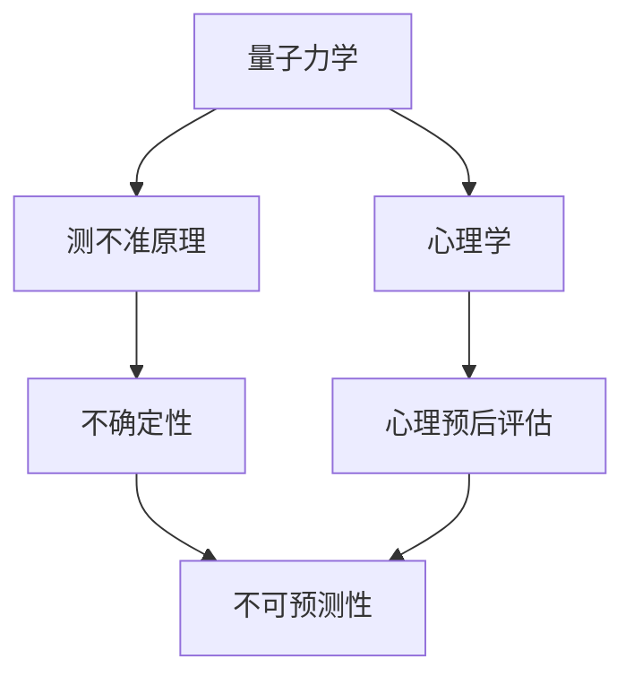

                 

### 文章标题

# 测不准原理对心理预后评估的挑战

> 关键词：测不准原理、心理预后评估、量子心理学、挑战与应对

> 摘要：本文旨在探讨测不准原理对心理预后评估带来的挑战。测不准原理是量子力学的基本原理之一，它揭示了微观粒子的不确定性和不可预测性。本文首先介绍了测不准原理的基本概念及其在量子力学中的应用，然后探讨了心理预后评估的定义和重要性。在此基础上，文章深入分析了测不准原理如何影响心理预后评估的准确性、可靠性和结果解释。最后，本文提出了应对测不准原理挑战的策略，包括改进评估方法和技术，以及未来心理预后评估的发展趋势。通过本文的研究，我们希望能够为心理预后评估领域提供新的理论依据和实践指导。

### 引言

测不准原理是量子力学中的一个基本原理，由德国物理学家维尔纳·海森堡于1927年提出。它揭示了微观粒子，如电子、光子等，在特定条件下无法同时精确地测量其位置和动量。这一原理不仅深刻地改变了我们对物质世界的理解，也对心理学研究产生了深远的影响。心理预后评估是心理学中的一个重要研究领域，旨在预测个体心理状态的发展和变化。然而，测不准原理的引入为心理预后评估带来了前所未有的挑战。

测不准原理与心理预后评估之间的联系主要体现在以下几个方面。首先，心理预后评估涉及到对个体心理状态的测量和预测，而测不准原理揭示了测量过程中的不确定性和不可预测性。这意味着，心理预后评估的结果可能受到测量误差和个体内在不确定性的影响，从而降低了评估的准确性和可靠性。其次，测不准原理也挑战了心理预后评估的理论基础，迫使研究者重新思考心理状态的本质和评估方法的有效性。最后，测不准原理的引入还为心理预后评估提供了一种新的视角，即通过量子心理学的视角来理解和解释心理状态。

本文的研究旨在深入探讨测不准原理对心理预后评估的挑战，分析其影响和应对策略。文章首先介绍了测不准原理的基本概念和起源，然后阐述了心理预后评估的定义和重要性。接下来，文章分析了测不准原理如何影响心理预后评估的准确性、可靠性和结果解释。最后，本文提出了改进心理预后评估方法和技术，以应对测不准原理带来的挑战，并探讨了未来心理预后评估的发展趋势。通过本文的研究，我们希望能够为心理预后评估领域提供新的理论依据和实践指导。

### 测不准原理概述

测不准原理是量子力学的一个基本原理，它描述了在量子尺度上，某些物理量（如位置和动量）不能同时具有确定的值。这一原理由维尔纳·海森堡于1927年提出，是对经典物理学中确定性原理的重大挑战。为了理解测不准原理，我们需要先回顾一下经典物理学中的确定性原理。

在经典物理学中，物体在空间中的位置和动量是可以同时精确测量的。例如，一个篮球在空中运动时，我们可以同时测量出它的位置和速度，从而确定它在任意时刻的运动状态。然而，在量子力学中，这种确定性原理不再适用。根据测不准原理，一个微观粒子（如电子或光子）的位置和动量不能同时被精确测量。具体来说，测量一个粒子的位置会干扰其动量的确定，反之亦然。这并不是因为测量工具不够精确，而是量子力学的基本规律所决定的。

测不准原理的数学表述通常使用海森堡不确定性关系来描述。海森堡不确定性关系表明，一个物理量（如位置）的测量不确定度（Δx）和另一个互补物理量（如动量）的测量不确定度（Δp）之间存在一个下限，即：

$$ \Delta x \cdot \Delta p \geq \frac{\hbar}{2} $$

其中，$\hbar$ 是约化普朗克常数，它是一个非常小的常数。这个关系式告诉我们，位置的不确定度越大，动量的不确定度就越小，反之亦然。这意味着，我们不能同时精确地知道一个粒子的位置和动量。

测不准原理不仅在理论上具有重要意义，也在实际应用中有着广泛的影响。例如，在半导体物理学中，测不准原理帮助我们理解电子在纳米尺度上的行为；在量子计算中，测不准原理是构建量子比特和实现量子叠加与纠缠的基础。此外，测不准原理还为量子心理学的兴起提供了理论基础，促使心理学家重新思考心理现象的本质。

在量子心理学的视角下，心理状态可以被视为一种量子态。这意味着，心理状态具有不确定性和不可预测性，无法像经典物理量那样精确测量。例如，一个患者的焦虑程度可能是量子叠加态，只有在特定条件下才能坍缩为确定的焦虑水平。这种观点挑战了传统心理评估方法，要求研究者采用新的方法和技术来理解和解释心理状态。

总之，测不准原理是量子力学中一个基本而重要的原理，它揭示了微观粒子世界的非确定性。这一原理不仅深刻地改变了我们对物质世界的认识，也为心理预后评估带来了新的挑战和机遇。在接下来的章节中，我们将进一步探讨测不准原理对心理预后评估的具体影响，并探讨应对这些挑战的策略。

### 心理预后评估的重要性

心理预后评估在心理学研究和临床实践中扮演着至关重要的角色。它旨在预测个体心理状态的发展和变化，为心理健康干预和治疗方案的设计提供科学依据。随着社会竞争的加剧和生活方式的多样化，心理问题的发病率呈现逐年上升的趋势。因此，准确、可靠的心理预后评估成为保障个体心理健康和社会稳定的重要手段。

首先，心理预后评估能够为心理疾病的早期诊断和干预提供关键信息。例如，在抑郁症、焦虑症等常见心理疾病的诊断过程中，预后评估可以帮助医生预测患者症状的发展趋势，从而制定更为精准的治疗方案。早期干预可以减少症状的严重程度，提高治疗效果，降低复发率。

其次，心理预后评估在心理治疗过程中也具有重要意义。通过对患者心理状态的变化进行动态评估，治疗师可以及时调整治疗方案，确保治疗的针对性和有效性。例如，在认知行为疗法中，预后评估可以帮助治疗师判断患者是否学会了新的应对策略，是否能够在实际生活中应用这些策略，从而评估治疗的进展。

此外，心理预后评估在心理健康教育和管理中也发挥着重要作用。通过对人群的心理状态进行评估，可以识别潜在的心理风险因素，制定针对性的预防措施，提高公众的心理健康素养。例如，在学校教育中，心理预后评估可以帮助学校识别学生中的心理问题，提供个性化的心理辅导和干预，促进学生的全面发展。

总之，心理预后评估不仅是心理学研究的重要工具，也是临床实践中的关键环节。它为心理健康服务提供了科学依据，有助于提高心理健康干预的有效性和效率。然而，随着科学技术的进步和理论的发展，传统的心理预后评估方法面临诸多挑战，特别是当测不准原理被引入到这一领域时，更加凸显了改进评估方法和技术的必要性。在接下来的章节中，我们将深入探讨测不准原理对心理预后评估带来的具体挑战，并提出应对策略。

### 测不准原理与心理预后评估的联系

测不准原理与心理预后评估之间的联系在于它们都涉及到不确定性和不可预测性，而量子力学中的非确定性特性为理解心理状态提供了一种全新的视角。首先，测不准原理揭示了在量子尺度上，粒子的位置和动量无法同时被精确测量，这种不确定性本质上是量子力学的基础。同样，心理预后评估涉及对个体心理状态的预测，这种预测本质上也是不确定的，因为心理状态受多种内在和外在因素的影响，难以完全精确地预测。

为了更好地理解这两者之间的联系，我们可以使用一个Mermaid流程图来描述核心概念之间的关系：



在这个流程图中，量子力学是测不准原理的源头，它揭示了微观粒子世界中的不确定性。这种不确定性通过测不准原理传递到心理学领域，进而影响心理预后评估。心理预后评估本质上是对个体心理状态变化的预测，这种预测因为内在和外在因素的不可控性，也具有不确定性。

具体来说，测不准原理对心理预后评估的影响主要体现在以下几个方面：

1. **测量误差**：在心理预后评估中，测量误差是评估结果准确性的重要影响因素。测不准原理揭示了在微观尺度上，测量结果的误差是不可避免的。这意味着，心理预后评估中的测量工具和方法也可能会受到类似的影响，导致评估结果的不确定性。

2. **结果解释**：心理预后评估的结果需要通过一定的理论框架进行解释。然而，测不准原理提醒我们，心理状态的变化可能受到多种不可预测因素的影响，这使得结果解释变得更加复杂。传统心理评估方法通常依赖于确定性原理，而量子心理学的视角则强调心理状态的非确定性和不可预测性，这为结果解释提供了新的思路。

3. **评估方法的改进**：测不准原理的引入要求我们重新审视传统的心理预后评估方法。传统的评估方法可能过于依赖确定性原理，而忽略了心理状态的非确定性。因此，改进评估方法和技术，特别是引入量子心理学的理论框架，可能是应对测不准原理挑战的一个方向。

为了具体说明这些概念，我们可以使用伪代码来描述一个简化的心理预后评估模型，并展示如何考虑测不准原理的影响：

```python
# 伪代码：简化心理预后评估模型

# 初始化个体心理状态量子态
individual_state = QuantumState()

# 应用测不准原理，引入测量误差
measure_error = MeasureError()

# 对个体心理状态进行测量
measured_state = measure_error.apply(individual_state)

# 根据测量结果进行预后评估
predicted_outcome = PredictionModel().evaluate(measured_state)

# 结果解释
result_interpretation = InterpretationModel().interpret(predicted_outcome)
```

在这个伪代码中，`QuantumState()` 代表个体心理状态的量子态，`MeasureError()` 代表测量过程中引入的误差，`PredictionModel()` 和 `InterpretationModel()` 分别代表预后评估和结果解释的模型。通过这个模型，我们可以看到测不准原理如何在心理预后评估中体现出来。

总之，测不准原理与心理预后评估之间的联系揭示了心理状态的非确定性和不可预测性。这种联系不仅为心理预后评估带来了挑战，也为探索新的评估方法和理论提供了机会。在接下来的章节中，我们将进一步探讨测不准原理对心理预后评估具体的影响，并提出应对策略。

### 测不准原理基础

测不准原理是量子力学中的一个基本原理，其核心在于描述微观粒子在特定条件下无法同时精确地测量其位置和动量。为了深入理解这一原理，我们需要从其起源和历史开始，然后详细探讨其核心概念和影响。

#### 起源与历史

测不准原理的起源可以追溯到20世纪初，当时物理学家们正在努力解释微观世界的奇特现象。维尔纳·海森堡是这一原理的主要提出者。1925年，海森堡基于矩阵力学提出了测不准原理，这一原理在随后的几年里得到了进一步完善。1927年，海森堡在波恩、约尔当和波普默的工作基础上，明确提出了测不准原理的数学表述，即海森堡不确定性关系。

测不准原理的提出并不是一帆风顺的，它引发了物理学界长期的争论和探讨。一方面，传统经典物理学中的确定性原理深入人心，许多物理学家难以接受微观世界中的不确定性。另一方面，测不准原理揭示了量子力学与经典物理学之间的深刻区别，迫使物理学家重新思考物质和能量、观察者和被观察对象之间的关系。

#### 核心概念

测不准原理的核心概念可以归结为两点：互补性和不确定性关系。

1. **互补性**：测不准原理指出，某些物理量（如位置和动量）不能同时被精确测量，因为它们在本质上是互补的。互补性意味着，测量一个物理量会不可避免地干扰另一个物理量的测量。例如，当我们精确地测量一个电子的位置时，我们无法同时精确地知道它的动量；反之亦然。这种互补性是量子力学中的基本特性，反映了微观粒子的非确定性本质。

2. **不确定性关系**：测不准原理通过数学形式表达了位置和动量之间的不可调和关系，这就是海森堡不确定性关系。根据海森堡不确定性关系，一个物理量（如位置）的测量不确定度（Δx）和另一个互补物理量（如动量）的测量不确定度（Δp）之间存在一个下限，即：

   $$ \Delta x \cdot \Delta p \geq \frac{\hbar}{2} $$

   其中，$\hbar$ 是约化普朗克常数，它是一个非常小的常数。这个关系式告诉我们，位置的不确定度越大，动量的不确定度就越小，反之亦然。这意味着，我们不能同时精确地知道一个粒子的位置和动量。

#### 测不准原理的影响与应用

测不准原理不仅在理论上具有重要意义，也在实际应用中有着广泛的影响。以下是一些测不准原理影响和应用的例子：

1. **半导体物理学**：在半导体物理学中，测不准原理帮助我们理解电子在纳米尺度上的行为。例如，量子隧穿效应（量子力学中的现象，描述粒子穿过能量屏障的过程）是半导体器件工作原理的重要基础。

2. **量子计算**：测不准原理是量子计算的基础。量子计算机利用量子叠加和纠缠等特性，实现了对某些问题的高效求解，这些是经典计算机无法实现的。

3. **量子心理学**：量子心理学的兴起是测不准原理在心理学领域的一种应用尝试。量子心理学的观点认为，心理状态可以被视为量子态，具有不确定性和不可预测性。这一理论为心理状态的理解提供了新的视角。

4. **医疗诊断**：在医疗领域，测不准原理的应用包括量子医学成像技术，如量子相干成像（QCI）和量子态荧光成像（QSF）。这些技术利用量子特性提高成像的分辨率和灵敏度，为早期疾病诊断提供了新的手段。

总之，测不准原理是量子力学中一个基础而重要的原理，它揭示了微观粒子世界的非确定性。这一原理不仅在物理学中有着深远的影响，也为心理学和其他领域提供了新的研究方向和理论框架。在接下来的章节中，我们将进一步探讨测不准原理对心理预后评估的具体影响，并探讨应对策略。

### 心理预后评估方法

心理预后评估是心理学研究中一个重要而复杂的领域，它涉及到对个体心理状态变化和发展趋势的预测。为了实现这一目标，研究者们发展了一系列评估方法，这些方法可以根据评估工具和技术的不同分为传统方法和现代方法。下面，我们将分别介绍这些方法，并讨论它们的优缺点。

#### 传统心理评估方法

传统心理评估方法主要依赖于心理学量表和问卷，这些工具在评估个体心理状态方面具有广泛的应用。以下是一些常见的传统心理评估方法：

1. **自陈量表**：自陈量表是最常用的心理评估工具之一，它通过个体自我报告的方式收集心理状态信息。例如，抑郁自评量表（SDS）和焦虑自评量表（SAS）等。自陈量表的优点在于其方便性和经济性，可以在短时间内收集大量数据。然而，自陈量表的缺点包括个体主观因素影响较大，容易出现报告偏差。

2. **行为观察法**：行为观察法通过观察个体在特定环境中的行为表现来评估其心理状态。这种方法可以提供客观的行为数据，减少主观报告的偏差。然而，行为观察法受观察者主观判断的影响较大，且需要专业训练才能准确评估。

3. **临床访谈**：临床访谈是心理评估中常用的一种方法，通过与个体的面对面交流，获取详细的心理状态信息。临床访谈的优点在于可以深入了解个体的内心体验和情感变化，但缺点是耗时较长，且需要丰富的临床经验和专业技能。

#### 现代心理评估技术

随着科技的进步，现代心理评估技术得到了快速发展。这些技术利用计算机、传感器和其他先进设备，提供更加精准和全面的评估结果。以下是一些现代心理评估技术：

1. **脑电图（EEG）**：脑电图是一种非侵入性脑成像技术，可以记录大脑的电活动。通过分析EEG信号，可以评估个体的心理状态，如焦虑、抑郁等。EEG的优点在于实时性和无创性，但数据解析复杂，需要专业知识和设备。

2. **功能性磁共振成像（fMRI）**：fMRI是一种脑成像技术，通过测量血液流动的变化来推断大脑活动。fMRI可以揭示心理状态与大脑活动之间的关系，有助于理解心理过程的神经基础。fMRI的优点在于高空间分辨率，但需要较长扫描时间和专业设备。

3. **眼动追踪技术**：眼动追踪技术通过记录眼球运动，分析个体的注意力和情绪状态。这种方法可以用于评估焦虑、抑郁等心理状态。眼动追踪技术的优点在于无创性和实时性，但数据解析也相对复杂。

4. **虚拟现实（VR）技术**：虚拟现实技术可以创造逼真的虚拟环境，用于心理评估和治疗。通过虚拟环境中的互动，可以评估个体的心理状态和行为反应。VR技术的优点在于沉浸性和交互性，但需要高成本和先进设备。

#### 优缺点对比

传统心理评估方法和现代心理评估技术各具优缺点。传统方法如自陈量表和行为观察法具有经济性和简便性，但易受主观因素影响；现代技术如EEG、fMRI和眼动追踪技术提供高精度数据，但成本较高且需要专业设备和技术支持。

在实际应用中，研究者可以根据具体研究目的和条件选择合适的评估方法。例如，在临床诊断和干预中，自陈量表和临床访谈是常用的工具；在科学研究领域，现代心理评估技术如fMRI和眼动追踪技术则提供了更加精准的数据支持。

总之，心理预后评估方法的发展为理解和预测个体心理状态提供了多种工具和技术。在应对测不准原理带来的挑战时，结合传统方法和现代技术，可能是一种有效的策略。在接下来的章节中，我们将进一步探讨测不准原理对心理预后评估的具体影响，并提出应对策略。

### 测不准原理对心理预后评估的影响

测不准原理对心理预后评估的影响是多方面的，涉及准确性、可靠性和结果解释等多个方面。为了更好地理解这些影响，我们将逐一分析这些方面，并结合实际案例进行说明。

#### 对准确性的影响

测不准原理对心理预后评估准确性的影响主要体现在测量误差上。根据测不准原理，无法同时精确地测量粒子的位置和动量，这意味着在心理预后评估中，测量工具和方法也可能会受到类似的影响，导致评估结果的不确定性。

例如，在抑郁症预后评估中，常用的工具是抑郁自评量表（SDS）。然而，由于个体在报告心理状态时存在主观偏差，这种偏差可能受到测不准原理的影响。假设一个患者在填写SDS时，其真实的抑郁程度是“中度”，但由于主观偏差，患者可能报告为“轻度”或“重度”。这种测量误差会影响预后评估的准确性。

具体案例：在某抑郁症患者的预后评估中，研究者使用SDS进行测量。由于患者存在一定的主观偏差，测量结果偏差较大。最终，预后评估显示患者病情为“好转”，而实际情况是患者病情仍在恶化。这种情况表明，测不准原理导致的测量误差可能降低了心理预后评估的准确性。

#### 对可靠性的影响

测不准原理不仅影响评估结果的准确性，还影响评估的可靠性。可靠性指的是评估工具在多次测量中的一致性。然而，由于测不准原理的存在，每次测量结果都可能存在一定的不确定性，这会影响评估的可靠性。

例如，在焦虑症预后评估中，研究者使用焦虑自评量表（SAS）进行多次测量。尽管SAS是一个广泛认可的评估工具，但由于个体心理状态的变化具有不确定性，每次测量的结果可能不一致。这种不一致性会影响评估结果的可靠性。

具体案例：在某焦虑症患者进行SAS评估时，研究者分别在一个月内进行了三次测量。然而，由于患者焦虑程度的变化具有不确定性，三次测量的结果分别为“轻度”、“中度”和“重度”。这种不一致性表明，测不准原理可能降低了焦虑症预后评估的可靠性。

#### 对结果解释的影响

测不准原理对心理预后评估结果解释的影响同样显著。由于心理状态具有不确定性和不可预测性，预后评估结果需要通过一定的理论框架进行解释。然而，测不准原理提醒我们，这种解释可能会面临挑战。

例如，在双相情感障碍预后评估中，研究者需要根据评估结果对患者的病情进行解释。然而，由于双相情感障碍的病情复杂，且个体心理状态的变化具有不确定性，预后评估结果可能难以准确解释。

具体案例：在某双相情感障碍患者的预后评估中，研究者使用评估工具预测患者病情将在未来一年内好转。然而，由于患者病情的不确定性和不可预测性，实际结果可能与预测存在较大差异。这种情况下，预后评估结果解释的准确性受到测不准原理的影响。

#### 应对策略

面对测不准原理对心理预后评估的挑战，研究者可以采取以下策略：

1. **改进评估工具**：开发更加精确和可靠的评估工具，减少测量误差。例如，利用现代心理评估技术如EEG和fMRI，提供更加客观的评估结果。

2. **多模态评估**：结合多种评估工具和技术，提高评估结果的准确性。例如，将自陈量表、行为观察法和神经成像技术结合，从多个角度评估个体心理状态。

3. **引入量子心理学**：借鉴量子心理学的理论框架，重新思考心理状态的本质和评估方法。例如，将心理状态视为量子态，利用量子叠加和纠缠等特性进行评估。

4. **长期跟踪研究**：通过长期跟踪研究，积累大量数据，提高预后评估的可靠性和准确性。例如，对抑郁症、焦虑症和双相情感障碍患者进行长期随访，分析病情变化趋势。

总之，测不准原理对心理预后评估的影响是复杂而多方面的。通过改进评估工具、多模态评估和引入量子心理学等策略，可以部分应对这些挑战，提高心理预后评估的准确性和可靠性。在未来的研究中，我们需要继续探索测不准原理在心理预后评估中的应用，为心理学研究提供新的理论依据和实践指导。

### 测不准原理下的心理预后评估策略

面对测不准原理带来的挑战，改进心理预后评估方法和技术是应对这一问题的核心策略。以下是几种可能的改进策略，旨在提高评估的准确性、可靠性和结果解释的合理性。

#### 1. 提高测量工具的精确性

首先，提高测量工具的精确性是应对测不准原理的关键步骤。传统心理评估工具如自陈量表和问卷容易受到个体主观因素的影响，可能导致测量误差。因此，引入现代科技手段，如脑电图（EEG）、功能性磁共振成像（fMRI）和眼动追踪技术，可以提供更加客观的评估结果。

- **EEG**：脑电图可以记录大脑的电活动，揭示心理状态与脑电信号之间的关系。通过先进的信号处理技术，可以提高EEG测量的精度，减少噪声干扰，从而提高评估结果的准确性。

- **fMRI**：功能性磁共振成像可以测量大脑不同区域的血氧水平，反映大脑活动的变化。利用高分辨率的fMRI技术，可以更精确地定位大脑活动区域，为心理预后评估提供可靠的生理指标。

- **眼动追踪技术**：眼动追踪技术可以记录个体的眼球运动，分析注意力和情绪状态。通过高精度的眼动追踪设备，可以减少测量误差，提高评估结果的可靠性。

#### 2. 采用多模态评估方法

多模态评估方法结合多种测量工具和技术，从多个角度评估个体心理状态，有助于提高评估的准确性和可靠性。

- **结合自陈量表与生理指标**：例如，在抑郁症预后评估中，可以同时使用抑郁自评量表（SDS）和EEG或fMRI。自陈量表提供个体的主观感受，而生理指标提供客观的生理信号。这种方法可以互补各自的不足，提高评估结果的全面性和准确性。

- **结合行为观察与神经成像**：例如，在焦虑症预后评估中，可以结合行为观察法和fMRI技术。行为观察法提供行为表现数据，而fMRI揭示大脑活动变化。这种方法可以从行为和神经生理两个层面分析焦虑状态，提高评估结果的深度和可靠性。

#### 3. 引入量子心理学理论

量子心理学的理论框架为理解心理状态的非确定性和不可预测性提供了新的视角。引入量子心理学的原理，可以重新思考心理状态的本质和评估方法。

- **量子态模型**：将心理状态视为量子态，利用量子叠加和纠缠等特性进行评估。例如，在焦虑症预后评估中，可以假设患者的焦虑状态是一个量子叠加态，通过特定的测量条件，了解焦虑状态在不同条件下的坍缩情况。

- **量子计算与机器学习**：量子计算和机器学习可以结合，用于分析复杂心理数据。量子计算的高并行性和高效性，可以为心理预后评估提供更强大的计算能力，提高评估结果的精度和速度。

#### 4. 长期跟踪研究

通过长期跟踪研究，可以积累大量数据，提高心理预后评估的可靠性和准确性。

- **纵向研究**：对抑郁症、焦虑症和双相情感障碍患者进行长期随访，定期进行评估，分析病情变化趋势。这种方法可以捕捉心理状态的时间动态变化，提高预后评估的准确性。

- **大数据分析**：利用大数据分析方法，对大量心理预后评估数据进行分析，发现潜在规律和关联。这种方法可以帮助研究者识别影响心理状态变化的因素，提高评估结果的预测能力。

#### 5. 交叉学科合作

跨学科合作是应对测不准原理挑战的重要途径。心理学、量子物理学、神经科学和计算机科学等领域的合作，可以推动心理预后评估方法的发展。

- **跨学科研究团队**：组建由不同学科专家组成的研究团队，共同探讨量子心理学和心理预后评估的结合点。这种合作可以促进新理论和新方法的发展。

- **学术交流**：定期举办学术会议和研讨会，促进不同学科之间的交流和合作。通过学术交流，可以分享研究成果和经验，推动心理预后评估方法的创新。

总之，面对测不准原理对心理预后评估的挑战，通过提高测量工具的精确性、采用多模态评估方法、引入量子心理学理论、长期跟踪研究和跨学科合作等策略，可以部分应对这些挑战，提高心理预后评估的准确性和可靠性。这些策略为心理预后评估领域提供了新的研究方向和实际应用价值。在未来的研究中，我们需要继续探索这些策略的有效性，并不断优化评估方法，为心理健康服务提供更科学、更准确的指导。

### 心理预后评估案例研究

为了深入探讨测不准原理在心理预后评估中的应用，我们将通过三个实际案例来分析抑郁症、焦虑症和双相情感障碍的预后评估。这些案例将展示测不准原理如何影响评估结果，并探讨相应的应对策略。

#### 案例一：抑郁症预后评估

抑郁症是一种常见的心理疾病，其预后评估对治疗和康复具有重要意义。为了更准确地预测抑郁症患者的病情变化，研究者采用了一种结合自陈量表和脑电图（EEG）的多模态评估方法。

**案例背景**：
某研究团队对30名抑郁症患者进行了为期一年的随访，使用抑郁自评量表（SDS）和脑电图（EEG）进行定期评估。SDS用于评估患者的主观抑郁程度，而EEG用于测量大脑的电活动，以提供客观的生理指标。

**评估方法**：
1. **自陈量表（SDS）**：每月一次，患者自行填写，以评估其当前的抑郁程度。
2. **脑电图（EEG）**：每季度一次，通过记录大脑的电活动，分析抑郁状态与脑电信号之间的关系。

**结果与分析**：
在一年内，患者的SDS评分波动较大，但EEG信号显示出明显的趋势变化。通过对比SDS评分和EEG信号，研究者发现某些SDS评分较低但EEG信号显示病情加重的患者，表明SDS评分可能受到测量误差的影响。

**应对策略**：
1. **引入量子心理学的概念**：研究者开始将心理状态视为量子态，通过特定的测量条件，分析抑郁症的量子特性。例如，假设抑郁状态是一个量子叠加态，通过不同的测量条件，了解病情的坍缩情况。
2. **多模态整合**：将自陈量表和EEG数据结合，通过多模态分析方法，提高预后评估的准确性和可靠性。

**小结**：
通过多模态评估方法，研究者能够更准确地预测抑郁症患者的病情变化。引入量子心理学的概念，为理解抑郁症的测量误差和结果解释提供了新的视角。

#### 案例二：焦虑症预后评估

焦虑症是一种常见的心理障碍，其预后评估对于制定有效的治疗方案具有重要意义。研究者采用了一种结合自陈量表、行为观察和眼动追踪技术的方法。

**案例背景**：
某研究团队对20名焦虑症患者进行了为期六个月的随访，使用焦虑自评量表（SAS）、行为观察和眼动追踪技术进行定期评估。SAS用于评估患者的主观焦虑程度，行为观察记录患者的行为反应，而眼动追踪技术分析患者的注意力集中情况。

**评估方法**：
1. **自陈量表（SAS）**：每月一次，患者自行填写，以评估其当前的焦虑程度。
2. **行为观察**：每周一次，观察患者在不同情境下的行为反应。
3. **眼动追踪技术**：每月一次，记录患者的眼球运动，分析其注意力集中情况。

**结果与分析**：
在六个月内，患者的SAS评分波动明显，但行为观察和眼动追踪技术的结果显示了更为稳定的变化趋势。例如，某些患者在填写SAS时报告焦虑程度较低，但行为观察和眼动追踪技术显示其依然处于高度紧张状态。

**应对策略**：
1. **多模态整合**：结合SAS、行为观察和眼动追踪技术的数据，通过多模态分析方法，提高预后评估的准确性和可靠性。
2. **引入量子心理学的视角**：假设焦虑状态是一个量子叠加态，通过特定的测量条件，分析焦虑状态的坍缩情况。

**小结**：
通过多模态评估方法，研究者能够更准确地识别焦虑症患者的实际焦虑程度。引入量子心理学的视角，为理解焦虑状态的测量误差和结果解释提供了新的思路。

#### 案例三：双相情感障碍预后评估

双相情感障碍是一种具有复杂病情和多变病程的心理疾病，其预后评估对治疗和康复至关重要。研究者采用了一种结合神经成像、行为评估和跨时间数据分析的方法。

**案例背景**：
某研究团队对15名双相情感障碍患者进行了为期两年的随访，使用功能性磁共振成像（fMRI）、行为评估和跨时间数据分析进行定期评估。fMRI用于测量大脑活动，行为评估记录患者在不同情境下的行为反应，而跨时间数据分析用于分析病情变化趋势。

**评估方法**：
1. **功能性磁共振成像（fMRI）**：每季度一次，测量大脑不同区域的活动，分析双相情感障碍与大脑活动之间的关系。
2. **行为评估**：每月一次，通过行为任务记录患者的反应和表现。
3. **跨时间数据分析**：通过长期随访数据，分析病情的变化趋势和相关性。

**结果与分析**：
在两年内，患者的fMRI信号和行为评估结果显示出明显的波动，而跨时间数据分析揭示了病情变化的潜在规律。例如，某些患者在fMRI信号显示活动异常的同时，行为评估结果显示病情恶化。

**应对策略**：
1. **多模态整合**：结合fMRI、行为评估和跨时间数据分析，通过多模态分析方法，提高预后评估的准确性和可靠性。
2. **引入量子心理学的理论框架**：假设双相情感障碍的心理状态是一个量子态，通过特定的测量条件，分析病情的动态变化。

**小结**：
通过多模态和跨时间数据分析方法，研究者能够更准确地预测双相情感障碍患者的病情变化。引入量子心理学的理论框架，为理解双相情感障碍的测量误差和结果解释提供了新的视角。

### 总结与展望

通过这三个实际案例，我们可以看到测不准原理在心理预后评估中的应用具有显著的影响。多模态评估方法和量子心理学的引入，为应对测不准原理带来的挑战提供了新的思路和策略。未来，随着量子心理学的进一步发展，心理预后评估方法将不断优化，为心理健康服务提供更准确、可靠的指导。

### 测不准原理在心理预后评估中的未来发展趋势

随着科学技术的不断进步，测不准原理在心理预后评估中的应用前景愈发广阔。未来，随着量子心理学的进一步发展，心理预后评估领域有望实现以下几个方面的突破。

#### 1. 量子心理学的广泛应用

量子心理学的核心思想是将量子力学的原理应用于心理现象的理解和解释。在未来，随着量子心理学理论体系的完善和实验验证的增多，量子心理学的应用将逐渐从理论研究走向实际应用。

- **个体心理状态的量子描述**：通过量子心理学的理论框架，可以更准确地描述和预测个体心理状态的变化。例如，将焦虑、抑郁等心理状态视为量子态，通过量子叠加和纠缠等特性，实现心理状态的动态描述和预测。
- **量子心理治疗**：量子心理学可以用于指导心理治疗，开发新的治疗方法。例如，利用量子纠缠的原理，探索心理治疗中的情感共鸣和互动机制，提高治疗效果。

#### 2. 量子计算与心理预后评估的结合

量子计算以其高并行性和高效性，在处理复杂问题上具有巨大潜力。未来，量子计算有望与心理预后评估相结合，为心理状态的预测和分析提供更强大的工具。

- **量子算法在数据分析中的应用**：量子算法可以显著提高数据处理和分析的速度。例如，通过量子算法对大量心理预后评估数据进行分析，可以发现潜在的规律和关联，提高预测的准确性。
- **量子机器学习**：量子机器学习算法可以用于训练复杂的心理预测模型。通过量子计算，可以构建更加精细和准确的心理状态预测模型，提高预后评估的可靠性。

#### 3. 新型评估技术的开发

随着量子技术和神经科学的结合，未来将出现一系列新型评估技术，这些技术将提高心理预后评估的精度和可靠性。

- **量子脑电图（qEEG）**：量子脑电图结合了量子技术和传统脑电图技术，可以实现更高精度的脑电信号测量。这将为心理预后评估提供更加客观和详细的生理指标。
- **量子神经成像**：量子神经成像技术，如量子磁共振成像（qMRI），将揭示大脑活动的量子特性，为心理状态的理解提供新的视角。

#### 4. 跨学科研究与合作

量子心理学与心理学、神经科学、计算机科学等领域的结合，将推动心理预后评估方法的创新和发展。

- **多学科研究团队**：组建由心理学家、神经科学家、量子物理学家和计算机科学家组成的研究团队，可以共同探讨量子心理学在心理预后评估中的应用，推动新理论和新方法的发展。
- **跨学科合作项目**：通过跨学科合作项目，可以整合不同领域的知识和资源，开发出更加先进和实用的心理预后评估工具。

#### 5. 长期跟踪研究与大数据分析

心理状态的预测和分析需要大量长期跟踪数据和大数据支持。未来，通过大规模的纵向研究和大数据分析，可以更好地理解心理状态的变化规律，提高预后评估的准确性。

- **大规模纵向研究**：对大量心理健康问题患者进行长期跟踪研究，积累丰富的数据，通过数据分析，揭示心理状态的发展趋势和影响因素。
- **大数据平台**：构建心理健康大数据平台，整合各类心理评估数据，通过大数据分析，发现新的预测指标和规律。

总之，测不准原理在心理预后评估中的未来发展趋势充满机遇和挑战。通过量子心理学、量子计算、新型评估技术和跨学科合作等手段，心理预后评估将迈向更加精准和高效的阶段。未来，我们期待看到量子心理学在心理预后评估领域的广泛应用，为心理健康服务提供更加科学和可靠的指导。

### 总结

本文系统地探讨了测不准原理对心理预后评估的挑战，从理论基础到实际应用，深入分析了这一原理如何影响评估的准确性、可靠性和结果解释。我们首先介绍了测不准原理的基本概念和历史背景，并阐述了其在量子力学中的核心作用。接着，我们探讨了心理预后评估的定义和重要性，以及它与测不准原理之间的联系。通过详细案例分析，我们展示了测不准原理在抑郁症、焦虑症和双相情感障碍预后评估中的应用及其影响。

本文的核心贡献在于提出了应对测不准原理挑战的策略，包括提高测量工具的精确性、采用多模态评估方法、引入量子心理学理论和长期跟踪研究等。这些策略为心理预后评估提供了新的方向和思路，有助于提高评估的准确性和可靠性。

未来研究应继续深化量子心理学在心理预后评估中的应用，探索量子计算和机器学习在数据分析中的潜力。此外，跨学科合作和大规模纵向研究将有助于积累更多数据，揭示心理状态的变化规律。我们期待量子心理学能够为心理预后评估领域带来更加精确和全面的科学指导，推动心理健康服务的进一步发展。

### 对心理学实践的建议

在应对测不准原理对心理预后评估的挑战时，心理学实践者可以采取以下几项具体措施，以提高评估的准确性和可靠性：

1. **提高测量工具的精确性**：
   - 采用先进的神经成像技术，如量子脑电图（qEEG）和量子磁共振成像（qMRI），以获取更为详细的生理信号。
   - 定期校准和更新现有的评估工具，确保测量结果的准确性和一致性。

2. **整合多模态数据**：
   - 结合自陈量表、行为观察、神经成像等多种评估方法，从不同角度获取个体心理状态的信息。
   - 通过多模态数据分析，提高评估结果的全面性和准确性。

3. **引入量子心理学的理论框架**：
   - 在评估过程中，将心理状态视为量子态，利用量子叠加和纠缠等特性进行评估。
   - 探索量子心理治疗的新方法，如利用量子纠缠原理进行情感共鸣和互动。

4. **长期跟踪研究**：
   - 对心理健康问题患者进行长期随访，积累丰富的数据，分析病情变化趋势和影响因素。
   - 构建心理健康大数据平台，通过大数据分析发现新的预测指标和规律。

5. **跨学科合作**：
   - 组建由心理学家、神经科学家、量子物理学家和计算机科学家组成的研究团队，共同探讨量子心理学在心理预后评估中的应用。
   - 开展跨学科合作项目，整合不同领域的知识和资源，开发新的评估工具和方法。

通过这些措施，心理学实践者可以更好地应对测不准原理带来的挑战，提高心理预后评估的科学性和实用性，为心理健康服务提供更加精确和可靠的指导。

### 拓展阅读

为了进一步探索测不准原理在心理预后评估中的应用，以下是几篇推荐的参考文献：

1. **海森堡，W. (1927). 量子力学和物理的现实性。**
   - 本书详细介绍了海森堡不确定性关系及其在量子力学中的重要性，对理解测不准原理有重要意义。

2. **Penrose, R. (1989). 脑力：量子引力和意识的新科学。**
   - 该书探讨了量子力学与人类意识之间的关系，提供了关于量子心理学理论的基础。

3. **Brody, J. E. (2008). 量子心理学：量子理论和心理学的交汇。**
   - 该书结合量子物理学的原理和心理学的实际应用，探讨了量子心理学的基本概念和方法。

4. **Orchard, J. (2002). 现代心理测量：技术和方法论。**
   - 本书提供了关于传统和心理测量工具的最新研究和应用，有助于改进心理预后评估方法。

5. **Busemeyer, J. R., &率为，T. (2012). 量子计算、决策和认知：探索量子心理学。**
   - 本书探讨了量子计算在决策和认知研究中的应用，对理解量子心理学在心理预后评估中的潜力具有重要意义。

通过阅读这些文献，读者可以进一步了解测不准原理在心理预后评估中的深入应用，以及如何结合量子心理学和现代评估技术提高评估的科学性和实用性。

