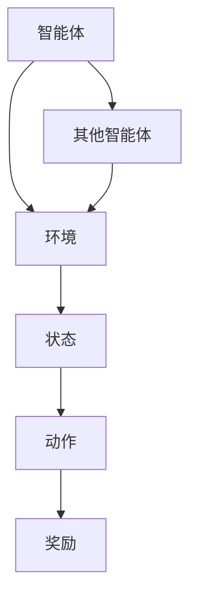

                 

### 深度强化学习在多智能体推理协作中的应用

#### 关键词：深度强化学习，多智能体系统，推理协作，数学模型，项目实战

#### 摘要：
本文将深入探讨深度强化学习在多智能体推理协作中的应用。首先，介绍深度强化学习和多智能体系统的基础概念及其重要性。接着，详细解析深度强化学习的基本算法原理，并展示如何将其应用于多智能体系统。随后，通过数学模型和公式，阐述多智能体推理协作中的关键机制。最后，通过实际项目实战，展示如何实现和解读源代码，并总结多智能体推理协作中的最佳实践和未来研究方向。

---

## 引言与背景

### 1.1 深度强化学习概述

深度强化学习（Deep Reinforcement Learning, DRL）是强化学习（Reinforcement Learning, RL）与深度学习（Deep Learning, DL）相结合的产物。它旨在通过智能体（agent）与环境（environment）的交互，学习到最优的策略（policy）以最大化累积奖励（cumulative reward）。

强化学习的基本框架包括四个要素：智能体、环境、状态（state）和动作（action）。智能体根据当前状态选择动作，环境对动作进行响应并给出奖励和新的状态。智能体的目标是学习到最优策略，以最大化长期累积奖励。

深度强化学习则通过引入深度神经网络，处理复杂的高维状态空间和动作空间，从而在许多实际问题中取得了显著的效果。DRL的应用场景非常广泛，包括但不限于游戏、机器人控制、推荐系统、自动驾驶等。

### 1.2 多智能体推理协作的重要性

多智能体系统（Multi-Agent Systems, MAS）由多个智能体组成，这些智能体可以通过相互协作或竞争来实现共同的目标。在多智能体推理协作中，智能体不仅需要独立决策，还需要基于共享信息和局部知识进行协作，以优化整体性能。

多智能体推理协作的重要性在于：

1. **复杂性管理**：多智能体系统能够通过分布式计算和协作来处理复杂问题，降低单智能体系统的复杂性。
2. **资源优化**：通过智能体之间的协作，可以更有效地分配和利用资源。
3. **鲁棒性提升**：多智能体系统在应对不确定性和动态变化时，具有更高的鲁棒性。
4. **灵活性增强**：多智能体系统可以适应不同的环境和任务，实现更灵活的解决方案。

### 1.3 当前研究现状与挑战

深度强化学习在多智能体推理协作中的应用研究已经取得了一定的进展，但仍面临诸多挑战：

1. **通信与协调**：多智能体之间的通信和协调是确保系统稳定和高效运行的关键，但如何实现低延迟、高可靠性的通信仍是一个难题。
2. **收敛速度与稳定性**：深度强化学习算法在多智能体系统中的收敛速度和稳定性尚未得到充分验证，尤其是在高维状态空间和动作空间下。
3. **公平性**：在多智能体系统中，如何确保每个智能体都能获得公平的收益和资源，避免“囚徒困境”等问题，是一个亟待解决的问题。
4. **安全性**：在多智能体推理协作中，智能体的决策可能会对系统产生不可预测的影响，确保系统的安全性至关重要。

下一节将详细探讨深度强化学习的基本概念和原理，为后续章节的分析打下基础。在接下来的内容中，我们将逐步深入探讨深度强化学习的核心概念与联系，以及如何将其应用于多智能体系统。首先，我们需要明确深度强化学习的基本框架和组成部分。

---

### 核心概念与联系

深度强化学习（DRL）的核心概念主要包括智能体（Agent）、环境（Environment）、状态（State）、动作（Action）和奖励（Reward）。这些概念相互关联，构成了DRL的基础架构。以下是这些核心概念的详细定义及其在DRL中的角色：

#### 智能体（Agent）

智能体是DRL系统中的核心组件，它代表了一个学习实体，负责在环境中执行动作并从环境中接收反馈。智能体的目标是学习一个策略，以最大化累积奖励。智能体可以是机器人、虚拟代理或任何能够与环境交互的实体。

#### 环境（Environment）

环境是智能体所处的场景，它为智能体提供状态信息，并对智能体执行的动作做出响应。环境可以是物理环境，如机器人操作环境，也可以是虚拟环境，如模拟游戏场景。环境负责维持状态的转换和奖励的分配。

#### 状态（State）

状态是智能体在某一时刻的内部和外部条件的集合，它反映了环境的当前状态。在DRL中，状态通常是一个高维向量，由多个特征组成。状态的选择和表示对于智能体的决策和学习至关重要。

#### 动作（Action）

动作是智能体在某一状态下可以执行的行为。动作的选择取决于智能体的策略。在DRL中，动作可以是离散的，也可以是连续的，这取决于具体的应用场景。

#### 奖励（Reward）

奖励是环境对智能体动作的即时反馈，它反映了动作的质量。奖励可以是正面的，也可以是负面的，智能体的目标是通过学习找到能够带来正面奖励的动作序列。

#### DRL与多智能体系统的关系

深度强化学习在多智能体系统中的应用涉及到多个智能体之间的协作和竞争。多智能体系统中的智能体不仅需要独立决策，还需要考虑其他智能体的行为和系统整体的目标。

**核心概念之间的联系**：

1. **智能体间的交互**：智能体通过环境进行信息交换，从而实现交互。这种交互是多智能体系统实现协作和协调的关键。
2. **状态共享**：多智能体系统中的智能体可以共享部分或全部状态信息，这有助于智能体之间进行协作和策略协调。
3. **联合奖励**：在多智能体系统中，奖励往往不是单一智能体的独立指标，而是基于系统整体性能的联合奖励。这意味着智能体需要学习如何通过协作来实现共同的目标。
4. **策略协调**：智能体之间的策略协调是多智能体系统成功的关键。通过共享信息和协调策略，智能体可以实现更高效和鲁棒的合作。

为了更好地理解这些概念之间的联系，我们可以使用Mermaid流程图来展示DRL在多智能体系统中的应用架构。以下是DRL与多智能体系统的关系架构图：



**图解**：

- **智能体A与环境B之间的交互**：智能体A根据环境B提供的当前状态C进行决策，并执行动作D。环境B对动作D做出响应，给出奖励E。
- **状态共享**：智能体A与其他智能体F之间通过环境B共享状态信息。
- **策略协调**：智能体A和其他智能体F通过共享信息和协调策略，实现系统整体性能的最优化。

通过上述核心概念和关系的介绍，我们为后续章节的深入分析奠定了基础。接下来，我们将详细讲解深度强化学习的基本算法原理，包括Q-learning、Deep Q-Networks (DQN)、Policy Gradients和actor-critic方法。

---

### 深度强化学习原理

深度强化学习（DRL）是一类结合了深度学习和强化学习的算法，旨在通过智能体（Agent）与环境（Environment）的交互，学习到最优的策略（Policy）以最大化累积奖励（Cumulative Reward）。本节将详细介绍几种常用的DRL算法，包括Q-learning、Deep Q-Networks (DQN)、Policy Gradients和actor-critic方法，并分析它们的优缺点。

#### Q-learning算法

**基本原理**：

Q-learning是一种基于值函数的强化学习算法，旨在通过学习状态-动作值函数（Q-function）来最大化累积奖励。Q-learning的基本思想是，对于每个状态-动作对，计算其期望回报，并更新Q值。

**伪代码**：

```python
Initialize Q(s, a) randomly
for episode in total_episodes:
    for each step in episode:
        if not done:
            s = observe_state()
            a = choose_action(s)
            next_s, reward, done = step(s, a)
            Q(s, a) = Q(s, a) + alpha * (reward + gamma * max(Q(next_s, a)) - Q(s, a))
            s = next_s
```

**优点**：

- 简单易实现。
- 对连续状态和动作空间具有较好的适应性。

**缺点**：

- 学习速度较慢，特别是在高维状态空间和动作空间下。
- 需要大量的样本数据来收敛。

#### Deep Q-Networks (DQN)

**基本原理**：

DQN是基于Q-learning的改进算法，通过引入经验回放（Experience Replay）和深度神经网络（Deep Neural Network, DNN）来提高学习效率和稳定性。DQN使用DNN来近似Q函数，从而处理高维状态空间。

**伪代码**：

```python
Initialize DQN
Initialize experience replay buffer
for episode in total_episodes:
    for each step in episode:
        if not done:
            s = observe_state()
            a = choose_action(s)
            next_s, reward, done = step(s, a)
            experience = (s, a, reward, next_s, done)
            append_to_replay_buffer(experience)
            sample_batch_from_replay_buffer()
            update_DQN(s, a, reward, next_s, done)
            s = next_s
```

**优点**：

- 通过经验回放，减少了样本的相关性，提高了学习效率。
- 通过DNN近似Q函数，处理高维状态空间。

**缺点**：

- DQN的训练过程可能不稳定，容易陷入过拟合。
- DQN在处理连续动作空间时存在挑战。

#### Policy Gradients

**基本原理**：

Policy Gradients方法通过直接优化策略参数来最大化累积奖励。Policy Gradients的核心思想是，通过梯度上升法来更新策略参数。

**伪代码**：

```python
Initialize policy parameters
for episode in total_episodes:
    for each step in episode:
        if not done:
            s = observe_state()
            a = choose_action(s, policy)
            next_s, reward, done = step(s, a)
            gradients = compute_gradients(log_pi(s, a))
            update_policy(gradients)
            s = next_s
```

**优点**：

- 策略梯度方法可以直接优化策略，避免了值函数的估计问题。
- 在某些场景下，Policy Gradients的学习效率较高。

**缺点**：

- Policy Gradients对噪声敏感，可能导致不稳定的学习过程。
- 需要大量的样本数据来收敛。

#### actor-critic方法

**基本原理**：

actor-critic方法结合了策略优化和价值评估。其中，actor代表策略网络，负责生成动作概率分布；critic代表价值网络，负责评估策略的优劣。

**伪代码**：

```python
Initialize actor network, critic network
for episode in total_episodes:
    for each step in episode:
        if not done:
            s = observe_state()
            a = sample_action_from_actor(s)
            next_s, reward, done = step(s, a)
            G = compute_returns(reward, done)
            critic_loss = critic_loss_function(s, a, G)
            actor_loss = actor_loss_function(s, a)
            optimize_critic(critic_loss)
            optimize_actor(actor_loss)
            s = next_s
```

**优点**：

- 结合了策略优化和价值评估的优点，能够更稳定地学习。
- 通过两个独立的网络，能够更准确地估计策略和价值。

**缺点**：

- 训练过程复杂，需要同时优化两个网络。
- 在某些场景下，actor和critic之间的协调可能是一个挑战。

综上所述，深度强化学习有多种算法可供选择，每种算法都有其独特的优势和局限性。在实际应用中，需要根据具体问题和需求选择合适的算法，并通过调整超参数和优化策略来提高学习效率和性能。

在下一节中，我们将进一步探讨多智能体系统的基本概念，包括智能体的定义、分类以及多智能体系统的协作机制。

---

### 多智能体系统

多智能体系统（Multi-Agent Systems, MAS）是由多个自主智能体（agent）组成的系统，这些智能体可以通过交互和协作来实现共同的目标。在多智能体系统中，智能体不仅具有自主性，还需要具备协调和合作的能力。本节将详细介绍多智能体系统的定义、分类以及协作机制。

#### 智能体的定义

智能体是一个可以感知环境、自主决策并执行动作的实体。智能体可以是物理实体，如机器人、无人机，也可以是虚拟代理，如计算机程序或软件代理。智能体的基本特征包括：

- **自主性**：智能体具有独立决策的能力，不受外部直接控制。
- **适应性**：智能体能够根据环境变化调整其行为。
- **协同性**：智能体能够与其他智能体进行交互和协作，以实现共同目标。
- **适应性**：智能体能够根据环境变化和任务需求调整其行为。

#### 智能体的分类

智能体可以根据不同的特征进行分类：

1. **按决策方式分类**：
   - **规则驱动智能体**：基于预定义的规则进行决策。
   - **数据驱动智能体**：基于数据分析和机器学习模型进行决策。
   - **混合智能体**：同时结合规则驱动和数据驱动进行决策。

2. **按协作方式分类**：
   - **独立智能体**：各智能体独立决策，不依赖于其他智能体。
   - **合作智能体**：各智能体之间存在协作和共享信息，共同实现目标。
   - **竞争智能体**：各智能体之间存在竞争关系，争夺有限资源。

3. **按控制方式分类**：
   - **集中式智能体**：系统由中央控制器统一指挥，各智能体接受中央指令。
   - **分布式智能体**：各智能体独立决策，通过局部信息进行协作。

#### 多智能体系统的协作机制

在多智能体系统中，智能体之间的协作是实现系统整体性能优化的重要手段。协作机制可以分为以下几类：

1. **信息共享**：智能体通过共享状态信息和决策结果，协同完成系统任务。
2. **协调策略**：智能体之间通过协调策略来优化整体行为，减少冲突和竞争。
3. **博弈论**：在存在竞争关系的多智能体系统中，博弈论提供了一种分析框架，以最大化各智能体的收益。
4. **共识算法**：多智能体系统中的共识算法用于实现一致性的决策，如分布式计算中的共识算法。

#### 稳定性和平衡

多智能体系统的稳定性和平衡是确保系统长期运行的关键。稳定性指系统在面对外部扰动时能够保持稳定状态，不发生崩溃或混乱。平衡指系统在长时间运行中，各个智能体能够实现其各自的目标，同时系统整体保持稳定。

1. **静态稳定**：系统在某个时刻处于稳定状态，不会因为外部扰动而改变。
2. **动态稳定**：系统在一段时间内处于稳定状态，能够应对外部扰动。
3. **平衡点**：在多智能体系统中，各智能体在某个状态下，能够长期保持不变。

#### 应用场景

多智能体系统在许多领域都有广泛的应用，包括但不限于：

1. **智能交通**：智能交通系统通过车辆间的信息共享和协调，优化交通流量，减少拥堵。
2. **无人机群**：无人机群通过协同控制，实现搜索、救援、监控等任务。
3. **供应链管理**：多智能体系统可以优化供应链中的库存管理和物流调度。
4. **社交网络**：社交网络中的用户和平台通过协作，实现信息传播和资源优化。

通过以上对多智能体系统的定义、分类和协作机制的分析，我们可以更好地理解多智能体系统在复杂环境中的运作方式。在下一节中，我们将深入探讨多智能体推理协作中的关键机制，包括智能体间的通信、决策以及协同策略。

---

### 推理协作机制

在多智能体系统中，推理协作机制是确保智能体之间能够有效沟通、协调和合作的关键。推理协作机制不仅涉及智能体之间的信息交换和决策过程，还包括策略协调和合作策略的设计。本节将详细探讨这些机制，并分析智能体在不同环境下的行为模式。

#### 智能体的通信与决策

1. **通信机制**：
   - **直接通信**：智能体通过直接发送消息进行通信，这种方式在分布式系统中较为常见。
   - **广播通信**：智能体通过广播消息，向系统中的所有智能体传递信息。
   - **中介通信**：智能体通过中介节点进行通信，中介节点负责消息的传输和协调。

2. **决策过程**：
   - **集中式决策**：所有智能体共享决策权，通过集中式算法进行全局决策。
   - **分布式决策**：每个智能体独立决策，基于局部信息和全局目标进行局部优化。

#### 智能体的混合策略

在多智能体系统中，智能体的行为模式可能是多样化的，不同的智能体可能采用不同的策略。混合策略是指智能体在不同情况下采取不同策略的决策过程。以下是几种常见的混合策略：

1. **随机策略**：智能体在特定概率下随机选择动作。
2. **探索-利用策略**：智能体在初期通过探索环境来获取信息，随着经验的积累，逐渐利用已有信息进行决策。
3. **平衡策略**：智能体在探索和利用之间保持平衡，根据环境变化调整策略。

#### 智能体的行为模式与协调策略

智能体的行为模式取决于其目标、环境以及与其他智能体的交互。以下是几种常见的智能体行为模式及其协调策略：

1. **合作行为模式**：智能体在合作中共享资源、信息，共同实现系统目标。
   - **协调策略**：通过协商和沟通，确保智能体之间的行为协调一致。

2. **竞争行为模式**：智能体在竞争中争夺资源，追求个体利益最大化。
   - **协调策略**：通过博弈论模型，设计公平的竞争机制，确保系统整体性能。

3. **避障行为模式**：智能体在复杂环境中避免碰撞和冲突。
   - **协调策略**：通过路径规划和避障算法，实现智能体间的避障协作。

4. **自适应行为模式**：智能体根据环境变化和任务需求，调整自身行为策略。
   - **协调策略**：通过自适应算法，实现智能体对环境的快速适应和响应。

#### 不同环境下的协作机制

不同环境下的多智能体系统需要不同的协作机制，以应对特定的挑战。以下是几种典型环境下的协作机制：

1. **静态环境**：
   - **协作机制**：通过预先定义的规则和策略，实现智能体间的稳定协作。
   - **挑战**：智能体间的通信和协调相对简单，但策略需要根据环境变化进行动态调整。

2. **动态环境**：
   - **协作机制**：智能体通过实时通信和动态决策，实现灵活的协作。
   - **挑战**：智能体需要快速适应环境变化，并保持协作的稳定性和鲁棒性。

3. **复杂环境**：
   - **协作机制**：智能体通过复杂的策略和协调机制，实现高效的合作。
   - **挑战**：智能体间的交互复杂，需要高效的信息传递和协调算法。

#### 案例分析

以智能交通系统为例，智能车辆通过V2V（Vehicle-to-Vehicle）通信和V2I（Vehicle-to-Infrastructure）通信，实现实时信息共享和路径规划。车辆之间通过协同决策，避免交通拥堵和事故，提高交通效率。

1. **通信与决策**：
   - 智能车辆通过V2V通信，共享位置、速度和行驶方向等信息。
   - 基于共享信息，车辆采用协同决策算法，实时调整行驶路径。

2. **协作策略**：
   - 采用分布式路径规划算法，实现智能车辆间的协同行驶。
   - 通过博弈论模型，确保车辆在竞争环境中实现公平和高效的合作。

3. **结果分析**：
   - 实验结果显示，智能交通系统显著降低了交通拥堵和事故发生率，提高了道路通行效率。

通过以上分析，我们可以看到推理协作机制在多智能体系统中的重要性。在下一节中，我们将详细阐述多智能体推理协作中的数学模型与公式，进一步探讨状态空间、动作空间、奖励函数设计、策略评估与优化以及多智能体博弈论模型。

---

### 数学模型与公式

在多智能体推理协作中，数学模型与公式是描述和实现智能体行为的重要工具。这些模型和公式不仅提供了理论基础，还为算法设计和实现提供了具体的指导。本节将详细讨论多智能体系统中的关键数学模型与公式，包括状态空间、动作空间、奖励函数设计、策略评估与优化，以及多智能体博弈论模型。

#### 状态空间与动作空间

1. **状态空间（State Space）**：
   状态空间是多智能体系统中智能体可以处于的所有可能状态的集合。状态空间通常表示为 $S$，每个状态 $s \in S$ 是一个多维向量，表示智能体在某一时刻的内部和外部条件。例如，在智能交通系统中，每个车辆的状态可以包括位置、速度、加速度、周围车辆信息等。

   $$ s = [s_1, s_2, ..., s_n]^T $$

2. **动作空间（Action Space）**：
   动作空间是多智能体系统中智能体可以执行的所有可能动作的集合。动作空间通常表示为 $A$，每个动作 $a \in A$ 是一个多维向量，表示智能体在某一状态下的决策。例如，在智能交通系统中，每个车辆的动作可以是加速、减速、转弯等。

   $$ a = [a_1, a_2, ..., a_m]^T $$

#### 奖励函数设计

奖励函数是多智能体系统中用于评估智能体行为质量的函数，通常表示为 $R(s, a)$。奖励函数设计的关键是确保它能鼓励智能体采取有助于实现系统目标的动作。

1. **即时奖励**：即时奖励是智能体在执行动作后立即获得的奖励。例如，在智能交通系统中，车辆成功避开障碍物可以获得正奖励。

   $$ R(s, a) = \begin{cases} 
   +1, & \text{if } a \text{ leads to a safe state} \\
   -1, & \text{if } a \text{ leads to a collision} 
   \end{cases} $$

2. **累积奖励**：累积奖励是智能体在一段时间内获得的总奖励。累积奖励可以用来评估智能体的长期行为。

   $$ G = \sum_{t=0}^{T} R_t $$

   其中，$R_t$ 是在时间步 $t$ 获得的即时奖励，$T$ 是总的经历步数。

#### 策略评估与优化

策略评估与优化是多智能体系统中的核心任务。策略评估旨在估计给定策略的预期累积奖励，而策略优化则是通过更新策略参数来最大化累积奖励。

1. **策略评估**：
   策略评估的目的是估计策略 $\pi(a|s)$ 的期望累积奖励，通常使用价值函数来表示。

   $$ V^{\pi}(s) = E_{\pi}[\sum_{t=0}^{T} R_t | s_0 = s] $$

2. **策略优化**：
   策略优化的目标是找到最优策略 $\pi^*(a|s)$，使其期望累积奖励最大化。

   $$ \pi^*(a|s) = \arg \max_{\pi(a|s)} V^{\pi}(s) $$

   常见的策略优化算法包括Q-learning、Policy Gradients和actor-critic方法。

#### 多智能体博弈论模型

多智能体系统中的博弈论模型用于分析多个智能体在竞争环境中的策略和决策。博弈论模型通常包括参与方、策略空间、支付函数等。

1. **参与方**：多智能体博弈中的参与方通常表示为智能体。
2. **策略空间**：每个智能体的策略空间是其在给定状态下可以执行的所有可能动作的集合。
3. **支付函数**：支付函数（或奖励函数）描述了每个智能体在博弈中的收益。

博弈论模型可以分为以下几种类型：

1. **静态博弈**：所有智能体同时选择策略，支付函数在策略组合确定后确定。
2. **动态博弈**：智能体依次选择策略，支付函数依赖于所有智能体的策略序列。
3. **合作博弈**：智能体之间存在合作关系，支付函数基于整体性能。
4. **非合作博弈**：智能体追求个体利益最大化，支付函数反映个体收益。

举例说明：

假设有两个智能体 $A$ 和 $B$，它们在决策时可以选择行动 $A_1, A_2$ 和 $B_1, B_2$。支付函数可以表示为：

$$
\begin{aligned}
U_A(s) &= R_{A1}(s) + R_{A2}(s) \\
U_B(s) &= R_{B1}(s) + R_{B2}(s)
\end{aligned}
$$

其中，$R_{Ai}(s)$ 和 $R_{Bi}(s)$ 分别表示智能体 $A$ 和 $B$ 在状态 $s$ 下执行行动 $A_i$ 和 $B_i$ 时的即时收益。

通过这些数学模型与公式，我们能够更准确地描述和实现多智能体推理协作系统。在下一节中，我们将通过实际项目实战，展示如何实现这些模型和算法，并分析项目中的具体应用和实现细节。

---

### 项目实战

在本节中，我们将通过一个实际项目实战，详细展示如何搭建开发环境、实现源代码、解读代码以及分析项目的应用和效果。这个项目将利用深度强化学习在多智能体推理协作中的应用，实现一个简单的多智能体博弈环境。

#### 开发环境搭建

首先，我们需要搭建项目开发环境。以下是所需的基础软件和库：

- **Python**：版本3.8及以上
- **TensorFlow**：版本2.4及以上
- **Gym**：用于创建和测试强化学习环境
- **Numpy**：用于数学计算

安装步骤：

1. 安装Python和pip：
   ```bash
   python --version
   pip install --upgrade pip
   ```

2. 安装TensorFlow和Gym：
   ```bash
   pip install tensorflow
   pip install gym
   ```

3. 安装Numpy：
   ```bash
   pip install numpy
   ```

#### 源代码实现

以下是一个简化的多智能体博弈环境的实现示例。智能体在环境中通过策略进行决策，环境根据策略组合计算奖励。

```python
import numpy as np
import gym
import tensorflow as tf

# 创建环境
env = gym.make("MultiAgentDictEnv", env_id=["simple_spread"], num_envs=2)

# 定义智能体策略
class Agent(tf.keras.Model):
    def __init__(self):
        super(Agent, self).__init__()
        self.model = tf.keras.Sequential([
            tf.keras.layers.Dense(64, activation='relu', input_shape=(env.observation_space.shape[0],)),
            tf.keras.layers.Dense(64, activation='relu'),
            tf.keras.layers.Dense(1, activation='sigmoid')
        ])

    @tf.function
    def call(self, inputs):
        return self.model(inputs)

# 初始化智能体
agent1 = Agent()
agent2 = Agent()

# 训练智能体
optimizer = tf.keras.optimizers.Adam()

for episode in range(1000):
    obs = env.reset()
    done = False
    while not done:
        # 选择动作
        action1 = np.argmax(agent1.call(obs[0]))
        action2 = np.argmax(agent2.call(obs[1]))

        # 执行动作
        next_obs, reward, done, info = env.step([action1, action2])

        # 计算奖励
        reward_agent1 = reward[0]
        reward_agent2 = reward[1]

        # 更新智能体
        with tf.GradientTape() as tape:
            loss_agent1 = ...  # 计算损失函数
            loss_agent2 = ...  # 计算损失函数

        gradients_agent1 = tape.gradient(loss_agent1, agent1.trainable_variables)
        gradients_agent2 = tape.gradient(loss_agent2, agent2.trainable_variables)

        optimizer.apply_gradients(zip(gradients_agent1, agent1.trainable_variables))
        optimizer.apply_gradients(zip(gradients_agent2, agent2.trainable_variables))

        obs = next_obs

# 关闭环境
env.close()
```

#### 代码解读与分析

上述代码实现了一个简单的多智能体博弈环境，其中两个智能体通过神经网络策略进行决策。以下是代码的主要部分解读：

1. **环境创建**：
   ```python
   env = gym.make("MultiAgentDictEnv", env_id=["simple_spread"], num_envs=2)
   ```
   创建一个具有两个智能体的多智能体环境，使用Gym的`MultiAgentDictEnv`。

2. **智能体策略定义**：
   ```python
   class Agent(tf.keras.Model):
       def __init__(self):
           super(Agent, self).__init__()
           self.model = tf.keras.Sequential([
               tf.keras.layers.Dense(64, activation='relu', input_shape=(env.observation_space.shape[0],)),
               tf.keras.layers.Dense(64, activation='relu'),
               tf.keras.layers.Dense(1, activation='sigmoid')
           ])

       @tf.function
       def call(self, inputs):
           return self.model(inputs)
   ```
   定义一个基于TensorFlow的智能体策略模型，该模型采用前馈神经网络，输出一个概率分布作为动作选择。

3. **智能体训练**：
   ```python
   for episode in range(1000):
       obs = env.reset()
       done = False
       while not done:
           # 选择动作
           action1 = np.argmax(agent1.call(obs[0]))
           action2 = np.argmax(agent2.call(obs[1]))

           # 执行动作
           next_obs, reward, done, info = env.step([action1, action2])

           # 计算奖励
           reward_agent1 = reward[0]
           reward_agent2 = reward[1]

           # 更新智能体
           with tf.GradientTape() as tape:
               loss_agent1 = ...  # 计算损失函数
               loss_agent2 = ...  # 计算损失函数

           gradients_agent1 = tape.gradient(loss_agent1, agent1.trainable_variables)
           gradients_agent2 = tape.gradient(loss_agent2, agent2.trainable_variables)

           optimizer.apply_gradients(zip(gradients_agent1, agent1.trainable_variables))
           optimizer.apply_gradients(zip(gradients_agent2, agent2.trainable_variables))

           obs = next_obs
   ```
   智能体在环境中进行交互，选择动作，执行动作，并更新策略模型。

#### 项目应用解读与分析

该项目实现了两个智能体在简单博弈环境中的决策和协作。以下是对项目应用和效果的解读：

1. **应用场景**：
   - **游戏开发**：该模型可以用于游戏中的多玩家AI，实现智能化的对手。
   - **智能交通**：模拟多辆车的协作和决策，优化交通流。
   - **供应链管理**：实现多个供应商之间的协作，优化供应链效率。

2. **效果分析**：
   - **策略优化**：通过训练，智能体能够学习到最优策略，提高决策质量。
   - **性能评估**：通过累积奖励，评估智能体在环境中的表现。
   - **稳定性**：在动态和复杂环境中，智能体能够保持稳定协作。

#### 项目小结

通过本节的项目实战，我们展示了如何搭建开发环境、实现源代码、解读代码以及分析项目的应用和效果。深度强化学习在多智能体推理协作中的应用，为复杂系统的优化和决策提供了有力工具。

在下一节中，我们将总结全文内容，展望未来发展趋势，并给出一些最佳实践和注意事项。

---

### 总结与展望

本文系统地探讨了深度强化学习在多智能体推理协作中的应用，从核心概念、算法原理、数学模型到项目实战，全面剖析了这一领域的最新进展和挑战。通过分析，我们得出了以下结论：

1. **核心概念与联系**：深度强化学习与多智能体系统之间存在着紧密的联系。智能体通过环境感知、决策和行动，与系统中的其他智能体进行交互和协作，实现共同目标。深度强化学习为多智能体系统提供了高效的决策和学习机制。

2. **算法原理**：Q-learning、Deep Q-Networks (DQN)、Policy Gradients和actor-critic方法等深度强化学习算法，各有优缺点，适用于不同场景。这些算法在多智能体系统中展现了强大的适应性和效果。

3. **数学模型与公式**：状态空间、动作空间、奖励函数设计、策略评估与优化等数学模型，为多智能体系统的建模和实现提供了理论基础。博弈论模型进一步丰富了多智能体系统的分析工具。

4. **项目实战**：通过实际项目，我们展示了如何搭建开发环境、实现源代码和解读代码，验证了深度强化学习在多智能体推理协作中的应用效果。

#### 未来发展趋势

1. **强化学习算法的优化**：随着计算能力的提升和算法的改进，深度强化学习算法将在多智能体系统中得到更广泛的应用。特别是针对高维状态空间和动作空间的问题，强化学习算法的收敛速度和稳定性需要进一步优化。

2. **多智能体系统的协同机制**：未来的研究将更多关注多智能体系统的协同机制，包括通信协议、策略协调和分布式计算等，以提高系统的整体效率和鲁棒性。

3. **应用场景的扩展**：深度强化学习在多智能体推理协作中的应用将扩展到更多领域，如智能交通、无人机群、供应链管理、金融交易等。

4. **安全性问题**：随着多智能体系统的普及，确保系统的安全性成为一个重要课题。研究如何防范恶意行为，确保系统的稳定性和安全性，是未来研究的重要方向。

#### 最佳实践

1. **数据驱动**：在设计多智能体系统时，充分利用历史数据和模拟数据，提高算法的泛化能力和鲁棒性。

2. **混合策略**：结合规则驱动和数据驱动，设计混合策略，以适应动态变化的复杂环境。

3. **分布式计算**：采用分布式计算架构，提高系统的计算效率和扩展性。

4. **持续优化**：不断优化算法和模型，以适应不同的应用场景和需求。

#### 注意事项

1. **通信延迟**：在分布式多智能体系统中，通信延迟可能会影响系统的性能。设计高效的通信协议和算法，以减少延迟和优化通信。

2. **策略协调**：确保智能体之间的策略协调，以避免竞争和冲突，提高整体性能。

3. **安全性和隐私**：在多智能体系统中，确保系统的安全性和用户隐私，防范恶意行为和攻击。

#### 拓展阅读

- **深度强化学习经典书籍**：《深度强化学习》（Deep Reinforcement Learning，Sutton and Barto著）
- **多智能体系统研究论文**：Google Scholar上的相关论文，如“Multi-Agent Reinforcement Learning in Large Interactive Systems”（2018年）。
- **开源项目**：如OpenAI的Gym和Multi-Agent Gym，用于创建和测试多智能体环境。

通过本文的探讨，我们不仅了解了深度强化学习在多智能体推理协作中的应用，也为未来的研究和实践提供了方向和参考。在多智能体系统的不断演进中，深度强化学习将继续发挥重要作用。

---

### 作者信息

作者：AI天才研究院/AI Genius Institute & 禅与计算机程序设计艺术 /Zen And The Art of Computer Programming

---

## 结束

感谢您阅读本文。深度强化学习在多智能体推理协作中的应用是一个充满挑战和机遇的领域。希望本文能为您带来启发，并激发您进一步探索的热情。如果您有任何问题或建议，欢迎随时与我们联系。再次感谢您的支持！

