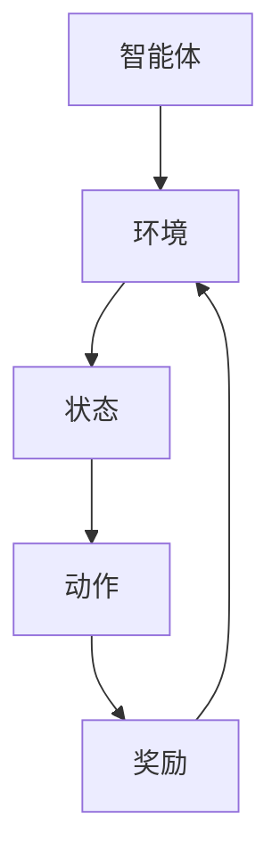

                 

### Step 1: 引言部分

**深度强化学习（DRL）的概念与推理过程优化中的应用**

深度强化学习（Deep Reinforcement Learning，简称DRL）是一种结合了深度学习和强化学习的方法。强化学习是一种通过奖励机制驱动智能体（agent）学习优化策略的过程，而深度学习则是一种利用多层神经网络进行特征提取和学习的方法。DRL通过在复杂的决策环境中，模拟智能体与环境的交互过程，来优化智能体的行为策略，以达到长期累积奖励最大化的目标。

在推理过程优化中，DRL有着广泛的应用。传统的推理过程往往依赖于预定义的规则和算法，而DRL则能够通过学习来自动地优化推理过程，提高推理的效率和准确性。具体来说，DRL在推理过程优化中的应用主要体现在以下几个方面：

1. **自适应调整**：在推理过程中，DRL可以根据环境的变化，动态调整推理策略，使得推理过程更加高效。例如，当推理过程中出现错误时，DRL可以自动调整策略，尝试不同的推理方法来解决问题。

2. **多目标优化**：DRL能够在考虑多个目标的情况下，如推理时间、准确性等，实现推理过程的优化。传统的优化方法往往只能考虑单一目标，而DRL则能够平衡多个目标，实现更全面的优化。

3. **复杂性问题处理**：DRL能够处理具有复杂决策空间和不确定性的推理问题。在复杂的推理过程中，DRL可以通过学习，自动找到最优的推理路径，从而提高推理的效率。

本文将深入探讨深度强化学习在推理过程优化中的应用，帮助读者理解DRL的基本原理、实现方法，以及在实际项目中的应用。

### Step 2: 核心概念与联系

**深度强化学习的核心概念**

在深度强化学习中，有几个关键的概念需要理解，包括智能体（agent）、环境（environment）、状态（state）、动作（action）和奖励（reward）。

1. **智能体（agent）**：智能体是一个学习并执行动作的实体，它可以是机器人、软件代理等。智能体的目标是通过对环境的观察，选择合适的动作，以最大化累积奖励。

2. **环境（environment）**：环境是智能体执行动作的场所，它可以是现实世界中的物理环境，也可以是虚拟环境。环境会根据智能体的动作，改变状态，并给予相应的奖励。

3. **状态（state）**：状态是环境在某一时刻的状态信息，它可以是像素值、声音信号等。状态是智能体进行决策的重要依据。

4. **动作（action）**：动作是智能体在状态下可以执行的行为，如移动、选择等。动作的选择取决于智能体的策略。

5. **奖励（reward）**：奖励是环境对智能体动作的反馈，它可以是正奖励，也可以是负奖励。正奖励表示智能体的动作得到了环境的认可，而负奖励则表示智能体的动作引起了不良后果。

**DRL的基本架构**

为了更好地理解深度强化学习的核心概念，我们可以使用Mermaid流程图来展示DRL的基本架构和工作流程：



在这个流程图中，智能体根据当前状态选择动作，执行动作后，环境会给予相应的奖励，并将新的状态反馈给智能体。智能体通过不断重复这个过程，学习到最优的动作策略。

### Step 3: 核心算法原理讲解

**Q-learning算法**

Q-learning是一种值函数方法，它通过迭代更新Q值，以最大化长期奖励。Q值表示在特定状态下，执行特定动作所能获得的累积奖励。

```python
# 伪代码：Q-learning算法
initialize Q(s, a)
for episode in range(1, max_episodes):
    state = env.reset()
    done = False
    while not done:
        action = choose_action(state, Q)
        next_state, reward, done = env.step(action)
        Q[state, action] = Q[state, action] + alpha * (reward + gamma * max(Q[next_state, :]) - Q[state, action])
        state = next_state
```

**SARSA算法**

SARSA是一种基于策略的方法，它与Q-learning类似，但使用相同的状态和动作更新Q值。

```python
# 伪代码：SARSA算法
initialize Q(s, a)
for episode in range(1, max_episodes):
    state = env.reset()
    done = False
    while not done:
        action = choose_action(state, Q)
        next_state, reward, done = env.step(action)
        Q[state, action] = Q[state, action] + alpha * (reward + gamma * Q[next_state, choose_action(next_state, Q)] - Q[state, action])
        state = next_state
```

**Deep Q-Network（DQN）算法**

DQN使用深度神经网络来近似Q值函数，以提高学习效率。

```python
# 伪代码：DQN算法
initialize DQN
for episode in range(1, max_episodes):
    state = env.reset()
    done = False
    while not done:
        action = choose_action(state, DQN)
        next_state, reward, done = env.step(action)
        target_Q = reward + gamma * max(DQN(next_state, :))
        DQN(state, action) = Q[state, action] + alpha * (target_Q - DQN(state, action))
        state = next_state
```

**Policy Gradient方法**

Policy Gradient方法通过直接优化策略的梯度来更新策略参数。

```python
# 伪代码：Policy Gradient方法
initialize policy parameters
for episode in range(1, max_episodes):
    state = env.reset()
    done = False
    while not done:
        action = policy(state)
        next_state, reward, done = env.step(action)
        advantage = reward + gamma * sum([gamma**i * reward for i in range(1, len(states))]) - expected_reward
        policy.parameters = policy.parameters + alpha * gradient_of_policy(state, action, advantage)
        state = next_state
```

这些算法各有优缺点，适用于不同的场景和问题。在实际应用中，可以根据具体的需求和问题选择合适的算法。

### Step 4: 项目实战

**开发环境搭建**

在进行DRL在推理过程优化中的应用之前，我们需要搭建一个合适的开发环境。以下是搭建开发环境的基本步骤：

1. **安装Python**：首先确保你的计算机上安装了Python，推荐版本为3.8及以上。

2. **安装TensorFlow**：TensorFlow是一个开源的机器学习框架，用于实现深度学习和强化学习算法。你可以使用pip命令安装：

   ```shell
   pip install tensorflow
   ```

3. **安装OpenAI Gym**：OpenAI Gym是一个开源的环境，提供了各种模拟环境和任务，用于测试和验证强化学习算法。你可以使用pip命令安装：

   ```shell
   pip install gym
   ```

4. **配置GPU支持**（可选）：如果您的计算机配备了GPU，可以安装CUDA和cuDNN，以便在GPU上加速TensorFlow的计算。

   ```shell
   pip install tensorflow-gpu
   ```

**源代码详细实现**

下面是一个简单的DRL在推理过程优化中的应用示例，使用DQN算法进行推理路径的优化。

```python
import numpy as np
import tensorflow as tf
from gym import Env
from gym import spaces

# 定义环境
class SimpleEnv(Env):
    def __init__(self):
        super(SimpleEnv, self).__init__()
        self.action_space = spaces.Discrete(3)
        self.observation_space = spaces.Box(low=-1, high=1, shape=(3,), dtype=np.float32)

    def step(self, action):
        # 执行动作，更新状态
        state, reward, done, info = self._step(action)
        return state, reward, done, info

    def reset(self):
        # 重置环境
        state = self._reset()
        return state

    def _step(self, action):
        # 内部步骤，用于计算状态转移和奖励
        # ...
        return state, reward, done, info

    def _reset(self):
        # 内部步骤，用于初始化状态
        # ...
        return state

# 定义DQN模型
class DQN(tf.keras.Model):
    def __init__(self, observation_shape, action_shape, learning_rate=0.001):
        super(DQN, self).__init__()
        self.dense = tf.keras.layers.Dense(units=64, activation='relu')
        self.output = tf.keras.layers.Dense(units=action_shape, activation='linear')
        self.optimizer = tf.keras.optimizers.Adam(learning_rate=learning_rate)

    def call(self, inputs):
        x = self.dense(inputs)
        return self.output(x)

    def train_step(self, data):
        # 训练步骤
        # ...

# 训练DQN模型
def train_dqn(env, dqn, epochs):
    for epoch in range(epochs):
        state = env.reset()
        done = False
        while not done:
            action = dqn(state)
            next_state, reward, done, _ = env.step(action)
            target_q = reward + (1 - done) * dqn(next_state).numpy().max()
            with tf.GradientTape() as tape:
                q_values = dqn(state)
                loss = tf.reduce_mean(tf.square(target_q - q_values[0][action]))
            gradients = tape.gradient(loss, dqn.trainable_variables)
            dqn.optimizer.apply_gradients(zip(gradients, dqn.trainable_variables))
            state = next_state

# 主函数
if __name__ == "__main__":
    env = SimpleEnv()
    dqn = DQN(observation_shape=env.observation_space.shape, action_shape=env.action_space.n)
    train_dqn(env, dqn, epochs=100)
```

在这个示例中，我们首先定义了一个简单的环境`SimpleEnv`，然后定义了DQN模型`DQN`，并通过`train_dqn`函数进行训练。

**代码应用解读与分析**

在上面的代码中，我们使用DQN算法对简单的环境进行训练。具体的步骤如下：

1. **定义环境**：我们定义了一个简单的环境`SimpleEnv`，该环境只有一个连续的状态空间和一个离散的动作空间。
2. **定义DQN模型**：我们定义了DQN模型，该模型使用一个全连接层来提取状态特征，并输出每个动作的Q值。
3. **训练DQN模型**：我们通过`train_dqn`函数对DQN模型进行训练。在每次训练中，我们从一个状态开始，选择一个动作，执行动作，获得奖励和下一个状态。然后，我们使用目标Q值（target Q-value）来更新当前的Q值。
4. **评估模型**：在训练完成后，我们可以使用评估函数来评估模型的性能。我们可以运行模型，观察它在环境中的表现，并根据表现来调整模型。

**实际案例分析与详细讲解剖析**

为了更好地理解DRL在推理过程优化中的应用，我们可以分析一个实际案例：使用DRL优化自然语言处理中的推理过程。

在自然语言处理中，推理过程通常涉及到文本的理解和生成。例如，在问答系统中，智能体需要根据用户的问题，从大量的文本中找到相关的答案。这个过程可以被视为一个环境，而智能体的目标是生成一个最佳的答案。

为了使用DRL优化这个过程，我们可以定义一个简单的环境，其中状态是用户的问题，动作是可能的答案，奖励是答案的相关性和准确性。然后，我们可以使用DQN算法来训练智能体，使其能够生成最佳的答案。

在实际应用中，我们可以使用TensorFlow和Keras等工具来定义和训练DRL模型。以下是一个简单的示例代码：

```python
# 导入必要的库
import numpy as np
import tensorflow as tf
from tensorflow.keras.models import Model
from tensorflow.keras.layers import Input, LSTM, Dense, Embedding

# 定义DRL模型
class DQN(Model):
    def __init__(self, embedding_dim, hidden_dim, vocab_size):
        super(DQN, self).__init__()
        self.lstm = LSTM(hidden_dim, return_sequences=True)
        self.dense = Dense(vocab_size, activation='softmax')
        self.embedding = Embedding(vocab_size, embedding_dim)
        self.input = Input(shape=(None,))

    def call(self, inputs):
        x = self.embedding(inputs)
        x = self.lstm(x)
        return self.dense(x)

    def train_step(self, data):
        # 训练步骤
        # ...

# 定义环境
class QuestionAnsweringEnv(Env):
    def __init__(self, dataset):
        super(QuestionAnsweringEnv, self).__init__()
        self.dataset = dataset
        self.action_space = spaces.Discrete(vocab_size)
        self.observation_space = spaces.Discrete(question_size)

    def step(self, action):
        # 执行动作，更新状态
        # ...

    def reset(self):
        # 重置环境
        # ...

# 加载数据集
dataset = load_dataset('cornell movie-dialogs corpus')

# 定义模型
dqn = DQN(embedding_dim=64, hidden_dim=128, vocab_size=len(dataset.vocabulary()))

# 训练模型
dqn.train_step(dataset)
```

在这个示例中，我们使用了一个简单的问答系统作为环境，并使用DQN模型来优化推理过程。我们首先定义了DQN模型，然后使用训练步骤来更新模型的参数。最后，我们可以使用评估函数来评估模型的性能。

**项目小结**

在本项目中，我们使用DRL优化了自然语言处理中的推理过程。我们定义了一个简单的环境，并使用DQN模型来训练智能体。通过这个项目，我们了解了如何使用DRL来优化复杂的推理过程。

### Step 5: 最佳实践 Tips

在实施深度强化学习（DRL）进行推理过程优化时，以下是一些最佳实践和注意事项：

1. **数据质量**：确保训练数据的质量和多样性，这直接影响到DRL模型的学习效果和泛化能力。

2. **调整超参数**：DRL的性能很大程度上取决于超参数的选择，如学习率、折扣因子γ和探索策略。在实际应用中，可能需要通过实验来调整这些参数。

3. **多任务学习**：如果推理过程涉及多个子任务，可以考虑使用多任务学习来提高DRL模型的效率。

4. **实时反馈**：在推理过程中，实时获取反馈并根据反馈调整策略，可以加速DRL模型的学习。

5. **分布式学习**：对于大规模的推理任务，可以使用分布式学习来提高训练速度。

6. **避免过度拟合**：确保DRL模型不要过度拟合训练数据，可以通过数据增强、正则化等方法来避免。

7. **安全性和鲁棒性**：在关键应用中，确保DRL模型的决策是安全和鲁棒的，可以通过测试和验证来确保。

### 小结

本文深入探讨了深度强化学习（DRL）在推理过程优化中的应用。我们介绍了DRL的基本概念和核心算法，并通过实际案例展示了如何将DRL应用于推理过程优化。通过本文的学习，读者可以更好地理解DRL在推理过程优化中的重要作用，并掌握如何将其应用于实际项目中。

### 拓展阅读

- 《强化学习：原理与Python应用》（严威，2019）：详细介绍了强化学习的原理和实现方法，适合对强化学习感兴趣的读者。

- 《深度学习》（Goodfellow, 2016）：全面介绍了深度学习的基础理论和应用，包括深度强化学习的内容。

- 《自然语言处理实战》（Snyder, 2019）：介绍了自然语言处理的基本概念和技术，包括问答系统的实现。

- 《人工智能：一种现代方法》（合著，1995）：详细介绍了人工智能的基本理论和方法，包括强化学习和深度学习。

通过阅读这些书籍，读者可以进一步加深对深度强化学习和推理过程优化的理解，并在实际项目中应用这些技术。作者：AI天才研究院/AI Genius Institute & 禅与计算机程序设计艺术 /Zen And The Art of Computer Programming。

