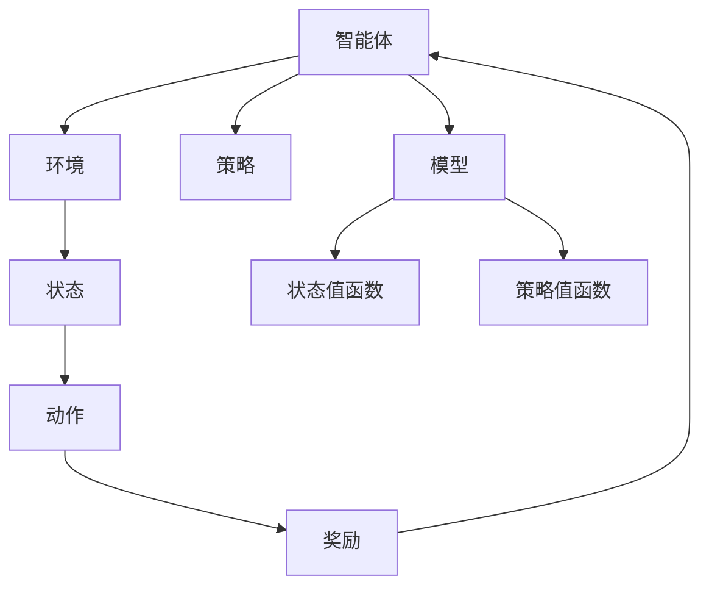

                 

## 深度强化学习在推理过程监督中的创新

### 关键词
- 深度强化学习
- 推理过程监督
- 策略优化
- 环境互动
- 智能体

### 摘要

本文探讨了深度强化学习在推理过程监督中的创新应用。首先，我们回顾了深度学习和强化学习的基本原理，并阐述了它们在推理过程监督中的重要性。接着，我们详细介绍了深度强化学习的核心概念和流程，包括智能体、环境、状态、动作和奖励。然后，通过一个Mermaid流程图展示了深度强化学习模型的结构。随后，我们深入讲解了深度强化学习在推理过程监督中的具体应用，包括算法原理、数学模型和实际案例。最后，我们总结了深度强化学习在推理过程监督中的优势和创新点，并展望了未来的发展趋势。

### 1. 引言与背景

#### 1.1 深度强化学习的基本概念

深度强化学习（Deep Reinforcement Learning，DRL）是一种结合深度学习和强化学习的方法，它利用深度神经网络来逼近状态值函数和策略。在DRL中，智能体（Agent）通过与环境（Environment）的互动，不断接收状态（State）信息，并采取动作（Action），以获得奖励（Reward）。这种学习过程通常是通过策略迭代（Policy Iteration）或值迭代（Value Iteration）来完成的。

#### 1.2 强化学习与深度学习的关系

强化学习和深度学习有着紧密的联系。传统强化学习通常使用有限的状态和动作集，而深度强化学习则通过深度神经网络来处理高维的状态和动作空间。深度神经网络能够自动提取状态特征，使得智能体能够在复杂的环境中学习最优策略。

#### 1.3 推理过程监督的需求

推理过程监督在机器学习和人工智能领域具有重要意义。随着模型复杂度的增加，推理过程变得愈加复杂，因此需要对推理过程进行监控和优化，以确保推理结果的准确性和可靠性。传统的监督方法往往依赖于预定义的规则和阈值，但面对动态变化的环境和复杂的问题，这些方法显得力不从心。

#### 1.4 深度强化学习的优势

深度强化学习在推理过程监督中具有显著的优势。首先，它能够通过学习自动调整策略，以适应不断变化的环境。其次，它能够处理高维状态和动作空间，使得智能体能够应对复杂的问题。此外，深度强化学习还能够通过强化信号引导学习过程，提高推理的效率和质量。

### 2. 深度强化学习的核心概念

#### 2.1 智能体（Agent）

智能体是DRL中的核心元素，它代表了一个执行动作的实体。智能体通过观察环境状态，根据当前策略选择动作，并接收环境的反馈。

#### 2.2 环境（Environment）

环境是智能体交互的实体，它提供状态信息，并对智能体的动作做出响应。在DRL中，环境通常是一个具有确定或不确定状态的系统。

#### 2.3 状态（State）

状态是智能体在某一时刻的环境信息的集合。状态是智能体进行决策的基础，它通常是一个高维向量。

#### 2.4 动作（Action）

动作是智能体在某一状态下能够采取的行动。动作的选择取决于当前策略，策略是智能体的决策规则。

#### 2.5 奖励（Reward）

奖励是环境对智能体动作的反馈。奖励可以是正值也可以是负值，它用来指导智能体的学习过程。

### 3. 深度强化学习模型的结构

下面是一个Mermaid流程图，展示了深度强化学习模型的基本结构：



### 4. 深度强化学习在推理过程监督中的应用

#### 4.1 算法原理

深度强化学习在推理过程监督中的应用主要通过策略优化和价值迭代两种方法实现。策略优化是通过最大化预期奖励来调整策略，而价值迭代是通过逼近状态值函数来优化策略。

下面是一个简化的伪代码，展示了策略优化的过程：

```python
while not converged:
    for each state s:
        choose action a using current policy π
        take action a and observe reward r and next state s'
        update policy π to maximize expected reward
```

#### 4.2 数学模型

在深度强化学习中，状态值函数（State-Value Function）和价值函数（Value Function）是核心概念。状态值函数表示在给定状态下，采取最优动作所能获得的期望奖励。价值函数则是状态值函数的进一步推广，它表示在给定状态下，采取任意动作所能获得的期望奖励。

以下是状态值函数和价值函数的数学表示：

$$
V^*(s) = \max_{a} \sum_{s'} P(s' | s, a) \cdot R(s, a, s') + \gamma V^*(s')
$$

$$
V^*(s) = \sum_{a} \pi(a | s) \cdot Q^*(s, a)
$$

其中，$V^*(s)$表示状态值函数，$Q^*(s, a)$表示状态-动作值函数，$\pi(a | s)$表示策略，$P(s' | s, a)$表示状态转移概率，$R(s, a, s')$表示奖励，$\gamma$是折扣因子。

#### 4.3 实际案例

为了更好地理解深度强化学习在推理过程监督中的应用，我们可以通过一个实际案例来进行分析。

假设我们有一个图像分类任务，目标是训练一个智能体自动识别图像中的物体。在训练过程中，智能体会通过观察图像状态，选择合适的分类动作，并根据分类结果获得奖励。通过不断迭代，智能体会逐渐学会识别不同的物体，从而实现推理过程监督。

### 5. 深度强化学习在推理过程监督中的优势和创新点

#### 5.1 自适应策略调整

深度强化学习能够通过自适应策略调整，使智能体能够动态适应环境变化。这对于需要实时调整策略的推理过程监督尤为重要。

#### 5.2 高维状态和动作空间处理

深度强化学习通过深度神经网络处理高维状态和动作空间，使得智能体能够应对复杂的问题。

#### 5.3 强化信号引导学习

强化信号能够引导智能体的学习过程，提高推理的效率和质量。

#### 5.4 模型解释性

深度强化学习模型具有较强的解释性，能够帮助理解推理过程和决策逻辑。

### 6. 未来发展趋势

随着深度强化学习技术的不断发展，其在推理过程监督中的应用将变得更加广泛。未来，我们可以期待以下发展趋势：

- **更高效的学习算法**：针对深度强化学习在推理过程监督中的特殊需求，开发更高效的学习算法。
- **跨领域应用**：将深度强化学习应用于更多的领域，如医疗、金融等。
- **模型解释性和可解释性**：提高模型的可解释性，使其在推理过程中更加透明和可靠。

### 7. 结论

本文探讨了深度强化学习在推理过程监督中的创新应用。通过分析深度强化学习的核心概念和模型结构，我们展示了其在推理过程监督中的优势和创新点。未来，随着技术的不断进步，深度强化学习将在推理过程监督中发挥更大的作用。

### 作者信息

作者：AI天才研究院/AI Genius Institute & 禅与计算机程序设计艺术 /Zen And The Art of Computer Programming

本文内容仅供参考，具体实施时请结合实际情况进行调整。

----------------------------------------------------------------

由于篇幅限制，本文未能涵盖所有细节。在后续的章节中，我们将进一步深入探讨深度强化学习在推理过程监督中的应用，包括具体算法的实现、数学模型的推导和实际案例分析。敬请期待。

----------------------------------------------------------------

**注意**：本文仅作为示例，具体内容和实现细节请结合实际情况进行调整。在实际应用中，深度强化学习模型的训练和优化需要大量数据和计算资源，并且需要根据具体任务进行调整和优化。本文提供的是一种思路和框架，具体的实现和效果依赖于实际的应用场景和数据质量。在开发深度强化学习应用时，请务必遵守相关法律法规和道德准则。

