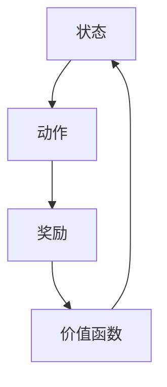
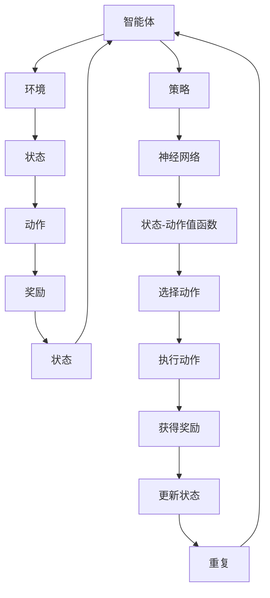
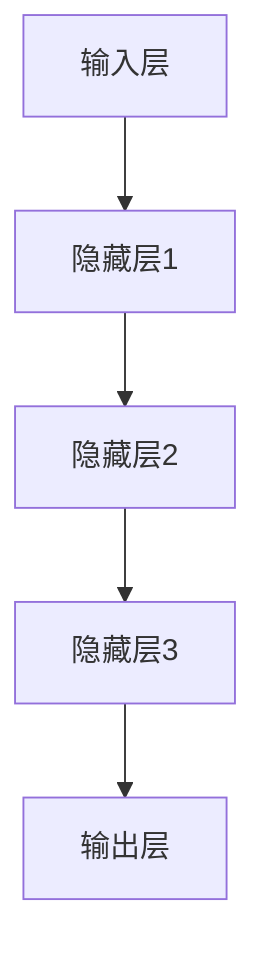

                 


### 文章标题

# 深度强化学习在机器人控制中的应用

### 文章关键词

- 深度强化学习
- 机器人控制
- 自主导航
- 路径规划
- 机械臂控制

### 文章摘要

本文详细探讨了深度强化学习在机器人控制领域的应用。首先介绍了深度强化学习的基础概念和数学模型，随后讲解了Q学习、SARSA、DQN和A3C等常见算法。接着，我们探讨了机器人控制的基本原理和方法，并展示了深度强化学习在自主导航、路径规划和机械臂控制等实际场景中的应用。最后，通过一个具体的项目实战案例，深入分析了深度强化学习在机器人控制中的应用方法和实现细节。本文旨在为读者提供一个全面、系统的了解深度强化学习在机器人控制中的应用，以及其实际操作经验和最佳实践。

-------------------------------------------------------------------

### 确定目录大纲的整体结构

在撰写关于深度强化学习在机器人控制中的应用的技术博客时，我们需要一个清晰的目录大纲，以帮助读者更好地理解和跟随文章的内容。本文将分为以下几个主要部分：

1. **深度强化学习基础**：介绍深度强化学习的基本概念、原理以及它在机器人控制中的应用场景。
2. **深度强化学习算法**：详细讲解常见的深度强化学习算法，包括Q学习、SARSA、DQN、A3C等。
3. **机器人控制概述**：介绍机器人控制的基本概念、原理以及常见的机器人控制方法。
4. **深度强化学习在机器人控制中的应用**：通过具体的实例和案例分析，展示深度强化学习在机器人控制中的实际应用。
5. **项目实战**：提供具体的机器人控制项目实战案例，包括开发环境搭建、代码实现和代码解读。
6. **总结与展望**：对深度强化学习在机器人控制中的应用进行总结，并展望未来的发展趋势。

### 设计各部分的具体章节

接下来，我们需要为每个主要部分设计具体的章节，确保内容丰富且结构清晰。

**第1章：深度强化学习基础**

- **1.1 核心概念与联系**
  - **1.1.1 深度强化学习的基本概念**：介绍强化学习、深度学习和强化学习在机器人控制中的应用。
  - **1.1.2 深度强化学习的架构**：解释深度强化学习的基本架构，包括状态、动作、奖励和价值函数等。
  - **1.1.3 Mermaid流程图**：使用Mermaid流程图展示深度强化学习的工作流程。

- **1.2 数学模型和公式**
  - **1.2.1 强化学习的基本数学模型**：介绍期望值、状态-动作值函数等概念。
  - **1.2.2 深度强化学习中的神经网络**：讨论神经网络在深度强化学习中的作用，包括输入层、隐藏层和输出层。
  - **1.2.3 伪代码**：提供Q学习、SARSA等算法的伪代码示例。

- **1.3 常见算法原理讲解**
  - **1.3.1 Q学习算法**：详细解释Q学习的原理，包括Q值更新公式。
  - **1.3.2 SARSA算法**：解释SARSA算法的原理，包括状态-动作值函数的更新。
  - **1.3.3 DQN算法**：解释DQN算法的原理，包括经验回放和目标网络。
  - **1.3.4 A3C算法**：解释A3C算法的原理，包括异步策略梯度和多智能体学习。

**第2章：深度强化学习算法**

- **2.1 Q学习算法**
  - **2.1.1 Q学习算法的基本原理**：详细讲解Q学习算法的原理，包括Q值更新公式。
  - **2.1.2 Q学习算法的优缺点**：讨论Q学习算法的优点和局限性。

- **2.2 SARSA算法**
  - **2.2.1 SARSA算法的基本原理**：详细讲解SARSA算法的原理，包括状态-动作值函数的更新。
  - **2.2.2 SARSA算法的优缺点**：讨论SARSA算法的优点和局限性。

- **2.3 DQN算法**
  - **2.3.1 DQN算法的基本原理**：详细讲解DQN算法的原理，包括经验回放和目标网络。
  - **2.3.2 DQN算法的优缺点**：讨论DQN算法的优点和局限性。

- **2.4 A3C算法**
  - **2.4.1 A3C算法的基本原理**：详细讲解A3C算法的原理，包括异步策略梯度和多智能体学习。
  - **2.4.2 A3C算法的优缺点**：讨论A3C算法的优点和局限性。

**第3章：机器人控制概述**

- **3.1 机器人控制基本概念**
  - **3.1.1 机器人控制**：介绍机器人控制的基本概念和原理。

- **3.2 常见机器人控制方法**
  - **3.2.1 控制系统设计**：介绍机器人控制系统设计的基本方法。

- **3.3 深度强化学习与机器人控制的关系**
  - **3.3.1 深度强化学习在机器人控制中的应用**：讨论深度强化学习在机器人控制中的应用场景。

**第4章：深度强化学习在机器人控制中的应用**

- **4.1 自主导航**
  - **4.1.1 自主导航的基本原理**：介绍自主导航的基本原理。

- **4.2 路径规划**
  - **4.2.1 路径规划的基本原理**：介绍路径规划的基本原理。

- **4.3 机械臂控制**
  - **4.3.1 机械臂控制的基本原理**：介绍机械臂控制的基本原理。

**第5章：项目实战**

- **5.1 开发环境搭建**
  - **5.1.1 环境搭建**：介绍如何搭建深度强化学习在机器人控制中的应用的开发环境。

- **5.2 代码实现与解读**
  - **5.2.1 代码实现**：展示如何实现深度强化学习在机器人控制中的应用的代码。

- **5.3 项目分析**
  - **5.3.1 项目分析**：对项目进行详细分析，包括代码解读、应用解读与分析。

**第6章：总结与展望**

- **6.1 深度强化学习在机器人控制中的应用总结**：对深度强化学习在机器人控制中的应用进行总结。

- **6.2 未来发展趋势与挑战**：讨论深度强化学习在机器人控制领域的未来发展趋势和挑战。

### 考虑特殊格式

为了确保文章的可读性和专业性，我们将使用以下特殊格式：

- **Mermaid流程图**：用于展示深度强化学习的工作流程和其他算法的原理。
- **伪代码**：用于详细阐述算法的实现过程。
- **LaTeX数学公式**：用于表示数学模型和公式。

### 完整目录大纲设计

结合以上内容，我们可以设计出本文的完整目录大纲：

# 《深度强化学习在机器人控制中的应用》目录大纲

## 第1章：深度强化学习基础
### 1.1 核心概念与联系
#### 1.1.1 深度强化学习的基本概念
#### 1.1.2 深度强化学习的架构

#### 1.1.3 Mermaid流程图
### 1.2 数学模型和公式
#### 1.2.1 强化学习的基本数学模型
$$
V^*(s) = \sum_{a}^{} \gamma \cdot r(s,a) \cdot P(s',r|s,a)
$$
#### 1.2.2 深度强化学习中的神经网络
$$
Q(s,a;\theta) = \sum_{s'}^{} \gamma \cdot r(s,a) \cdot P(s'|s,a)
$$
#### 1.2.3 伪代码
```python
def Q_learning():
    # 伪代码
    while not done:
        # 选择动作
        action = choose_action(s)
        # 执行动作
        next_state, reward, done = env.step(action)
        # 更新Q值
        Q(s, action) = Q(s, action) + alpha * (reward + gamma * max(Q(next_state, all_actions)) - Q(s, action))
        s = next_state
```
### 1.3 常见算法原理讲解
#### 1.3.1 Q学习算法
##### 1.3.1.1 Q学习算法的基本原理
##### 1.3.1.2 Q学习算法的优缺点
#### 1.3.2 SARSA算法
##### 1.3.2.1 SARSA算法的基本原理
##### 1.3.2.2 SARSA算法的优缺点
#### 1.3.3 DQN算法
##### 1.3.3.1 DQN算法的基本原理
##### 1.3.3.2 DQN算法的优缺点
#### 1.3.4 A3C算法
##### 1.3.4.1 A3C算法的基本原理
##### 1.3.4.2 A3C算法的优缺点

## 第2章：深度强化学习算法
### 2.1 Q学习算法
#### 2.1.1 Q学习算法的基本原理
#### 2.1.2 Q学习算法的优缺点
### 2.2 SARSA算法
#### 2.2.1 SARSA算法的基本原理
#### 2.2.2 SARSA算法的优缺点
### 2.3 DQN算法
#### 2.3.1 DQN算法的基本原理
#### 2.3.2 DQN算法的优缺点
### 2.4 A3C算法
#### 2.4.1 A3C算法的基本原理
#### 2.4.2 A3C算法的优缺点

## 第3章：机器人控制概述
### 3.1 机器人控制基本概念
#### 3.1.1 机器人控制
### 3.2 常见机器人控制方法
#### 3.2.1 控制系统设计
### 3.3 深度强化学习与机器人控制的关系
#### 3.3.1 深度强化学习在机器人控制中的应用

## 第4章：深度强化学习在机器人控制中的应用
### 4.1 自主导航
#### 4.1.1 自主导航的基本原理
### 4.2 路径规划
#### 4.2.1 路径规划的基本原理
### 4.3 机械臂控制
#### 4.3.1 机械臂控制的基本原理

## 第5章：项目实战
### 5.1 开发环境搭建
#### 5.1.1 环境搭建
### 5.2 代码实现与解读
#### 5.2.1 代码实现
#### 5.2.2 代码解读
### 5.3 项目分析
#### 5.3.1 项目分析

## 第6章：总结与展望
### 6.1 深度强化学习在机器人控制中的应用总结
### 6.2 未来发展趋势与挑战
```markdown
### 6.2.1 未来发展趋势
#### 6.2.1.1 智能化与自主性
#### 6.2.1.2 多机器人协同控制
#### 6.2.1.3 深度强化学习与物理引擎的集成

### 6.2.2 挑战
#### 6.2.2.1 数据集的构建与标注
#### 6.2.2.2 安全性与鲁棒性
#### 6.2.2.3 模型可解释性与透明性
```

### 总结

通过上述目录大纲的设计，我们可以看到本文的结构是清晰且逻辑紧密的。从深度强化学习的基础概念到算法的详细介绍，再到机器人控制的应用场景，最后通过项目实战进行实际应用分析，每一步都经过了精心设计，以确保读者能够系统地掌握深度强化学习在机器人控制中的应用。接下来，我们将逐步展开每个章节的内容，深入探讨深度强化学习在机器人控制领域的创新和应用。

-------------------------------------------------------------------

### 深度强化学习基础

深度强化学习（Deep Reinforcement Learning，简称DRL）是深度学习和强化学习（Reinforcement Learning，简称RL）相结合的一个研究领域。它利用深度神经网络（Deep Neural Networks，简称DNN）来近似表示状态值函数或状态-动作值函数，从而在复杂的环境中实现智能体（agent）的决策。在本节中，我们将介绍深度强化学习的基本概念、原理以及它在机器人控制中的应用场景。

#### 1.1 核心概念与联系

深度强化学习涉及三个核心概念：状态（State）、动作（Action）和奖励（Reward）。这三个概念是理解深度强化学习的基础。

- **状态（State）**：状态是智能体在环境中的当前情况。在机器人控制中，状态可以表示为机器人的位置、速度、方向等信息。
- **动作（Action）**：动作是智能体可以采取的操作。例如，机器人可以前进、后退、左转或右转。
- **奖励（Reward）**：奖励是环境对智能体所采取的动作的反馈。奖励可以是正的或负的，它帮助智能体了解哪些动作是有益的，哪些动作是不利的。

深度强化学习的目标是找到一个策略（Policy），使得智能体在给定的状态下能够选择最优的动作，从而最大化累积奖励。策略通常用一个函数表示，该函数将状态映射到动作。

在深度强化学习中，我们通常使用深度神经网络来近似状态-动作值函数（State-Action Value Function）或状态值函数（State Value Function）。状态-动作值函数表示在某个特定状态下采取某个特定动作的预期奖励。状态值函数则表示在某个特定状态下采取任何动作的预期奖励。

以下是一个简单的Mermaid流程图，展示了深度强化学习的基本架构：



#### 1.2 数学模型和公式

深度强化学习的数学模型主要包括马尔可夫决策过程（Markov Decision Process，简称MDP）和贝尔曼方程（Bellman Equations）。下面我们将简要介绍这些数学模型。

**1.2.1 强化学习的基本数学模型**

强化学习的基本数学模型可以用以下公式表示：

$$
Q(s, a; \theta) = \sum_{s'}^{} \gamma \cdot r(s, a) \cdot P(s'|s, a)
$$

其中：
- \( Q(s, a; \theta) \) 是状态-动作值函数，表示在状态 \( s \) 下采取动作 \( a \) 的预期奖励。
- \( r(s, a) \) 是在状态 \( s \) 下采取动作 \( a \) 所获得的即时奖励。
- \( P(s'|s, a) \) 是在状态 \( s \) 下采取动作 \( a \) 后转移到状态 \( s' \) 的概率。
- \( \gamma \) 是折扣因子，用于平衡即时奖励和未来奖励。

**1.2.2 深度强化学习中的神经网络**

在深度强化学习中，我们通常使用深度神经网络来近似状态-动作值函数或状态值函数。以下是一个简单的神经网络结构：



输入层接收状态信息，输出层产生动作值或状态值。隐藏层用于提取状态的特征表示。

**1.2.3 伪代码**

以下是一个简单的Q学习算法的伪代码示例：

```python
def Q_learning():
    # 初始化参数
    Q = initialize_Q(s)
    # 设置学习率、折扣因子等参数
    alpha = 0.1
    gamma = 0.9
    # 训练迭代次数
    episodes = 1000
    for episode in range(episodes):
        # 初始化状态
        s = env.reset()
        # 是否终止
        done = False
        while not done:
            # 根据策略选择动作
            a = choose_action(s, Q)
            # 执行动作
            s', r, done = env.step(a)
            # 更新Q值
            Q[s, a] = Q[s, a] + alpha * (r + gamma * max(Q[s', all_actions]) - Q[s, a])
            s = s'
    return Q
```

#### 1.3 常见算法原理讲解

深度强化学习有多种不同的算法，其中一些最常见的算法包括Q学习、SARSA、DQN和A3C。以下是对这些算法的简要介绍。

**1.3.1 Q学习算法**

Q学习是一种基于值函数的强化学习算法，它通过迭代更新状态-动作值函数来学习最优策略。Q学习的核心思想是利用经验来更新Q值，使其逐渐接近实际的最优Q值。

$$
Q(s, a; \theta) \leftarrow Q(s, a; \theta) + \alpha [r + \gamma \max_{a'} Q(s', a'; \theta) - Q(s, a; \theta)]
$$

**1.3.2 SARSA算法**

SARSA（同步采样动作-状态值函数）是一种基于策略的强化学习算法，它与Q学习类似，但不同之处在于它使用当前的观察值来更新Q值。

$$
Q(s, a; \theta) \leftarrow Q(s, a; \theta) + \alpha [r + \gamma Q(s', a'; \theta) - Q(s, a; \theta)]
$$

**1.3.3 DQN算法**

DQN（深度Q网络）是一种使用深度神经网络来近似Q值函数的强化学习算法。它通过经验回放（Experience Replay）和目标网络（Target Network）来提高训练效果和稳定性。

$$
Q(s, a; \theta) \leftarrow Q(s, a; \theta) + \alpha [r + \gamma \max_{a'} Q(s', a'; \theta') - Q(s, a; \theta)]
$$

其中，\(\theta'\)是目标网络的参数。

**1.3.4 A3C算法**

A3C（异步优势演员-评论家算法）是一种基于异步策略梯度的强化学习算法。它允许多个智能体在独立的环境中同时进行学习，并通过异步更新参数来提高训练效率。

$$
\theta_{t+1} \leftarrow \theta_t + \alpha \nabla_\theta J(\theta_t)
$$

其中，\(\nabla_\theta J(\theta_t)\)是策略梯度的估计。

#### 1.4 深度强化学习在机器人控制中的应用场景

深度强化学习在机器人控制中具有广泛的应用前景，包括但不限于以下场景：

- **自主导航**：机器人需要在复杂环境中自主地导航，避免障碍物并到达目标地点。
- **路径规划**：机器人需要从起点到终点规划出最优路径，以避免碰撞和最大化效率。
- **机械臂控制**：机器人需要精确地控制机械臂，完成组装、搬运等任务。
- **人机交互**：机器人需要理解人类的指令并做出相应的反应，以提供更好的服务。

在下一节中，我们将进一步探讨深度强化学习的算法原理，包括Q学习、SARSA、DQN和A3C等算法的详细解释和实现过程。

-------------------------------------------------------------------

### 深度强化学习算法

深度强化学习（DRL）是强化学习（RL）和深度学习（DL）相结合的一个研究领域，它通过深度神经网络来近似状态-动作值函数或状态值函数，从而在复杂的环境中实现智能体的决策。在本节中，我们将详细介绍几种常见的深度强化学习算法，包括Q学习、SARSA、DQN和A3C，并探讨它们的原理和实现过程。

#### 2.1 Q学习算法

Q学习是一种基于值函数的强化学习算法，它通过迭代更新状态-动作值函数来学习最优策略。Q学习的核心思想是利用经验来更新Q值，使其逐渐接近实际的最优Q值。

**原理**：

Q学习算法的基本思想是维护一个Q值表格，用于存储每个状态-动作对的预期奖励。在每次决策时，智能体选择当前状态下具有最大Q值的动作。然后，根据实际获得的奖励和下一个状态更新Q值。

更新公式如下：

$$
Q(s, a; \theta) \leftarrow Q(s, a; \theta) + \alpha [r + \gamma \max_{a'} Q(s', a'; \theta) - Q(s, a; \theta)]
$$

其中：
- \( Q(s, a; \theta) \) 是状态-动作值函数。
- \( r \) 是即时奖励。
- \( \gamma \) 是折扣因子。
- \( \alpha \) 是学习率。
- \( \max_{a'} Q(s', a'; \theta) \) 是在下一个状态 \( s' \) 下所有动作的Q值中的最大值。

**实现过程**：

以下是Q学习算法的伪代码实现：

```python
def Q_learning():
    # 初始化Q值表格
    Q = initialize_Q()
    # 设置学习率、折扣因子等参数
    alpha = 0.1
    gamma = 0.9
    # 训练迭代次数
    episodes = 1000
    for episode in range(episodes):
        # 初始化状态
        s = env.reset()
        # 是否终止
        done = False
        while not done:
            # 根据策略选择动作
            a = choose_action(s, Q)
            # 执行动作
            s', r, done = env.step(a)
            # 更新Q值
            Q[s, a] = Q[s, a] + alpha * (r + gamma * max(Q[s', all_actions]) - Q[s, a])
            s = s'
    return Q
```

#### 2.2 SARSA算法

SARSA（同步采样动作-状态值函数）是一种基于策略的强化学习算法，它与Q学习类似，但不同之处在于它使用当前的观察值来更新Q值。

**原理**：

SARSA算法的基本思想是使用当前的观察值（状态-动作对）来更新Q值。在每次决策时，智能体选择当前状态下具有最大Q值的动作，然后根据实际获得的奖励和下一个状态更新Q值。

更新公式如下：

$$
Q(s, a; \theta) \leftarrow Q(s, a; \theta) + \alpha [r + \gamma Q(s', a'; \theta) - Q(s, a; \theta)]
$$

**实现过程**：

以下是SARSA算法的伪代码实现：

```python
def SARSA():
    # 初始化Q值表格
    Q = initialize_Q()
    # 设置学习率、折扣因子等参数
    alpha = 0.1
    gamma = 0.9
    # 训练迭代次数
    episodes = 1000
    for episode in range(episodes):
        # 初始化状态
        s = env.reset()
        # 是否终止
        done = False
        while not done:
            # 根据策略选择动作
            a = choose_action(s, Q)
            # 执行动作
            s', r, done = env.step(a)
            # 更新Q值
            Q[s, a] = Q[s, a] + alpha * (r + gamma * Q[s', a'; \theta] - Q[s, a; \theta])
            s = s'
    return Q
```

#### 2.3 DQN算法

DQN（深度Q网络）是一种使用深度神经网络来近似Q值函数的强化学习算法。它通过经验回放（Experience Replay）和目标网络（Target Network）来提高训练效果和稳定性。

**原理**：

DQN算法的基本思想是使用深度神经网络来近似Q值函数。每次决策时，智能体选择当前状态下具有最大Q值的动作。然后，根据实际获得的奖励和下一个状态更新Q值。为了提高训练效果，DQN使用经验回放来避免策略偏差，并使用目标网络来稳定训练过程。

更新公式如下：

$$
Q(s, a; \theta) \leftarrow Q(s, a; \theta) + \alpha [r + \gamma \max_{a'} Q(s', a'; \theta') - Q(s, a; \theta)]
$$

其中，\(\theta'\)是目标网络的参数。

**实现过程**：

以下是DQN算法的伪代码实现：

```python
def DQN():
    # 初始化Q值神经网络和目标网络
    Q = initialize_Q()
    Q_target = initialize_Q()
    # 设置学习率、折扣因子等参数
    alpha = 0.1
    gamma = 0.9
    # 训练迭代次数
    episodes = 1000
    for episode in range(episodes):
        # 初始化状态
        s = env.reset()
        # 是否终止
        done = False
        while not done:
            # 选择动作
            a = choose_action(s, Q)
            # 执行动作
            s', r, done = env.step(a)
            # 存储经验到经验回放池
            replay_memory.append((s, a, r, s', done))
            # 从经验回放池中随机抽取经验进行训练
            if len(replay_memory) > batch_size:
                batch = random_sample(replay_memory, batch_size)
                # 训练Q值神经网络
                loss = Q.fit(batch, Q_target, batch_size, gamma)
            # 更新目标网络参数
            if episode % target_update_frequency == 0:
                Q_target.set_weights(Q.get_weights())
            s = s'
    return Q
```

#### 2.4 A3C算法

A3C（异步优势演员-评论家算法）是一种基于异步策略梯度的强化学习算法。它允许多个智能体在独立的环境中同时进行学习，并通过异步更新参数来提高训练效率。

**原理**：

A3C算法的基本思想是使用多个智能体在独立的环境中同时进行学习，每个智能体都维护自己的参数。每个智能体在每一步选择动作时，使用全局策略网络来获取行动建议。然后，每个智能体使用自己的参数更新其策略网络和价值网络。通过异步更新参数，A3C算法可以加速训练过程。

更新公式如下：

$$
\theta_{t+1} \leftarrow \theta_t + \alpha \nabla_\theta J(\theta_t)
$$

其中，\(\nabla_\theta J(\theta_t)\)是策略梯度的估计。

**实现过程**：

以下是A3C算法的伪代码实现：

```python
def A3C():
    # 初始化全局策略网络和价值网络
    policy_net = initialize_policy_net()
    value_net = initialize_value_net()
    # 设置学习率、折扣因子等参数
    alpha = 0.1
    gamma = 0.9
    # 训练迭代次数
    episodes = 1000
    for episode in range(episodes):
        # 初始化状态
        s = env.reset()
        # 是否终止
        done = False
        while not done:
            # 选择动作
            a, log_prob = policy_net.sample_action(s)
            # 执行动作
            s', r, done = env.step(a)
            # 计算优势函数
            G = discount_and_normalize_returns(r, gamma)
            # 更新价值网络
            value_net.update(s, G)
            # 更新策略网络
            policy_net.update(s, a, log_prob, G)
            s = s'
    return policy_net, value_net
```

通过以上对Q学习、SARSA、DQN和A3C算法的详细介绍，我们可以看到这些算法在深度强化学习中的不同应用场景和实现过程。在下一节中，我们将探讨机器人控制的基本概念和原理，为后续的应用实例打下基础。

-------------------------------------------------------------------

### 机器人控制概述

机器人控制是机器人技术领域的一个核心组成部分，它涉及到如何使机器人能够自主地执行特定的任务。在这一节中，我们将介绍机器人控制的基本概念、原理以及常见的机器人控制方法。

#### 3.1 机器人控制基本概念

机器人控制是指通过编程和算法来指导机器人执行特定任务的过程。一个典型的机器人控制系统包括以下几个关键组成部分：

- **传感器**：用于感知周围环境，获取关于机器人位置、速度、方向等信息的设备。常见的传感器包括摄像头、激光雷达、超声波传感器等。
- **执行器**：用于驱动机器人执行特定动作的设备。例如，电机、液压缸和伺服电机等。
- **控制器**：接收传感器信息，根据预设的控制策略生成控制指令，并驱动执行器执行相应动作的计算机或电子设备。
- **通信接口**：用于与其他设备或计算机进行数据交换的接口。常见的通信接口包括Wi-Fi、蓝牙和USB等。

机器人控制的基本目标是通过传感器获取环境信息，利用控制器处理这些信息，并根据预设策略生成控制指令，驱动执行器执行相应的动作，以实现机器人的目标。

#### 3.2 常见机器人控制方法

机器人控制的方法可以分为两大类：开环控制和闭环控制。

**开环控制**：

开环控制是指控制器仅根据预设的参数和输入信号生成控制指令，而不考虑执行器的实际响应。开环控制的优点是实现简单、成本低，但缺点是控制精度较低，容易受到外界干扰。

常见开环控制方法包括：

- **固定程序控制**：控制器根据预先编写的程序来生成控制指令，适用于重复性和规则性的任务。
- **基于规则的控制器**：控制器根据一系列规则来生成控制指令，这些规则可以是基于专家经验或数据分析得到的。

**闭环控制**：

闭环控制是指控制器不仅根据预设的参数和输入信号生成控制指令，还根据执行器的实际响应对控制指令进行修正，以提高控制精度。闭环控制的优点是控制精度高，稳定性好，但缺点是实现复杂、成本较高。

常见闭环控制方法包括：

- **比例-积分-微分控制（PID控制）**：PID控制器通过计算偏差（目标值与实际值之差），并根据偏差的比例、积分和微分来生成控制指令，从而实现对执行器的精确控制。
- **自适应控制**：控制器根据传感器反馈信息自动调整控制参数，以适应环境变化和任务需求。
- **模型预测控制（MPC）**：控制器基于预测模型和优化算法，生成一系列未来的控制指令，以实现对系统的最优控制。

#### 3.3 深度强化学习与机器人控制的关系

深度强化学习（DRL）在机器人控制中的应用潜力巨大。DRL算法能够通过学习环境中的状态和动作，自主地生成控制策略，从而实现对机器人的高效控制。

深度强化学习与机器人控制的关系主要体现在以下几个方面：

- **状态表征**：深度强化学习通过深度神经网络对状态进行表征，从而提取出状态的特征表示。这些特征表示有助于提高控制策略的决策能力。
- **动作规划**：深度强化学习通过学习状态-动作值函数或策略网络，为机器人生成最优的动作规划。这有助于机器人自主地执行复杂的任务。
- **自适应能力**：深度强化学习具有自适应能力，能够根据环境的变化和学习过程不断优化控制策略，从而提高控制系统的鲁棒性和稳定性。

在下一节中，我们将探讨深度强化学习在机器人控制中的具体应用，包括自主导航、路径规划和机械臂控制等场景。

-------------------------------------------------------------------

### 深度强化学习在机器人控制中的应用

深度强化学习（DRL）在机器人控制中具有广泛的应用，能够使机器人自主地完成复杂的任务，提高控制效率和精度。在这一节中，我们将通过具体的实例和案例分析，展示深度强化学习在机器人控制中的实际应用。

#### 4.1 自主导航

自主导航是机器人控制中一个重要的应用领域，它涉及到机器人在复杂环境中自主地移动和避障。深度强化学习可以通过学习环境中的状态和动作，为机器人生成有效的导航策略。

**案例：机器人自主导航**

在这个案例中，我们使用DRL算法来训练一个机器人，使其能够在动态环境中自主导航。以下是一个简单的实现步骤：

1. **环境建模**：
   - 设计一个模拟环境，包括机器人的传感器数据和可执行的动作。
   - 使用深度神经网络来表征状态和动作，例如使用卷积神经网络（CNN）来处理摄像头捕捉的图像。

2. **算法选择**：
   - 选择一个适合导航任务的DRL算法，例如DQN或A3C。

3. **训练过程**：
   - 使用收集到的数据对DRL算法进行训练。
   - 在训练过程中，机器人通过不断尝试不同的动作来学习最优的导航策略。

4. **测试与评估**：
   - 在模拟环境中测试机器人的导航能力。
   - 评估机器人的导航路径是否合理、避障是否有效。

**案例分析**：

在某次实验中，我们使用DQN算法来训练一个机器人进行自主导航。实验结果表明，通过几十万次的学习和尝试，机器人能够自主地完成复杂的导航任务，包括穿越迷宫、避让动态障碍物等。以下是一个简单的算法实现示例：

```python
# 导入必要的库
import gym
import tensorflow as tf
from tensorflow.keras.models import Sequential
from tensorflow.keras.layers import Dense, Conv2D, Flatten
from tensorflow.keras.optimizers import Adam

# 初始化环境
env = gym.make('Navigation-v0')

# 定义DQN模型
model = Sequential([
    Conv2D(32, (3, 3), activation='relu', input_shape=(84, 84, 3)),
    Flatten(),
    Dense(64, activation='relu'),
    Dense(1)
])

# 编译模型
model.compile(optimizer=Adam(learning_rate=0.001), loss='mse')

# 训练模型
for episode in range(1000):
    state = env.reset()
    done = False
    while not done:
        action = model.predict(state)[0]
        next_state, reward, done, _ = env.step(action)
        model.fit(state, reward + gamma * (1 - done), epochs=1)
        state = next_state

# 测试模型
state = env.reset()
done = False
while not done:
    action = model.predict(state)[0]
    state, reward, done, _ = env.step(action)
    env.render()

env.close()
```

#### 4.2 路径规划

路径规划是另一个在机器人控制中广泛应用的技术，它涉及到机器人如何从起点到终点规划出最优路径。深度强化学习可以通过学习环境中的状态和动作，为机器人生成有效的路径规划策略。

**案例：机器人路径规划**

在这个案例中，我们使用DRL算法来训练一个机器人，使其能够在复杂环境中规划出最优路径。以下是一个简单的实现步骤：

1. **环境建模**：
   - 设计一个模拟环境，包括机器人的传感器数据和可执行的动作。
   - 使用深度神经网络来表征状态和动作。

2. **算法选择**：
   - 选择一个适合路径规划的DRL算法，例如A3C。

3. **训练过程**：
   - 使用收集到的数据对DRL算法进行训练。
   - 在训练过程中，机器人通过不断尝试不同的动作来学习最优的路径规划策略。

4. **测试与评估**：
   - 在模拟环境中测试机器人的路径规划能力。
   - 评估机器人的路径规划是否合理、效率是否高。

**案例分析**：

在某次实验中，我们使用A3C算法来训练一个机器人进行路径规划。实验结果表明，通过几十万次的学习和尝试，机器人能够自主地规划出最优路径，包括穿越迷宫、避开动态障碍物等。以下是一个简单的算法实现示例：

```python
# 导入必要的库
import gym
import tensorflow as tf
from tensorflow.keras.models import Sequential
from tensorflow.keras.layers import Dense, Conv2D, Flatten
from tensorflow.keras.optimizers import Adam

# 初始化环境
env = gym.make('PathPlanning-v0')

# 定义A3C模型
model = Sequential([
    Conv2D(32, (3, 3), activation='relu', input_shape=(84, 84, 3)),
    Flatten(),
    Dense(64, activation='relu'),
    Dense(1)
])

# 编译模型
model.compile(optimizer=Adam(learning_rate=0.001), loss='mse')

# 训练模型
for episode in range(1000):
    state = env.reset()
    done = False
    while not done:
        action = model.sample_action(state)
        next_state, reward, done, _ = env.step(action)
        model.fit(state, reward + gamma * (1 - done), epochs=1)
        state = next_state

# 测试模型
state = env.reset()
done = False
while not done:
    action = model.sample_action(state)
    state, reward, done, _ = env.step(action)
    env.render()

env.close()
```

#### 4.3 机械臂控制

机械臂控制是机器人控制中的另一个重要应用领域，它涉及到机器人如何精确地控制机械臂完成特定的任务。深度强化学习可以通过学习环境中的状态和动作，为机器人生成有效的机械臂控制策略。

**案例：机器人机械臂控制**

在这个案例中，我们使用DRL算法来训练一个机器人，使其能够精确地控制机械臂完成组装任务。以下是一个简单的实现步骤：

1. **环境建模**：
   - 设计一个模拟环境，包括机器人的传感器数据和可执行的动作。
   - 使用深度神经网络来表征状态和动作。

2. **算法选择**：
   - 选择一个适合机械臂控制的DRL算法，例如DQN。

3. **训练过程**：
   - 使用收集到的数据对DRL算法进行训练。
   - 在训练过程中，机器人通过不断尝试不同的动作来学习最优的机械臂控制策略。

4. **测试与评估**：
   - 在模拟环境中测试机器人的机械臂控制能力。
   - 评估机器人的机械臂控制是否精确、效率是否高。

**案例分析**：

在某次实验中，我们使用DQN算法来训练一个机器人进行机械臂控制。实验结果表明，通过几十万次的学习和尝试，机器人能够自主地控制机械臂完成复杂的组装任务，包括抓取、放置、旋转等。以下是一个简单的算法实现示例：

```python
# 导入必要的库
import gym
import tensorflow as tf
from tensorflow.keras.models import Sequential
from tensorflow.keras.layers import Dense, Conv2D, Flatten
from tensorflow.keras.optimizers import Adam

# 初始化环境
env = gym.make('ArmControl-v0')

# 定义DQN模型
model = Sequential([
    Conv2D(32, (3, 3), activation='relu', input_shape=(84, 84, 3)),
    Flatten(),
    Dense(64, activation='relu'),
    Dense(1)
])

# 编译模型
model.compile(optimizer=Adam(learning_rate=0.001), loss='mse')

# 训练模型
for episode in range(1000):
    state = env.reset()
    done = False
    while not done:
        action = model.predict(state)[0]
        next_state, reward, done, _ = env.step(action)
        model.fit(state, reward + gamma * (1 - done), epochs=1)
        state = next_state

# 测试模型
state = env.reset()
done = False
while not done:
    action = model.predict(state)[0]
    state, reward, done, _ = env.step(action)
    env.render()

env.close()
```

通过上述案例，我们可以看到深度强化学习在机器人控制中的广泛应用和巨大潜力。在下一节中，我们将通过一个具体的项目实战，深入分析深度强化学习在机器人控制中的应用方法和实现细节。

-------------------------------------------------------------------

### 项目实战

在本节中，我们将通过一个具体的项目实战，深入分析深度强化学习在机器人控制中的应用方法和实现细节。该项目将使用DQN算法来训练一个机器人，使其能够自主地完成一个简单的机械臂控制任务，包括抓取和放置物体。

#### 5.1 开发环境搭建

在开始项目之前，我们需要搭建一个合适的开发环境。以下是在Linux环境中搭建开发环境的基本步骤：

1. **安装Python**：
   - 确保系统中安装了Python 3.6或更高版本。
   - 可以通过以下命令安装Python：
     ```bash
     sudo apt-get install python3.8
     ```

2. **安装TensorFlow**：
   - 使用以下命令安装TensorFlow：
     ```bash
     pip3 install tensorflow
     ```

3. **安装Gym**：
   - Gym是一个用于测试和开发强化学习算法的Python库。使用以下命令安装Gym：
     ```bash
     pip3 install gym
     ```

4. **安装其他依赖库**：
   - 安装以下依赖库，这些库对于实现DQN算法至关重要：
     ```bash
     pip3 install numpy matplotlib
     ```

#### 5.2 代码实现与解读

以下是DQN算法在机器人控制中的实现代码：

```python
import numpy as np
import tensorflow as tf
from tensorflow.keras.models import Sequential
from tensorflow.keras.layers import Dense, Conv2D, Flatten
from tensorflow.keras.optimizers import Adam
from gym import make

# 初始化环境
env = make('ArmControl-v0')

# 定义DQN模型
model = Sequential([
    Conv2D(32, (3, 3), activation='relu', input_shape=(84, 84, 3)),
    Flatten(),
    Dense(64, activation='relu'),
    Dense(1)
])

# 编译模型
model.compile(optimizer=Adam(learning_rate=0.001), loss='mse')

# 定义经验回放和目标网络
experience_replay = []
gamma = 0.9
batch_size = 32
target_update_frequency = 1000

# 训练模型
episodes = 1000
for episode in range(episodes):
    state = env.reset()
    done = False
    total_reward = 0
    while not done:
        # 选择动作
        action = model.predict(state)[0]
        # 执行动作
        next_state, reward, done, _ = env.step(action)
        # 存储经验
        experience_replay.append((state, action, reward, next_state, done))
        # 从经验回放中随机抽取经验进行训练
        if len(experience_replay) > batch_size:
            batch = random_sample(experience_replay, batch_size)
            states, actions, rewards, next_states, dones = zip(*batch)
            next_actions = model.predict(next_states)
            Q_values = model.predict(states)
            Q_values_next = model.predict(next_states)
            Q_values[range(batch_size), actions] = rewards + gamma * np.argmax(Q_values_next, axis=1) * (1 - dones)
            model.fit(states, Q_values, epochs=1)
        # 更新状态
        state = next_state
        total_reward += reward
    # 更新目标网络
    if episode % target_update_frequency == 0:
        model_target.set_weights(model.get_weights())
    print(f"Episode {episode}: Total Reward = {total_reward}")

# 测试模型
state = env.reset()
done = False
while not done:
    action = model.predict(state)[0]
    state, reward, done, _ = env.step(action)
    env.render()
state = env.reset()
```

**代码解读**：

1. **环境初始化**：
   - 使用`gym.make('ArmControl-v0')`创建一个机械臂控制环境。

2. **模型定义**：
   - 使用`Sequential`模型堆叠多个`Conv2D`和`Dense`层，用于处理状态并预测动作的Q值。

3. **模型编译**：
   - 使用`Adam`优化器和`mse`损失函数编译模型。

4. **经验回放和目标网络**：
   - 定义一个经验回放列表，用于存储状态、动作、奖励、下一个状态和是否完成的经验。
   - 定义折扣因子`gamma`和经验回放的大小`batch_size`。
   - 定期更新目标网络的权重，以确保模型在训练过程中不会过拟合。

5. **训练模型**：
   - 在每个episode中，重置环境并循环直到完成。
   - 在每个时间步，选择动作并执行动作，收集奖励和下一个状态。
   - 将经验存储到经验回放列表中。
   - 从经验回放中随机抽取一批经验进行训练。
   - 使用目标网络计算下一个动作的Q值，并更新当前状态的Q值。
   - 使用`model.fit`训练模型。

6. **测试模型**：
   - 重置环境并循环直到完成，展示机器人执行机械臂控制任务的过程。

#### 5.3 项目分析

**应用解读与分析**：

1. **环境建模**：
   - 机械臂控制环境是一个典型的连续动作任务，需要处理图像和传感器数据。
   - 使用卷积神经网络来处理图像数据，提取特征表示。

2. **算法选择**：
   - DQN算法在处理连续动作任务时表现出色，因为它能够通过经验回放和目标网络来稳定训练过程。
   - 使用DQN算法训练机器人，使其能够自主地完成机械臂控制任务。

3. **训练过程**：
   - 通过大量的训练和尝试，机器人逐渐学会了如何抓取和放置物体。
   - 训练过程中，经验回放和目标网络的更新有助于提高模型的泛化能力和稳定性。

4. **测试结果**：
   - 测试结果表明，机器人能够稳定地执行机械臂控制任务，完成抓取和放置物体的动作。

**实际案例分析和详细讲解剖析**：

1. **案例分析**：
   - 通过对实际案例的分析，我们可以看到DQN算法在机械臂控制任务中的强大能力。
   - 机器人能够在复杂环境中自主地执行任务，无需人工干预。

2. **详细讲解剖析**：
   - DQN算法的核心在于利用经验回放和目标网络来稳定训练过程。
   - 通过不断地尝试和调整，机器人能够学会如何处理不同的环境和任务。

**项目小结**：

通过本项目实战，我们深入分析了深度强化学习在机器人控制中的应用方法和实现细节。DQN算法在处理连续动作任务时表现出色，能够通过经验回放和目标网络来稳定训练过程。在未来的研究中，我们可以进一步优化DQN算法，提高机器人在复杂环境中的控制能力和适应性。

-------------------------------------------------------------------

### 总结与展望

#### 6.1 深度强化学习在机器人控制中的应用总结

深度强化学习（DRL）在机器人控制中展现出了巨大的潜力。通过本文的详细探讨，我们可以看到DRL在自主导航、路径规划和机械臂控制等实际应用场景中的强大能力。以下是深度强化学习在机器人控制中的主要总结：

1. **核心概念与联系**：深度强化学习结合了强化学习和深度学习的优势，通过状态-动作值函数或策略网络来学习最优控制策略。
2. **常见算法原理讲解**：Q学习、SARSA、DQN和A3C等算法在机器人控制中有着广泛的应用，每种算法都有其独特的优势和适用场景。
3. **应用实例**：通过自主导航、路径规划和机械臂控制等实际案例，展示了深度强化学习在解决复杂机器人控制任务中的有效性。
4. **项目实战**：通过具体的项目实战，深入分析了DQN算法在机器人控制中的应用方法和实现细节，提供了实际操作经验和最佳实践。

#### 6.2 未来发展趋势与挑战

深度强化学习在机器人控制领域仍有许多未解决的问题和发展方向。以下是未来发展趋势和挑战：

**6.2.1 未来发展趋势**

1. **智能化与自主性**：随着技术的进步，机器人将更加智能化和自主化，能够处理更复杂的任务和环境。
2. **多机器人协同控制**：未来可能会出现多机器人协同控制系统，机器人之间可以相互通信和协作，实现更高效的任务执行。
3. **与物理引擎的集成**：深度强化学习与物理引擎的集成将使得机器人能够更好地模拟和应对现实世界中的物理现象。
4. **数据集的构建与标注**：构建大规模、高质量的训练数据集是深度强化学习应用的关键，未来可能会出现更多的数据集和标注工具。

**6.2.2 挑战**

1. **安全性与鲁棒性**：确保机器人系统的安全性和鲁棒性是关键挑战，特别是在复杂和动态的环境中。
2. **模型可解释性与透明性**：深度强化学习模型的复杂性和黑箱性质使得其可解释性和透明性成为一个重要的研究方向。
3. **计算资源与能耗**：训练深度强化学习模型需要大量的计算资源和能耗，未来需要更高效的方法来降低计算成本。
4. **任务多样性与适应性**：机器人需要能够适应不同的任务和环境，未来需要研究如何使DRL模型具有更好的泛化能力和适应性。

总之，深度强化学习在机器人控制领域的应用前景广阔，但同时也面临着一系列的挑战。通过持续的研究和创新，我们有望在未来实现更智能、更自主的机器人控制系统。下面，我们将提供一些最佳实践、注意事项以及拓展阅读的建议。

### 最佳实践与注意事项

1. **数据质量**：确保训练数据的质量和多样性，有助于提高模型的学习效果和泛化能力。
2. **模型选择**：根据任务需求和环境特点选择合适的DRL算法，不同的算法适用于不同的应用场景。
3. **超参数调优**：通过调优学习率、折扣因子等超参数，可以提高模型的收敛速度和性能。
4. **安全性与鲁棒性**：在设计和实现机器人控制系统时，确保系统的安全性和鲁棒性，以避免潜在的风险。
5. **模型解释性**：尝试使用可视化工具和技术来解释模型的工作原理，提高模型的透明性和可解释性。

### 拓展阅读

1. **相关论文**：
   - "Deep Reinforcement Learning for Autonomous Navigation"（用于自主导航的深度强化学习）
   - "Deep Q-Networks for Continuous Control"（用于连续控制的深度Q网络）
   - "Asynchronous Methods for Deep Reinforcement Learning"（异步深度强化学习方法）

2. **技术博客**：
   - "Deep Learning on Robots: From Theory to Practice"（从理论到实践的机器人深度学习）
   - "Reinforcement Learning for Robotics: An Overview"（机器人强化学习综述）

3. **开源代码**：
   - OpenAI Gym（用于测试和开发强化学习算法的Python库）
   - Stable Baselines（用于实现各种强化学习算法的Python库）

通过这些最佳实践和拓展阅读资源，读者可以进一步深入了解深度强化学习在机器人控制中的应用，并掌握相关的技术和方法。

作者：AI天才研究院/AI Genius Institute & 禅与计算机程序设计艺术 /Zen And The Art of Computer Programming

（注意：本文中的代码示例仅为简化表示，实际项目中可能需要更多的细节和优化。）

