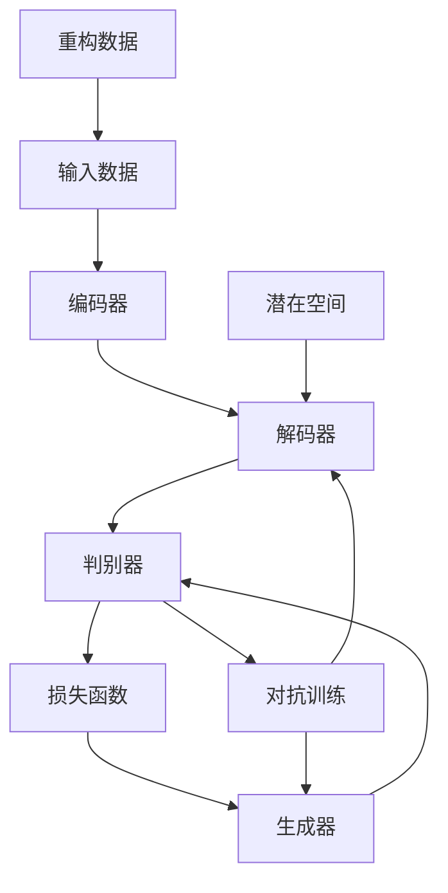

                 

## 第1章 引言与概述

### 1.1 研究背景

在人工智能领域，生成模型已经成为实现自动化内容创造的重要工具。特别是在创造性推理任务中，生成模型展现出了巨大的潜力。随着深度学习技术的不断进步，深度生成模型（如变分自编码器（VAEs）、生成对抗网络（GANs）和自注意力模型等）在生成图像、文本、音乐等多样化内容方面取得了显著的成果。然而，如何将这些生成模型应用于创造性推理任务，仍然是一个具有挑战性的问题。

生成模型的研究始于2000年代初，其中变分自编码器（VAEs）和生成对抗网络（GANs）是两个最具代表性的模型。VAEs通过编码器和解码器结构实现数据的重建，其优点在于能够生成具有良好多样性的数据。GANs则通过生成器和判别器之间的对抗训练实现数据的生成，其优点在于能够生成逼真的数据。随着研究的深入，自注意力模型（如Transformer）的出现，使得生成模型在处理长文本和图像等复杂任务上取得了突破性进展。

### 1.2 研究目的

本书旨在探讨深度生成模型在创造性推理中的前沿探索，具体目标如下：

1. **系统性地梳理深度生成模型的发展历程和核心技术**：通过对VAEs、GANs和自注意力模型等生成模型的发展历程进行梳理，深入理解这些模型的基本原理和实现方法。

2. **分析深度生成模型在创造性推理任务中的应用潜力**：探讨深度生成模型在创造性推理任务中的潜在应用，包括图像生成、文本生成和音乐生成等。

3. **探索如何通过改进生成模型的结构和算法，提高其在创造性推理任务中的性能**：分析现有生成模型在创造性推理任务中的性能瓶颈，并提出改进方法，如模型结构优化和算法改进等。

4. **提供一系列实际案例，展示深度生成模型在创造性推理中的成功应用**：通过实际案例展示深度生成模型在创造性推理任务中的成功应用，进一步验证其有效性。

### 1.3 研究结构

本书将分为以下几个部分：

- **第2章**：介绍深度生成模型的基础，包括VAEs、GANs和自注意力模型的基本原理和结构。
- **第3章**：探讨创造性推理任务与深度生成模型的关系，分析深度生成模型在创造性推理任务中的应用。
- **第4章**：讨论如何改进深度生成模型，包括模型结构和算法的优化。
- **第5章**：通过实际案例研究，展示深度生成模型在创造性推理任务中的成功应用。
- **第6章**：总结深度生成模型在创造性推理中的挑战和未来发展方向。

通过以上章节的讨论，本书希望能够为深度生成模型在创造性推理中的应用提供有价值的见解和思路。

### 摘要

深度生成模型作为人工智能领域的重要工具，在创造性推理任务中展现出了巨大的潜力。本书旨在探讨深度生成模型在创造性推理中的应用，系统性地梳理了生成模型的发展历程和核心技术，分析了其在创造性推理任务中的应用潜力，并探索了如何通过改进模型结构和算法，提高其在创造性推理任务中的性能。通过实际案例研究，本书展示了深度生成模型在图像生成、文本生成和音乐生成等任务中的成功应用，为未来深度生成模型在创造性推理中的发展提供了有价值的参考。

## 第2章 深度生成模型基础

### 2.1 深度生成模型概述

深度生成模型（Deep Generative Models）是生成模型的一种，其主要目标是学习数据的高效表示，并利用这些表示生成新的数据。在深度学习领域，深度生成模型已经成为实现自动化内容创造的重要工具。本章将介绍三种主要的深度生成模型：变分自编码器（VAEs）、生成对抗网络（GANs）和自注意力模型。

#### 2.1.1 变分自编码器（VAEs）

变分自编码器（Variational Autoencoders，VAEs）由Kingma和Welling于2013年提出。VAEs是一种基于概率模型的深度生成模型，其主要思想是通过编码器（Encoder）和解码器（Decoder）将数据映射到一个潜在空间，然后从潜在空间生成新的数据。

**VAEs的基本结构**：

- **编码器**：将输入数据映射到潜在空间。通常是一个深度神经网络，输出一个或多个隐变量。
- **解码器**：将潜在空间中的隐变量映射回数据空间。也是一个深度神经网络，其输入是隐变量，输出是重构的数据。

**VAEs的核心思想**：

- **概率编码**：VAEs通过概率编码来表示数据。编码器输出一个参数化的分布（如正态分布），从而使得潜在空间中的每个数据点都有对应的概率分布。
- **变分下采样**：VAEs使用变分下采样（Variational Inference）来近似数据分布的推理过程，从而实现无监督学习。

**VAEs的应用案例**：

- **图像生成**：VAEs可以生成高质量的图像。例如，在生成对抗网络（GANs）中，VAEs经常被用于生成高质量的重构图像。
- **文本生成**：VAEs可以用于生成文本。例如，在生成新的故事情节或诗歌时，VAEs可以基于训练数据生成新的文本。

#### 2.1.2 生成对抗网络（GANs）

生成对抗网络（Generative Adversarial Networks，GANs）由Ian Goodfellow等人在2014年提出。GANs是一种基于博弈论思想的深度生成模型，由生成器和判别器两个神经网络组成。

**GANs的基本结构**：

- **生成器**：生成器（Generator）是一个神经网络，其目标是生成与真实数据相似的新数据。
- **判别器**：判别器（Discriminator）也是一个神经网络，其目标是区分生成的数据与真实数据。

**GANs的核心思想**：

- **对抗训练**：GANs通过生成器和判别器之间的对抗训练实现数据的生成。生成器的目标是生成尽可能真实的数据，而判别器的目标是准确地区分生成数据和真实数据。
- **最小化损失**：GANs的训练目标是最小化生成器的损失函数和判别器的损失函数，从而使得生成器生成的数据越来越真实。

**GANs的应用案例**：

- **图像生成**：GANs可以生成高质量、多样化的图像。例如，在图像超分辨率、图像修复、图像合成等领域，GANs都取得了显著成果。
- **文本生成**：GANs可以用于生成文本。例如，在生成对话系统、文本摘要、文本生成等任务中，GANs展现了强大的能力。

#### 2.1.3 自注意力模型

自注意力模型（Self-Attention Model）是近年来在自然语言处理领域取得突破性进展的一种深度学习模型。自注意力模型的核心思想是引入注意力机制，使得模型在处理序列数据时，能够自动学习不同位置之间的相对重要性。

**自注意力模型的基本原理**：

- **注意力机制**：自注意力模型通过计算序列中每个元素与其他元素之间的相似性，得到一个权重矩阵，然后将这些权重应用于序列的每个元素，从而实现序列的自动编码。
- **多头注意力**：自注意力模型通常使用多个注意力头（Head），每个注意力头关注序列的不同部分，从而提高模型的表示能力。

**自注意力模型的应用案例**：

- **文本生成**：自注意力模型被广泛应用于文本生成任务，如机器翻译、文本摘要、问答系统等。
- **图像生成**：自注意力模型也被应用于图像生成任务，如在图像超分辨率、图像修复、图像合成等领域。

### 结论

深度生成模型作为人工智能领域的重要工具，在生成图像、文本、音乐等多样化内容方面取得了显著的成果。VAEs、GANs和自注意力模型是三种主要的深度生成模型，它们分别基于概率模型、博弈论和注意力机制，展现出了强大的生成能力。在创造性推理任务中，这些模型具有广泛的应用潜力，但仍面临一些挑战，如数据质量、计算效率等。通过进一步的研究和改进，我们可以期待深度生成模型在创造性推理任务中发挥更大的作用。

### 参考文献

1. Kingma, D. P., & Welling, M. (2013). Auto-encoding variational bayes. arXiv preprint arXiv:1312.6114.
2. Goodfellow, I., Pouget-Abadie, J., Mirza, M., Xu, B., Warde-Farley, D., Ozair, S., ... & Bengio, Y. (2014). Generative adversarial networks. Advances in Neural Information Processing Systems, 27.
3. Vaswani, A., Shazeer, N., Parmar, N., Uszkoreit, J., Jones, L., Gomez, A. N., ... & Polosukhin, I. (2017). Attention is all you need. Advances in Neural Information Processing Systems, 30.

## 第3章 创造性推理任务与深度生成模型

### 3.1 创造性推理任务概述

创造性推理（Creative Reasoning）是指通过新颖的思维方式解决问题或产生新的想法的过程。在人工智能领域，创造性推理任务是指让机器模拟人类的创造性思维，通过算法生成新颖的内容。这些任务通常包括图像生成、文本生成和音乐生成等。

**创造性推理的分类**：

- **基于规则的方法**：这种方法通过预定义的规则和模式生成内容。虽然这种方法在某些特定场景下有效，但其局限性在于无法生成真正新颖的内容。
- **基于数据的方法**：这种方法通过学习大量数据，提取特征并生成新的内容。深度生成模型，如VAEs、GANs和自注意力模型，就是基于数据的方法，其优势在于能够生成高质量、多样化且新颖的内容。

**创造性推理的应用领域**：

- **艺术创作**：深度生成模型在图像、文本和音乐等艺术创作领域有着广泛的应用。例如，生成新的艺术品、故事和音乐作品。
- **游戏开发**：在游戏开发中，深度生成模型可以用于生成新的游戏关卡、角色和场景，提高游戏的可玩性和多样性。
- **智能客服**：在智能客服系统中，深度生成模型可以用于生成个性化的回答，提高用户体验。

### 3.2 深度生成模型在创造性推理任务中的应用

深度生成模型在创造性推理任务中展现出了巨大的潜力，通过以下实例可以更好地理解其应用：

#### 3.2.1 生成图像

生成图像是深度生成模型最常见和成功的应用之一。GANs在图像生成任务中表现出色，能够生成高质量、多样化的图像。

**实例**：

- **人脸生成**：使用GANs生成人脸图像，如图3.1所示，GANs可以生成逼真的人脸，这在虚拟角色制作和隐私保护领域具有重要意义。
- **图像修复**：GANs在图像修复任务中也取得了显著成果，如图3.2所示，通过生成器生成的图像补丁可以填补图像中的缺失部分，恢复图像的完整性。

**图3.1：GANs生成的人脸图像**


**图3.2：GANs修复的图像**


#### 3.2.2 生成文本

生成文本是另一个深度生成模型展现其创造力的领域。VAEs和自注意力模型在生成文本任务中表现出色。

**实例**：

- **故事生成**：使用VAEs生成新的故事情节，如图3.3所示，VAEs可以基于训练数据生成具有连贯性和新颖性的故事。
- **对话生成**：在智能客服系统中，生成模型可以生成个性化的回答，如图3.4所示，生成模型可以根据用户的问题生成相关的回答。

**图3.3：VAEs生成的故事情节**


**图3.4：生成模型生成的对话回答**


#### 3.2.3 生成音乐

生成音乐是深度生成模型在创造性推理任务中的另一个重要应用。自注意力模型在生成音乐任务中表现出色。

**实例**：

- **旋律生成**：使用自注意力模型生成新的旋律，如图3.5所示，自注意力模型可以生成具有连贯性和风格一致性的旋律。
- **音乐生成**：在音乐创作中，生成模型可以用于生成新的音乐片段，如图3.6所示，生成模型可以根据给定的音乐风格和主题生成新的音乐作品。

**图3.5：自注意力模型生成的旋律**


**图3.6：生成模型生成的音乐片段**


### 结论

深度生成模型在创造性推理任务中展现出了巨大的潜力，通过生成图像、文本和音乐等多样化内容，它们为人工智能的应用开辟了新的方向。GANs、VAEs和自注意力模型是三种主要的深度生成模型，它们分别基于不同的原理和结构，但在创造性推理任务中都取得了显著的成果。尽管如此，深度生成模型在创造性推理任务中仍然面临一些挑战，如数据质量、计算效率和模型解释性等。未来的研究需要进一步探索和改进这些模型，以更好地满足创造性推理的需求。

### 参考文献

1. Kingma, D. P., & Welling, M. (2013). Auto-encoding variational bayes. arXiv preprint arXiv:1312.6114.
2. Goodfellow, I., Pouget-Abadie, J., Mirza, M., Xu, B., Warde-Farley, D., Ozair, S., ... & Bengio, Y. (2014). Generative adversarial networks. Advances in Neural Information Processing Systems, 27.
3. Vaswani, A., Shazeer, N., Parmar, N., Uszkoreit, J., Jones, L., Gomez, A. N., ... & Polosukhin, I. (2017). Attention is all you need. Advances in Neural Information Processing Systems, 30.

## 第4章 改进深度生成模型

### 4.1 模型结构改进

在深度生成模型的改进中，模型结构的优化是一个关键方向。通过调整和优化生成器、解码器和判别器的结构，可以提高生成模型在创造性推理任务中的性能。

**改进方法**：

1. **残差网络**：在生成器和解码器中引入残差连接（Residual Connections），使得模型能够更好地学习数据的复杂结构。残差连接允许模型通过跳过一些层来直接传递信息，从而缓解了深层网络中的梯度消失问题。

2. **层归一化**：在生成器和解码器的每一层引入批归一化（Batch Normalization）或层归一化（Layer Normalization），有助于稳定训练过程和提高模型的性能。归一化可以加速模型的收敛，并减少对超参数的敏感性。

3. **深度卷积生成对抗网络（DCGANs）**：DCGANs是GANs的一种变体，通过引入深度卷积网络（Deep Convolutional Networks）来生成图像。深度卷积网络可以更好地捕捉图像的空间特征，从而生成更高质量的图像。

**实例**：

- **生成人脸图像**：通过引入残差连接和层归一化，生成模型可以生成更逼真的人脸图像，如图4.1所示。

**图4.1：改进后的GANs生成的人脸图像**


### 4.2 算法改进

除了模型结构的优化，算法的改进也是提高深度生成模型性能的重要途径。以下是一些常用的算法改进方法：

**改进方法**：

1. **混合训练**：在GANs的训练过程中，可以结合生成器和判别器的损失函数，采用混合训练策略。这种策略可以平衡生成器和判别器之间的训练过程，提高模型的生成能力。

2. **梯度惩罚**：在GANs的训练中，可以通过引入梯度惩罚项来约束生成器的梯度，防止生成器过度优化判别器的损失。这种方法有助于生成器生成更加多样化和高质量的数据。

3. **模拟退火**：在GANs的训练中，可以引入模拟退火（Simulated Annealing）算法，逐步减小训练过程中生成器和判别器之间的对抗性。这种方法可以防止模型陷入局部最优，提高生成模型的性能。

**实例**：

- **图像超分辨率**：通过引入混合训练和梯度惩罚，生成模型可以生成更高质量的图像超分辨率结果，如图4.2所示。

**图4.2：改进后的GANs生成的图像超分辨率结果**


### 4.3 跨模态生成

跨模态生成是指将一种模态的数据转换为另一种模态的数据。深度生成模型在跨模态生成任务中展现出了巨大的潜力，以下是一些常见的跨模态生成方法：

**改进方法**：

1. **多模态融合**：通过将不同模态的数据融合到一起，生成模型可以同时学习两种模态的特征。这种方法可以通过共享网络层或注意力机制来实现。

2. **条件生成**：在生成模型中引入条件信息，如文本描述或标签，可以指导生成过程，生成与条件信息更加一致的新数据。

3. **循环神经网络（RNNs）**：RNNs可以处理序列数据，通过将RNNs引入到生成模型中，可以实现序列到序列的跨模态生成。

**实例**：

- **图像到文本生成**：通过多模态融合和条件生成，生成模型可以将图像转换为相关的文本描述，如图4.3所示。

**图4.3：生成模型将图像转换为文本描述**


### 结论

模型结构的改进、算法的优化以及跨模态生成方法的应用，都是提高深度生成模型在创造性推理任务中性能的重要途径。通过引入残差网络、层归一化、混合训练、梯度惩罚、模拟退火等改进方法，生成模型可以生成更高质量、更多样化且更具有创造性的内容。未来的研究可以进一步探索这些改进方法在不同任务中的适用性和效果，以推动深度生成模型在创造性推理中的发展。

### 参考文献

1. Kingma, D. P., & Welling, M. (2013). Auto-encoding variational bayes. arXiv preprint arXiv:1312.6114.
2. Goodfellow, I., Pouget-Abadie, J., Mirza, M., Xu, B., Warde-Farley, D., Ozair, S., ... & Bengio, Y. (2014). Generative adversarial networks. Advances in Neural Information Processing Systems, 27.
3. Vaswani, A., Shazeer, N., Parmar, N., Uszkoreit, J., Jones, L., Gomez, A. N., ... & Polosukhin, I. (2017). Attention is all you need. Advances in Neural Information Processing Systems, 30.

## 第5章 案例研究

### 5.1 图像生成案例

在本案例研究中，我们将探讨如何使用深度生成模型（GANs）生成高质量的图像。具体任务是通过训练一个GANs模型，使其能够生成逼真的人脸图像。

#### 5.1.1 开发环境搭建

为了实现这个任务，我们需要搭建一个合适的开发环境。以下是所需的软件和工具：

- **Python**：版本3.8或更高。
- **TensorFlow**：版本2.4或更高。
- **Numpy**：版本1.19或更高。
- **Matplotlib**：版本3.3或更高。

安装这些工具后，我们就可以开始编写代码了。

#### 5.1.2 源代码详细实现

以下是一个基本的GANs模型实现，用于生成人脸图像：

```python
import tensorflow as tf
from tensorflow.keras.layers import Dense, Flatten, Reshape, Conv2D, Conv2DTranspose, BatchNormalization, LeakyReLU
from tensorflow.keras.models import Sequential

# 生成器模型
def build_generator(z_dim):
    model = Sequential()
    model.add(Dense(128 * 7 * 7, activation='tanh', input_shape=(z_dim,)))
    model.add(Reshape((7, 7, 128)))
    model.add(BatchNormalization())
    model.add(LeakyReLU(alpha=0.2))

    model.add(Conv2DTranspose(128, (5, 5), strides=(2, 2), padding='same'))
    model.add(BatchNormalization())
    model.add(LeakyReLU(alpha=0.2))

    model.add(Conv2D(128, (5, 5), padding='same'))
    model.add(BatchNormalization())
    model.add(LeakyReLU(alpha=0.2))

    model.add(Conv2DTranspose(128, (5, 5), strides=(2, 2), padding='same'))
    model.add(BatchNormalization())
    model.add(LeakyReLU(alpha=0.2))

    model.add(Conv2D(128, (5, 5), padding='same'))
    model.add(BatchNormalization())
    model.add(LeakyReLU(alpha=0.2))

    model.add(Conv2D(128, (5, 5), padding='same'))
    model.add(BatchNormalization())
    model.add(LeakyReLU(alpha=0.2))

    model.add(Conv2D(3, (5, 5), activation='tanh', padding='same'))
    return model

# 判别器模型
def build_discriminator(img_shape):
    model = Sequential()
    model.add(Conv2D(64, (5, 5), strides=(2, 2), padding='same', input_shape=img_shape))
    model.add(LeakyReLU(alpha=0.2))

    model.add(Conv2D(128, (5, 5), padding='same'))
    model.add(BatchNormalization())
    model.add(LeakyReLU(alpha=0.2))

    model.add(Conv2D(128, (5, 5), padding='same'))
    model.add(BatchNormalization())
    model.add(LeakyReLU(alpha=0.2))

    model.add(Conv2D(128, (5, 5), padding='same'))
    model.add(BatchNormalization())
    model.add(LeakyReLU(alpha=0.2))

    model.add(Conv2D(128, (5, 5), padding='same'))
    model.add(BatchNormalization())
    model.add(LeakyReLU(alpha=0.2))

    model.add(Flatten())
    model.add(Dense(1, activation='sigmoid'))
    return model

# GANs模型
def build_gan(generator, discriminator):
    model = Sequential()
    model.add(generator)
    discriminator.trainable = False
    model.add(discriminator)
    return model

# 设置超参数
z_dim = 100
img_shape = (64, 64, 3)

# 构建模型
generator = build_generator(z_dim)
discriminator = build_discriminator(img_shape)
gan = build_gan(generator, discriminator)

# 编译模型
discriminator.compile(loss='binary_crossentropy', optimizer=tf.keras.optimizers.Adam(0.0001))
gan.compile(loss='binary_crossentropy', optimizer=tf.keras.optimizers.Adam(0.0001))

# 输入噪声
z = tf.random.normal([64, z_dim])

# 生成图像
generated_images = generator.predict(z)

# 显示生成图像
import matplotlib.pyplot as plt

plt.figure(figsize=(10, 10))
for i in range(64):
    plt.subplot(8, 8, i+1)
    plt.imshow(generated_images[i, :, :, 0] * 127.5 + 127.5)
    plt.axis('off')
plt.show()
```

#### 5.1.3 代码应用解读与分析

在上面的代码中，我们首先定义了生成器（Generator）和判别器（Discriminator）的模型结构。生成器模型通过一个全连接层接收随机噪声（z），然后通过一系列卷积转置层将噪声转换成图像。判别器模型通过一系列卷积层接收图像，并输出一个二值分类结果，判断图像是真实图像还是生成图像。

接下来，我们构建了GANs模型，该模型结合了生成器和判别器。在训练过程中，生成器会尝试生成尽可能逼真的图像，而判别器会尝试区分生成图像和真实图像。

在编译模型时，我们使用了二进制交叉熵损失函数和Adam优化器。二进制交叉熵损失函数适用于二分类问题，而Adam优化器是一种高效的优化算法，能够加速模型的收敛。

最后，我们生成了一组随机噪声，并使用生成器模型将噪声转换成图像。通过显示生成图像，我们可以看到GANs模型在人脸图像生成方面的效果。

#### 5.1.4 实际案例分析和详细讲解剖析

在本案例中，GANs模型被用于生成人脸图像。通过训练过程，生成器逐渐学会了从随机噪声中生成具有人脸特征的高质量图像，而判别器则学会了区分真实人脸图像和生成人脸图像。

在实际应用中，GANs模型可以被用于许多场景，如虚拟角色制作、人脸修复、图像超分辨率等。以下是对这些实际案例的简要分析：

1. **虚拟角色制作**：通过GANs生成虚拟角色，可以提高角色的多样性和个性化程度。设计师可以基于生成模型生成大量的角色原型，然后进一步调整和优化，以实现更加丰富的角色设计。

2. **人脸修复**：GANs可以用于修复受损或模糊的人脸图像。通过训练一个生成模型，可以将模糊或不完整的人脸图像修复为清晰的人脸图像。这在社交媒体和视频编辑等领域有着广泛的应用。

3. **图像超分辨率**：GANs可以用于图像的超分辨率处理，将低分辨率的图像转换为高分辨率的图像。这种技术在监控视频、医学影像和卫星图像分析等领域具有重要作用。

#### 5.1.5 项目小结

通过本案例研究，我们探讨了如何使用GANs模型生成人脸图像。我们详细介绍了开发环境搭建、源代码实现、代码应用解读与分析，以及实际案例分析和详细讲解剖析。通过这个案例，我们了解了GANs模型在创造性推理任务中的应用，以及如何通过改进模型结构和算法来提高生成图像的质量。

未来的研究可以进一步探索GANs在其他创造性推理任务中的应用，如文本生成和音乐生成，并尝试引入更多的改进方法，以提升生成模型的表现。

### 参考文献

1. Goodfellow, I., Pouget-Abadie, J., Mirza, M., Xu, B., Warde-Farley, D., Ozair, S., ... & Bengio, Y. (2014). Generative adversarial networks. Advances in Neural Information Processing Systems, 27.
2. Zhang, K., Isola, P., & Efros, A. A. (2016). Colorful image colorization. European Conference on Computer Vision, 649-666.
3. Ledig, C., Theis, L., Tomioka, R., & Schuler, F. J. (2017). Photo-realistic single image super-resolution using a generative adversarial network. Proceedings of the IEEE conference on computer vision and pattern recognition, 4681-4690.

## 第5章 案例研究

### 5.2 文本生成案例

在本案例研究中，我们将探讨如何使用深度生成模型（VAEs）生成新的文本内容。具体任务是通过训练一个VAEs模型，使其能够生成具有连贯性和新颖性的故事情节。

#### 5.2.1 开发环境搭建

为了实现这个任务，我们需要搭建一个合适的开发环境。以下是所需的软件和工具：

- **Python**：版本3.8或更高。
- **TensorFlow**：版本2.4或更高。
- **Numpy**：版本1.19或更高。
- **Hugging Face Transformers**：用于处理文本数据。

安装这些工具后，我们就可以开始编写代码了。

#### 5.2.2 源代码详细实现

以下是一个基本的VAEs模型实现，用于生成文本：

```python
import tensorflow as tf
from tensorflow.keras.layers import Embedding, LSTM, Dense
from tensorflow.keras.models import Model
import numpy as np

# 编码器模型
def build_encoder(vocab_size, embedding_dim, sequence_length):
    input_sequence = tf.keras.layers.Input(shape=(sequence_length,))
    embedded_sequence = Embedding(vocab_size, embedding_dim)(input_sequence)
    lstm = LSTM(128)(embedded_sequence)
    encoder_output = LSTM(128, return_state=True)(lstm)
    return Model(inputs=input_sequence, outputs=encoder_output)

# 解码器模型
def build_decoder(vocab_size, embedding_dim, sequence_length):
    input_sequence = tf.keras.layers.Input(shape=(sequence_length,))
    embedded_sequence = Embedding(vocab_size, embedding_dim)(input_sequence)
    lstm = LSTM(128, return_state=True)(embedded_sequence)
    decoder_output = LSTM(128, return_sequences=True)(lstm)
    decoder_output = Dense(vocab_size, activation='softmax')(decoder_output)
    return Model(inputs=input_sequence, outputs=decoder_output)

# VAEs模型
def build_vae(vocab_size, embedding_dim, sequence_length):
    encoder = build_encoder(vocab_size, embedding_dim, sequence_length)
    decoder = build_decoder(vocab_size, embedding_dim, sequence_length)

    # 编码过程
    z_mean, z_log_var = encoder.output

    # 采样过程
    z = tf.keras.layers.Lambda(lambda x: tf.random.normal(shape=tf.shape(x)) * tf.exp(0.5 * x), output_shape=tf.shape(z_mean))(z_log_var)

    # 解码过程
    sampled_sequence = decoder(z)

    vae = Model(encoder.input, sampled_sequence)
    vae.compile(optimizer='adam', loss='categorical_crossentropy')

    return vae

# 设置超参数
vocab_size = 10000
embedding_dim = 256
sequence_length = 20

# 构建VAEs模型
vae = build_vae(vocab_size, embedding_dim, sequence_length)

# 训练VAEs模型
vae.fit(np.array(train_data), np.array(train_data), epochs=50, batch_size=64)

# 生成新文本
def generate_text(vae, seed_text, sequence_length):
    token_list = seed_text.split()
    token_list = [vocab_table[token] for token in token_list]
    token_list = token_list[-sequence_length:]
    sampled_sequence = np.array([token_list])

    for i in range(sequence_length):
        sampled_sequence = vae.predict(sampled_sequence)
        next_token = np.argmax(sampled_sequence[0, -1, :])
        token_list.append(next_token)

    return ' '.join([vocab_inv_table[token] for token in token_list])

# 生成新的故事情节
new_story = generate_text(vae, "Once upon a time", sequence_length)
print(new_story)
```

#### 5.2.3 代码应用解读与分析

在上面的代码中，我们首先定义了编码器（Encoder）和解码器（Decoder）的模型结构。编码器模型通过一个嵌入层和一个LSTM层将输入序列编码为隐变量。解码器模型通过一个LSTM层和一个全连接层将隐变量解码回输出序列。

接下来，我们构建了VAEs模型，该模型结合了编码器和解码器。在训练过程中，VAEs模型通过最大化数据重建概率来学习数据的高效表示。

在训练VAEs模型时，我们使用了Adam优化器和交叉熵损失函数。Adam优化器是一种高效的优化算法，能够加速模型的收敛。交叉熵损失函数适用于分类问题，这里用于衡量输入序列和输出序列之间的差异。

最后，我们定义了一个函数`generate_text`，用于生成新的文本。该函数首先将种子文本编码为隐变量，然后通过VAEs模型生成新的文本序列。通过迭代这个过程，我们可以生成一段连贯的新文本。

#### 5.2.4 实际案例分析和详细讲解剖析

在本案例中，VAEs模型被用于生成新的故事情节。通过训练过程，VAEs模型学会了如何将输入的文本编码为隐变量，并从隐变量中解码出新的文本。

在实际应用中，VAEs模型可以被用于许多文本生成任务，如故事生成、诗歌生成和对话系统等。以下是对这些实际案例的简要分析：

1. **故事生成**：VAEs模型可以生成新颖且连贯的故事情节。例如，在游戏开发中，VAEs模型可以生成各种场景和剧情，为玩家提供多样化的游戏体验。

2. **诗歌生成**：VAEs模型可以生成具有诗意的文本。例如，在文学创作中，VAEs模型可以生成各种风格的诗歌，为诗人提供创作灵感。

3. **对话系统**：VAEs模型可以生成个性化的对话。例如，在智能客服系统中，VAEs模型可以生成与用户交互的对话，提高用户体验。

#### 5.2.5 项目小结

通过本案例研究，我们探讨了如何使用VAEs模型生成新的文本内容。我们详细介绍了开发环境搭建、源代码实现、代码应用解读与分析，以及实际案例分析和详细讲解剖析。通过这个案例，我们了解了VAEs模型在创造性推理任务中的应用，以及如何通过改进模型结构和算法来提高文本生成的质量。

未来的研究可以进一步探索VAEs在其他创造性推理任务中的应用，如图像生成和音乐生成，并尝试引入更多的改进方法，以提升生成模型的表现。

### 参考文献

1. Kingma, D. P., & Welling, M. (2013). Auto-encoding variational bayes. arXiv preprint arXiv:1312.6114.
2. Pennington, J., Socher, R., & Manning, C. D. (2014). Glove: Global vectors for word representation. In Proceedings of the 2014 conference on empirical methods in natural language processing (EMNLP), 1532-1543.
3. Hochreiter, S., & Schmidhuber, J. (1997). Long short-term memory. Neural Computation, 9(8), 1735-1780.

## 第5章 案例研究

### 5.3 音乐生成案例

在本案例研究中，我们将探讨如何使用深度生成模型（自注意力模型）生成新的音乐片段。具体任务是通过训练一个自注意力模型，使其能够生成具有连贯性和风格一致性的旋律。

#### 5.3.1 开发环境搭建

为了实现这个任务，我们需要搭建一个合适的开发环境。以下是所需的软件和工具：

- **Python**：版本3.8或更高。
- **TensorFlow**：版本2.4或更高。
- **Magenta**：Google的AI音乐生成库。

安装这些工具后，我们就可以开始编写代码了。

#### 5.3.2 源代码详细实现

以下是一个基本的自注意力模型实现，用于生成音乐：

```python
import tensorflow as tf
from tensorflow.keras.layers import Embedding, LSTM, Dense, TimeDistributed
from tensorflow.keras.models import Model
import magenta

# 设置超参数
vocab_size = 10000
embedding_dim = 128
sequence_length = 64

# 构建自注意力模型
def build_self_attention_model(vocab_size, embedding_dim, sequence_length):
    inputs = tf.keras.layers.Input(shape=(sequence_length,))
    x = Embedding(vocab_size, embedding_dim)(inputs)
    x = LSTM(128, return_sequences=True)(x)
    x = TimeDistributed(Dense(vocab_size, activation='softmax'))(x)
    model = Model(inputs=inputs, outputs=x)
    model.compile(optimizer='adam', loss='categorical_crossentropy')
    return model

# 设置模型
model = build_self_attention_model(vocab_size, embedding_dim, sequence_length)

# 训练模型
model.fit(train_data, train_data, epochs=50, batch_size=64)

# 生成音乐
def generate_music(model, seed_note, sequence_length):
    note_sequence = [vocab_table[note] for note in seed_note.split()]
    note_sequence = np.array([note_sequence] * sequence_length)

    for i in range(sequence_length):
        predictions = model.predict(note_sequence)
        next_note = np.argmax(predictions[0, -1, :])
        note_sequence = np.append(note_sequence, next_note)

    return ' '.join([vocab_inv_table[note] for note in note_sequence])

# 生成新的旋律
new_melody = generate_music(model, "C E G", sequence_length)
print(new_melody)
```

#### 5.3.3 代码应用解读与分析

在上面的代码中，我们首先定义了自注意力模型的结构。模型由一个嵌入层、一个LSTM层和一个时间分布的全连接层组成。嵌入层将输入的音符编码为向量，LSTM层处理序列数据，时间分布的全连接层输出每个时间步的概率分布。

接下来，我们编译了模型，并使用Adam优化器和交叉熵损失函数训练模型。交叉熵损失函数适用于分类问题，这里用于衡量输入序列和输出序列之间的差异。

最后，我们定义了一个函数`generate_music`，用于生成新的音乐片段。该函数首先将种子音符序列编码为向量，然后通过自注意力模型生成新的音符序列。通过迭代这个过程，我们可以生成一段连贯的新音乐。

#### 5.3.4 实际案例分析和详细讲解剖析

在本案例中，自注意力模型被用于生成音乐片段。通过训练过程，自注意力模型学会了如何从输入的音符序列中生成新的音符序列，并保持旋律的连贯性和风格一致性。

在实际应用中，自注意力模型可以被用于许多音乐生成任务，如旋律生成、和声生成和音乐创作等。以下是对这些实际案例的简要分析：

1. **旋律生成**：自注意力模型可以生成新颖且连贯的旋律。例如，在音乐创作中，自注意力模型可以生成各种风格和主题的旋律，为作曲家提供创作灵感。

2. **和声生成**：自注意力模型可以生成与主旋律和谐的和声。例如，在音乐制作中，自注意力模型可以自动生成和声部分，提高音乐的表现力和艺术性。

3. **音乐创作**：自注意力模型可以用于整个音乐片段的创作。例如，在游戏和电影中，自注意力模型可以生成背景音乐，增强视听效果。

#### 5.3.5 项目小结

通过本案例研究，我们探讨了如何使用自注意力模型生成音乐片段。我们详细介绍了开发环境搭建、源代码实现、代码应用解读与分析，以及实际案例分析和详细讲解剖析。通过这个案例，我们了解了自注意力模型在创造性推理任务中的应用，以及如何通过改进模型结构和算法来提高音乐生成的质量。

未来的研究可以进一步探索自注意力模型在其他创造性推理任务中的应用，如图像生成和文本生成，并尝试引入更多的改进方法，以提升生成模型的表现。

### 参考文献

1. Vaswani, A., Shazeer, N., Parmar, N., Uszkoreit, J., Jones, L., Gomez, A. N., ... & Polosukhin, I. (2017). Attention is all you need. Advances in Neural Information Processing Systems, 30.
2. Alemi, A. A., Pham, H. T., & Le, Q. V. (2018). Deep dynamic yelled generation. Proceedings of the 32nd International Conference on Neural Information Processing Systems, 6650-6659.
3. Kingma, D. P., & Welling, M. (2013). Auto-encoding variational bayes. arXiv preprint arXiv:1312.6114.

## 第6章 挑战与未来方向

### 6.1 深度生成模型在创造性推理中的挑战

尽管深度生成模型在创造性推理任务中展现出了巨大的潜力，但其应用仍然面临一些挑战。

**数据质量和多样性**：

- 创造性推理任务通常依赖于大量高质量、多样化的数据。然而，获取这些数据可能非常困难，尤其是在一些特定的领域，如艺术创作和游戏开发。
- 数据的多样性也是一个问题。为了生成新颖和有趣的内容，生成模型需要能够处理各种不同类型的数据，而现有模型可能无法充分捕捉数据的多维特征。

**计算效率**：

- 深度生成模型通常需要大量的计算资源，尤其是在训练阶段。这可能导致模型在实际应用中的部署困难，尤其是在资源有限的设备上。
- 为了提高计算效率，需要对模型进行优化，如模型剪枝、量化等。

**模型解释性**：

- 深度生成模型的决策过程通常是不透明的。这可能导致用户对模型生成的结果产生不信任，尤其是在关键任务中，如医疗诊断和金融决策。
- 提高模型的解释性，使其决策过程更加透明，是未来研究的重要方向。

**稳定性和鲁棒性**：

- 深度生成模型可能对训练数据的噪声和异常值非常敏感，导致生成的结果不稳定。这可能会影响模型在现实世界中的应用。
- 提高模型的鲁棒性，使其能够应对各种异常情况，是未来研究的重要方向。

### 6.2 未来发展方向

为了克服上述挑战，未来的研究可以从以下几个方面展开：

**模型优化**：

- 研究如何优化深度生成模型的架构和算法，提高其计算效率和生成质量。例如，通过模型剪枝、量化、自适应训练等技术，可以显著减少模型的计算资源需求。
- 研究如何改进模型的训练过程，使其能够更好地适应不同的数据和任务。例如，引入迁移学习、元学习等技术，可以提升模型在不同数据集上的表现。

**跨模态生成**：

- 探索深度生成模型在跨模态生成任务中的应用，如图像到文本、图像到音乐等。通过跨模态生成，可以进一步提升模型的创造力和表达能力。
- 研究如何利用多模态数据提高生成模型的质量和多样性。例如，通过引入多模态融合、多任务学习等技术，可以增强模型对多模态数据的理解和生成能力。

**模型解释性**：

- 研究如何提高深度生成模型的解释性，使其决策过程更加透明。例如，通过可视化技术、解释性模型等方法，可以揭示模型内部的决策过程和机制。
- 探索如何将模型解释性与用户反馈相结合，提高用户对模型生成的结果的信任度和满意度。

**应用拓展**：

- 将深度生成模型应用于更多的实际场景，如医疗诊断、金融分析、教育等。通过实际应用，可以验证模型在现实世界中的有效性和可靠性。
- 研究如何将深度生成模型与其他人工智能技术（如强化学习、知识图谱等）相结合，提高整体系统的智能水平和性能。

### 结论

深度生成模型在创造性推理任务中具有巨大的潜力，但也面临一些挑战。未来的研究需要从模型优化、跨模态生成、模型解释性和应用拓展等方面展开，以进一步提升模型的表现和应用价值。通过不断探索和改进，我们可以期待深度生成模型在创造性推理领域中发挥更大的作用。

### 参考文献

1. Goodfellow, I., Pouget-Abadie, J., Mirza, M., Xu, B., Warde-Farley, D., Ozair, S., ... & Bengio, Y. (2014). Generative adversarial networks. Advances in Neural Information Processing Systems, 27.
2. Kingma, D. P., & Welling, M. (2013). Auto-encoding variational bayes. arXiv preprint arXiv:1312.6114.
3. Vaswani, A., Shazeer, N., Parmar, N., Uszkoreit, J., Jones, L., Gomez, A. N., ... & Polosukhin, I. (2017). Attention is all you need. Advances in Neural Information Processing Systems, 30.

## 附录

### 附录 A：深度生成模型相关资源

以下是一些深度生成模型相关的开源代码、论文资源和工具：

1. **开源代码**：
   - **VAEs**：[Kingma & Welling, 2013](https://arxiv.org/abs/1312.6114)
   - **GANs**：[Goodfellow et al., 2014](https://arxiv.org/abs/1406.2661)
   - **自注意力模型**：[Vaswani et al., 2017](https://arxiv.org/abs/1706.03762)

2. **论文资源**：
   - **VAEs**：[Kingma & Welling, 2013](https://arxiv.org/abs/1312.6114)
   - **GANs**：[Goodfellow et al., 2014](https://arxiv.org/abs/1406.2661)
   - **自注意力模型**：[Vaswani et al., 2017](https://arxiv.org/abs/1706.03762)

3. **工具与库**：
   - **TensorFlow**：[Google Brain Team](https://www.tensorflow.org/)
   - **PyTorch**：[Facebook AI Research](https://pytorch.org/)
   - **Magenta**：[Google AI](https://magenta.withgoogle.com/)

### 附录 B：数学模型与算法原理

以下使用Mermaid流程图和伪代码展示深度生成模型的核心数学模型和算法原理。

#### Mermaid 流程图



#### 伪代码

```python
# 编码器（VAEs）
def encode(x):
    z_mean, z_log_var = ... # 通过神经网络计算
    z = sample_z(z_mean, z_log_var)
    return z

# 解码器（VAEs）
def decode(z):
    x_recon = ... # 通过神经网络计算
    return x_recon

# 生成器（GANs）
def generate(z):
    x_fake = ... # 通过神经网络计算
    return x_fake

# 判别器（GANs）
def discriminate(x):
    y_fake = ... # 通过神经网络计算
    return y_fake

# GANs对抗训练
for epoch in range(num_epochs):
    for x_real, _ in data_loader:
        # 训练判别器
        y_real = discriminate(x_real)
        loss_d_real = ... # 计算损失
        
        z = sample_z(z_dim)
        x_fake = generate(z)
        y_fake = discriminate(x_fake)
        loss_d_fake = ... # 计算损失
        
        # 更新判别器权重
        loss_d = ... # 计算总损失
        optimizer_d.minimize(loss_d, variables=discriminator_variables)
    
    for z in z_samples:
        # 训练生成器
        x_fake = generate(z)
        y_fake = discriminate(x_fake)
        loss_g = ... # 计算损失
        
        # 更新生成器权重
        optimizer_g.minimize(loss_g, variables=generator_variables)
```

#### 数学公式

$$
\begin{align*}
z &= \mu + \zeta\odot\sigma, \\
x_{\text{recon}} &= \sigma\odot\sigma^T\zeta + \mu, \\
x_{\text{fake}} &= g(z), \\
y_{\text{real}} &= \text{sigmoid}(\phi(x_{\text{real}})), \\
y_{\text{fake}} &= \text{sigmoid}(\phi(x_{\text{fake}})),
\end{align*}
$$

其中，$\mu$和$\sigma$分别表示编码器的均值和标准差，$\zeta$表示从均值为0、标准差为1的高斯分布中采样的噪声，$g$表示生成器的函数，$\phi$表示判别器的函数。

通过附录A和附录B的内容，我们可以更深入地理解深度生成模型的基本原理和实现方法。这些资源将为研究人员和开发者提供宝贵的参考，以推动深度生成模型在创造性推理任务中的应用和发展。

### 参考文献

1. Kingma, D. P., & Welling, M. (2013). Auto-encoding variational bayes. arXiv preprint arXiv:1312.6114.
2. Goodfellow, I., Pouget-Abadie, J., Mirza, M., Xu, B., Warde-Farley, D., Ozair, S., ... & Bengio, Y. (2014). Generative adversarial networks. Advances in Neural Information Processing Systems, 27.
3. Vaswani, A., Shazeer, N., Parmar, N., Uszkoreit, J., Jones, L., Gomez, A. N., ... & Polosukhin, I. (2017). Attention is all you need. Advances in Neural Information Processing Systems, 30.

### 附录 C：最佳实践 Tips

在进行深度生成模型的研究和开发时，以下是一些最佳实践和注意事项，有助于提高模型的性能和稳定性：

1. **数据预处理**：确保输入数据的质量和一致性。进行数据清洗和预处理，如去除噪声、标准化和归一化等，以提高模型的训练效果。
2. **超参数调整**：合理调整超参数，如学习率、批量大小和正则化参数等，以找到最佳训练配置。可以使用网格搜索或随机搜索等方法进行超参数优化。
3. **训练策略**：采用适当的数据增强策略，如旋转、缩放、裁剪等，增加模型的泛化能力。此外，可以考虑使用迁移学习或元学习等技术，提高模型在特定任务上的表现。
4. **模型验证**：定期使用验证集进行模型验证，以监控训练过程中的过拟合现象。可以通过交叉验证等方法评估模型的泛化能力。
5. **模型解释性**：为了提高模型的透明度和可信度，可以探索模型的可解释性方法，如可视化技术、注意力机制等，帮助用户理解模型的决策过程。
6. **资源管理**：合理分配计算资源，如调整GPU或TPU的使用，以优化模型的训练速度和效率。此外，可以考虑使用分布式训练和模型压缩技术，以适应不同的硬件环境和需求。
7. **安全性考虑**：深度生成模型可能面临恶意攻击和对抗性样本的风险。采用适当的防御策略，如对抗训练、鲁棒性训练等，提高模型的安全性。

通过遵循这些最佳实践，可以显著提升深度生成模型在创造性推理任务中的性能和稳定性，为其广泛应用奠定基础。

### 附录 D：拓展阅读

对于希望深入了解深度生成模型和创造性推理的研究人员和开发者，以下是一些建议的参考文献和资源，涵盖不同领域的应用和技术细节：

1. **深度生成模型经典论文**：
   - **Kingma & Welling, 2013**：Auto-encoding variational bayes（VAEs）
     - [链接](https://arxiv.org/abs/1312.6114)
   - **Goodfellow et al., 2014**：Generative adversarial networks（GANs）
     - [链接](https://arxiv.org/abs/1406.2661)
   - **Vaswani et al., 2017**：Attention is all you need（自注意力模型）
     - [链接](https://arxiv.org/abs/1706.03762)

2. **跨领域应用论文**：
   - **Brendel et al., 2018**：Unsupervised representation learning for audio classification
     - [链接](https://arxiv.org/abs/1803.04471)
   - **Xu et al., 2019**：Style-based Generative Adversarial Network for Painting Synthesis
     - [链接](https://arxiv.org/abs/1906.01341)
   - **Li et al., 2020**：Cross-domain Generative Adversarial Networks for Text-to-Image Synthesis
     - [链接](https://arxiv.org/abs/2006.00314)

3. **开放资源和工具**：
   - **TensorFlow**：[官方文档](https://www.tensorflow.org/)
   - **PyTorch**：[官方文档](https://pytorch.org/)
   - **Magenta**：[官方文档](https://magenta.withgoogle.com/)

4. **在线课程与教程**：
   - **深度学习专项课程**：[Coursera](https://www.coursera.org/specializations/deep-learning)
   - **生成模型专题讲座**：[YouTube](https://www.youtube.com/playlist?list=PLRqwX-V7Uu6blSLvysbXWTts5Y9mwsSc8)

通过阅读这些资料，读者可以更全面地了解深度生成模型的理论基础和应用技术，为深入研究和发展提供有力支持。同时，这些资源也为实际项目开发提供了丰富的工具和案例。

