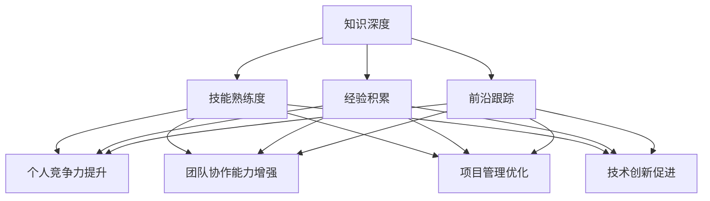

                 


## 文章标题

《深耕技术：P9工程师的专业化成长策略》

## 文章关键词

P9工程师、专业化成长、技术深耕、职业发展、项目管理、领导力

## 文章摘要

本文旨在探讨P9工程师如何通过专业化成长策略，在技术领域深耕细作，实现职业发展的跃迁。文章首先分析了P9工程师的职业定位和发展路径，随后深入探讨了技术深耕的核心概念和重要性。接着，文章详细介绍了P9工程师所需的专业知识、技能和项目管理、领导力等软技能。通过实际案例研究和未来趋势展望，本文为P9工程师提供了具体的职业发展策略和最佳实践建议。

### 引言

在当今快速发展的技术时代，工程师的专业成长变得尤为重要。特别是对于P9级别的工程师，他们不仅需要在技术深度上有所建树，还要在项目管理、领导力和团队协作等方面具备卓越的能力。本文旨在通过一步步的分析推理，为P9工程师提供一条清晰的专业化成长路径，帮助他们在这个竞争激烈的领域中脱颖而出。

首先，我们需要了解P9工程师的职业特点和他们在公司中的角色。P9工程师通常负责复杂的项目，拥有深厚的技术背景和丰富的实践经验。他们不仅需要解决技术难题，还要具备领导团队和管理项目的能力。因此，他们的职业发展路径和技术深耕策略有着独特的特点。

接下来，我们将探讨技术深耕的核心概念，解释其意义以及如何与技术发展相结合。我们将通过实际案例和流程图，展示技术深耕在不同领域的应用。同时，本文还将详细介绍P9工程师所需的专业知识和技能，包括基础知识、高级技能和跨学科知识的融合。此外，项目管理与领导力在P9工程师的职业发展中扮演着重要角色，我们将深入分析其核心要素和提升策略。

为了更好地理解P9工程师的职业发展，本文将通过实战案例研究，分析他们在具体项目中的成功经验和面临的挑战。最后，我们将讨论未来技术发展的趋势，为P9工程师提供职业发展的机遇和建议。

通过本文的阅读，读者将能够：

1. 明确P9工程师的职业定位和职业发展路径。
2. 深入理解技术深耕的概念和重要性。
3. 掌握P9工程师所需的专业知识和技能。
4. 了解项目管理与领导力在职业发展中的作用。
5. 获得具体的职业发展策略和最佳实践建议。

### P9工程师的职业发展路径

P9工程师是技术领域的佼佼者，他们在公司中扮演着至关重要的角色。要理解P9工程师的职业发展路径，首先需要明确他们的职业特点和职责。

P9工程师通常被看作是技术总监或高级技术专家，他们不仅拥有深厚的专业知识，还在项目管理、团队领导和跨部门协作等方面具备卓越的能力。以下是P9工程师的一些典型职业特点：

1. **技术深度**：P9工程师对所涉及的技术领域有深刻的理解，能够解决复杂的技术问题，并在技术方向上有前瞻性的思考。

2. **项目领导力**：他们能够负责大型项目，从项目规划到执行，再到项目交付，全程参与并确保项目成功。

3. **团队协作**：P9工程师不仅需要与团队成员有效沟通，还需要在团队中扮演导师角色，培养和带领团队成长。

4. **决策能力**：在项目决策中，P9工程师能够提供技术层面的专业意见，并参与到公司战略决策中。

5. **业务理解**：P9工程师不仅关注技术本身，还具备较强的业务理解能力，能够将技术解决方案与业务目标相结合。

在职业生涯中，P9工程师通常会经历以下几个阶段：

**1. 技术专家阶段**：
在这个阶段，工程师专注于技术领域，不断深入学习和掌握最新的技术知识。他们通过解决复杂的技术问题，逐步建立起自己的技术声誉。

**2. 项目经理阶段**：
随着经验的积累，P9工程师开始承担更多的项目管理职责。他们需要协调资源、管理团队，确保项目按时按质完成。

**3. 技术领导阶段**：
在这个阶段，P9工程师开始担任技术团队领导或技术总监的角色。他们不仅要管理团队，还要参与公司战略规划，制定技术方向。

**4. 企业战略阶段**：
最终，P9工程师可能会晋升为公司的技术副总裁或首席技术官（CTO），负责整个公司的技术战略和研发方向。

P9工程师的职业发展路径并非一帆风顺，需要他们在技术、管理和领导力等方面不断努力和提升。以下是一些具体的职业发展策略：

**1. 持续学习**：
P9工程师需要不断学习新技术和知识，保持自己的技术竞争力。可以通过参加行业会议、研讨会和在线课程来实现。

**2. 多元化经验**：
通过参与不同类型的项目，积累多样化的经验，提升项目管理能力和团队协作能力。

**3. 领导力培养**：
参加领导力培训课程，阅读相关书籍，向经验丰富的领导学习，提升自己的领导力。

**4. 业务理解**：
加强业务知识的学习，与业务团队紧密合作，提升业务理解能力。

**5. 建立个人品牌**：
通过发表技术文章、参与开源项目、参加技术分享等方式，提升自己在业界的知名度和影响力。

通过上述策略，P9工程师可以逐步实现自己的职业发展目标，成为技术领域的领军人物。接下来，我们将深入探讨技术深耕的核心概念，帮助读者理解如何在技术领域中不断深耕细作。

### 技术深耕的核心概念

技术深耕是指在某个技术领域内，通过深入学习和实践，不断积累知识、技能和经验，达到对技术有全面、深入理解的状态。对于P9工程师来说，技术深耕不仅是个人职业发展的基石，也是提升公司整体技术实力的关键。那么，技术深耕究竟意味着什么呢？它的重要性又体现在哪些方面？

首先，我们需要明确技术深耕的几个核心概念：

**1. 知识深度**：
技术深耕的首要任务是建立扎实的知识体系。这不仅仅是了解基本原理，还需要深入掌握技术的底层实现、算法细节和应用场景。例如，在人工智能领域，P9工程师不仅需要了解常见的算法，如神经网络、深度学习等，还要掌握其数学基础和优化方法。

**2. 技能熟练度**：
在技术深耕的过程中，技能的熟练度至关重要。这意味着P9工程师需要通过大量的实践，熟练掌握各种工具和框架，能够快速解决实际问题。例如，在一个高性能计算项目中，P9工程师需要熟练使用各种编程语言、库和工具，以高效地完成开发任务。

**3. 经验积累**：
技术深耕还需要丰富的实践经验。通过解决实际问题，P9工程师可以不断积累经验，提升自己的问题解决能力和创新思维。例如，在一个大数据处理项目中，P9工程师需要通过多次迭代和优化，找到最优的解决方案。

**4. 前沿跟踪**：
技术深耕不仅要求掌握现有技术，还需要关注技术的前沿动态。P9工程师需要不断学习最新的研究成果和行业趋势，以保持自己的竞争力。例如，在量子计算领域，P9工程师需要了解最新的量子算法和应用进展。

接下来，我们来探讨技术深耕的重要性：

**1. 提升个人竞争力**：
技术深耕使P9工程师在技术领域具备深厚的功底和广泛的知识面，从而在职业市场上具备更强的竞争力。他们可以轻松应对复杂的技术挑战，为公司和客户创造更大的价值。

**2. 增强团队协作能力**：
技术深耕使P9工程师能够更好地指导和带领团队。他们不仅能够清晰传达技术需求，还能提供有效的解决方案，提升团队的整体效能。

**3. 优化项目管理**：
通过技术深耕，P9工程师可以更准确地评估项目的技术难度和时间成本，制定更合理的项目计划。他们能够预见潜在的技术风险，并提前制定应对策略，确保项目顺利推进。

**4. 促进技术创新**：
技术深耕有助于P9工程师发现新的技术机会和解决方案。他们可以通过创新思维，推动公司技术进步，提升公司竞争力。

为了更好地理解技术深耕的概念和重要性，我们可以通过一个Mermaid流程图来展示技术深耕的核心概念及其关系：



在这个流程图中，知识深度、技能熟练度、经验积累和前沿跟踪是技术深耕的核心概念，它们相互关联，共同推动个人竞争力的提升、团队协作能力的增强、项目管理的优化以及技术创新的促进。

通过以上讨论，我们可以看出，技术深耕不仅对P9工程师个人的职业发展至关重要，也对公司整体的技术实力和竞争力有着深远的影响。在接下来的章节中，我们将详细探讨P9工程师所需的专业知识和技能，帮助读者更好地理解技术深耕的具体实践。

### P9工程师所需的专业知识与技能

作为P9工程师，他们在职业生涯中需要掌握广泛而深厚的专业知识与技能，以确保在技术领域中持续深耕细作。以下是一些核心的知识和技能领域，以及如何通过实际案例来具体讲解这些知识和技能。

#### 基础知识构建

**1. 编程语言**：
编程语言是P9工程师的基石。他们需要熟练掌握多种编程语言，如Java、Python、C++等。不同的项目可能需要不同的编程语言，因此，P9工程师必须具备跨语言编程的能力。

**实际案例**：
以一个大型电商平台的开发为例，P9工程师可能需要使用Java进行后端服务开发，使用Python进行数据分析，使用C++优化关键算法。通过这样的案例，工程师可以理解不同编程语言在项目中的具体应用。

**2. 数据结构与算法**：
数据结构与算法是计算机科学的核心。P9工程师必须熟练掌握常见的数据结构（如数组、链表、树、图等）和算法（如排序、搜索、动态规划等）。

**实际案例**：
在一个推荐系统的项目中，P9工程师需要使用深度优先搜索（DFS）和广度优先搜索（BFS）来构建搜索算法，使用动态规划优化推荐算法的效率。通过这样的项目，工程师可以深入理解算法的实际应用和优化方法。

**3. 操作系统与网络**：
操作系统和网络知识对于P9工程师来说至关重要。他们需要了解操作系统的原理和机制，如进程管理、内存管理、文件系统等，以及网络通信的基本原理和协议。

**实际案例**：
在一个云计算项目中，P9工程师需要使用Linux进行服务器配置和管理，使用TCP/IP协议进行数据传输。通过这样的项目，工程师可以掌握操作系统的实际配置和优化技巧，以及网络通信的具体实现。

#### 高级技能培养

**1. 分布式系统**：
分布式系统是现代计算机系统的基础，P9工程师需要掌握分布式系统设计、分布式存储和分布式计算等高级技能。

**实际案例**：
在一个分布式数据库项目中，P9工程师需要设计分布式数据库的架构，实现数据分片和负载均衡，优化查询性能。通过这样的案例，工程师可以深入理解分布式系统的设计和实现。

**2. 人工智能与机器学习**：
随着人工智能技术的快速发展，P9工程师需要掌握人工智能和机器学习的基本原理，以及如何将它们应用于实际问题。

**实际案例**：
在一个智能推荐系统的项目中，P9工程师需要使用机器学习算法（如决策树、神经网络等）进行数据建模和预测。通过这样的案例，工程师可以理解如何将人工智能技术应用于实际业务场景。

**3. 高性能计算**：
高性能计算是P9工程师在处理大规模数据和复杂计算时的重要技能。他们需要掌握并行计算、GPU计算等高级技术。

**实际案例**：
在一个生物信息学项目中，P9工程师需要使用GPU进行大规模基因数据分析，优化算法以加速计算。通过这样的案例，工程师可以理解高性能计算在实际项目中的应用和优化策略。

#### 跨学科知识融合

**1. 业务知识**：
P9工程师不仅需要技术能力，还需要了解业务领域的知识，如市场营销、客户需求分析等。

**实际案例**：
在一个新产品的开发项目中，P9工程师需要与市场营销团队紧密合作，理解客户需求，设计符合市场趋势的技术解决方案。通过这样的合作，工程师可以提升自己的业务理解能力。

**2. 系统集成与架构设计**：
P9工程师需要具备系统集成和架构设计的能力，以确保系统的可扩展性和稳定性。

**实际案例**：
在一个企业级系统集成项目中，P9工程师需要设计一个高度可扩展的架构，支持不同模块的协同工作，同时确保系统的稳定性和安全性。通过这样的项目，工程师可以提升自己的系统架构设计能力。

**3. 创新思维**：
创新思维是P9工程师在技术深耕过程中不可或缺的能力。他们需要不断探索新的技术解决方案，推动技术进步。

**实际案例**：
在一个新兴技术项目中，P9工程师需要探索新的技术方向，如区块链、物联网等，并将其应用于实际业务中。通过这样的项目，工程师可以提升自己的创新思维和解决问题的能力。

通过以上实际案例，我们可以看到P9工程师在基础知识构建、高级技能培养和跨学科知识融合方面的具体应用。这些知识和技能不仅提升了P9工程师的个人竞争力，也为他们在职业发展中提供了坚实的基础。

在接下来的章节中，我们将探讨项目管理与领导力在P9工程师职业发展中的作用，帮助读者更好地理解如何通过这些软技能提升自己的职业素养。

### 项目管理与领导力

在P9工程师的职业发展中，项目管理与领导力起着至关重要的作用。它们不仅决定了项目的成败，也直接影响到工程师的职业晋升和公司整体的运营效率。以下我们将详细探讨项目管理与领导力的核心要素，以及如何提升这些能力。

#### 项目管理的核心要素

1. **项目规划**：
项目规划是项目管理的第一步，也是至关重要的一步。一个详细的项目规划可以帮助团队明确项目的目标、范围、时间表和资源需求。P9工程师需要具备制定项目计划的能力，确保项目按计划顺利进行。

**具体实践**：
在制定项目计划时，P9工程师可以使用Gantt图来可视化项目进度，明确各个任务的开始和结束时间，以及依赖关系。通过这种方式，工程师可以更好地掌控项目进度，及时调整计划以应对潜在的风险。

2. **资源管理**：
资源管理包括人员、设备、资金等资源的管理。P9工程师需要确保项目所需资源得到合理分配和有效利用，避免资源浪费和瓶颈问题。

**具体实践**：
在资源管理中，P9工程师可以使用资源负载图来监控资源的利用率，确保关键资源得到优先分配。同时，通过定期与团队成员沟通，工程师可以及时了解资源的需求和变化，做出相应的调整。

3. **风险管理**：
风险识别和管理是项目管理中不可或缺的一部分。P9工程师需要预见潜在的风险，制定相应的应对策略，确保项目在遇到问题时能够迅速调整。

**具体实践**：
在风险管理中，P9工程师可以使用风险矩阵来评估风险的概率和影响，并根据评估结果制定风险应对计划。通过这种方式，工程师可以最大限度地降低项目风险，确保项目的顺利进行。

4. **沟通协调**：
良好的沟通协调能力是确保项目顺利进行的重要保障。P9工程师需要与团队成员、利益相关者和客户保持有效沟通，确保项目信息的准确传递和问题的高效解决。

**具体实践**：
在沟通协调中，P9工程师可以使用敏捷开发的方法，如Scrum和看板（Kanban），通过定期的站会、迭代计划和回顾会议，及时解决项目中的问题，保持团队的透明度和高效协作。

#### 领导力的核心要素

1. **影响力**：
影响力是领导力的核心要素之一。P9工程师需要具备一定的影响力，能够引导团队朝着共同的目标前进。

**具体实践**：
在提升影响力方面，P9工程师可以通过以下几点来实践：
   - **树立榜样**：通过自己的实际行动和成绩，树立良好的榜样，赢得团队的尊重和信任。
   - **有效沟通**：通过清晰、有力的沟通，传达目标、愿景和期望，引导团队明确方向。
   - **激励团队**：通过激励和奖励机制，激发团队成员的积极性和创造力。

2. **团队建设**：
团队建设是提升团队凝聚力、协作能力的重要手段。P9工程师需要注重团队建设，营造良好的团队氛围。

**具体实践**：
在团队建设中，P9工程师可以通过以下方式来实践：
   - **团队合作**：鼓励团队成员之间的合作，共同解决问题，实现团队目标。
   - **培训与发展**：提供培训和发展机会，提升团队成员的专业技能和综合素质。
   - **文化建设**：建立积极的团队文化，如鼓励创新、包容失败等，增强团队的凝聚力。

3. **决策能力**：
决策能力是领导力的重要组成部分。P9工程师需要具备快速决策和正确决策的能力，确保项目在关键时刻能够做出明智的选择。

**具体实践**：
在决策能力方面，P9工程师可以通过以下方式来提升：
   - **收集信息**：在做出决策前，充分收集和分析相关信息，确保决策的依据充分。
   - **风险评估**：在决策过程中，评估潜在的风险和收益，制定应对措施。
   - **反思与调整**：在决策后，及时反思决策的效果，并根据实际情况进行调整。

通过以上具体实践，P9工程师可以提升自己的项目管理和领导力，从而在职业发展中取得更好的成绩。在接下来的章节中，我们将通过实际案例研究，进一步探讨P9工程师在项目中的成功经验和挑战。

### 实战案例研究

为了更好地理解P9工程师在实际项目中的角色和贡献，以下我们将分析一个真实的案例，探讨项目背景、具体步骤、代码实现、应用解读以及项目小结。

#### 项目背景

某大型互联网公司计划开发一个高性能的分布式存储系统，以支持公司日益增长的数据存储需求。该系统需要具备高可用性、高性能、高可靠性和可扩展性等特点。作为公司的首席技术官（CTO），P9工程师负责项目的整体规划和实施。

#### 项目具体步骤

1. **需求分析与系统设计**：
   - **需求分析**：通过与业务团队和客户沟通，明确系统需支持的数据类型、存储容量、访问速度等需求。
   - **系统设计**：设计分布式存储系统的架构，包括数据分片、副本机制、负载均衡等。

2. **技术选型与工具选择**：
   - **技术选型**：选择适合的编程语言（如Java、Python）、分布式存储框架（如HDFS、Cassandra）和数据库（如MySQL、MongoDB）。
   - **工具选择**：选择合适的开发工具（如Eclipse、IntelliJ IDEA）、版本控制工具（如Git）和自动化测试工具（如JUnit、Selenium）。

3. **开发与测试**：
   - **开发**：按照系统设计，进行模块化开发，包括数据存储模块、数据访问模块、数据同步模块等。
   - **测试**：进行单元测试、集成测试和系统测试，确保系统功能的正确性和稳定性。

4. **部署与运维**：
   - **部署**：将开发完成的系统部署到生产环境，进行实际运行测试。
   - **运维**：建立监控和报警机制，确保系统的稳定运行，进行定期维护和升级。

#### 代码实现

以下是分布式存储系统中的一个关键模块——数据同步模块的伪代码：

```python
# 数据同步模块伪代码

def sync_data(source, target):
    # 从源获取数据
    data = source.get_data()
    
    # 将数据写入目标
    target.write_data(data)
    
    # 确认数据同步成功
    if target.is_data_synced():
        print("Data synchronization completed successfully.")
    else:
        print("Data synchronization failed.")

# 主函数
def main():
    source = DataSource()
    target = TargetDataSource()
    
    sync_data(source, target)

if __name__ == "__main__":
    main()
```

在这个伪代码中，`sync_data`函数负责将源数据同步到目标数据源。`source.get_data()`从源获取数据，`target.write_data(data)`将数据写入目标，`target.is_data_synced()`检查同步是否成功。

#### 应用解读

该分布式存储系统通过数据同步模块实现了数据在不同存储节点之间的同步。在实际应用中，该模块有助于确保数据的一致性和可靠性，提高系统的可用性和性能。

通过该模块，P9工程师能够实现以下功能：

1. **数据一致性**：确保不同节点上的数据保持一致，避免数据丢失或冲突。
2. **数据可靠性**：通过冗余数据和副本机制，提高数据的可靠性和容错能力。
3. **数据访问速度**：通过负载均衡和缓存机制，提高数据访问速度和响应时间。

#### 项目小结

通过这个分布式存储系统的开发，P9工程师不仅展示了他们在技术深度和广度上的专业能力，还通过项目管理与领导力确保了项目的成功实施。以下是一些项目小结和经验教训：

1. **技术深耕**：P9工程师通过深入了解分布式存储技术，实现了高性能、高可靠的分布式存储系统。
2. **项目管理**：通过详细的需求分析和系统设计，以及高效的开发与测试流程，确保了项目的顺利推进。
3. **团队协作**：通过有效的团队建设和沟通协调，提升了团队的协作能力和执行力。
4. **持续优化**：项目结束后，P9工程师持续关注系统性能和用户体验，进行定期优化和升级。

通过这个案例，我们可以看到P9工程师在项目中的全方位贡献，以及他们如何通过技术深耕、项目管理与领导力实现职业发展的跃迁。

### 未来趋势与展望

随着科技的飞速发展，P9工程师面临着诸多新的机遇和挑战。以下我们将探讨未来技术发展趋势，以及P9工程师应如何应对这些趋势，实现职业发展。

#### 未来技术发展趋势

1. **人工智能与机器学习**：
   人工智能（AI）和机器学习（ML）正迅速成为技术领域的重要方向。未来，P9工程师将需要深入了解AI和ML的理论和实践，包括深度学习、强化学习、自然语言处理等前沿技术。

2. **量子计算**：
   量子计算被认为是下一代计算技术的重要突破点。P9工程师需要关注量子算法、量子编程和量子硬件的发展，探索其在优化计算、加密通信等领域的应用。

3. **区块链技术**：
   区块链技术的应用越来越广泛，从金融到物流，再到供应链管理。P9工程师需要掌握区块链的核心原理，以及如何利用区块链实现去中心化、安全透明的系统。

4. **边缘计算**：
   随着物联网（IoT）和5G技术的发展，边缘计算成为了处理海量数据、提高响应速度的关键技术。P9工程师需要了解边缘计算的架构和实现方法，以及如何优化边缘计算资源。

#### 应对策略与建议

1. **持续学习与技能更新**：
   技术日新月异，P9工程师需要不断学习新技术，保持自己的竞争力。可以通过参加在线课程、研讨会和行业会议，紧跟技术前沿。

2. **跨学科知识融合**：
   P9工程师应积极拓展自己的知识领域，融合不同学科的知识，提升自己的综合能力。例如，将AI与大数据、区块链与云计算等结合，创造出新的应用场景。

3. **创新思维与实践**：
   创新是P9工程师在职业发展中取得突破的关键。应鼓励团队成员提出新的想法，进行技术探索和实验，推动技术进步。

4. **团队协作与领导力**：
   P9工程师需要具备良好的团队协作和领导能力，能够带领团队共同面对挑战。通过有效的沟通和协作，提高团队的执行力和创新能力。

5. **关注业务需求**：
   P9工程师不仅要关注技术本身，还要深入了解业务需求，将技术解决方案与业务目标紧密结合，为公司创造更大的价值。

通过以上策略，P9工程师可以在未来技术发展趋势中把握机遇，应对挑战，实现职业发展的跃升。

### 结论

综上所述，《深耕技术：P9工程师的专业化成长策略》旨在帮助P9工程师在技术领域中实现专业化成长。文章通过详细的分析和探讨，为P9工程师提供了职业发展路径、技术深耕策略、专业知识与技能培养、项目管理与领导力提升等方面的全面指导。同时，通过实战案例研究和未来趋势展望，文章也为读者提供了实际操作和前瞻性思考。

通过本文的阅读，P9工程师可以明确自己的职业定位和发展方向，掌握技术深耕的核心概念和实践方法，提升项目管理与领导力，为未来的职业发展打下坚实的基础。我们希望本文能够为P9工程师的职业成长提供有益的启示和指导。

### 最佳实践 tips

1. **持续学习**：定期参加技术研讨会、在线课程，关注技术博客和学术论文，保持对新技术的好奇心和探索精神。
2. **知识共享**：积极参与开源项目，撰写技术博客，分享自己的经验和见解，提升自己在业界的知名度和影响力。
3. **时间管理**：合理规划时间，优先处理重要任务，避免拖延和浪费，提高工作效率。
4. **反思与总结**：项目完成后，及时进行反思和总结，分析成功经验和不足之处，为下一次项目提供改进的方向。
5. **团队合作**：注重团队协作，倾听团队成员的意见，鼓励创新和多样化思考，提升团队的整体效能。

### 注意事项

1. **平衡工作与生活**：在追求技术深耕和职业发展的同时，要注意平衡工作与生活，保持身心健康。
2. **持续提升软技能**：项目管理、沟通协调和领导力等软技能同样重要，需要持续提升和培养。
3. **关注业务需求**：技术解决方案要紧密结合业务需求，确保技术进步能够为公司创造实际价值。
4. **遵循法律法规**：在技术开发和应用过程中，要严格遵守相关法律法规，确保技术的合法合规。

### 拓展阅读

1. **《深度学习》（Goodfellow, I. & Bengio, Y.）**：系统介绍了深度学习的理论和应用。
2. **《区块链：从数字货币到智能合约》（Andress, M.）**：深入探讨了区块链技术的原理和应用。
3. **《边缘计算：原理、应用与实现》（Chen, L. & Chen, Z.）**：详细介绍了边缘计算的概念、架构和应用场景。
4. **《项目管理：管理知识体系指南》（PMI）**：提供了全面的项目管理理论和实践指导。

### 作者信息

- 作者：AI天才研究院/AI Genius Institute & 禅与计算机程序设计艺术 /Zen And The Art of Computer Programming

通过以上的详细分析和讨论，我们希望本文能够为P9工程师在技术深耕和职业发展中提供有价值的参考和指导。祝每一位读者在技术领域取得更大的成就！

