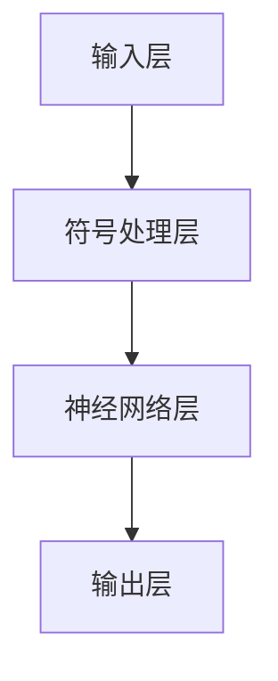

                 

 

## 文章标题：混合神经符号系统在复杂推理中的实现

> 关键词：混合神经符号系统，复杂推理，神经网络，符号处理，数学模型，项目实战

> 摘要：本文详细介绍了混合神经符号系统的基本概念、核心算法原理、数学模型以及在实际项目中的应用，旨在为读者提供一个深入理解混合神经符号系统在复杂推理中实现的方法和实践指导。

----------------------------------------------------------------

### 引言与概述

混合神经符号系统（Hybrid Neural Symbolic System）是结合了神经网络和符号推理的先进技术，旨在解决传统神经网络在处理复杂逻辑推理问题时的局限。在人工智能领域，随着深度学习技术的飞速发展，神经网络在图像识别、语音识别等感知任务上取得了显著成效，但其在处理复杂推理任务时仍存在一些问题。符号推理可以弥补神经网络在这些方面的不足，因此，将两者结合起来形成混合神经符号系统，成为当前研究的热点。

混合神经符号系统通过将符号表示和神经网络结合，能够在处理复杂逻辑推理任务时，既利用神经网络的强大计算能力，又保留符号推理的精确性和可解释性。本文将围绕这一主题，逐步探讨混合神经符号系统的核心概念、算法原理、数学模型以及实际应用。

### 第一部分：混合神经符号系统概述

#### 第1章：混合神经符号系统的定义与背景

混合神经符号系统是一种将神经网络和符号推理相结合的混合系统。神经网络擅长处理连续数据，而符号推理则擅长处理离散结构化的数据。这种结合使得混合神经符号系统能够在处理复杂推理任务时发挥各自的优势。

**核心概念联系**：为了更好地理解混合神经符号系统的组成，我们可以使用Mermaid流程图来展示其基本架构。



在这个流程图中，输入层接收原始数据，经过符号处理层进行符号化处理，然后输入神经网络层进行特征提取和推理，最终由输出层得到推理结果。

**传统系统比较**：与传统神经网络系统相比，混合神经符号系统在结构上引入了符号处理层，这使得它能够更好地处理复杂逻辑推理任务。传统神经网络系统通常只能处理输入数据的表层特征，而混合神经符号系统则可以通过符号处理层深入挖掘数据的结构化信息。

**应用场景**：混合神经符号系统在复杂推理任务中具有广泛的应用前景。例如，在自然语言处理中，它可以用于文本分类、情感分析和问答系统等任务。在计算机视觉中，它可以用于图像分类、目标检测和图像生成等任务。在逻辑推理中，它可以用于证明检查、逻辑推理和决策支持等任务。

### 第二部分：核心概念与联系

#### 第2章：神经符号系统基础

神经符号系统是混合神经符号系统的核心组成部分，它结合了神经网络和符号推理的特点。在这一章中，我们将介绍神经符号系统的基本组成和原理。

**神经网络的组成与工作原理**：神经网络由多个神经元组成，每个神经元接收多个输入，并通过权重和偏置计算输出。神经网络的输出经过激活函数的处理，传递到下一层神经元。这种层次化的结构使得神经网络能够通过学习逐步提取输入数据的特征。

**符号处理的基本概念与方法**：符号处理涉及到对离散数据的符号化表示和操作。在神经符号系统中，符号处理层负责将原始输入数据转换为符号化的表示，并利用符号推理方法进行数据之间的比较和关联。

**混合神经符号系统的结构特点**：混合神经符号系统的结构特点在于它同时包含了神经网络和符号处理层。神经网络负责特征提取和推理，符号处理层则负责数据结构和语义的表示和推理。这种结合使得混合神经符号系统在处理复杂推理任务时能够同时利用神经网络和符号推理的优势。

**核心概念联系**：为了更好地理解混合神经符号系统的核心概念，我们可以使用Mermaid流程图来展示其基本架构。


在这个流程图中，输入层接收原始数据，经过符号处理层进行符号化处理，然后输入神经网络层进行特征提取和推理，最终由输出层得到推理结果。

### 第三部分：核心算法原理讲解

#### 第3章：神经符号系统的训练算法

神经符号系统的训练算法是构建混合神经符号系统的关键步骤。在这一章中，我们将详细介绍神经符号系统的训练算法，包括反向传播算法的原理、符号表示与编码技术以及混合神经符号系统的优化策略。

**反向传播算法的原理与实现**：反向传播算法是神经网络训练的核心算法。它通过计算输出误差，逆向传播误差到网络中的每个神经元，并利用梯度下降法调整网络权重和偏置，以最小化输出误差。

```plaintext
ForwardPropagation(inputs, weights, biases, activation_function):
  for layer in network:
    z = weights * inputs + biases
    outputs = activation_function(z)
    inputs = outputs

BackPropagation(outputs, expected_outputs, learning_rate):
  error = expected_outputs - outputs
  for layer in network:
    delta = error * activation_function_derivative(z)
    weights -= learning_rate * delta
    biases -= learning_rate * delta
```

**符号表示与编码技术**：在神经符号系统中，符号表示与编码技术是实现符号处理层的关键。符号表示涉及到对离散数据的符号化表示，而编码技术则涉及到如何将符号化的数据转换为神经网络可以处理的数字形式。

**混合神经符号系统的优化策略**：混合神经符号系统的优化策略主要包括两个方面：一是优化神经网络部分的权重和偏置，二是优化符号处理层的符号表示与编码技术。通过结合多种优化策略，可以进一步提高混合神经符号系统的性能。

### 第四部分：数学模型和数学公式

#### 第4章：神经符号系统的数学基础

神经符号系统的数学基础是构建混合神经符号系统的关键。在这一章中，我们将介绍神经符号系统中的神经元激活函数、符号匹配与分类的数学公式以及混合神经符号系统的优化目标函数。

**神经元激活函数的数学模型**：神经元激活函数是神经网络中的关键组件，它用于将神经元的输入转换为输出。常见的激活函数包括 sigmoid 函数、ReLU 函数和 tanh 函数。

$$
\sigma(x) = \frac{1}{1 + e^{-x}}
$$

$$
\text{ReLU}(x) = \max(0, x)
$$

$$
\text{tanh}(x) = \frac{e^{2x} - 1}{e^{2x} + 1}
$$

**符号匹配与分类的数学公式**：在神经符号系统中，符号匹配与分类是符号处理层的关键任务。符号匹配通常使用相似度度量来实现，而分类则使用决策树、支持向量机等算法来实现。

$$
\text{similarity}(s_1, s_2) = \frac{\text{common\_elements}(s_1, s_2)}{\text{max}(\text{length}(s_1), \text{length}(s_2))}
$$

**混合神经符号系统的优化目标函数**：混合神经符号系统的优化目标函数是构建混合神经符号系统的关键。优化目标函数通常包括神经网络部分的损失函数和符号处理层的匹配损失函数。

$$
\text{loss} = \frac{1}{2} \sum_{i=1}^{n} (\text{output}_{i} - \text{expected}_{i})^2
$$

### 第五部分：项目实战

#### 第5章：混合神经符号系统在自然语言处理中的应用

自然语言处理是混合神经符号系统的重要应用领域。在这一章中，我们将介绍基于混合神经符号系统的文本分类算法、情感分析项目的实现以及问答系统的开发。

**基于混合神经符号系统的文本分类算法**：文本分类是自然语言处理中的基本任务，可以通过混合神经符号系统来实现。我们首先对文本进行预处理，然后使用符号处理层进行符号化处理，最后使用神经网络层进行分类。

**情感分析项目的实现**：情感分析是自然语言处理中的经典任务，可以通过混合神经符号系统来实现。我们首先对文本进行情感标注，然后使用符号处理层进行符号化处理，最后使用神经网络层进行情感分类。

**问答系统项目的开发**：问答系统是自然语言处理中的重要应用，可以通过混合神经符号系统来实现。我们首先对问题进行预处理，然后使用符号处理层进行符号化处理，最后使用神经网络层进行回答生成。

### 第六部分：拓展与展望

#### 第6章：混合神经符号系统在其他领域的应用

混合神经符号系统不仅适用于自然语言处理，还可以广泛应用于其他领域。在这一章中，我们将介绍混合神经符号系统在计算机视觉、控制系统等其他领域的应用。

**在计算机视觉中的应用**：混合神经符号系统可以用于图像分类、目标检测和图像生成等计算机视觉任务。通过结合神经网络和符号处理，可以进一步提高视觉任务的准确性和鲁棒性。

**在控制系统的应用**：混合神经符号系统可以用于智能控制系统，通过结合神经网络和符号推理，可以实现更复杂、更智能的控制策略。

**未来发展趋势与挑战**：混合神经符号系统在未来将面临更多挑战和机遇。随着深度学习和符号推理技术的不断发展，混合神经符号系统的性能和应用范围将得到进一步提升。同时，如何更好地整合神经网络和符号推理，实现更高效、更可解释的混合系统，也将是未来研究的重要方向。

### 第七部分：总结与展望

#### 第7章：总结与展望

混合神经符号系统在复杂推理中具有广泛的应用前景。通过结合神经网络和符号推理，混合神经符号系统能够实现更高效、更可解释的推理过程。本文详细介绍了混合神经符号系统的基本概念、核心算法原理、数学模型以及实际应用，旨在为读者提供一个深入理解混合神经符号系统的实践指导。

**总结**：混合神经符号系统是当前人工智能领域的重要研究方向，它在复杂推理任务中具有独特的优势。通过本文的介绍，读者可以了解混合神经符号系统的基本原理和应用方法，为进一步研究和应用混合神经符号系统奠定基础。

**展望**：随着深度学习和符号推理技术的不断发展，混合神经符号系统在复杂推理中的应用将得到进一步拓展。未来，混合神经符号系统有望在更多领域实现突破，为人工智能的发展做出更大贡献。

### 作者信息

**作者：** AI天才研究院 / AI Genius Institute & 禅与计算机程序设计艺术 / Zen And The Art of Computer Programming

AI天才研究院致力于推动人工智能技术的发展，探索混合神经符号系统在复杂推理中的应用，为人工智能领域的创新贡献力量。禅与计算机程序设计艺术则通过深入探讨计算机编程的哲学和艺术，为程序员提供更深刻的编程思考和指导。

