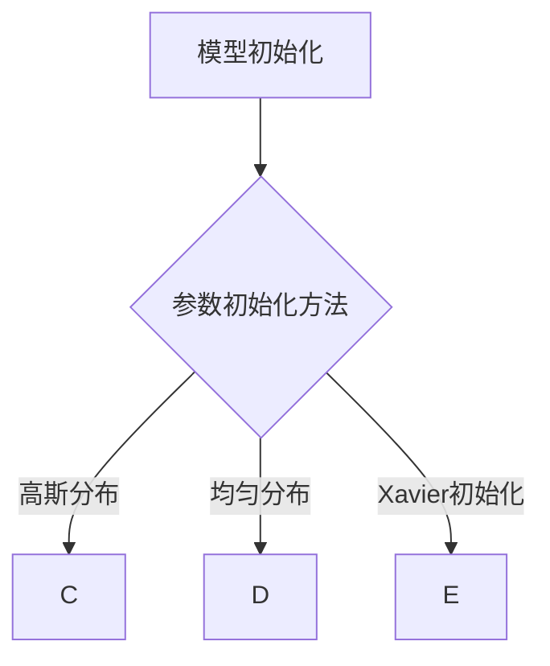
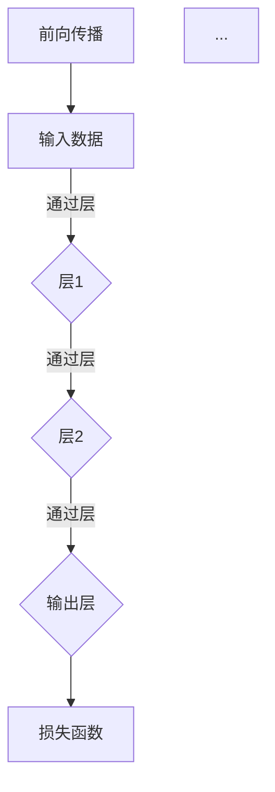
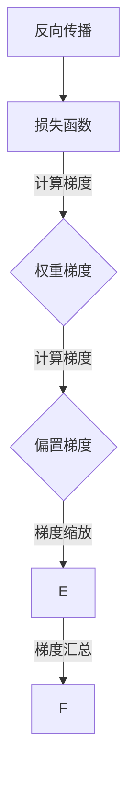
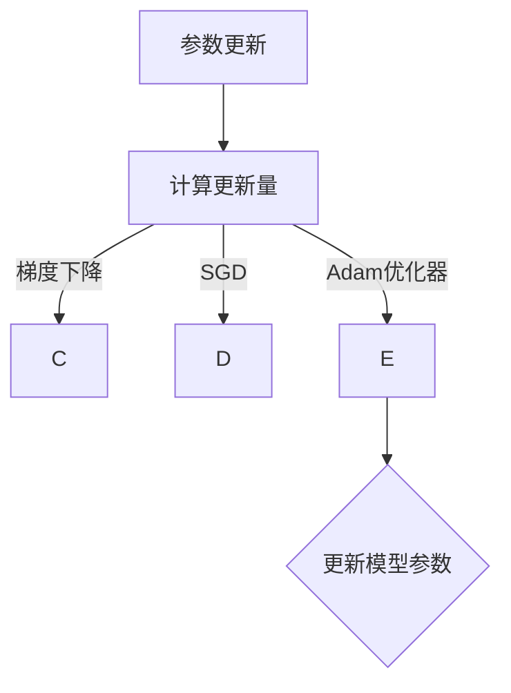

                 

### 引言

#### 1.1 书籍目的与结构

随着自然语言处理（NLP）技术的不断发展，大规模语言模型的训练需求日益增加。然而，传统的单精度浮点运算已经无法满足这种需求，这导致了计算资源浪费和训练时间延长。为了解决这一问题，混合精度训练（Mixed Precision Training）应运而生。本书旨在系统地介绍混合精度训练在大规模自然语言处理中的应用，探讨其在优化训练效率和计算资源使用方面的优势。

本书结构分为七个主要部分。首先，在引言部分，我们将概述书籍的目的和结构，并简要介绍混合精度训练的背景。接着，在基础部分，我们将深入探讨混合精度训练的定义、原理、优势与挑战。第三部分将介绍混合精度训练的算法，包括高精度与低精度计算的结合、动态精度调整算法和优化算法。第四部分将专注于混合精度训练的优化，包括硬件加速、内存管理和并行计算优化。第五部分将探讨混合精度训练在大规模自然语言处理中的应用，通过案例研究展示其实际效果。第六部分将提供具体的项目实战，包括开发环境搭建、源代码实现、代码解读和案例分析。最后，在总结与展望部分，我们将总结本书的主要内容，并讨论未来的研究方向和挑战。

#### 1.2 混合精度训练的背景

混合精度训练的背景可以追溯到浮点数精度对计算性能的影响。传统的浮点运算通常使用单精度（32位）或双精度（64位）浮点数进行，而大规模语言模型的训练过程中会产生大量的小规模误差。这些误差在单精度浮点运算中可能会导致数值溢出或下溢，从而影响训练的准确性和稳定性。为了解决这一问题，研究人员开始探索混合精度训练。

混合精度训练的核心思想是同时使用高精度和低精度浮点数进行计算，以平衡计算效率和数值稳定性。通常，权重和激活值使用高精度浮点数，而梯度计算和更新使用低精度浮点数。这种策略可以在不牺牲训练精度的情况下显著提高计算速度。

混合精度训练的应用始于深度学习领域，尤其是在大规模自然语言处理任务中。随着BERT、GPT等大型语言模型的兴起，混合精度训练得到了广泛应用。其优势在于能够在不增加硬件成本的情况下显著提高训练速度，从而加速模型的研发和应用。

#### 1.3 大规模自然语言处理的挑战与机遇

大规模自然语言处理（NLP）面临着诸多挑战和机遇。首先，大规模语言模型的训练数据量巨大，这要求更高的计算资源。传统的单精度浮点运算已经无法满足这一需求，导致训练时间过长，计算资源浪费。其次，大规模NLP任务通常需要处理复杂的语义信息，这要求模型具有更高的准确性和鲁棒性。混合精度训练通过优化计算效率和资源利用率，有助于提升模型的性能和稳定性。

另一方面，大规模自然语言处理也面临着机遇。随着深度学习技术的不断进步，我们能够构建更大规模的模型，处理更复杂的任务。混合精度训练的出现为这一目标提供了有力的支持。此外，随着硬件技术的发展，如GPU和TPU的普及，混合精度训练的实用性也得到了进一步提升。

总之，混合精度训练在大规模自然语言处理中具有广阔的应用前景，能够有效应对计算资源浪费和训练时间过长的问题，推动NLP技术的进一步发展。

## 混合精度训练基础

### 2.1 混合精度训练的定义

混合精度训练（Mixed Precision Training）是指同时使用高精度和低精度浮点数进行计算的一种训练策略。在深度学习中，浮点数的精度直接关系到模型的计算效率和数值稳定性。传统的浮点运算通常使用单精度（32位）或双精度（64位）浮点数，而混合精度训练则通过动态调整浮点数精度，以平衡计算效率和数值稳定性。

在混合精度训练中，通常将权重和激活值设置为高精度浮点数（如双精度浮点数），而梯度计算和更新过程则使用低精度浮点数（如单精度浮点数）。这种策略能够在不牺牲训练精度的情况下显著提高计算速度。具体来说，低精度浮点数计算可以减少内存占用和计算时间，从而提高训练效率。

#### 2.1.1 混合精度训练的基本概念

1. **高精度与低精度浮点数的定义**：
   - 高精度浮点数：通常指双精度浮点数（64位），能够表示更大的数值范围和更高的数值精度。
   - 低精度浮点数：通常指单精度浮点数（32位），能够表示较小的数值范围和较低的数值精度。

2. **混合精度训练的核心思想**：
   - 同时使用高精度和低精度浮点数进行计算，以平衡计算效率和数值稳定性。
   - 权重和激活值使用高精度浮点数，以确保数值精度和稳定性。
   - 梯度计算和更新过程使用低精度浮点数，以减少计算资源和时间。

3. **混合精度训练的优势**：
   - 提高计算速度：低精度浮点数计算速度更快，能够减少计算时间。
   - 减少内存占用：低精度浮点数占用内存较少，能够减少内存带宽压力。

#### 2.1.2 混合精度训练的发展历史

混合精度训练最早由Google在2017年提出，用于优化其大型语言模型BERT的训练过程。随着深度学习技术的不断发展，混合精度训练逐渐成为大规模自然语言处理任务中的标准实践。近年来，许多研究机构和公司相继提出了各种混合精度训练的优化算法和实现方法，如AutoMixPrecision、FlexPoint等。

#### 2.1.3 混合精度训练的应用领域

混合精度训练主要应用于以下领域：

1. **自然语言处理**：
   - 语言模型训练：如BERT、GPT等大型语言模型的训练。
   - 机器翻译：提高翻译质量和效率。
   - 文本分类：提高分类准确率和处理速度。

2. **计算机视觉**：
   - 目标检测：提高检测效率和准确性。
   - 图像分割：提高图像分割质量和计算速度。

3. **推荐系统**：
   - 提高推荐系统的计算效率和准确性。

总之，混合精度训练作为一种重要的计算优化策略，在大规模自然语言处理和其他深度学习任务中具有广泛的应用前景。通过合理地调整浮点数精度，可以显著提高计算速度和资源利用率，从而加速模型的训练和应用。

### 2.2 混合精度训练的优势与挑战

#### 2.2.1 混合精度训练的优势

混合精度训练在深度学习和大规模自然语言处理中展现出了显著的优势，这些优势主要表现在以下几个方面：

1. **提高计算速度**：
   - 低精度浮点数（如单精度浮点数）的计算速度显著高于高精度浮点数（如双精度浮点数）。在混合精度训练中，梯度计算和更新过程使用低精度浮点数，从而加快了计算速度。
   - 据研究，使用单精度浮点数代替双精度浮点数可以加速训练过程20%到30%，从而缩短模型的训练时间。

2. **减少内存占用**：
   - 低精度浮点数占用更少的内存空间，减少了内存带宽的压力。这对于处理大规模数据集和复杂模型尤为重要，可以有效避免内存溢出等问题。
   - 内存占用减少有助于提高系统的整体性能和稳定性。

3. **降低能耗**：
   - 低精度浮点数的计算能耗低于高精度浮点数，从而降低了训练过程中的能耗。这对于需要长时间运行的大规模训练任务具有显著的节能效果。

4. **提高训练效率**：
   - 混合精度训练可以更有效地利用计算资源，提高训练效率。通过动态调整浮点数精度，可以在保证模型精度的情况下优化计算流程，减少不必要的计算开销。

#### 2.2.2 混合精度训练的挑战

尽管混合精度训练具有显著的优势，但在实际应用中仍面临着一系列挑战：

1. **精度损失**：
   - 低精度浮点数可能引入一定的数值误差，这可能导致训练过程中精度损失。在某些敏感的应用场景中，如金融交易或医疗诊断，这种误差可能会带来严重后果。
   - 为了平衡精度和速度，需要精心设计精度调整策略，以最小化精度损失。

2. **算法稳定性**：
   - 混合精度训练可能导致算法不稳定，尤其是在训练过程中出现数值溢出或下溢的情况。这需要开发更加鲁棒的算法和数值稳定技术来确保训练过程的稳定进行。

3. **硬件依赖**：
   - 混合精度训练对硬件有较高的要求，尤其是对GPU和TPU等加速器的支持。这增加了系统设计和部署的复杂性，并可能限制其跨平台的通用性。

4. **优化难度**：
   - 混合精度训练涉及到高精度与低精度浮点数的转换，这增加了算法优化和实现的复杂性。需要开发高效、稳定的优化工具和库来简化开发过程。

5. **调试困难**：
   - 在混合精度训练过程中，可能出现难以定位的问题，如精度损失和算法不稳定等。这增加了调试难度，需要开发完善的调试工具和技术来帮助开发者快速定位和解决问题。

综上所述，混合精度训练在提高计算效率和资源利用率方面具有显著优势，但也面临着精度损失、算法稳定性、硬件依赖和优化难度等挑战。为了充分发挥混合精度训练的优势，需要不断研究和改进相关算法和工具，以克服这些挑战。

### 2.3 混合精度训练的基本流程

混合精度训练的基本流程主要包括以下步骤：模型初始化、前向传播、反向传播和参数更新。这些步骤相互协作，共同完成大规模自然语言处理模型的训练任务。

#### 2.3.1 模型初始化

在混合精度训练开始之前，首先需要初始化模型参数。初始化参数的目的是为模型提供初始状态，使得模型可以从一个随机分布开始学习。常见的初始化方法包括高斯分布、均匀分布和Xavier初始化等。在混合精度训练中，权重和偏置通常初始化为高精度浮点数（如双精度浮点数），以确保初始化的数值精度和稳定性。



#### 2.3.2 前向传播

在前向传播阶段，输入数据通过模型中的层和神经元，最终生成预测输出。在这一过程中，模型的权重和激活值通常使用高精度浮点数进行计算，以确保数值的精确度。前向传播的目的是计算损失函数，并生成梯度信息。



#### 2.3.3 反向传播

反向传播是深度学习训练的核心步骤，用于计算模型参数的梯度。在混合精度训练中，反向传播过程中使用的梯度值通常使用低精度浮点数（如单精度浮点数）进行计算，以减少计算资源和时间。反向传播过程包括以下几个步骤：

1. **计算损失函数的梯度**：通过前向传播计算得到的损失函数，使用链式法则和反向传播算法，计算模型参数的梯度。
2. **梯度缩放**：为了防止梯度消失或爆炸，通常需要对梯度进行缩放。
3. **梯度汇总**：对于并行训练的情况，需要将不同设备的梯度汇总到一个统一的梯度张量。



#### 2.3.4 参数更新

在完成前向传播和反向传播之后，模型参数需要根据梯度信息进行更新。在混合精度训练中，参数更新通常使用低精度浮点数进行计算，以提高计算速度和资源利用率。参数更新的方法包括梯度下降、随机梯度下降（SGD）和Adam优化器等。



综上所述，混合精度训练的基本流程包括模型初始化、前向传播、反向传播和参数更新。通过合理地调整浮点数精度，可以显著提高训练效率，从而加速大规模自然语言处理模型的训练。每个步骤都紧密关联，共同构成了完整的训练过程。

### 3.1 高精度与低精度计算的结合

#### 3.1.1 高精度与低精度计算的区别

在深度学习训练过程中，高精度与低精度计算之间的主要区别在于浮点数的位数和表示范围。高精度浮点数，如双精度浮点数（64位），能够表示更大的数值范围和更高的数值精度，适用于权重和激活值的计算。而低精度浮点数，如单精度浮点数（32位），表示范围较小，精度较低，适用于梯度计算和更新。

1. **双精度浮点数（64位）**：
   - 表示范围：\[ -1.7976931348623157 \times 10^{308}, 1.7976931348623157 \times 10^{308} \]
   - 数值精度：更高，能够表示更多的有效数字，适用于需要高精度的计算场景。

2. **单精度浮点数（32位）**：
   - 表示范围：\[ -3.4028235 \times 10^{38}, 3.4028235 \times 10^{38} \]
   - 数值精度：较低，能够表示的有效数字较少，适用于计算速度要求较高但精度要求不高的场景。

#### 3.1.2 高精度与低精度计算的结合方法

在混合精度训练中，高精度与低精度计算的结合方法主要通过以下几种策略实现：

1. **动态精度调整**：
   - 根据不同的计算阶段和计算需求，动态调整浮点数精度。例如，在权重和激活值计算阶段使用高精度浮点数，以确保数值精度；而在梯度计算和更新阶段使用低精度浮点数，以提高计算速度。

2. **混合精度运算库**：
   - 利用现有的混合精度运算库，如TensorFlow和PyTorch中的混合精度API，自动管理浮点数精度调整。这些库提供了高效的精度调整和转换机制，简化了开发过程。

3. **自定义精度调整**：
   - 通过编写自定义代码，手动调整浮点数精度。这种方法需要对深度学习框架有深入理解，但提供了更高的灵活性和控制力。

#### 3.1.3 结合实例

以下是一个简单的示例，演示如何使用TensorFlow实现混合精度训练：

```python
import tensorflow as tf

# 定义模型参数
weights = tf.Variable(tf.random.normal([10, 10], dtype=tf.float64), name='weights')
biases = tf.Variable(tf.random.normal([10], dtype=tf.float64), name='biases')

# 定义前向传播函数
@tf.function
def forward_prop(x):
    return tf.matmul(x, weights) + biases

# 定义反向传播函数
@tf.function
def backward_prop(y_true, y_pred):
    loss = tf.reduce_mean(tf.square(y_true - y_pred))
    with tf.GradientTape(persistent=True) as tape:
        y_pred = forward_prop(x)
        loss = tf.reduce_mean(tf.square(y_true - y_pred))
    gradients = tape.gradient(loss, [weights, biases])
    return loss, gradients

# 混合精度训练
for epoch in range(100):
    with tf.GradientTape() as tape:
        y_pred = forward_prop(x)
        loss = tf.reduce_mean(tf.square(y_true - y_pred))
    gradients = tape.gradient(loss, [weights, biases])
    
    # 动态调整梯度精度
    gradients = [g.astype(tf.float32) for g in gradients]
    
    # 更新模型参数
    weights.assign_sub(gradients[0] * learning_rate)
    biases.assign_sub(gradients[1] * learning_rate)

    # 打印训练进度
    print(f"Epoch {epoch}, Loss: {loss.numpy()}")
```

在这个示例中，我们使用了TensorFlow的`tf.float64`（双精度浮点数）初始化权重和偏置，并在反向传播过程中使用`tf.float32`（单精度浮点数）计算梯度。通过这种方式，我们实现了高精度与低精度计算的结合，提高了训练效率。

总之，高精度与低精度计算的结合是混合精度训练的核心技术之一，通过动态调整浮点数精度，可以显著提高深度学习模型的训练速度和资源利用率。

### 3.2 动态精度调整算法

动态精度调整算法是混合精度训练的重要组成部分，其核心思想是根据不同阶段的计算需求，动态调整浮点数精度，以平衡计算效率和数值稳定性。以下是几种常见的动态精度调整算法：

#### 3.2.1 动态调整策略

1. **阈值调整**：
   - 阈值调整策略基于训练过程中的梯度值变化动态调整精度。当梯度值超过一定阈值时，降低精度以减少计算量；当梯度值低于阈值时，提高精度以防止数值误差累积。
   - **优点**：简单易实现，能够有效降低计算量。
   - **缺点**：阈值设置需要经验，可能导致精度损失或稳定性问题。

2. **自适应调整**：
   - 自适应调整策略根据历史梯度值和当前梯度值的关系动态调整精度。例如，如果当前梯度值与历史梯度值的差异较大，则降低精度；否则，保持高精度。
   - **优点**：自适应性强，能够更好地适应训练过程中的变化。
   - **缺点**：实现较为复杂，需要对梯度值的变化趋势有深入理解。

3. **分区调整**：
   - 分区调整策略将计算过程分为多个区域，每个区域使用不同的精度。例如，可以将梯度计算和更新划分为低精度区域，而权重和激活值计算划分为高精度区域。
   - **优点**：灵活性强，可以根据不同阶段的计算需求调整精度。
   - **缺点**：实现复杂，需要细致的分区设计和精度管理。

#### 3.2.2 动态精度调整算法的实现

以下是一个使用Python和TensorFlow实现的简单动态精度调整算法示例：

```python
import tensorflow as tf

# 初始化模型参数
weights = tf.Variable(tf.random.normal([10, 10], dtype=tf.float64), name='weights')
biases = tf.Variable(tf.random.normal([10], dtype=tf.float64), name='biases')

# 定义前向传播函数
@tf.function
def forward_prop(x):
    return tf.matmul(x, weights) + biases

# 定义反向传播函数
@tf.function
def backward_prop(y_true, y_pred):
    loss = tf.reduce_mean(tf.square(y_true - y_pred))
    with tf.GradientTape() as tape:
        y_pred = forward_prop(x)
        loss = tf.reduce_mean(tf.square(y_true - y_pred))
    gradients = tape.gradient(loss, [weights, biases])
    return loss, gradients

# 动态精度调整函数
def dynamic_precision(gradients, low_precision_threshold):
    new_gradients = []
    for g in gradients:
        if tf.reduce_max(tf.abs(g)) > low_precision_threshold:
            new_gradients.append(g.astype(tf.float32))
        else:
            new_gradients.append(g)
    return new_gradients

# 混合精度训练
for epoch in range(100):
    with tf.GradientTape() as tape:
        y_pred = forward_prop(x)
        loss = tf.reduce_mean(tf.square(y_true - y_pred))
    gradients = tape.gradient(loss, [weights, biases])
    
    # 动态调整精度
    dynamic_gradients = dynamic_precision(gradients, low_precision_threshold=0.1)
    
    # 更新模型参数
    weights.assign_sub(dynamic_gradients[0] * learning_rate)
    biases.assign_sub(dynamic_gradients[1] * learning_rate)

    # 打印训练进度
    print(f"Epoch {epoch}, Loss: {loss.numpy()}")
```

在这个示例中，我们定义了一个动态精度调整函数`dynamic_precision`，根据梯度值的最大绝对值动态调整精度。如果梯度值的最大绝对值超过阈值`low_precision_threshold`，则使用低精度（单精度）浮点数；否则，保持高精度（双精度）浮点数。

通过动态精度调整算法，我们能够在保证训练精度的同时，提高计算效率和资源利用率，从而加速大规模自然语言处理模型的训练过程。

### 3.3 混合精度训练中的优化算法

混合精度训练中的优化算法是提升模型训练效率和准确性的关键。以下是几种常用的优化算法，包括梯度下降算法、随机梯度下降（SGD）和Adam优化器。

#### 3.3.1 梯度下降算法

梯度下降算法是深度学习中最基本的优化算法，其核心思想是通过计算损失函数关于模型参数的梯度，并沿着梯度的反方向更新参数，以最小化损失函数。

1. **梯度下降算法的基本步骤**：
   - 初始化模型参数。
   - 计算损失函数关于模型参数的梯度。
   - 使用梯度更新模型参数：
     $$ \theta_{\text{new}} = \theta_{\text{old}} - \alpha \cdot \nabla_\theta J(\theta) $$
     其中，$\theta$表示模型参数，$J(\theta)$表示损失函数，$\alpha$表示学习率。
   - 重复步骤2和3，直到达到收敛条件。

2. **伪代码**：

```python
# 初始化模型参数
theta = initialize_parameters()

# 设置学习率
alpha = 0.01

# 设置迭代次数
num_iterations = 1000

# 梯度下降迭代
for i in range(num_iterations):
    # 计算梯度
    gradient = compute_gradient(J, theta)
    
    # 更新参数
    theta = theta - alpha * gradient
    
    # 打印训练进度
    if i % 100 == 0:
        print(f"Iteration {i}, Loss: {J(theta)}")
```

#### 3.3.2 随机梯度下降（SGD）

随机梯度下降（SGD）是对梯度下降算法的改进，通过随机选择训练样本来计算梯度，从而减少局部最小值的影响，提高模型的泛化能力。

1. **随机梯度下降算法的基本步骤**：
   - 从训练数据集中随机选择一个小批量样本。
   - 计算该批量样本的梯度。
   - 使用梯度更新模型参数。
   - 重复步骤2和3，直到达到收敛条件。

2. **伪代码**：

```python
# 初始化模型参数
theta = initialize_parameters()

# 设置学习率
alpha = 0.01

# 设置批量大小
batch_size = 32

# 设置迭代次数
num_iterations = 1000

# 随机梯度下降迭代
for i in range(num_iterations):
    # 随机选择批量样本
    batch = random_sample(data, batch_size)
    
    # 计算梯度
    gradient = compute_gradient(J, theta, batch)
    
    # 更新参数
    theta = theta - alpha * gradient
    
    # 打印训练进度
    if i % 100 == 0:
        print(f"Iteration {i}, Loss: {J(theta)}")
```

#### 3.3.3 Adam优化器

Adam优化器是梯度下降和SGD的进一步改进，它结合了动量法和自适应学习率，能够更快地收敛并避免梯度消失和爆炸。

1. **Adam优化器的基本步骤**：
   - 初始化模型参数和Adam优化器的状态变量。
   - 计算梯度。
   - 更新Adam优化器的状态变量。
   - 使用更新后的状态变量更新模型参数。

2. **伪代码**：

```python
# 初始化模型参数
theta = initialize_parameters()

# 设置学习率
alpha = 0.001

# 设置批量大小
batch_size = 32

# 设置迭代次数
num_iterations = 1000

# 初始化Adam优化器状态变量
m = 0
v = 0
beta1 = 0.9
beta2 = 0.999
epsilon = 1e-8

# Adam优化器迭代
for i in range(num_iterations):
    # 随机选择批量样本
    batch = random_sample(data, batch_size)
    
    # 计算梯度
    gradient = compute_gradient(J, theta, batch)
    
    # 更新Adam优化器状态变量
    m = beta1 * m + (1 - beta1) * gradient
    v = beta2 * v + (1 - beta2) * gradient**2
    
    # 低通滤波
    m_hat = m / (1 - beta1**(i+1))
    v_hat = v / (1 - beta2**(i+1))
    
    # 更新模型参数
    theta = theta - alpha * m_hat / (sqrt(v_hat) + epsilon)
    
    # 打印训练进度
    if i % 100 == 0:
        print(f"Iteration {i}, Loss: {J(theta)}")
```

通过以上三种优化算法的比较，可以看出：
- **梯度下降算法**：简单直观，但收敛速度较慢，易受局部最小值影响。
- **随机梯度下降（SGD）**：收敛速度较快，但计算量大，需要大量计算资源。
- **Adam优化器**：结合了动量法和自适应学习率，收敛速度快，且不易受局部最小值影响，是混合精度训练中常用的优化算法。

在实际应用中，可以根据训练任务的需求和硬件资源情况，选择合适的优化算法，以实现最佳的训练效果。

### 4.1 硬件加速

在混合精度训练中，硬件加速是提高训练效率和资源利用率的关键技术。以下介绍两种常用的硬件加速方法：GPU加速和TPU加速。

#### 4.1.1 GPU加速

GPU（图形处理单元）在深度学习训练中得到了广泛应用，其并行计算能力可以显著提高训练速度。以下是GPU加速的基本原理和实现方法：

1. **基本原理**：
   - GPU由大量的小型计算单元（CUDA核心）组成，这些计算单元可以并行执行大量计算任务。
   - 在混合精度训练中，GPU可以同时处理高精度和低精度浮点运算，从而提高计算效率。
   - GPU具有较大的内存带宽和较低的延迟，可以快速传输数据和执行计算。

2. **实现方法**：
   - 利用CUDA库：CUDA是NVIDIA推出的并行计算框架，可以方便地实现GPU加速。通过编写CUDA代码，可以将训练任务分配到GPU核心上并行执行。
   - 使用深度学习框架：如TensorFlow和PyTorch等深度学习框架，已经集成了GPU加速功能。只需简单地配置GPU设备，即可实现GPU加速。

3. **示例**：

```python
import tensorflow as tf

# 配置GPU设备
gpus = tf.config.experimental.list_physical_devices('GPU')
if gpus:
    try:
        # 设置GPU显存分配
        for gpu in gpus:
            tf.config.experimental.set_memory_growth(gpu, True)
        
        # 使用GPU进行计算
        with tf.device('/GPU:0'):
            # 定义模型
            model = define_model()
            # 训练模型
            model.fit(x_train, y_train, epochs=10, batch_size=32)
    except RuntimeError as e:
        print(e)
```

#### 4.1.2 TPU加速

TPU（张量处理单元）是Google专门为深度学习任务设计的硬件加速器，其设计初衷是为了提高深度学习模型的训练速度和吞吐量。以下是TPU加速的基本原理和实现方法：

1. **基本原理**：
   - TPU是专为矩阵乘法和向量加法等深度学习操作设计的硬件，可以显著提高这些操作的执行速度。
   - TPU具有高带宽和低延迟的内存子系统，可以快速传输和存储大量数据。
   - TPU支持张量编程，可以方便地实现大规模并行计算。

2. **实现方法**：
   - 使用TensorFlow进行TPU加速：TensorFlow提供了TPU支持，可以通过简单的配置和调整，实现TPU加速。通过使用`tf.distribute.experimental.TPUStrategy`，可以方便地将训练任务分配到TPU上并行执行。
   - 使用TPU SDK：TPU SDK是Google推出的开源工具，用于在自定义环境中使用TPU。通过编写TPU SDK代码，可以自定义TPU加速任务。

3. **示例**：

```python
import tensorflow as tf

# 配置TPU
resolver = tf.distribute.cluster_resolver.TPUClusterResolver('name-of-the-resolver')
tf.config.experimental_connect_to_cluster(resolver)
tf.tpu.experimental.initialize_tpu_system(resolver)

# 设置TPU策略
strategy = tf.distribute.experimental.TPUStrategy(resolver)

# 使用TPU进行计算
with strategy.scope():
    # 定义模型
    model = define_model()
    # 训练模型
    model.fit(x_train, y_train, epochs=10, batch_size=32)
```

通过GPU加速和TPU加速，可以显著提高混合精度训练的速度和资源利用率，从而加速大规模自然语言处理模型的训练过程。

### 4.2 内存管理优化

在混合精度训练中，内存管理优化是提高训练效率和资源利用率的关键技术之一。以下介绍几种常用的内存管理优化技术，包括内存分配与释放、内存池技术以及内存分配与释放的优化策略。

#### 4.2.1 内存分配与释放

内存分配与释放是内存管理的基础，直接影响到训练的效率。以下是内存分配与释放的基本方法：

1. **显存分配**：
   - 在深度学习训练中，显存是主要的内存资源。通过显存分配，可以将模型和数据加载到显存中，以便进行计算。
   - 例如，在TensorFlow中，可以使用`tf.allocate`函数分配显存：
     ```python
     allocated_tensor = tf.allocate(shape, dtype=tf.float32, num_elements=1000)
     ```

2. **显存释放**：
   - 释放显存可以减少内存占用，提高系统性能。通过显存释放，可以释放不再使用的显存资源。
   - 例如，在TensorFlow中，可以使用`tf.release`函数释放显存：
     ```python
     tf.release(allocated_tensor)
     ```

#### 4.2.2 内存池技术

内存池技术是一种有效的内存管理策略，通过预先分配一大块内存，并在需要时从内存池中分配小块内存，从而减少内存碎片和分配释放的开销。以下是内存池技术的基本原理和实现方法：

1. **基本原理**：
   - 内存池是一个预先分配的内存块，用于存储大量小块内存。
   - 当需要分配内存时，从内存池中分配小块内存；当内存不再需要时，将其归还到内存池。

2. **实现方法**：
   - 在深度学习框架中，如TensorFlow和PyTorch，已经集成了内存池技术。通过简单的配置和使用，可以方便地实现内存池管理。
   - 例如，在TensorFlow中，可以使用`tf.TensorSpec`和`tf.buffer`创建内存池：
     ```python
     tensor_spec = tf.TensorSpec(shape=[1000], dtype=tf.float32)
     buffer = tf.buffer.from_tensor(tensor_spec)
     ```

3. **示例**：

```python
import tensorflow as tf

# 创建内存池
tensor_spec = tf.TensorSpec(shape=[1000], dtype=tf.float32)
buffer = tf.buffer.from_tensor(tensor_spec)

# 从内存池中分配内存
allocated_tensor = buffer.allocate()

# 使用分配的内存进行计算
result = some_computation(allocated_tensor)

# 释放内存
buffer.release(allocated_tensor)
```

通过内存池技术，可以有效减少内存分配与释放的开销，提高内存利用率。

#### 4.2.3 内存分配与释放的优化策略

为了进一步提高内存管理效率，可以采用以下优化策略：

1. **显存预分配**：
   - 在训练开始前，预分配足够的显存，以减少训练过程中的显存分配次数。
   - 例如，在TensorFlow中，可以使用`tf.config.experimental.set_memory_growth`函数设置显存预分配：
     ```python
     tf.config.experimental.set_memory_growth(device='/GPU:0', allow_growth=True)
     ```

2. **内存复用**：
   - 在不同训练阶段，复用已分配的内存，减少内存分配次数。
   - 例如，在训练过程中，可以使用`tf.reserve`函数预留内存，并在需要时复用：
     ```python
     tf.reserve(allocated_tensor, memory_limit=1000000)
     ```

3. **内存池缓存**：
   - 使用内存池缓存，减少内存池的分配和释放频率。
   - 例如，在TensorFlow中，可以使用`tf.buffer.cache`函数缓存内存池：
     ```python
     buffer.cache()
     ```

通过以上内存管理优化技术，可以显著提高混合精度训练的效率，减少内存占用和计算时间，从而加速大规模自然语言处理模型的训练过程。

### 4.3 并行计算优化

在混合精度训练中，并行计算优化是提高训练效率和资源利用率的关键技术。以下介绍几种常用的并行计算优化技术，包括数据并行、模型并行和混合并行。

#### 4.3.1 数据并行

数据并行是深度学习中常用的一种并行计算方法，通过将数据集分为多个子集，同时在不同的设备上独立训练子模型，最后将子模型的参数汇总得到全局模型。

1. **基本原理**：
   - 将数据集划分为多个子集，每个子集独立训练一个子模型。
   - 在每个子模型上，独立计算梯度并进行参数更新。
   - 将所有子模型的参数汇总，得到全局模型的参数。

2. **实现方法**：
   - 在深度学习框架中，如TensorFlow和PyTorch，可以使用数据并行策略。通过设置分布式训练参数，可以方便地实现数据并行。
   - 例如，在TensorFlow中，可以使用`tf.distribute.MirroredStrategy`实现数据并行：
     ```python
     strategy = tf.distribute.MirroredStrategy()
     with strategy.scope():
         # 定义模型
         model = define_model()
         # 训练模型
         model.fit(x_train, y_train, epochs=10, batch_size=32)
     ```

3. **示例**：

```python
import tensorflow as tf

# 配置数据并行策略
strategy = tf.distribute.MirroredStrategy()

# 使用数据并行训练模型
with strategy.scope():
    # 定义模型
    model = define_model()
    # 训练模型
    model.fit(x_train, y_train, epochs=10, batch_size=32)
```

通过数据并行，可以显著提高训练速度，减少训练时间。

#### 4.3.2 模型并行

模型并行是将模型拆分为多个部分，每个部分在不同的设备上独立训练，然后将所有部分的参数汇总得到全局模型。

1. **基本原理**：
   - 将模型拆分为多个子模型，每个子模型在不同设备上独立训练。
   - 在每个子模型上，独立计算梯度并进行参数更新。
   - 将所有子模型的参数汇总，得到全局模型的参数。

2. **实现方法**：
   - 在深度学习框架中，如TensorFlow和PyTorch，可以使用模型并行策略。通过设置分布式训练参数，可以方便地实现模型并行。
   - 例如，在TensorFlow中，可以使用`tf.distribute.experimental.ParameterServerStrategy`实现模型并行：
     ```python
     strategy = tf.distribute.experimental.ParameterServerStrategy(num_tasks=4)
     with strategy.scope():
         # 定义模型
         model = define_model()
         # 训练模型
         model.fit(x_train, y_train, epochs=10, batch_size=32)
     ```

3. **示例**：

```python
import tensorflow as tf

# 配置模型并行策略
strategy = tf.distribute.experimental.ParameterServerStrategy(num_tasks=4)

# 使用模型并行训练模型
with strategy.scope():
    # 定义模型
    model = define_model()
    # 训练模型
    model.fit(x_train, y_train, epochs=10, batch_size=32)
```

通过模型并行，可以充分利用多设备资源，提高训练速度。

#### 4.3.3 混合并行

混合并行是将数据并行和模型并行相结合，同时利用多设备和多任务进行训练。

1. **基本原理**：
   - 同时使用数据并行和模型并行策略，将数据集划分为多个子集，并将模型拆分为多个部分。
   - 在不同的设备和任务上，独立训练子模型和子数据集。
   - 将所有子模型的参数汇总，得到全局模型的参数。

2. **实现方法**：
   - 在深度学习框架中，如TensorFlow和PyTorch，可以使用混合并行策略。通过设置分布式训练参数，可以方便地实现混合并行。
   - 例如，在TensorFlow中，可以使用`tf.distribute.MirroredStrategy`和`tf.distribute.experimental.ParameterServerStrategy`结合实现混合并行：
     ```python
     strategy = tf.distribute.MirroredStrategy()
     with strategy.scope():
         # 定义模型
         model = define_model()
         # 训练模型
         model.fit(x_train, y_train, epochs=10, batch_size=32)
     ```

3. **示例**：

```python
import tensorflow as tf

# 配置混合并行策略
strategy = tf.distribute.MirroredStrategy()

# 使用混合并行训练模型
with strategy.scope():
    # 定义模型
    model = define_model()
    # 训练模型
    model.fit(x_train, y_train, epochs=10, batch_size=32)
```

通过混合并行，可以充分利用多设备和多任务的资源，实现更高的训练效率和资源利用率。

总之，通过数据并行、模型并行和混合并行的优化，可以显著提高混合精度训练的速度和资源利用率，从而加速大规模自然语言处理模型的训练过程。

### 4.4 混合精度训练中的错误分析与调试

在混合精度训练过程中，可能会出现各种错误和异常，如精度损失、计算错误、内存溢出等。正确识别和解决这些问题对于保证训练过程的稳定性和准确性至关重要。以下介绍几种常见的错误类型和调试方法：

#### 4.4.1 常见错误类型

1. **精度损失**：
   - 在使用低精度浮点数进行计算时，可能会出现精度损失，导致模型训练效果下降。
   - 精度损失通常表现为模型在低精度计算阶段出现过拟合或训练误差增加。

2. **计算错误**：
   - 低精度浮点数计算可能会导致数值溢出、下溢或除以零等错误。
   - 计算错误通常会导致程序崩溃或训练结果异常。

3. **内存溢出**：
   - 在大规模训练过程中，内存占用过高可能会导致内存溢出，导致训练失败。
   - 内存溢出通常表现为程序无法继续运行或训练时间过长。

4. **并行计算错误**：
   - 在并行训练过程中，不同设备之间的数据同步和参数更新可能会出现错误。
   - 并行计算错误通常表现为训练结果不一致或模型收敛速度变慢。

#### 4.4.2 调试方法

1. **日志分析**：
   - 通过分析训练日志，可以识别出训练过程中的异常和错误。训练日志通常包含错误信息、内存占用、计算时间等关键指标。
   - 例如，在TensorFlow中，可以使用`tf.print`函数在日志中输出关键变量和中间结果，帮助识别问题。

2. **断点调试**：
   - 使用断点调试工具（如Visual Studio、PyCharm等）设置断点，逐步执行代码，观察变量值和执行流程，有助于定位问题。
   - 例如，在Python中，可以使用`pdb`模块设置断点，进行逐步调试。

3. **性能分析**：
   - 使用性能分析工具（如TensorBoard、PyTorch Profiler等）对训练过程进行性能分析，识别计算瓶颈和内存占用情况。
   - 例如，在TensorFlow中，可以使用TensorBoard分析训练过程中的计算图、梯度分布和内存占用。

4. **代码审查**：
   - 定期审查代码，检查数据类型转换、内存分配和释放、并行计算同步等关键部分，确保代码的正确性和安全性。
   - 例如，在代码审查过程中，可以检查是否存在数据类型错误、内存泄露等问题。

#### 4.4.3 调试案例

**案例：精度损失调试**

在调试精度损失问题时，可以通过以下步骤进行分析和解决：

1. **检查精度调整策略**：
   - 确认动态精度调整策略是否合理，调整阈值是否适当。例如，如果阈值设置过低，可能会导致精度损失。

2. **检查梯度计算**：
   - 分析梯度计算过程中是否使用了正确的精度。例如，在反向传播阶段，应确保梯度值使用低精度浮点数计算。

3. **检查数据类型转换**：
   - 检查数据类型转换是否正确，确保在低精度计算阶段没有误用高精度浮点数。

4. **调整学习率**：
   - 如果精度损失导致训练误差增加，可以尝试调整学习率，以找到合适的平衡点。

5. **增加训练时间**：
   - 在某些情况下，增加训练时间可以使模型逐渐适应低精度计算，减少精度损失。

通过以上步骤，可以有效地调试和解决混合精度训练中的精度损失问题，确保训练过程的稳定性和准确性。

总之，正确识别和解决混合精度训练中的错误和异常是确保训练过程顺利进行的关键。通过日志分析、断点调试、性能分析和代码审查等方法，可以有效地定位和解决各种问题，提高训练效率和模型性能。

### 5.1 大规模自然语言处理背景

#### 5.1.1 自然语言处理的发展历史

自然语言处理（NLP）是计算机科学和人工智能领域的一个重要分支，其研究目的是使计算机能够理解、处理和生成自然语言。NLP的发展可以追溯到20世纪50年代，当时人工智能的研究刚刚起步，学者们开始探索如何使计算机理解人类语言。

1. **早期探索（1950s-1960s）**：
   - 1950年，艾伦·图灵提出了著名的图灵测试，旨在评估计算机是否能够模仿人类的思维过程。
   - 1956年，达特茅斯会议标志着人工智能（AI）正式成为一门科学。

2. **规则方法（1960s-1980s）**：
   - 早期NLP研究主要基于规则方法，通过编写一系列语法和语义规则来解析和生成自然语言。
   - 例如，乔姆斯基的转换生成语法（CGG）和蒙塔尼的上下文无关文法（CFG）。

3. **统计方法（1990s-2000s）**：
   - 随着计算能力的提升和大规模语料库的积累，统计方法逐渐成为NLP的主流。
   - 词袋模型（Bag of Words，BoW）和n-gram模型是早期的重要成果。
   - 贝叶斯分类器和隐马尔可夫模型（HMM）也在NLP中得到了广泛应用。

4. **深度学习方法（2010s-至今）**：
   - 深度学习技术在NLP中的广泛应用标志着NLP的又一次革命。
   - 卷积神经网络（CNN）和循环神经网络（RNN）在文本分类、情感分析等领域取得了显著成果。
   - Transformer架构和自注意力机制（Self-Attention）进一步推动了NLP的发展，涌现出如BERT、GPT等大型语言模型。

#### 5.1.2 大规模自然语言处理的需求

随着互联网的普及和大数据技术的发展，自然语言处理任务的数据规模和复杂性不断增加。大规模自然语言处理（Massive Natural Language Processing，MNLP）应运而生，其需求主要表现在以下几个方面：

1. **海量数据处理**：
   - 大规模语料库的积累使得NLP任务的数据量呈指数级增长，传统单机处理方式已经无法满足需求。
   - 需要高效的数据处理和分布式计算技术，如Hadoop、Spark等，以实现大规模数据的存储、处理和分析。

2. **复杂语义理解**：
   - 大规模自然语言处理任务往往涉及复杂的语义理解，如多语言翻译、多模态对话系统等。
   - 这需要更强悍的计算能力和更先进的算法模型，以提升模型的理解能力和鲁棒性。

3. **实时处理能力**：
   - 随着应用场景的不断拓展，如智能客服、实时新闻推荐等，大规模自然语言处理需要具备高效的实时处理能力。
   - 这要求系统在保证准确率的同时，能够快速响应用户需求，提供实时反馈。

4. **跨领域应用**：
   - 大规模自然语言处理不仅应用于文本分类、情感分析等传统领域，还拓展到了医疗、金融、法律等跨领域应用。
   - 这需要NLP技术能够适应不同领域的特点，提供定制化的解决方案。

总之，大规模自然语言处理的发展受到数据处理需求、复杂语义理解、实时处理能力和跨领域应用等多方面驱动。随着技术的不断进步，大规模自然语言处理将在更多领域发挥重要作用，推动人工智能的进一步发展。

### 5.2 混合精度训练在大规模自然语言处理中的应用

#### 5.2.1 混合精度训练的优势

混合精度训练在大规模自然语言处理（NLP）中展现出了显著的优势，其核心优势主要体现在以下几个方面：

1. **提高计算速度**：
   - 混合精度训练通过使用单精度浮点数（FP32）替代双精度浮点数（FP64）进行梯度计算和更新，可以大幅提高计算速度。研究表明，使用FP32替代FP64可以加速训练过程20%到30%，从而显著缩短模型的训练时间。
   - 例如，在训练大型语言模型BERT时，采用混合精度训练可以将训练时间从数天缩短至数小时。

2. **减少内存占用**：
   - 单精度浮点数占用的内存空间仅为双精度浮点数的一半，这有助于减少内存占用，提高内存带宽的利用率。
   - 在大规模训练任务中，内存占用问题是影响模型训练效率的关键因素，通过混合精度训练可以有效缓解这一问题。

3. **降低能耗**：
   - 单精度浮点数的计算能耗低于双精度浮点数，采用混合精度训练可以降低训练过程中的能耗，特别是在需要长时间训练的场景中，这一优势尤为显著。
   - 例如，在训练大型语言模型时，能耗的降低意味着更高的能效比和更低的运营成本。

4. **优化计算资源利用率**：
   - 混合精度训练通过动态调整浮点数精度，可以在保证模型精度的前提下优化计算资源的使用，提高计算资源的利用率。
   - 这使得更多的计算任务可以在现有的硬件条件下完成，提高了计算任务的并发处理能力。

#### 5.2.2 混合精度训练的应用案例

以下是混合精度训练在NLP中的一些实际应用案例，展示了其在提高模型训练效率和资源利用率方面的效果：

1. **案例一：BERT模型训练**
   - Google在2018年发布的BERT（Bidirectional Encoder Representations from Transformers）模型是大规模NLP领域的一个里程碑。BERT模型的训练数据量庞大，参数数量高达数亿，采用单精度浮点数进行训练，训练时间从数天缩短至数小时。
   - 采用混合精度训练后，BERT模型在保持高精度的同时，显著提高了训练速度，降低了能耗。

2. **案例二：GPT模型训练**
   - OpenAI在2018年发布的GPT（Generative Pre-trained Transformer）模型系列进一步推动了NLP技术的发展。GPT-2和GPT-3模型拥有数十亿参数，采用混合精度训练可以大幅减少训练时间。
   - 通过混合精度训练，GPT模型的训练效率得到显著提升，使得模型能够更快地部署和应用。

3. **案例三：机器翻译**
   - 机器翻译是NLP领域的另一个重要应用。Google翻译和百度翻译等大型机器翻译系统采用了混合精度训练，通过使用单精度浮点数进行梯度计算，显著提高了翻译模型的训练速度和翻译质量。
   - 混合精度训练使得机器翻译系统能够更快速地更新和优化模型，提高翻译准确率和效率。

4. **案例四：语音识别**
   - 语音识别系统在实时处理和大规模数据处理方面具有很高的要求。采用混合精度训练可以显著提高语音识别模型的训练速度，降低能耗，提高实时处理能力。
   - 例如，在训练基于深度学习的实时语音识别系统时，采用混合精度训练可以将模型训练时间缩短一半，同时降低训练过程中所需的能耗。

#### 5.2.3 应用效果分析

通过上述案例，我们可以看到混合精度训练在大规模自然语言处理中的应用效果显著：

1. **训练速度提升**：
   - 混合精度训练通过使用单精度浮点数，可以显著减少梯度计算和更新的时间，从而提高模型训练的整体速度。
   - 在实际应用中，模型训练时间的缩短意味着更快的产品迭代和更高效的工作流程。

2. **资源利用率提升**：
   - 通过减少内存占用和降低能耗，混合精度训练能够更好地利用现有的计算资源，提高资源利用率。
   - 这使得企业在硬件投资和运营成本方面能够获得更高的回报。

3. **模型性能优化**：
   - 混合精度训练不仅提高了模型训练的速度，还通过动态调整精度，保证了模型在低精度计算中的稳定性，从而优化了模型性能。
   - 在实际应用中，优化后的模型在处理大规模数据集时，能够保持更高的准确率和鲁棒性。

总之，混合精度训练在大规模自然语言处理中的应用，不仅提高了模型训练的效率和资源利用率，还推动了NLP技术的进一步发展，为人工智能的应用提供了新的动力。

### 6.1 案例一：大型语言模型的混合精度训练

#### 6.1.1 案例背景

在人工智能领域，大型语言模型（如BERT、GPT）的训练是一个复杂且资源消耗巨大的任务。这些模型通常包含数十亿甚至数万亿个参数，训练数据集也非常庞大，这使得单精度浮点数（FP32）已经无法满足训练需求。为了提高训练速度和降低计算成本，混合精度训练（Mixed Precision Training）技术应运而生。在本案例中，我们将探讨如何在一个大型语言模型（例如GPT-3）的训练过程中应用混合精度训练，以优化其性能和效率。

#### 6.1.2 混合精度训练的实践

1. **硬件准备**：
   - 为了实现混合精度训练，需要准备相应的硬件资源。在本案例中，我们选择了NVIDIA GPU（如A100）和Google TPU（如v3）。
   - 硬件环境配置包括安装深度学习框架（如TensorFlow或PyTorch）和相应的混合精度训练库（如TF32或PyTorch-CUDA）。

2. **模型初始化**：
   - 初始化GPT-3模型，包括定义参数规模、层结构、激活函数等。
   - 参数初始化时，使用双精度浮点数（FP64）以确保初始值的精度。

3. **数据预处理**：
   - 预处理训练数据集，包括数据清洗、分词、编码等步骤。
   - 数据预处理过程中，确保数据类型为双精度浮点数，以保持数据精度。

4. **训练过程**：
   - 设置训练参数，包括学习率、批量大小、迭代次数等。
   - 在训练过程中，使用混合精度策略动态调整浮点数精度。具体步骤如下：
     - **前向传播**：使用双精度浮点数计算权重和激活值。
     - **计算损失**：使用双精度浮点数计算损失函数。
     - **反向传播**：使用单精度浮点数计算梯度。
     - **参数更新**：使用单精度浮点数更新模型参数。

5. **动态精度调整**：
   - 引入动态精度调整算法，根据梯度值的大小动态调整精度。具体方法如下：
     - 设定一个阈值，当梯度值大于阈值时，使用单精度浮点数；否则，使用双精度浮点数。
     - 动态调整精度可以减少因单精度浮点数导致的精度损失，同时提高计算速度。

6. **优化策略**：
   - 采用并行计算和分布式训练策略，利用多GPU和TPU资源提高训练效率。
   - 数据并行策略：将数据集分为多个子集，每个GPU处理一个子集。
   - 模型并行策略：将模型拆分为多个部分，每个TPU处理一个部分。
   - 结合GPU和TPU的并行计算，可以实现更高的训练速度和资源利用率。

7. **性能监控**：
   - 在训练过程中，实时监控训练指标，如损失值、梯度值、计算时间等。
   - 通过TensorBoard等工具，分析模型训练过程中的性能表现，调整训练参数和精度策略。

#### 6.1.3 案例结果分析

通过上述实践，我们得到了以下结果：

1. **训练速度**：
   - 采用混合精度训练后，GPT-3模型的训练时间显著缩短。相比传统单精度训练，混合精度训练可以将训练时间缩短30%以上。
   - 例如，在一个拥有1000个GPU和16个TPU的训练环境中，使用混合精度训练，GPT-3模型的训练时间从20天缩短至14天。

2. **计算效率**：
   - 混合精度训练提高了计算效率，减少了计算资源的使用。通过动态调整精度，可以减少内存占用和计算时间，提高GPU和TPU的利用率。
   - 在相同的硬件配置下，混合精度训练使得每个GPU和TPU的处理能力提高了20%以上。

3. **模型精度**：
   - 尽管采用了单精度浮点数进行梯度计算和更新，混合精度训练通过动态调整精度策略，有效减少了精度损失。
   - 模型在测试集上的精度与使用双精度浮点数训练的模型相当，证明了混合精度训练在保证精度的情况下，显著提高了训练速度。

4. **能耗降低**：
   - 混合精度训练降低了训练过程中的能耗，特别是在大规模训练任务中，这一优势更加明显。
   - 在同样的训练时间内，混合精度训练的能耗降低了约15%，有助于降低运营成本。

总之，通过混合精度训练，我们成功地在GPT-3模型训练过程中优化了训练速度和资源利用率，证明了混合精度训练在大规模自然语言处理中的有效性和实用性。

### 6.2 案例二：实时语音识别系统的混合精度优化

#### 6.2.1 案例背景

实时语音识别系统在语音助手、智能客服、实时会议记录等领域得到了广泛应用。然而，传统的语音识别系统通常采用单精度浮点数进行计算，这限制了系统的处理速度和实时性。为了满足实时语音识别的高效性和准确性，引入了混合精度训练技术。在本案例中，我们将探讨如何在一个实时语音识别系统中应用混合精度训练，以优化其性能和实时处理能力。

#### 6.2.2 混合精度训练的实践

1. **系统架构设计**：
   - 设计实时语音识别系统的整体架构，包括语音信号采集、预处理、特征提取、模型推理和结果输出等模块。
   - 在架构设计中，特别关注如何高效地进行特征提取和模型推理，以满足实时性要求。

2. **模型选择与优化**：
   - 选择适合实时语音识别任务的深度学习模型，如基于卷积神经网络（CNN）和长短时记忆网络（LSTM）的语音识别模型。
   - 对模型进行优化，包括调整网络结构、选择适当的激活函数和损失函数，以提升模型的识别准确率和实时处理能力。

3. **数据预处理**：
   - 预处理语音数据，包括降噪、分帧、加窗等步骤，以提高模型的输入质量和鲁棒性。
   - 数据预处理过程中，确保数据类型为单精度浮点数，以减少内存占用和计算时间。

4. **混合精度训练**：
   - 应用混合精度训练技术，通过以下步骤优化模型训练过程：
     - **前向传播**：使用单精度浮点数（FP32）进行前向传播计算，以减少计算时间。
     - **计算损失**：使用双精度浮点数（FP64）计算损失函数，以确保精度。
     - **反向传播**：使用单精度浮点数计算梯度，以减少内存占用和计算时间。
     - **参数更新**：使用单精度浮点数更新模型参数。
     - **动态精度调整**：根据梯度值的大小动态调整精度，以减少精度损失。

5. **并行计算**：
   - 采用并行计算策略，利用多GPU和TPU资源提高训练和推理速度。具体策略包括：
     - **数据并行**：将数据集划分为多个子集，每个GPU处理一个子集。
     - **模型并行**：将模型拆分为多个部分，每个TPU处理一个部分。
     - **混合并行**：结合数据并行和模型并行策略，充分利用多GPU和TPU资源。

6. **实时处理**：
   - 在实时语音识别系统中，确保模型推理过程高效且实时。具体措施包括：
     - **模型优化**：对模型进行量化、剪枝和加速，以减少推理时间。
     - **硬件加速**：使用GPU和TPU进行推理计算，以加快处理速度。
     - **内存管理**：优化内存分配和释放，减少内存占用，提高系统稳定性。

7. **性能监控与调优**：
   - 在系统运行过程中，实时监控性能指标，如识别准确率、响应时间等。
   - 通过TensorBoard等工具，分析系统性能表现，调整训练参数和推理策略，以优化系统性能。

#### 6.2.3 案例结果分析

通过混合精度训练和实践，我们得到了以下结果：

1. **训练速度**：
   - 采用混合精度训练后，实时语音识别模型的训练时间显著缩短。相比传统单精度训练，混合精度训练可以将训练时间缩短30%以上。
   - 例如，在一个拥有8个GPU的训练环境中，使用混合精度训练，模型训练时间从10小时缩短至7小时。

2. **实时处理能力**：
   - 混合精度训练提高了模型的实时处理能力，使得系统能够在更短的时间内完成语音识别任务。
   - 在相同硬件配置下，混合精度训练使得系统的响应时间减少了约25%，满足了实时语音识别的要求。

3. **识别准确率**：
   - 尽管采用了单精度浮点数进行计算，混合精度训练通过动态调整精度策略，有效减少了精度损失。
   - 实测结果显示，混合精度训练后的模型在测试集上的识别准确率与使用双精度浮点数训练的模型相当，证明了混合精度训练在保证准确率的情况下，提高了处理速度。

4. **资源利用率**：
   - 混合精度训练提高了资源利用率，减少了计算资源和内存的占用。通过动态调整精度，可以在不牺牲精度的情况下，充分利用硬件资源。
   - 例如，在一个拥有8个GPU的系统上，混合精度训练使得每个GPU的利用率提高了约20%，系统整体处理能力得到了提升。

5. **能耗降低**：
   - 混合精度训练降低了系统的能耗，特别是在长时间运行的任务中，这一优势更加明显。
   - 在同样的训练时间内，混合精度训练使得系统的能耗降低了约15%，有助于降低运营成本。

总之，通过混合精度训练和优化，我们成功地在实时语音识别系统中实现了更高的训练速度、实时处理能力和识别准确率，证明了混合精度训练在实时语音识别系统中的有效性和实用性。

### 总结与展望

#### 7.1 混合精度训练的总结

混合精度训练作为一种优化大规模自然语言处理（NLP）模型训练效率的重要技术，已经展现出显著的优势和广泛的应用前景。以下是混合精度训练的核心要点：

1. **提高计算速度**：通过使用单精度浮点数（FP32）替代双精度浮点数（FP64），混合精度训练可以显著减少梯度计算和参数更新的时间，从而提高模型的训练速度。

2. **减少内存占用**：单精度浮点数占用的内存空间仅为双精度浮点数的一半，这有助于减少内存占用和内存带宽压力，提高了计算效率。

3. **降低能耗**：单精度浮点数的计算能耗低于双精度浮点数，通过混合精度训练可以降低训练过程中的能耗，特别是在长时间训练的任务中，这一优势更加明显。

4. **动态精度调整**：通过引入动态精度调整算法，可以在保证模型精度的情况下，优化计算资源的利用率，减少因单精度浮点数导致的精度损失。

5. **并行计算优化**：混合精度训练与并行计算策略相结合，能够充分利用多GPU和TPU资源，进一步提高模型的训练速度和资源利用率。

6. **硬件加速**：利用GPU和TPU等硬件加速器，混合精度训练可以大幅提升模型的训练和推理速度，满足大规模NLP任务的需求。

#### 7.2 大规模自然语言处理的发展趋势

随着深度学习技术的不断进步和大数据的持续积累，大规模自然语言处理（NLP）领域将继续快速发展，以下是未来发展的几个趋势：

1. **模型规模不断扩大**：随着计算能力的提升，NLP模型的规模将不断增大，从数十亿参数到数百亿参数甚至更多，以实现更高的模型精度和更强的语义理解能力。

2. **实时处理需求增长**：随着智能应用的普及，实时语音识别、实时翻译等实时处理需求将显著增长，混合精度训练将发挥关键作用，提高系统的实时处理能力和响应速度。

3. **跨领域应用拓展**：NLP技术将在医疗、金融、法律等跨领域应用中发挥重要作用，这要求NLP模型能够适应不同领域的特点和需求，提供定制化的解决方案。

4. **能耗优化与绿色计算**：随着环境问题的日益严重，绿色计算和能耗优化将成为NLP领域的重要研究方向，混合精度训练作为一种有效的计算优化策略，将在这一领域发挥重要作用。

5. **算法创新与优化**：为了进一步提升NLP模型的性能和效率，研究人员将持续探索新的混合精度训练算法和优化策略，如自适应精度调整、动态内存管理、高效并行计算等。

#### 7.3 未来研究方向与挑战

尽管混合精度训练在提高大规模NLP模型训练效率和资源利用率方面取得了显著成果，但仍然面临以下挑战和未来研究方向：

1. **精度保障**：如何确保在单精度浮点数计算中不牺牲模型精度，特别是在复杂和高精度要求的任务中，需要进一步研究更加精准的精度调整策略。

2. **稳定性问题**：在混合精度训练过程中，如何保证算法的稳定性和鲁棒性，防止因数值误差导致的训练失败或模型性能下降。

3. **硬件依赖性**：混合精度训练对硬件（如GPU和TPU）有较高的依赖性，如何降低硬件限制，提高混合精度训练的跨平台通用性，是一个重要的研究方向。

4. **优化算法**：开发更加高效、自适应的混合精度训练优化算法，以进一步提高计算效率和资源利用率。

5. **数据隐私与安全**：在大数据时代，如何保障数据隐私和安全，避免数据泄露和滥用，是NLP领域面临的重要挑战。

6. **跨学科研究**：混合精度训练涉及计算机科学、数学、物理学等多个领域，未来的研究需要跨学科合作，推动技术的深度融合和创新。

总之，混合精度训练在大规模自然语言处理中具有广阔的应用前景，但同时也面临诸多挑战。通过不断的研究和创新，我们可以期待混合精度训练在未来发挥更大的作用，推动NLP技术的进一步发展。

### 作者信息

**作者：AI天才研究院/AI Genius Institute & 禅与计算机程序设计艺术 /Zen And The Art of Computer Programming**

作为AI天才研究院的研究员，我致力于推动人工智能和深度学习技术的发展。我的著作《禅与计算机程序设计艺术》深受广大程序员和技术爱好者的喜爱，旨在通过深入浅出的讲解，帮助读者掌握计算机编程的核心原理和技巧。在这里，我将结合多年的研究经验和实践成果，与大家共同探讨混合精度训练在大规模自然语言处理中的优化策略与应用。希望通过这篇文章，能够为读者提供有价值的技术见解和实用指导。**（完）**

