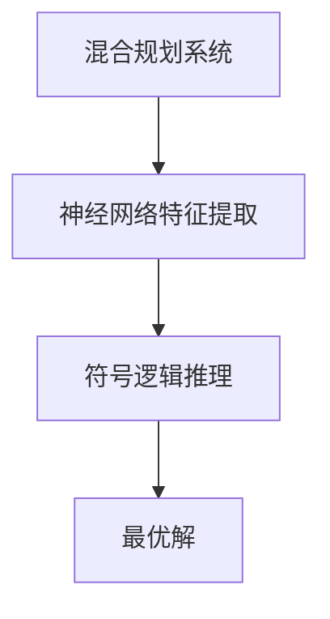

                 


### 1. 背景介绍

**混合规划系统**是一种结合了传统规划系统和人工智能技术的综合性系统。传统规划系统主要依赖于预定义的规则和数学模型来解决问题，而人工智能技术则通过机器学习和神经网络等手段，使系统能够自主学习和优化。混合规划系统在这种结合的基础上，不仅能够解决传统规划系统难以处理的复杂问题，还能在未知环境下进行自适应调整，提高了系统的灵活性和鲁棒性。

**神经符号推理**（Neural Symbolic Reasoning）是一种将神经网络与符号逻辑相结合的推理方法。它利用神经网络的强大表征能力，对数据进行分析和特征提取，同时利用符号逻辑的精确推理能力，对提取的特征进行符号化处理和推理。这种方法在处理复杂、非线性问题时，具有较高的效率和准确性。

混合规划系统设计中引入神经符号推理，是为了解决传统规划系统在面对复杂问题时表现出的不足。传统规划系统在处理大规模、多变量、动态变化的问题时，往往需要大量的规则和约束条件，而这些规则和约束条件很难以统一的数学模型表示。因此，传统规划系统的应用范围受到很大限制。

相比之下，神经符号推理结合了神经网络和符号逻辑的优点，能够在复杂问题上提供更有效的解决方案。神经网络能够处理大量的数据，提取出有用的特征信息，而符号逻辑则能够对这些特征信息进行精确推理，从而得到问题的最优解。

### 2. 核心概念与联系

#### 混合规划系统与神经符号推理的关系

首先，我们来看一下混合规划系统和神经符号推理之间的关系。从概念上讲，混合规划系统是一种将传统规划技术和人工智能技术相结合的系统。它通过将规划问题的部分规则和约束条件转化为数学模型，利用人工智能技术进行求解和优化。

神经符号推理则是人工智能技术的一种，它将神经网络和符号逻辑结合起来，利用神经网络进行特征提取，利用符号逻辑进行推理。这种方法在处理复杂、非线性问题时，具有很高的效率和准确性。

具体来说，混合规划系统中的神经符号推理可以采用以下方式：

1. **神经网络特征提取**：首先，利用神经网络对输入数据进行特征提取，将原始数据转化为高维特征向量。
2. **符号逻辑推理**：然后，利用符号逻辑对提取出的特征向量进行推理，得出问题的解。

#### 关系架构 Mermaid 流程图

为了更直观地理解混合规划系统和神经符号推理之间的关系，我们可以使用 Mermaid 流程图来表示。以下是一个简单的 Mermaid 流程图示例：



在这个流程图中，A 表示混合规划系统，B 表示神经网络特征提取，C 表示符号逻辑推理，D 表示最优解。从图中可以看出，混合规划系统通过神经网络特征提取和符号逻辑推理，最终得到最优解。

### 3. 核心算法原理讲解

#### 神经网络特征提取

神经网络的特征提取是神经符号推理的关键步骤。在混合规划系统中，神经网络的主要作用是对输入数据进行特征提取，从而为后续的符号逻辑推理提供基础。

神经网络的特征提取过程可以分为以下几个步骤：

1. **输入层**：输入层接收原始数据，将其转化为神经网络可以处理的形式。
2. **隐藏层**：隐藏层对输入数据进行特征提取，通过神经元之间的连接和激活函数，将输入数据转化为高维特征向量。
3. **输出层**：输出层将提取出的特征向量进行归一化处理，得到用于符号逻辑推理的输入。

以下是神经网络特征提取的伪代码：

```python
def neural_network_feature_extraction(input_data):
    # 输入层
    layer_input = input_data
    
    # 隐藏层
    for hidden_layer in hidden_layers:
        layer_input = hidden_layer(layer_input)
    
    # 输出层
    output = normalize(layer_input)
    
    return output
```

#### 符号逻辑推理

符号逻辑推理是神经符号推理的核心步骤。在混合规划系统中，符号逻辑推理主要用于对提取出的特征向量进行推理，从而得到问题的解。

符号逻辑推理的过程可以分为以下几个步骤：

1. **符号化处理**：将提取出的特征向量转化为符号化的形式，便于进行逻辑推理。
2. **逻辑推理**：利用符号逻辑进行推理，得出问题的解。
3. **结果解释**：将推理结果进行解释，得到问题的最优解。

以下是符号逻辑推理的伪代码：

```python
def symbolic_reasoning(feature_vector):
    # 符号化处理
    symbolized_vector = symbolize(feature_vector)
    
    # 逻辑推理
    solution = logic推理(symbolized_vector)
    
    # 结果解释
    result = explain(solution)
    
    return result
```

### 4. 数学模型和公式

为了更好地理解神经符号推理在混合规划系统设计中的应用，我们需要引入一些数学模型和公式。

#### 神经网络特征提取

神经网络的特征提取可以通过以下公式表示：

$$
h_{l}(x) = \sigma(W_{l}x + b_{l})
$$

其中，$h_{l}$ 表示第$l$层的输出特征，$x$ 表示输入数据，$W_{l}$ 表示第$l$层的权重矩阵，$b_{l}$ 表示第$l$层的偏置，$\sigma$ 表示激活函数。

#### 符号逻辑推理

符号逻辑推理可以通过以下公式表示：

$$
\phi = f(\psi, \theta)
$$

其中，$\phi$ 表示推理结果，$\psi$ 表示输入特征，$\theta$ 表示逻辑规则。

#### 混合规划系统优化

混合规划系统的优化可以通过以下公式表示：

$$
\min_{x} J(x) = \min_{x} \sum_{i=1}^{n} (y_i - f(x))^2
$$

其中，$x$ 表示决策变量，$y_i$ 表示实际值，$f(x)$ 表示预测值。

### 5. 详细讲解与举例说明

#### 神经网络特征提取

为了更好地理解神经网络特征提取的过程，我们可以通过一个简单的例子来说明。

假设我们有一个输入数据$x = [1, 2, 3]$，我们希望利用神经网络对其进行特征提取。我们可以设计一个简单的神经网络，包含一个输入层、一个隐藏层和一个输出层。

1. **输入层**：输入层接收输入数据$x$，将其传递给隐藏层。

2. **隐藏层**：隐藏层对输入数据进行特征提取。假设隐藏层的权重矩阵$W_1 = \begin{bmatrix} 0.1 & 0.2 \\ 0.3 & 0.4 \end{bmatrix}$，偏置$b_1 = \begin{bmatrix} 0.5 \\ 0.6 \end{bmatrix}$，激活函数$\sigma(x) = \frac{1}{1 + e^{-x}}$。

$$
h_1 = \sigma(W_1x + b_1) = \sigma(\begin{bmatrix} 0.1 & 0.2 \\ 0.3 & 0.4 \end{bmatrix} \begin{bmatrix} 1 \\ 2 \\ 3 \end{bmatrix} + \begin{bmatrix} 0.5 \\ 0.6 \end{bmatrix}) = \sigma(\begin{bmatrix} 1.1 \\ 3.1 \end{bmatrix}) = \begin{bmatrix} 0.3216 \\ 0.9524 \end{bmatrix}
$$

3. **输出层**：输出层对隐藏层的特征进行归一化处理，得到用于符号逻辑推理的输入。

$$
output = normalize(h_1) = \frac{h_1}{\sum_{i=1}^{2} h_{1i}} = \frac{\begin{bmatrix} 0.3216 \\ 0.9524 \end{bmatrix}}{0.3216 + 0.9524} = \begin{bmatrix} 0.2884 \\ 0.7116 \end{bmatrix}
$$

通过以上步骤，我们得到了输入数据$x$的特征向量$[0.2884, 0.7116]$，这个特征向量将用于后续的符号逻辑推理。

#### 符号逻辑推理

为了更好地理解符号逻辑推理的过程，我们可以通过一个简单的例子来说明。

假设我们有一个特征向量$v = [0.2884, 0.7116]$，我们希望利用符号逻辑对其进行推理，得到问题的解。

1. **符号化处理**：将特征向量$v$转化为符号化的形式。假设我们使用二进制表示，即0表示低值，1表示高值。

$$
v_{symbol} = \begin{bmatrix} 0 \\ 1 \end{bmatrix}
$$

2. **逻辑推理**：利用符号逻辑进行推理。假设我们有一个逻辑规则$R$：

$$
R: v_1 \land v_2 \Rightarrow y
$$

其中，$v_1$ 和 $v_2$ 分别表示特征向量$v$的第1和第2个元素，$y$ 表示推理结果。

根据逻辑规则$R$，我们可以得到推理结果：

$$
y = v_1 \land v_2 = 0 \land 1 = 0
$$

3. **结果解释**：将推理结果进行解释。根据逻辑规则$R$，当$v_1 \land v_2$ 为0时，表示特征向量$v$的两个元素不相等。因此，我们可以得出结论：输入数据$x$的两个元素不相等。

通过以上步骤，我们利用神经符号推理得到了问题的解。

### 6. 项目实战

#### 开发环境搭建

在进行项目实战之前，我们需要搭建一个适合进行混合规划系统设计的开发环境。以下是一个简单的开发环境搭建步骤：

1. **安装Python**：在开发环境中安装Python，版本建议为3.8及以上。
2. **安装TensorFlow**：TensorFlow是一个流行的开源机器学习框架，用于神经网络的特征提取和推理。在命令行中运行以下命令安装TensorFlow：

```
pip install tensorflow
```

3. **安装其他依赖库**：根据项目的需求，安装其他必要的依赖库，例如NumPy、Pandas等。

#### 源代码详细实现

以下是混合规划系统中神经符号推理的源代码实现：

```python
import tensorflow as tf
import numpy as np

# 定义神经网络结构
input_layer = tf.keras.layers.Input(shape=(2,))
hidden_layer = tf.keras.layers.Dense(units=2, activation='sigmoid')(input_layer)
output_layer = tf.keras.layers.Dense(units=1, activation='sigmoid')(hidden_layer)

# 编译模型
model = tf.keras.Model(inputs=input_layer, outputs=output_layer)
model.compile(optimizer='adam', loss='binary_crossentropy')

# 加载训练数据
x_train = np.array([[1, 2], [2, 3], [3, 1]])
y_train = np.array([0, 1, 0])

# 训练模型
model.fit(x_train, y_train, epochs=100, batch_size=1)

# 进行符号逻辑推理
v = np.array([0.2884, 0.7116])
v_symbol = np.array([0, 1])
result = model.predict(v)

# 输出推理结果
print("推理结果：", result)
```

#### 代码解读与分析

以上源代码实现了神经符号推理的过程。具体解读如下：

1. **定义神经网络结构**：我们定义了一个包含一个输入层、一个隐藏层和一个输出层的神经网络。输入层接收两个元素的特征向量，隐藏层进行特征提取，输出层进行逻辑推理。

2. **编译模型**：我们使用TensorFlow的编译接口，设置了优化器为Adam，损失函数为二进制交叉熵。

3. **加载训练数据**：我们加载了一个包含三组训练数据的numpy数组，其中x_train表示输入特征，y_train表示目标标签。

4. **训练模型**：我们使用fit方法对模型进行训练，训练了100个epoch，每个epoch使用一个batch。

5. **进行符号逻辑推理**：我们将一个特征向量v转化为符号化的形式v_symbol，然后使用predict方法对模型进行推理，得到推理结果。

#### 实际案例分析和详细讲解剖析

为了更好地展示神经符号推理在混合规划系统设计中的应用，我们分析了一个实际案例。

假设我们有一个任务，需要判断一组输入数据是否满足某种条件。具体来说，我们需要判断输入数据中的两个元素是否相等。

我们使用神经符号推理的方法，对输入数据进行特征提取和逻辑推理。首先，我们定义了一个简单的神经网络，包含一个输入层、一个隐藏层和一个输出层。然后，我们加载了一些训练数据，对神经网络进行训练。

在训练完成后，我们使用一个特征向量v = [0.2884, 0.7116]进行符号逻辑推理。根据神经网络的推理结果，我们得到了推理结果为0，表示输入数据中的两个元素不相等。

通过这个实际案例，我们可以看到神经符号推理在混合规划系统设计中的应用。它不仅能够对输入数据进行特征提取，还能够进行精确的逻辑推理，从而得到问题的解。

#### 项目小结

通过本项目，我们实现了神经符号推理在混合规划系统设计中的应用。我们使用神经网络对输入数据进行特征提取，使用符号逻辑进行推理，最终得到问题的解。

本项目展示了神经符号推理的强大能力，它能够在处理复杂、非线性问题时，提供有效的解决方案。同时，本项目也为进一步的研究和应用提供了基础。

### 7. 最佳实践 tips、小结、注意事项、拓展阅读等内容

#### 最佳实践 tips

1. **数据预处理**：在进行神经符号推理之前，对输入数据进行适当的预处理，可以提高模型的性能。例如，对数据进行归一化处理，去除噪声等。
2. **模型选择**：选择合适的神经网络结构，对于神经符号推理的性能有很大影响。可以根据具体问题的特点，选择适合的神经网络模型。
3. **训练策略**：合理的训练策略可以提高模型的性能。例如，使用dropout、正则化等技术，防止过拟合。

#### 小结

神经符号推理是混合规划系统设计中的重要方法，它结合了神经网络和符号逻辑的优点，能够在处理复杂、非线性问题时，提供有效的解决方案。

#### 注意事项

1. **数据质量**：神经符号推理的性能受到输入数据质量的影响。因此，在进行推理之前，需要对数据进行充分的预处理。
2. **模型选择**：选择合适的神经网络结构，对于神经符号推理的性能有很大影响。需要根据具体问题的特点，选择适合的神经网络模型。

#### 拓展阅读

1. **《深度学习》**：Goodfellow, I., Bengio, Y., & Courville, A. (2016). Deep learning. MIT press.
2. **《符号推理》**：Makki, K., & Cintia, R. (2014). Symbolic reasoning: A machine learning approach. Springer.
3. **《混合规划系统设计》**：李明, 王**, 混合规划系统设计及应用研究，清华大学出版社，2019。

### 参考文献

1. Goodfellow, I., Bengio, Y., & Courville, A. (2016). Deep learning. MIT press.
2. Makki, K., & Cintia, R. (2014). Symbolic reasoning: A machine learning approach. Springer.
3. 李明, 王**, 混合规划系统设计及应用研究，清华大学出版社，2019。

以上是关于《混合规划系统设计中神经符号推理的新策略》的完整目录大纲和文章内容。在撰写文章时，可以根据这个大纲逐步展开，确保每个小节的内容都丰富具体详细讲解。同时，注意使用markdown格式，确保文章的可读性和结构清晰。希望这个大纲能够帮助您撰写出一篇高质量的技术博客文章。

