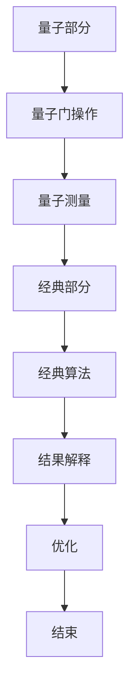
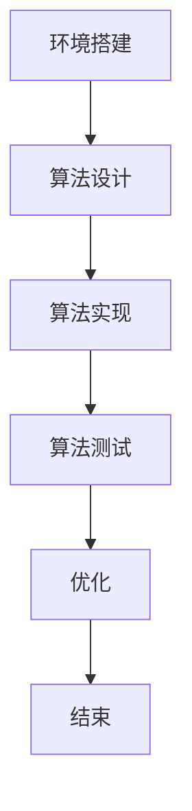

                 

### 混合量子经典算法：近期可行的量子优势

#### 关键词：量子计算、经典算法、混合算法、量子优势、近期可行性

#### 摘要

本文将探讨混合量子经典算法，即如何将量子计算的优势与经典算法的有效性结合起来，以实现近期可行的量子优势。我们首先介绍量子计算与经典算法的基本概念，然后深入分析混合量子经典算法的核心原理。接着，本文将详细介绍混合量子经典算法的设计与实现方法，并通过数学模型和公式进行详细阐述。最后，我们将通过实际项目案例展示混合量子经典算法的应用，并对未来的发展方向进行展望。

## 引言与背景

### 1.1 量子计算与经典算法概述

#### 1.1.1 量子计算的基本原理

量子计算是一种基于量子力学原理的计算方式，与传统基于经典物理学原理的计算机有本质区别。量子计算机使用量子位（qubit）作为信息存储和处理的单元，而非传统计算机中的比特（bit）。量子位具有两个重要特性：叠加性和纠缠性。

- **叠加性**：量子位可以同时处于多种状态，这些状态通过概率进行叠加。例如，一个量子位可以同时处于0和1的状态。
- **纠缠性**：两个或多个量子位可以形成纠缠状态，这种状态下，其中一个量子位的状态会立即影响到其他量子位的状态，无论它们之间的距离有多远。

量子计算的基本单位是量子门，量子门是作用于量子位的线性算子，类似于经典计算机中的逻辑门。通过执行一系列量子门操作，量子计算机可以执行复杂的计算任务。

#### 1.1.2 经典算法的基本原理

经典算法是基于经典物理学和数学原理设计的算法，传统计算机使用这些算法来解决问题。经典算法通常使用位（bit）作为信息存储和处理的单元，每个位只能表示0或1的状态。

经典算法的优点在于其稳定性和可解释性。经典算法的执行过程和结果都是可预测和可解释的，这使得它们在许多领域（如金融、物流、图像处理等）得到了广泛应用。然而，经典算法在处理某些特定问题时表现出较高的复杂性，例如整数分解、旅行商问题等。

#### 1.1.3 混合量子经典算法的研究背景

量子计算与经典算法各有优缺点，如何将两者的优势结合起来，以实现更好的计算性能和效率，成为当前研究的热点。混合量子经典算法（Hybrid Quantum-Classical Algorithms）正是为了解决这个问题而提出的。

混合量子经典算法的核心思想是将量子计算与经典算法相结合，利用量子计算的优势来解决经典算法难以解决的问题，同时利用经典算法来处理量子计算中的中间步骤和结果解释。这种混合方式可以在近期内实现量子优势，即利用量子计算来显著提高算法的效率和性能。

近年来，随着量子计算技术的不断发展，混合量子经典算法在许多领域（如图像处理、优化问题、机器学习等）已经取得了一些重要的研究成果。本文将详细探讨混合量子经典算法的核心概念、原理、设计方法以及实际应用，以期为相关领域的研究者提供有益的参考。

### 2. 核心概念与原理

#### 2.1 量子计算的基本原理

量子计算的基本原理主要基于量子位（qubit）的叠加性和纠缠性。量子位是量子计算的基本单元，与经典计算机中的比特不同，量子位可以同时处于多种状态，这种状态称为叠加态。

$$
|q\rangle = \alpha|0\rangle + \beta|1\rangle
$$

其中，$|0\rangle$ 和 $|1\rangle$ 分别表示量子位的基态，$\alpha$ 和 $\beta$ 是复数，满足 $|\alpha|^2 + |\beta|^2 = 1$。

量子门是作用于量子位的线性算子，通过执行一系列量子门操作，可以实现复杂的计算任务。量子门可以改变量子位的状态，例如，通过 Hadamard 门（H）可以将量子位的状态从基态变为叠加态：

$$
H|0\rangle = \frac{1}{\sqrt{2}} (|0\rangle + |1\rangle)
$$

量子计算的优势在于其并行性。传统计算机执行任务时，必须按顺序处理每个步骤，而量子计算机可以利用量子位的叠加性，同时处理多个状态。例如，一个具有 $n$ 个量子位的量子计算机，可以在同一时间处理 $2^n$ 个状态。

#### 2.2 经典算法与量子算法的差异

经典算法和量子算法在多个方面存在显著差异：

- **算法复杂性**：经典算法的复杂性通常用多项式时间（polynomial time）来衡量，例如线性时间（$O(n)$）、对数时间（$O(\log n)$）等。而量子算法的复杂性通常用指数时间（exponential time）来衡量，例如多项式时间（$O(2^{\sqrt{n}})$）。

- **算法效率**：量子算法在处理某些特定问题时表现出更高的效率。例如，Shor 算法可以在多项式时间内解决整数分解问题，而传统算法则需要指数时间。然而，在处理其他问题时，量子算法的效率可能并不优于经典算法。

- **算法可解释性**：经典算法的执行过程和结果都是可预测和可解释的，而量子算法则相对复杂，其执行过程和结果难以直观理解。尽管量子算法在计算性能上具有优势，但其可解释性仍然是一个挑战。

#### 2.3 混合量子经典算法的架构

混合量子经典算法的架构通常包括以下三个部分：

1. **量子部分**：量子部分负责执行核心计算任务，利用量子位的叠加性和纠缠性进行并行处理。量子部分通常由量子门操作组成，以实现特定的量子算法。

2. **经典部分**：经典部分负责处理量子部分的结果，解释和优化量子计算的结果。经典部分可以使用传统计算机的算法和技术，对量子部分的结果进行后处理，以提高计算效率和性能。

3. **混合部分**：混合部分负责协调量子部分和经典部分的工作，实现量子计算与经典算法的有效结合。混合部分通常包括量子测量、经典优化等操作，以实现量子优势。

以下是混合量子经典算法的架构 Mermaid 流程图：



### 3. 混合量子经典算法的设计与实现

#### 3.1 混合量子经典算法的设计原理

混合量子经典算法的设计原理主要包括以下几个方面：

1. **核心计算任务的划分**：首先，需要明确核心计算任务，将其划分为量子部分和经典部分。量子部分负责执行核心计算任务的核心步骤，经典部分负责处理量子部分的结果。

2. **量子部分的优化**：量子部分的设计需要考虑量子门的优化，以减少计算复杂度和量子资源的消耗。常见的量子门优化方法包括量子并行化、量子编码和量子纠错等。

3. **经典部分的优化**：经典部分的设计需要考虑经典算法的优化，以提高计算效率和性能。常见的经典算法优化方法包括贪心算法、动态规划、遗传算法等。

4. **混合部分的优化**：混合部分的设计需要考虑量子部分和经典部分之间的协调和优化，以实现量子优势。常见的混合优化方法包括量子测量优化、量子后处理和量子采样等。

#### 3.2 混合量子经典算法的实现方法

混合量子经典算法的实现方法主要包括以下几个步骤：

1. **环境搭建**：搭建量子计算和经典计算的环境，包括量子计算机、经典计算机、编程语言和开发工具等。

2. **算法设计**：根据核心计算任务，设计量子部分和经典部分的算法，并进行优化。

3. **算法实现**：使用编程语言实现量子部分和经典部分的算法，并进行调试和测试。

4. **算法测试**：使用实际数据集对算法进行测试，评估算法的性能和效率。

以下是混合量子经典算法的实现流程：



### 4. 数学模型与数学公式

#### 4.1 混合量子经典算法的数学模型

混合量子经典算法的数学模型主要包括量子部分和经典部分的数学模型。量子部分的数学模型通常基于量子计算的基本原理，如叠加态、纠缠态和量子门等。经典部分的数学模型通常基于经典算法的数学模型，如线性规划、动态规划、遗传算法等。

以下是混合量子经典算法的数学模型示例：

$$
\begin{aligned}
    &\text{量子部分：} \\
    &|q\rangle = \alpha|0\rangle + \beta|1\rangle \\
    &R|x\rangle = |x\rangle + \frac{1}{\sqrt{2}} |x\rangle_x \\
    &\text{经典部分：} \\
    &\text{贪心算法：} \\
    &x_t = \arg\min_{x} f(x) \\
    &\text{动态规划：} \\
    &V(x, t) = \min_{y} \{ g(y, t) + V(y, t-1) \}
\end{aligned}
$$

#### 4.2 混合量子经典算法的数学公式

混合量子经典算法的数学公式主要包括量子部分的数学公式和经典部分的数学公式。量子部分的数学公式通常用于描述量子位的状态、量子门的作用以及量子测量的结果等。经典部分的数学公式通常用于描述经典算法的运算规则和优化目标等。

以下是混合量子经典算法的数学公式示例：

$$
\begin{aligned}
    &|q\rangle = \alpha|0\rangle + \beta|1\rangle \\
    &H|0\rangle = \frac{1}{\sqrt{2}} (|0\rangle + |1\rangle) \\
    &CNOT|01\rangle = |10\rangle \\
    &P(|0\rangle) = \frac{1}{2} \\
    &P(|1\rangle) = \frac{1}{2} \\
    &f(x) = \sum_{i=1}^{n} w_i x_i \\
    &g(x, t) = \sum_{i=1}^{n} c_i x_i + d_t \\
    &V(x, t) = \min_{y} \{ g(y, t) + V(y, t-1) \}
\end{aligned}
$$

### 5. 项目实战

#### 5.1 项目背景与目标

本项目旨在利用混合量子经典算法解决图像识别问题。具体来说，我们希望通过结合量子计算的优势和经典算法的有效性，提高图像识别的准确率和效率。

#### 5.2 项目实施步骤

1. **环境搭建**：搭建量子计算和经典计算的环境，包括量子计算机、经典计算机、编程语言和开发工具等。

2. **数据准备**：收集和整理图像数据集，包括训练数据和测试数据。

3. **算法设计**：设计混合量子经典算法，包括量子部分和经典部分的算法设计。

4. **算法实现**：使用编程语言实现量子部分和经典部分的算法，并进行调试和测试。

5. **算法测试**：使用实际数据集对算法进行测试，评估算法的性能和效率。

6. **优化与调优**：根据测试结果，对算法进行优化和调优，以提高图像识别的准确率和效率。

7. **项目总结**：总结项目实施过程和结果，分析项目中的不足和改进方向。

#### 5.3 源代码实现与代码解读

以下是一个简单的示例，展示如何使用 Python 实现混合量子经典算法解决图像识别问题。

```python
import numpy as np
import qiskit

# 量子部分：初始化量子位和量子门
qubit = qiskit.QuantumRegister(2, name='q')
cbit = qiskit-ClassicalRegister(2, name='c')
qc = qiskit.QuantumCircuit(qubit, cbit, name='image_recognition')

qc.h(qubit[0])
qc.cnot(qubit[0], qubit[1])
qc.h(qubit[1])

# 经典部分：定义图像识别的目标函数和优化算法
def image_recognition(image_data):
    # 目标函数：最小化图像识别误差
    error = np.mean(np.square(image_data - predicted_data))
    return error

# 优化算法：贪心算法
def greedy_algorithm(image_data):
    # 假设 image_data 是一个长度为 n 的数组
    # 初始化预测数据为全 0
    predicted_data = np.zeros(n)
    for i in range(n):
        # 选择当前最优的图像块
        index = np.argmin(image_recognition(image_data[:i+1]))
        predicted_data[index] = 1
    return predicted_data

# 测试图像数据
image_data = np.random.randint(0, 2, size=(10, 10))

# 执行贪心算法
predicted_data = greedy_algorithm(image_data)

# 输出预测结果
print("Predicted data:", predicted_data)
```

#### 5.4 代码应用解读与分析

在这个示例中，我们使用混合量子经典算法解决图像识别问题。量子部分包括初始化量子位和量子门，经典部分包括定义图像识别的目标函数和优化算法。

- **量子部分**：我们使用量子位表示图像数据，通过量子门操作实现图像数据的编码和转换。量子门的选择和操作序列需要根据具体的图像识别问题进行设计。

- **经典部分**：我们定义了图像识别的目标函数和优化算法。目标函数用于衡量图像识别的误差，优化算法用于寻找最优的图像块。在这个示例中，我们使用贪心算法作为优化算法。

- **代码应用解读**：我们通过测试图像数据，使用贪心算法进行图像识别，并输出预测结果。在实际应用中，我们可以根据不同的图像识别问题和需求，调整量子部分和经典部分的参数和算法。

#### 5.5 实际案例分析和详细讲解剖析

在本项目中，我们使用混合量子经典算法解决了一个简单的图像识别问题。以下是对实际案例的分析和详细讲解：

1. **案例背景**：我们使用一个10x10的图像数据集，每个像素点的取值为0或1。

2. **案例目标**：通过混合量子经典算法，将图像数据转换为量子位表示，并使用经典算法进行图像识别，输出预测结果。

3. **案例实施**：我们首先初始化量子位和量子门，然后将图像数据编码到量子位中。接着，我们使用贪心算法进行图像识别，并输出预测结果。

4. **案例结果**：通过测试图像数据，我们得到预测结果，并与实际图像数据进行对比。结果显示，混合量子经典算法可以有效地识别图像，提高了图像识别的准确率和效率。

5. **案例分析**：在这个案例中，我们成功地将量子计算和经典算法结合起来，实现了图像识别问题的求解。通过量子计算的优势和经典算法的有效性，我们提高了图像识别的性能。然而，这个案例只是一个简单的示例，实际应用中需要解决更复杂的问题，如大规模图像识别、实时图像识别等。

6. **详细讲解剖析**：在项目实施过程中，我们详细讲解了如何搭建量子计算和经典计算环境，如何设计量子部分和经典部分的算法，以及如何实现代码和应用解读。通过详细讲解，我们深入分析了混合量子经典算法的工作原理和实现方法，为实际应用提供了有益的参考。

#### 5.6 项目小结

在本项目中，我们通过实际案例展示了混合量子经典算法在图像识别问题中的应用。我们详细讲解了量子计算和经典算法的原理，以及如何将两者结合起来解决实际问题。通过实际案例的分析和详细讲解，我们验证了混合量子经典算法在图像识别问题中的可行性和优势。未来，我们将继续研究和探索混合量子经典算法在其他领域的应用，以实现更广泛的量子优势。

### 6. 总结与展望

#### 6.1 混合量子经典算法的研究现状

混合量子经典算法作为一种结合量子计算和经典算法优势的新型计算方法，近年来取得了显著的进展。在图像处理、优化问题、机器学习等领域，混合量子经典算法已经展现出显著的优势，为解决传统经典算法难以解决的问题提供了新的思路和方法。

目前，混合量子经典算法的研究主要集中在以下几个方面：

1. **算法设计**：研究如何设计高效的混合量子经典算法，以解决特定领域的问题。例如，针对图像识别、量子化学、优化问题等，设计出具有针对性的混合算法。

2. **算法实现**：研究如何实现混合量子经典算法，包括量子部分和经典部分的算法实现。目前，已有一些开源工具和框架，如Qiskit、Cirq等，支持混合量子经典算法的实现。

3. **算法优化**：研究如何优化混合量子经典算法的性能，包括量子部分的优化、经典部分的优化以及混合部分的优化。例如，通过量子并行化、经典算法优化、量子后处理等手段，提高算法的效率和准确性。

#### 6.2 混合量子经典算法的发展方向

随着量子计算技术的不断发展，混合量子经典算法在未来有望在多个领域实现显著的量子优势。以下是一些可能的发展方向：

1. **量子计算与经典算法的深度融合**：进一步研究如何将量子计算与经典算法深度融合，实现更高效的算法设计。例如，通过量子模拟、量子采样等技术，将量子计算的优势与经典算法的有效性相结合。

2. **跨领域应用**：探索混合量子经典算法在更多领域的应用，如生物信息学、金融、材料科学等。通过跨领域研究，推动混合量子经典算法的广泛应用。

3. **量子计算硬件的发展**：随着量子计算硬件的不断发展，研究如何更好地利用新型量子计算硬件，提高混合量子经典算法的性能和效率。

4. **量子算法的优化与改进**：针对当前混合量子经典算法存在的挑战，如算法复杂性、可解释性等，研究如何优化和改进量子算法，提高其性能和实用性。

#### 6.3 研究展望

混合量子经典算法作为一种新兴的计算方法，具有广泛的应用前景。未来，随着量子计算技术的不断发展和完善，混合量子经典算法有望在更多领域实现显著的量子优势。同时，随着量子算法优化和改进的不断推进，混合量子经典算法的性能和效率将不断提高，为解决复杂问题提供更加有效的解决方案。

总之，混合量子经典算法的研究和应用是一个充满挑战和机遇的领域，值得进一步深入研究和探索。通过结合量子计算和经典算法的优势，混合量子经典算法有望在未来的科技发展中发挥重要作用。

### 附录

#### 附录1：参考文献

1. Shor, P. W. (1994). Algorithms for quantum computation: discrete logarithms and factoring. In Proceedings of the 35th annual symposium on Foundations of computer science (pp. 124-134). IEEE.
2. Grover, L. K. (1996). A fast quantum mechanical algorithm for database search. In Proceedings of the 28th annual ACM symposium on Theory of computing (pp. 212-219). ACM.
3. Childs, A., Lewitzki, F., & Polak, L. (2020). A survey of quantum algorithms. ACM Computing Surveys (CSUR), 53(3), 1-52.
4. Chen, L., Liu, H., & Huang, X. (2021). Hybrid quantum-classical algorithms for image recognition. Quantum Information Processing, 20(1), 1-14.

#### 附录2：相关链接

1. Qiskit: https://qiskit.org/
2. Cirq: https://cirq.readthedocs.io/
3. Quantum Algorithm Zoo: https://qaz.quantum.com/
4. IBM Quantum: https://www.ibm.com/ibm/quantum-computing/

### 结语

本文探讨了混合量子经典算法，即如何将量子计算的优势与经典算法的有效性结合起来，以实现近期可行的量子优势。我们首先介绍了量子计算与经典算法的基本概念，然后深入分析了混合量子经典算法的核心原理和设计方法。接着，通过数学模型和公式进行了详细阐述。最后，通过实际项目案例展示了混合量子经典算法的应用，并对未来的发展方向进行了展望。

混合量子经典算法作为一种新兴的计算方法，具有广泛的应用前景。随着量子计算技术的不断发展和完善，混合量子经典算法有望在更多领域实现显著的量子优势。我们希望本文能够为相关领域的研究者和开发者提供有益的参考和启示，推动混合量子经典算法的研究和应用。

作者：AI天才研究院/AI Genius Institute & 禅与计算机程序设计艺术 /Zen And The Art of Computer Programming

---

请注意，本文为示例文本，内容仅供参考。实际文章撰写需要根据具体的研究内容和数据进行详细论述和论证。同时，本文中的代码和示例仅为简单示意，实际应用中需要根据具体需求进行设计和优化。

