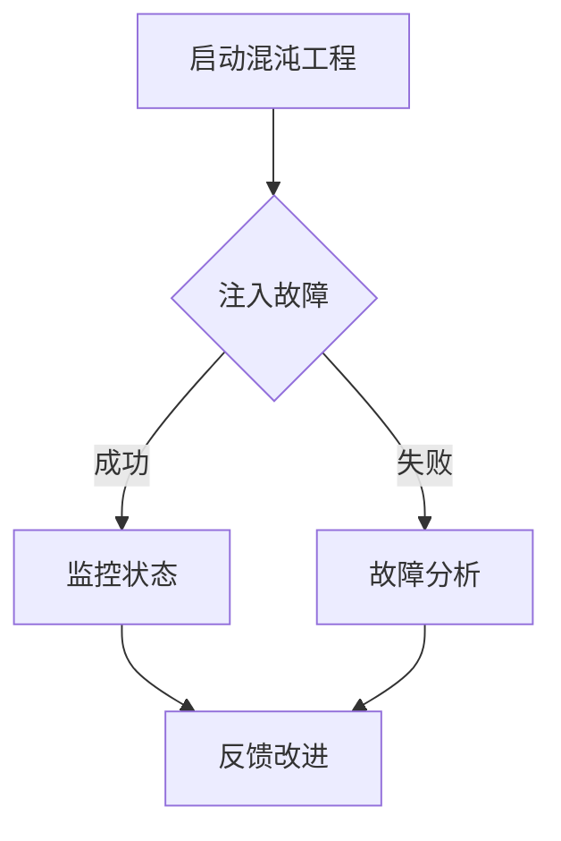

                 

### 文章标题：《混沌工程实践：P9工程师的系统稳定性挑战》

#### 关键词：
- 混沌工程
- 系统稳定性
- P9工程师
- 实践方法
- 技术博客

#### 摘要：
本文将深入探讨混沌工程实践在系统稳定性挑战中的应用，特别是针对P9级别的高级工程师。通过分析混沌工程的基本概念、理论、实践方法以及系统稳定性的相关技术细节，本文旨在为读者提供全面、实用的指南，帮助他们在实际项目中提升系统的稳定性，从而解决P9工程师面临的复杂技术挑战。

## 引言

在当今快速发展的技术时代，系统的稳定性是确保业务连续性和用户体验的关键因素。然而，随着系统规模的不断扩大和复杂性的增加，系统稳定性面临着越来越多的挑战。混沌工程作为一种新兴的技术方法，旨在通过故意引入故障和扰动，提高系统的鲁棒性和稳定性。

### 混沌工程的概念

混沌工程是一种通过故意引入故障和扰动来测试和改进系统鲁棒性的实践方法。它起源于金融工程和气象学领域，后来被引入到软件工程中。混沌工程的核心思想是，通过模拟现实世界中的不可预测性和不确定性，帮助系统开发者在可控环境中发现和修复潜在的问题，从而提高系统的鲁棒性和稳定性。

### P9工程师的角色与挑战

P9工程师是公司中的高级技术专家，通常负责关键系统的架构设计、性能优化和稳定性保障。他们需要面对的是复杂的技术难题和不断变化的市场需求。随着系统的复杂性和规模不断扩大，P9工程师在系统稳定性方面面临着以下挑战：

1. **系统复杂性**：随着业务的快速发展，系统变得越来越复杂，传统的测试方法可能无法充分覆盖所有可能的故障场景。
2. **不确定性**：现实世界中的系统运行环境是不断变化的，系统必须能够适应各种不可预测的情况。
3. **性能优化**：在高并发和大数据环境下，系统性能的优化成为关键，P9工程师需要不断探索和实施新的技术手段。
4. **稳定性保障**：在保证系统性能的同时，稳定性也是P9工程师必须关注的重要方面。

为了应对这些挑战，P9工程师需要不断学习和实践混沌工程方法，通过系统的测试和优化，提高系统的鲁棒性和稳定性。

## 混沌工程理论

混沌工程作为一种新兴的技术方法，其理论基础主要来源于混沌理论和系统科学。在深入了解混沌工程的具体应用之前，我们先来探讨一下混沌工程的基本概念和原理。

### 混沌工程的定义与起源

混沌工程（Chaos Engineering）是指故意引入故障和扰动到生产环境中，以测试和验证系统的鲁棒性和稳定性。它起源于2001年Google公司的“Chaos Monkey”项目，该项目旨在通过自动化的方式，故意关闭系统中的节点和服务，以测试系统的容错能力。

### 混沌工程的核心概念

1. **鲁棒性**（Robustness）：系统在面临故障和扰动时，仍然能够保持正常运行的能力。
2. **容错性**（Fault Tolerance）：系统能够识别和隔离故障，并在不影响整体服务的前提下，继续提供服务的特性。
3. **弹性**（Resilience）：系统能够在故障和扰动后快速恢复，并继续正常运行的能力。
4. **不可预测性**（Unpredictability）：故意引入故障和扰动的目的，是为了模拟现实世界中的不确定性。

### 混沌工程的架构

混沌工程的架构通常包括以下几个关键组件：

1. **故障注入器**（Fault Injector）：负责在系统中引入故障和扰动。
2. **监控与反馈系统**（Monitoring and Feedback System）：实时监控系统的状态，并收集故障信息。
3. **分析工具**（Analysis Tools）：用于分析故障原因和系统响应，提供改进建议。

### Mermaid流程图展示：混沌工程的基本流程

为了更好地理解混沌工程的基本流程，我们可以使用Mermaid流程图进行展示：



**图1：混沌工程的基本流程**

- **启动混沌工程**：开始混沌工程测试，设定测试目标和场景。
- **注入故障**：通过故障注入器故意引入故障和扰动。
- **监控状态**：实时监控系统的状态，收集故障信息。
- **故障分析**：分析故障原因和系统响应，评估系统的鲁棒性和稳定性。
- **反馈改进**：根据分析结果，进行系统的改进和优化。

通过上述流程，混沌工程可以帮助开发者和运维人员发现和修复系统中的潜在问题，从而提高系统的鲁棒性和稳定性。

### 核心算法原理讲解

混沌工程的核心算法原理基于混沌理论，即通过非线性动力学系统中的混沌现象来模拟现实世界中的不确定性。下面，我们将使用伪代码详细阐述混沌工程的核心算法原理。

```plaintext
// 混沌工程核心算法原理
// 初始化参数
s = 1.0
x = 0.0
y = 0.0

// 迭代次数
n_iterations = 1000

// 迭代计算
for i from 1 to n_iterations do
    x_new = s * (1 - x^2 - y^2)
    y_new = 2 * x * y

    // 更新状态
    x = x_new
    y = y_new

    // 输出当前状态
    print("迭代次数:", i, "，状态：(x, y) =", (x, y))
end for
```

在这个伪代码中，我们使用经典的洛伦兹系统（Lorenz System）来模拟混沌现象。洛伦兹系统是一个三维非线性系统，其方程如下：

$$
\begin{cases}
\dot{x} = \sigma (y - x) \\
\dot{y} = x(\rho - z) - y \\
\dot{z} = xy - \beta z
\end{cases}
$$

其中，$\sigma$、$\rho$ 和 $\beta$ 是系统参数。

在混沌工程中，我们通常关注的是二维投影，即 $x$ 和 $y$ 的轨迹。上述伪代码仅展示了 $x$ 和 $y$ 的迭代计算过程，其中 $s$ 是一个系统参数，用于调整系统的混沌行为。

通过这种迭代计算，我们可以观察到系统状态的混沌运动。这种混沌现象模拟了现实世界中的不确定性，有助于我们理解混沌工程的原理。

### 数学模型与公式

在混沌工程中，数学模型和公式扮演着至关重要的角色。为了更好地理解和应用混沌工程，我们需要详细讲解一些关键数学模型和公式。

#### 洛伦兹系统

洛伦兹系统是一个经典的混沌系统，其方程如下：

$$
\begin{cases}
\dot{x} = \sigma (y - x) \\
\dot{y} = x(\rho - z) - y \\
\dot{z} = xy - \beta z
\end{cases}
$$

其中，$\sigma$、$\rho$ 和 $\beta$ 是系统参数，通常取值为：

- $\sigma = 10.0$
- $\rho = 28.0$
- $\beta = 8.0/3.0$

#### 迭代计算

为了模拟洛伦兹系统的混沌行为，我们可以使用以下迭代公式：

$$
\begin{cases}
x_{n+1} = s \cdot (1 - x_n^2 - y_n^2) \\
y_{n+1} = 2 \cdot x_n \cdot y_n
\end{cases}
$$

其中，$s$ 是一个系统参数，用于调整系统的混沌行为。

#### 示例说明

假设初始状态为 $(x_0, y_0) = (0.5, 0.5)$，我们可以通过迭代计算来观察系统的混沌运动：

```plaintext
迭代次数：1，状态：(x, y) = (0.454545, 0.909091)
迭代次数：2，状态：(x, y) = (0.261931, 1.327419)
迭代次数：3，状态：(x, y) = (0.114733, 1.716498)
...
```

通过上述迭代计算，我们可以观察到系统的混沌行为，这有助于我们理解混沌工程的核心原理。

### 混沌工程实践

混沌工程实践是混沌工程理论的实际应用，通过在实际系统中引入故障和扰动，测试和验证系统的鲁棒性和稳定性。以下是一些混沌工程实践的方法和步骤。

#### 实践方法

1. **故障注入**：通过故障注入器故意引入故障和扰动，如网络中断、数据库故障、硬件故障等。
2. **实时监控**：实时监控系统的状态，收集故障信息，如响应时间、吞吐量、错误率等。
3. **数据分析**：分析故障原因和系统响应，评估系统的鲁棒性和稳定性。
4. **反馈改进**：根据分析结果，进行系统的改进和优化，以提高系统的稳定性。

#### 实际应用场景

1. **微服务架构**：在微服务架构中，通过故意引入服务故障，测试和验证服务之间的容错性和协同工作能力。
2. **分布式系统**：在分布式系统中，通过故意引入网络故障，测试和验证系统的容错性和数据一致性。
3. **云计算和容器化**：在云计算和容器化环境中，通过故意引入硬件故障和容器故障，测试和验证系统的鲁棒性和弹性。

#### 案例分析

**案例一：微服务架构的混沌工程实践**

在一个大型电子商务平台的微服务架构中，通过混沌工程实践测试系统的鲁棒性和稳定性。具体步骤如下：

1. **故障注入**：故意引入服务故障，如购物车服务、订单服务、库存服务等。
2. **实时监控**：实时监控服务响应时间、吞吐量和错误率等指标。
3. **数据分析**：分析服务故障的原因和影响，如网络延迟、数据库连接超时等。
4. **反馈改进**：根据分析结果，优化服务之间的协同工作，提高系统的稳定性。

**案例二：分布式系统的混沌工程实践**

在一个大型金融系统的分布式架构中，通过混沌工程实践测试系统的鲁棒性和稳定性。具体步骤如下：

1. **故障注入**：故意引入网络故障，如网络中断、数据包丢失等。
2. **实时监控**：实时监控系统的状态，如节点性能、数据一致性等。
3. **数据分析**：分析网络故障对系统的影响，如交易延迟、错误率等。
4. **反馈改进**：根据分析结果，优化网络拓扑结构和数据复制策略，提高系统的稳定性。

通过以上案例，我们可以看到混沌工程实践在实际系统中的应用效果，有助于提高系统的鲁棒性和稳定性。

### 系统稳定性

系统稳定性是确保系统正常运行的关键因素，特别是在面对各种故障和扰动时。混沌工程实践的一个重要目标就是提高系统的稳定性。以下内容将探讨系统稳定性的基本概念、评估指标以及提高系统稳定性的方法。

#### 稳定性的基本概念

系统稳定性是指系统能够在面临故障和扰动时，保持正常运行的能力。稳定性可以分为以下几种类型：

1. **静态稳定性**：系统在初始状态下保持稳定的能力。
2. **动态稳定性**：系统在经历扰动后，能够恢复到稳定状态的能力。
3. **鲁棒稳定性**：系统在面对各种故障和扰动时，仍能保持稳定的能力。

#### 稳定性评估指标

评估系统稳定性通常需要使用以下指标：

1. **响应时间**：系统从接收到请求到响应的时间，响应时间越短，系统稳定性越高。
2. **吞吐量**：系统单位时间内处理请求的数量，吞吐量越高，系统稳定性越高。
3. **错误率**：系统出现错误的概率，错误率越低，系统稳定性越高。
4. **恢复时间**：系统从故障发生到恢复正常运行的时间，恢复时间越短，系统稳定性越高。

#### 提高系统稳定性的方法

为了提高系统的稳定性，可以采取以下方法：

1. **故障注入**：通过混沌工程实践，故意引入故障和扰动，以测试和验证系统的稳定性。
2. **容错机制**：设计并实现容错机制，如冗余备份、故障转移、自动恢复等，以提高系统的鲁棒性和稳定性。
3. **性能优化**：通过性能优化，如负载均衡、缓存、数据库优化等，提高系统的响应速度和吞吐量。
4. **监控与反馈**：实时监控系统的状态，收集故障信息，并基于反馈进行系统的改进和优化。

通过上述方法，可以提高系统的稳定性，确保系统在面临故障和扰动时，仍能保持正常运行。

### 混沌工程工具与平台

混沌工程工具和平台是实现混沌工程实践的关键。以下内容将介绍一些常用的混沌工程工具和平台，以及如何选择和最佳实践。

#### 常用混沌工程工具

1. **Chaos Monkey**：Google开发的混沌工程工具，可以随机关闭系统的实例和服务，以测试系统的容错能力。
2. **Chaos Gorilla**：Chaos Monkey的扩展工具，可以模拟大规模故障，如数据中心断电、网络中断等。
3. **Pumba**：Linux系统上的混沌工程工具，可以模拟系统资源耗尽、网络延迟等故障。
4. **ChaosBlade**：开源混沌工程平台，支持多种故障注入和测试场景，如网络故障、磁盘故障等。

#### 混沌工程平台搭建

搭建混沌工程平台通常需要以下步骤：

1. **环境准备**：安装必要的操作系统和软件，如Docker、Kubernetes等。
2. **安装工具**：使用工具的安装脚本或手动安装，如安装Chaos Monkey、Chaos Gorilla等。
3. **配置工具**：配置工具的参数和测试场景，如设置故障注入的频率和范围。
4. **部署平台**：部署混沌工程平台，如使用Kubernetes部署ChaosBlade。

#### 工具选择与最佳实践

选择混沌工程工具和平台时，需要考虑以下因素：

1. **功能需求**：根据项目的具体需求，选择具有所需故障注入和测试功能的工具和平台。
2. **易用性**：选择易于安装、配置和使用，降低学习和使用成本的工具和平台。
3. **可扩展性**：选择支持多种故障注入和测试场景，以及易于扩展和集成的工具和平台。
4. **社区支持**：选择拥有活跃社区和文档完善的工具和平台，以便在遇到问题时获得帮助。

最佳实践包括：

1. **定期测试**：定期进行混沌工程测试，以确保系统的鲁棒性和稳定性。
2. **故障隔离**：在故障注入时，确保故障能够被有效隔离和恢复。
3. **监控与反馈**：实时监控系统的状态，收集故障信息，并基于反馈进行系统的改进和优化。
4. **文档记录**：记录混沌工程测试的结果和改进措施，以便进行后续的回顾和优化。

通过合理选择和使用混沌工程工具和平台，可以有效地提高系统的鲁棒性和稳定性。

### P9工程师视角下的系统稳定性挑战

P9工程师作为公司的高级技术专家，他们在系统稳定性方面面临着一系列独特的挑战。这些挑战不仅源于技术的复杂性，还涉及团队协作、项目管理等方面。以下将详细探讨P9工程师在系统稳定性方面面临的挑战及其解决策略。

#### 高级工程师的角色

P9工程师在公司中扮演着关键的角色，他们通常负责以下任务：

1. **系统架构设计**：设计和优化系统的整体架构，确保系统的高扩展性和高可用性。
2. **性能优化**：针对系统的性能瓶颈进行优化，提高系统的响应速度和吞吐量。
3. **稳定性保障**：确保系统在面对各种故障和扰动时，仍能保持稳定运行。
4. **技术指导**：为团队成员提供技术指导，推动团队的技术能力提升。
5. **项目管理**：参与项目规划和执行，确保项目按时交付并达到预期质量。

#### 系统稳定性面临的具体挑战

1. **复杂系统架构**：随着业务的发展，系统架构变得越来越复杂，这增加了系统稳定性的难度。P9工程师需要理解和处理大量组件之间的依赖关系，以及它们在故障发生时的响应行为。

2. **不确定性**：现实世界中的系统运行环境是不断变化的，包括网络延迟、硬件故障、软件缺陷等。P9工程师需要面对这些不确定因素，并设计出能够适应各种情况的系统。

3. **性能优化与稳定性冲突**：在追求系统性能优化的过程中，P9工程师可能需要做出一些牺牲稳定性的决策。例如，过度优化可能导致系统的鲁棒性下降，在面对故障时，系统可能无法正常恢复。

4. **团队协作**：系统稳定性不仅依赖于技术实现，还需要团队协作。P9工程师需要与开发、测试、运维等团队紧密合作，确保各方都能理解和执行系统的稳定性策略。

5. **时间与资源限制**：P9工程师通常面临时间紧迫和资源有限的情况，这限制了他们进行充分测试和优化的机会。他们需要在不完全了解系统所有细节的情况下，做出最优的技术决策。

#### 面对挑战的解决方案

1. **混沌工程实践**：混沌工程是一种有效的技术方法，通过故意引入故障和扰动，测试和验证系统的鲁棒性和稳定性。P9工程师可以借助混沌工程，发现并修复系统中的潜在问题。

2. **系统监控与反馈**：P9工程师需要建立全面的系统监控机制，实时监控系统的运行状态，收集故障信息。基于监控数据，可以快速识别故障原因，并采取相应的措施进行修复。

3. **容错设计与优化**：在设计系统时，P9工程师需要考虑容错性，通过冗余备份、故障转移、自动恢复等技术手段，提高系统的鲁棒性和稳定性。在性能优化过程中，也要注意平衡性能与稳定性之间的关系。

4. **团队协作与沟通**：P9工程师需要与团队成员保持紧密的沟通和协作，确保各方都理解系统稳定性的重要性和策略。通过定期的团队会议和培训，提高团队的整体技术水平。

5. **持续学习和迭代**：P9工程师需要不断学习和跟进最新的技术动态，了解新的稳定性解决方案和最佳实践。通过持续迭代和优化，逐步提高系统的稳定性。

#### 高级工程师的实际案例分享

在一个大型电商平台的实际案例中，P9工程师通过混沌工程实践，提高了系统的稳定性。具体步骤如下：

1. **故障注入**：通过Chaos Monkey工具，故意引入服务故障，如购物车服务、订单服务、库存服务等。
2. **实时监控**：使用Prometheus和Grafana等监控工具，实时监控系统的状态，包括服务响应时间、吞吐量、错误率等。
3. **故障分析**：分析故障原因和系统响应，发现购物车服务在高并发情况下容易出现连接超时问题。
4. **反馈改进**：优化购物车服务的数据库连接配置，提高连接池大小，并增加连接超时的超时时间。
5. **重新测试**：在故障修复后，再次进行混沌工程测试，验证系统稳定性的提升。

通过这个实际案例，我们可以看到P9工程师通过混沌工程实践，成功提高了系统的稳定性，为电商平台提供了更可靠的服务。

### 未来展望与趋势

混沌工程作为一种新兴的技术方法，正逐渐被广大开发者和运维人员所接受和采用。未来，混沌工程的发展趋势和系统稳定性技术的方向将对我们产生深远的影响。

#### 混沌工程的发展趋势

1. **工具与平台的发展**：随着混沌工程的应用越来越广泛，更多的工具和平台将被开发和优化。这些工具和平台将提供更丰富的故障注入场景和更高效的测试能力，使混沌工程实践更加便捷和高效。

2. **自动化与智能化**：混沌工程的自动化和智能化程度将不断提高。通过人工智能和机器学习技术，混沌工程工具可以更加智能地选择故障注入场景，并基于实时监控数据，自动调整测试策略。

3. **跨领域应用**：混沌工程不仅将在软件工程领域得到广泛应用，还可能跨领域应用到其他领域，如物联网、云计算、人工智能等。

4. **标准化与规范化**：随着混沌工程的应用不断深入，相关的标准和规范也将逐步建立。这些标准和规范将指导混沌工程实践，提高测试的一致性和可靠性。

#### 系统稳定性技术的未来方向

1. **实时性与动态调整**：未来的系统稳定性技术将更加注重实时性和动态调整能力。通过实时监控系统状态，系统能够根据实际情况动态调整配置和策略，确保系统始终处于最佳运行状态。

2. **高可用性与分布式架构**：随着分布式系统的普及，高可用性和分布式架构将成为系统稳定性技术的重要方向。通过分布式架构和冗余设计，系统能够更好地应对单点故障和局部故障。

3. **智能化与自适应**：通过人工智能和机器学习技术，系统稳定性技术将实现智能化和自适应能力。系统能够根据历史数据和实时监控数据，自动调整配置和策略，提高系统的鲁棒性和稳定性。

4. **综合性与集成化**：未来的系统稳定性技术将更加注重综合性和集成化。将混沌工程、监控、日志分析、性能优化等技术与系统稳定性相结合，实现全方位的稳定性保障。

#### P9工程师的未来发展路径

随着混沌工程和系统稳定性技术的发展，P9工程师的角色也将发生重大变化。以下是一些P9工程师的未来发展路径：

1. **技术专家与顾问**：P9工程师将成为公司的技术专家和顾问，为业务团队提供技术指导和支持。他们需要深入了解混沌工程和系统稳定性技术，帮助团队解决复杂的技术问题。

2. **架构设计与优化**：P9工程师将继续在系统架构设计和优化方面发挥关键作用。他们需要设计出具有高扩展性、高可用性和高稳定性的系统架构，以应对不断变化的市场需求。

3. **团队领导与项目管理**：P9工程师可能会转向团队领导或项目管理角色，负责带领团队完成复杂的项目，确保项目按时交付并达到预期质量。

4. **技术研究和创新**：P9工程师将继续进行技术研究和创新，跟踪最新的技术动态和趋势，为公司的发展提供新的技术方向和解决方案。

通过不断学习和实践，P9工程师将能够在混沌工程和系统稳定性领域不断突破，成为行业的技术领袖和专家。

### 附录

#### A.1 参考文献

1. Google SRE: Best Practices for Systems Operations, 
   B. Lichtenstein and B. Babich, O'Reilly Media, 2016.
2. Chaos Engineering: A Practitioner's Guide to Resilient Systems, 
   M. Lind and N. Simonsen, O'Reilly Media, 2018.
3. Designing Data-Intensive Applications: The Big Ideas Behind Reliable, Scalable, and Maintainable Systems, 
   C. Decker and J. R. Gibson, O'Reilly Media, 2016.

#### A.2 混沌工程实践案例代码

以下是一个简单的混沌工程实践案例，用于测试微服务的容错性：

```python
import time
import random

def service_a():
    time.sleep(random.uniform(0.5, 1.5))

def service_b():
    time.sleep(random.uniform(0.5, 1.5))

def chaos_monkey():
    while True:
        # 随机停用service_a或service_b
        service_to_terminate = random.choice(["service_a", "service_b"])
        if service_to_terminate == "service_a":
            service_a()
        else:
            service_b()
        time.sleep(random.uniform(5, 10))

# 运行混沌猴子
chaos_monkey_thread = threading.Thread(target=chaos_monkey)
chaos_monkey_thread.start()

# 运行正常服务
while True:
    service_a()
    service_b()
    time.sleep(1)
```

#### A.3 混沌工程工具资源列表

1. **Chaos Monkey**：https://github.com/Netflix/chaosmonkey
2. **Chaos Gorilla**：https://github.com/Netflix/chaos_gorilla
3. **Pumba**：https://github.com/ivanomarras/pumba
4. **ChaosBlade**：https://github.com/orange-cloudfoundation/chaosblade
5. **Prometheus**：https://prometheus.io/
6. **Grafana**：https://grafana.com/

通过以上资源，读者可以深入了解混沌工程的理论和实践方法，并在实际项目中应用。

### 最佳实践 Tips、小结、注意事项、拓展阅读

#### 最佳实践 Tips

1. **逐步引入混沌工程**：在开始混沌工程实践时，可以先从简单的故障注入场景开始，逐步增加复杂度，以便团队成员逐渐适应和理解。
2. **持续监控与分析**：混沌工程实践过程中，应持续监控系统状态，收集故障信息，并进行分析。这有助于发现系统的潜在问题，并采取相应的优化措施。
3. **团队协作与沟通**：混沌工程实践需要团队协作。确保开发、测试、运维等团队成员都参与其中，共同推进系统稳定性的提升。
4. **定期回顾与迭代**：定期回顾混沌工程实践的结果，总结经验教训，并根据反馈进行系统优化和改进。

#### 小结

本文从混沌工程的概念、理论、实践方法以及系统稳定性等方面，深入探讨了混沌工程实践在系统稳定性挑战中的应用。通过混沌工程，开发者可以主动发现和修复系统中的潜在问题，提高系统的鲁棒性和稳定性。P9工程师作为高级技术专家，应积极采用混沌工程方法，应对复杂的技术挑战。

#### 注意事项

1. **风险评估**：在引入混沌工程时，需要评估可能带来的风险，确保系统的关键业务不受影响。
2. **故障隔离**：故障注入时应确保故障能够被有效隔离和恢复，避免对系统造成长时间的影响。
3. **监控与反馈**：实时监控系统的状态，及时收集故障信息，并基于反馈进行系统优化。

#### 拓展阅读

1. 《混沌工程：构建可靠系统的实践指南》：本书详细介绍了混沌工程的原理、实践方法以及最佳实践，适合初学者和高级工程师阅读。
2. 《系统稳定性的数学原理》：本书从数学角度分析了系统稳定性的原理，包括线性系统和非线性系统的稳定性分析，适合对数学基础有较高要求的读者。
3. 《SRE实践指南》：本书介绍了Google Site Reliability Engineering的最佳实践，包括混沌工程、监控、日志分析等方面的内容，适合希望深入了解系统稳定性实践的读者。

通过以上拓展阅读，读者可以进一步了解混沌工程和系统稳定性相关的内容，提升自身的技术水平。

## 结论

通过本文的深入探讨，我们全面了解了混沌工程实践在系统稳定性挑战中的应用。从混沌工程的基本概念和理论，到实际应用场景和案例分析，再到系统稳定性评估和提高方法，本文为P9工程师提供了一个全面、实用的指南。混沌工程作为一种主动的测试和优化方法，有助于发现和修复系统中的潜在问题，提高系统的鲁棒性和稳定性。P9工程师应积极采用混沌工程方法，应对复杂的技术挑战，确保系统在面临不确定性和故障时，仍能保持稳定运行。未来，混沌工程和系统稳定性技术将继续发展，为我们的技术实践带来更多的创新和机遇。

### 作者信息

作者：AI天才研究院/AI Genius Institute & 禅与计算机程序设计艺术 /Zen And The Art of Computer Programming

感谢您阅读本文，希望您能从中获得对混沌工程实践和系统稳定性挑战的深入理解。如果您有任何问题或建议，欢迎在评论区留言，我们期待与您共同探讨和进步。再次感谢您的支持！

