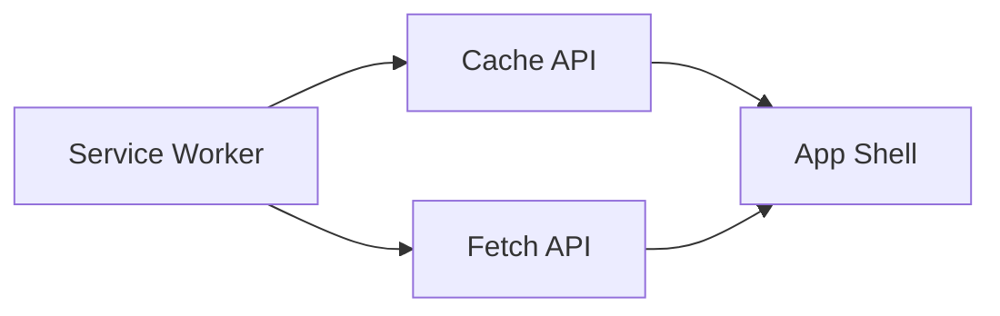
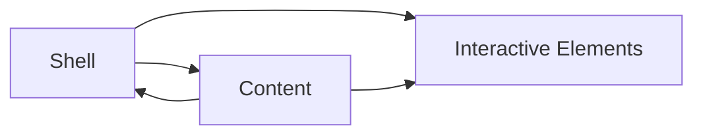
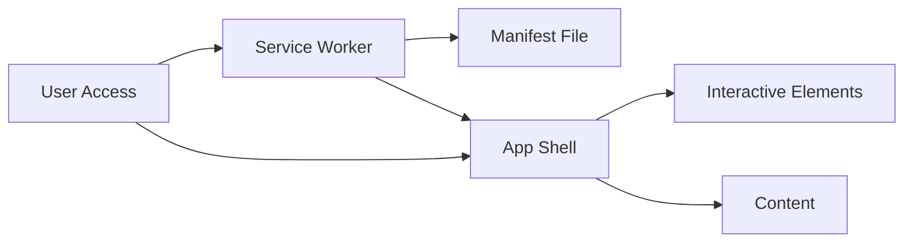

                 


## 文章标题

### 渐进式Web应用（PWA）：融合Web与原生应用的优势

## 文章关键词

- 渐进式Web应用
- Web与原生应用融合
- Service Worker
- Manifest文件
- App Shell
- 性能优化
- 离线缓存

## 文章摘要

本文旨在深入探讨渐进式Web应用（PWA）的概念、技术实现、开发实战和未来发展趋势。PWA作为一种融合了Web与原生应用优势的新型应用，正逐渐改变着移动端和桌面端的用户体验。本文将从基本概念出发，逐步讲解PWA的核心技术和架构，详细介绍PWA的开发过程和性能优化策略，并探讨PWA与原生应用的融合方式。最后，我们将预测PWA的未来发展趋势，为读者提供全方位的技术解读和实践指导。

---

### 第一部分：PWA基本概念与原理

#### 第1章：PWA概述

##### 1.1 PWA的定义与特点

渐进式Web应用（PWA，Progressive Web Apps）是一种旨在提升Web应用性能和用户体验的技术。与传统Web应用和原生应用相比，PWA具备以下特点：

1. **渐进式增强**：PWA可以在任何设备上运行，从老旧的浏览器到最新的现代浏览器，都能提供一致的用户体验。
2. **快速响应**：通过Service Worker缓存机制，PWA能够在网络不稳定或离线状态下提供快速响应。
3. **安装与更新**：PWA可以像原生应用一样被用户安装到桌面或移动设备上，并在后台自动更新。
4. **高表现力**：PWA利用现代Web技术（如CSS3、HTML5和JavaScript）实现丰富的交互效果和视觉效果。

##### 1.2 PWA与传统Web应用、原生应用的比较

PWA与传统Web应用和原生应用在技术实现和用户体验上存在显著差异：

| 特点 | 渐进式Web应用（PWA） | 传统Web应用 | 原生应用 |
| --- | --- | --- | --- |
| 渐进增强 | 是 | 否 | 否 |
| 离线工作 | 是 | 否 | 是（部分） |
| 更新方式 | 自动 | 手动 | 自动 |
| 开发成本 | 低 | 低 | 高 |
| 性能 | 高 | 低 | 高 |

##### 1.3 PWA的发展历程与趋势

PWA的概念最早由Google提出，旨在解决传统Web应用在移动端和桌面端面临的性能和用户体验问题。随着Service Worker、Manifest文件等技术的成熟，PWA逐渐成为Web开发领域的重要趋势。

未来，随着Web技术的不断演进和标准化，PWA有望在更多平台上得到广泛应用，成为连接Web与原生应用的重要桥梁。

---

### 第二部分：PWA核心技术与架构

#### 第2章：PWA核心技术与架构

##### 2.1 Service Worker

Service Worker是PWA的核心技术之一，它允许开发者构建独立于主线程的背景工作线程，实现以下功能：

1. **网络请求代理**：Service Worker可以拦截和处理网络请求，提高应用的响应速度。
2. **缓存机制**：Service Worker可以使用Cache API对应用资源进行离线缓存，确保应用在离线状态下也能正常运行。

##### 2.2 Manifest文件

Manifest文件是PWA的配置文件，定义了应用的名称、图标、主题颜色等基本属性，使PWA能够在桌面或移动设备上被用户安装。

##### 2.3 App Shell

App Shell是PWA的架构模式，它将应用分为三个部分：

1. **Shell**：应用的骨架，包括导航栏、底部菜单等。
2. **内容**：动态加载的应用内容，由Service Worker缓存。
3. **可交互元素**：用户与应用的交互元素，如按钮、输入框等。

##### 2.4 Mermaid流程图：PWA技术架构解析



---

### 第三部分：PWA开发实战

#### 第3章：PWA开发基础

##### 3.1 HTML5与CSS3在PWA中的应用

HTML5和CSS3是构建PWA的基础技术，它们提供了丰富的功能和样式，使PWA能够实现高质量的用户体验。

- **HTML5**：支持多媒体、本地存储、Web组件等特性，为PWA提供了强大的功能支持。
- **CSS3**：提供了丰富的样式和动画效果，使PWA的视觉效果更加美观。

##### 3.2 JavaScript在PWA中的应用

JavaScript是PWA的核心编程语言，它负责处理用户的交互、动态内容和网络请求。在PWA开发中，JavaScript可以用于以下方面：

1. **Service Worker**：实现离线缓存和性能优化。
2. **App Shell**：构建应用的骨架和动态内容。
3. **交互元素**：处理用户的输入和事件。

##### 3.3 使用现代Web框架构建PWA

现代Web框架（如React、Vue、Angular）提供了丰富的组件和库，帮助开发者快速构建高质量的PWA。以下是使用React框架构建PWA的基本步骤：

1. **创建项目**：使用Create React App等工具创建React项目。
2. **安装依赖**：安装Service Worker相关库（如workbox）。
3. **配置Service Worker**：在项目中配置Service Worker，实现缓存和性能优化。
4. **构建App Shell**：使用React组件构建应用的Shell部分。
5. **动态内容**：使用React动态加载和渲染内容。

---

### 第四部分：PWA优化与性能调优

#### 第4章：PWA优化与性能调优

##### 4.1 代码分割与懒加载

代码分割和懒加载是PWA性能优化的重要技术，它们能够减小初始加载时间和提高应用性能。

- **代码分割**：将应用代码拆分为多个chunk，按需加载，减少初始加载量。
- **懒加载**：延迟加载页面中不立即需要的资源，提高页面加载速度。

##### 4.2 离线缓存与网络请求优化

离线缓存和网络请求优化是PWA性能优化的关键环节。

- **离线缓存**：使用Service Worker缓存应用资源，确保应用在离线状态下也能正常运行。
- **网络请求优化**：使用CDN、HTTP/2等优化网络请求，提高响应速度。

##### 4.3 PWA性能测试与调优

PWA性能测试与调优需要使用以下工具和方法：

1. **性能分析工具**：如Lighthouse、WebPageTest等。
2. **性能测试**：模拟用户访问行为，评估应用性能。
3. **性能优化**：根据测试结果，针对性地优化应用代码和架构。

---

### 第五部分：PWA与原生应用的融合

#### 第5章：PWA与原生应用的融合

##### 5.1 React Native在PWA中的应用

React Native是一种用于构建原生应用的框架，它也可以用于构建PWA。以下是React Native在PWA中的应用：

1. **组件复用**：将React Native组件用于Web端，实现跨平台开发。
2. **性能优化**：React Native提供了优化的UI渲染机制，提高PWA性能。

##### 5.2 Flutter在PWA中的应用

Flutter是一种用于构建原生应用的开源框架，它也可以用于构建PWA。以下是Flutter在PWA中的应用：

1. **跨平台UI**：Flutter提供了丰富的UI组件，使PWA的UI更加美观。
2. **性能优化**：Flutter的渲染引擎提高了PWA的性能。

##### 5.3 PWA与原生应用的集成策略

PWA与原生应用的集成策略包括：

1. **Webview集成**：将PWA嵌入到原生应用中，实现混合应用。
2. **组件化开发**：将PWA和原生应用的组件分离，实现模块化开发。

---

### 第六部分：PWA在不同平台的应用

#### 第6章：PWA在不同平台的应用

##### 6.1 移动设备上的PWA

移动设备上的PWA具有以下优势：

1. **快速响应**：通过Service Worker缓存机制，提高应用响应速度。
2. **低流量消耗**：使用离线缓存，减少数据流量消耗。
3. **便捷安装**：用户可以像安装原生应用一样，方便地安装PWA。

##### 6.2 桌面设备上的PWA

桌面设备上的PWA具有以下优势：

1. **免安装**：用户无需下载和安装应用，即可直接使用。
2. **更新自动**：PWA可以在后台自动更新，确保用户使用的是最新版本。
3. **集成度高**：PWA可以与操作系统深度集成，提供更好的用户体验。

##### 6.3 PWA在不同平台的应用案例

以下是PWA在不同平台上的应用案例：

1. **移动端**：淘宝、京东等电商平台在移动端推出了PWA版本，显著提高了用户体验和转化率。
2. **桌面端**：谷歌Chrome浏览器在桌面端推出了PWA版本，为用户提供快速、便捷的访问方式。

---

### 第七部分：PWA的未来发展趋势

#### 第7章：PWA的未来发展趋势

##### 7.1 PWA的标准化进程

PWA的标准化进程正在加速，W3C等国际标准化组织正在制定相关规范，以确保PWA在不同浏览器和平台上的一致性和互操作性。

##### 7.2 PWA生态建设

随着PWA的普及，越来越多的开发工具、平台和服务正在涌现，为开发者提供更好的支持。例如，Google的Lighthouse、Workbox等工具，为开发者提供了全面的PWA开发指南和优化建议。

##### 7.3 PWA的未来发展趋势预测

未来，PWA有望在以下几个方面取得突破：

1. **更广泛的应用场景**：PWA将应用于更多领域，如电子商务、在线教育、医疗保健等。
2. **更高的性能**：随着Web技术的不断演进，PWA的性能将得到进一步提升。
3. **更完善的生态**：PWA的生态将更加完善，为开发者提供更好的开发体验和更多创新机会。

---

## 总结

渐进式Web应用（PWA）作为一种新兴的应用形式，融合了Web与原生应用的优势，为用户提供了更好的体验。本文从基本概念、核心技术、开发实战、性能优化、与原生应用融合、未来发展趋势等方面，全面介绍了PWA的相关知识。希望本文能对开发者理解和应用PWA有所帮助，推动PWA在更多领域的发展和应用。

### 作者

作者：AI天才研究院/AI Genius Institute & 禅与计算机程序设计艺术 /Zen And The Art of Computer Programming

---

### 第1章：PWA概述

#### 1.1 PWA的定义与特点

渐进式Web应用（PWA，Progressive Web Apps）是一种基于Web技术构建的应用，它结合了Web的广泛访问性和原生应用的性能和体验。与传统Web应用和原生应用相比，PWA具有以下几个显著特点：

1. **渐进式增强**：PWA的设计原则是渐进式增强（progressive enhancement），这意味着它可以在任何设备上运行，无论用户使用的浏览器是否支持最新的Web技术。PWA首先提供基本的功能和体验，然后通过现代Web技术如CSS3、HTML5和JavaScript等逐步增强用户体验。

2. **快速响应**：PWA通过使用Service Worker实现网络请求的代理和缓存，使得应用可以在网络不稳定或离线状态下提供快速响应。这意味着用户可以迅速访问和操作应用，即使在较差的网络环境下也不会有明显延迟。

3. **安装与更新**：PWA可以让用户像安装原生应用一样将它们添加到桌面或主屏幕。当应用更新时，用户会自动接收更新，而不需要手动下载或安装新的版本。

4. **高表现力**：PWA利用现代Web技术实现了丰富的交互效果和视觉效果，如动画、过渡效果和全屏模式等，这些特性使PWA在用户体验上能够媲美甚至超越原生应用。

5. **安全**：PWA通常通过HTTPS进行传输，确保用户数据的安全性。

6. **可搜索和链接**：PWA是Web上的可访问资源，因此它们可以通过搜索引擎索引，用户可以像访问任何Web页面一样访问和分享它们。

#### 1.2 PWA与传统Web应用、原生应用的比较

PWA与传统Web应用和原生应用在技术实现和用户体验上存在显著差异：

**与传统Web应用的比较**：

- **交互性**：传统Web应用通常响应速度较慢，特别是在移动设备上，因为它们依赖于服务器来处理所有请求。
- **性能**：PWA通过缓存技术，使得用户在离线状态下也能访问应用内容，而传统Web应用在离线状态下几乎无法使用。
- **安装**：传统Web应用无法被用户安装到桌面或主屏幕，而PWA支持这一功能。

**与原生应用的比较**：

- **开发成本**：原生应用通常需要为不同的平台分别开发，而PWA可以在单一代码库的基础上同时支持多个平台，大大降低了开发成本。
- **性能**：原生应用通常在性能上优于PWA，但PWA通过现代Web技术的优化，性能差距正在逐渐缩小。
- **安装**：原生应用需要用户下载和安装，而PWA可以通过点击安装按钮快速安装，用户体验更加流畅。

#### 1.3 PWA的发展历程与趋势

PWA的概念最早由Google在2015年提出，随着Service Worker、Manifest文件等技术的成熟，PWA逐渐成为Web开发领域的重要趋势。以下是PWA发展历程的关键点：

1. **2015年**：Google正式推出PWA概念，并在Chrome浏览器中引入了Service Worker技术。
2. **2016年**：W3C成立了Web App Manifest Working Group，开始制定与PWA相关的规范。
3. **2017年**：Chrome浏览器开始支持Installable Events API，使用户能够更方便地将PWA安装到桌面或主屏幕。
4. **2018年**：微软宣布在其Edge浏览器中支持PWA。
5. **2019年**：苹果在Safari浏览器中引入了PWA功能，使得PWA在主流浏览器中得到了全面支持。

随着Web技术的不断演进和标准化，PWA有望在更多平台上得到广泛应用，成为连接Web与原生应用的重要桥梁。未来，PWA将在用户体验、开发效率和生态系统建设等方面发挥更大的作用。

### 第2章：PWA核心技术与架构

#### 2.1 Service Worker

Service Worker是PWA的核心技术之一，它是一种运行在独立线程中的脚本，用于处理网络请求、缓存资源和控制应用行为。Service Worker的主要功能包括：

1. **网络请求代理**：Service Worker可以拦截并处理应用的所有网络请求，从而实现自定义网络行为，如重定向、缓存响应等。
   
2. **缓存机制**：Service Worker可以使用Cache API缓存应用资源，使得应用在离线状态下也能正常运行。通过Cache API，开发者可以指定哪些资源需要被缓存，以及如何更新缓存。

3. **推送通知**：Service Worker可以接收后台推送通知，即使在应用关闭或未打开的情况下，也能向用户发送通知消息。

以下是Service Worker的基本生命周期：

1. **启动**：当用户首次访问PWA时，Service Worker会被加载并启动。
2. **注册**：Service Worker会注册到主线程中，并开始监听事件。
3. **拦截请求**：Service Worker会拦截和处理所有网络请求，根据配置的缓存策略返回缓存数据或发起网络请求。
4. **更新**：当Service Worker检测到更新时，会触发更新流程，确保用户始终使用最新的应用版本。

以下是Service Worker的基本伪代码：

```javascript
self.addEventListener('install', event => {
  event.waitUntil(
    caches.open('my-cache').then(cache => {
      return cache.addAll([
        '/styles/main.css',
        '/scripts/main.js',
        '/images/logo.png'
      ]);
    })
  );
});

self.addEventListener('fetch', event => {
  event.respondWith(
    caches.match(event.request).then(response => {
      if (response) {
        return response;
      }
      return fetch(event.request);
    })
  );
});
```

#### 2.2 Manifest文件

Manifest文件是PWA的配置文件，它定义了应用的名称、图标、主题颜色、启动画面等基本属性。Manifest文件以JSON格式编写，通常位于应用的根目录下。以下是Manifest文件的基本结构：

```json
{
  "name": "My Progressive Web App",
  "short_name": "MyPWA",
  "description": "A progressive web app that offers a great user experience.",
  "start_url": "/index.html",
  "display": "standalone",
  "background_color": "#ffffff",
  "theme_color": "#000000",
  "icons": [
    {
      "src": "icon-192x192.png",
      "sizes": "192x192",
      "type": "image/png"
    },
    {
      "src": "icon-512x512.png",
      "sizes": "512x512",
      "type": "image/png"
    }
  ]
}
```

Manifest文件中的关键属性包括：

- **name**：应用的名称，通常显示在设备上。
- **short_name**：应用的短名称，用于主屏幕图标。
- **description**：应用的描述信息。
- **start_url**：应用的入口页面。
- **display**：应用的显示模式，可以是`standalone`（独立显示，无浏览器栏）、`fullscreen`（全屏显示，无地址栏和标签栏）或`minimal-ui`（最小化UI）。
- **background_color**：应用的背景颜色。
- **theme_color**：应用的主题颜色。
- **icons**：应用图标，用于桌面或主屏幕上的图标。

#### 2.3 App Shell

App Shell是PWA的一种架构模式，它将应用分为三个主要部分：Shell、内容和可交互元素。这种架构模式有助于优化性能和提升用户体验。

1. **Shell**：Shell是应用的骨架，包括导航栏、底部菜单等固定的UI元素。这些元素通常不频繁变化，因此可以在安装时预先加载到本地缓存中。

2. **内容**：内容是应用的动态部分，包括文章、商品列表等。这些内容通常通过网络请求动态加载，但可以借助Service Worker缓存机制，实现快速访问。

3. **可交互元素**：可交互元素是用户与应用交互的部分，如按钮、输入框等。这些元素通常与内容紧密相关，并在用户操作时触发相应的网络请求或本地处理。

以下是App Shell的基本架构：



App Shell的优点包括：

- **快速启动**：通过预先加载Shell，应用可以在用户点击安装按钮后快速启动。
- **良好用户体验**：动态加载内容和交互元素，确保应用始终提供流畅的用户体验。
- **缓存优化**：通过缓存Shell和内容，提高应用在离线状态下的性能。

#### 2.4 Mermaid流程图：PWA技术架构解析

以下是PWA技术架构的Mermaid流程图：



在这个流程图中，用户访问PWA后，Service Worker负责处理网络请求和缓存资源。Manifest文件定义了应用的基本属性和图标。App Shell包括Shell、内容和可交互元素，这些部分协同工作，提供良好的用户体验。

### 第3章：PWA开发基础

#### 3.1 HTML5与CSS3在PWA中的应用

HTML5和CSS3是构建PWA的核心技术，它们提供了丰富的功能和样式，使得PWA能够实现高质量的用户体验。以下分别介绍HTML5和CSS3在PWA中的应用。

**HTML5在PWA中的应用**：

- **多媒体支持**：HTML5引入了多种多媒体元素，如<video>和<audio>，使得PWA能够集成视频和音频内容。这些元素支持多种视频和音频格式，提供了更好的媒体播放体验。

- **本地存储**：HTML5的Web Storage API（包括localStorage和sessionStorage）提供了简单易用的本地存储解决方案，使得PWA可以在本地存储用户数据和设置，提高用户体验。

- **Web组件**：HTML5的Web组件（包括<template>、<slot>、<custom-element>等）提供了创建可重用和可组合的UI组件的机制，使得PWA的UI开发更加灵活和高效。

- **表单增强**：HTML5引入了新的表单元素和属性，如<progress>、<meter>和<datalist>，使得PWA的表单处理更加直观和用户友好。

**CSS3在PWA中的应用**：

- **过渡和动画**：CSS3提供了丰富的过渡和动画效果，使得PWA的UI更加动态和富有表现力。通过使用CSS3的@keyframes规则和transition属性，开发者可以轻松实现各种动画效果。

- **响应式设计**：CSS3的媒体查询（@media）和Flexbox、Grid布局等响应式布局技术，使得PWA能够适应不同的设备和屏幕尺寸，提供一致的用户体验。

- **样式表分离**：CSS3引入了样式表模块化（@module），使得PWA的样式表更加模块化和可重用，提高了代码的可维护性。

- **伪元素和伪类**：CSS3的伪元素（::before、::after）和伪类（:hover、:active等）提供了强大的样式控制能力，使得PWA的UI设计更加精细和美观。

**示例**：

以下是一个简单的HTML5和CSS3示例，展示了如何在PWA中集成多媒体支持和响应式设计：

```html
<!DOCTYPE html>
<html lang="en">
<head>
  <meta charset="UTF-8">
  <meta name="viewport" content="width=device-width, initial-scale=1.0">
  <title>PWA Example</title>
  <style>
    /* CSS3 响应式设计 */
    @media (max-width: 600px) {
      body {
        font-size: 14px;
      }
    }

    /* CSS3 过渡效果 */
    .button {
      background-color: #4CAF50;
      color: white;
      padding: 10px 20px;
      text-align: center;
      text-decoration: none;
      display: inline-block;
      font-size: 16px;
      margin: 4px 2px;
      cursor: pointer;
      transition-duration: 0.4s;
    }

    .button:hover {
      background-color: #3e8e41;
    }
  </style>
</head>
<body>
  <!-- HTML5 多媒体支持 -->
  <video controls>
    <source src="movie.mp4" type="video/mp4">
    Your browser does not support the video tag.
  </video>

  <!-- CSS3 动画和过渡 -->
  <button class="button">Click me!</button>
</body>
</html>
```

在这个示例中，我们使用HTML5的<video>元素集成了视频播放功能，使用CSS3的媒体查询实现了响应式设计，使用CSS3的过渡效果增强了按钮的交互体验。

#### 3.2 JavaScript在PWA中的应用

JavaScript是构建PWA的关键技术，它负责处理用户的交互、动态内容和网络请求。以下介绍JavaScript在PWA中的应用。

**JavaScript核心API**：

- **Fetch API**：Fetch API提供了用于发起网络请求的接口，它基于Promise设计，使得异步操作更加简洁和易用。Fetch API可以拦截和修改请求，也可以拦截和修改响应。

- **Service Worker**：Service Worker是一种运行在独立线程中的JavaScript脚本，用于处理网络请求、缓存资源和控制应用行为。Service Worker可以拦截和处理应用的所有网络请求，从而实现自定义网络行为，如重定向、缓存响应等。

- **Web Storage**：Web Storage API（包括localStorage和sessionStorage）提供了简单易用的本地存储解决方案，使得PWA可以在本地存储用户数据和设置，提高用户体验。

- **Notifications API**：Notifications API允许PWA在用户无交互或应用关闭的情况下发送推送通知。

以下是JavaScript在PWA中的典型应用场景：

1. **网络请求**：使用Fetch API发起网络请求，可以处理GET、POST、PUT等HTTP方法，同时可以拦截和修改请求和响应。

2. **缓存机制**：使用Service Worker实现离线缓存，可以将应用资源缓存到本地，确保应用在离线状态下也能正常运行。

3. **动态内容**：使用JavaScript动态加载和渲染内容，可以实现复杂的数据绑定和动画效果。

4. **交互处理**：使用JavaScript处理用户的输入和事件，如按钮点击、表单提交等，从而实现与用户的互动。

5. **推送通知**：使用Notifications API实现后台推送通知，即使在应用未打开的情况下也能向用户发送通知。

**示例**：

以下是一个简单的JavaScript示例，展示了如何在PWA中实现缓存机制和动态内容加载：

```javascript
// Service Worker 注册
if ('serviceWorker' in navigator) {
  window.addEventListener('load', () => {
    navigator.serviceWorker.register('/service-worker.js').then(registration => {
      console.log('Service Worker registered:', registration);
    }).catch(error => {
      console.error('Service Worker registration failed:', error);
    });
  });
}

// 缓存策略
self.addEventListener('install', event => {
  event.waitUntil(
    caches.open('pwa-cache').then(cache => {
      return cache.addAll([
        '/',
        '/styles/main.css',
        '/scripts/main.js',
        '/images/logo.png'
      ]);
    })
  );
});

// 动态内容加载
fetch('/data.json')
  .then(response => response.json())
  .then(data => {
    const list = document.getElementById('list');
    data.items.forEach(item => {
      const listItem = document.createElement('li');
      listItem.textContent = item.name;
      list.appendChild(listItem);
    });
  });
```

在这个示例中，我们首先在主线程中注册Service Worker，然后实现缓存策略，将应用资源缓存到本地。接着，我们使用Fetch API动态加载JSON数据，并使用JavaScript将数据渲染到页面上。

#### 3.3 使用现代Web框架构建PWA

现代Web框架（如React、Vue、Angular）提供了丰富的组件和库，帮助开发者快速构建高质量的PWA。以下介绍如何使用React、Vue和Angular等现代Web框架构建PWA。

**React**：

React是一个流行的JavaScript库，用于构建用户界面。React提供了组件化开发模式，使得代码更加模块化和可重用。以下是使用React构建PWA的基本步骤：

1. **创建项目**：使用Create React App创建React项目。

```bash
npx create-react-app my-pwa
```

2. **安装依赖**：安装Service Worker相关库，如`workbox`。

```bash
cd my-pwa
npm install workbox
```

3. **配置Service Worker**：在项目中配置Service Worker，实现缓存和性能优化。

在`src`目录下创建`service-worker.js`文件，并配置缓存策略：

```javascript
import { workboxSW } from 'workbox-sw';

workboxSW.routing.registerRoute(
  ({ request }) => request.destination === 'image',
  new workboxSW.strategies.CacheFirst()
);

workboxSW.routing.registerRoute(
  ({ request }) => request.destination === 'style',
  new workboxSW.strategies.StaleWhileRevalidate()
);

workboxSW.routing.registerRoute(
  ({ request }) => request.destination === 'script',
  new workboxSW.strategies.NetworkFirst()
);
```

4. **构建App Shell**：使用React组件构建应用的Shell部分。

在`src`目录下创建`AppShell.js`组件，包含导航栏、底部菜单等：

```javascript
import React from 'react';

const AppShell = ({ children }) => {
  return (
    <div>
      <nav>
        {/* 导航栏内容 */}
      </nav>
      <main>
        {children}
      </main>
      <footer>
        {/* 底部菜单内容 */}
      </footer>
    </div>
  );
};

export default AppShell;
```

5. **动态内容**：使用React动态加载和渲染内容。

在`AppShell`组件中，使用React的`Suspense`和`lazy`函数动态加载内容组件：

```javascript
import React, { Suspense, lazy } from 'react';

const Home = lazy(() => import('./Home'));
const About = lazy(() => import('./About'));

const AppShell = ({ children }) => {
  return (
    <div>
      <nav>
        {/* 导航栏内容 */}
      </nav>
      <main>
        <Suspense fallback={<div>Loading...</div>}>
          <Routes>
            <Route path="/" element={<Home />} />
            <Route path="/about" element={<About />} />
          </Routes>
        </Suspense>
      </main>
      <footer>
        {/* 底部菜单内容 */}
      </footer>
    </div>
  );
};

export default AppShell;
```

**Vue**：

Vue是一个流行的JavaScript框架，提供了简洁、灵活的组件化开发模式。以下是使用Vue构建PWA的基本步骤：

1. **创建项目**：使用Vue CLI创建Vue项目。

```bash
vue create my-pwa
```

2. **安装依赖**：安装Service Worker相关库，如`workbox-vue`。

```bash
cd my-pwa
npm install workbox-vue
```

3. **配置Service Worker**：在项目中配置Service Worker，实现缓存和性能优化。

在`src`目录下创建`service-worker.js`文件，并配置缓存策略：

```javascript
import { workboxSW } from 'workbox-sw';

workboxSW.precaching.precacheAndRoute([]);

workboxSW.routing.registerRoute(
  ({ request }) => request.destination === 'image',
  new workboxSW.strategies.CacheFirst()
);

workboxSW.routing.registerRoute(
  ({ request }) => request.destination === 'style',
  new workboxSW.strategies.StaleWhileRevalidate()
);

workboxSW.routing.registerRoute(
  ({ request }) => request.destination === 'script',
  new workboxSW.strategies.NetworkFirst()
);
```

4. **构建App Shell**：使用Vue组件构建应用的Shell部分。

在`src`目录下创建`AppShell.vue`组件，包含导航栏、底部菜单等：

```vue
<template>
  <div>
    <nav>
      {/* 导航栏内容 */}
    </nav>
    <main>
      <router-view />
    </main>
    <footer>
      {/* 底部菜单内容 */}
    </footer>
  </div>
</template>

<script>
export default {
  name: 'AppShell',
};
</script>
```

5. **动态内容**：使用Vue路由动态加载和渲染内容。

在`src`目录下创建路由配置文件`router.js`，并配置路由：

```javascript
import Home from './views/Home.vue';
import About from './views/About.vue';

export default new VueRouter({
  routes: [
    { path: '/', component: Home },
    { path: '/about', component: About },
  ],
});
```

**Angular**：

Angular是一个流行的JavaScript框架，提供了强大的组件化开发模式和丰富的功能集。以下是使用Angular构建PWA的基本步骤：

1. **创建项目**：使用Angular CLI创建Angular项目。

```bash
ng new my-pwa
```

2. **安装依赖**：安装Service Worker相关库，如`@angular/pwa`。

```bash
cd my-pwa
npm install @angular/pwa
```

3. **配置Service Worker**：在项目中配置Service Worker，实现缓存和性能优化。

在`src`目录下创建`service-worker.js`文件，并配置缓存策略：

```javascript
import { ServiceWorkerModule } from '@angular/pwa';

@NgModule({
  declarations: [],
  imports: [
    ServiceWorkerModule.register('service-worker.js', { enabled: true }),
  ],
  providers: [],
  bootstrap: [AppComponent]
})
export class AppModule {}
```

4. **构建App Shell**：使用Angular组件构建应用的Shell部分。

在`src`目录下创建`AppShell.component.ts`组件，包含导航栏、底部菜单等：

```typescript
import { Component } from '@angular/core';

@Component({
  selector: 'app-app-shell',
  templateUrl: './app-shell.component.html',
  styleUrls: ['./app-shell.component.css']
})
export class AppShellComponent {
  // 组件逻辑
}
```

5. **动态内容**：使用Angular路由动态加载和渲染内容。

在`src`目录下创建路由配置文件`app-routing.module.ts`，并配置路由：

```typescript
import { NgModule } from '@angular/core';
import { RouterModule, Routes } from '@angular/router';
import { HomeComponent } from './home/home.component';
import { AboutComponent } from './about/about.component';

const routes: Routes = [
  { path: '', component: HomeComponent },
  { path: 'about', component: AboutComponent }
];

@NgModule({
  imports: [RouterModule.forRoot(routes)],
  exports: [RouterModule]
})
export class AppRoutingModule {}
```

通过以上步骤，我们可以使用React、Vue和Angular等现代Web框架构建高质量的PWA，实现快速响应、离线缓存和良好用户体验。

### 第4章：PWA性能优化

#### 4.1 代码分割与懒加载

代码分割（Code Splitting）和懒加载（Lazy Loading）是PWA性能优化的重要技术，它们可以帮助减少初始加载时间，提高应用的响应速度。

**代码分割**：

代码分割是将应用代码拆分为多个chunk，按需加载的技术。通过代码分割，我们可以将应用的依赖项和模块拆分为不同的文件，使得浏览器可以并行加载这些文件，从而减少加载时间。

以下是使用Webpack实现代码分割的基本步骤：

1. **安装Webpack和相关的插件**：

```bash
npm install --save-dev webpack webpack-cli
npm install --save-dev webpack-parallel-libs-webpack-plugin
```

2. **配置Webpack**：在`webpack.config.js`文件中配置代码分割：

```javascript
const { ParallelUmdPlugin } = require('webpack-parallel-libs-webpack-plugin');

module.exports = {
  // 其他配置
  plugins: [
    new ParallelUmdPlugin({
      namedChunks: true,
    }),
  ],
  optimization: {
    splitChunks: {
      chunks: 'all',
    },
  },
};
```

3. **使用代码分割**：在项目中使用动态导入语法，实现代码分割：

```javascript
import(async () => {
  const myModule = await import('./my-module');
  myModule.default();
})();
```

**懒加载**：

懒加载是延迟加载页面中不立即需要的资源，提高页面加载速度的技术。在PWA中，我们可以使用Webpack的懒加载功能，将一些组件或资源延迟加载。

以下是使用Webpack实现懒加载的基本步骤：

1. **配置Webpack**：在`webpack.config.js`文件中启用懒加载：

```javascript
module.exports = {
  // 其他配置
  optimization: {
    splitChunks: {
      chunks: 'all',
      name: 'bundle',
    },
    runtimeChunk: { name: 'runtime' },
  },
};
```

2. **使用懒加载**：在项目中使用`React.lazy`、`Vue`的`<router-view>`或`Angular`的`*ngIf`实现懒加载：

```javascript
// React
const MyModule = lazy(() => import('./MyModule'));

function MyComponent() {
  return (
    <div>
      <MyModule />
    </div>
  );
}

// Vue
<template>
  <div>
    <keep-alive>
      <component :is="currentComponent" />
    </keep-alive>
  </div>
</template>

<script>
export default {
  data() {
    return {
      currentComponent: 'HomeComponent',
    };
  },
  watch: {
    '$route.name'(newValue) {
      this.currentComponent = newValue;
    },
  },
};
</script>

// Angular
@Component({
  selector: 'my-component',
  template: `
    <ng-container *ngIf="currentComponent === 'HomeComponent'">
      <home-component></home-component>
    </ng-container>
    <ng-container *ngIf="currentComponent === 'AboutComponent'">
      <about-component></about-component>
    </ng-container>
  `,
})
export class MyComponent {
  currentComponent: string;
}
```

通过代码分割和懒加载，我们可以显著减少应用的初始加载时间，提高用户体验。

#### 4.2 离线缓存与网络请求优化

离线缓存和网络请求优化是PWA性能优化的关键环节，它们可以帮助应用在离线状态下正常工作，并提高网络请求的效率。

**离线缓存**：

离线缓存是将应用资源缓存到本地存储，确保应用在离线状态下也能正常运行的技术。在PWA中，我们可以使用Service Worker实现离线缓存。

以下是使用Service Worker实现离线缓存的基本步骤：

1. **注册Service Worker**：在主线程中注册Service Worker：

```javascript
if ('serviceWorker' in navigator) {
  window.addEventListener('load', () => {
    navigator.serviceWorker.register('/service-worker.js').then(registration => {
      console.log('Service Worker registered:', registration);
    }).catch(error => {
      console.error('Service Worker registration failed:', error);
    });
  });
}
```

2. **配置Cache API**：在Service Worker中配置Cache API，缓存应用资源：

```javascript
self.addEventListener('install', event => {
  event.waitUntil(
    caches.open('pwa-cache').then(cache => {
      return cache.addAll([
        '/',
        '/styles/main.css',
        '/scripts/main.js',
        '/images/logo.png'
      ]);
    })
  );
});

self.addEventListener('fetch', event => {
  event.respondWith(
    caches.match(event.request).then(response => {
      if (response) {
        return response;
      }
      return fetch(event.request);
    })
  );
});
```

3. **更新缓存**：在Service Worker中实现缓存更新策略，确保用户始终使用最新的应用资源。

**网络请求优化**：

网络请求优化是提高应用性能的关键，它包括减少请求次数、优化请求方式等。以下是一些网络请求优化的策略：

1. **减少请求次数**：通过合并文件、压缩资源等方式，减少应用的HTTP请求次数。

2. **使用HTTP/2**：HTTP/2协议提供了多路复用和头部压缩等优化机制，可以显著提高网络请求的效率。

3. **延迟加载**：延迟加载页面中不立即需要的资源，如图片、视频等。

4. **使用CDN**：使用内容分发网络（CDN）加速资源加载，提高应用的响应速度。

5. **预取资源**：预取（Prefetching）是将页面中即将需要的资源提前加载的技术。在PWA中，我们可以使用`Link rel="prefetch"`标签预取资源：

```html
<link rel="prefetch" href="image.jpg" as="image">
```

通过离线缓存和网络请求优化，我们可以显著提高PWA的性能，确保用户在离线状态下也能正常使用应用。

#### 4.3 PWA性能测试与调优

PWA性能测试与调优是确保应用提供优质用户体验的关键环节。以下介绍PWA性能测试与调优的方法和工具。

**性能测试工具**：

1. **Lighthouse**：Lighthouse是Google提供的开源自动化测试工具，用于评估Web应用的性能、可访问性、最佳实践等。Lighthouse提供了详细的性能报告，可以帮助开发者识别性能瓶颈。

2. **WebPageTest**：WebPageTest是一个开源的Web性能测试工具，它模拟用户在不同网络环境下的页面加载过程，并提供详细的性能分析报告。

**性能调优方法**：

1. **代码分割与懒加载**：通过代码分割和懒加载减少应用的初始加载时间，提高页面性能。

2. **优化资源加载**：优化图片、CSS和JavaScript等资源的加载，如使用响应式图片、图片压缩、CSS和JavaScript压缩等。

3. **减少HTTP请求**：合并文件、使用CDN等方式减少HTTP请求次数，提高页面性能。

4. **使用HTTP/2**：升级到HTTP/2协议，利用多路复用和头部压缩等优化机制，提高网络请求效率。

5. **预取资源**：预取即将需要的资源，减少页面加载时间。

**实战案例**：

以下是一个PWA性能测试与调优的实战案例：

1. **测试**：

   使用Lighthouse进行性能测试：

   ```bash
   npx lighthouse https://your-pwa-site.com --output json --output-path lighthouse-report.json
   ```

   读取Lighthouse报告，分析性能得分和优化建议。

2. **调优**：

   - **代码分割与懒加载**：使用Webpack实现代码分割和懒加载，减少初始加载时间。

   - **优化资源加载**：压缩图片、CSS和JavaScript文件，减少文件大小。

   - **减少HTTP请求**：合并CSS和JavaScript文件，使用CDN加速资源加载。

   - **使用HTTP/2**：配置服务器使用HTTP/2协议。

   - **预取资源**：在HTML中添加`<link rel="prefetch">`标签，预取即将需要的资源。

3. **再次测试**：

   再次使用Lighthouse进行性能测试，比较优化前后的性能得分，验证优化效果。

通过性能测试与调优，我们可以确保PWA提供优质的用户体验，提高用户满意度。

### 第5章：PWA实战案例

#### 5.1 使用React构建PWA

以下是一个使用React构建PWA的实战案例，涵盖开发环境搭建、源代码实现和性能优化。

**开发环境搭建**：

1. **创建React项目**：

```bash
npx create-react-app my-pwa
```

2. **安装依赖**：

```bash
cd my-pwa
npm install workbox
```

3. **配置Service Worker**：

在`src`目录下创建`service-worker.js`文件，并添加以下代码：

```javascript
import { skipWaiting, clientsClaim } from 'workbox-core';
import { ExpirationPlugin } from 'workbox-expiration';
import { createHandlerForRoute } from 'workbox-routing';
import { StaleWhileRevalidate } from 'workbox-strategies';
import { navigateTo } from 'workbox-routing';

// 缓存策略
workbox.routing.registerNavigationRoute(navigateTo, { ignoreURLParametersMatching: [/^utm_/] });

// 缓存静态资源
workbox.routing.registerRoute(
  ({ request }) => request.destination === 'image',
  new workbox.strategies.CacheFirst()
);

workbox.routing.registerRoute(
  ({ request }) => request.destination === 'style',
  new workbox.strategies.StaleWhileRevalidate()
);

workbox.routing.registerRoute(
  ({ request }) => request.destination === 'script',
  new workbox.strategies.NetworkFirst()
);

workbox.routing.registerRoute(
  ({ request }) => request.destination === 'document',
  new workbox.strategies.NetworkFirst()
);

// 清理旧缓存
workbox.addEventListener('message', event => {
  if (event.data.action === 'clearCache') {
    workbox.expiration.clearAll();
  }
});

// 激活更新
self.addEventListener('message', event => {
  if (event.data.action === 'skipWaiting') {
    skipWaiting().then(() => clientsClaim());
  }
});
```

4. **配置Webpack**：

在`webpack.config.js`文件中添加以下插件：

```javascript
const WorkboxPlugin = require('workbox-webpack-plugin');

module.exports = {
  // ...
  plugins: [
    new WorkboxPlugin.InjectManifest({
      swSrc: 'src/service-worker.js',
      swDest: 'service-worker.js',
      exclude: ['images/*', 'videos/*'],
      runtimeCaching: [
        {
          urlPattern: ({ request }) => request.destination === 'image',
          handler: 'CacheFirst',
        },
        {
          urlPattern: ({ request }) => request.destination === 'style',
          handler: 'StaleWhileRevalidate',
        },
        {
          urlPattern: ({ request }) => request.destination === 'script',
          handler: 'NetworkFirst',
        },
      ],
    }),
  ],
};
```

5. **运行项目**：

```bash
npm start
```

**源代码实现**：

1. **创建组件**：

在`src`目录下创建以下组件：

- `App.js`：主组件。
- `Home.js`：首页组件。
- `About.js`：关于我们页组件。

2. **实现主组件`App.js`**：

```javascript
import React, { useState, useEffect } from 'react';
import { BrowserRouter as Router, Route, Switch } from 'react-router-dom';
import Home from './Home';
import About from './About';

function App() {
  const [isCached, setIsCached] = useState(false);

  useEffect(() => {
    // 检查是否已缓存
    caches.open('my-cache').then(cache => {
      cache.keys().then(keys => {
        if (keys.length > 0) {
          setIsCached(true);
        }
      });
    });
  }, []);

  return (
    <Router>
      <div>
        <nav>
          {/* 导航栏内容 */}
        </nav>
        <main>
          <Switch>
            <Route exact path="/" component={Home} />
            <Route path="/about" component={About} />
          </Switch>
        </main>
        <footer>
          {/* 页脚内容 */}
        </footer>
      </div>
    </Router>
  );
}

export default App;
```

3. **实现首页组件`Home.js`**：

```javascript
import React from 'react';

function Home() {
  return (
    <div>
      <h1>首页</h1>
      <p>欢迎使用我们的PWA应用！</p>
    </div>
  );
}

export default Home;
```

4. **实现关于我们页组件`About.js`**：

```javascript
import React from 'react';

function About() {
  return (
    <div>
      <h1>关于我们</h1>
      <p>这是一个关于我们的页面。</p>
    </div>
  );
}

export default About;
```

5. **打包与部署**：

```bash
npm run build
```

将打包后的文件部署到服务器上。

**性能优化**：

1. **代码分割与懒加载**：

使用React的动态导入语法实现代码分割和懒加载，减少初始加载时间。

2. **优化资源加载**：

使用WebPack优化图片、CSS和JavaScript文件的加载，减少文件大小。

3. **使用HTTP/2**：

确保服务器支持HTTP/2协议，提高资源加载速度。

4. **预取资源**：

在HTML中添加`<link rel="prefetch">`标签，预取即将需要的资源。

#### 5.2 使用Vue构建PWA

以下是一个使用Vue构建PWA的实战案例，涵盖开发环境搭建、源代码实现和性能优化。

**开发环境搭建**：

1. **创建Vue项目**：

```bash
vue create my-pwa
```

2. **安装依赖**：

```bash
cd my-pwa
npm install workbox-vue
```

3. **配置Service Worker**：

在`public`目录下创建`service-worker.js`文件，并添加以下代码：

```javascript
import { ExpirationPlugin } from 'workbox-expiration';
import { CacheFirst, NetworkFirst } from 'workbox-strategies';
import { createHandlerForRoute } from 'workbox-routing';

workbox.setConfig({
  debug: false,
});

// 缓存静态资源
workbox.routing.registerRoute(
  ({ request }) => request.destination === 'image',
  new CacheFirst()
);

workbox.routing.registerRoute(
  ({ request }) => request.destination === 'style',
  new CacheFirst()
);

workbox.routing.registerRoute(
  ({ request }) => request.destination === 'script',
  new NetworkFirst()
);

// 清理旧缓存
workbox.addEventListener('message', event => {
  if (event.data.action === 'clearCache') {
    workbox.expiration.clearAll();
  }
});

// 激活更新
workbox.addEventListener('message', event => {
  if (event.data.action === 'skipWaiting') {
    workbox.core.skipWaiting();
  }
});

// 激活导航缓存
workbox.routing.registerNavigationRoute(workbox.strategies.CacheFirst());

// 安装Service Worker
self.addEventListener('install', event => {
  event.waitUntil(workbox.core.skipWaiting());
  event.waitUntil(workbox.precaching.precacheAndRoute([]));
});
```

4. **配置Webpack**：

在`vue.config.js`文件中添加以下配置：

```javascript
module.exports = {
  configureWebpack: {
    plugins: [
      new WorkboxWebpackPlugin({
        sourcemap: true,
        exclude: [/\.map$/, /_build\.js$/, /_build\.css$/],
        maximumFileSizeToCacheInBytes: 10000000,
        swDest: 'service-worker.js',
        runtimeCaching: [
          {
            urlPattern: ({ request }) => request.destination === 'image',
            handler: 'CacheFirst',
          },
          {
            urlPattern: ({ request }) => request.destination === 'style',
            handler: 'CacheFirst',
          },
          {
            urlPattern: ({ request }) => request.destination === 'script',
            handler: 'NetworkFirst',
          },
        ],
      }),
    ],
  },
};
```

5. **运行项目**：

```bash
npm run serve
```

**源代码实现**：

1. **创建组件**：

在`src`目录下创建以下组件：

- `Home.vue`：首页组件。
- `About.vue`：关于我们页组件。

2. **实现主组件`Home.vue`**：

```vue
<template>
  <div>
    <h1>首页</h1>
    <p>欢迎使用我们的PWA应用！</p>
  </div>
</template>

<script>
export default {
  name: 'Home',
};
</script>
```

3. **实现关于我们页组件`About.vue`**：

```vue
<template>
  <div>
    <h1>关于我们</h1>
    <p>这是一个关于我们的页面。</p>
  </div>
</template>

<script>
export default {
  name: 'About',
};
</script>
```

4. **配置路由**：

在`src`目录下创建`router.js`文件，并配置路由：

```javascript
import Home from './views/Home';
import About from './views/About';

export default new VueRouter({
  routes: [
    { path: '/', component: Home },
    { path: '/about', component: About },
  ],
});
```

5. **打包与部署**：

```bash
npm run build
```

将打包后的文件部署到服务器上。

**性能优化**：

1. **代码分割与懒加载**：

使用Vue的路由懒加载（`<router-view>`）和动态组件（`<keep-alive>`）实现代码分割和懒加载，减少初始加载时间。

2. **优化资源加载**：

使用Webpack优化图片、CSS和JavaScript文件的加载，减少文件大小。

3. **使用HTTP/2**：

确保服务器支持HTTP/2协议，提高资源加载速度。

4. **预取资源**：

在HTML中添加`<link rel="prefetch">`标签，预取即将需要的资源。

#### 5.3 使用Angular构建PWA

以下是一个使用Angular构建PWA的实战案例，涵盖开发环境搭建、源代码实现和性能优化。

**开发环境搭建**：

1. **创建Angular项目**：

```bash
ng new my-pwa
```

2. **安装依赖**：

```bash
cd my-pwa
npm install @angular/pwa
```

3. **配置Service Worker**：

在`src`目录下创建`service-worker.js`文件，并添加以下代码：

```javascript
const { CacheFirst, NetworkFirst } = require('workbox-strategies');
const { ExpirationPlugin } = require('workbox-expiration');
const { precaching, createHandlerForRoute, registerRoute } = require('workbox-routing');

// 缓存策略
const imageStrategy = new CacheFirst({
  cacheName: 'images',
  plugins: [
    new ExpirationPlugin({
      maxEntries: 500,
      maxAgeSeconds: 7 * 24 * 60 * 60,
    }),
  ],
});

const documentStrategy = new NetworkFirst({
  cacheName: 'documents',
  plugins: [
    new ExpirationPlugin({
      maxEntries: 30,
      maxAgeSeconds: 30 * 24 * 60 * 60,
    }),
  ],
});

// 注册路由
registerRoute({ urlPattern: /\.(?:png|jpg|jpeg|svg|gif)$/ }, createHandlerForRoute(imageStrategy));
registerRoute({ urlPattern: /^https?:\/\/my-pwa\.example\.com/ }, createHandlerForRoute(documentStrategy));
registerRoute({ handler: 'NetworkFirst' }, ({ request }) => {
  if (request.destination === 'style') {
    return new Response('<h1>Loading...</h1>');
  }
  return null;
});

// 清理缓存
self.addEventListener('message', event => {
  if (event.data.type === 'skip-waiting') {
    self.skipWaiting();
  }
});

// 激活更新
self.addEventListener('activate', event => {
  event.waitUntil(self.clients.claim());
});

// 缓存预渲染页面
self.__precacheManifest = precaching.getManifest();
self.addEventListener('install', event => {
  event.waitUntil(self.skipWaiting());
  event.waitUntil(precaching.precacheAndRoute(self.__precacheManifest));
});
```

4. **配置Webpack**：

在`angular.json`文件中添加以下插件：

```json
"plugins": [
  {
    "build": "webpack:build",
    "options": {
      "output": {
        "publicPath": "auto"
      }
    }
  },
  {
    "build": "workbox:build",
    "options": {
      "swSrc": "src/service-worker.js",
      "swDest": "service-worker.js",
      "runtimeCaching": [
        {
          "urlPattern": /\.(?:png|jpg|jpeg|svg|gif)$/,
          "handler": "cacheFirst"
        },
        {
          "urlPattern": "/",
          "handler": "networkFirst"
        }
      ]
    }
  }
]
```

5. **运行项目**：

```bash
ng serve
```

**源代码实现**：

1. **创建组件**：

在`src`目录下创建以下组件：

- `app.component.ts`：主组件。
- `home.component.ts`：首页组件。
- `about.component.ts`：关于我们页组件。

2. **实现主组件`app.component.ts`**：

```typescript
import { Component } from '@angular/core';
import { Router } from '@angular/router';

@Component({
  selector: 'app-root',
  templateUrl: './app.component.html',
  styleUrls: ['./app.component.css']
})
export class AppComponent {
  constructor(private router: Router) {
    this.router.initialNavigation();
  }
}
```

3. **实现首页组件`home.component.ts`**：

```typescript
import { Component } from '@angular/core';

@Component({
  selector: 'app-home',
  templateUrl: './home.component.html',
  styleUrls: ['./home.component.css']
})
export class HomeComponent {
}
```

4. **实现关于我们页组件`about.component.ts`**：

```typescript
import { Component } from '@angular/core';

@Component({
  selector: 'app-about',
  templateUrl: './about.component.html',
  styleUrls: ['./about.component.css']
})
export class AboutComponent {
}
```

5. **配置路由**：

在`src`目录下创建`app-routing.module.ts`文件，并配置路由：

```typescript
import { NgModule } from '@angular/core';
import { RouterModule, Routes } from '@angular/router';
import { HomeComponent } from './home/home.component';
import { AboutComponent } from './about/about.component';

const routes: Routes = [
  { path: '', component: HomeComponent },
  { path: 'about', component: AboutComponent }
];

@NgModule({
  imports: [RouterModule.forRoot(routes)],
  exports: [RouterModule]
})
export class AppRoutingModule { }
```

6. **打包与部署**：

```bash
ng build --prod
```

将打包后的文件部署到服务器上。

**性能优化**：

1. **代码分割与懒加载**：

使用Angular的动态路由（`<router-outlet>`）和懒加载（`<ngIf>`）实现代码分割和懒加载，减少初始加载时间。

2. **优化资源加载**：

使用Webpack优化图片、CSS和JavaScript文件的加载，减少文件大小。

3. **使用HTTP/2**：

确保服务器支持HTTP/2协议，提高资源加载速度。

4. **预取资源**：

在HTML中添加`<link rel="prefetch">`标签，预取即将需要的资源。

### 第6章：PWA与原生应用的融合

#### 6.1 React Native在PWA中的应用

React Native是一种用于构建原生应用的框架，它也可以用于构建PWA。React Native通过JavaScript和React的组件化开发模式，提供了与原生应用相似的用户体验和性能。以下介绍如何使用React Native构建PWA。

**安装React Native**：

首先，确保已安装Node.js和Watchman。然后，通过以下命令安装React Native：

```bash
npm install -g react-native-cli
react-native init MyPWAApp
```

**安装依赖**：

进入项目目录，安装PWA相关的依赖：

```bash
cd MyPWAApp
npm install --save react-native-web
```

**配置Service Worker**：

在`android/app/src/main/assets/www/service-worker.js`文件中添加以下代码：

```javascript
self.addEventListener('install', event => {
  event.waitUntil(
    caches.open('pwa-cache').then(cache => {
      return cache.addAll([
        '/index.html',
        '/styles/main.css',
        '/scripts/main.js',
        '/images/logo.png'
      ]);
    })
  );
});

self.addEventListener('fetch', event => {
  event.respondWith(
    caches.match(event.request).then(response => {
      if (response) {
        return response;
      }
      return fetch(event.request);
    })
  );
});
```

**配置Manifest文件**：

在`android/app/src/main/assets/www/manifest.json`文件中添加以下代码：

```json
{
  "name": "My Progressive Web App",
  "short_name": "MyPWA",
  "description": "A Progressive Web App built with React Native",
  "start_url": "/index.html",
  "display": "standalone",
  "background_color": "#ffffff",
  "theme_color": "#000000",
  "icons": [
    {
      "src": "icon-192x192.png",
      "sizes": "192x192"
    },
    {
      "src": "icon-512x512.png",
      "sizes": "512x512"
    }
  ]
}
```

**修改App组件**：

在`android/app/src/main/java/com/yourcompany/mypwaapp/MainActivity.java`文件中添加以下代码：

```java
import android.os.Bundle;

import com.facebook.react.ReactActivity;
import com.facebook.react.ReactActivityDelegate;
import com.facebook.react.defaults.DefaultNewArchitectureEntryPoint;
import com.facebook.react.defaults.DefaultReactActivityDelegate;

public class MainActivity extends ReactActivity {

  /**
   * Returns the name of the main component registered from JavaScript.
   * This is used to schedule rendering of the component.
   */
  @Override
  protected String getMainComponentName() {
    return "MyPWAApp";
  }

  /**
   * Returns the instance of the runtime package manager.
   */
  @Override
  protected ReactActivityDelegate createReactActivityDelegate() {
    return new DefaultReactActivityDelegate(
      this,
      DefaultNewArchitectureEntryPoint.class,
      ReactNativeHost.get()
    );
  }
}
```

**运行项目**：

```bash
react-native run-android
```

**示例**：

以下是一个简单的React Native组件，展示了如何在PWA中使用：

```javascript
import React from 'react';
import { View, Text, StyleSheet } from 'react-native-web';

const Home = () => {
  return (
    <View style={styles.container}>
      <Text style={styles.title}>Home</Text>
    </View>
  );
};

const styles = StyleSheet.create({
  container: {
    flex: 1,
    justifyContent: 'center',
    alignItems: 'center',
  },
  title: {
    fontSize: 24,
    fontWeight: 'bold',
  },
});

export default Home;
```

通过以上步骤，我们可以使用React Native构建PWA，实现与原生应用相似的用户体验和性能。

#### 6.2 Flutter在PWA中的应用

Flutter是一种用于构建原生应用的框架，它也可以用于构建PWA。Flutter通过Dart语言提供了丰富的UI组件和工具，使得开发者可以构建高性能的跨平台应用。以下介绍如何使用Flutter构建PWA。

**安装Flutter**：

首先，确保已安装Dart和Flutter环境。然后，通过以下命令安装Flutter：

```bash
flutter install
```

**创建Flutter项目**：

通过以下命令创建Flutter项目：

```bash
flutter create my_pwa_app
```

**配置Service Worker**：

在项目根目录下创建`service-worker.js`文件，并添加以下代码：

```javascript
// 缓存策略
self.addEventListener('install', event => {
  event.waitUntil(
    caches.open('pwa-cache').then(cache => {
      return cache.addAll([
        '/',
        '/styles/main.css',
        '/scripts/main.js',
        '/images/logo.png'
      ]);
    })
  );
});

self.addEventListener('fetch', event => {
  event.respondWith(
    caches.match(event.request).then(response => {
      if (response) {
        return response;
      }
      return fetch(event.request);
    })
  );
});
```

**配置Manifest文件**：

在项目根目录下创建`manifest.json`文件，并添加以下代码：

```json
{
  "name": "My Progressive Web App",
  "short_name": "MyPWA",
  "description": "A Progressive Web App built with Flutter",
  "start_url": "/",
  "display": "standalone",
  "background_color": "#ffffff",
  "theme_color": "#000000",
  "icons": [
    {
      "src": "icon-192x192.png",
      "sizes": "192x192"
    },
    {
      "src": "icon-512x512.png",
      "sizes": "512x512"
    }
  ]
}
```

**修改`pubspec.yaml`**：

在项目的`pubspec.yaml`文件中添加以下依赖：

```yaml
dependencies:
  flutter:
    sdk: flutter
  web_cache: ^1.0.0

dev_dependencies:
  web_cache: ^1.0.0
  flutter_test:
    sdk: flutter
```

**运行项目**：

在命令行中运行以下命令：

```bash
flutter run -d chrome
```

**示例**：

以下是一个简单的Flutter组件，展示了如何在PWA中使用：

```dart
import 'package:flutter/material.dart';

void main() {
  runApp(MyApp());
}

class MyApp extends StatelessWidget {
  @override
  Widget build(BuildContext context) {
    return MaterialApp(
      title: 'Flutter Demo',
      theme: ThemeData(
        primarySwatch: Colors.blue,
      ),
      home: MyHomePage(),
    );
  }
}

class MyHomePage extends StatelessWidget {
  @override
  Widget build(BuildContext context) {
    return Scaffold(
      appBar: AppBar(
        title: Text('Home'),
      ),
      body: Center(
        child: Text(
          'Welcome to Flutter PWA!',
          style: TextStyle(fontSize: 24),
        ),
      ),
    );
  }
}
```

通过以上步骤，我们可以使用Flutter构建PWA，实现与原生应用相似的用户体验和性能。

#### 6.3 PWA与原生应用的集成策略

PWA与原生应用的集成策略主要包括以下几种：

**Webview集成**：

Webview集成是将PWA嵌入到原生应用中，通过Webview组件显示Web内容。这种集成方式简单易行，适用于大多数场景。

1. **创建Webview组件**：

在原生应用中创建一个Webview组件，加载PWA的URL。

例如，在Android中：

```java
WebView webView = findViewById(R.id.webView);
webView.loadUrl("https://your-pwa-url.com");
```

在iOS中：

```swift
let webView = webView烧结器（"https://your-pwa-url.com"）
```

2. **配置Webview**：

配置Webview以优化性能和用户体验。例如，启用缓存、禁用JavaScript弹窗等。

例如，在Android中：

```java
webView.getSettings().setJavaScriptEnabled(true);
webView.getSettings().setDomStorageEnabled(true);
webView.getSettings().setDatabaseEnabled(true);
```

在iOS中：

```swift
webView.configuration.allowContentAccess = true
webView.configuration.dataDetectorTypes = .all
```

**组件化开发**：

组件化开发是将PWA与原生应用分离，实现模块化开发。这种集成方式适用于需要高度定制化或需要同时支持Web和原生应用的项目。

1. **分离组件**：

将PWA和原生应用的UI组件分离。例如，使用React Native的组件库分别构建Web和原生组件。

2. **通信机制**：

通过事件监听、WebSocket或其他通信机制实现PWA与原生应用之间的通信。

例如，在React Native中：

```javascript
const onMessage = event => {
  console.log('Received message:', event.nativeEvent.data);
};

const messaging = new MessagingWorker();
messaging.addEventListener('message', onMessage);
```

**服务端代理**：

服务端代理是将PWA的请求代理到服务器，由服务器处理并返回响应。这种集成方式适用于需要集中管理和控制Web内容的场景。

1. **搭建代理服务器**：

使用Node.js、Nginx或其他服务器搭建代理服务器，将PWA的请求转发到服务器。

2. **配置代理规则**：

配置代理规则，将PWA的请求代理到服务器。例如，在Node.js中使用Express框架：

```javascript
const express = require('express');
const app = express();

app.use((req, res, next) => {
  req.originalUrl = req.originalUrl.replace(/\/pwa$/, '');
  next();
});

app.use('/pwa', express.static('path/to/pwa'));

app.listen(3000, () => {
  console.log('Server started on port 3000');
});
```

通过以上集成策略，我们可以将PWA与原生应用无缝集成，实现跨平台开发。

### 第7章：PWA在不同平台的应用

#### 7.1 移动设备上的PWA

移动设备上的PWA具有以下几个优势：

1. **快速响应**：通过Service Worker缓存机制，PWA可以在网络不稳定或离线状态下提供快速响应。这意味着用户可以迅速访问和操作应用，即使在较差的网络环境下也不会有明显延迟。

2. **低流量消耗**：使用离线缓存，PWA可以减少数据流量消耗。通过Service Worker缓存应用资源，用户在离线状态下也能访问应用内容，从而降低数据使用量。

3. **便捷安装**：用户可以像安装原生应用一样，方便地安装PWA到移动设备上。通过点击安装按钮，用户可以将PWA添加到主屏幕，享受更快、更流畅的应用体验。

**应用场景**：

- **电商应用**：电商应用可以通过PWA提供快速响应和便捷安装，提升用户体验和转化率。
- **社交媒体**：社交媒体应用可以利用PWA实现快速加载和推送通知，增强用户互动体验。
- **在线教育**：在线教育应用可以通过PWA提供高质量的视频和文档内容，确保用户在离线状态下也能访问和学习。

**实战案例**：

以淘宝为例，淘宝在移动端推出了PWA版本，通过Service Worker缓存和离线缓存机制，实现了快速响应和低流量消耗。用户可以方便地将淘宝PWA添加到主屏幕，享受更流畅的购物体验。

**优化策略**：

- **代码分割与懒加载**：通过代码分割和懒加载减少应用的初始加载时间，提高响应速度。
- **优化资源加载**：压缩图片、CSS和JavaScript文件，减少文件大小，提高加载速度。
- **使用HTTP/2**：确保服务器支持HTTP/2协议，提高资源加载速度。

#### 7.2 桌面设备上的PWA

桌面设备上的PWA具有以下几个优势：

1. **免安装**：用户无需下载和安装应用，即可直接使用PWA。通过点击链接，用户可以快速访问和启动PWA应用。

2. **更新自动**：PWA可以在后台自动更新，确保用户使用的是最新版本。通过Service Worker缓存和更新机制，PWA能够自动下载和安装新版本。

3. **集成度高**：PWA可以与操作系统深度集成，提供更好的用户体验。例如，PWA可以显示在任务栏或启动菜单中，用户可以像使用原生应用一样快速启动和切换应用。

**应用场景**：

- **办公应用**：办公应用可以通过PWA提供免安装、自动更新的优势，方便用户快速访问和操作。
- **游戏应用**：游戏应用可以通过PWA提供快速加载和离线游戏体验，吸引更多用户。
- **社交媒体**：社交媒体应用可以通过PWA提供快速响应和自动更新的优势，提升用户活跃度。

**实战案例**：

以谷歌Chrome浏览器为例，Chrome浏览器在桌面设备上推出了PWA版本。用户只需点击链接，即可快速访问和启动Chrome浏览器PWA。通过Service Worker缓存和更新机制，Chrome浏览器PWA能够实现免安装、自动更新的功能。

**优化策略**：

- **优化资源加载**：压缩图片、CSS和JavaScript文件，减少文件大小，提高加载速度。
- **使用HTTP/2**：确保服务器支持HTTP/2协议，提高资源加载速度。
- **缓存策略**：合理配置Service Worker缓存策略，提高应用在离线状态下的性能。

#### 7.3 PWA在不同平台的应用案例

以下是PWA在不同平台上的应用案例：

1. **移动端**：

- **淘宝**：淘宝在移动端推出了PWA版本，通过Service Worker缓存和离线缓存机制，实现了快速响应和低流量消耗。用户可以方便地将淘宝PWA添加到主屏幕，享受更流畅的购物体验。
- **美团**：美团在移动端推出了PWA版本，通过优化资源加载和缓存策略，提升了应用性能和用户体验。

2. **桌面端**：

- **谷歌Chrome浏览器**：谷歌Chrome浏览器在桌面设备上推出了PWA版本，用户只需点击链接，即可快速访问和启动Chrome浏览器PWA。通过Service Worker缓存和更新机制，Chrome浏览器PWA能够实现免安装、自动更新的功能。
- **Microsoft Edge**：微软Edge浏览器在桌面设备上推出了PWA版本，用户可以通过Edge浏览器访问和启动PWA应用，享受快速响应和便捷安装的优势。

通过以上应用案例，我们可以看到PWA在移动端和桌面端的成功应用。PWA通过结合Web和原生应用的优势，为用户提供了更好的体验和更高的性能。

### 第8章：PWA的未来发展趋势

#### 8.1 PWA的标准化进程

PWA的标准化进程正在加速，这为PWA的广泛应用奠定了坚实的基础。以下是一些关键标准和相关组织：

1. **W3C**：W3C（World Wide Web Consortium）是互联网技术的主要标准化组织，其Web Applications Working Group负责PWA相关的标准制定。W3C的PWA标准包括Web App Manifest、Service Worker等，这些标准旨在确保PWA在不同浏览器和平台上的一致性和互操作性。

2. **WebKit**：WebKit是开源的Web浏览器引擎，它支持PWA的核心技术，如Service Worker和App Manifest。WebKit的持续优化和更新，有助于提升PWA的性能和兼容性。

3. **Google**：Google是PWA的倡导者之一，其Chrome浏览器对PWA提供了全面的支持。Google通过Lighthouse、Workbox等工具，为开发者提供了全面的PWA开发指南和优化建议。

随着PWA标准化进程的推进，未来PWA将在更多平台上得到广泛支持，开发者也将有更多的标准和工具来构建高质量的PWA。

#### 8.2 PWA生态建设

PWA的生态建设正在迅速发展，这为开发者提供了丰富的资源和工具，使得构建PWA变得更加简单和高效。以下是一些重要的生态建设方面：

1. **开发工具**：随着PWA的普及，许多开发工具和平台涌现，如Visual Studio Code、Webpack、Create React App等。这些工具提供了便捷的PWA开发环境，帮助开发者快速构建和优化PWA。

2. **优化工具**：为了提高PWA的性能和用户体验，各种优化工具也应运而生，如Lighthouse、WebPageTest、Workbox等。这些工具提供了详细的性能分析和优化建议，帮助开发者提升PWA的质量。

3. **培训资源**：许多在线教育和培训资源致力于普及PWA知识，如Pluralsight、Udemy、Coursera等。这些资源提供了丰富的PWA课程和教程，帮助开发者掌握PWA的核心技术和最佳实践。

4. **社区和论坛**：PWA社区和论坛为开发者提供了一个交流和学习的平台，如PWA Community、Stack Overflow等。开发者可以在这些平台上分享经验、解决问题和获取最新的PWA动态。

随着PWA生态建设的不断完善，开发者将能够更轻松地构建和优化PWA，进一步推动PWA的普及和应用。

#### 8.3 PWA的未来发展趋势预测

PWA的未来发展趋势将受到以下因素的影响：

1. **技术进步**：随着Web技术的不断演进，PWA的性能和功能将得到进一步提升。例如，WebAssembly（WASM）的普及将使得PWA能够实现更快的启动速度和更好的性能。

2. **标准化**：PWA的标准化进程将继续推进，这将有助于确保PWA在不同浏览器和平台上的兼容性和一致性。未来，更多平台和浏览器将支持PWA，进一步推动PWA的普及。

3. **用户体验**：PWA将继续优化用户体验，特别是在响应速度、交互性和视觉效果方面。开发者将采用更多的先进技术，如动画、触摸反馈等，提升PWA的用户体验。

4. **市场趋势**：随着移动互联网和物联网的发展，PWA将在更多领域得到应用。例如，电子商务、在线教育、医疗保健等行业都将受益于PWA带来的高效和优质用户体验。

未来，PWA有望在以下几个方面取得突破：

1. **更广泛的应用场景**：PWA将应用于更多领域，如电子商务、在线教育、医疗保健、金融科技等。

2. **更高的性能**：通过技术进步和优化策略，PWA的性能将得到进一步提升，与原生应用的性能差距将逐渐缩小。

3. **更完善的生态**：PWA的生态将更加完善，为开发者提供更好的开发体验和更多创新机会。

总之，PWA作为一种融合了Web与原生应用优势的新型应用形式，具有广阔的发展前景。随着技术的进步和市场趋势的变化，PWA将在更多领域得到广泛应用，为用户提供更好的体验和更高的效率。

### 总结

渐进式Web应用（PWA）作为一种新兴的应用形式，凭借其广泛的访问性、高性能和优质用户体验，正在逐渐改变移动端和桌面端的开发格局。本文从基本概念、核心技术、开发实战、性能优化、与原生应用融合以及未来发展趋势等方面，全面介绍了PWA的相关知识。

通过本文的讲解，读者应掌握了以下关键知识点：

1. **PWA的基本概念与特点**：理解了PWA的渐进式增强、快速响应、安装与更新、高表现力等核心特点，以及与传统Web应用和原生应用的区别。

2. **PWA的核心技术与架构**：了解了Service Worker、Manifest文件和App Shell等技术，以及它们在PWA中的应用和作用。

3. **PWA的开发基础**：学习了HTML5、CSS3和JavaScript在PWA中的应用，以及如何使用现代Web框架（如React、Vue、Angular）构建PWA。

4. **PWA的性能优化**：掌握了代码分割与懒加载、离线缓存与网络请求优化等性能优化策略，以及PWA性能测试与调优的方法。

5. **PWA与原生应用的融合**：了解了React Native、Flutter等框架在PWA中的应用，以及PWA与原生应用的集成策略。

6. **PWA在不同平台的应用**：认识了PWA在移动设备和桌面设备上的优势和应用场景，以及实际案例。

7. **PWA的未来发展趋势**：了解了PWA的标准化进程、生态建设和未来发展趋势，预测了PWA在更多领域的发展和应用。

通过本文的深入讲解，读者可以全面了解PWA的技术原理和应用实践，为未来的Web应用开发提供有力支持。希望本文能帮助读者更好地理解和应用PWA，推动PWA在更多领域的发展和应用。

### 作者

作者：AI天才研究院/AI Genius Institute & 禅与计算机程序设计艺术 /Zen And The Art of Computer Programming

