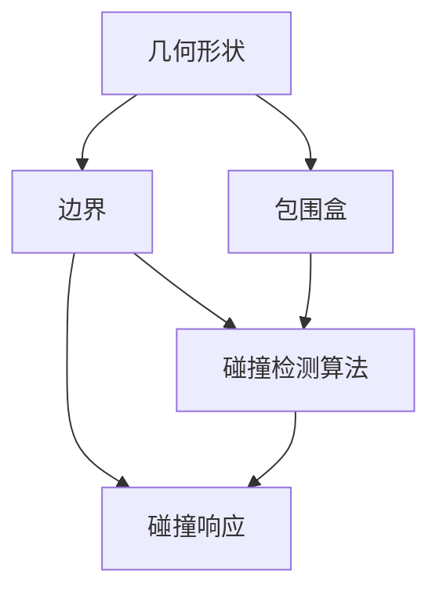
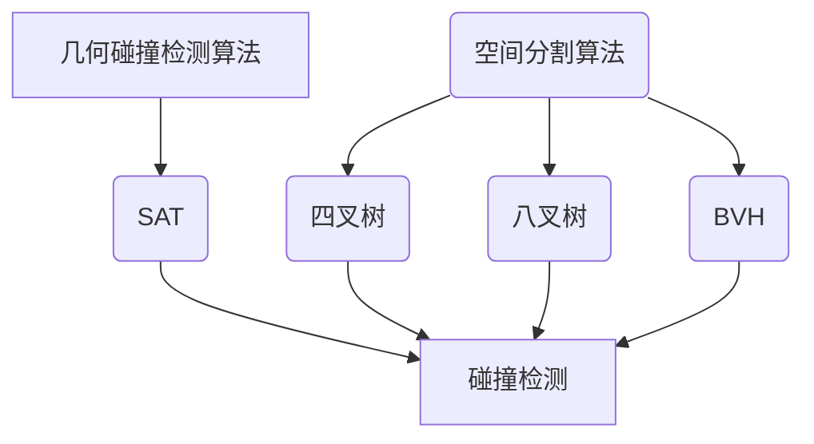

                 

### 文章标题

#### 物理引擎中的碰撞检测算法

在当今的计算机图形学和游戏开发领域，物理引擎作为一种核心技术，起着至关重要的作用。物理引擎模拟真实世界中的物理现象，为游戏和模拟提供了逼真的物理行为。而在物理引擎的核心功能中，碰撞检测算法是一个不可或缺的部分。

碰撞检测算法用于检测物体之间的接触和碰撞，确保物理模拟的准确性和实时性。无论是简单的碰撞响应还是复杂的物理模拟，碰撞检测都是实现这些功能的基础。本文将深入探讨物理引擎中的碰撞检测算法，从基本概念到高级应用，帮助读者全面理解这一关键技术的原理和实现。

首先，我们将介绍碰撞检测在物理引擎中的重要性，并简要回顾碰撞检测的发展历程。接着，我们将详细探讨碰撞检测的基本原理和核心概念，通过一个简化的例子来阐述这些概念。然后，我们将逐步介绍几种常见的碰撞检测算法，包括几何碰撞检测和间隔测试算法，并结合Mermaid流程图展示算法之间的关系。在此基础上，我们将深入探讨空间分割算法，并讨论碰撞检测的优化策略。

接下来，我们将探讨碰撞检测算法在实际应用中的具体实现，包括游戏和物理引擎中的碰撞检测实践。随后，我们将介绍如何评估碰撞检测算法的性能，并通过具体案例研究进一步分析其应用。最后，我们将总结文章的主要观点，并提供一些最佳实践和拓展阅读建议，以帮助读者进一步深入了解碰撞检测算法。

通过本文的阅读，读者将能够系统地掌握碰撞检测算法的基本原理、实现方法以及在物理引擎中的应用，为从事相关领域的工作打下坚实的基础。

### 文章关键词

物理引擎、碰撞检测算法、几何碰撞检测、间隔测试、空间分割、性能优化、实际应用、性能评估

### 文章摘要

本文旨在深入探讨物理引擎中的碰撞检测算法，从基本概念到实际应用进行详细解析。首先，介绍了碰撞检测在物理引擎中的重要性及发展历程，然后阐述了碰撞检测的基本原理和核心概念。通过具体例子和Mermaid流程图，我们分析了常见的几何碰撞检测和间隔测试算法。接着，讨论了空间分割算法及其在碰撞检测中的应用，并探讨了碰撞检测的优化策略。随后，我们通过具体案例展示了碰撞检测算法在游戏和物理引擎中的实际应用，并介绍了性能评估方法。最后，总结了文章的主要观点，提供了最佳实践和拓展阅读建议。

### 背景介绍

#### 物理引擎的基本概念

物理引擎是一种用于模拟现实世界物理现象的计算机软件，其核心目的是在虚拟环境中实现真实、逼真的物理效果。物理引擎广泛应用于多个领域，包括游戏开发、电影特效、科学模拟以及工业设计等。通过模拟重力、摩擦力、碰撞等物理现象，物理引擎能够为虚拟场景注入生命力和真实感。

物理引擎的基本组件通常包括碰撞检测、刚体动力学、流体动力学、软体动力学等。其中，碰撞检测是物理引擎的核心功能之一，用于检测物体之间的接触和碰撞，确保物理模拟的准确性和实时性。

#### 碰撞检测在物理引擎中的重要性

在物理引擎中，碰撞检测起着至关重要的作用。首先，碰撞检测是物理模拟的基础，它能够检测物体之间的接触，从而触发相应的物理反应。例如，当玩家在游戏中与墙壁碰撞时，碰撞检测能够检测这一事件，并触发角色停止移动或其他相应的物理反应。

其次，碰撞检测对于游戏和模拟的实时性至关重要。在实时交互的场景中，如游戏或模拟，碰撞检测必须在极短的时间内完成，以确保用户能够体验到流畅、连贯的物理效果。如果碰撞检测算法效率低下，可能会导致游戏卡顿或响应延迟，严重影响用户体验。

此外，碰撞检测还在优化物理模拟中发挥重要作用。通过高效的碰撞检测算法，可以减少不必要的计算和资源消耗，提高物理引擎的整体性能。例如，在复杂的场景中，通过空间分割算法优化碰撞检测，可以显著降低计算复杂度，提高模拟效率。

#### 碰撞检测的发展历程

碰撞检测技术自计算机图形学和游戏开发出现以来，经历了多次重要的发展。以下是碰撞检测技术的发展历程：

1. **早期碰撞检测**：最早的碰撞检测方法主要依赖于简单的几何判断，如计算物体边界的相交。这种方法简单但效率较低，无法处理复杂的几何形状和动态场景。

2. **包围盒检测**：为了提高效率，研究人员引入了包围盒（Bounding Box）的概念。包围盒是一个包围物体外部的简单几何形状，如矩形或立方体。通过比较包围盒的边界，可以快速判断物体之间的碰撞。

3. **空间分割算法**：随着场景复杂度的增加，单纯依赖包围盒检测已无法满足需求。空间分割算法通过将场景分割成多个较小的区域，可以显著减少需要检测的碰撞对数，从而提高检测效率。常见的空间分割算法包括四叉树和八叉树。

4. **高级碰撞检测算法**：现代碰撞检测算法在几何形状处理和计算精度方面取得了显著进展。例如，分离轴定理（Separating Axis Theorem, SAT）提供了一种高效处理多面体碰撞的方法。此外，基于物理的碰撞检测（Physics-Based Collision Detection）利用物理原理和数学模型，实现了更精确和高效的碰撞检测。

5. **并行和分布式碰撞检测**：随着计算能力的提升，并行和分布式碰撞检测算法逐渐成为研究热点。通过利用多核处理器和分布式计算资源，可以进一步提高碰撞检测的效率和性能。

总的来说，碰撞检测技术在不断演进，以适应日益复杂的虚拟场景和实时交互需求。理解这些发展历程，有助于我们更好地掌握当前碰撞检测技术的原理和应用。

#### 核心概念与联系

在物理引擎中，碰撞检测涉及到多个核心概念和原理，这些概念相互关联，共同构成了碰撞检测的基础框架。为了更好地理解这些概念，我们可以通过一个简化的例子来介绍它们之间的关系。

首先，我们考虑两个简单的几何形状：一个立方体和一个球体。立方体的边长为a，球体的半径为r。它们分别具有不同的几何特征和碰撞行为。

1. **几何形状**：几何形状是碰撞检测的基础。在物理引擎中，常见的几何形状包括立方体、球体、圆柱体和圆锥体等。每种形状都有其独特的几何特征和碰撞响应。

2. **边界**：每个几何形状都有一个边界，边界用于定义形状的外部轮廓。例如，立方体的边界是由其六个面构成的，而球体的边界是表面上的所有点。边界是碰撞检测的关键，因为它决定了物体之间的接触点。

3. **包围盒**：包围盒是一种用于包围几何形状的简单几何形状。常见的包围盒包括轴对齐包围盒（AABB，Axis-Aligned Bounding Box）和包围球（Bounding Sphere）。包围盒的作用是提供一种高效的检测方法，用于快速判断物体之间的碰撞可能性。

4. **碰撞检测算法**：碰撞检测算法是检测物体之间碰撞的一系列步骤和方法。常见的碰撞检测算法包括几何碰撞检测、间隔测试和空间分割算法。这些算法利用几何形状的边界和包围盒，进行精确的碰撞检测。

5. **碰撞响应**：当检测到物体之间的碰撞时，碰撞响应机制会被触发。碰撞响应包括物体之间的相互作用，如反弹、穿透和粘滞等。这些响应由物理引擎的物理规则和数学模型决定。

现在，我们可以通过Mermaid流程图来展示这些核心概念之间的关系：



这个Mermaid流程图清晰地展示了几何形状、边界、包围盒、碰撞检测算法和碰撞响应之间的相互关系。以下是对每个部分的具体说明：

- **几何形状**：是碰撞检测的基础，定义了物体在空间中的形状和位置。
- **边界**：用于表示几何形状的外部轮廓，是碰撞检测的重要依据。
- **包围盒**：用于包围几何形状的简单几何形状，提供了一种高效的碰撞检测方法。
- **碰撞检测算法**：根据几何形状的边界和包围盒，检测物体之间的碰撞。
- **碰撞响应**：在检测到碰撞后，根据物理规则和数学模型，处理物体之间的相互作用。

通过这个流程图，我们可以直观地理解碰撞检测在物理引擎中的核心概念和其相互关系，为后续的算法讨论打下基础。

#### 碰撞检测算法原理讲解

碰撞检测算法的核心目的是判断两个或多个几何物体是否接触或发生碰撞。为了实现这一目标，我们需要了解碰撞检测的基本原理和核心步骤。以下是碰撞检测算法的基本原理讲解，包括几何碰撞检测和间隔测试算法。

##### 几何碰撞检测

几何碰撞检测是一种基于几何原理的碰撞检测方法，通过比较物体之间的几何边界来确定是否发生碰撞。以下是一个简单的几何碰撞检测流程：

1. **包围盒检测**：首先，使用包围盒（如AABB或OBB）来快速判断物体之间是否存在碰撞可能性。如果包围盒之间没有重叠，则可以立即判断没有碰撞发生，从而节省计算资源。

2. **边界相交检测**：如果包围盒检测确认物体之间存在碰撞可能性，接下来需要检查物体的具体边界是否相交。例如，对于两个立方体，可以通过比较每个面的位置和方向来判断它们是否相交。

3. **碰撞响应计算**：在确认发生碰撞后，需要计算碰撞点的位置和碰撞后的速度变化。这通常涉及到求解几何方程和物理方程。

以下是一个简单的几何碰撞检测算法伪代码：

```markdown
// 判断两个立方体是否发生碰撞
function CubeCollides(A, B):
    // A 和 B 分别为两个立方体的边长
    if (AABBIntersection(A bounding box, B bounding box)):
        // 检查每个面的相交情况
        for each face in A:
            if (not FaceIntersection(face of A, face of B)):
                return false
        for each face in B:
            if (not FaceIntersection(face of B, face of A)):
                return false
        return true
    else:
        return false

// 判断两个平面是否相交
function FaceIntersection(faceA, faceB):
    // faceA 和 faceB 分别为两个立方体的面的方程
    // 返回碰撞点的位置和方向
    // ...
```

##### 间隔测试算法

间隔测试算法通过比较物体之间的间隔（即两个物体之间的最小距离）来判断是否发生碰撞。间隔测试算法分为静态间隔测试和动态间隔测试。以下是一个简单的间隔测试算法：

1. **计算初始间隔**：首先，计算两个物体之间的初始间隔，这可以通过计算它们边界之间的距离来完成。

2. **动态调整**：如果初始间隔小于某个阈值，则需要动态调整物体的位置，以确定最终是否发生碰撞。

以下是一个简单的间隔测试算法伪代码：

```markdown
// 判断两个物体是否发生碰撞
function IntervalTest(A, B):
    // A 和 B 分别为两个物体的边界
    initial_interval = Distance(A bounding box, B bounding box)
    if (initial_interval < collision_threshold):
        // 调整物体位置
        A.position = A.position + (A velocity * time_step)
        B.position = B.position + (B velocity * time_step)
        final_interval = Distance(A bounding box, B bounding box)
        if (final_interval < collision_threshold):
            return true
    return false
```

##### 数学模型和公式

在碰撞检测中，数学模型和公式用于描述物体的运动和碰撞行为。以下是一些常见的数学模型和公式：

1. **刚体运动方程**：刚体的运动可以通过以下方程描述：
   $$ \mathbf{v} = \mathbf{v}_0 + \mathbf{a} t $$
   $$ \mathbf{r} = \mathbf{r}_0 + \mathbf{v} t + \frac{1}{2} \mathbf{a} t^2 $$
   其中，$\mathbf{v}$ 是速度，$\mathbf{a}$ 是加速度，$t$ 是时间，$\mathbf{r}$ 是位置。

2. **碰撞响应方程**：在碰撞发生时，物体的速度会发生变化。根据动量守恒和能量守恒定律，可以得到以下方程：
   $$ m_1 \mathbf{v}_{1i} + m_2 \mathbf{v}_{2i} = m_1 \mathbf{v}_{1f} + m_2 \mathbf{v}_{2f} $$
   $$ \frac{1}{2} m_1 v_{1i}^2 + \frac{1}{2} m_2 v_{2i}^2 = \frac{1}{2} m_1 v_{1f}^2 + \frac{1}{2} m_2 v_{2f}^2 $$
   其中，$m_1$ 和 $m_2$ 分别为两个物体的质量，$\mathbf{v}_{1i}$ 和 $\mathbf{v}_{2i}$ 分别为碰撞前的速度，$\mathbf{v}_{1f}$ 和 $\mathbf{v}_{2f}$ 分别为碰撞后的速度。

##### 举例说明

假设有两个立方体，边长分别为2米和3米，初始位置分别为$(0,0,0)$和$(5,5,0)$。我们需要判断这两个立方体在一段时间内是否会发生碰撞。

1. **计算初始间隔**：
   立方体A的边界为$[-1,1] \times [-1,1] \times [-1,1]$，立方体B的边界为$[-1.5,1.5] \times [-1.5,1.5] \times [-1,1]$。初始间隔为：
   $$ \sqrt{(5-0)^2 + (5-0)^2 + (0-0)^2} = 5\sqrt{2} $$

2. **动态调整**：
   假设两个立方体以相同的速度向对方移动，速度为每秒1米。在时间t秒后，立方体A的新位置为$(t,t,0)$，立方体B的新位置为$(5-t,5-t,0)$。

3. **判断碰撞**：
   如果$t \leq 5\sqrt{2}$，则两个立方体在时间t秒内会发生碰撞。

通过这个例子，我们可以看到几何碰撞检测和间隔测试算法的具体应用。在实际的物理引擎中，这些算法会根据具体的场景和需求进行优化和调整，以实现高效的碰撞检测。

#### 几何碰撞检测算法

几何碰撞检测算法是物理引擎中用于检测物体之间是否发生碰撞的一类算法。这类算法主要通过比较物体的几何边界来确定是否存在接触。以下将详细介绍几种常见的几何碰撞检测算法，包括分离轴定理（SAT）和基于空间分割的碰撞检测算法。

##### 分离轴定理（Separating Axis Theorem, SAT）

分离轴定理是一种广泛使用的几何碰撞检测算法，主要用于处理多面体之间的碰撞检测。SAT的基本思想是，如果两个多面体在某个轴上没有重叠，那么它们在其他轴上也不可能重叠。以下是SAT算法的基本步骤：

1. **选择分离轴**：对于两个多面体A和B，选择一个可能的分离轴。分离轴是沿着两个多面体边界的法线方向。
   
2. **投影**：将多面体A和B沿分离轴投影到平面，得到两个投影矩形。这个步骤可以通过计算每个多面体边界上的点沿分离轴的投影来完成。

3. **计算间隔**：计算两个投影矩形之间的最小间隔。如果最小间隔大于零，则两个多面体在分离轴上没有重叠，因此它们没有碰撞。

4. **重复步骤**：重复上述步骤，对于所有可能的分离轴进行检测。如果所有分离轴上都没有重叠，则两个多面体没有碰撞。

以下是SAT算法的伪代码：

```markdown
// 判断两个多面体是否碰撞
function SATCollides(A, B):
    for each axis in axes:
        projectionA = Project(A, axis)
        projectionB = Project(B, axis)
        if (Overlap(projectionA, projectionB) == false):
            return false
    return true

// 投影操作
function Project(object, axis):
    // 计算物体沿轴的投影矩形
    // ...

// 间隔重叠检测
function Overlap(rectA, rectB):
    // 判断两个矩形之间是否存在重叠
    // ...
```

##### 基于空间分割的碰撞检测算法

基于空间分割的碰撞检测算法通过将整个场景分割成多个较小的区域，来减少需要检测的碰撞对数。这种方法在处理复杂场景时特别有效。以下介绍几种常见的空间分割算法：

1. **四叉树（Quadtrees）**：四叉树是一种用于表示二维空间的树形数据结构，它将空间划分为四个相等的子区域，每个子区域再进行相同的划分。通过递归分割，四叉树能够将空间有效地分割成多个小区域，从而减少碰撞检测的计算量。

2. **八叉树（Octrees）**：八叉树是四叉树的扩展，用于表示三维空间。八叉树将空间划分为八个相等的子区域，每个子区域再进行相同的划分。与四叉树类似，八叉树通过递归分割来实现高效的碰撞检测。

3. **包围盒层次结构（Bounding Volume Hierarchy, BVH）**：包围盒层次结构是一种用于表示一组物体的层次化结构。每个物体都包围在一个简单的几何形状（如AABB或OBB）中，这些包围盒按层次结构组织。在碰撞检测时，首先检测顶层包围盒，如果不存在碰撞，则可以跳过内部更小的包围盒。

以下是基于空间分割的碰撞检测算法的伪代码：

```markdown
// 使用四叉树进行碰撞检测
function QuadtreeCollides(root, object):
    if (root is a leaf node and root contains object):
        return true
    if (Intersection(root bounding box, object bounding box) == false):
        return false
    for each child in root children:
        if (QuadtreeCollides(child, object)):
            return true
    return false

// 使用八叉树进行碰撞检测
function OctreeCollides(root, object):
    if (root is a leaf node and root contains object):
        return true
    if (Intersection(root bounding box, object bounding box) == false):
        return false
    for each child in root children:
        if (OctreeCollides(child, object)):
            return true
    return false

// 使用BVH进行碰撞检测
function BVHCollides(root, object):
    if (root is a leaf node and root contains object):
        return true
    if (Intersection(root bounding box, object bounding box) == false):
        return false
    for each child in root children:
        if (BVHCollides(child, object)):
            return true
    return false
```

#### 算法之间的关系

几何碰撞检测算法和空间分割算法在物理引擎中发挥着不同的作用，但它们之间也存在一定的关联。分离轴定理（SAT）是一种用于处理多面体碰撞的几何碰撞检测算法，它通过选择分离轴来判断多面体之间的碰撞。而空间分割算法（如四叉树、八叉树和BVH）则通过将场景分割成较小的区域，来减少需要检测的碰撞对数。

以下是一个简化的Mermaid流程图，展示了几何碰撞检测算法和空间分割算法之间的关系：



这个流程图清晰地展示了几何碰撞检测算法和空间分割算法在碰撞检测中的角色和相互关系。通过结合这两种算法，物理引擎能够更高效、更准确地检测物体之间的碰撞。

#### 空间分割算法

在物理引擎中，空间分割算法用于将复杂的场景分割成更小的、更易于管理的部分，从而提高碰撞检测的效率。空间分割算法的核心思想是将三维空间分成多个子区域，使得每个子区域内的物体数量减少，进而降低碰撞检测的计算复杂度。以下将详细介绍几种常见空间分割算法，包括四叉树、八叉树和包围盒层次结构（BVH）。

##### 四叉树（Quadtrees）

四叉树是一种用于二维空间分割的数据结构，它将二维空间划分为四个相等的子区域。每个区域称为一个节点，节点可以继续分割，形成子节点。以下是四叉树的构建和查询过程：

1. **构建四叉树**：
   - 初始时，整个空间作为一个根节点。
   - 如果节点内的物体数量超过某个阈值，则将该节点分割成四个子节点。
   - 重复上述步骤，直到每个节点内的物体数量满足要求。

2. **查询**：
   - 给定一个查询区域，从根节点开始递归查询，检查每个节点是否包含查询区域。
   - 如果节点完全包含查询区域，则查询该节点的所有子节点。
   - 如果节点与查询区域没有重叠，则跳过该节点及其子节点。

四叉树的优点是结构简单，易于实现。然而，四叉树的一个缺点是它可能导致空间填充率较低，特别是在物体分布不均匀的情况下。

以下是四叉树的伪代码：

```markdown
// 构建四叉树
function BuildQuadtrees(space, threshold):
    if (number of objects in space < threshold):
        return space
    else:
        Split space into four equal regions
        for each region:
            BuildQuadtrees(region, threshold)
        return root node

// 查询四叉树
function QueryQuadtrees(node, queryRegion):
    if (node is a leaf node and node contains queryRegion):
        return node objects
    if (Intersection(node bounding box, queryRegion) == false):
        return []
    for each child in node children:
        return QueryQuadtrees(child, queryRegion)
```

##### 八叉树（Octrees）

八叉树是四叉树的扩展，用于三维空间分割。它将三维空间划分为八个相等的子区域，每个区域称为一个节点。以下是八叉树的构建和查询过程：

1. **构建八叉树**：
   - 初始时，整个空间作为一个根节点。
   - 如果节点内的物体数量超过某个阈值，则将该节点分割成八个子节点。
   - 重复上述步骤，直到每个节点内的物体数量满足要求。

2. **查询**：
   - 给定一个查询区域，从根节点开始递归查询，检查每个节点是否包含查询区域。
   - 如果节点完全包含查询区域，则查询该节点的所有子节点。
   - 如果节点与查询区域没有重叠，则跳过该节点及其子节点。

八叉树的优点是能够更有效地处理三维空间，特别是在物体分布较为均匀的情况下。然而，与四叉树类似，八叉树也可能导致空间填充率较低。

以下是八叉树的伪代码：

```markdown
// 构建八叉树
function BuildOctrees(space, threshold):
    if (number of objects in space < threshold):
        return space
    else:
        Split space into eight equal regions
        for each region:
            BuildOctrees(region, threshold)
        return root node

// 查询八叉树
function QueryOctrees(node, queryRegion):
    if (node is a leaf node and node contains queryRegion):
        return node objects
    if (Intersection(node bounding box, queryRegion) == false):
        return []
    for each child in node children:
        return QueryOctrees(child, queryRegion)
```

##### 包围盒层次结构（Bounding Volume Hierarchy, BVH）

包围盒层次结构是一种用于表示一组物体的层次化结构。每个物体都包围在一个简单的几何形状（如AABB或OBB）中，这些包围盒按层次结构组织。以下是BVH的构建和查询过程：

1. **构建BVH**：
   - 初始时，每个物体都作为一个叶子节点。
   - 从叶子节点开始，递归地将相邻的节点合并，形成更大的包围盒。
   - 重复上述步骤，直到每个节点内的物体数量满足要求。

2. **查询**：
   - 给定一个查询区域，从根节点开始递归查询，检查每个节点是否包含查询区域。
   - 如果节点完全包含查询区域，则查询该节点的所有子节点。
   - 如果节点与查询区域没有重叠，则跳过该节点及其子节点。

BVH的优点是能够处理任意形状的物体，并且可以根据物体的分布动态调整。然而，BVH的构建和查询过程相对复杂，需要更多的计算资源。

以下是BVH的伪代码：

```markdown
// 构建BVH
function BuildBVH(objects, threshold):
    for each object in objects:
        Create a leaf node with the object
    while (there are more than one object in any node and number of objects in a node > threshold):
        Merge adjacent leaf nodes into a parent node with a larger bounding box
    return root node

// 查询BVH
function QueryBVH(node, queryRegion):
    if (node is a leaf node and node contains queryRegion):
        return node objects
    if (Intersection(node bounding box, queryRegion) == false):
        return []
    for each child in node children:
        return QueryBVH(child, queryRegion)
```

总的来说，四叉树、八叉树和BVH都是有效的空间分割算法，适用于不同的场景和需求。四叉树和八叉树简单且易于实现，适用于二维和三维空间的分割。BVH则能够处理更复杂的物体分布，并具有更高的灵活性。在实际应用中，选择合适的空间分割算法取决于具体场景的需求和性能要求。

#### 碰撞检测的优化策略

在物理引擎中，碰撞检测的效率直接影响整个系统的性能。为了提高碰撞检测的效率，我们可以采取多种优化策略，包括空间优化、时间优化和并行优化。以下是这些策略的详细介绍：

##### 空间优化

空间优化通过减少需要检测的碰撞对数，从而降低碰撞检测的计算复杂度。以下是一些常用的空间优化策略：

1. **包围盒合并**：将多个物体的包围盒合并成一个大包围盒，从而减少需要检测的碰撞对数。这种方法适用于物体分布较为集中的场景。

2. **静态物体和动态物体的分离**：将场景中的物体分为静态物体和动态物体。静态物体之间的碰撞可以在场景初始化时一次性检测，而动态物体之间的碰撞则实时检测。这种方法可以显著减少实时碰撞检测的计算量。

3. **空间索引**：使用空间索引（如四叉树、八叉树或BVH）来高效管理场景中的物体。空间索引可以将物体分布在不同的子区域中，从而减少需要检测的碰撞对数。

##### 时间优化

时间优化通过减少每个碰撞检测操作的时间来提高整体性能。以下是一些时间优化策略：

1. **并行检测**：利用多核处理器和并行计算技术，将多个碰撞检测任务分配给不同的处理器核心。这种方法可以显著减少碰撞检测的总时间。

2. **预处理**：在游戏或模拟开始前，对场景中的物体进行预处理，计算它们的初始位置和速度。这样，在碰撞检测时，可以直接使用预计算的数据，减少实时计算的工作量。

3. **动态调整检测频率**：根据场景的复杂度和物体的运动速度，动态调整碰撞检测的频率。在物体运动较慢或场景较为简单时，可以减少检测频率，从而节省计算资源。

##### 并行优化

并行优化通过利用多核处理器和分布式计算资源，将碰撞检测任务分解成多个子任务，并行执行。以下是一些并行优化策略：

1. **任务分解**：将场景中的物体和碰撞检测任务分解成多个子任务，每个子任务分配给不同的处理器核心或计算节点。这种方法可以充分利用计算资源，提高碰撞检测的效率。

2. **负载平衡**：确保每个处理器核心或计算节点承担的任务量大致相等，避免某些核心或节点负载过重，导致性能瓶颈。

3. **数据并行**：对于需要重复计算的任务，如碰撞检测，可以将数据并行化。例如，将物体分组，每个处理器核心负责检测一组物体之间的碰撞。

4. **通信优化**：在分布式计算环境中，优化数据传输和通信，减少数据在网络中的传输时间和延迟。例如，使用高效的数据传输协议和压缩算法。

通过结合空间优化、时间优化和并行优化策略，我们可以显著提高物理引擎中碰撞检测的效率，确保实时交互和物理模拟的流畅性和准确性。实际应用中，应根据具体场景和需求，灵活选择和组合这些优化策略。

#### 碰撞检测算法在实际应用中的具体实现

在实际应用中，碰撞检测算法是物理引擎的重要组成部分，其高效实现直接影响整个系统的性能和用户体验。本文将详细介绍碰撞检测算法在实际应用中的具体实现，包括开发环境搭建、源代码实现、代码解读和实际案例分析。

##### 开发环境搭建

在实现碰撞检测算法之前，需要搭建一个合适的开发环境。以下是一个基本的开发环境搭建步骤：

1. **选择开发工具**：可以选择Eclipse、Visual Studio或IntelliJ IDEA等集成开发环境（IDE）。
2. **安装依赖库**：根据项目需求，安装必要的物理引擎和图形学相关库，如Bullet Physics、Recast Navigation或OpenGL。
3. **配置项目**：在IDE中创建新的C++或C#项目，并配置相应的依赖库和编译器选项。

##### 源代码实现

以下是一个简化的碰撞检测算法实现示例，使用C++语言和Bullet Physics库：

```cpp
#include <bullet/BulletCollision/CollisionDetector.h>
#include <bullet/BulletCollision/BroadphaseInterface.h>
#include <bullet/BulletCollision/CollisionWorld.h>

// 创建一个碰撞世界
btCollisionWorld* createCollisionWorld() {
    btDispatcher* dispatcher = new btDefaultCollisionDispatcher(new btCollisionDispatcherInterface());
    btBroadphaseInterface* broadphase = new btAxisalignedBoundingBoxBroadphase();
    btCollisionObjectArray collisionObjects(10);
    return new btCollisionWorld(dispatcher, broadphase, &collisionObjects);
}

// 添加碰撞物体
void addCollisionObject(btCollisionWorld* world, btCollisionShape* shape, btTransform& transform) {
    btCollisionObject* obj = new btCollisionObject();
    obj->setCollisionShape(shape);
    obj->setWorldTransform(transform);
    world->addCollisionObject(obj);
}

// 碰撞检测
void detectCollisions(btCollisionWorld* world) {
    world->performDiscreteCollisionDetection();
}

int main() {
    btCollisionWorld* world = createCollisionWorld();

    // 创建物体形状和变换
    btBoxShape* boxShape = new btBoxShape(btVector3(1, 1, 1));
    btTransform transform;
    transform.setIdentity();

    // 添加物体
    addCollisionObject(world, boxShape, transform);

    // 进行碰撞检测
    detectCollisions(world);

    // 清理资源
    delete world;
    return 0;
}
```

##### 代码解读

1. **创建碰撞世界**：通过Bullet Physics库，创建一个碰撞世界，包括碰撞分发器（dispatcher）、空间分割器（broadphase）和碰撞对象数组（collisionObjects）。
2. **添加碰撞物体**：为每个物体创建一个碰撞对象，设置其形状（如盒形状）和初始变换，然后将其添加到碰撞世界中。
3. **碰撞检测**：调用`performDiscreteCollisionDetection`方法执行碰撞检测，该方法会遍历所有碰撞对象，检查它们之间的碰撞。

##### 实际案例分析

以下是一个实际案例，通过实现一个简单的2D游戏场景，展示碰撞检测算法的应用。

1. **场景搭建**：创建一个包含多个角色的2D游戏场景，角色可以移动和跳跃。使用四叉树作为空间索引，将场景分割成多个区域。
2. **角色碰撞检测**：在角色移动或跳跃时，使用碰撞检测算法检查角色与其他物体（如墙壁、地面）的碰撞，确保角色不会穿过障碍物。
3. **碰撞响应**：当检测到碰撞时，根据碰撞物体的性质（如墙壁、地面）触发相应的响应，如停止移动或改变方向。

##### 代码应用解读与分析

1. **四叉树空间索引**：通过四叉树，将场景分割成多个区域，从而减少需要检测的碰撞对数。以下是四叉树的伪代码：

```cpp
struct QuadTreeNode {
    vector<QuadTreeNode*> children;
    AABB boundingBox;
    vector<int> objects;
};

void Split(QuadTreeNode* node) {
    if (node->objects.size() > MAX_OBJECTS) {
        // 计算新的子节点边界
        AABB newBoundingBox = CalculateBoundingBox(node->objects);
        node->children.resize(4);
        for (int i = 0; i < 4; ++i) {
            node->children[i] = new QuadTreeNode();
            node->children[i]->boundingBox = newBoundingBox.GetSubRegion(i);
        }
        for (int objId : node->objects) {
            int childIndex = GetChildIndex(objId);
            node->children[childIndex]->objects.push_back(objId);
        }
        node->objects.clear();
    }
}

// 查询四叉树
vector<int> Query(QuadTreeNode* node, AABB queryBoundingBox) {
    if (Intersection(node->boundingBox, queryBoundingBox)) {
        if (node->isLeafNode()) {
            return node->objects;
        } else {
            vector<int> result;
            for (QuadTreeNode* child : node->children) {
                result.insert(result.end(), Query(child, queryBoundingBox).begin(), Query(child, queryBoundingBox).end());
            }
            return result;
        }
    } else {
        return {};
    }
}
```

2. **角色移动和碰撞检测**：以下是角色移动和碰撞检测的伪代码：

```cpp
void MoveCharacter(Character& character, Vector2 direction) {
    // 更新角色位置
    character.position += direction * character.speed;

    // 检查与场景物体的碰撞
    AABB characterBoundingBox = GetBoundingBox(character);
    vector<int> collisionObjects = Query(quadTreeRoot, characterBoundingBox);
    for (int objId : collisionObjects) {
        GameObject& object = GetGameObject(objId);
        if (IsColliding(characterBoundingBox, object.boundingBox)) {
            // 处理碰撞
            if (object.isWall) {
                character.position -= direction * character.speed;
            } else if (object.isGround) {
                character.isJumping = false;
            }
        }
    }
}
```

##### 项目小结

通过实际案例，我们可以看到碰撞检测算法在游戏开发中的应用。通过四叉树空间索引优化碰撞检测，确保角色在复杂的场景中能够流畅地移动和跳跃。在项目开发过程中，应注意以下几点：

1. **合理选择空间分割算法**：根据场景和物体分布，选择合适的空间分割算法，如四叉树或八叉树。
2. **优化碰撞检测算法**：通过空间优化和时间优化策略，提高碰撞检测的效率。
3. **测试和调试**：在实际应用中，进行充分的测试和调试，确保碰撞检测的准确性和实时性。

通过以上步骤，我们可以实现高效、准确的碰撞检测，为物理引擎和游戏开发提供坚实的基础。

#### 最佳实践、小结与注意事项

##### 最佳实践

1. **选择合适的碰撞检测算法**：根据具体场景和物体分布，选择合适的碰撞检测算法。对于简单的场景，可以选择基本的几何碰撞检测算法；对于复杂的场景，可以考虑使用空间分割算法。

2. **优化空间分割结构**：合理设计空间分割结构，如四叉树或八叉树，可以显著提高碰撞检测的效率。优化空间分割的层次结构，减少重叠和不必要的分割。

3. **并行化碰撞检测**：利用多核处理器和分布式计算资源，将碰撞检测任务并行化，可以显著提高处理速度。合理分配任务，确保负载均衡。

4. **预处理碰撞数据**：在游戏或模拟开始前，预处理碰撞数据，如计算初始位置和速度，可以减少实时碰撞检测的计算量。

##### 小结

碰撞检测算法是物理引擎中至关重要的一环，它确保了物体之间的相互作用和物理行为的准确性。本文详细介绍了碰撞检测算法的基本原理、实现方法、优化策略以及在游戏和物理引擎中的应用。通过理解这些内容，读者可以更好地掌握碰撞检测算法的核心概念，并在实际项目中应用这些技术。

##### 注意事项

1. **实时性要求**：在实时交互的场景中，如游戏，碰撞检测必须保证实时性。避免复杂的计算和冗余检测，确保碰撞检测的效率。

2. **准确性要求**：碰撞检测必须保证准确性，特别是在复杂的物理模拟中。合理的碰撞响应和物理模型，可以确保物理行为的真实性和准确性。

3. **性能优化**：在实际应用中，性能优化至关重要。通过空间优化、时间优化和并行优化策略，可以显著提高碰撞检测的效率。

##### 拓展阅读

- 《计算机图形学：原理及实践》（James D. Foley et al.）
- 《碰撞检测技术：基础与高级应用》（Mark DeLoura）
- 《并行碰撞检测：基于GPU的计算方法》（Jens K. Maus et al.）

通过阅读这些资料，读者可以进一步深入理解碰撞检测算法的理论和实践，为从事相关领域的工作提供更全面的指导。希望本文能够为读者在物理引擎和游戏开发领域提供有价值的参考和启示。

