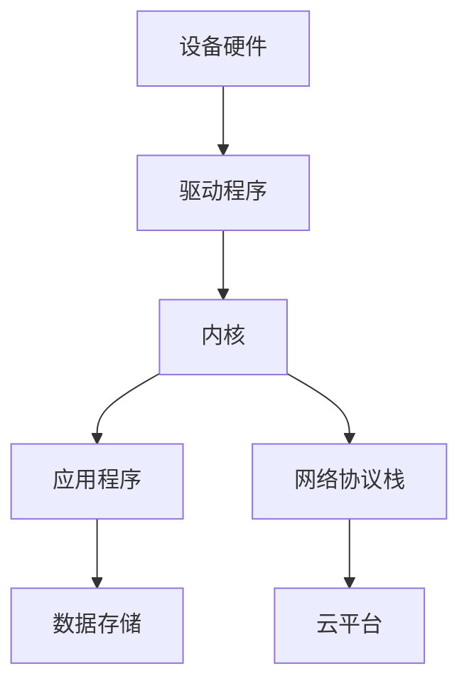

                 

# 物联网操作系统：为资源受限设备设计的OS

## 关键词
- 物联网操作系统
- 资源受限设备
- 核心算法
- 数学模型
- 项目实战

## 摘要
本文旨在深入探讨物联网操作系统（IoT OS）的设计原则和实现方法，重点关注如何为资源受限的设备提供高效、可靠的操作系统环境。通过介绍物联网操作系统的基础知识、核心算法原理、数学模型和实际项目案例，本文将帮助读者全面理解物联网操作系统的设计和开发过程。

## 引言

### 物联网操作系统的重要性

随着物联网技术的快速发展，物联网设备数量呈爆炸式增长，这些设备广泛应用于智能家居、工业自动化、医疗保健等领域。然而，这些设备普遍具有资源受限的特点，如存储容量有限、计算能力较低、功耗要求严格等。传统的通用操作系统在这些设备上难以满足需求，因此，设计一种专门针对资源受限设备的物联网操作系统变得尤为重要。

### 资源受限设备的挑战

资源受限设备面临的挑战主要包括以下几点：

1. **存储容量有限**：设备需要存储大量的数据和应用程序，但存储空间却非常有限。
2. **计算能力较低**：设备需要执行复杂的计算任务，但处理器性能较弱。
3. **功耗要求严格**：设备需要长时间运行，但电池容量有限，功耗控制至关重要。
4. **网络连接不稳定**：设备需要与云平台或其他设备保持稳定连接，但网络环境复杂多变。

为了应对这些挑战，物联网操作系统需要具备高效的资源管理能力、优化的网络通信协议和低功耗的设计理念。

## 核心概念与联系

### 物联网操作系统的定义与特点

物联网操作系统是一种专门为物联网设备设计的软件平台，它负责管理设备的硬件资源、应用程序和网络连接。与通用操作系统相比，物联网操作系统具有以下特点：

1. **轻量级**：物联网操作系统通常设计为轻量级，以减少设备资源占用。
2. **高实时性**：物联网操作系统需要具备高实时性，以确保设备能够快速响应外部事件。
3. **分布式架构**：物联网操作系统通常采用分布式架构，以支持设备之间的通信和协作。
4. **安全性**：物联网操作系统需要具备强大的安全性，以保护设备免受恶意攻击。

### 物联网操作系统与通用操作系统的区别

1. **资源管理**：通用操作系统需要管理广泛的硬件资源，如CPU、内存、存储和网络等。而物联网操作系统主要关注如何高效地管理有限的资源。
2. **网络协议**：通用操作系统通常使用标准的网络协议，如TCP/IP。物联网操作系统则需要设计专门的网络协议，以适应不同的通信需求。
3. **应用场景**：通用操作系统广泛应用于台式机、笔记本电脑等设备，而物联网操作系统则专注于嵌入式设备和智能硬件。

### 物联网操作系统架构的Mermaid流程图



该流程图展示了物联网操作系统的基本架构，包括设备硬件、驱动程序、内核、应用程序、网络协议栈和数据存储等组件。通过Mermaid语言，我们可以直观地理解物联网操作系统的整体架构。

## 核心算法原理讲解

### 调度算法

调度算法是物联网操作系统中的一个关键组件，负责管理设备的任务调度。以下是一个简单的调度算法伪代码：

```pseudo
function schedule_tasks(tasks):
    while tasks are not empty:
        find the task with the highest priority
        execute the task
        update the task status
        if the task is not finished:
            add the task back to the task list
```

该算法基于任务优先级进行调度，确保高优先级的任务优先执行。

### 网络协议

网络协议是物联网操作系统的重要组成部分，负责设备之间的通信。以下是一个简单的网络协议伪代码：

```pseudo
function network_communication(device1, device2):
    while true:
        receive_message = receive_packet(device2)
        if receive_message is valid:
            process_message(receive_message)
            send_packet(device1, response_message)
```

该协议采用轮询方式，实现设备之间的消息传递。

## 数学模型与公式

### 预测模型

预测模型用于预测物联网设备的资源需求。以下是一个简单的预测模型公式：

$$
\text{Resource\_Prediction} = f(\text{Device\_Type}, \text{Network\_Traffic}, \text{Temperature})
$$`

该公式表示资源预测结果与设备类型、网络流量和温度之间的关系。

### 资源管理模型

资源管理模型用于优化物联网设备的资源分配。以下是一个简单的资源管理模型公式：

$$
\text{Resource\_Allocation} = \text{Maximize} \ \frac{\text{Throughput}}{\text{Resource\_Usage}}
$$`

该公式表示在资源限制条件下，最大化设备的吞吐量与资源使用率之比。

## 项目实战

### 开发环境搭建

在开始物联网操作系统的开发之前，我们需要搭建一个合适的开发环境。以下是一个简单的开发环境搭建步骤：

1. 安装交叉编译工具链。
2. 配置开发板硬件。
3. 编写Bootloader代码。
4. 编写内核代码。
5. 编写应用程序代码。

### 源代码详细实现和代码解读

以下是一个简单的物联网操作系统内核代码片段及其解读：

```c
// 内核初始化函数
void kernel_init() {
    // 初始化设备驱动程序
    device_driver_init();

    // 初始化内存管理
    memory_management_init();

    // 初始化任务调度器
    scheduler_init();

    // 初始化网络协议栈
    network_protocol_init();
}

// 设备驱动程序初始化函数
void device_driver_init() {
    // 初始化串口驱动程序
    uart_init();

    // 初始化网络驱动程序
    network_init();
}
```

该代码片段展示了物联网操作系统内核的初始化过程，包括设备驱动程序、内存管理、任务调度器和网络协议栈的初始化。通过详细解读代码，我们可以了解物联网操作系统的工作原理。

### 代码应用解读与分析

以下是一个简单的物联网设备通信示例代码及其解读：

```c
// 发送消息函数
void send_message(const char* message) {
    // 创建网络包
    network_packet packet;
    packet.content = message;
    packet.length = strlen(message);

    // 发送网络包
    network_send_packet(&packet);
}

// 接收消息函数
void receive_message() {
    // 接收网络包
    network_packet packet;
    network_receive_packet(&packet);

    // 处理接收到的消息
    process_message(packet.content);
}
```

该代码片段展示了物联网设备之间的基本通信过程，包括发送消息和接收消息。通过解读和分析代码，我们可以了解物联网设备的通信机制。

### 实际案例分析和详细讲解剖析

以下是一个智能家居场景的物联网操作系统案例：

场景：一个智能家居系统包括一个智能门锁、一个智能灯泡和一个智能空调。用户可以通过手机APP控制这些设备。

分析：物联网操作系统需要实现以下功能：

1. 设备连接与通信：物联网操作系统需要实现设备之间的连接和通信，确保智能门锁、智能灯泡和智能空调能够相互通信。
2. 任务调度：物联网操作系统需要根据用户的请求，调度相应的设备执行任务，如锁定门锁、开启灯泡或调节空调温度。
3. 数据存储与同步：物联网操作系统需要存储设备的状态信息，并在设备之间同步数据，确保设备的操作状态一致。

通过详细讲解和剖析这个案例，我们可以了解物联网操作系统在实际应用中的重要作用。

### 项目小结

本项目通过开发一个简单的物联网操作系统，展示了如何为资源受限的设备提供高效、可靠的操作系统环境。在实际项目中，物联网操作系统需要具备强大的资源管理能力、优化的网络通信协议和低功耗的设计理念。通过本项目的实践，我们深入理解了物联网操作系统的工作原理和实现方法，为未来更复杂的项目奠定了基础。

## 最佳实践 Tips

1. **资源管理**：在设计物联网操作系统时，要充分考虑设备的资源限制，采用高效的资源管理策略，确保设备的正常运行。
2. **网络通信**：优化网络通信协议，提高数据传输效率和可靠性，减少网络延迟和丢包率。
3. **安全性**：加强物联网操作系统的安全性，防止设备遭受恶意攻击和数据泄露。

## 小结

本文深入探讨了物联网操作系统为资源受限设备设计的OS，从核心概念、算法原理、数学模型到实际项目案例，全面阐述了物联网操作系统的工作原理和实现方法。通过本文的学习，读者可以更好地理解物联网操作系统的重要性，为未来的物联网应用开发打下坚实的基础。

## 注意事项

1. **硬件兼容性**：在开发物联网操作系统时，要充分考虑不同硬件平台的兼容性，确保操作系统可以运行在各种设备上。
2. **功耗优化**：在设计和实现物联网操作系统时，要关注功耗优化，降低设备的功耗，延长设备的使用寿命。

## 拓展阅读

1. 《物联网技术基础》
2. 《嵌入式系统设计》
3. 《计算机网络：自顶向下方法》

## 作者

作者：AI天才研究院/AI Genius Institute & 禅与计算机程序设计艺术 /Zen And The Art of Computer Programming

