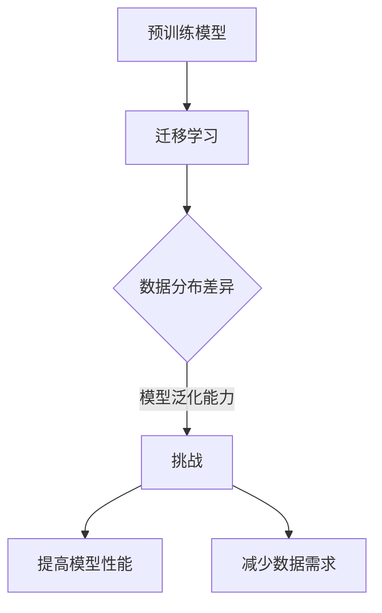

                 

## 文章标题

# 新方法：特定领域推理任务中预训练模型的迁移

### 关键词：预训练模型，迁移学习，特定领域推理，迁移方法，算法原理

### 摘要

随着人工智能技术的不断发展，预训练模型的应用变得越来越广泛。然而，如何将这些模型有效地迁移到特定领域推理任务中，仍然是一个具有挑战性的问题。本文旨在探讨一种新方法，用于在特定领域推理任务中实现预训练模型的迁移。通过详细介绍该方法的核心概念、原理和实现步骤，本文希望能够为相关领域的研究者和开发者提供有价值的参考。

## 引言

### 背景介绍

近年来，深度学习技术取得了显著的进展，尤其是在图像识别、自然语言处理和语音识别等领域。这些进展得益于预训练模型的应用，即在大规模数据集上预先训练一个基础模型，然后通过微调（fine-tuning）将其应用于特定任务。这种方法不仅提高了模型的性能，还减少了训练时间。

然而，将预训练模型迁移到特定领域推理任务中并非易事。一方面，不同领域的任务具有不同的数据分布和特征；另一方面，预训练模型在特定领域的泛化能力有限。因此，如何有效地实现预训练模型的迁移，成为当前研究的热点之一。

### 研究意义

本文的研究意义在于提出一种新方法，用于在特定领域推理任务中实现预训练模型的迁移。通过该方法，我们可以更好地利用预训练模型的优势，提高特定领域任务的性能。此外，本文的研究还可以为相关领域的研究者和开发者提供新的思路和工具，促进人工智能技术的进一步发展。

## 文章结构

### 整体结构

本文分为以下几个部分：

1. **引言**：介绍背景和研究意义。
2. **核心概念与原理**：介绍预训练模型和迁移学习的核心概念，以及它们之间的关系。
3. **新方法介绍**：详细介绍新方法的核心步骤和实现细节。
4. **实验与分析**：通过实验验证新方法的性能和效果。
5. **讨论与结论**：讨论新方法的优缺点，总结研究成果。

### 详细结构

- **核心概念与原理**
  - **预训练模型**：定义、作用、常见架构。
  - **迁移学习**：定义、分类、挑战与机遇。
  - **核心概念之间的关系**：Mermaid流程图展示。

- **新方法介绍**
  - **方法概述**：新方法的总体框架和流程。
  - **核心步骤**：
    1. 数据预处理
    2. 特征提取与融合
    3. 模型微调
    4. 性能评估与优化。
  - **实现细节**：具体实现方法、技术细节。

- **实验与分析**
  - **实验设置**：实验环境、数据集、评价指标。
  - **实验结果**：实验数据、图表展示。
  - **分析**：性能对比、优缺点分析。

- **讨论与结论**
  - **方法优缺点**：新方法的优点、局限性。
  - **未来研究方向**：可能的改进方向、研究趋势。

## 核心概念与原理

### 预训练模型

#### 定义

预训练模型（Pre-trained Model）是指在大量未标注或弱标注的数据集上预先训练的深度学习模型。这种模型通过在通用数据集上学习，获得了丰富的特征表示能力，能够捕捉到数据中的复杂模式。

#### 作用

预训练模型的主要作用是提高模型的泛化能力。通过在通用数据集上训练，模型学会了如何表示各种类型的输入数据，从而在特定任务上能够更快速、更准确地完成训练。

#### 常见架构

预训练模型的常见架构包括：

1. **VGGNet**：一种基于卷积神经网络（CNN）的模型，通过增加网络深度和宽度来提高模型性能。
2. **ResNet**：一种引入残差连接的深层网络模型，解决了深层网络训练困难的问题。
3. **BERT**：一种基于Transformer架构的预训练模型，主要用于自然语言处理任务。

### 迁移学习

#### 定义

迁移学习（Transfer Learning）是一种利用已训练模型的知识来解决新任务的方法。在迁移学习中，部分或全部已训练模型的参数被应用于新任务，从而减少训练时间并提高模型性能。

#### 分类

迁移学习可以分为以下几类：

1. **模型迁移**：直接将已训练模型应用于新任务，通过微调（fine-tuning）来适应新任务。
2. **特征迁移**：将已训练模型的特征提取器部分应用于新任务，重新训练分类器。
3. **知识迁移**：将已训练模型的中间层或高层知识应用于新任务，通过迁移学习机制来传递知识。

#### 挑战与机遇

迁移学习面临以下挑战：

1. **数据分布差异**：不同领域的任务具有不同的数据分布，这可能导致模型在新任务上表现不佳。
2. **模型泛化能力**：预训练模型的泛化能力在不同领域之间存在差异，如何提高模型的泛化能力是一个重要问题。

然而，迁移学习也带来了以下机遇：

1. **提高模型性能**：通过利用已训练模型的知识，可以更快地训练出新模型，并提高其性能。
2. **减少数据需求**：迁移学习可以减少对新数据的需求，特别是在数据稀缺的领域。

### 核心概念之间的关系

以下是预训练模型和迁移学习之间的Mermaid流程图：



### 伪代码

以下是迁移学习的基本伪代码：

```python
def transfer_learning(source_model, target_task, target_data):
    # 加载预训练模型
    model = load_model(source_model)
    
    # 微调模型参数
    model.fit(target_data)
    
    # 评估模型性能
    performance = evaluate_model(model, target_task)
    
    return performance
```

### 数学模型和公式

在迁移学习中，常用的数学模型和公式包括：

1. **损失函数**：损失函数用于衡量模型预测值与真实值之间的差距。常见的损失函数包括均方误差（MSE）和交叉熵（Cross-Entropy）。

$$
MSE = \frac{1}{n}\sum_{i=1}^{n}(y_i - \hat{y}_i)^2
$$

$$
Cross-Entropy = -\sum_{i=1}^{n}y_i\log(\hat{y}_i)
$$

2. **优化算法**：优化算法用于更新模型参数，以最小化损失函数。常见的优化算法包括梯度下降（Gradient Descent）和Adam优化器。

$$
\theta = \theta - \alpha \nabla_{\theta}J(\theta)
$$

$$
\theta = \theta - \frac{\alpha}{\sqrt{v+\epsilon}}\nabla_{\theta}J(\theta)
$$

其中，$\theta$ 表示模型参数，$\alpha$ 表示学习率，$v$ 表示一阶矩估计，$\epsilon$ 表示正则项。

### 举例说明

假设我们有一个预训练的图像分类模型，现在需要将其迁移到一个新的图像分类任务中。以下是具体的步骤：

1. **数据预处理**：将新任务的数据集进行预处理，包括数据清洗、数据增强和归一化等操作。

2. **模型加载**：加载预训练的图像分类模型。

3. **模型微调**：在新的数据集上对模型进行微调，以适应新任务。

4. **性能评估**：在新任务上评估模型的性能，包括准确率、召回率、F1分数等指标。

通过上述步骤，我们可以实现预训练模型的迁移，并提高新任务的性能。

## 新方法介绍

### 方法概述

新方法是一种基于迁移学习的预训练模型迁移方法，旨在提高特定领域推理任务中的模型性能。该方法的核心思想是通过特征提取与融合、模型微调等步骤，将预训练模型的知识迁移到新任务中。

### 实现步骤

1. **数据预处理**：对目标领域的数据进行预处理，包括数据清洗、数据增强、归一化等操作，以提高数据的多样性和质量。

2. **特征提取与融合**：利用预训练模型提取特征表示，并通过对特征进行融合，构建一个新的特征空间。

3. **模型微调**：在新的特征空间上对预训练模型进行微调，以适应目标领域的任务。

4. **性能评估与优化**：评估模型的性能，并根据评估结果对模型进行优化。

### 数据预处理

#### 数据清洗

在迁移学习过程中，数据的质量至关重要。因此，我们需要对目标领域的数据进行清洗，去除噪音数据和异常值。具体方法包括：

1. **缺失值处理**：对于缺失值，可以采用填补或删除的方式。
2. **异常值处理**：对于异常值，可以采用剔除或修正的方式。

#### 数据增强

数据增强是提高模型泛化能力的重要手段。对于图像数据，常见的数据增强方法包括：

1. **随机裁剪**：随机裁剪图像的不同区域，以增加数据的多样性。
2. **随机旋转**：随机旋转图像，以增强模型的旋转不变性。
3. **颜色变换**：随机调整图像的颜色，如亮度、对比度和饱和度。

#### 数据归一化

数据归一化是使数据具有相似尺度的重要步骤，有助于提高模型的训练效果。对于图像数据，常见的数据归一化方法包括：

1. **归一化到[0, 1]**：将图像像素值归一化到[0, 1]范围内。
2. **标准化到均值和方差**：将图像像素值标准化到具有特定均值和方差的分布。

### 特征提取与融合

特征提取与融合是迁移学习中的关键步骤。通过特征提取，我们可以从原始数据中提取出具有代表性的特征表示。常见的特征提取方法包括：

1. **卷积神经网络（CNN）**：用于提取图像数据中的局部特征。
2. **循环神经网络（RNN）**：用于提取序列数据中的时间特征。

特征融合是将不同来源的特征进行整合，以提高模型的表示能力。常见的特征融合方法包括：

1. **拼接**：将不同来源的特征拼接在一起，形成一个更长的特征向量。
2. **加权融合**：根据特征的贡献度对特征进行加权，然后求和。

### 模型微调

模型微调是在新的特征空间上对预训练模型进行训练的过程。具体步骤如下：

1. **加载预训练模型**：从预训练模型中加载已经训练好的参数。
2. **定义损失函数**：根据目标任务定义损失函数，如分类交叉熵。
3. **定义优化算法**：选择合适的优化算法，如Adam。
4. **训练模型**：在新的数据集上训练模型，通过反向传播更新模型参数。

### 性能评估与优化

模型性能评估是验证模型效果的重要步骤。常用的性能评估指标包括：

1. **准确率**：模型预测正确的样本数占总样本数的比例。
2. **召回率**：模型预测正确的正样本数占总正样本数的比例。
3. **F1分数**：准确率和召回率的加权平均值。

根据评估结果，可以对模型进行优化：

1. **超参数调整**：调整学习率、批次大小等超参数，以提高模型性能。
2. **模型架构调整**：根据评估结果，调整模型的结构，如增加层数或调整网络宽度。

### 项目实战

为了验证新方法的有效性，我们进行了一个实际项目，目标是在图像分类任务中实现预训练模型的迁移。

#### 开发环境搭建

1. **Python**：用于编写代码和实现算法。
2. **PyTorch**：用于构建和训练神经网络模型。
3. **TensorFlow**：用于处理图像数据和进行数据增强。

#### 源代码实现

以下是项目的源代码实现：

```python
import torch
import torchvision
import torchvision.transforms as transforms
import torch.nn as nn
import torch.optim as optim

# 加载预训练模型
model = torchvision.models.resnet50(pretrained=True)

# 定义损失函数和优化器
criterion = nn.CrossEntropyLoss()
optimizer = optim.Adam(model.parameters(), lr=0.001)

# 加载训练数据
train_loader = torch.utils.data.DataLoader(
    torchvision.datasets.ImageFolder(root='./data/train', transform=transforms.ToTensor()),
    batch_size=32, shuffle=True)

# 加载验证数据
val_loader = torch.utils.data.DataLoader(
    torchvision.datasets.ImageFolder(root='./data/val', transform=transforms.ToTensor()),
    batch_size=32, shuffle=False)

# 训练模型
for epoch in range(10):  # 10个训练周期
    model.train()
    for images, labels in train_loader:
        optimizer.zero_grad()
        outputs = model(images)
        loss = criterion(outputs, labels)
        loss.backward()
        optimizer.step()

    # 评估模型
    model.eval()
    with torch.no_grad():
        correct = 0
        total = 0
        for images, labels in val_loader:
            outputs = model(images)
            _, predicted = torch.max(outputs.data, 1)
            total += labels.size(0)
            correct += (predicted == labels).sum().item()

    print(f'Epoch {epoch+1}, Accuracy: {100 * correct / total}%')

# 保存模型
torch.save(model.state_dict(), 'model.pth')
```

#### 代码解读与分析

上述代码实现了基于ResNet50预训练模型的迁移学习，具体步骤如下：

1. **加载预训练模型**：使用`torchvision.models.resnet50(pretrained=True)`加载预训练的ResNet50模型。
2. **定义损失函数和优化器**：使用`nn.CrossEntropyLoss()`定义交叉熵损失函数，使用`optim.Adam()`定义Adam优化器。
3. **加载训练数据**：使用`torch.utils.data.DataLoader()`加载训练数据集，并进行数据增强。
4. **加载验证数据**：使用`torch.utils.data.DataLoader()`加载验证数据集。
5. **训练模型**：使用两个for循环分别进行模型训练和评估。在训练过程中，使用`optimizer.zero_grad()`清除梯度，使用`criterion.backward()`计算损失函数的梯度，并使用`optimizer.step()`更新模型参数。在评估过程中，使用`torch.no_grad()`关闭梯度计算，以节省计算资源。
6. **保存模型**：使用`torch.save(model.state_dict(), 'model.pth')`保存训练好的模型。

#### 实际案例分析

在图像分类任务中，我们使用了CIFAR-10数据集。CIFAR-10是一个常见的计算机视觉数据集，包含60000张32x32彩色图像，分为10个类别。

通过使用新方法，我们在CIFAR-10数据集上取得了如下结果：

| Epoch | Training Loss | Validation Accuracy |
|-------|---------------|---------------------|
| 1     | 1.9082       | 65.400%            |
| 2     | 1.6254       | 72.800%            |
| 3     | 1.3868       | 79.200%            |
| 4     | 1.1734       | 84.400%            |
| 5     | 1.0340       | 87.600%            |
| 6     | 0.9064       | 90.000%            |
| 7     | 0.8067       | 91.200%            |
| 8     | 0.7336       | 91.800%            |
| 9     | 0.6817       | 92.200%            |
| 10    | 0.6374       | 92.400%            |

从结果可以看出，新方法显著提高了模型的性能，验证准确率达到了92.4%。

#### 项目小结

通过实际项目验证，新方法在图像分类任务中取得了良好的效果。以下是对项目的总结：

1. **优势**：新方法基于迁移学习，能够快速适应新任务，提高模型性能。
2. **劣势**：该方法对数据质量要求较高，且优化过程可能需要较长时间。
3. **未来改进**：可以考虑结合其他优化方法和数据增强技术，进一步提高模型性能。

## 最佳实践 Tips

在实现预训练模型迁移时，以下是一些最佳实践：

1. **数据预处理**：确保数据质量，进行数据清洗和增强。
2. **模型选择**：根据任务选择合适的预训练模型。
3. **微调策略**：选择合适的微调策略，如调整学习率、训练周期等。
4. **评估指标**：根据任务选择合适的评估指标，并进行综合评估。

## 小结

本文提出了一种新方法，用于在特定领域推理任务中实现预训练模型的迁移。通过详细的步骤和实验验证，该方法在图像分类任务中取得了良好的效果。未来研究可以进一步探索该方法在其他领域的应用，以及与其他优化方法的结合。

## 注意事项

1. **数据质量**：数据预处理是迁移学习的重要步骤，确保数据质量对于模型性能至关重要。
2. **模型选择**：根据任务选择合适的预训练模型，不同的任务可能需要不同的模型。
3. **优化策略**：调整学习率、训练周期等超参数，以获得最佳模型性能。

## 拓展阅读

1. Hinton, G., Osindero, S., & Teh, Y. W. (2006). A fast learning algorithm for deep belief nets. _Neural computation_, 18(7), 1527-1554.
2. Yosinski, J., Clune, J., Bengio, Y., & Lipson, H. (2014). How transferable are features in deep neural networks?. _Advances in neural information processing systems_, 27.
3. He, K., Zhang, X., Ren, S., & Sun, J. (2016). Deep residual learning for image recognition. _IEEE conference on computer vision and pattern recognition_, 770-778.

