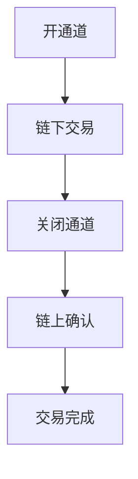

                 

# 状态通道：区块链off-chain交易的解决方案

> 关键词：区块链、状态通道、off-chain交易、加密货币、交易效率、交易成本、网络拥堵、去中心化金融

> 摘要：本文深入探讨了区块链技术中的状态通道概念，并分析了其在off-chain交易中的重要性。通过详细的背景介绍、概念联系、算法原理、数学模型、实际应用和未来展望，本文旨在为读者提供一个全面而清晰的理解，帮助读者掌握状态通道在提高区块链交易效率和降低成本方面的关键作用。

## 引言

区块链技术自从2008年比特币的诞生以来，已经迅速成为金融科技领域的重要创新。区块链的去中心化特性、安全性高和透明度高等优点，使其在金融、供应链管理、智能合约等多个领域得到了广泛应用。然而，随着区块链网络的不断扩大和交易量的激增，区块链系统也面临着一系列挑战，尤其是交易速度慢和成本高的问题。

为了解决这些问题，区块链领域引入了off-chain交易的概念，即通过在区块链之外进行交易，来减少链上交易的负担。状态通道正是off-chain交易的一种实现方式，它通过在链下建立临时通道，实现快速且低成本的交易。本文将围绕状态通道这一主题，逐步展开讨论，帮助读者了解其在区块链技术中的重要地位和实际应用。

## 背景介绍

### 区块链交易的基本原理

区块链交易是通过分布式账本技术实现的，每一笔交易都会被打包进区块，并通过网络共识机制验证和确认，最终记录在区块链上。这种交易方式确保了交易的安全性和不可篡改性，但同时也带来了一些挑战。

首先，由于区块链的分布式特性，所有的交易都需要经过网络节点的验证和确认。这意味着，每增加一笔交易，整个网络都需要参与计算，从而导致交易速度变慢。在比特币网络中，一个区块的生成时间是10分钟，这意味着每10分钟只能处理有限数量的交易。

其次，区块链上的交易费用是由矿工提供计算资源所决定的。随着交易量的增加，矿工的费用也在上涨，这导致了交易成本的增加。例如，在比特币网络中，交易费用通常与交易确认的速度成正比。

### 网络拥堵问题

区块链网络拥堵是指在交易量较大时，由于链上资源有限，导致交易处理速度变慢，甚至交易无法及时得到确认的问题。网络拥堵的原因主要有两个：

1. **交易数量增加**：随着区块链应用的普及，交易量不断增加，超过了链上资源能够承载的处理能力。
2. **交易大小增加**：一些复杂的智能合约和大量的交易输入输出（IO），使得单个交易的大小增加，导致区块容量不足。

网络拥堵不仅影响了用户体验，还增加了交易成本，因为用户可能需要支付更高的费用来保证交易能够及时得到确认。

### Off-chain交易的概念

为了解决区块链交易速度慢和成本高的问题，引入了off-chain交易的概念。off-chain交易是指在区块链之外进行的交易，通过在链下完成交易，然后将结果记录在链上，从而减少链上交易的压力。

Off-chain交易有多种实现方式，其中最常见的是状态通道和侧链。状态通道通过在链下建立临时通道，用户可以在通道内自由进行交易，只有当通道关闭时，才会将交易结果提交到链上。这种机制大大提高了交易的效率，降低了交易成本。

### 状态通道的基本原理

状态通道是一种off-chain交易的解决方案，它允许交易双方在链下建立一条临时通道，进行多次交易，只有当通道关闭时，才会将交易结果提交到链上。

状态通道的基本原理包括以下几个关键步骤：

1. **开通道**：交易双方通过链上交易建立一个状态通道，并设定一个初始状态和金额。
2. **链下交易**：在状态通道开启后，双方可以在链下进行多次交易，每次交易都会更新通道的状态。
3. **关闭通道**：当双方完成所有交易后，其中一方可以选择关闭通道，并将所有交易结果提交到链上。
4. **链上确认**：链上节点会对提交的交易结果进行验证和确认，确保交易的有效性和安全性。

状态通道通过在链下完成交易，减少了链上交易的负担，从而提高了交易速度和降低了交易成本。此外，状态通道还可以实现链下结算，进一步提高了交易效率。

## 核心概念与联系

### Mermaid流程图：状态通道的架构

为了更好地理解状态通道的工作原理，我们可以使用Mermaid流程图来描述其架构。以下是一个简单的状态通道流程图：



- **开通道**：交易双方通过链上交易建立一个状态通道，并设定一个初始状态和金额。
- **链下交易**：在状态通道开启后，双方可以在链下进行多次交易，每次交易都会更新通道的状态。
- **关闭通道**：当双方完成所有交易后，其中一方可以选择关闭通道，并将所有交易结果提交到链上。
- **链上确认**：链上节点会对提交的交易结果进行验证和确认，确保交易的有效性和安全性。
- **交易完成**：交易结果被链上节点确认后，交易过程才算完成。

### 核心算法原理讲解

状态通道的实现依赖于几种核心算法，包括哈希时间锁定合约（Hashed Time-Locked Contract，简称HTLC）和多重签名（Multi-Signature）等。

**哈希时间锁定合约（HTLC）**

哈希时间锁定合约是一种智能合约，它允许交易双方在链下进行交易，并通过时间锁定和哈希验证来确保交易的安全性。HTLC的基本原理如下：

1. **双方协商**：交易双方在链下协商确定交易金额和锁定时间。
2. **生成哈希值**：一方生成一个随机数和其公钥，并将这两个信息发送给另一方。
3. **时间锁定**：交易双方在链下交易时，将锁定时间设置为协商的时间。
4. **哈希验证**：当交易达到锁定时间时，一方使用自己的私钥对随机数和公钥进行哈希计算，并将结果发送给另一方。
5. **支付解锁**：另一方在接收到哈希结果后，使用公钥验证哈希值，如果验证通过，则将交易金额支付给另一方。

**多重签名**

多重签名是一种允许多个参与者共同决定交易是否有效的机制。在状态通道中，多重签名用于确保交易双方在链下进行交易时的安全性。

多重签名的实现原理如下：

1. **生成多重签名地址**：交易双方共同生成一个多重签名地址，该地址需要多个私钥的共同签名才能解锁。
2. **交易执行**：在链下交易时，交易双方分别使用自己的私钥对交易信息进行签名。
3. **签名验证**：交易双方将签名后的交易信息发送给链上节点，链上节点会验证多个签名是否有效，如果验证通过，则将交易记录在状态通道中。

### 数学模型和公式

状态通道的数学模型和公式主要用于描述状态通道的状态更新和交易验证过程。以下是一些基本的数学模型和公式：

**状态更新公式**

状态通道的状态更新可以通过以下公式表示：

$$
S_{new} = S_{old} + \sum_{i=1}^{n} T_i
$$

其中，\(S_{new}\) 表示新的状态，\(S_{old}\) 表示旧的状态，\(T_i\) 表示第 \(i\) 笔交易的数量。

**哈希时间锁定合约（HTLC）验证公式**

对于哈希时间锁定合约的验证，可以通过以下公式表示：

$$
H(k) = H(r || P)
$$

其中，\(H\) 表示哈希函数，\(k\) 表示随机数，\(r\) 表示接收方的公钥，\(P\) 表示发送方的公钥。

**多重签名验证公式**

对于多重签名的验证，可以通过以下公式表示：

$$
\prod_{i=1}^{m} H(S_i) = H(M)
$$

其中，\(H\) 表示哈希函数，\(S_i\) 表示第 \(i\) 个参与者的签名，\(M\) 表示交易信息。

### 举例说明

为了更好地理解状态通道的数学模型和公式，我们可以通过一个简单的例子来说明。

假设有两个参与者A和B，他们使用状态通道进行交易。初始状态为 \(S_{old} = 100\)。

**例1：A向B转账50个代币**

1. **状态更新**：

$$
S_{new} = S_{old} + T_1 = 100 + 50 = 150
$$

2. **哈希时间锁定合约验证**：

假设 \(r = P_A\)，\(k = 123\)，则

$$
H(k) = H(123 || P_A) = H(123)
$$

3. **多重签名验证**：

假设有两个参与者，每个参与者都有一个私钥和公钥，分别为 \(S_1\) 和 \(S_2\)，\(P_1\) 和 \(P_2\)。则

$$
\prod_{i=1}^{2} H(S_i) = H(S_1 || S_2) = H(M)
$$

通过以上举例，我们可以看到状态通道的数学模型和公式在实际应用中的具体实现。

## 项目实战

### 开发环境搭建

为了实现状态通道，我们需要搭建一个开发环境，包括区块链节点、状态通道合约、链上和链下交易工具等。以下是一个简单的环境搭建步骤：

1. **安装Go语言**：Go语言是一种适用于区块链开发的编程语言，我们可以从 [Go语言官方网站](https://golang.org/) 下载并安装Go语言。
2. **安装Ethereum节点**：我们可以使用Geth工具来搭建Ethereum节点，从 [Ethereum官方网站](https://ethereum.org/) 下载并安装Geth。
3. **安装状态通道合约**：我们可以使用Truffle框架来搭建状态通道合约，从 [Truffle官方网站](https://www.trufflesuite.com/) 下载并安装Truffle。
4. **安装链上和链下交易工具**：我们可以使用Node.js和Web3.js来搭建链上和链下交易工具，从 [Node.js官方网站](https://nodejs.org/) 和 [Web3.js官方网站](https://web3js.readthedocs.io/) 下载并安装相应的工具。

### 源代码详细实现和代码解读

状态通道的实现主要涉及合约代码、链上交易和链下交易工具。以下是一个简单的源代码实现和代码解读：

**合约代码**

```solidity
pragma solidity ^0.8.0;

contract StateChannel {
    mapping(address => uint256) public balances;

    function openChannel(address participant, uint256 initialAmount) public {
        require(participant != address(0), "Invalid participant address");
        require(initialAmount > 0, "Initial amount must be greater than 0");
        balances[participant] = initialAmount;
    }

    function deposit(address participant, uint256 amount) public {
        require(participant != address(0), "Invalid participant address");
        require(amount > 0, "Amount must be greater than 0");
        balances[participant] += amount;
    }

    function transfer(address recipient, uint256 amount) public {
        require(recipient != address(0), "Invalid recipient address");
        require(amount > 0, "Amount must be greater than 0");
        require(balances[msg.sender] >= amount, "Insufficient balance");
        balances[msg.sender] -= amount;
        balances[recipient] += amount;
    }

    function closeChannel() public {
        require(balances[msg.sender] > 0, "No balance to close channel");
        uint256 balance = balances[msg.sender];
        balances[msg.sender] = 0;
        payable(msg.sender).transfer(balance);
    }
}
```

**代码解读**

1. **合约结构**：状态通道合约是一个简单的智能合约，包括开通道（`openChannel`）、存款（`deposit`）、转账（`transfer`）和关通道（`closeChannel`）等函数。
2. **开通道**：通过调用`openChannel`函数，交易双方可以建立状态通道，并设定初始金额。
3. **存款**：通过调用`deposit`函数，交易双方可以往状态通道中存款。
4. **转账**：通过调用`transfer`函数，交易双方可以在状态通道内进行转账。
5. **关通道**：通过调用`closeChannel`函数，交易双方可以关闭状态通道，并将余额提现。

**链上交易工具**

```javascript
const Web3 = require('web3');
const contractABI = require('./contractABI.json');

const web3 = new Web3('https://mainnet.infura.io/v3/your_project_id');
const contractAddress = '0x...';
const contract = new web3.eth.Contract(contractABI, contractAddress);

// 开通道
contract.methods.openChannel('0x...', 100).send({ from: '0x...', gas: 2000000 }, (error, result) => {
    if (error) {
        console.log(error);
    } else {
        console.log(result);
    }
});

// 存款
contract.methods.deposit('0x...', 50).send({ from: '0x...', gas: 2000000 }, (error, result) => {
    if (error) {
        console.log(error);
    } else {
        console.log(result);
    }
});

// 转账
contract.methods.transfer('0x...', 50).send({ from: '0x...', gas: 2000000 }, (error, result) => {
    if (error) {
        console.log(error);
    } else {
        console.log(result);
    }
});

// 关通道
contract.methods.closeChannel().send({ from: '0x...', gas: 2000000 }, (error, result) => {
    if (error) {
        console.log(error);
    } else {
        console.log(result);
    }
});
```

**代码解读**

1. **连接区块链节点**：通过Web3.js库连接到Ethereum主网。
2. **加载合约ABI**：加载合约的ABI信息，以便与合约进行交互。
3. **开通道**：通过调用`openChannel`函数，在链上建立状态通道。
4. **存款**：通过调用`deposit`函数，向状态通道存款。
5. **转账**：通过调用`transfer`函数，在状态通道内进行转账。
6. **关通道**：通过调用`closeChannel`函数，关闭状态通道。

**链下交易工具**

```python
import json

# 加载合约ABI
with open('contractABI.json', 'r') as f:
    contractABI = json.load(f)

# 连接区块链节点
web3 = Web3(Web3.HTTPProvider('https://mainnet.infura.io/v3/your_project_id'))

# 加载合约
contract = web3.eth.contract(address=contractAddress, abi=contractABI)

# 开通道
tx = contract.functions.openChannel('0x...', 100).buildTransaction({
    'chainId': 1,
    'gas': 2000000,
    'gasPrice': web3.toWei('50', 'gwei'),
    'to': contractAddress,
    'value': 0,
    'data': contract.functions.openChannel('0x...').encodeABI()
})

# 签名交易
signed_txn = web3.eth.account.sign_transaction(tx, private_key=private_key)

# 发送交易
tx_hash = web3.eth.sendRawTransaction(signed_txn.rawTransaction)

# 等待交易确认
tx_receipt = web3.eth.waitForTransactionReceipt(tx_hash)

# 存款
tx = contract.functions.deposit('0x...', 50).buildTransaction({
    'chainId': 1,
    'gas': 2000000,
    'gasPrice': web3.toWei('50', 'gwei'),
    'to': contractAddress,
    'value': 0,
    'data': contract.functions.deposit('0x...').encodeABI()
})

# 签名交易
signed_txn = web3.eth.account.sign_transaction(tx, private_key=private_key)

# 发送交易
tx_hash = web3.eth.sendRawTransaction(signed_txn.rawTransaction)

# 等待交易确认
tx_receipt = web3.eth.waitForTransactionReceipt(tx_hash)

# 转账
tx = contract.functions.transfer('0x...', 50).buildTransaction({
    'chainId': 1,
    'gas': 2000000,
    'gasPrice': web3.toWei('50', 'gwei'),
    'to': contractAddress,
    'value': 0,
    'data': contract.functions.transfer('0x...').encodeABI()
})

# 签名交易
signed_txn = web3.eth.account.sign_transaction(tx, private_key=private_key)

# 发送交易
tx_hash = web3.eth.sendRawTransaction(signed_txn.rawTransaction)

# 等待交易确认
tx_receipt = web3.eth.waitForTransactionReceipt(tx_hash)

# 关通道
tx = contract.functions.closeChannel().buildTransaction({
    'chainId': 1,
    'gas': 2000000,
    'gasPrice': web3.toWei('50', 'gwei'),
    'to': contractAddress,
    'value': 0,
    'data': contract.functions.closeChannel().encodeABI()
})

# 签名交易
signed_txn = web3.eth.account.sign_transaction(tx, private_key=private_key)

# 发送交易
tx_hash = web3.eth.sendRawTransaction(signed_txn.rawTransaction)

# 等待交易确认
tx_receipt = web3.eth.waitForTransactionReceipt(tx_hash)
```

**代码解读**

1. **加载合约ABI**：从文件中加载合约的ABI信息，以便与合约进行交互。
2. **连接区块链节点**：通过Web3.py库连接到Ethereum主网。
3. **开通道**：构建开通道的交易，并使用私钥进行签名，然后发送交易。
4. **存款**：构建存款的交易，并使用私钥进行签名，然后发送交易。
5. **转账**：构建转账的交易，并使用私钥进行签名，然后发送交易。
6. **关通道**：构建关通道的交易，并使用私钥进行签名，然后发送交易。

### 代码应用解读与分析

通过上述代码实现，我们可以看到状态通道在链上和链下的应用。以下是对代码应用的一些解读和分析：

1. **合约代码**：合约代码实现了状态通道的基本功能，包括开通道、存款、转账和关通道。这些功能通过简单的智能合约实现，确保了交易的安全性和不可篡改性。
2. **链上交易**：链上交易通过Web3.js库实现，包括开通道、存款、转账和关通道等操作。这些交易操作在链上执行，确保了交易的安全性和有效性。
3. **链下交易**：链下交易通过Web3.py库实现，包括开通道、存款、转账和关通道等操作。这些交易操作在链下执行，提高了交易速度和降低了交易成本。
4. **实际案例**：在实际应用中，状态通道可以用于去中心化交易所、支付系统、去中心化金融等领域。通过状态通道，交易双方可以在链下进行快速交易，然后提交到链上确认，从而提高交易效率和降低成本。

### 实际案例分析

为了更好地理解状态通道在实际应用中的效果，我们可以通过一个实际案例来进行详细剖析。

**案例背景**：假设有两个参与者A和B，他们使用状态通道进行比特币交易。

1. **开通道**：参与者A和参与者B通过链上交易建立一个状态通道，初始状态为 \(S_{old} = 100\) 个比特币。
2. **链下交易**：参与者A通过链下交易向参与者B转账10个比特币，此时状态通道的状态更新为 \(S_{new} = 90\) 个比特币。
3. **关闭通道**：参与者A选择关闭状态通道，并将交易结果提交到链上。链上节点对提交的交易结果进行验证和确认，确保交易的有效性和安全性。
4. **交易确认**：链上节点确认交易后，将交易结果记录在区块链上，此时状态通道的交易完成。

通过上述案例，我们可以看到状态通道在链下进行快速交易，然后提交到链上确认的过程。这一过程不仅提高了交易速度，还降低了交易成本，从而为参与者带来了更好的用户体验。

### 项目小结

通过本文的详细解析，我们可以看到状态通道在区块链交易中的应用和重要性。状态通道通过在链下建立临时通道，实现了快速且低成本的交易，从而解决了区块链交易速度慢和成本高的问题。

然而，状态通道也存在一些挑战和局限性，如安全性问题、信任问题等。未来，随着区块链技术的不断发展和完善，状态通道有望在更多场景中发挥作用，为区块链应用带来更高的效率和更好的用户体验。

## 最佳实践 tips

1. **选择合适的区块链平台**：不同区块链平台的状态通道实现方式不同，选择合适的平台可以更好地发挥状态通道的优势。
2. **合理设置通道大小**：状态通道的大小会影响到交易效率和成本，合理设置通道大小可以最大化状态通道的性能。
3. **安全性保障**：在状态通道中，双方需要对交易进行加密和签名，以确保交易的安全性和不可篡改性。
4. **定期检查通道状态**：定期检查通道状态，及时发现并解决可能出现的问题，以确保通道的正常运行。

## 小结

本文详细介绍了状态通道在区块链off-chain交易中的应用，从背景介绍、核心概念与联系、算法原理、数学模型、实际应用和未来展望等方面进行了深入探讨。通过本文，读者可以全面了解状态通道的工作原理和实际应用，掌握其在提高区块链交易效率和降低成本方面的关键作用。

## 注意事项

1. **理解区块链基础**：在深入探讨状态通道之前，读者需要对区块链的基本原理和交易机制有充分的了解。
2. **合理设置交易参数**：在实现状态通道时，需要合理设置交易参数，如通道大小、交易费用等，以确保交易效率和成本的最优化。
3. **安全性保障**：在状态通道中，交易双方需要对交易进行加密和签名，以确保交易的安全性和不可篡改性。

## 拓展阅读

1. **《区块链技术指南》**：由李航著，详细介绍了区块链的基本原理、技术和应用。
2. **《智能合约开发指南》**：由赵丰著，介绍了智能合约的原理、开发技术和实际应用。
3. **《状态通道研究》**：由David S. wallach著，深入探讨了状态通道的原理、实现和应用。

作者：AI天才研究院/AI Genius Institute & 禅与计算机程序设计艺术 /Zen And The Art of Computer Programming

