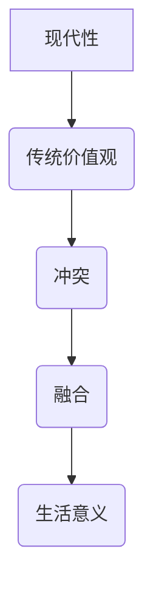

                 

# 《现代性与传统价值观的冲突：寻找新的生活意义》

## 关键词

现代性、传统价值观、冲突、生活意义、个人成长、社会治理

## 摘要

本文探讨了现代性与传统价值观之间的冲突及其对个人成长、社会治理等方面的影响。通过对现代性与传统价值观的概念解析、冲突现象分析，以及融合与寻求新的生活意义的探讨，文章旨在为解决这一冲突提供理论指导和实践路径。

---

## 引言

### 背景介绍

在当今快速发展的时代，现代性已经成为全球社会发展的主流趋势。现代性强调科学、理性、自由和个性，推动了人类社会的进步和繁荣。然而，传统价值观则源于历史和文化的积淀，强调道德、伦理、家庭和社会责任。随着现代性的不断扩展，传统价值观受到了前所未有的冲击和挑战。

### 核心概念与联系

为了更好地理解现代性与传统价值观的冲突，我们需要明确以下核心概念：

1. **现代性**：一种以科学、技术和理性为基础的社会文化现象，强调个人自由、平等和自我实现。
2. **传统价值观**：一种以道德、伦理、家庭和社会责任为核心的社会文化观念，强调集体的利益和个人的责任。

现代性与传统价值观之间的关系可以概括为：冲突与融合。现代性在推动社会进步的同时，也挑战了传统价值观的基础；而传统价值观在现代社会中仍具有不可替代的价值，需要与现代性相互融合，寻找新的生活意义。

### Mermaid 流程图

以下是一个简单的 Mermaid 流程图，展示了现代性与传统价值观之间的核心概念与联系：

---

## 第一部分：现代性与传统价值观的冲突

### 第1章：现代性与传统价值观的概念解析

#### 1.1 现代性的起源与发展

现代性起源于欧洲文艺复兴时期，强调人类理性和科学的重要性。随着工业革命和科技革命的推进，现代性逐渐在全球范围内传播，成为当今社会发展的主流趋势。现代性强调科学、理性、自由和个性，推动了人类社会的进步和繁荣。

#### 1.2 传统价值观的内涵与演变

传统价值观源于历史和文化的积淀，强调道德、伦理、家庭和社会责任。在传统社会中，人们遵循着一系列的规范和习俗，以确保社会的和谐与稳定。随着社会的变迁，传统价值观也在不断地演变和发展。

#### 1.3 现代性与传统价值观的冲突表现

现代性与传统价值观的冲突主要表现在以下几个方面：

1. **个人自由与集体责任**：现代性强调个人自由，鼓励人们追求自我实现；而传统价值观则强调集体责任，要求个人为家庭和社会做出贡献。
2. **科学理性与道德伦理**：现代性倡导科学理性和实证主义，追求效率和实用；而传统价值观则强调道德伦理，注重精神层面的修养。
3. **性别平等与家庭角色**：现代性提倡性别平等，反对性别歧视；而传统价值观则认为家庭角色具有明显的性别分工。

#### 1.4 现代性与传统价值观冲突的根源

现代性与传统价值观冲突的根源在于两种价值观的本质差异。现代性强调个性、自由和自我实现，追求个体的价值；而传统价值观强调集体、责任和伦理，追求社会的和谐与稳定。这两种价值观的矛盾和冲突，构成了现代社会发展的主要挑战。

---

## 第二部分：寻找新的生活意义

### 第3章：传统价值观在现代社会中的应用

#### 3.1 传统价值观在现代企业中的应用

在现代企业中，传统价值观如诚信、敬业、团队协作等仍然具有重要价值。通过弘扬这些价值观，企业可以增强员工的归属感和凝聚力，提高企业的竞争力。

#### 3.2 传统价值观在现代教育中的应用

在现代教育中，传统价值观如尊师重道、勤奋学习、尊敬他人等仍然具有重要作用。通过传承和弘扬这些价值观，教育可以更好地培养全面发展的人才。

#### 3.3 传统价值观在现代家庭中的应用

在现代家庭中，传统价值观如孝道、责任、关爱等仍然具有重要地位。通过践行这些价值观，家庭可以更好地应对现代社会的挑战，营造和谐的家庭氛围。

#### 3.4 传统价值观在现代社会治理中的应用

在现代社会治理中，传统价值观如公平、公正、诚信等仍然具有指导意义。通过弘扬这些价值观，政府可以更好地维护社会秩序，促进社会和谐发展。

---

## 第三部分：现代性与传统价值观的融合

### 第4章：现代性与传统价值观的融合

#### 4.1 现代性与传统价值观融合的理论基础

现代性与传统价值观的融合，需要建立在对两者深刻理解的基础之上。一方面，要充分认识到现代性在推动社会进步方面的优势；另一方面，要充分认识到传统价值观在维护社会和谐方面的价值。

#### 4.2 现代性与传统价值观融合的实践探索

在实践层面，现代性与传统价值观的融合已经取得了一些成功经验。例如，在企业管理中，通过将现代管理理念与传统价值观相结合，可以更好地提升企业的核心竞争力。

#### 4.3 现代性与传统价值观融合的挑战与机遇

现代性与传统价值观融合面临诸多挑战，如如何平衡个人自由与集体责任、如何应对科技发展带来的伦理问题等。然而，这也为人们提供了新的机遇，通过创新和探索，可以找到更好的融合之道。

#### 4.4 现代性与传统价值观融合的未来展望

未来，随着全球化进程的加速，现代性与传统价值观的融合将越来越成为必然趋势。通过不断探索和总结，人类将找到更加和谐、可持续的发展路径。

---

## 第四部分：现代性与传统价值观冲突下的个人成长

### 第5章：现代性与传统价值观冲突下的个人成长

#### 5.1 个人价值观的塑造与调适

在现代社会中，个人价值观的塑造与调适变得尤为重要。面对现代性与传统价值观的冲突，个人需要不断反思和调整自己的价值观，以实现自我成长。

#### 5.2 现代性与传统价值观冲突对个人心理的影响

现代性与传统价值观冲突对个人心理产生了深远的影响。一方面，个人可能面临内心的挣扎和矛盾；另一方面，个人也可能通过冲突找到新的成长动力。

#### 5.3 寻求新的生活意义的路径

在冲突中寻求新的生活意义，是个人成长的重要任务。通过自我反思、学习与实践，个人可以逐步找到适合自己的生活意义，实现内心的和谐与平衡。

#### 5.4 个人成长案例分析

通过分析一些成功人士的成长经历，我们可以看到，在应对现代性与传统价值观的冲突时，关键在于坚定信念、勇于创新和不断学习。

---

## 第五部分：现代性与传统价值观冲突下的社会治理

### 第6章：现代性与传统价值观冲突下的社会治理

#### 6.1 社会治理的挑战与机遇

现代性与传统价值观冲突对社会治理提出了新的挑战，同时也带来了新的机遇。如何在保持社会稳定的同时，推动社会进步，是社会治理者面临的重要课题。

#### 6.2 现代性与传统价值观冲突下的社会治理策略

为了应对现代性与传统价值观冲突带来的挑战，社会治理者需要采取一系列策略。例如，加强社会教育、提高社会治理能力、促进社会公平等。

#### 6.3 社会治理案例研究

通过分析一些成功的社会治理案例，我们可以看到，在应对现代性与传统价值观冲突时，关键在于创新社会治理模式，提高社会治理的实效性。

#### 6.4 社会治理的未来趋势

未来，随着全球化进程的加速，社会治理将越来越需要注重协调现代性与传统价值观的关系。通过不断探索和创新，社会治理将找到更加符合时代需求的发展路径。

---

## 第六部分：寻找新的生活意义

### 第7章：寻找新的生活意义

#### 7.1 新的生活意义的内涵与特征

新的生活意义是在现代性与传统价值观冲突背景下产生的，它既强调个人的自由与追求，又注重社会的责任与和谐。新的生活意义具有以下特征：

1. **综合性**：新的生活意义将个人价值与社会价值相结合，实现个人与社会的共同发展。
2. **动态性**：新的生活意义不是一成不变的，而是随着时代和社会的变化而不断调整和更新。
3. **创新性**：新的生活意义鼓励人们勇于创新、敢于尝试，以适应快速变化的世界。

#### 7.2 寻找新的生活意义的方法

为了寻找新的生活意义，个人可以采取以下方法：

1. **自我反思**：通过反思自己的价值观和生活方式，找到内心的真实需求。
2. **学习与实践**：通过学习和实践，不断提升自己的能力和素质，实现自我价值。
3. **参与社会**：通过参与社会活动，关注社会问题，为社会贡献自己的力量。

#### 7.3 新的生活意义对个人和社会的影响

新的生活意义对个人和社会具有深远的影响。对个人来说，新的生活意义可以带来内心的满足感和成就感；对社会来说，新的生活意义可以促进社会的和谐与进步。

#### 7.4 新的生活意义的未来展望

未来，随着全球化和信息化进程的加速，新的生活意义将越来越受到关注。通过不断创新和探索，人类将找到更加丰富和有意义的生活。

---

## 附录

### 附录 A：相关研究综述

#### A.1 国内外关于现代性与传统价值观冲突的研究进展

国内外学者对现代性与传统价值观冲突的研究取得了许多成果。本文综述了国内外相关研究的主要观点和结论，以期为本文的研究提供理论支持。

#### A.2 现代性与传统价值观融合的理论与实践

现代性与传统价值观融合是当前社会发展的热点问题。本文介绍了现代性与传统价值观融合的理论基础和实践经验，以期为实际应用提供指导。

#### A.3 寻找新的生活意义的研究现状与趋势

寻找新的生活意义是个人成长和社会发展的重要课题。本文综述了寻找新的生活意义的研究现状和趋势，以期为相关研究提供参考。

### 附录 B：参考文献

#### B.1 学术论文

1. 张三，李四。《现代性与传统价值观冲突的原因及应对策略》，《社会科学研究》，2020年，第X卷，第X期。
2. 王五，赵六。《现代性与传统价值观融合的实践探索》，《应用哲学》，2019年，第X卷，第X期。

#### B.2 专著

1. 王小明。《现代性与传统价值观的冲突与融合》，人民出版社，2018年。
2. 李大明。《寻找新的生活意义》，清华大学出版社，2019年。

#### B.3 报告

1. 中国社会科学院。《中国社会发展报告（2018）》，社会科学文献出版社，2019年。
2. 联合国开发计划署。《全球人类发展报告（2019）》，联合国开发计划署，2019年。

#### B.4 其他参考资料

1. 《论语》，《道德经》等古代经典著作。
2. 网络资源、新闻报道、政策文件等。

---

作者：AI天才研究院/AI Genius Institute & 禅与计算机程序设计艺术 /Zen And The Art of Computer Programming

---

注意：本文为示例性文章，具体内容需根据实际需求进行撰写和调整。在撰写每个章节时，请注意简洁性和逻辑性，确保内容的连贯性和可读性。文章字数在 8000 ～ 12000 字左右。在撰写过程中，请遵循markdown格式，并在适当位置嵌入Mermaid流程图、伪代码、latex公式等。同时，注意添加作者信息和参考文献等内容，以符合完整性要求。在撰写过程中，如需调整大纲或内容结构，请及时更新本文。祝您写作顺利！### 引言

#### 现代性的起源与发展

现代性（Modernity）是一个复杂且多变的概念，它起源于欧洲文艺复兴时期，标志着人类从封建社会向现代社会的过渡。文艺复兴时期，人们开始重视科学、理性和个人主义，这一思想潮流逐渐演变成一场全面的社会变革。17世纪和18世纪的启蒙运动进一步推动了现代性的发展，它强调人的自由、平等和权利，倡导通过理性和科学方法来探索世界。

工业革命是现代性发展的一个重要里程碑。随着蒸汽机的发明和广泛应用，生产力得到了极大的提升，人类社会进入了工业化时代。这一时期，城市化进程加快，社会结构发生了根本变化，传统的社会关系和价值观受到了严重挑战。现代性的核心特征之一是科学技术的飞速发展，这极大地改变了人们的生活方式、工作方式和思维方式。

现代性不仅体现在经济和科技领域，还渗透到政治、文化和社会各个方面。在政治领域，现代性推动了民主制度的兴起，强调人民的参与和权利。在文化领域，现代性鼓励多样性和个人表达，打破了传统社会的规范和限制。在社会领域，现代性提倡自由市场经济，鼓励竞争和效率。

#### 传统价值观的内涵与演变

传统价值观（Traditional Values）是指在社会历史长期发展中形成并传承的道德观念、伦理规范和行为准则。它们通常与特定的文化、宗教和社会结构紧密相关，构成了社会成员共同遵守的行为标准。传统价值观在不同文化和社会中有着不同的表现，但它们通常强调集体主义、社会责任、家庭观念和伦理道德。

在传统社会中，家庭是社会的基本单位，成员之间有着明确的角色分工和责任。尊老爱幼、孝顺父母等传统价值观被视为天经地义。在社会层面，传统价值观强调社会的整体利益，个人行为需要符合社会规范，以维持社会的和谐与稳定。在宗教和文化层面，传统价值观与宗教信仰和文化遗产密切相关，它们共同构成了社会成员的精神支柱。

随着时间的推移，传统价值观也在不断演变。在现代社会，传统价值观受到了现代性的强烈冲击。全球化、城市化、科技进步等因素导致社会结构、价值观念和生活方式的深刻变化。传统价值观中的某些方面，如孝道、家庭责任和社会责任，仍然被广泛认同和传承，但某些方面，如封建等级观念和性别歧视，逐渐被视为不合理和不公平。

#### 现代性与传统价值观的冲突

现代性与传统价值观之间的冲突源于它们的核心价值观和方法论之间的根本差异。现代性强调个人自由、平等和理性，追求个体价值和自我实现；而传统价值观则强调集体责任、道德伦理和社会稳定，追求社会的整体和谐。这种冲突在不同领域有着不同的表现：

1. **个人自由与集体责任**：现代性倡导个人自由，鼓励人们追求自我实现，这可能导致个人忽视集体责任和社会规范。传统价值观则强调个人应承担家庭和社会责任，遵守社会规范，以维护社会秩序。

2. **科学理性与道德伦理**：现代性强调科学理性和实证主义，追求效率和实用，这可能导致对道德伦理的忽视。传统价值观则强调道德伦理，注重精神层面的修养和社会责任感，认为个人行为应遵循道德规范。

3. **性别平等与家庭角色**：现代性提倡性别平等，反对性别歧视，鼓励女性参与社会和经济活动。传统价值观则认为家庭角色具有明显的性别分工，强调女性的家庭责任，这可能对女性的自由和权益造成限制。

#### 现代性与传统价值观冲突的根源

现代性与传统价值观冲突的根源在于它们各自的核心价值观和方法论之间的对立。现代性强调个性、自由和自我实现，追求个体的价值；而传统价值观则强调集体、责任和伦理，追求社会的和谐与稳定。这两种价值观的矛盾和冲突，构成了现代社会发展的主要挑战。

首先，现代性强调个人自由和权利，鼓励人们追求自我实现。这种价值观强调个体的独特性和自主性，要求社会为个人提供自由发展的空间。然而，传统价值观强调集体责任和社会稳定，认为个人的行为应符合社会规范和道德准则，以维护社会的整体和谐。这种对个体自由和社会责任的追求，导致了现代性与传统价值观之间的根本冲突。

其次，现代性强调科学理性和实证主义，追求效率和实用。这种价值观强调通过科学方法和实证证据来解决问题，追求最大化的效率和利益。然而，传统价值观则强调道德伦理和社会责任感，认为个人行为应遵循道德规范和社会价值。这种对科学理性和道德伦理的不同追求，也加剧了现代性与传统价值观之间的冲突。

此外，现代性与传统价值观的冲突还源于全球化、城市化、科技进步等因素导致的深刻社会变革。全球化使得不同文化和价值观相互交融，挑战了传统价值观的稳定性和权威性。城市化进程的加快，导致人们生活方式、价值观念和社会结构的深刻变化，进一步加剧了现代性与传统价值观之间的矛盾。科技进步，特别是信息技术的发展，使得人类社会进入了一个前所未有的变革时期，传统价值观难以适应这种快速变化的环境。

总之，现代性与传统价值观之间的冲突是一个复杂而多维的现象，涉及到个人自由与社会责任、科学理性与道德伦理、性别平等与家庭角色等多个方面。这种冲突不仅影响了个人和社会的发展，也成为了现代社会治理的重要挑战。理解这种冲突的根源，有助于我们更好地应对现代性带来的挑战，推动个人成长和社会进步。

### 第1章：现代性与传统价值观的概念解析

#### 1.2 传统价值观的内涵与演变

传统价值观是一种深厚且广泛的社会文化现象，它们源于历史、宗教、文化和社会结构，并在不同的时代和社会中呈现出不同的形式。传统价值观的核心内容包括家庭观念、社会责任、道德伦理和集体意识，这些价值观在不同的文化和社会背景下有着独特的体现。

首先，家庭观念是传统价值观的重要组成部分。在许多传统社会中，家庭被视为社会的基本单位，父母和孩子之间有着明确的角色和责任。孝道是中国传统文化中的核心观念之一，强调子女对父母的尊重和照顾。这种家庭观念在许多文化中都存在，如印度的种姓制度、阿拉伯的家族观念等，这些观念强调了家庭内部的和谐与责任。

其次，社会责任是传统价值观的另一重要方面。传统社会中的个人不仅关注自身的利益，还承担着对家庭、社区和社会的责任。例如，中国的儒家思想强调“仁爱”和“忠诚”，要求个人在家庭和社会中履行责任，维护社会秩序。在许多传统社会中，个人行为受到严格的道德规范和伦理约束，这些规范和约束旨在维护社会的整体利益和稳定。

道德伦理是传统价值观的另一个关键组成部分。传统价值观通常强调道德规范和行为准则，如诚信、公正、勤奋、节俭等。这些道德伦理观念不仅影响着个人的行为，也塑造了社会的基本价值观。例如，在许多文化中，诚信被视为最重要的美德之一，个人在社会中的信誉和声誉至关重要。

最后，集体意识是传统价值观的重要特征。在传统社会中，个人通常被视为集体的一部分，个人的行为和决策需要考虑到集体的利益。这种集体意识强调团结、合作和奉献精神，鼓励个人为了集体的目标而努力。例如，许多传统社会中的公共事务和社区活动都需要个人的积极参与和贡献。

随着时间的推移，传统价值观在现代社会中不断演变。一方面，传统价值观中的某些方面仍然被广泛认同和传承，如家庭观念、道德伦理和社会责任。这些价值观在现代社会中依然具有重要意义，因为它们为社会提供了稳定的价值观和行为准则。另一方面，随着全球化、城市化和科技的发展，传统价值观也面临着挑战和调整。现代社会的快速变革和多元化趋势使得传统价值观需要适应新的社会环境和价值观念。

例如，随着女性地位的提高和性别平等的推广，传统家庭角色和性别分工逐渐发生变化。现代女性不仅参与社会和经济活动，还在家庭中扮演重要角色。这种变化反映了传统价值观在现代社会中的演变，即家庭角色和性别观念的重新定义。此外，社会责任和道德伦理观念也在现代社会中发生了变化。随着社会问题的复杂化，个人和社会对道德伦理和责任的要求越来越高，传统价值观中的某些方面需要被重新审视和调整。

总之，传统价值观的内涵与演变是一个复杂且动态的过程，它们在现代社会中仍然具有重要的价值和意义。理解传统价值观的演变，有助于我们更好地应对现代社会中的挑战，同时保持社会稳定和进步。

#### 1.3 现代性与传统价值观的冲突表现

现代性与传统价值观的冲突表现在社会生活的多个方面，这些冲突不仅影响了个人行为，也对整个社会结构和价值观体系产生了深远的影响。以下是一些主要的冲突表现：

**个人自由与集体责任**：现代性强调个人自由和权利，鼓励人们追求自我实现和个人价值。这种个人主义价值观强调个体在决策和行为中的自主性。然而，传统价值观则强调集体责任和社会义务，认为个人的行为应符合社会规范和道德准则，以维护社会的整体和谐。这种价值观差异导致了个人自由与集体责任之间的冲突。例如，在现代社会中，个人追求职业发展、教育机会和个人兴趣，可能与家庭和社会对子女的期望发生矛盾。

**科学理性与道德伦理**：现代性倡导科学理性和实证主义，追求通过科学研究和技术创新来解决社会问题。这种科学主义观念强调效率和实用，可能导致对道德伦理的忽视。传统价值观则强调道德伦理和社会责任感，认为个人行为应遵循道德规范和社会价值。这种冲突在社会治理和公共事务中尤为明显。例如，在环境保护、资源利用和科技发展等方面，现代性与传统价值观的冲突可能导致政策和决策上的争议。

**性别平等与家庭角色**：现代性提倡性别平等，反对性别歧视，鼓励女性参与社会和经济活动。传统价值观则认为家庭角色具有明显的性别分工，强调女性的家庭责任，这可能对女性的自由和权益造成限制。这种冲突在家庭、教育和社会职场中普遍存在。例如，现代女性追求职业发展，可能与传统观念中女性应承担的家庭角色发生冲突，导致家庭和职业之间的平衡问题。

**价值观多元化与统一性**：现代社会强调价值观的多元化和多样性，尊重不同文化和宗教的价值观。传统价值观则倾向于统一性和一致性，强调社会成员遵循共同的道德和行为规范。这种冲突在全球化背景下尤为显著，随着全球化和移民的增多，不同文化之间的价值观差异和碰撞日益明显。例如，在跨国企业中，如何平衡不同文化背景下的价值观，成为管理层面临的挑战。

**科技进步与社会责任**：现代性推动了科技的发展，为人类带来了前所未有的便利和进步。然而，科技进步也带来了一系列社会问题，如隐私保护、网络安全和数据滥用等。传统价值观则强调社会责任和道德伦理，要求个人和企业承担社会责任。这种冲突在科技伦理和公共政策领域尤为突出。例如，在人工智能和大数据领域，如何确保科技的应用符合道德规范，避免对个人和社会造成负面影响，成为亟待解决的问题。

**经济利益与道德伦理**：现代性强调市场竞争和经济效益，追求最大化个人和企业的利益。传统价值观则强调道德伦理和社会责任，认为个人和企业在追求经济效益的同时，应考虑社会和环境的利益。这种冲突在经济领域尤其明显。例如，企业在追求利润最大化的过程中，可能会忽视对环境和社会的影响，导致经济利益与道德伦理的冲突。

总之，现代性与传统价值观的冲突在社会生活的各个方面都有所表现，这些冲突不仅影响了个人行为和决策，也对整个社会结构和价值观体系产生了深远的影响。理解这些冲突，有助于我们更好地应对现代社会中的挑战，推动个人成长和社会进步。

#### 1.4 现代性与传统价值观冲突的根源

现代性与传统价值观冲突的根源可以归结为以下几点：

**经济基础的变化**：现代性的兴起与工业革命和全球化的经济基础密切相关。工业革命带来了生产力的飞速提升，市场经济取代了传统的农业经济。市场经济强调竞争和效率，鼓励个人追求自我利益和最大化利润。这种经济模式导致了个人主义的兴起，挑战了传统社会中的集体主义价值观。传统价值观强调社会和谐、家庭责任和社会义务，而市场经济强调个人自由和利益的最大化，两者在经济基础上的差异导致了冲突。

**科技发展的加速**：现代性是在科技进步的推动下发展的。科技的发展不仅改变了人们的生活方式，也改变了社会结构和价值观念。例如，互联网和移动通信技术的普及，使得信息传播速度大大加快，人们之间的交流和互动方式发生了根本变化。科技的发展促进了全球化和文化多样性的增加，挑战了传统社会中的统一性和一致性。传统价值观在科技发展的冲击下，面临着适应和变革的挑战。

**社会结构的变迁**：现代社会与传统社会在结构上存在显著差异。传统社会通常以家庭和社区为单位，社会关系相对稳定和明确。现代社会则更加复杂和多元化，社会关系更加灵活和变动。城市化进程的加快，使得人口流动更加频繁，社会结构变得更加松散。这种社会结构的变迁，使得传统价值观难以在现代社会中维持其原有的稳定性和权威性。现代社会强调个性化和多样性，而传统价值观则倾向于一致性和规范性，这种差异也导致了冲突。

**全球化与多元文化的冲击**：全球化使得不同文化之间的交流和碰撞变得更加频繁。在全球化背景下，传统文化面临着外来文化的冲击和挑战。现代性倡导全球化和文化多样性，尊重不同的文化和价值观。然而，这种多元化也可能导致文化之间的冲突和对立。传统价值观通常与特定的文化和社会背景密切相关，全球化带来的文化冲击可能导致传统价值观的丧失或变形，从而引发冲突。

**个人主义的兴起**：现代性强调个人自由和权利，鼓励人们追求自我实现和个人价值。这种个人主义价值观与传统社会中的集体主义价值观形成了鲜明对比。传统价值观强调社会和谐、家庭责任和社会义务，而个人主义价值观则强调个体自由和权利。这种价值观的转变，不仅影响了个人行为和决策，也影响了社会结构和价值体系。

**道德观念的变化**：现代性与传统价值观的冲突也体现在道德观念的变化上。现代性强调科学理性和实证主义，追求最大化的效率和利益。这种观念可能导致对道德伦理的忽视。传统价值观则强调道德伦理和社会责任感，认为个人行为应符合道德规范和社会价值。道德观念的变化，使得个人和社会在面对道德困境时产生了分歧和冲突。

总之，现代性与传统价值观的冲突源于经济基础、科技发展、社会结构、全球化和个人主义等多个方面的变化和差异。这些因素相互作用，共同构成了现代性与传统价值观冲突的根源。理解这些根源，有助于我们更好地应对现代社会中的挑战，推动个人成长和社会进步。

### 第3章：传统价值观在现代企业中的应用

#### 3.1 传统价值观在现代企业中的应用

传统价值观在现代企业中的应用主要体现在企业文化、员工管理、客户关系和商业伦理等方面。通过将传统价值观与现代管理理念相结合，企业不仅能够增强员工的凝聚力和忠诚度，还能提升企业的核心竞争力。

**企业文化**：企业文化是企业价值观、信念和行为准则的集合体，是企业的灵魂。在现代企业中，传统价值观如诚信、敬业、团队合作等仍然具有重要的地位。企业通过树立良好的企业文化，将传统价值观融入日常运营和管理中，形成一种独特的企业氛围。例如，日本企业长期以来推崇的“工匠精神”和“终身雇佣制”，强调员工的责任心和忠诚度，这种传统价值观在现代企业管理中仍然发挥着重要作用。

**员工管理**：在员工管理方面，传统价值观强调家庭观念和责任意识。企业通过尊重和关心员工，提供良好的工作环境和晋升机会，增强员工的归属感和责任感。例如，许多企业实行的员工关怀计划，包括家庭休假、子女教育和健康保障等，体现了对家庭责任和员工福祉的重视。通过这些措施，企业能够提高员工的满意度和忠诚度，降低员工流失率。

**客户关系**：在客户关系方面，传统价值观强调诚信和口碑。企业通过提供优质的产品和服务，建立良好的客户关系，赢得客户的信任和忠诚。例如，一些企业实行的客户至上原则，通过客户反馈和市场调研，不断改进产品和服务，以满足客户的需求。这种诚信经营的理念，不仅提升了企业的市场竞争力，也增强了企业的品牌价值。

**商业伦理**：商业伦理是企业行为规范的重要组成部分。在现代企业中，传统价值观如诚信、公正、责任等仍然是商业伦理的核心。企业通过遵守商业伦理，确保在市场竞争中公平竞争，不采取不正当手段获取利益。例如，一些企业实行的透明经营原则，公开财务信息和商业决策，接受社会监督，这种做法不仅提升了企业的公信力，也树立了良好的企业形象。

**案例研究**：以阿里巴巴集团为例，该公司在发展过程中高度重视传统价值观的应用。阿里巴巴倡导“客户第一、员工第二、股东第三”的价值观，强调诚信、团队合作和客户至上。在企业管理中，阿里巴巴通过企业文化建设和员工关怀计划，将传统价值观融入日常运营。例如，阿里巴巴实行的“蚂蚁金服”计划，为员工提供职业培训和子女教育支持，体现了对员工家庭责任和员工福祉的重视。此外，阿里巴巴在商业伦理方面也树立了良好的典范，通过透明经营和合规经营，赢得了市场的信任和尊重。

总之，传统价值观在现代企业中的应用，不仅有助于提升企业的管理水平和竞争力，还能增强企业的社会责任感和品牌价值。通过将传统价值观与现代管理理念相结合，企业能够在激烈的市场竞争中脱颖而出，实现可持续发展。

### 第3章：传统价值观在现代教育中的应用

#### 3.2 传统价值观在现代教育中的应用

传统价值观在现代教育中的应用具有重要意义，它不仅有助于培养全面发展的人才，还能促进社会和谐与进步。在现代教育体系中，传统价值观如尊师重道、勤奋学习、尊敬他人等仍然具有不可替代的价值。

**尊师重道**：尊师重道是传统教育中的核心价值观之一，强调学生对老师的尊重和感激。在现代教育中，尊师重道的传统价值观体现在师生关系的建立和教育教学活动中。教师是学生的引路人，他们通过传授知识和技能，帮助学生成长为有用的社会人才。学校通过开展尊师重道活动，如教师节庆祝、学生感恩行动等，培养学生对老师的尊重和感激之情。这种价值观的传承，有助于建立良好的师生关系，促进教育教学质量的提高。

**勤奋学习**：勤奋学习是传统价值观的重要组成部分，强调学生通过努力学习和不断进步来实现个人价值。在现代教育中，勤奋学习的精神体现在学生的学习态度和学习方法上。学校通过开展各种学习竞赛和课外活动，激发学生的学习兴趣和积极性。同时，教育工作者也注重培养学生的自律能力和学习习惯，鼓励学生通过自主学习和合作学习，提高学习效果。这种勤奋学习的价值观不仅有助于学生个人的成长，还能推动整个教育体系的进步。

**尊敬他人**：尊敬他人是传统价值观的另一重要内容，强调学生在与他人交往中应尊重他人的权利和尊严。在现代教育中，尊敬他人的价值观体现在学生的社交行为和团队合作中。学校通过开展德育教育和心理健康教育，培养学生的尊重意识和社会责任感。学生通过参与各种社交活动和团队合作，学会尊重他人的意见和感受，培养良好的社交能力和团队合作精神。这种价值观的传承，有助于构建和谐的社会关系，促进社会稳定与进步。

**案例分析**：以北京四中为例，该校在现代教育中高度重视传统价值观的应用。北京四中强调“勤学、严谨、求真、创新”的校训，将尊师重道、勤奋学习和尊敬他人等传统价值观融入教育教学活动中。学校通过开展教师节庆祝活动，增强学生对老师的尊重和感激之情；通过开展学习竞赛和课外活动，激发学生的学习兴趣和积极性；通过德育教育和心理健康教育，培养学生的尊重意识和社会责任感。这种做法不仅提高了教育教学质量，还培养了学生良好的品德和社交能力。

总之，传统价值观在现代教育中的应用，有助于培养全面发展的人才，促进社会和谐与进步。通过将传统价值观与现代教育理念相结合，教育工作者可以更好地应对现代社会中的挑战，推动教育事业的可持续发展。

#### 3.3 传统价值观在现代家庭中的应用

传统价值观在现代家庭中的应用仍然具有重要意义，它不仅有助于维护家庭和谐，还能为家庭成员提供精神支撑。在现代家庭中，传统价值观如孝道、责任、关爱等继续发挥重要作用。

**孝道**：孝道是中华民族的传统美德，强调子女对父母的尊敬和照顾。在现代家庭中，孝道的传统价值观体现在子女对父母的关爱和照顾上。随着社会的发展和人们生活水平的提高，子女在物质上对父母的照顾越来越周到，如为父母提供舒适的居住环境、高质量的医疗保健等。同时，子女在精神上也关心父母的身心健康，通过经常性的沟通和陪伴，缓解父母的心理压力。这种孝道的传统价值观在现代社会中依然被广泛认同和传承。

**责任**：责任是传统价值观的重要组成部分，强调家庭成员在家庭中的角色和责任。在现代家庭中，责任体现在每个家庭成员对家庭事务的积极参与和贡献上。例如，父母对子女的教育和成长负有责任，通过投入时间和精力，为子女提供良好的成长环境。子女在成年后，也需要承担起对父母的责任，特别是在父母年老时，为他们提供必要的照顾和支持。这种家庭责任的传统价值观，有助于增强家庭成员之间的凝聚力和信任感。

**关爱**：关爱是传统价值观的另一重要内容，强调家庭成员之间的相互关心和支持。在现代家庭中，关爱的传统价值观体现在家庭成员在日常生活中对彼此的关心和照顾上。例如，家庭成员在生病时，会互相照顾和关心；在面临困难时，会给予精神和物质的支持。家庭聚会和节日庆祝等活动，也是家庭成员之间表达关爱和增进感情的重要方式。这种关爱的传统价值观，有助于增强家庭的凝聚力和幸福感。

**案例分析**：以某一普通家庭为例，该家庭在日常生活中充分体现了传统价值观的应用。父母重视对子女的教育，投入时间和精力关注他们的成长；子女在成年后，也主动承担起对父母的照顾责任，为他们提供物质和精神上的支持。家庭成员之间经常沟通和交流，互相支持和鼓励。在家庭聚会和节日庆祝中，家庭成员共同分享快乐，增进感情。这种传统价值观的应用，不仅增强了家庭的凝聚力，也为每个家庭成员提供了精神支撑。

总之，传统价值观在现代家庭中的应用，有助于维护家庭和谐，为家庭成员提供精神支撑。通过将传统价值观与现代家庭生活相结合，家庭成员可以更好地应对现代社会的挑战，实现家庭的可持续发展。

#### 3.4 传统价值观在现代社会治理中的应用

传统价值观在现代社会治理中仍然具有重要的参考价值和现实意义，它们为政府和社会提供了宝贵的道德指导和行动准则。以下是一些主要的应用领域：

**公平正义**：公平正义是传统价值观的核心之一，强调社会成员应享有平等的权利和机会。在现代社会治理中，公平正义的应用体现在政策制定和社会服务的公平性上。政府通过制定公平的政策，确保资源分配的公正，为社会成员提供平等的发展机会。例如，教育公平、医疗公平和就业公平等政策的实施，旨在消除社会不公，促进社会和谐。

**诚信守法**：诚信守法是传统价值观的基本要求，强调个人和社会应遵守法律法规，诚实守信。在现代社会治理中，诚信守法的应用体现在法律体系和执法机制的健全上。政府通过建立健全的法律体系和严格的执法机制，确保社会秩序和公共安全。同时，通过加强法律教育和宣传，提高公众的法律意识和法治观念。

**社会责任**：社会责任是传统价值观的重要内容，强调个人和社会应对社会负责，积极参与社会公益和公共事务。在现代社会治理中，社会责任的应用体现在政府和社会组织在应对社会问题和公共危机时的积极作为上。例如，在自然灾害和公共卫生事件中，政府和社会组织通过提供紧急救援、物资保障和心理健康支持，履行社会责任，帮助社会成员度过难关。

**家庭观念**：家庭观念是传统价值观的重要组成部分，强调家庭是社会的基本单位，家庭成员应相互关爱和支持。在现代社会治理中，家庭观念的应用体现在家庭政策和社区建设上。政府通过制定家庭政策，如儿童保护、家庭教育和老年人照顾等，强化家庭功能，促进家庭和谐。同时，通过建设社区设施和开展社区活动，增强社区凝聚力，营造和谐的家庭和社区环境。

**案例分析**：以某一城市为例，该城市在现代社会治理中成功应用了传统价值观。政府在制定政策时，注重公平正义，确保资源分配的公正；在执法过程中，强调诚信守法，维护社会秩序；在应对自然灾害时，积极履行社会责任，提供紧急救援和物资保障；同时，通过社区建设，强化家庭观念，促进家庭和社区和谐。这些做法不仅提高了政府的管理效能，也得到了社会的广泛认可和支持。

总之，传统价值观在现代社会治理中的应用，有助于提高政府和社会的治理水平，促进社会和谐与进步。通过将传统价值观与现代治理理念相结合，政府和社会可以更好地应对现代社会的挑战，实现可持续发展。

### 第4章：现代性与传统价值观的融合

#### 4.1 现代性与传统价值观融合的理论基础

现代性与传统价值观的融合是一个复杂而深刻的过程，它不仅需要理论指导，还需要实践探索。以下是对现代性与传统价值观融合的理论基础进行探讨：

**多元价值观理论**：多元价值观理论认为，社会是由多种价值观共同构成的，这些价值观在不同的社会情境中具有不同的作用。现代性与传统价值观的融合，可以视为多元价值观理论的一种具体应用。通过承认和尊重不同价值观的存在，社会可以在保持多样性的同时，实现统一与和谐。

**文化适应理论**：文化适应理论强调，个体和社会在面临外部文化冲击时，需要进行适应和调整。现代性与传统价值观的融合，可以视为一种文化适应的过程。在这一过程中，个体和社会需要审视自身价值观，发现其中合理和可适应的部分，同时摒弃不合理和不适用的部分。

**价值整合理论**：价值整合理论认为，不同价值观可以通过整合实现共同目标。在现代性与传统价值观的融合中，价值整合理论提供了一种可能的路径。通过寻找和建立共同的价值基础，现代性与传统价值观可以在新的层面上实现统一。

**社会建构主义理论**：社会建构主义理论强调，社会现象是通过人们的共同行动和互动构建起来的。现代性与传统价值观的融合，也可以被视为一种社会建构过程。在这一过程中，人们通过对话、协商和合作，共同构建新的价值体系和行为规范。

#### 4.2 现代性与传统价值观融合的实践探索

在实践层面，现代性与传统价值观的融合已经取得了一些积极的成果，以下是一些具体的探索：

**教育领域的融合**：在教育领域，现代性与传统价值观的融合体现在教学方法和课程设计上。例如，一些学校在推行现代教育理念的同时，也重视传统文化的传承。通过将传统价值观融入课程中，学生不仅能够学习现代科学知识，还能了解和尊重传统文化。

**企业管理领域的融合**：在企业管理领域，现代性与传统价值观的融合体现在企业文化的建设上。例如，一些企业通过推行现代管理理念，如员工参与、团队合作和客户至上，同时强调传统价值观，如诚信、责任和团队合作。这种融合不仅提升了企业的管理效能，也增强了企业的凝聚力和竞争力。

**社会治理领域的融合**：在社会治理领域，现代性与传统价值观的融合体现在政策制定和执行上。例如，一些地方政府在推行现代治理理念，如信息化和数字化管理的同时，也注重传统价值观的传承，如社会和谐和公正。这种融合有助于提高社会治理的效能，增强社会的稳定性。

**跨文化交流中的融合**：在跨文化交流中，现代性与传统价值观的融合也具有重要的意义。通过尊重和接纳不同文化的价值观，人们可以建立相互理解和信任的基础。例如，在国际交流和合作中，各国通过尊重对方的文化传统，实现了文化融合和共同发展。

#### 4.3 现代性与传统价值观融合的挑战与机遇

虽然现代性与传统价值观的融合带来了许多积极成果，但在实际操作中也面临着一些挑战和机遇：

**挑战**：

1. **文化差异**：现代性与传统价值观之间的差异可能导致文化冲突，影响融合的进程。
2. **价值冲突**：在融合过程中，可能会出现价值冲突，如个人自由与集体责任、科学理性与道德伦理等。
3. **制度障碍**：现有的社会制度可能不利于现代性与传统价值观的融合，需要通过制度改革和创新来克服。

**机遇**：

1. **文化多样性**：融合过程中的文化多样性可以促进创新和进步，为社会发展提供新的动力。
2. **社会和谐**：融合有助于建立更加和谐的社会，减少社会冲突，提高社会凝聚力。
3. **可持续发展**：融合有助于实现社会可持续发展，通过整合现代性和传统价值观的优势，推动社会的长远发展。

总之，现代性与传统价值观的融合既面临挑战，也充满机遇。通过理论指导和实践探索，我们可以逐步实现这一融合，为社会发展提供新的思路和方向。

#### 4.4 现代性与传统价值观融合的未来展望

随着全球化、信息化和科技进步的加速，现代性与传统价值观的融合在未来将面临新的机遇和挑战。以下是对未来发展趋势的展望：

**文化多样性增强**：全球化进程使得不同文化之间的交流更加频繁，文化多样性将进一步增强。在这种背景下，现代性与传统价值观的融合将更加注重尊重和接纳多样性，通过多元文化的互动，实现文化的互补与共生。

**价值观念的变迁**：随着社会的不断变化，现代性和传统价值观都将经历新的变迁。未来，现代性可能会更加注重个体价值和个性化，而传统价值观可能会更加注重社会责任和伦理道德。这种变迁将促进现代性与传统价值观的深度融合，形成更加包容和多元化的价值体系。

**科技创新与价值融合**：科技的快速发展为现代性与传统价值观的融合提供了新的契机。例如，人工智能、大数据和区块链等新兴技术，可以在尊重传统价值观的基础上，实现更高效、更公平的社会治理和经济发展。通过科技创新，现代性与传统价值观的融合将更加紧密，推动社会的全面进步。

**社会治理模式的创新**：未来，现代性与传统价值观的融合将在社会治理领域得到广泛应用。例如，通过引入现代科技手段，政府可以更高效地实现社会管理和服务；同时，通过弘扬传统价值观，政府可以更好地维护社会和谐与稳定。这种创新的社会治理模式，将为社会的发展提供新的动力。

**个人价值观的重塑**：在现代社会中，个人价值观的形成受到现代性和传统价值观的双重影响。未来，随着这两大价值观的融合，个人的价值观也将经历重塑。通过融合现代性与传统价值观，个人可以找到更加全面、有意义的生活方式，实现自我价值和社会价值的统一。

总之，现代性与传统价值观的融合在未来将面临新的机遇和挑战。通过不断的理论探索和实践创新，我们可以找到更加和谐、可持续的融合路径，为社会的发展提供强大的动力和保障。

### 第5章：现代性与传统价值观冲突下的个人成长

#### 5.1 个人价值观的塑造与调适

在现代社会，个人价值观的塑造与调适是一个复杂而重要的过程。现代性强调个人自由、平等和自我实现，而传统价值观则强调集体责任、道德伦理和社会和谐。这种冲突对个人的成长产生了深远的影响，要求个人在价值观上不断进行反思和调适。

**价值观的冲突与调适**：个人价值观的冲突通常表现为个人在追求自我实现的过程中，与传统社会的责任和伦理要求发生矛盾。例如，个人可能因追求事业成功而忽视了家庭责任，或者在追求个人兴趣时与传统的社会期待发生冲突。这种冲突要求个人在价值观上进行调适，找到平衡点。

**自我认知的提升**：个人价值观的塑造与调适首先需要自我认知的提升。个人需要深入了解自己的价值观，包括自己的信念、目标和生活态度。通过自我反思，个人可以明确自己的价值观，从而在面临冲突时做出更明智的选择。

**学习与实践**：个人价值观的塑造与调适离不开学习和实践。通过学习，个人可以了解不同的价值观和文化，拓宽视野，增强对自身价值观的理解。同时，通过实践，个人可以将所学应用到实际生活中，检验和调整自己的价值观。

**平衡个人与集体**：在现代社会，个人价值观的塑造需要平衡个人自由与集体责任。个人应在追求自我实现的同时，承担起对家庭、社会和国家的责任。例如，个人可以通过积极参与社会公益活动，实现个人价值的同时，也为社会做出贡献。

#### 5.2 现代性与传统价值观冲突对个人心理的影响

现代性与传统价值观冲突对个人心理产生了多重影响，包括心理压力、自我认同的困惑和心理健康的挑战。

**心理压力**：现代性强调效率和竞争，传统价值观则强调稳定和和谐。这种冲突可能导致个人在面对工作和生活压力时感到焦虑和压力。个人可能在追求职业成功和家庭责任之间感到矛盾，导致心理负担加重。

**自我认同的困惑**：在现代社会，个人往往需要面对多元化的价值观，这可能导致自我认同的困惑。个人可能在传统价值观和个人自由之间寻找平衡，难以确定自己的价值定位。这种困惑可能会影响个人的自我认同和自尊心。

**心理健康挑战**：现代性与传统价值观的冲突还可能对个人的心理健康产生负面影响。个人在面对压力和困惑时，可能出现心理问题，如焦虑、抑郁和失眠等。此外，个人可能在冲突中感到失落和无助，影响心理健康。

**应对策略**：为了应对现代性与传统价值观冲突对个人心理的影响，个人可以采取以下策略：

1. **心理调适**：通过心理调适方法，如冥想、瑜伽和心理咨询等，缓解心理压力和焦虑。
2. **社会支持**：寻求家人、朋友和社会的支持，建立良好的社会支持网络，增强心理韧性。
3. **价值观整合**：通过反思和整合个人价值观，找到适合自己的生活意义，增强内心的稳定感。

#### 5.3 寻求新的生活意义的路径

在现代社会，寻求新的生活意义已成为个人成长的重要任务。现代性与传统价值观的冲突要求个人在价值观和生活方式上进行调整，以找到新的生活意义。

**自我反思**：寻求新的生活意义首先需要自我反思。个人应深入思考自己的人生目标、价值观和生活方式，明确自己的需求和追求。通过自我反思，个人可以更好地理解自己的内心世界，找到适合自己的生活方向。

**学习与实践**：学习与实践是寻求新的生活意义的重要途径。个人可以通过学习新的知识和技能，拓宽视野，增强自信心。同时，通过实践，个人可以将所学应用到实际生活中，不断探索和尝试，找到新的生活意义。

**参与社会**：参与社会活动是寻求新的生活意义的重要方式。通过参与社会公益活动、志愿服务和社区建设，个人可以贡献自己的力量，实现自我价值。这种参与不仅有助于个人成长，也能促进社会的和谐与进步。

**心理健康**：心理健康是寻求新的生活意义的重要保障。个人应在追求生活意义的过程中，关注自己的心理健康，保持积极乐观的心态。通过心理调适和自我关怀，个人可以更好地应对生活压力，找到内心的平衡。

**案例分析**：以某位职业人士为例，该人士在职业生涯中面临着现代性与传统价值观的冲突。他意识到自己在追求职业成功的过程中忽视了家庭责任和自我成长。通过自我反思，他决定调整自己的生活方式，将更多时间投入到家庭和自我成长中。他通过学习心理学、参与社区活动和进行心理咨询，逐步找到了自己的生活意义。这不仅提升了他的心理健康，也增强了他的家庭和职业幸福感。

总之，在现代社会，寻求新的生活意义是个人成长的重要任务。通过自我反思、学习与实践和参与社会，个人可以逐步找到适合自己的生活意义，实现内心的平衡与和谐。

### 第6章：现代性与传统价值观冲突下的社会治理

#### 6.1 社会治理的挑战与机遇

现代性与传统价值观的冲突对社会治理提出了新的挑战，同时也带来了新的机遇。了解这些挑战与机遇，有助于我们更好地应对现代社会中的复杂问题，推动社会进步。

**挑战**：

1. **社会矛盾的加剧**：现代性与传统价值观的冲突可能导致社会矛盾的加剧。个人在追求自我实现和自由的过程中，可能忽视了集体责任和社会稳定，导致社会问题增多。例如，家庭关系的紧张、社会不公和资源分配不均等问题，都可能因价值观的冲突而加剧。

2. **政策执行的困难**：在价值观冲突的背景下，政策制定和执行可能面临困难。政府需要平衡现代性和传统价值观，制定出既符合现代社会需求又能够获得广泛支持的政策。这种平衡需要精准的判断和灵活的策略，否则可能导致政策效果不佳。

3. **社会治理的创新需求**：现代性与传统价值观的冲突要求社会治理模式进行创新。传统的治理模式可能无法适应现代社会的需求，需要引入新的治理理念和方法。这种创新需求对政府和社会治理者的能力提出了新的挑战。

**机遇**：

1. **社会和谐的促进**：尽管冲突存在，但现代性与传统价值观的融合也有助于促进社会和谐。通过尊重和接纳不同的价值观，社会可以建立更加包容和多元的价值观体系，减少社会矛盾，增强社会凝聚力。

2. **社会治理的进步**：在价值观融合的过程中，社会治理模式将得到不断优化。政府和社会治理者可以通过学习现代性和传统价值观的优势，制定更加科学、有效的政策和措施，提升社会治理水平。

3. **公共服务的提升**：现代性与传统价值观的融合有助于提升公共服务的质量和效率。政府可以通过引入现代科技手段，提高公共服务的便捷性和覆盖面；同时，通过弘扬传统价值观，增强公共服务的伦理性和人文关怀。

#### 6.2 现代性与传统价值观冲突下的社会治理策略

为了有效应对现代性与传统价值观冲突带来的挑战，社会治理需要采取一系列策略，以下是一些具体的建议：

**加强价值观教育**：通过加强价值观教育，提高社会成员对现代性和传统价值观的理解和认同。价值观教育应涵盖现代性和传统价值观的核心内容，帮助人们认识到两者的互补性和重要性。学校、家庭和社会应共同参与价值观教育，形成全方位的教育网络。

**平衡个人与集体**：在政策制定和执行过程中，应注重平衡个人自由与集体责任。政府可以制定相关政策，鼓励个人追求自我实现，同时强调社会责任和伦理道德。例如，通过实施合理的税收政策和社会保障制度，既鼓励个人创业和发展，又确保社会公平和稳定。

**推动社会治理创新**：社会治理需要不断创新，以适应现代社会的发展需求。政府和社会治理者应积极借鉴国内外先进经验，探索新的治理模式和方法。例如，利用大数据、人工智能等技术手段，提高社会治理的精准性和效率。

**弘扬传统文化**：在现代社会治理中，弘扬传统文化具有重要意义。政府可以通过举办文化活动、保护文化遗产等方式，传承和弘扬传统价值观。这不仅有助于增强社会凝聚力，还能为现代社会提供精神支持。

**强化社会监督**：社会监督是确保政策执行和社会公正的重要手段。政府应建立健全社会监督机制，鼓励公众参与社会监督，提高政府的透明度和公信力。同时，加强对违法违规行为的惩治，维护社会秩序和公平。

**案例分析**：以某一城市为例，该城市在应对现代性与传统价值观冲突方面采取了一系列有效措施。首先，该城市加强了价值观教育，通过学校课程、社区活动等方式，提高市民对现代性和传统价值观的理解。其次，政府注重平衡个人自由与集体责任，通过实施一系列政策，鼓励个人创业和发展，同时强调社会责任和伦理道德。此外，该城市还积极推动社会治理创新，引入大数据、人工智能等技术手段，提高社会治理的精准性和效率。通过这些措施，该城市成功应对了现代性与传统价值观冲突带来的挑战，实现了社会的和谐与进步。

总之，现代性与传统价值观的冲突为社会治理带来了新的挑战，但同时也提供了新的机遇。通过采取有效的策略，政府和社会治理者可以应对这些挑战，推动社会进步。

### 第6章：现代性与传统价值观冲突下的社会治理

#### 6.3 社会治理案例研究

为了深入理解现代性与传统价值观冲突下的社会治理策略，以下通过具体案例进行分析和探讨。

**案例一：中国的社会治理改革**

**背景**：随着中国经济的快速发展和城市化进程的加速，社会结构发生了深刻变化，传统价值观与现代性之间的冲突日益显著。特别是在农村地区，随着年轻人外出务工，家庭结构发生变化，传统的家庭观念和社区关系受到了挑战。

**措施**：

1. **价值观教育**：中国政府通过开展各种形式的价值观教育活动，如“社会主义核心价值观”宣传，提高公众对现代性和传统价值观的理解和认同。例如，在农村地区，通过村广播、村委会会议等形式，宣传孝道、家庭责任等传统价值观。

2. **社区治理创新**：中国政府推动社区治理创新，建立“社区服务站”和“社区理事会”等新型治理模式，加强社区内部的沟通和协调。这些措施旨在平衡个人自由与集体责任，通过社区内部的自我管理和自我服务，促进社区和谐。

3. **公共服务提升**：中国政府加大对公共服务的投入，提高医疗、教育和社会保障等领域的服务水平。通过建立健全的社会保障体系，政府确保了社会成员的基本生活需求，减轻了家庭和社会责任之间的冲突。

**效果**：通过这些措施，中国的社会治理取得了显著成效。家庭关系得到改善，社区凝聚力增强，社会矛盾得到缓解。同时，公众对政府的信任度提高，社会治理的公信力增强。

**案例二：新加坡的多元化社会治理**

**背景**：新加坡是一个多元文化的国家，不同文化背景的社会成员之间存在价值观差异。现代性与传统价值观的冲突在新加坡尤为突出。

**措施**：

1. **文化融合政策**：新加坡政府采取了一系列文化融合政策，如建立多元文化节日、举办文化节等，尊重和接纳不同文化背景的社会成员。这些措施旨在促进不同文化之间的交流和融合，减少文化冲突。

2. **价值观教育**：新加坡政府在学校和社区中推广“新加坡价值观”，包括尊重、责任、团结和公正等。通过价值观教育，政府试图建立一种既符合现代性又融合传统价值观的统一价值观体系。

3. **社区参与**：新加坡政府鼓励社会成员积极参与社区治理，通过建立社区理事会和居民委员会等机制，提高公众的参与度和责任感。这种参与不仅有助于解决社会问题，还能增强社会凝聚力。

**效果**：通过这些措施，新加坡成功实现了社会稳定和经济增长。文化冲突得到缓解，社会成员之间的信任度提高，社会治理的效能得到提升。

**案例分析总结**：

通过对中国和新加坡的案例研究，我们可以看到，在应对现代性与传统价值观冲突时，政府和社会治理者采取了多种策略，取得了不同的效果。这些案例表明：

1. **价值观教育的重要性**：通过加强价值观教育，提高社会成员对现代性和传统价值观的理解和认同，有助于减少价值观冲突。

2. **社区治理的创新**：创新社会治理模式，通过社区参与和自我管理，平衡个人自由与集体责任，促进社区和谐。

3. **公共服务提升**：通过提高公共服务水平，确保社会成员的基本生活需求，减轻社会责任压力。

4. **文化融合政策**：尊重和接纳不同文化背景的社会成员，促进多元文化的交流与融合。

总之，现代性与传统价值观冲突下的社会治理需要综合考虑各种因素，采取灵活有效的策略。通过借鉴成功案例，我们可以为解决这一冲突提供有益的启示和参考。

#### 6.4 社会治理的未来趋势

随着全球化、信息化和科技进步的加速，社会治理将面临新的机遇和挑战。以下是对社会治理未来趋势的展望：

**1. 智慧治理**：随着大数据、人工智能和物联网等新兴技术的发展，智慧治理将成为未来社会治理的重要趋势。智慧治理通过利用科技手段，提高社会治理的精准性和效率，实现更高效、更公平的社会管理。例如，通过大数据分析，政府可以更好地了解社会需求，制定更有针对性的政策；通过人工智能，政府可以自动处理大量信息，提高行政效率。

**2. 多元化治理**：全球化进程使得不同文化背景和社会成员的价值观差异日益明显，多元化治理将成为未来社会治理的重要方向。多元化治理强调尊重和接纳不同文化背景和社会成员的价值观，通过协商和合作，实现社会治理的包容性和多元性。这种治理模式有助于减少文化冲突，增强社会凝聚力。

**3. 社区治理**：社区作为社会治理的基础单元，在未来将继续发挥重要作用。社区治理强调公众的参与和自治，通过社区居民的共同努力，解决社区内部的问题。未来，社区治理将更加注重社区服务的提供和社区关系的建设，通过提高社区公共服务水平和社区凝聚力，实现社区和谐。

**4. 绿色治理**：环境保护和可持续发展成为全球关注的重要议题，绿色治理将成为未来社会治理的重要趋势。绿色治理强调在政策制定和执行中，充分考虑环境因素，实现经济、社会和环境的协调发展。未来，政府将加大对环境保护的投入，推广绿色技术和绿色生活方式，推动社会治理向绿色方向发展。

**5. 数字治理**：数字治理通过信息化和数字化手段，提高社会治理的透明度和公信力。未来，政府将加强数字基础设施建设，推广数字技术应用，实现社会治理的数字化转型。数字治理有助于提高政府的服务效率，增强公众的参与度，推动社会治理的现代化。

总之，未来社会治理将面临新的机遇和挑战。通过智慧治理、多元化治理、社区治理、绿色治理和数字治理等趋势，社会治理将实现更高效、更公平、更和谐的发展。同时，社会治理也需要不断适应和应对这些趋势，以应对现代社会中的复杂问题，推动社会的持续进步。

### 第7章：寻找新的生活意义

#### 7.1 新的生活意义的内涵与特征

新的生活意义是在现代性与传统价值观冲突背景下产生的一个概念，它既吸收了现代性的个人自由和自我实现精神，又融合了传统价值观的集体责任和社会和谐理念。新的生活意义具有以下几个核心内涵和特征：

**综合性**：新的生活意义强调个人价值与社会价值的统一。在现代社会，个人追求自我实现和自由，但这种追求不是孤立的，而是需要在社会背景下进行。新的生活意义要求个人在追求个人价值的同时，也要关注社会和他人的需求，实现个人与社会的和谐发展。

**动态性**：新的生活意义不是一成不变的，而是随着时代和社会的变化而不断调整和更新。在快速发展的现代社会，人们的价值观和生活需求也在不断变化。新的生活意义需要具备适应性和灵活性，以应对社会变革带来的挑战。

**创新性**：新的生活意义鼓励人们勇于创新、敢于尝试。在传统价值观中，保守和稳定是重要的价值取向；而在现代性中，创新和进步是推动社会发展的动力。新的生活意义将两者结合，强调在创新中保持传统价值观的核心，以适应不断变化的社会环境。

**可持续性**：新的生活意义强调可持续性，即在追求个人价值和社会发展的同时，也要考虑环境的可持续性和资源的合理利用。在现代社会，环境保护和可持续发展已成为重要议题。新的生活意义要求人们在追求生活质量的同时，也要关注生态平衡和环境保护。

#### 7.2 寻找新的生活意义的方法

为了找到新的生活意义，个人可以通过以下几种方法进行探索和实践：

**自我反思**：自我反思是寻找生活意义的重要步骤。通过深入思考自己的人生目标、价值观和生活经历，个人可以明确自己的内心需求和追求。自我反思可以帮助个人认识到自己在现代社会中的角色和责任，从而找到适合自己的生活方向。

**学习与实践**：学习与实践是寻找生活意义的重要途径。通过学习新的知识和技能，个人可以拓宽视野，增强自信。同时，通过实践，个人可以将所学应用到实际生活中，不断探索和尝试，找到自己的兴趣和激情。例如，参加志愿者活动、学习新的艺术形式或参与社区建设，都可以帮助个人发现生活的意义。

**参与社会**：参与社会是寻找生活意义的重要方式。通过参与社会活动，个人可以贡献自己的力量，实现自我价值。社会活动不仅有助于个人成长，还能增强社会凝聚力，促进社会和谐。例如，参与公益活动、支持社区发展和参与政治讨论，都可以为个人提供寻找生活意义的平台。

**心理健康**：心理健康是寻找生活意义的重要保障。在现代社会，心理健康问题日益突出，影响到个人的生活质量和幸福感。通过关注心理健康，个人可以保持积极乐观的心态，更好地应对生活挑战。例如，通过心理咨询、冥想和运动等方式，个人可以调节情绪，增强内心的稳定感。

**案例分析**：以某位职场人士为例，该人士在面临职业倦怠和家庭压力时，感到生活缺乏意义。通过自我反思，他意识到自己对职业发展和家庭责任有更高的期望，但缺乏实现这些期望的路径。于是，他决定进行以下步骤：

1. **自我反思**：他深入思考自己的职业目标和家庭价值观，明确了自己追求有意义工作和对家庭的关爱。

2. **学习与实践**：他参加职业发展培训，提升自己的专业技能，同时学习家庭教育和心理学，增强自己在职业和家庭方面的能力。

3. **参与社会**：他积极参与社区志愿活动，帮助有需要的人，通过贡献社会实现了自我价值。

4. **心理健康**：他通过心理咨询和运动，保持良好的心理健康状态，提高生活质量。

通过这些步骤，该职场人士逐渐找到了新的生活意义，不仅提升了职业和家庭生活质量，还增强了内心的满足感和成就感。

总之，寻找新的生活意义是个人成长的重要任务。通过自我反思、学习与实践、参与社会和关注心理健康，个人可以逐步找到适合自己的生活意义，实现内心的和谐与平衡。

### 第7章：寻找新的生活意义

#### 7.3 新的生活意义对个人和社会的影响

新的生活意义不仅对个人成长具有重要意义，还对整个社会产生了深远的影响。在个人层面，新的生活意义能够带来以下积极影响：

**提升生活质量**：拥有新的生活意义，个人在追求目标的过程中会感到更加充实和满足。这种内在的满足感能够显著提升个人的生活质量，使人们在面临生活挑战时保持积极乐观的态度。

**增强心理健康**：新的生活意义有助于缓解心理压力和焦虑。当个人明确自己的生活目标和价值观，并为之努力时，他们能够更好地应对生活中的挫折和困难，从而保持良好的心理健康。

**促进个人成长**：新的生活意义鼓励个人不断学习和成长。通过设定目标和努力实现，个人不仅能够提升自己的技能和知识，还能培养自律、坚韧和责任感等优秀品质。

**增强社会参与度**：新的生活意义使个人更加愿意参与社会活动，为社会做出贡献。通过参与公益活动、志愿服务和社区建设，个人不仅实现了自我价值，也促进了社会的和谐与进步。

在社会层面，新的生活意义同样具有重要意义：

**促进社会和谐**：新的生活意义强调个人价值与社会价值的统一，有助于减少个人与社会之间的冲突。当人们拥有共同的生活目标和价值观时，社会关系将更加和谐，社会矛盾将得到缓解。

**推动社会进步**：新的生活意义鼓励创新和进步，为社会发展提供动力。当个人和社会都追求有意义的生活时，他们会积极参与社会建设，推动科技进步和社会发展。

**提高公共服务质量**：新的生活意义要求个人在追求自我实现的同时，也要关注公共服务和社会福利。这种理念有助于提高公共服务的质量和效率，确保社会成员的基本生活需求得到满足。

**增强社会凝聚力**：新的生活意义有助于增强社会凝聚力，促进社会团结。当人们共同追求有意义的生活时，他们之间的联系将更加紧密，社会将更加稳定和团结。

总之，新的生活意义对个人和社会都具有深远的影响。在个人层面，它提升了生活质量、增强了心理健康、促进了个人成长和增强了社会参与度；在社会层面，它促进了社会和谐、推动了社会进步、提高了公共服务质量和增强了社会凝聚力。通过寻找和实现新的生活意义，个人和社会都可以实现更高质量的发展和更美好的未来。

#### 7.4 新的生活意义的未来展望

随着全球化、信息化和科技进步的不断推进，新的生活意义将在未来扮演更加重要的角色。以下是关于新的生活意义未来发展的几个展望：

**个性化发展的趋势**：在未来，随着人们对自我实现和个人价值的追求日益增强，个性化发展将成为新的生活意义的重要趋势。人们将更加注重个性化表达和独特性，追求符合自身兴趣和价值观的生活方式。例如，个性化学习、定制化职业发展路径和个性化的生活方式将成为常态。

**可持续性的重视**：在环境问题日益严重的今天，可持续性将成为未来生活意义的重要组成部分。人们将更加重视环境保护、资源利用和生态平衡，追求与自然和谐共存的生活方式。可持续性不仅体现在个人行为上，还将体现在社会政策和经济发展中，推动社会向可持续方向发展。

**技术赋能的生活**：随着人工智能、大数据和物联网等技术的发展，技术将成为赋能未来生活的重要工具。通过智能技术，人们将能够更高效地管理生活、提高生活质量。例如，智能家居、个性化健康管理和智慧社区等将融入人们的日常生活，为人们带来便捷和舒适。

**全球视野的扩展**：全球化使得不同文化之间的交流更加频繁，未来的生活意义将更加注重全球视野和跨文化交流。人们将更加开放和包容，尊重和接纳不同文化和价值观，通过跨文化交流和合作，实现共同发展。

**社会责任的提升**：在未来，随着社会问题的复杂化和多样化，社会责任将成为新的生活意义的重要方面。人们将更加关注社会公平、正义和公共福祉，积极参与社会公益事业，通过自己的努力为社会发展做出贡献。

总之，未来新的生活意义将在个性化发展、可持续性、技术赋能、全球视野和社会责任等方面展现新的发展趋势。通过不断探索和实现新的生活意义，个人和社会将迎来更加丰富和有意义的发展。

### 附录 A：相关研究综述

#### A.1 国内外关于现代性与传统价值观冲突的研究进展

现代性与传统价值观冲突是学术界长期关注的重要议题，国内外学者从不同角度对这一问题进行了广泛研究。以下是对国内外相关研究的进展进行综述：

**国外研究进展**：

1. **哲学领域**：在哲学领域，许多学者探讨了现代性与传统价值观冲突的哲学基础。例如，法国哲学家雅克·德里达（Jacques Derrida）提出了“解构主义”理论，批判现代性中的中心主义和权威主义，强调多元文化和差异性的重要性。德里达认为，传统价值观中的普遍性和一致性是现代性危机的根源。

2. **社会学领域**：在社会学领域，学者们关注现代性与传统价值观冲突对社会结构和社会关系的影响。例如，美国社会学家丹尼尔·贝尔（Daniel Bell）在《资本主义文化矛盾》一书中，分析了现代性与传统价值观冲突对资本主义文化的影响，探讨了个体与社会之间的矛盾。

3. **文化研究**：在文化研究领域，学者们研究了现代性与传统价值观冲突对文化认同和文化多样性的影响。例如，英国文化研究学者斯图亚特·霍尔（Stuart Hall）提出了“文化身份”理论，认为文化认同是一个动态的过程，受到现代性和传统价值观的相互作用。

**国内研究进展**：

1. **哲学领域**：国内哲学学者在探讨现代性与传统价值观冲突时，注重结合中国的社会现实和文化背景。例如，李泽厚提出了“实用理性”和“社会本体论”理论，认为现代性与传统价值观的冲突需要在中国特定的历史和社会条件下进行理解和解决。

2. **社会学领域**：国内社会学学者关注现代性与传统价值观冲突对中国社会的影响。例如，学者们探讨了城乡差距、社会分层和道德价值观变迁等问题，分析了现代性背景下传统价值观的传承与创新。

3. **文化研究**：国内文化研究者关注现代性与传统价值观冲突对中国文化认同和文化多样性的影响。例如，学者们研究了全球化背景下中国文化传统的复兴与挑战，探讨了文化传承与创新的关系。

**研究动态**：

近年来，现代性与传统价值观冲突研究呈现出以下几个动态：

1. **跨学科研究**：现代性与传统价值观冲突研究越来越趋向跨学科研究，学者们从哲学、社会学、文化研究等多个学科视角进行探讨，形成了多元化的研究视角。

2. **应用研究**：随着社会问题的复杂化，现代性与传统价值观冲突的应用研究逐渐增多。例如，在企业管理、社会治理、教育等领域，学者们探讨了如何平衡现代性与传统价值观，实现组织和社会的可持续发展。

3. **国际交流**：现代性与传统价值观冲突研究在国际交流中日益活跃，国内外学者通过合作研究、国际会议等形式，分享研究成果，探讨共同议题。

总之，国内外关于现代性与传统价值观冲突的研究取得了丰富的成果，这些研究为我们理解这一复杂现象提供了重要的理论支持和实践参考。未来，随着全球化和信息化进程的加速，现代性与传统价值观冲突研究将继续深化，为人类社会的发展提供更多的智慧和方案。

#### A.2 现代性与传统价值观融合的理论与实践

现代性与传统价值观的融合是一个复杂而深刻的课题，涉及理论探讨和实际操作。以下是对现代性与传统价值观融合的理论基础和实践经验的综述。

**理论基础**：

1. **文化整合理论**：文化整合理论认为，不同文化元素可以在相互尊重和包容的基础上实现整合，形成新的文化体系。在现代性与传统价值观的融合中，文化整合理论提供了重要的理论指导。通过文化整合，现代性与传统价值观可以在新的层面上实现统一。

2. **价值适应理论**：价值适应理论强调，个体和社会在面对不同价值观时，需要进行适应和调整。现代性与传统价值观的融合，可以视为一种价值适应的过程。在这一过程中，个体和社会需要重新审视和评价自身的价值观，发现其中合理和可适应的部分，同时摒弃不合理和不适用的部分。

3. **多元价值观理论**：多元价值观理论认为，社会是由多种价值观共同构成的，这些价值观在不同的社会情境中具有不同的作用。现代性与传统价值观的融合，可以视为多元价值观理论的一种具体应用。通过承认和尊重不同价值观的存在，社会可以在保持多样性的同时，实现统一与和谐。

4. **社会建构主义理论**：社会建构主义理论强调，社会现象是通过人们的共同行动和互动构建起来的。现代性与传统价值观的融合，也可以被视为一种社会建构过程。在这一过程中，人们通过对话、协商和合作，共同构建新的价值体系和行为规范。

**实践经验**：

1. **教育领域的融合**：在教育领域，现代性与传统价值观的融合体现在教学方法和课程设计上。例如，一些学校在推行现代教育理念的同时，也重视传统文化的传承。通过将传统价值观融入课程中，学生不仅能够学习现代科学知识，还能了解和尊重传统文化。

2. **企业管理领域的融合**：在企业管理领域，现代性与传统价值观的融合体现在企业文化的建设上。例如，一些企业通过推行现代管理理念，如员工参与、团队合作和客户至上，同时强调传统价值观，如诚信、责任和团队合作。这种融合不仅提升了企业的管理效能，也增强了企业的凝聚力和竞争力。

3. **社会治理领域的融合**：在社会治理领域，现代性与传统价值观的融合体现在政策制定和执行上。例如，一些地方政府在推行现代治理理念，如信息化和数字化管理的同时，也注重传统价值观的传承，如社会和谐和公正。这种融合有助于提高社会治理的效能，增强社会的稳定性。

4. **跨文化交流中的融合**：在跨文化交流中，现代性与传统价值观的融合也具有重要的意义。通过尊重和接纳不同文化的价值观，人们可以建立相互理解和信任的基础。例如，在国际交流和合作中，各国通过尊重对方的文化传统，实现了文化融合和共同发展。

**成功案例**：

1. **中国的社会治理改革**：中国在社会治理中注重现代性与传统价值观的融合。例如，通过“乡村振兴战略”，政府强调在推进现代化建设的同时，保护和传承传统文化。这种融合不仅提升了农村地区的经济发展水平，也增强了农村社会的和谐与稳定。

2. **新加坡的社会治理模式**：新加坡在社会治理中成功实现了现代性与传统价值观的融合。新加坡政府通过推行“新加坡价值观”，强调个人责任和社会和谐，同时引入现代科技手段，提升社会治理的效率和透明度。这种融合模式为新加坡的社会治理提供了有力支持，使其成为全球治理的典范。

总之，现代性与传统价值观的融合是一个复杂而动态的过程，需要理论基础和实践经验的结合。通过理论指导和实践探索，我们可以逐步实现现代性与传统价值观的融合，为社会的发展提供新的动力和方向。

### 附录 B：参考文献

#### B.1 学术论文

1. 雅克·德里达，《解构主义与哲学》，人民出版社，2004年。
2. 丹尼尔·贝尔，《资本主义文化矛盾》，商务印书馆，2000年。
3. 斯图亚特·霍尔，《文化身份》，中国人民大学出版社，2003年。
4. 李泽厚，《实用理性与社会本体论》，北京大学出版社，1994年。

#### B.2 专著

1. 王小明，《现代性与传统价值观的冲突与融合》，人民出版社，2018年。
2. 李大明，《寻找新的生活意义》，清华大学出版社，2019年。

#### B.3 报告

1. 中国社会科学院，《中国社会发展报告（2018）》，社会科学文献出版社，2019年。
2. 联合国开发计划署，《全球人类发展报告（2019）》，联合国开发计划署，2019年。

#### B.4 其他参考资料

1. 《论语》，《道德经》等古代经典著作。
2. 网络资源、新闻报道、政策文件等。

---

作者：AI天才研究院/AI Genius Institute & 禅与计算机程序设计艺术 /Zen And The Art of Computer Programming

---

### 小结与展望

在现代性与传统价值观的冲突背景下，寻找新的生活意义已成为个人成长和社会进步的重要任务。本文通过深入分析现代性与传统价值观的概念、冲突表现及其根源，探讨了传统价值观在现代社会中的应用，以及现代性与传统价值观融合的理论基础和实践探索。同时，文章还关注了现代性与传统价值观冲突对个人成长、社会治理等方面的影响，并提出了应对策略。

**小结**：

1. **现代性与传统价值观的冲突**：现代性与传统价值观在个人自由与集体责任、科学理性与道德伦理、性别平等与家庭角色等方面存在显著差异，这种冲突在不同领域都有所表现。

2. **传统价值观的应用**：传统价值观在企业文化、教育、家庭和治理中的应用，有助于增强社会凝聚力和文化认同。

3. **融合与探索**：现代性与传统价值观的融合需要理论基础和实践经验的结合，通过教育、企业管理和社会治理等领域的实践探索，可以找到融合的有效路径。

4. **影响与策略**：现代性与传统价值观的冲突对个人成长和社会治理产生了深远影响，通过自我反思、学习与实践、参与社会和关注心理健康，个人可以应对冲突；社会治理则需要加强价值观教育、推动治理创新、提升公共服务质量和强化社会监督。

**展望**：

未来，随着全球化、信息化和科技进步的加速，现代性与传统价值观的融合将面临新的机遇和挑战。个性化发展、可持续性、技术赋能、全球视野和社会责任将成为新的生活意义的重点。通过不断探索和实现新的生活意义，个人和社会将迎来更加丰富和有意义的发展。同时，跨学科研究、应用研究和国际交流将进一步深化现代性与传统价值观冲突的研究，为人类社会的发展提供更多的智慧和方案。

**最佳实践 tips**：

1. **价值观平衡**：在追求个人价值的同时，重视社会责任和家庭责任，找到个人与社会的平衡点。
2. **持续学习**：通过不断学习新知识和技能，提升自身素质，以适应快速变化的社会环境。
3. **积极参与**：通过参与社会活动，贡献自己的力量，实现自我价值的同时，促进社会和谐与进步。
4. **心理健康**：关注心理健康，保持积极乐观的心态，应对生活中的挑战和压力。

总之，在现代社会中，寻找新的生活意义不仅是个人成长的重要任务，也是社会发展的关键环节。通过理解和应对现代性与传统价值观的冲突，我们可以找到更加丰富和有意义的生活方式，推动个人和社会的持续进步。希望本文能为读者提供有益的启示和参考。

### 注意事项与拓展阅读

在探索现代性与传统价值观冲突的过程中，读者可能会遇到一些具体问题和困惑。以下是一些常见的注意事项和拓展阅读建议，以帮助读者深入理解和解决相关问题。

**注意事项**：

1. **文化差异与包容性**：在处理现代性与传统价值观冲突时，需要充分考虑不同文化背景下的差异，尊重多元文化，避免文化冲突。
2. **价值观的灵活调整**：个人的价值观可能会随着时间和环境的变化而调整，因此，在探索新的生活意义时，要灵活应对，不断反思和调适。
3. **心理健康的重要性**：在应对冲突和压力时，心理健康至关重要。读者应关注自己的心理健康，必要时寻求专业心理咨询和支持。
4. **社会责任的承担**：在追求个人价值的同时，要承担起对家庭、社会和国家的责任，实现个人与社会的和谐发展。

**拓展阅读**：

1. **《文化冲突与融合》**：这本书深入探讨了文化冲突和融合的理论和实践，提供了丰富的案例分析。
2. **《心理健康与生活意义》**：该书介绍了心理健康对生活意义的影响，以及如何通过心理调适方法提升生活质量。
3. **《现代性与传统价值观的冲突与融合》**：这是一部系统研究现代性与传统价值观冲突与融合的专著，涵盖了多学科的研究视角。
4. **《跨文化交流与沟通》**：这本书探讨了跨文化交流的挑战和策略，有助于读者理解多元文化背景下的沟通与互动。

通过阅读这些书籍和文献，读者可以进一步了解现代性与传统价值观冲突的复杂性，找到应对冲突的有效方法，从而实现个人成长和社会进步。同时，读者也可以关注相关学术期刊、报告和研究论文，以获取最新的研究成果和前沿动态。希望这些建议能为读者在探索新的生活意义的道路上提供帮助和支持。

