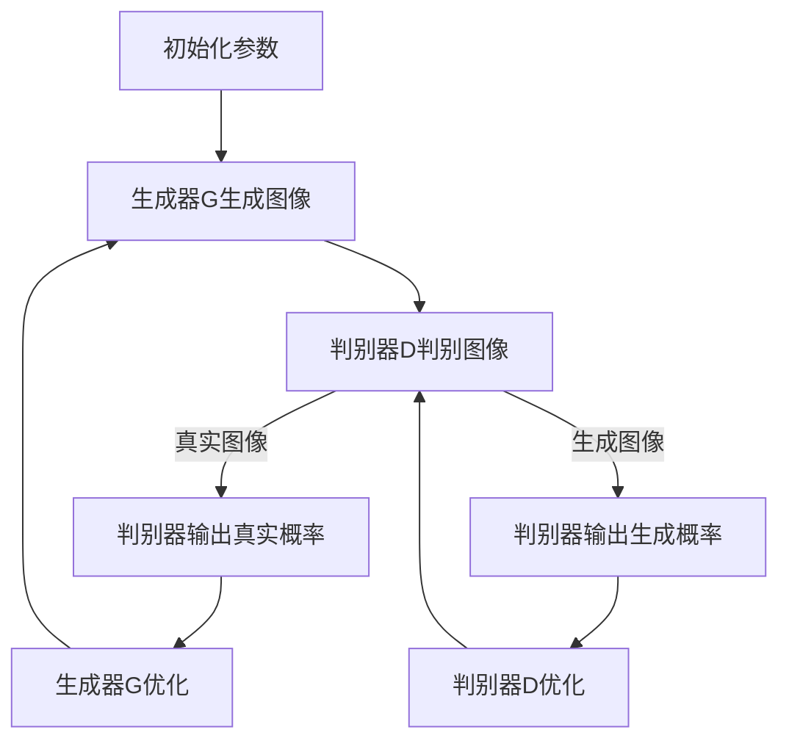
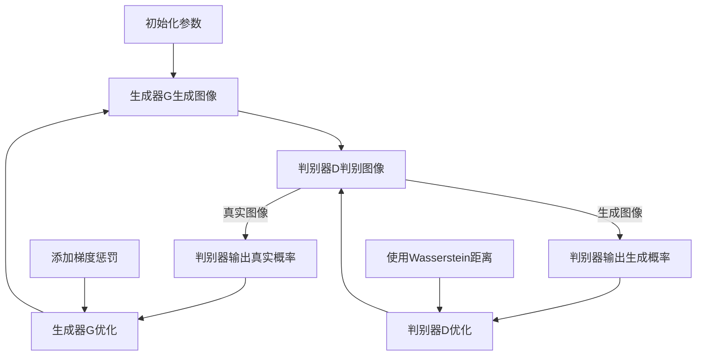

                 

## 文章标题：生成对抗网络(GAN)与图像生成

### 关键词：生成对抗网络，图像生成，GAN，深度学习，算法原理，项目实战

> 摘要：本文旨在深入探讨生成对抗网络（GAN）的基本原理、算法架构及其在图像生成领域的应用。通过逻辑清晰、结构紧凑的分析，本文将帮助读者理解GAN的工作机制，掌握其核心算法原理，并通过项目实战案例，揭示GAN在图像生成中的实际应用价值。同时，本文还将对GAN的优化方法、安全性问题以及未来发展方向进行探讨。

---

## 引言

生成对抗网络（GAN）是深度学习领域中的一种重要算法，自2014年由Ian Goodfellow等人提出以来，迅速在学术界和工业界引起了广泛关注。GAN的主要目标是通过生成器和判别器的对抗训练，生成高质量的图像。这种独特的训练机制使得GAN在图像生成领域取得了显著成果，包括图像修复、超分辨率、图像到图像转换、图像风格迁移等。

### 背景介绍

图像生成一直是计算机视觉领域的核心问题。传统的图像生成方法主要依赖于规则或统计学模型，而随着深度学习技术的发展，深度神经网络逐渐成为图像生成的主要工具。生成对抗网络（GAN）的提出，为深度学习图像生成开辟了新的路径。

### 核心概念与联系

GAN的核心概念包括生成器（Generator）、判别器（Discriminator）和对抗训练（Adversarial Training）。生成器的目标是生成逼真的图像，而判别器的目标是区分生成图像和真实图像。在训练过程中，生成器和判别器相互对抗，通过不断优化，最终生成器能够生成高质量的图像。

### Mermaid流程图：GAN工作原理



## GAN基本原理与架构

### GAN的数学模型

GAN的数学模型主要包括生成器G和判别器D。生成器G接受随机噪声向量作为输入，通过神经网络生成图像。判别器D接受真实图像和生成图像作为输入，输出一个概率值，表示图像的真实性。GAN的训练目标是最大化判别器D的输出差距，同时最小化生成器G的输出差距。

### 核心算法原理讲解

生成器G的目的是生成尽可能逼真的图像，以欺骗判别器D。生成器通常采用多层感知器（MLP）或卷积神经网络（CNN）架构。伪代码如下：

```python
# 生成器G的伪代码
G(z) = generator(z)
```

其中，z 是随机噪声向量，G(z) 是生成的图像。

判别器D的目的是区分真实图像和生成图像。判别器通常也采用多层感知器或卷积神经网络架构。伪代码如下：

```python
# 判别器D的伪代码
D(x) = discriminator(x)
D(G(z)) = discriminator(G(z))
```

其中，x 是真实图像，G(z) 是生成的图像。

### GAN的架构详解

GAN的架构主要包括两部分：生成器和判别器。生成器负责生成图像，判别器负责判断图像的真实性。两部分的对抗训练使得生成器不断优化，以生成更逼真的图像。GAN的架构可以通过Mermaid流程图进行详细说明：

```mermaid
graph TD
A[随机噪声z] --> B[生成器G(z)]
B --> C[判别器D(G(z))]
C -->|真实图像x| D1[判别器D(x)]
D1 --> E[判别器D优化]
D2[判别器D(G(z))] --> F[生成器G优化]
```

## 图像生成技术

### 图像生成的数学基础

图像生成涉及到概率论、信息论和深度学习等领域的知识。生成器G通常采用深度学习模型，如卷积神经网络（CNN），通过学习数据分布，生成逼真的图像。判别器D则通过对比真实图像和生成图像，判断生成图像的质量。

### 图像生成算法概述

常见的图像生成算法包括生成式对抗网络（GAN）、变分自编码器（VAE）、条件生成对抗网络（CGAN）等。每种算法都有其独特的特点和应用场景。

### GAN与其他图像生成技术的比较

GAN与VAE等生成算法相比，具有更强的生成能力和灵活性。GAN通过生成器和判别器的对抗训练，可以生成高质量的图像。而VAE则通过编码器和解码器，将数据映射到潜在空间，生成图像。GAN在图像质量、多样性方面具有优势，但在训练稳定性方面存在挑战。

## GAN在图像生成中的应用

### 图像修复

GAN在图像修复领域取得了显著成果。通过训练生成器，可以将损坏的图像修复为完整的图像。例如，DeepArt.io 使用 GAN 进行图像修复，取得了令人满意的效果。

### 超分辨率

GAN在图像超分辨率领域也有广泛应用。通过训练生成器，可以将低分辨率图像转换为高分辨率图像。例如，Edison和Lucas等人提出的 SRGAN（超级分辨率生成对抗网络）取得了显著效果。

### 图像到图像转换

GAN还可以实现图像到图像的转换。例如，将人脸图像转换为卡通风格图像。这为图像编辑和艺术创作提供了新的可能性。

### 图像风格迁移

GAN在图像风格迁移方面也具有独特优势。例如，利用 GAN 可以将一幅图像的风格迁移到另一幅图像上，实现艺术风格的转换。

## GAN的优化与改进

### GAN的稳定性和训练技巧

GAN的训练过程具有挑战性，容易出现不稳定现象。为了提高GAN的稳定性，研究人员提出了一系列训练技巧，如梯度惩罚、Wasserstein距离等。

### 对抗性攻击与防御

GAN在生成图像时，可能受到对抗性攻击的影响。研究人员也提出了一些对抗性防御方法，如防御GAN（Defensive GAN）、对抗性训练等。

### 多模态GAN

多模态GAN可以同时处理多种类型的输入，生成更加复杂和多样的图像。例如，文本到图像的生成、视频到图像的生成等。

### Mermaid流程图：GAN优化策略



## GAN安全性与伦理问题

### GAN的安全风险

GAN在生成图像时可能存在安全风险，例如生成虚假图像、隐私泄露等。研究人员提出了一些安全防御措施，如隐私保护GAN、对抗性攻击检测等。

### 伦理问题与解决方案

GAN在图像生成领域的应用可能引发一系列伦理问题，如隐私侵犯、误导性信息等。研究人员提出了一些伦理解决方案，如建立伦理规范、加强监管等。

### 合规与法律框架

GAN的应用需要遵守相关的法律法规，如数据保护法、隐私保护法等。研究人员和开发者需要关注合规问题，确保GAN的应用合法、安全。

## 项目实战与案例分析

### 实战项目1：图像超分辨率

1. **开发环境搭建**：配置Python环境、TensorFlow库等。
2. **源代码详细实现和代码解读**：实现SRGAN模型，包括生成器、判别器和损失函数。
3. **代码应用解读与分析**：通过实际案例，展示图像超分辨率的效果。
4. **实际案例分析和详细讲解剖析**：分析超分辨率项目中的挑战和解决方案。
5. **项目小结**：总结项目成果和经验。

### 实战项目2：图像修复

1. **开发环境搭建**：配置Python环境、TensorFlow库等。
2. **源代码详细实现和代码解读**：实现图像修复模型，包括生成器、判别器和损失函数。
3. **代码应用解读与分析**：通过实际案例，展示图像修复的效果。
4. **实际案例分析和详细讲解剖析**：分析图像修复项目中的挑战和解决方案。
5. **项目小结**：总结项目成果和经验。

### 案例分析：GAN在艺术创作中的应用

1. **艺术创作与GAN**：探讨GAN在艺术创作中的潜力。
2. **项目展示**：展示GAN在艺术创作中的实际应用案例。
3. **详细讲解与剖析**：分析GAN在艺术创作中的应用效果和挑战。
4. **项目总结**：总结GAN在艺术创作中的应用前景和未来发展方向。

## 总结与展望

### GAN的当前状态

GAN在图像生成领域取得了显著成果，但仍然存在挑战，如训练稳定性、安全性和伦理问题等。

### 未来发展趋势

随着深度学习技术的不断发展，GAN有望在更多领域得到应用，如自然语言处理、计算机视觉等。

### 研究与开发方向

未来的研究将集中在GAN的优化、安全性、应用拓展等方面，推动GAN在更多场景中的实际应用。

### 最佳实践 Tips

1. **优化训练过程**：合理设置超参数，提高GAN的训练效率。
2. **加强安全性**：采取对抗性防御措施，确保GAN的应用安全。
3. **关注伦理问题**：遵循法律法规，确保GAN的应用合法、合规。

### 小结

生成对抗网络（GAN）在图像生成领域具有巨大潜力，通过不断优化和发展，GAN有望在更多领域取得突破。研究人员和开发者应关注GAN的安全性和伦理问题，推动GAN的健康发展。

### 注意事项

1. **保持训练稳定性**：采取有效的训练技巧，避免训练过程中的不稳定现象。
2. **关注安全风险**：加强对GAN的安全监控，防止虚假图像和隐私泄露。
3. **遵守法律法规**：确保GAN的应用符合法律法规，避免法律风险。

### 拓展阅读

1. **Ian Goodfellow等人的论文《生成对抗网络》（Generative Adversarial Nets）**
2. **Edison和Lucas等人提出的《SRGAN：超级分辨率生成对抗网络》（SRGAN: Super-Resolutoin Generative Adversarial Nets）**
3. **DeepArt.io 的图像修复案例**

---

**作者：AI天才研究院/AI Genius Institute & 禅与计算机程序设计艺术 /Zen And The Art of Computer Programming**

本文详细探讨了生成对抗网络（GAN）的基本原理、算法架构及其在图像生成领域的应用。通过逻辑清晰、结构紧凑的分析，本文帮助读者理解了GAN的工作机制，掌握了其核心算法原理，并通过项目实战案例，揭示了GAN在图像生成中的实际应用价值。同时，本文还对GAN的优化方法、安全性问题以及未来发展方向进行了探讨。生成对抗网络作为深度学习领域的重要算法，其在图像生成、艺术创作等领域具有广阔的应用前景。随着技术的不断发展，GAN有望在更多领域取得突破。研究人员和开发者应关注GAN的安全性和伦理问题，推动GAN的健康发展。

