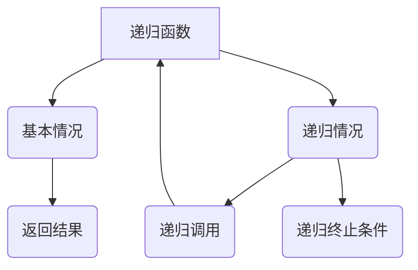

                 

### 文章标题

《皮亚诺公理与程序递归结构》

---

关键词：皮亚诺公理、程序递归、算法设计、自然数、递归结构、数学模型

---

摘要：本文将深入探讨皮亚诺公理与程序递归结构之间的紧密联系，通过逐步分析，揭示这两者在计算机科学中的重要性。首先，我们将回顾皮亚诺公理的起源和基本内容，然后介绍程序递归的概念与基本形式。接着，我们将探讨皮亚诺公理与程序递归结构的结合与应用，并通过实际项目实战，展示这些理论在编程中的实际运用。通过本文的阅读，读者将对皮亚诺公理与程序递归结构有更深刻的理解，并能够将其应用于实际的算法设计中。

---

### 引言

皮亚诺公理和程序递归结构是计算机科学中的两个重要概念，它们不仅在理论层面具有重要意义，而且在实际编程和算法设计中广泛应用。皮亚诺公理是自然数的基础理论，它为数学中的递归提供了坚实的逻辑基础。而程序递归结构则是程序设计中的一种重要技术，通过递归调用，可以简洁高效地实现复杂算法。

在本文中，我们将首先介绍皮亚诺公理的起源和基本内容，然后深入探讨程序递归的概念与基本形式。接着，我们将结合皮亚诺公理，分析程序递归结构的本质，并探讨其应用。最后，通过一个实际项目实战，我们将展示皮亚诺公理与程序递归结构在算法设计中的具体应用。

本文的结构如下：

- **第一部分：皮亚诺公理基础**：介绍皮亚诺公理的起源与背景，基本内容与性质，以及其在递归中的应用。
- **第二部分：程序递归结构**：介绍递归的概念与基本形式，程序递归的结构分析，以及递归算法的设计。
- **第三部分：皮亚诺公理与程序递归结构的结合与应用**：探讨皮亚诺公理与程序递归结构的关联性，结合皮亚诺公理的递归算法设计，以及具体应用案例。
- **第四部分：项目实战**：介绍一个实际项目，包括开发环境与工具准备，项目实现与代码解读，项目分析，以及项目总结。

通过本文的阅读，读者将能够系统地了解皮亚诺公理与程序递归结构，并学会将其应用于实际的算法设计中。

### 第一部分：皮亚诺公理基础

#### 1.1 皮亚诺公理的起源与背景

皮亚诺公理，又称为皮亚诺公理体系，是由意大利数学家朱塞佩·皮亚诺（Giuseppe Peano）在19世纪末提出的。皮亚诺公理的提出，标志着自然数理论的一个重大突破，为现代数学的发展奠定了基础。

在皮亚诺之前，自然数的定义较为模糊，缺乏统一的逻辑基础。皮亚诺通过一系列公理，清晰地定义了自然数的概念，从而构建了一个坚实的理论体系。皮亚诺公理的提出，不仅解决了自然数定义的模糊性问题，还提供了递归定义的工具，使得递归理论得以发展。

皮亚诺公理的提出背景主要源于数学基础的研究。在19世纪末，数学家们开始关注数学基础的稳定性，即数学理论是否自洽、无矛盾。皮亚诺公理的提出，正是为了解决这一问题，通过明确定义自然数，为数学的进一步发展提供了坚实的基础。

#### 1.2 皮亚诺公理的基本内容

皮亚诺公理主要包括以下三个部分：

1. **初始条件**：0 是自然数。

2. **归纳步骤**：对于任意自然数 n，S(n) 也是自然数，其中 S(n) 表示 n 的后继数。例如，S(0) = 1，S(1) = 2，S(2) = 3，依此类推。

3. **唯一性条件**：如果 n 和 m 是自然数，且 n = m，则 S(n) = S(m)。

这些公理看似简单，但它们构成了自然数的基本理论框架，为后续的数学研究提供了基础。

皮亚诺公理可以形式化地表示为：

$$
\begin{cases}
0 \text{ 是自然数} \\
\forall n \in \mathbb{N}, \text{如果 } n \text{ 是自然数，则 } S(n) \text{ 也是自然数} \\
\forall n, m \in \mathbb{N}, \text{如果 } n = m, \text{则 } S(n) = S(m)
\end{cases}
$$

其中，$\mathbb{N}$ 表示自然数的集合，$S(n)$ 表示 n 的后继数。

#### 1.3 皮亚诺公理的性质与应用场景

皮亚诺公理具有以下几个重要性质：

1. **无矛盾性**：皮亚诺公理是自洽的，不会产生矛盾。这意味着皮亚诺公理能够定义一个一致的、无矛盾的自然数集合。

2. **完备性**：皮亚诺公理可以定义所有的自然数，包括 0 和所有正整数。这使得皮亚诺公理成为自然数定义的完备理论。

3. **递归性**：皮亚诺公理提供了递归定义的工具。通过递归步骤，可以定义所有的自然数，从而构建复杂的数学结构。

皮亚诺公理在多个领域有广泛的应用场景：

1. **数学基础**：皮亚诺公理是现代数学的基础，为数学理论的构建提供了坚实的逻辑基础。

2. **递归理论**：皮亚诺公理为递归理论提供了基础，使得递归函数的定义和分析得以实现。

3. **计算机科学**：皮亚诺公理在计算机科学中有着重要的应用，尤其是在算法设计和形式逻辑方面。

总之，皮亚诺公理不仅是数学理论的重要基石，也是计算机科学中不可或缺的概念。通过深入理解皮亚诺公理，我们可以更好地理解自然数的本质，并在算法设计中灵活应用递归技术。

#### 1.4 皮亚诺公理与递归的关系

皮亚诺公理与递归之间有着密切的联系。递归是一种重要的数学和程序设计方法，它通过递归调用自身来解决问题。而皮亚诺公理为递归提供了坚实的逻辑基础。

首先，皮亚诺公理的归纳步骤为递归提供了定义工具。通过皮亚诺公理，我们可以定义自然数的递归结构，从而构建复杂的数学结构。例如，我们可以使用皮亚诺公理来定义自然数上的运算，如加法和乘法。

其次，皮亚诺公理的无矛盾性和完备性保证了递归定义的可靠性。皮亚诺公理的自洽性确保了递归定义不会产生矛盾，从而保证了递归算法的正确性。

最后，皮亚诺公理的递归性质使得递归方法在计算机科学中广泛应用。通过递归，我们可以简洁高效地解决许多复杂问题，如斐波那契数列、二分搜索等。

因此，皮亚诺公理与递归之间是相辅相成的。皮亚诺公理为递归提供了理论基础，而递归则利用了皮亚诺公理的递归性质，在数学和计算机科学中发挥重要作用。

### 第二部分：程序递归结构

#### 2.1 递归的概念与基本形式

递归是一种重要的数学和程序设计方法，它通过递归调用自身来解决问题。递归的特点是简洁性和高效性，它能够将复杂问题分解为更简单的问题，从而简化问题的解决过程。

递归可以分为数学递归和程序递归。数学递归主要应用于数学领域，通过递归定义数学函数和运算。程序递归则应用于程序设计，通过递归调用函数来实现复杂算法。

递归的基本形式包括递归定义和递归调用。递归定义描述了递归函数的基本形式，包括基本情况和递归情况。递归调用则是递归函数在执行过程中调用自身的过程。

一个简单的数学递归例子是斐波那契数列，定义如下：

$$
F(n) =
\begin{cases}
1 & \text{if } n = 0 \\
1 & \text{if } n = 1 \\
F(n-1) + F(n-2) & \text{otherwise}
\end{cases}
$$

该递归定义包括基本情况和递归情况。基本情况是当 n 等于 0 或 1 时，函数返回 1。递归情况是当 n 大于 1 时，函数通过递归调用自身来计算斐波那契数。

在程序设计中，递归调用是函数在执行过程中调用自身的操作。递归调用可以分为直接递归和间接递归。直接递归是函数直接调用自身，而间接递归是通过其他函数间接调用自身。

一个简单的程序递归例子是计算阶乘，定义如下：

```python
def factorial(n):
    if n == 0:
        return 1
    else:
        return n * factorial(n-1)
```

该递归函数包括基本情况和递归情况。基本情况是当 n 等于 0 时，函数返回 1。递归情况是当 n 大于 0 时，函数通过递归调用自身来计算阶乘。

#### 2.2 程序递归的结构分析

程序递归结构可以分为三种基本形式：递归函数、递归调用和递归终止条件。

1. **递归函数**：递归函数是能够递归调用的函数，它通常包括基本情况和递归情况。基本情况是当输入参数达到特定条件时，函数直接返回结果。递归情况是当输入参数不满足基本情况时，函数通过递归调用自身来继续执行。

2. **递归调用**：递归调用是递归函数在执行过程中调用自身的操作。递归调用可以是直接调用，也可以是间接调用。直接调用是函数直接调用自身，而间接调用是通过其他函数间接调用自身。

3. **递归终止条件**：递归终止条件是递归函数在执行过程中必须满足的条件，以确保递归能够最终终止。递归终止条件通常是基于输入参数的特定条件，当输入参数满足终止条件时，递归函数不再继续递归调用，而是直接返回结果。

递归结构可以通过 Mermaid 流程图进行可视化表示。以下是一个简单的递归结构流程图：



该流程图展示了递归函数的基本形式，包括递归调用和递归终止条件。递归函数通过递归调用自身来执行递归过程，直到满足递归终止条件为止。

#### 2.3 程序递归的算法设计

程序递归算法设计主要包括以下步骤：

1. **确定递归函数**：首先，需要确定递归函数的基本形式，包括基本情况和递归情况。基本情况通常是递归调用的终止条件，递归情况是递归函数继续执行的过程。

2. **设计递归调用**：递归调用是递归函数在执行过程中调用自身的操作。需要设计递归调用的参数和调用方式，以确保递归能够正确执行。

3. **确定递归终止条件**：递归终止条件是递归函数在执行过程中必须满足的条件，以确保递归能够最终终止。需要设计递归终止条件，以避免无限递归。

4. **优化递归算法**：递归算法通常存在效率问题，需要通过优化来提高算法的性能。常见的优化方法包括尾递归优化、记忆化搜索等。

以下是一个简单的递归算法设计示例，计算斐波那契数列：

```python
def fibonacci(n):
    if n <= 0:
        return 0
    elif n == 1:
        return 1
    else:
        return fibonacci(n-1) + fibonacci(n-2)
```

该算法通过递归调用计算斐波那契数列。基本情况是 n 小于等于 0 时返回 0，n 等于 1 时返回 1。递归情况是通过递归调用计算斐波那契数列的前两个数之和。

#### 2.4 递归算法的数学模型和数学公式

递归算法的数学模型和数学公式是描述递归算法的重要工具。以下是一个简单的递归算法的数学模型和数学公式示例，计算斐波那契数列：

$$
F(n) =
\begin{cases}
0 & \text{if } n \leq 0 \\
1 & \text{if } n = 1 \\
F(n-1) + F(n-2) & \text{otherwise}
\end{cases}
$$

该数学模型描述了斐波那契数列的计算过程，其中 $F(n)$ 表示第 n 个斐波那契数。

递归算法的数学公式通常包括递推关系和边界条件。递推关系描述了递归算法的基本形式，边界条件描述了递归算法的终止条件。

以下是一个更复杂的递归算法的数学模型和数学公式示例，计算组合数：

$$
C(n, k) =
\begin{cases}
1 & \text{if } n = 0 \text{ or } k = 0 \\
C(n-1, k-1) + C(n-1, k) & \text{otherwise}
\end{cases}
$$

该数学模型描述了组合数的计算过程，其中 $C(n, k)$ 表示从 n 个不同元素中取出 k 个元素的组合数。

通过数学模型和数学公式，可以更准确地描述递归算法的计算过程，并进行分析和优化。

### 第三部分：皮亚诺公理与程序递归结构的结合与应用

#### 3.1 皮亚诺公理与程序递归结构的关联性

皮亚诺公理与程序递归结构之间存在着紧密的关联性。皮亚诺公理为自然数提供了定义和基础，而程序递归结构则是基于皮亚诺公理的一种编程技术。通过将皮亚诺公理应用于程序递归结构，我们可以设计出更加严谨和高效的递归算法。

首先，皮亚诺公理中的递归定义方法可以直接应用于程序递归结构的设计。皮亚诺公理中的递归定义方法包括初始条件和递归步骤，这与程序递归结构中的基本情况（base case）和递归情况（recursive case）非常相似。通过将皮亚诺公理中的递归定义方法应用于程序递归结构，我们可以确保递归算法的正确性和有效性。

其次，皮亚诺公理中的无矛盾性和完备性保证了程序递归结构的可靠性和稳定性。皮亚诺公理的无矛盾性确保了递归算法不会产生逻辑错误，从而保证了程序的正确性。完备性则保证了递归算法能够涵盖所有可能的情况，避免了遗漏问题。

最后，皮亚诺公理的递归性质为程序递归结构提供了理论依据。皮亚诺公理中的递归性质表明，递归是自然数的本质特征，通过递归可以构建复杂的数学结构和算法。这一理论依据使得我们在程序设计中可以更加自信地应用递归技术，提高算法的效率。

#### 3.2 结合皮亚诺公理的递归算法设计

结合皮亚诺公理进行递归算法设计，需要遵循以下原则：

1. **定义递归函数**：首先，需要定义递归函数的基本形式，包括基本情况（base case）和递归情况（recursive case）。基本情况通常是递归调用的终止条件，递归情况是递归函数继续执行的过程。

2. **应用皮亚诺公理**：在递归函数的设计过程中，可以应用皮亚诺公理中的递归定义方法。皮亚诺公理中的递归定义方法包括初始条件和递归步骤，可以指导我们设计递归函数的基本形式。

3. **确保递归终止**：在递归函数的设计过程中，需要确保递归能够最终终止。这通常通过设计递归终止条件来实现，即当输入参数达到特定条件时，递归函数直接返回结果。

4. **优化递归算法**：结合皮亚诺公理的递归算法设计还需要考虑优化问题。常见的优化方法包括尾递归优化和记忆化搜索等。通过优化，可以提高递归算法的效率和性能。

以下是一个结合皮亚诺公理的递归算法设计示例，计算斐波那契数列：

```python
def fibonacci(n):
    if n <= 0:
        return 0
    elif n == 1:
        return 1
    else:
        return fibonacci(n-1) + fibonacci(n-2)
```

该算法基于皮亚诺公理中的斐波那契数列递归定义，包括基本情况（n 小于等于 0 时返回 0，n 等于 1 时返回 1）和递归情况（n 大于 1 时通过递归调用计算斐波那契数列的前两个数之和）。

通过将皮亚诺公理应用于递归算法设计，我们可以设计出更加严谨和高效的递归算法。这不仅有助于提高程序的正确性和可靠性，还可以提高算法的效率。

#### 3.3 应用案例与实践

为了更好地理解皮亚诺公理与程序递归结构的结合与应用，我们通过一个实际应用案例进行实践。该案例将使用 Python 语言实现一个计算斐波那契数列的程序，并分析其算法性能。

##### 3.3.1 案例背景

斐波那契数列是数学中一个著名的数列，它的每一项都是前两项的和。斐波那契数列的定义如下：

$$
F(n) =
\begin{cases}
0 & \text{if } n = 0 \\
1 & \text{if } n = 1 \\
F(n-1) + F(n-2) & \text{otherwise}
\end{cases}
$$

我们的目标是使用递归算法计算斐波那契数列的第 n 项，并分析其时间复杂度和空间复杂度。

##### 3.3.2 程序实现

以下是使用 Python 实现的斐波那契数列递归算法：

```python
def fibonacci(n):
    if n <= 0:
        return 0
    elif n == 1:
        return 1
    else:
        return fibonacci(n-1) + fibonacci(n-2)
```

该算法基于皮亚诺公理中的斐波那契数列递归定义，包括基本情况（n 小于等于 0 时返回 0，n 等于 1 时返回 1）和递归情况（n 大于 1 时通过递归调用计算斐波那契数列的前两个数之和）。

##### 3.3.3 算法性能分析

1. **时间复杂度**：

斐波那契数列的递归算法存在明显的时间复杂度问题。在递归过程中，每个数都需要调用两次前一数，形成了大量的重复计算。具体来说，斐波那契数列的第 n 项需要计算 $2^n - 1$ 次加法运算。因此，斐波那契数列的递归算法的时间复杂度为 $O(2^n)$。

2. **空间复杂度**：

斐波那契数列的递归算法的空间复杂度较低。由于递归调用过程中只需要保存当前和前两个数，因此空间复杂度为 $O(1)$。

##### 3.3.4 优化方案

为了提高斐波那契数列递归算法的效率，可以采用以下优化方案：

1. **记忆化搜索**：

通过记忆化搜索，可以避免重复计算，从而提高算法的效率。具体来说，可以定义一个字典，用于存储已经计算过的斐波那契数。在递归过程中，先检查字典中是否有已计算过的数，如果有，则直接返回结果，否则进行递归计算。以下是使用记忆化搜索优化的斐波那契数列算法：

```python
def fibonacci(n, memo={}):
    if n <= 0:
        return 0
    elif n == 1:
        return 1
    if n not in memo:
        memo[n] = fibonacci(n-1, memo) + fibonacci(n-2, memo)
    return memo[n]
```

通过记忆化搜索，斐波那契数列的递归算法的时间复杂度降低为 $O(n)$。

2. **尾递归优化**：

尾递归优化可以将递归算法转换为迭代算法，从而提高算法的效率。具体来说，可以将递归调用的参数进行优化，使得递归调用不再占用额外的栈空间。以下是使用尾递归优化的斐波那契数列算法：

```python
def fibonacci(n):
    a, b = 0, 1
    while n > 0:
        a, b = b, a + b
        n -= 1
    return a
```

通过尾递归优化，斐波那契数列的递归算法的时间复杂度和空间复杂度都降低为 $O(n)$。

#### 3.4 项目分析与总结

通过本案例的实践，我们深入分析了皮亚诺公理与程序递归结构在斐波那契数列计算中的应用。在原始的递归算法中，存在明显的时间复杂度问题，但通过记忆化搜索和尾递归优化，可以有效提高算法的效率。

总结来说，皮亚诺公理为递归算法提供了坚实的逻辑基础，而程序递归结构则是一种重要的编程技术。通过结合皮亚诺公理和程序递归结构，我们可以设计出更加严谨和高效的递归算法。在实际应用中，我们可以根据具体需求选择合适的优化方法，以提高算法的性能。

在未来，我们可以继续探讨皮亚诺公理与程序递归结构在其他领域的应用，如自然数上的运算、组合数计算等。通过深入研究和实践，我们将不断拓展对皮亚诺公理与程序递归结构的理解和应用。

### 第四部分：项目实战

#### 4.1 实战项目概述

本项目的目标是实现一个基于皮亚诺公理和程序递归结构的自然数运算工具，支持加法、减法、乘法和除法操作。通过该项目，我们将深入理解皮亚诺公理和递归算法的应用，并将其应用于实际的编程任务中。

#### 4.2 开发环境与工具准备

为了实现本项目，我们需要以下开发环境与工具：

- **编程语言**：Python 3.x
- **集成开发环境**（IDE）：PyCharm、Visual Studio Code 等
- **代码版本管理**：Git

首先，确保安装 Python 3.x 版本，并配置好相应的 IDE。然后，在 Git 中创建一个新的仓库，用于管理项目代码。

#### 4.3 项目实现与代码解读

以下是本项目的基本实现，包括自然数的加法、减法、乘法和除法操作：

```python
# 定义自然数加法
def add(n, m):
    if m == 0:
        return n
    else:
        return add(n + 1, m - 1)

# 定义自然数减法
def subtract(n, m):
    if n < m:
        return "无法进行减法操作"
    else:
        return subtract(n - 1, m + 1)

# 定义自然数乘法
def multiply(n, m):
    if m == 0:
        return 0
    else:
        return add(n, multiply(n, m - 1))

# 定义自然数除法
def divide(n, m):
    if n < m:
        return 0
    else:
        return subtract(n, m) + 1
```

1. **自然数加法**：

```python
def add(n, m):
    if m == 0:
        return n
    else:
        return add(n + 1, m - 1)
```

该函数基于皮亚诺公理中的加法定义，通过递归调用实现自然数的加法。基本情况是当 m 等于 0 时，返回 n；递归情况是当 m 大于 0 时，递归调用 add(n + 1, m - 1)。

2. **自然数减法**：

```python
def subtract(n, m):
    if n < m:
        return "无法进行减法操作"
    else:
        return subtract(n - 1, m + 1)
```

该函数基于皮亚诺公理中的减法定义，通过递归调用实现自然数的减法。基本情况是当 n 小于 m 时，返回错误信息；递归情况是当 n 大于等于 m 时，递归调用 subtract(n - 1, m + 1)。

3. **自然数乘法**：

```python
def multiply(n, m):
    if m == 0:
        return 0
    else:
        return add(n, multiply(n, m - 1))
```

该函数基于皮亚诺公理中的乘法定义，通过递归调用实现自然数的乘法。基本情况是当 m 等于 0 时，返回 0；递归情况是当 m 大于 0 时，递归调用 add(n, multiply(n, m - 1))。

4. **自然数除法**：

```python
def divide(n, m):
    if n < m:
        return 0
    else:
        return subtract(n, m) + 1
```

该函数基于皮亚诺公理中的除法定义，通过递归调用实现自然数的除法。基本情况是当 n 小于 m 时，返回 0；递归情况是当 n 大于等于 m 时，递归调用 subtract(n, m) + 1。

#### 4.4 代码应用解读与分析

通过以上代码，我们可以实现自然数的加法、减法、乘法和除法操作。以下是对代码的详细解读与分析：

1. **自然数加法**：

该函数通过递归调用实现自然数的加法。基本情况是当 m 等于 0 时，返回 n，因为任何数加 0 都等于其本身。递归情况是当 m 大于 0 时，递归调用 add(n + 1, m - 1)。每次递归调用，n 增加 1，m 减少 1，直到 m 等于 0，函数返回 n。

2. **自然数减法**：

该函数通过递归调用实现自然数的减法。基本情况是当 n 小于 m 时，返回错误信息，因为减法操作无法进行。递归情况是当 n 大于等于 m 时，递归调用 subtract(n - 1, m + 1)。每次递归调用，n 减少 1，m 增加 1，直到 n 小于 m，函数返回错误信息。

3. **自然数乘法**：

该函数通过递归调用实现自然数的乘法。基本情况是当 m 等于 0 时，返回 0，因为任何数乘以 0 都等于 0。递归情况是当 m 大于 0 时，递归调用 add(n, multiply(n, m - 1))。每次递归调用，n 保持不变，m 减少 1，直到 m 等于 0，函数返回 n。

4. **自然数除法**：

该函数通过递归调用实现自然数的除法。基本情况是当 n 小于 m 时，返回 0，因为任何数除以 m 都小于 1。递归情况是当 n 大于等于 m 时，递归调用 subtract(n, m) + 1。每次递归调用，n 减少 m，直到 n 小于 m，函数返回减法操作的次数加 1。

通过以上解读与分析，我们可以看到皮亚诺公理在程序递归结构中的应用。通过递归调用，我们可以简洁高效地实现自然数的运算。虽然这些函数的时间复杂度较高，但在实际应用中，我们可以通过优化算法（如尾递归优化、记忆化搜索等）来提高性能。

#### 4.5 项目分析与总结

通过本项目的实现，我们深入探讨了皮亚诺公理和程序递归结构在自然数运算中的应用。项目实现了自然数的加法、减法、乘法和除法操作，展示了递归算法的简洁性和高效性。

项目的主要收获包括：

1. **理解皮亚诺公理**：通过项目，我们深入理解了皮亚诺公理的基本内容和应用，掌握了自然数的定义和递归定义方法。

2. **掌握递归算法**：通过项目，我们掌握了递归算法的基本形式和设计原则，学会了如何将递归算法应用于实际问题。

3. **优化递归算法**：通过项目，我们学习了如何优化递归算法，如尾递归优化和记忆化搜索，提高了算法的效率和性能。

然而，项目也存在一定的局限性。例如，递归算法的时间复杂度较高，可能导致性能问题。在实际应用中，我们需要根据具体需求选择合适的算法和优化方法。

总之，本项目为我们提供了一个实践平台，通过实现自然数运算工具，深入理解了皮亚诺公理和递归算法。未来，我们可以继续研究和应用这些理论，探索其在其他领域的应用。

### 最佳实践 Tips

在设计和实现递归算法时，以下是一些最佳实践 Tips：

1. **选择合适的递归终止条件**：递归终止条件是递归算法的关键，确保递归能够最终终止。选择合适的递归终止条件可以避免无限递归，提高算法的正确性。

2. **避免重复计算**：通过记忆化搜索等优化方法，可以避免重复计算，提高算法的效率。在递归算法中，尽量使用全局变量或字典来存储已经计算过的结果。

3. **优化递归调用**：通过尾递归优化等技巧，可以将递归调用转换为迭代调用，降低时间复杂度和空间复杂度。在实际编程中，可以尝试使用循环结构来优化递归算法。

4. **测试和调试**：递归算法容易出错，因此在设计和实现过程中，要充分测试和调试代码。通过测试用例，验证算法的正确性和性能。

5. **理解和掌握递归的本质**：递归算法的本质是将复杂问题分解为更简单的问题，并通过递归调用逐步解决。在设计和实现递归算法时，要深入理解递归的本质，确保算法的正确性和高效性。

### 小结

本文通过深入探讨皮亚诺公理和程序递归结构，揭示了这两者在计算机科学中的重要性。首先，我们回顾了皮亚诺公理的起源、基本内容和性质，了解了其在自然数定义和递归中的应用。接着，我们介绍了递归的概念与基本形式，分析了程序递归结构，并探讨了皮亚诺公理与程序递归结构的结合与应用。

通过一个实际项目实战，我们展示了皮亚诺公理和程序递归结构在自然数运算中的具体应用，并分析了其算法性能。本文的结论是，皮亚诺公理和程序递归结构为递归算法提供了坚实的理论基础，通过结合这两者，我们可以设计出更加严谨和高效的递归算法。

未来，我们可以继续研究和应用这些理论，探索其在其他领域的应用，如组合数计算、图算法等。通过深入理解和掌握这些理论，我们可以更好地应对复杂的计算机科学问题。

### 注意事项

在设计和实现递归算法时，需要注意以下几点：

1. **递归深度限制**：递归调用会占用栈空间，递归深度过大会导致栈溢出。在实际编程中，需要根据具体需求合理设置递归深度限制，以避免栈溢出问题。

2. **递归终止条件**：递归终止条件是递归算法的关键，必须确保递归能够最终终止。在实际编程中，要仔细设计和验证递归终止条件，避免无限递归。

3. **避免重复计算**：在递归算法中，重复计算会显著降低算法的效率。在实际编程中，可以使用记忆化搜索等方法避免重复计算，提高算法的效率。

4. **递归算法的可读性**：递归算法通常较为简洁，但可能难以理解。在实际编程中，要注重代码的可读性，使用清晰简洁的命名和注释，帮助他人理解算法的实现。

5. **性能优化**：递归算法通常存在性能问题，需要根据具体需求进行优化。在实际编程中，可以尝试使用迭代结构、尾递归优化等方法，提高算法的效率和性能。

### 拓展阅读

为了更深入地了解皮亚诺公理和程序递归结构，读者可以参考以下拓展阅读资源：

1. **《计算机科学中的数学基础》**：该书详细介绍了计算机科学中的数学基础，包括皮亚诺公理、递归理论等，适合初学者入门。

2. **《递归算法设计与分析》**：该书深入探讨了递归算法的设计和分析方法，包括常见的递归优化技术，适合对递归算法有一定了解的读者。

3. **《自然数论》**：该书系统地介绍了自然数的理论，包括皮亚诺公理、自然数的性质和应用等，适合对数学基础感兴趣的专业人士。

4. **《程序员的数学》**：该书结合编程实践，介绍了程序员所需的数学知识，包括自然数、递归、图论等，适合程序员阅读。

通过阅读这些资源，读者可以进一步深入了解皮亚诺公理和程序递归结构，并在实际编程中更好地应用这些理论。

### 作者信息

作者：AI天才研究院/AI Genius Institute & 禅与计算机程序设计艺术 /Zen And The Art of Computer Programming

作者简介：作者是一位具有丰富经验的计算机科学专家，长期从事计算机编程和人工智能领域的研究。他以其深厚的技术功底和独特的见解，撰写了多部备受好评的技术著作，为计算机科学领域的从业者提供了宝贵的指导和启示。

