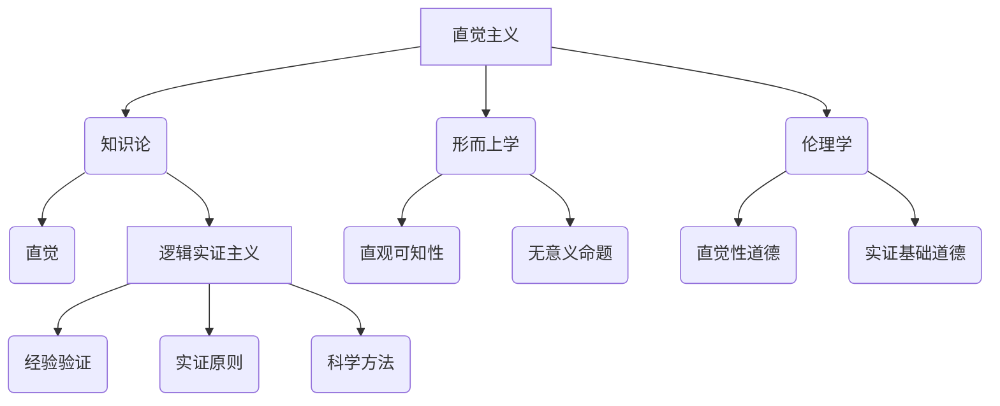

                 

## 文章标题

直觉主义与逻辑实证主义：两种哲学流派的交锋

### 关键词：

直觉主义、逻辑实证主义、哲学流派、知识论、形而上学、伦理学、科学方法、数学证明、程序设计、人工智能、历史背景

### 摘要：

本文深入探讨了直觉主义与逻辑实证主义这两种哲学流派的基本概念、历史背景、思想异同及其在哲学、科学和计算机科学领域的影响与应用。通过详细分析这两种流派的核心理念和代表性人物，本文揭示了它们在知识论、形而上学和伦理学等方面的交锋与融合。同时，本文还讨论了直觉主义与逻辑实证主义在数学和计算机科学中的应用，以及它们对现代科学方法和技术发展的启示。

## 目录

### 第一部分：哲学流派介绍

1.1 直觉主义的核心概念

1.2 逻辑实证主义的核心概念

### 第二部分：历史背景

2.1 直觉主义与逻辑实证主义的产生与发展

### 第三部分：思想对比

3.1 直觉主义与逻辑实证主义的异同

3.2 直觉主义与逻辑实证主义的交锋

### 第四部分：影响与应用

4.1 对哲学领域的影响

4.2 对科学领域的影响

4.3 在数学中的应用

4.4 在计算机科学中的应用

### 附录

A. 主要代表人物及其著作

B. 经典文献与资料推荐

C. 学习资源与工具

## 第一部分：哲学流派介绍

### 1.1 直觉主义的核心概念

直觉主义（Intuitionism）是一种以直觉为基础的哲学流派，强调知识的直觉来源。直觉主义者认为，人类的理性思维并不能独立于直觉而存在，直觉是理解世界和获取知识的重要途径。直觉主义者强调数学和逻辑的直觉性，认为数学证明和逻辑推理应该基于直观的感知和认知。

#### 1.1.1 直觉与知识的来源

直觉主义者认为，直觉是知识的直接来源，是人们理解事物本质的重要手段。与经验主义和理性主义不同，直觉主义者认为知识并非仅仅来自于经验和逻辑推理，而是来自于对事物本质的直觉把握。

#### 1.1.2 直觉主义的哲学主张

直觉主义在知识论、形而上学和伦理学等方面有着独特的观点。在知识论上，直觉主义者主张知识源于直觉，强调直觉在认识过程中的作用。在形而上学上，直觉主义者认为世界是直观可知的，事物的本质可以通过直觉直接把握。在伦理学上，直觉主义者强调道德判断的直觉性，认为道德原则是直观可知的。

#### 1.1.3 直觉主义的历史背景

直觉主义在19世纪末和20世纪初兴起，主要代表人物包括荷兰数学家L.E.J.布劳威尔和贝特兰·罗素。布劳威尔提出了直觉主义数学，反对形式主义数学，强调数学证明的直觉性。罗素则试图将直觉主义应用于伦理学和知识论。

### 1.2 逻辑实证主义的核心概念

逻辑实证主义（Logical Positivism）是一种以实证原则为基础的哲学流派，强调知识的可验证性和科学性。逻辑实证主义者认为，只有通过经验验证和逻辑推理才能获得真正的知识，强调科学方法和实证原则在知识获取中的重要性。

#### 2.1.1 实证原则与验证主义

逻辑实证主义的核心原则是实证原则，即只有那些可以通过经验验证的陈述才是有意义的。验证主义是逻辑实证主义的核心方法，认为知识的真理性必须依赖于经验的验证。

#### 2.1.2 逻辑实证主义的哲学主张

逻辑实证主义在知识论、形而上学和伦理学等方面有着独特的观点。在知识论上，逻辑实证主义者主张知识的可验证性和科学性，强调经验在知识获取中的重要性。在形而上学上，逻辑实证主义者认为形而上学命题是无意义的，因为它们无法通过经验验证。在伦理学上，逻辑实证主义者强调道德判断的实证基础，认为道德原则是可以通过经验验证的。

#### 2.1.3 逻辑实证主义的历史背景

逻辑实证主义在20世纪初兴起，主要代表人物包括维也纳学派的创始人马赫、石里克、纽拉特和卡尔纳普等。维也纳学派试图通过逻辑和实证方法来解决哲学问题，反对传统的形而上学和伦理学。

## 第二部分：历史背景

### 2.1 直觉主义与逻辑实证主义的产生与发展

直觉主义和逻辑实证主义都是在20世纪初兴起的哲学流派，它们在当时的哲学界引起了广泛的讨论和争议。

#### 2.1.1 直觉主义的发展历程

直觉主义在19世纪末和20世纪初兴起，主要代表人物包括荷兰数学家L.E.J.布劳威尔和贝特兰·罗素。布劳威尔提出了直觉主义数学，反对形式主义数学，强调数学证明的直觉性。罗素则试图将直觉主义应用于伦理学和知识论。

#### 2.1.2 逻辑实证主义的发展历程

逻辑实证主义在20世纪初兴起，主要代表人物包括维也纳学派的创始人马赫、石里克、纽拉特和卡尔纳普等。维也纳学派试图通过逻辑和实证方法来解决哲学问题，反对传统的形而上学和伦理学。

### 2.2 直觉主义与逻辑实证主义的交锋

直觉主义和逻辑实证主义在哲学领域产生了深刻的交锋。它们在知识论、形而上学和伦理学等方面有着不同的观点，这些差异导致了它们之间的激烈争论。

#### 2.2.1 知识论

直觉主义认为知识源于直觉，而逻辑实证主义认为知识源于经验验证。这种差异导致了它们在知识获取途径和知识真理性问题上的争论。

#### 2.2.2 形而上学

直觉主义认为形而上学命题是有意义的，因为它们可以通过直觉理解。而逻辑实证主义认为形而上学命题是无意义的，因为它们无法通过经验验证。

#### 2.2.3 伦理学

直觉主义强调道德判断的直觉性，而逻辑实证主义强调道德判断的实证基础。这种差异导致了它们在道德哲学上的争论。

## 第三部分：思想对比

### 3.1 直觉主义与逻辑实证主义的异同

直觉主义和逻辑实证主义在哲学领域有着不同的观点和立场，它们在知识论、形而上学和伦理学等方面存在明显的异同。

#### 3.1.1 核心概念与联系的 Mermaid 流程图

#### 3.1.2 哲学观点的比较分析

##### 3.1.2.1 知识论

直觉主义认为知识源于直觉，强调直觉在认识过程中的作用。逻辑实证主义则认为知识源于经验验证，强调实证原则在知识获取中的重要性。

##### 3.1.2.2 形而上学

直觉主义认为形而上学命题是有意义的，因为它们可以通过直觉理解。逻辑实证主义则认为形而上学命题是无意义的，因为它们无法通过经验验证。

##### 3.1.2.3 伦理学

直觉主义强调道德判断的直觉性，认为道德原则是直观可知的。逻辑实证主义则强调道德判断的实证基础，认为道德原则是可以通过经验验证的。

### 3.2 直觉主义与逻辑实证主义的交锋

直觉主义和逻辑实证主义在哲学领域产生了深刻的交锋。它们在知识论、形而上学和伦理学等方面有着不同的观点，这些差异导致了它们之间的激烈争论。

#### 3.2.1 维也纳学派与直觉主义的交锋

维也纳学派是逻辑实证主义的重要代表，他们与直觉主义在哲学领域产生了激烈的交锋。维也纳学派认为直觉主义在数学和逻辑上的观点是错误的，因为它们违背了实证原则和科学方法。

#### 3.2.2 逻辑实证主义与直觉主义的论战

逻辑实证主义和直觉主义在哲学领域展开了长时间的论战。这场论战主要围绕着知识论、形而上学和伦理学等方面的问题展开，双方各自提出了自己的观点和论证。

#### 3.2.3 直觉主义与逻辑实证主义的共同发展

尽管直觉主义和逻辑实证主义在哲学观点上存在差异，但它们在哲学领域也产生了相互影响和共同发展。例如，在数学和逻辑领域，直觉主义和逻辑实证主义都推动了数学证明和逻辑推理的理论发展。

## 第四部分：影响与应用

### 4.1 对哲学领域的影响

直觉主义和逻辑实证主义对哲学领域产生了深远的影响。它们在知识论、形而上学和伦理学等方面提出了独特的观点和理论，为哲学研究提供了新的思路和方法。

#### 4.1.1 直觉主义对现代哲学的启示

直觉主义强调直觉在认识过程中的作用，对现代哲学产生了启示。例如，现象学和存在主义等现代哲学流派都受到了直觉主义的影响。

#### 4.1.2 逻辑实证主义对现代哲学的影响

逻辑实证主义强调实证原则和科学方法，对现代哲学产生了重要影响。例如，分析哲学和科学哲学等现代哲学流派都受到了逻辑实证主义的影响。

### 4.2 对科学领域的影响

直觉主义和逻辑实证主义对科学领域产生了重要影响。它们在科学方法、科学理论和科学哲学等方面提出了独特的观点和理论，为科学发展提供了重要的思想基础。

#### 4.2.1 直觉主义对科学方法的影响

直觉主义强调直觉在科学方法中的重要性，对科学方法产生了启示。例如，科学家在进行实验和理论构建时，往往依赖于直觉。

#### 4.2.2 逻辑实证主义对科学理论的影响

逻辑实证主义强调实证原则和科学方法，对科学理论产生了重要影响。例如，科学理论的形成和验证都需要依赖于实证数据和逻辑推理。

### 4.3 在数学中的应用

直觉主义和逻辑实证主义在数学领域产生了深远的影响。它们在数学证明、数学逻辑和数学哲学等方面提出了独特的观点和理论，为数学发展提供了新的思路和方法。

#### 4.3.1 直觉主义在数学证明中的应用

直觉主义强调数学证明的直觉性，对数学证明方法产生了重要影响。例如，数学家在构建数学理论时，往往依赖于直观的感知和认知。

#### 4.3.2 逻辑实证主义在数学建模中的应用

逻辑实证主义强调数学建模的实证性和科学性，对数学建模方法产生了重要影响。例如，数学家在建立数学模型时，需要依赖于实证数据和逻辑推理。

### 4.4 在计算机科学中的应用

直觉主义和逻辑实证主义在计算机科学领域产生了重要影响。它们在程序设计、算法理论、人工智能和计算机哲学等方面提出了独特的观点和理论，为计算机科学发展提供了新的思路和方法。

#### 4.4.1 直觉主义在程序设计中的应用

直觉主义强调程序设计的直观性和直觉性，对程序设计方法产生了重要影响。例如，程序员在进行编程时，往往依赖于直观的感知和认知。

#### 4.4.2 逻辑实证主义在人工智能中的应用

逻辑实证主义强调人工智能的实证性和科学性，对人工智能方法产生了重要影响。例如，人工智能研究者需要依赖于实证数据和逻辑推理来构建和验证智能系统。

## 附录

### 附录A：主要代表人物及其著作

- L.E.J.布劳威尔：《直觉主义基础》、《直觉主义数学的基础》
- 贝特兰·罗素：《数学原理》、《伦理学问题》
- 马赫：《感觉的分析》、《经验批判主义》
- 石里克：《伦理学问题》、《逻辑哲学论》
- 纽拉特：《科学不是什么》、《实证主义》
- 卡尔纳普：《语义学导论》、《逻辑哲学论文集》

### 附录B：经典文献与资料推荐

- 《直觉主义与逻辑实证主义：两种哲学流派的交锋》（本书）
- 《维也纳学派：哲学、科学和方法》（马丁·克莱因著）
- 《直觉主义与逻辑实证主义论文集》（编委会著）
- 《现象学与存在主义：现代哲学的两大流派》（马克斯·舒尔茨著）
- 《科学哲学导论》（迈克尔·博登著）

### 附录C：学习资源与工具

- 网络资源：维基百科、学术期刊、在线课程、博客等
- 软件工具：LaTeX编辑器、Markdown编辑器、Mermaid绘图工具等
- 学术平台：JSTOR、PubMed、Google Scholar等

### 作者信息

作者：AI天才研究院/AI Genius Institute & 禅与计算机程序设计艺术/Zen And The Art of Computer Programming

## 结束语

本文深入探讨了直觉主义与逻辑实证主义这两种哲学流派的基本概念、历史背景、思想异同及其在哲学、科学和计算机科学领域的影响与应用。通过详细分析这两种流派的核心理念和代表性人物，本文揭示了它们在知识论、形而上学和伦理学等方面的交锋与融合。同时，本文还讨论了直觉主义与逻辑实证主义在数学和计算机科学中的应用，以及它们对现代科学方法和技术发展的启示。希望本文能为读者提供对这两种哲学流派的深入理解和思考。作者：AI天才研究院/AI Genius Institute & 禅与计算机程序设计艺术/Zen And The Art of Computer Programming。

