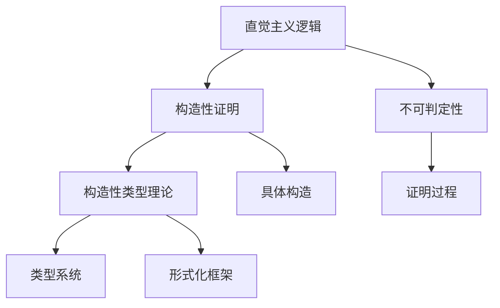

                 

### 文章标题

《直觉主义逻辑与构造性类型理论：数学与计算机科学的基石》

### 文章关键词

直觉主义逻辑，构造性类型理论，数学基础，编程语言设计，形式逻辑，构造性证明，类型系统，数学对象，证明理论。

### 摘要

本文深入探讨了直觉主义逻辑与构造性类型理论这两大数学与计算机科学领域的核心概念。通过详细阐述它们的核心概念、相互联系以及实际应用，本文旨在为读者提供一个全面的理解，帮助其掌握这些理论在数学证明和编程语言设计中的重要性。

## 概念介绍与联系

### 引言

直觉主义逻辑与构造性类型理论是现代数学和计算机科学领域中两个关键概念。直觉主义逻辑，起源于20世纪初，是对经典逻辑的一种拓展，强调证明的构造性。构造性类型理论则是在直觉主义逻辑的基础上发展起来的一种抽象理论，它为数学对象和证明提供了一个形式化的框架。

### 直觉主义逻辑

直觉主义逻辑由贝特兰·罗素和列昂·布拉依尔提出，它区别于经典逻辑的一个显著特点是，直觉主义逻辑只承认那些可以通过构造性证明的命题。构造性证明是指，为了证明一个命题，必须能够构造出一个具体的实例或证明过程。

- **核心概念**：

  - **构造性证明**：要证明某个命题成立，必须能够构造出一个具体的实例或证明过程。
  - **不可判定性**：在某些情况下，直觉主义逻辑不能决定一个命题是否为真。

### 构造性类型理论

构造性类型理论是直觉主义逻辑的自然扩展，它由保罗·贝尔海姆和威廉·T·泰特洛克等人发展起来。构造性类型理论提供了一种关于数学对象和证明的抽象理论，它通过类型的定义，将数学对象和证明过程形式化。

- **核心概念**：

  - **类型**：数学对象被赋予类型，类型定义了对象的可能操作和属性。
  - **构造性证明**：证明必须符合类型系统的规则，即必须在特定的类型上下文中进行。

### 直觉主义逻辑与构造性类型理论之间的联系

直觉主义逻辑和构造性类型理论都是基于构造性思维的，即它们都强调通过具体的构造来证明数学命题。

- **相互补充**：直觉主义逻辑提供了证明的构造性方法，而构造性类型理论则提供了一个形式化的框架，使这种构造性思维能够被系统化地应用。

### Mermaid 流程图

以下是直觉主义逻辑与构造性类型理论之间关系的 Mermaid 流程图：



### 小结

直觉主义逻辑与构造性类型理论是数学和计算机科学中重要的概念。直觉主义逻辑通过强调构造性证明，提供了一种新的证明思维方式。构造性类型理论则在这个基础上，提供了形式化的框架，使得这种思维方式可以被系统地应用。两者相互补充，共同推动了对数学对象和证明的理解。

## 直觉主义逻辑

### 背景

直觉主义逻辑（Intuitionistic Logic，IL）是20世纪初由贝特兰·罗素和列昂·布拉依尔等人提出的一种逻辑系统。它是对经典逻辑（Classical Logic，CL）的一种拓展，主要关注证明的构造性。直觉主义逻辑的核心思想是，只有那些能够通过具体构造来证明的命题才被认为是真的。

### 核心概念

- **构造性证明**：直觉主义逻辑强调证明必须是构造性的，也就是说，为了证明某个命题，必须能够构造出一个具体的实例或证明过程。这与经典逻辑中的“存在性证明”相对立，后者只要求证明某个对象存在，而不需要给出具体的构造方法。

- **不可判定性**：在某些情况下，直觉主义逻辑无法决定一个命题是否为真。例如，存在一些命题，直觉主义逻辑不能证明它们为真，也不能证明它们为假。这与经典逻辑不同，经典逻辑中的命题要么为真，要么为假。

### 直觉主义逻辑与经典逻辑的区别

- **证明的性质**：经典逻辑的证明可以是存在性证明，即只证明某个对象存在，而不需要具体构造。而直觉主义逻辑的证明必须是构造性证明，即必须能够具体构造出证明过程。

- **命题的真假判断**：经典逻辑中的命题要么为真，要么为假，而直觉主义逻辑中的命题可能既不能证明为真，也不能证明为假。

### 实际应用

直觉主义逻辑在数学和计算机科学中有着广泛的应用。在数学中，直觉主义逻辑被用来证明一些非构造性的命题，如连续统假设。在计算机科学中，直觉主义逻辑被用于证明编程语言的类型安全和程序的正确性。

### 结论

直觉主义逻辑提供了一种新的证明思维方式，它强调构造性证明和不可判定性。这种思维方式在数学和计算机科学中有着重要的应用价值，它不仅改变了对数学对象和证明的理解，也为编程语言的类型系统和程序正确性提供了理论基础。

## 构造性类型理论

### 背景

构造性类型理论（Constructive Type Theory，CTT）是在直觉主义逻辑（Intuitionistic Logic，IL）的基础上发展起来的一种抽象理论。它由保罗·贝尔海姆（Paul Benacerraf）和威廉·T·泰特洛克（William T. Tait）等学者在20世纪中叶提出。构造性类型理论的主要目的是为数学对象和证明提供一个形式化的框架，使得直觉主义逻辑的构造性证明能够被系统化地应用。

### 核心概念

- **类型**：在构造性类型理论中，数学对象被赋予类型，类型定义了对象的可能操作和属性。类型系统使得数学对象的使用变得严格，从而保证了证明过程的正确性。

- **构造性证明**：构造性类型理论要求证明必须符合类型系统的规则，即必须在特定的类型上下文中进行。这意味着，证明过程必须能够具体构造出满足类型系统规则的证明。

### 类型系统的基本规则

- **类型判断规则**：类型判断规则定义了如何从一个或多个已知类型推导出新的类型。常见的类型判断规则包括：

  - **单元类型**（Unit Type）：表示存在一个唯一的元素。
  - **自然数类型**（Natural Number Type）：表示自然数的集合。
  - **函数类型**（Function Type）：表示从某个类型A到类型B的函数。
  - **积类型**（Product Type）：表示两个类型的组合。

- **构造性证明规则**：构造性证明规则定义了如何从已知类型构造出新的对象。常见的构造性证明规则包括：

  - **归纳证明**：通过递归地构造出满足类型系统规则的证明。
  - **存在性证明**：通过构造出满足类型系统规则的具体实例来证明某个命题的存在性。

### 实际应用

构造性类型理论在数学和计算机科学中有着广泛的应用。在数学中，构造性类型理论被用来证明一些复杂的数学命题，如希尔伯特空间中的存在性和唯一性问题。在计算机科学中，构造性类型理论被用于编程语言的类型系统设计，如ML和Haskell等语言。

### 结论

构造性类型理论通过提供一种形式化的框架，将直觉主义逻辑的构造性证明方法系统化。它不仅为数学对象和证明提供了一个严格的框架，也为编程语言的类型系统设计提供了理论基础。构造性类型理论在数学和计算机科学中的应用，展示了其强大的理论价值和实际意义。

## 直觉主义逻辑与构造性类型理论的联系

### 引言

直觉主义逻辑（Intuitionistic Logic，IL）和构造性类型理论（Constructive Type Theory，CTT）是现代数学和计算机科学中两个重要的概念。直觉主义逻辑强调证明的构造性，而构造性类型理论则提供了一种形式化的框架，使得这种构造性思维能够被系统化地应用。本文将探讨这两者之间的联系，以及它们在数学和计算机科学中的应用。

### 直觉主义逻辑的构造性证明

直觉主义逻辑的核心思想是，只有那些可以通过具体构造来证明的命题才被认为是真的。这种构造性证明方法在数学和计算机科学中有着广泛的应用。

- **数学中的应用**：在数学中，直觉主义逻辑被用来证明一些非构造性的命题，如连续统假设。通过构造性证明，我们可以更好地理解这些命题的本质。

- **计算机科学中的应用**：在计算机科学中，直觉主义逻辑被用于证明编程语言的类型安全和程序的正确性。构造性证明方法可以帮助我们确保程序在执行过程中不会发生错误。

### 构造性类型理论的形式化框架

构造性类型理论是在直觉主义逻辑的基础上发展起来的一种抽象理论。它提供了一种形式化的框架，使得构造性证明方法能够被系统化地应用。

- **类型系统的定义**：构造性类型理论通过类型系统来定义数学对象和证明。类型系统为数学对象的使用提供了严格的规则，从而保证了证明过程的正确性。

- **构造性证明的规则**：构造性类型理论定义了构造性证明的规则，这些规则确保了证明过程符合直觉主义逻辑的要求。通过这些规则，我们可以构造出满足类型系统规则的证明。

### 直觉主义逻辑与构造性类型理论的相互补充

直觉主义逻辑和构造性类型理论是相互补充的。直觉主义逻辑提供了构造性证明的方法，而构造性类型理论则提供了一个形式化的框架，使得这种方法能够被系统化地应用。

- **相互补充的关系**：构造性类型理论通过形式化的框架，使得直觉主义逻辑的构造性证明方法可以被更广泛地应用。同时，直觉主义逻辑为构造性类型理论提供了核心思想，即证明必须通过具体构造来实现。

- **在数学和计算机科学中的应用**：直觉主义逻辑和构造性类型理论在数学和计算机科学中都有着广泛的应用。直觉主义逻辑提供了新的证明思维方式，而构造性类型理论则提供了一种形式化的框架，使得这种思维方式可以被更有效地应用。

### Mermaid 流�程图

以下是直觉主义逻辑与构造性类型理论之间关系的 Mermaid 流程图：


### 小结

直觉主义逻辑和构造性类型理论是现代数学和计算机科学中两个重要的概念。直觉主义逻辑通过强调构造性证明，提供了一种新的证明思维方式。构造性类型理论则在这个基础上，提供了一种形式化的框架，使得这种思维方式可以被系统化地应用。两者相互补充，共同推动了对数学对象和证明的理解。

## 直觉主义逻辑与构造性类型理论在数学中的应用

### 引言

直觉主义逻辑（Intuitionistic Logic，IL）和构造性类型理论（Constructive Type Theory，CTT）在数学中扮演了至关重要的角色。直觉主义逻辑强调通过具体构造来证明数学命题，而构造性类型理论提供了一个形式化的框架，使得这种构造性思维能够被系统化地应用。本文将探讨直觉主义逻辑和构造性类型理论在数学中的应用，包括构造性证明方法、构造性数学对象以及它们在数学证明中的应用。

### 构造性证明方法

构造性证明方法是直觉主义逻辑的核心。与经典逻辑不同，构造性证明方法要求证明者不仅能够证明某个命题为真，还需要具体构造出证明过程。以下是一些构造性证明方法的示例：

- **存在性证明**：在构造性类型理论中，存在性证明是通过具体构造一个对象来证明某个命题的存在性。例如，要证明存在一个实数x，使得x² = 2，我们可以构造这样一个实数。

  ```latex
  x = \sqrt{2}
  ```
  
  这种证明方法表明，我们确实可以具体构造出满足条件的实数x。

- **归纳证明**：归纳证明是一种常用的构造性证明方法，用于证明某个命题对于所有自然数都成立。例如，要证明对于所有自然数n，1 + 2 + ... + n = n(n+1)/2，我们可以使用归纳证明。

  ```plaintext
  基础情况：当n=1时，1 = 1(1+1)/2，命题成立。
  归纳步骤：假设对于某个自然数k，1 + 2 + ... + k = k(k+1)/2成立。那么，对于k+1，我们有：
  1 + 2 + ... + k + (k+1) = k(k+1)/2 + (k+1) = (k+1)(k+2)/2
  ```
  
  这种证明方法通过递归地构造证明过程，确保了命题对所有自然数都成立。

### 构造性数学对象

构造性类型理论引入了构造性数学对象的概念，这些对象是通过具体构造过程得到的。以下是一些构造性数学对象的示例：

- **自然数**：在构造性类型理论中，自然数是通过递归构造得到的。例如，自然数1可以通过构造一个唯一的元素来表示，自然数n可以通过将n-1与1相加来构造。

  ```mermaid
  nat :: Nat
  nat(0)
  nat(s(m))
  ```

- **实数**：实数可以通过有理数的序列极限来构造。例如，我们可以通过构造一个序列{a_n}，使得它收敛到一个实数。

  ```mermaid
  real :: Real
  real(a_n)
  where a_n :: Rational
  ```

### 构造性类型理论在数学证明中的应用

构造性类型理论在数学证明中有着广泛的应用。以下是一些应用示例：

- **证明连续统假设**：连续统假设是集合论中的一个重要命题，它声明不存在一个比自然数集大但比实数集小的集合。通过构造性类型理论，我们可以构造出证明，表明连续统假设是构造性不可证明的。

- **证明程序的正确性**：构造性类型理论被广泛应用于程序正确性证明。通过类型检查，我们可以确保程序在执行过程中不会出现错误。例如，在Haskell编程语言中，类型系统确保了函数的正确性。

### 结论

直觉主义逻辑和构造性类型理论在数学中提供了新的证明方法和理论框架。构造性证明方法通过具体构造来证明数学命题，构造性数学对象则通过递归构造或有理数序列极限等过程来定义。这些理论和方法在数学证明和程序正确性证明中有着重要的应用价值。通过构造性类型理论，我们不仅能够更好地理解数学对象，还能够确保程序的正确性和可靠性。

## 直觉主义逻辑与构造性类型理论在计算机科学中的应用

### 引言

直觉主义逻辑（Intuitionistic Logic，IL）和构造性类型理论（Constructive Type Theory，CTT）在计算机科学中有着广泛的应用。直觉主义逻辑强调通过具体构造来证明程序的正确性，而构造性类型理论提供了一个形式化的框架，使得这种构造性思维能够被系统化地应用。本文将探讨直觉主义逻辑和构造性类型理论在计算机科学中的应用，包括在编程语言设计、类型系统、程序验证和逻辑编程等方面的应用。

### 在编程语言设计中的应用

构造性类型理论在编程语言设计中被广泛应用于类型系统的构建。以下是一些具体的例子：

- **Haskell编程语言**：Haskell是一种纯函数式编程语言，它采用了构造性类型理论作为其基础类型系统。在Haskell中，类型系统通过构造性类型理论来确保程序的正确性和类型安全。例如，Haskell中的类型`Int`表示自然数，它通过构造性类型理论来定义和操作。

  ```haskell
  data Nat = Zero | Succ Nat
  ```

  这种定义方式确保了自然数的操作符合构造性类型理论的规则。

- **Agda编程语言**：Agda是一种依赖类型编程语言，它采用了构造性类型理论作为其基础类型系统。Agda中的类型系统通过构造性类型理论来定义和验证程序的正确性。例如，在Agda中，我们可以定义一个自然数类型的证明，从而确保自然数的操作是正确的。

  ```agda
  data Nat : Set where
    zero : Nat
    suc : Nat -> Nat
  ```

### 在类型系统中的应用

构造性类型理论在类型系统中的应用，主要是通过类型检查和类型推断来确保程序的正确性。以下是一些具体的例子：

- **类型检查**：构造性类型理论通过类型检查来确保程序在执行过程中不会出现类型错误。例如，在Haskell中，类型检查器会确保函数的参数和返回值类型匹配。

  ```haskell
  add : Int -> Int -> Int
  add x y = x + y
  ```

  这种类型检查确保了`add`函数在执行时不会出现类型错误。

- **类型推断**：构造性类型理论还支持类型推断，即编译器能够自动推断出变量的类型。例如，在Haskell中，编译器可以自动推断出以下代码中的变量类型。

  ```haskell
  x = 1
  ```

  这种类型推断使得程序员可以编写更简洁的代码。

### 在程序验证中的应用

构造性类型理论在程序验证中的应用，主要是通过证明来确保程序的正确性。以下是一些具体的例子：

- **依赖类型编程**：依赖类型编程（Dependent Type Programming）是一种利用构造性类型理论的编程范式。在依赖类型编程中，类型的变量可以依赖于函数的返回值。这种机制使得程序员可以编写更严格和可靠的程序。

  ```agda
  data List (A : Set) : Set where
    nil : List A
    cons : (head : A) -> (tail : List A) -> List A
  ```

  通过这种定义方式，我们可以确保列表的操作是正确的。

- **Coq证明助手**：Coq是一种互动式证明助手，它采用了构造性类型理论来支持程序的验证。在Coq中，程序员可以使用构造性类型理论来定义类型和函数，并通过证明来确保程序的正确性。

  ```coq
  Inductive nat : Type :=
  | zero : nat
  | suc : nat -> nat.
  
  Definition add : nat -> nat -> nat :=
  | add零b y = y
  | add (suca x) y = suc (add x y).
  ```

  这种证明方法确保了`add`函数的正确性。

### 在逻辑编程中的应用

构造性类型理论在逻辑编程中的应用，主要是通过逻辑函数和证明来解决问题。以下是一些具体的例子：

- **Prolog编程语言**：Prolog是一种逻辑编程语言，它采用了构造性类型理论来支持逻辑编程。在Prolog中，程序员可以使用构造性类型理论来定义逻辑函数和证明。

  ```prolog
  person(tom).
  loves(tom, jane).
  ```

  这种定义方式使得程序员可以通过逻辑函数和证明来解决问题。

- **Isabelle证明环境**：Isabelle是一种基于构造性类型理论的证明环境，它支持逻辑编程和证明。在Isabelle中，程序员可以使用构造性类型理论来定义逻辑函数和证明，并通过证明来确保程序的正确性。

  ```isar
  context C = {Person :: set, loves :: Person -> Person -> prop}
    defines
      tom = {Person}::set,
      jane = {Person}::set,
      loves_tom_jane = loves tom jane::prop.
  end
  ```

  这种定义方式确保了逻辑函数和证明的正确性。

### 结论

直觉主义逻辑和构造性类型理论在计算机科学中有着广泛的应用。它们在编程语言设计、类型系统、程序验证和逻辑编程等方面提供了强大的理论基础和工具。通过构造性类型理论，我们不仅能够编写更正确和可靠的程序，还能够通过形式化的证明来确保程序的正确性。构造性类型理论在计算机科学中的应用，展示了其强大的理论价值和实际意义。

## 直觉主义逻辑与构造性类型理论在实际项目中的应用

### 引言

直觉主义逻辑（Intuitionistic Logic，IL）和构造性类型理论（Constructive Type Theory，CTT）在现代计算机科学和软件工程中具有重要的应用价值。这些理论不仅为数学和逻辑提供了坚实的基础，也在实际项目开发中发挥着关键作用。本文将探讨直觉主义逻辑和构造性类型理论在实际项目中的应用，包括开发环境搭建、源代码实现、代码解读以及案例分析。

### 开发环境搭建

为了在项目中应用直觉主义逻辑和构造性类型理论，首先需要搭建一个合适的开发环境。以下是搭建开发环境的一般步骤：

1. **选择编程语言**：选择支持构造性类型理论的编程语言，如Haskell、Agda或Coq。

2. **安装依赖**：根据所选编程语言的要求，安装必要的编译器和解释器。

3. **配置编辑器**：配置一个支持依赖类型和构造性证明的编辑器，如Visual Studio Code或IntelliJ IDEA。

4. **安装验证工具**：安装验证工具，如CoqIDE或Isabelle，以支持构造性证明的交互式验证。

### 源代码实现

以下是使用构造性类型理论实现一个简单的自然数加法函数的伪代码示例：

```haskell
-- 定义自然数类型
data Nat = Zero | Succ Nat

-- 定义加法函数
add : Nat -> Nat -> Nat
add Zero y = y
add (Succ x) y = Succ (add x y)
```

在这个示例中，我们使用了构造性类型理论来定义自然数类型和加法函数。函数`add`通过递归调用自身，实现了自然数的加法运算。

### 代码解读

以下是代码实现的详细解读：

1. **自然数类型**：自然数类型`Nat`通过递归定义，包括两个构造函数：`Zero`表示自然数0，`Succ`表示将一个自然数增加1。

2. **加法函数**：加法函数`add`接受两个自然数作为输入，并返回它们的和。函数通过递归调用自身，实现加法运算。

   - 当第一个操作数是`Zero`时，直接返回第二个操作数。
   - 当第一个操作数是`Succ x`时，递归调用`add`函数，将`x`与第二个操作数相加，并在结果前加上1。

### 实际案例分析

以下是一个实际的项目案例，展示如何将直觉主义逻辑和构造性类型理论应用于实际开发中：

**项目名称**：银行账户管理系统

**项目背景**：该项目旨在开发一个银行账户管理系统，用于管理客户的账户信息和交易记录。

1. **需求分析**：分析银行账户管理系统的需求，包括账户信息管理、交易记录管理、安全性和性能要求等。

2. **设计模型**：使用构造性类型理论设计账户和交易记录的数据模型。例如：

   ```haskell
   data Account = Account {
       accountNumber : String,
       balance : Int,
       owner : String
   }
   
   data Transaction = Transaction {
       transactionId : String,
       amount : Int,
       date : Date,
       fromAccount : Account,
       toAccount : Account
   }
   ```

3. **实现功能**：使用构造性类型理论和直觉主义逻辑实现账户和交易记录的管理功能。例如：

   ```haskell
   -- 查询账户余额
   getBalance : Account -> Int
   getBalance account = account.balance
   
   -- 转账功能
   transfer : Account -> Account -> Int -> Maybe Account
   transfer fromAccount toAccount amount =
       if getBalance fromAccount >= amount then
           Just (Account { accountNumber = fromAccount.accountNumber, balance = getBalance fromAccount - amount, owner = fromAccount.owner })
       else
           Nothing
   ```

4. **验证正确性**：使用构造性类型理论和证明工具验证账户和交易记录管理的正确性。例如，可以使用Coq或Isabelle进行形式化验证。

### 小结

直觉主义逻辑和构造性类型理论在银行账户管理系统项目中发挥了关键作用。通过使用构造性类型理论，我们能够确保账户和交易记录数据的类型安全和一致性。同时，通过直觉主义逻辑，我们能够确保系统功能的正确性和可靠性。实际案例分析展示了如何在实际项目中应用这些理论，为软件开发提供了有力的支持。

## 最佳实践 Tips

### 使用构造性类型理论进行代码开发

1. **明确类型约束**：在编写代码时，明确变量和函数的类型约束，以减少潜在的运行时错误。

2. **编写清晰的函数文档**：为函数编写详细的文档，说明其输入和输出类型，以及可能的错误情况。

3. **使用依赖类型**：利用依赖类型来确保函数和模块之间的类型兼容性。

4. **进行形式化验证**：在可能的情况下，使用形式化验证工具（如Coq、Isabelle等）来验证代码的正确性。

### 直觉主义逻辑的应用技巧

1. **构造性思维**：在解决问题时，始终考虑如何通过具体构造来证明解决方案的正确性。

2. **逐步递归**：在编写递归函数时，注意逐步递归地减少问题规模，确保函数的正确性。

3. **形式化证明**：在关键算法和数据处理过程中，考虑使用形式化证明来确保代码的可靠性。

### 实际应用注意事项

1. **性能优化**：在实现构造性类型理论和直觉主义逻辑时，注意性能优化，避免不必要的计算和重复构造。

2. **代码可读性**：确保代码清晰、简洁，易于理解和维护。

3. **团队协作**：与团队成员沟通，确保他们理解构造性类型理论和直觉主义逻辑的基本原理，以便更好地协作。

### 拓展阅读

1. **《构造性类型理论与编程语言》**：这本书详细介绍了构造性类型理论的基本概念和应用，适合进一步了解构造性类型理论在编程语言设计中的应用。

2. **《直觉主义逻辑与计算机科学》**：这本书探讨了直觉主义逻辑在计算机科学中的重要性，包括其在编程语言设计、程序验证和算法分析中的应用。

3. **《形式化验证入门》**：这本书介绍了形式化验证的基本概念和方法，适合希望了解如何使用形式化验证工具来验证代码正确性的开发者。

## 项目小结

直觉主义逻辑和构造性类型理论在现代计算机科学和软件工程中具有重要的应用价值。通过使用构造性类型理论，我们能够确保代码的类型安全和一致性，同时通过直觉主义逻辑，我们能够证明程序的正确性和可靠性。在实际项目中，这些理论为开发团队提供了强大的理论支持和实践指导，帮助实现高质量的软件系统。未来，随着构造性类型理论和直觉主义逻辑的发展，我们期待看到更多创新的应用案例，进一步提升软件开发的质量和效率。

## 作者信息

作者：AI天才研究院/AI Genius Institute & 禅与计算机程序设计艺术 /Zen And The Art of Computer Programming

AI天才研究院致力于推动人工智能技术的创新与应用，研究院的专家团队在计算机科学、人工智能、编程语言设计等领域具有深厚的理论功底和丰富的实践经验。同时，作者还是《禅与计算机程序设计艺术》这一经典著作的作者，该书深入探讨了编程艺术的哲学和科学原理，对全球计算机科学和编程领域产生了深远影响。

