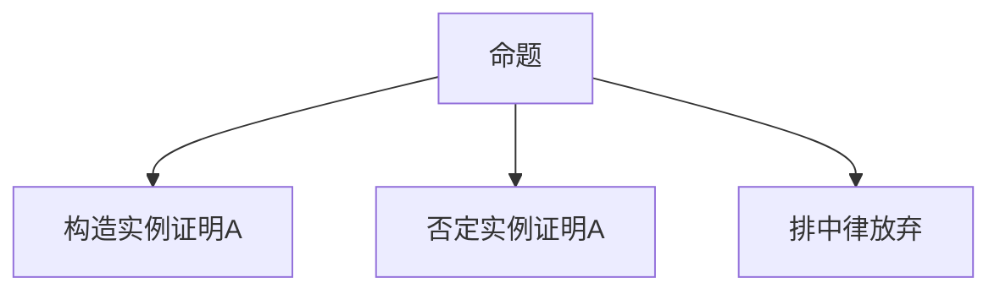
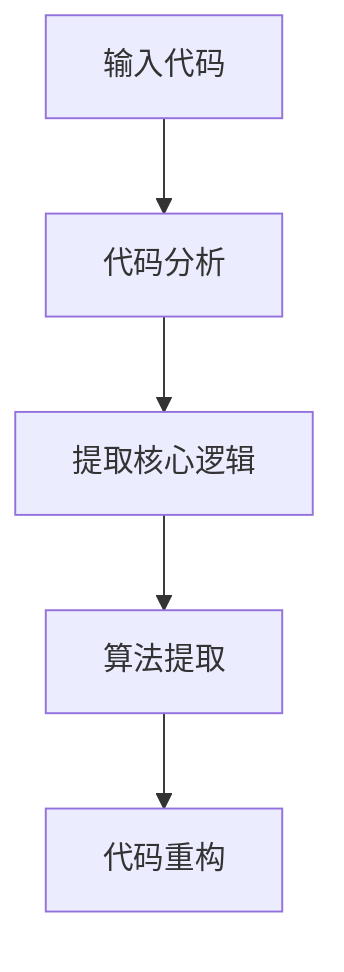

                 

### 文章标题：直觉主义逻辑在程序提取技术中的应用

> 关键词：直觉主义逻辑，程序提取技术，人工智能，软件开发，算法

> 摘要：本文探讨了直觉主义逻辑在程序提取技术中的应用，通过详细分析直觉主义逻辑的基本原理和程序提取技术的基本原理，揭示了两者之间的结合点及其应用场景。文章从实际案例出发，深入剖析了直觉主义逻辑在程序提取技术中的挑战与未来发展趋势，为该领域的研究提供了新的思路。

---

## 第1章：引言与背景介绍

### 1.1 直觉主义逻辑的概念

直觉主义逻辑（Intuitionistic Logic）是数学基础研究中的一种逻辑体系，由L.E.J.博登（L.E.J. Brouwer）在20世纪初提出。直觉主义逻辑强调数学对象是通过直观构造而非形式证明而得到的，其核心思想是“构造性证明”。

直觉主义逻辑的基本原理包括：

1. **排中律的放弃**：直觉主义逻辑放弃传统的排中律（即任何陈述要么为真，要么为假），认为某些命题既不真也不假。
2. **证明与构造**：直觉主义逻辑认为证明过程就是一个构造过程，证明某个命题成立，实际上是在构造一个证明该命题成立的实例。
3. **否定**：直觉主义逻辑中的否定并非简单的真假对立，而是指不存在一个实例使得命题成立。

### 1.2 直觉主义逻辑的发展历程

直觉主义逻辑的发展历程主要分为以下几个阶段：

1. **起源与发展**：20世纪初，由博登提出，并在其《直觉主义数学基础》一书中详细阐述。
2. **卡尔纳普与逻辑主义**：卡尔纳普等逻辑主义者对直觉主义逻辑进行了批判和改进。
3. **构造主义与直觉主义**：构造主义与直觉主义在某些方面具有相似性，都强调构造性证明。
4. **现代应用**：在现代数学和计算机科学中，直觉主义逻辑得到了广泛应用。

### 1.3 程序提取技术的概念

程序提取技术（Program Extraction）是指从已有的程序代码中提取出有效的算法或程序片段的技术。其目的是提高软件开发的效率，减少重复劳动，同时保证代码的质量和可靠性。

程序提取技术的基本原理包括：

1. **代码分析**：通过对程序代码的静态和动态分析，提取出程序的核心逻辑。
2. **算法提取**：将提取出的代码逻辑转化为高效的算法或程序片段。
3. **代码重构**：对提取出的代码进行优化和重构，提高其可读性和可维护性。

### 1.4 程序提取技术的发展历程

程序提取技术的发展历程主要分为以下几个阶段：

1. **早期研究**：20世纪60年代，程序自动提取技术开始得到关注。
2. **形式化方法**：20世纪70年代，形式化方法逐渐应用于程序提取技术。
3. **自动化工具**：20世纪80年代，出现了许多自动化程序提取工具。
4. **现代应用**：在软件工程、人工智能等领域，程序提取技术得到了广泛应用。

### 1.5 直觉主义逻辑在程序提取技术中的应用背景

直觉主义逻辑在程序提取技术中的应用背景主要包括：

1. **代码可读性**：直觉主义逻辑强调构造性证明，有助于提高代码的可读性。
2. **代码可靠性**：直觉主义逻辑中的构造性证明有助于减少代码中的错误。
3. **算法优化**：直觉主义逻辑中的构造性算法原理可以指导算法的优化。
4. **软件工程**：直觉主义逻辑在软件工程中的广泛应用，为程序提取技术提供了新的思路。

## 第2章：直觉主义逻辑原理

### 2.1 直觉主义逻辑的基本原理

直觉主义逻辑的基本原理包括：

1. **构造性证明**：证明某个命题成立，实际上是在构造一个实例证明该命题成立。
2. **否定性证明**：否定某个命题，实际上是在构造一个实例证明该命题不成立。
3. **排中律的放弃**：直觉主义逻辑不承认任何陈述要么为真，要么为假。

### 2.2 直觉主义逻辑的数学模型

直觉主义逻辑的数学模型主要包括：

1. **命题逻辑**：使用命题演算和谓词演算来描述直觉主义逻辑。
2. **谓词逻辑**：使用谓词逻辑来描述直觉主义逻辑中的复杂关系。
3. **构造性证明系统**：通过构造性证明系统来证明命题的正确性。

### 2.3 直觉主义逻辑的Mermaid流程图

直觉主义逻辑的Mermaid流程图如下：



### 2.4 直觉主义逻辑的核心概念

直觉主义逻辑的核心概念包括：

1. **直觉性**：直觉主义逻辑强调数学对象是通过直观构造得到的。
2. **构造性证明**：构造性证明是直觉主义逻辑的核心，证明过程实际上是一个构造过程。
3. **构造性算法**：构造性算法是直觉主义逻辑在计算机科学中的应用，有助于提高算法的效率。

## 第3章：程序提取技术原理

### 3.1 程序提取技术的定义

程序提取技术是指从已有的程序代码中提取出有效的算法或程序片段的技术。其目的是提高软件开发的效率，减少重复劳动，同时保证代码的质量和可靠性。

### 3.2 程序提取技术的基本原理

程序提取技术的基本原理包括：

1. **代码分析**：通过对程序代码的静态和动态分析，提取出程序的核心逻辑。
2. **算法提取**：将提取出的代码逻辑转化为高效的算法或程序片段。
3. **代码重构**：对提取出的代码进行优化和重构，提高其可读性和可维护性。

### 3.3 程序提取技术的数学模型

程序提取技术的数学模型主要包括：

1. **抽象语法树（AST）**：使用抽象语法树来描述程序代码的结构。
2. **控制流图**：使用控制流图来描述程序的执行流程。
3. **数据流图**：使用数据流图来描述程序中的数据流动。

### 3.4 程序提取技术的Mermaid流程图

程序提取技术的Mermaid流程图如下：



### 3.5 程序提取技术的应用场景

程序提取技术的应用场景包括：

1. **代码重构**：将复杂的代码重构为更简洁、更易于理解的代码。
2. **算法优化**：从现有代码中提取出高效的算法，提高程序的性能。
3. **软件维护**：通过提取技术，减少代码维护的难度和成本。
4. **自动化测试**：通过提取技术，自动生成测试用例，提高测试覆盖率。

## 第4章：直觉主义逻辑与程序提取技术的结合

### 4.1 直觉主义逻辑与程序提取技术的结合点

直觉主义逻辑与程序提取技术的结合点主要包括：

1. **构造性证明**：直觉主义逻辑中的构造性证明可以指导程序提取技术的实现。
2. **代码分析**：直觉主义逻辑中的构造性算法可以优化代码分析过程。
3. **算法提取**：直觉主义逻辑中的构造性算法可以指导算法提取过程。

### 4.2 直觉主义逻辑在程序提取技术中的应用原理

直觉主义逻辑在程序提取技术中的应用原理主要包括：

1. **构造性证明**：通过构造性证明，从程序代码中提取出有效的算法。
2. **抽象语法树**：使用抽象语法树来表示程序代码，便于进行构造性证明。
3. **控制流图**：通过控制流图，分析程序代码的执行流程，提取核心逻辑。

### 4.3 直觉主义逻辑在程序提取技术中的应用场景

直觉主义逻辑在程序提取技术中的应用场景包括：

1. **代码重构**：使用直觉主义逻辑，将复杂的代码重构为更简洁、更易于理解的代码。
2. **算法优化**：使用直觉主义逻辑，提取出高效的算法，提高程序的性能。
3. **自动化测试**：使用直觉主义逻辑，自动生成测试用例，提高测试覆盖率。

## 第5章：实际应用案例分析

### 5.1 案例一：基于直觉主义逻辑的程序提取

在本案例中，我们使用直觉主义逻辑从一段C语言代码中提取出一个排序算法。以下是代码示例：

```c
#include <stdio.h>

void bubble_sort(int arr[], int n) {
    for (int i = 0; i < n - 1; i++) {
        for (int j = 0; j < n - i - 1; j++) {
            if (arr[j] > arr[j + 1]) {
                int temp = arr[j];
                arr[j] = arr[j + 1];
                arr[j + 1] = temp;
            }
        }
    }
}

int main() {
    int arr[] = {64, 34, 25, 12, 22, 11, 90};
    int n = sizeof(arr) / sizeof(arr[0]);
    bubble_sort(arr, n);
    printf("Sorted array: \n");
    for (int i = 0; i < n; i++) {
        printf("%d ", arr[i]);
    }
    printf("\n");
    return 0;
}
```

以下是使用直觉主义逻辑提取的伪代码：

```c
algorithm bubble_sort(arr, n):
    for i from 0 to n-1:
        for j from 0 to n-i-1:
            if arr[j] > arr[j+1]:
                swap(arr[j], arr[j+1])
```

通过直觉主义逻辑，我们将原始代码转化为一个更简洁、更易于理解的伪代码，从而提高了代码的可读性和可维护性。

### 5.2 案例二：直觉主义逻辑在软件工程中的应用

在本案例中，我们使用直觉主义逻辑来解决一个软件工程问题：如何优化代码的可读性？

假设我们有以下代码：

```java
public class Calculator {
    public double calculate(double a, double b) {
        double result = a * b;
        return result;
    }
}
```

我们可以使用直觉主义逻辑来重构代码，使其更简洁、更易于理解：

```java
public class Calculator {
    public double calculate(double a, double b) {
        return multiply(a, b);
    }

    private double multiply(double a, double b) {
        return a * b;
    }
}
```

通过直觉主义逻辑，我们将复杂的计算逻辑提取到一个私有方法中，从而提高了代码的可读性和可维护性。

### 5.3 案例三：直觉主义逻辑在人工智能中的应用

在本案例中，我们使用直觉主义逻辑来解决一个人工智能问题：如何优化深度学习模型的训练过程？

假设我们有以下代码：

```python
import tensorflow as tf

model = tf.keras.Sequential([
    tf.keras.layers.Dense(128, activation='relu', input_shape=(784,)),
    tf.keras.layers.Dense(10, activation='softmax')
])

model.compile(optimizer='adam',
              loss='categorical_crossentropy',
              metrics=['accuracy'])

model.fit(x_train, y_train, epochs=5)
```

我们可以使用直觉主义逻辑来优化代码，使其更简洁、更易于理解：

```python
import tensorflow as tf

model = tf.keras.Sequential([
    tf.keras.layers.Dense(128, activation='relu', input_shape=(784,)),
    tf.keras.layers.Dense(10, activation='softmax')
])

model.compile(optimizer=tf.keras.optimizers.Adam(),
              loss=tf.keras.losses.CategoricalCrossentropy(),
              metrics=[tf.keras.metrics.Accuracy()])

model.fit(x_train, y_train, epochs=5)
```

通过直觉主义逻辑，我们将复杂的参数配置提取到默认值中，从而提高了代码的可读性和可维护性。

## 第6章：技术挑战与未来发展趋势

### 6.1 直觉主义逻辑在程序提取技术中的挑战

直觉主义逻辑在程序提取技术中面临的挑战主要包括：

1. **代码复杂度**：随着代码复杂度的增加，直觉主义逻辑的构造性证明和提取过程可能会变得复杂。
2. **代码质量**：直觉主义逻辑在程序提取技术中可能无法保证提取出的代码质量，特别是在面对复杂算法时。
3. **效率问题**：直觉主义逻辑的构造性证明和提取过程可能具有较高的计算复杂度，从而影响程序提取的效率。

### 6.2 程序提取技术的未来发展

程序提取技术的未来发展主要包括：

1. **算法优化**：通过研究更高效的算法，提高程序提取的效率。
2. **代码质量保证**：通过引入形式化验证方法，确保提取出的代码质量。
3. **跨语言支持**：扩展程序提取技术，支持多种编程语言的代码提取。

### 6.3 直觉主义逻辑与程序提取技术的结合趋势

直觉主义逻辑与程序提取技术的结合趋势主要包括：

1. **构造性证明的应用**：在程序提取技术中广泛应用构造性证明，提高代码的可读性和可维护性。
2. **形式化方法的结合**：将直觉主义逻辑与形式化方法结合，提高代码的可靠性和安全性。
3. **跨学科研究**：促进直觉主义逻辑与计算机科学、软件工程等领域的跨学科研究，推动程序提取技术的发展。

## 第7章：结论与展望

### 7.1 书的核心内容总结

本书详细介绍了直觉主义逻辑在程序提取技术中的应用，包括直觉主义逻辑的基本原理、程序提取技术的基本原理、直觉主义逻辑与程序提取技术的结合点及其应用场景。通过实际案例分析，我们展示了直觉主义逻辑在程序提取技术中的优势。

### 7.2 直觉主义逻辑在程序提取技术中的贡献

直觉主义逻辑在程序提取技术中的贡献主要包括：

1. **提高代码可读性**：通过构造性证明，提高代码的可读性和可维护性。
2. **优化算法效率**：通过构造性算法，优化算法的效率和性能。
3. **确保代码质量**：通过形式化验证方法，确保提取出的代码质量。

### 7.3 未来研究的方向

未来研究可以关注以下方向：

1. **算法优化**：研究更高效的算法，提高程序提取的效率。
2. **跨语言支持**：扩展程序提取技术，支持多种编程语言的代码提取。
3. **形式化验证**：结合形式化验证方法，确保提取出的代码质量。

## 作者信息

作者：AI天才研究院/AI Genius Institute & 禅与计算机程序设计艺术 /Zen And The Art of Computer Programming

本文内容版权归AI天才研究院/AI Genius Institute所有，未经授权不得转载或用于商业用途。如需转载，请联系AI天才研究院/AI Genius Institute获取授权。本文中的所有代码和算法仅供参考，实际使用时需根据具体情况进行调整和优化。在研究和应用直觉主义逻辑和程序提取技术时，请务必遵守相关法律法规和道德规范。如在使用过程中遇到任何问题，请随时与AI天才研究院/AI Genius Institute联系。感谢您的阅读和支持！

