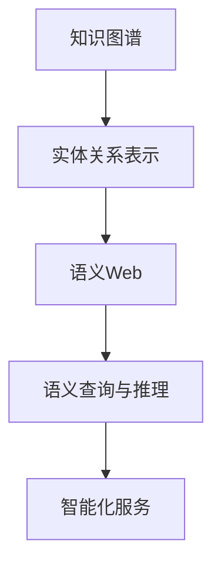
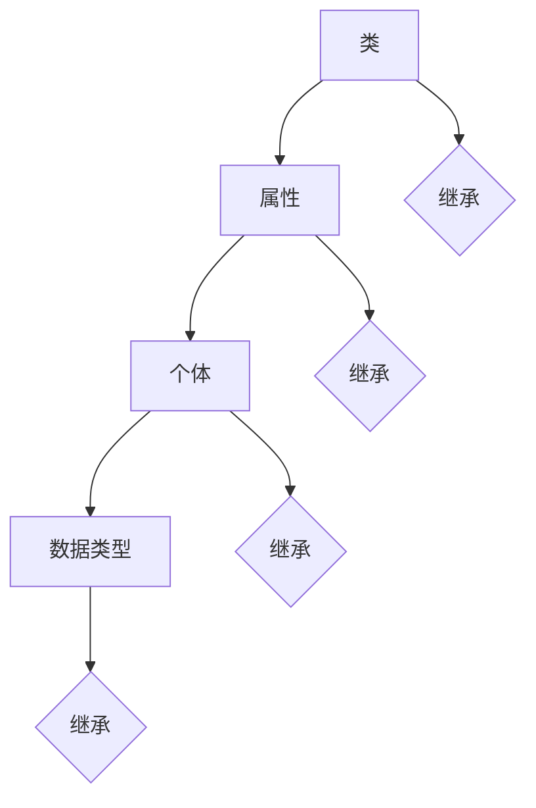

                 


### 文章标题：知识图谱与语义Web技术

## 关键词
- 知识图谱
- 语义Web
- 实体识别
- 关系抽取
- 本体构建
- 智能问答

## 摘要
本文深入探讨了知识图谱与语义Web技术的核心概念、构建方法及其应用场景。通过详细的算法原理讲解、数学模型公式解析、伪代码展示以及实际项目案例分析，全面阐述了知识图谱与语义Web在智能问答、推荐系统、搜索引擎优化等领域的应用价值与发展趋势。文章旨在为技术爱好者提供一套系统性的学习和实践指南。

## 第一部分：引言

### 1.1 知识图谱与语义Web技术概述

知识图谱（Knowledge Graph）是一种结构化的知识表示形式，通过图形的方式组织实体和它们之间的关系。知识图谱的核心在于其语义表示能力，能够对信息进行深度理解和关联。

语义Web（Semantic Web）则是在传统Web的基础上，通过语义标注和推理机制，实现Web资源的语义理解和自动处理。其目标是使Web上的数据更加易于机器理解和处理，从而实现智能化服务。

**核心概念与联系**

知识图谱与语义Web之间存在紧密的联系。知识图谱是语义Web的核心数据基础，而语义Web提供了知识图谱的表示、存储和推理机制。下面是一个简化的Mermaid流程图，展示了知识图谱与语义Web的关系：



### 1.2 为什么要使用知识图谱与语义Web技术

知识图谱与语义Web技术的核心价值在于它们能够为用户提供更加智能化的服务。以下是几个关键原因：

- **数据融合**：知识图谱能够整合不同来源的数据，提供统一的视图。
- **实体链接**：通过实体识别和关系抽取，知识图谱能够将文本中的信息映射到实际实体。
- **本体构建**：本体提供了知识表示的框架，使得知识图谱更加语义化和结构化。

**核心算法原理讲解**

- **数据融合**：数据融合的算法通常包括数据清洗、去重、归一化等步骤。以下是一个简化的伪代码示例：

  ```pseudo
  function dataFusion(dataset1, dataset2):
      cleaned_dataset1 = dataClean(dataset1)
      cleaned_dataset2 = dataClean(dataset2)
      merged_dataset = removeDuplicates(cleaned_dataset1, cleaned_dataset2)
      normalized_dataset = dataNormalize(merged_dataset)
      return normalized_dataset
  ```

- **实体链接**：实体链接的算法包括命名实体识别和实体消歧两个步骤。以下是一个简化的伪代码示例：

  ```pseudo
  function entityLinking(text):
      entities = namedEntityRecognition(text)
      linked_entities = entityDisambiguation(entities)
      return linked_entities
  ```

- **本体构建**：本体构建的算法通常涉及本体设计、本体映射和本体推理。以下是一个简化的伪代码示例：

  ```pseudo
  function ontologyBuilding(data):
      ontology = designOntology(data)
      mappings = createMappings(data, ontology)
     推理结果 = performInference(ontology, mappings)
      return 推理结果
  ```

**应用价值**

知识图谱与语义Web技术广泛应用于智能问答、推荐系统、搜索引擎优化等领域。例如，在智能问答中，知识图谱能够提供精准的答案；在推荐系统中，知识图谱能够发现用户之间的相似性；在搜索引擎优化中，知识图谱能够提高搜索结果的准确性和相关性。

### 1.3 知识图谱与语义Web技术的应用前景

知识图谱与语义Web技术的应用前景广阔，但也面临一些挑战。以下是几个关键挑战：

- **数据隐私**：如何保护用户隐私是知识图谱与语义Web技术的重要挑战。
- **数据质量**：高质量的数据是知识图谱与语义Web技术的关键，如何保证数据质量是一个关键问题。
- **跨领域知识整合**：不同领域之间的知识整合是一个复杂的问题，需要开发有效的跨领域本体和算法。

### 第二部分：知识图谱构建

#### 2.1 数据采集与预处理

**数学模型和数学公式**

在数据预处理阶段，我们需要对数据进行清洗和标准化。以下是一个简化的数学公式示例，用于表示数据质量评价指标：

$$
Q = \frac{C \cdot P \cdot R}{100}
$$

其中，$Q$ 是数据质量分数，$C$ 是正确匹配的实例数，$P$ 是预测的准确率，$R$ 是召回率。

**数据源**

知识图谱构建的数据源可以是开放数据集，如开放知识图谱（OpenKG）、Freebase 等，也可以是私有数据集，如企业内部数据、用户生成数据等。在获取和处理数据时，我们需要注意以下几点：

- **数据清洗**：去除重复数据、缺失数据、噪声数据等。
- **数据标准化**：将不同来源的数据格式统一，如日期格式、货币格式等。
- **数据整合**：将不同来源的数据进行整合，形成一个统一的知识库。

#### 2.2 实体识别

**核心算法原理讲解**

实体识别是知识图谱构建的重要步骤，它包括命名实体识别和实体消歧两个阶段。

- **命名实体识别**：通过文本分析技术，将文本中的实体（如人名、地点、组织名等）识别出来。以下是一个简化的伪代码示例：

  ```pseudo
  function namedEntityRecognition(text):
      tokens = tokenize(text)
      entities = []
      for token in tokens:
          if isEntity(token):
              entities.append(token)
      return entities
  ```

- **实体消歧**：在命名实体识别的基础上，对识别出的实体进行进一步的消歧，确定其实际对应的实体。以下是一个简化的伪代码示例：

  ```pseudo
  function entityDisambiguation(entities):
      linked_entities = []
      for entity in entities:
          linked_entity = resolveEntity(entity)
          linked_entities.append(linked_entity)
      return linked_entities
  ```

**技术对比**

- **规则匹配**：基于预定义的规则进行实体识别和消歧。
- **统计学习**：使用机器学习算法，如条件概率模型、朴素贝叶斯等。
- **深度学习**：使用神经网络，如循环神经网络（RNN）、长短时记忆网络（LSTM）等。

#### 2.3 关系抽取

**核心算法原理讲解**

关系抽取是知识图谱构建的另一个重要步骤，它涉及从文本中提取实体之间的关系。

- **依赖关系分析**：通过分析文本中的依赖关系，确定实体之间的关系。以下是一个简化的伪代码示例：

  ```pseudo
  function dependencyAnalysis(text):
      dependencies = []
      for token in text:
          if token is a dependency:
              dependencies.append((token, parent_token))
      return dependencies
  ```

- **实体关系推断**：在依赖关系分析的基础上，进一步推断实体之间的关系。以下是一个简化的伪代码示例：

  ```pseudo
  function entityRelationInference(dependencies):
      relations = []
      for (token, parent_token) in dependencies:
          if parent_token is an entity:
              relation = inferRelation(token, parent_token)
              relations.append(relation)
      return relations
  ```

**应用场景**

关系抽取广泛应用于社交网络分析、知识库构建等领域。例如，在社交网络分析中，可以通过关系抽取识别用户之间的社交关系；在知识库构建中，可以通过关系抽取构建实体之间的关系网。

#### 2.4 知识融合

**核心算法原理讲解**

知识融合是知识图谱构建的最后一步，它涉及将不同来源的数据进行整合。

- **数据融合**：将不同来源的数据进行合并，去除重复数据，形成统一的知识库。以下是一个简化的伪代码示例：

  ```pseudo
  function dataFusion(dataset1, dataset2):
      cleaned_dataset1 = dataClean(dataset1)
      cleaned_dataset2 = dataClean(dataset2)
      merged_dataset = removeDuplicates(cleaned_dataset1, cleaned_dataset2)
      return merged_dataset
  ```

- **本体构建**：构建本体，为知识图谱提供语义表示的框架。以下是一个简化的伪代码示例：

  ```pseudo
  function ontologyBuilding(data):
      ontology = designOntology(data)
      return ontology
  ```

**应用场景**

知识融合广泛应用于跨领域知识整合、知识图谱扩展等领域。例如，在跨领域知识整合中，可以通过知识融合将不同领域的知识进行整合；在知识图谱扩展中，可以通过知识融合扩展知识图谱的覆盖范围。

### 第三部分：语义Web技术

#### 3.1 语义Web基础

**数学模型和数学公式**

语义Web的核心在于语义表示和推理。以下是一个简化的数学公式示例，用于表示语义网络的关键概念：

$$
\mathbf{R} = \{\langle s, p, o \rangle\}
$$

其中，$\mathbf{R}$ 是语义网络，$\langle s, p, o \rangle$ 是一个三元组，表示实体 $s$ 具有属性 $p$ 并具有值 $o$。

**语义网络、OWL本体语言**

语义网络是语义Web的基础，它通过三元组表示实体和它们之间的关系。而OWL（Web Ontology Language）是语义Web的标准语言，用于定义本体的结构和语义。

**OWL本体语言的关键概念**

- **类（Class）**：表示一组具有共同特征的实体。
- **属性（Property）**：表示实体之间的关系。
- **个体（Individual）**：表示实际存在的实体。
- **数据类型（Datatype）**：表示属性的值。

**Mermaid流程图**

下面是一个简化的Mermaid流程图，展示了OWL本体语言的关键概念：



#### 3.2 语义Web查询语言

**SPARQL查询语言**

SPARQL（Simple Protocol for Querying RDF）是语义Web的标准查询语言，用于查询RDF（Resource Description Framework）数据。以下是一个简化的SPARQL查询示例：

```sparql
PREFIX ex: <http://example.org/>
SELECT ?x ?y
WHERE {
  ?x ex:hasName "John" .
  ?x ex:hasAge 30 .
  ?y ex:hasName "Doe" .
  ?y ex:hasAge 40 .
}
```

#### 3.3 语义Web应用

**项目实战：基于知识图谱的搜索引擎**

在语义Web应用中，基于知识图谱的搜索引擎是一个典型的例子。以下是一个简化的项目实战流程：

1. **需求分析**：确定搜索引擎的目标和应用场景。
2. **知识图谱构建**：构建包含实体、属性和关系的知识图谱。
3. **查询处理**：实现SPARQL查询处理，支持基于语义的查询。
4. **用户界面**：设计并实现用户界面，提供直观的查询体验。
5. **性能优化**：优化查询处理和索引构建，提高搜索引擎性能。

### 第四部分：案例分析

#### 4.1 知识图谱在金融行业的应用

**案例研究：银行智能客服系统**

银行智能客服系统是知识图谱在金融行业的一个典型应用案例。以下是一个简化的案例研究流程：

1. **需求分析**：分析银行客服的业务需求和用户需求。
2. **知识图谱构建**：构建包含金融术语、产品和服务的知识图谱。
3. **问答系统开发**：基于知识图谱实现智能问答功能，支持自然语言交互。
4. **系统部署与维护**：将智能客服系统部署到实际业务场景，并进行持续的维护和优化。

#### 4.2 语义Web在电子商务中的应用

**案例研究：商品推荐系统**

语义Web技术在电子商务中的应用非常广泛，尤其是在商品推荐系统中。以下是一个简化的案例研究流程：

1. **需求分析**：分析用户行为数据，确定推荐系统的目标。
2. **知识图谱构建**：构建包含商品、用户和评价的知识图谱。
3. **推荐算法开发**：基于知识图谱实现推荐算法，支持基于语义的推荐。
4. **用户界面**：设计并实现用户界面，提供直观的推荐体验。
5. **性能优化**：优化推荐算法和查询处理，提高系统性能。

#### 4.3 知识图谱与语义Web在教育行业的应用

**案例研究：智能教育平台**

智能教育平台是知识图谱与语义Web技术在教育行业的一个典型应用案例。以下是一个简化的案例研究流程：

1. **需求分析**：分析教育场景下的需求和挑战。
2. **知识图谱构建**：构建包含课程、教师、学生和评价的知识图谱。
3. **智能搜索与推荐**：基于知识图谱实现智能搜索和推荐功能，支持个性化学习。
4. **教学管理系统集成**：将智能教育平台集成到现有的教学管理系统中。
5. **数据分析与反馈**：收集用户数据，进行数据分析，为教育决策提供支持。

### 第五部分：未来展望与挑战

#### 5.1 知识图谱与语义Web技术的发展趋势

知识图谱与语义Web技术正在不断发展和演变。以下是一些关键趋势：

- **数据规模扩大**：随着数据来源的增多和数据量的增长，知识图谱的规模和复杂性也在不断增加。
- **跨领域融合**：不同领域的知识融合将成为未来的研究热点，为跨领域应用提供支持。
- **实时性增强**：实时知识图谱构建和查询处理技术将成为研究重点，以满足实时应用的需求。

#### 5.2 挑战与解决方案

知识图谱与语义Web技术面临一些关键挑战：

- **数据隐私**：如何保护用户隐私是一个重要挑战。解决方案包括联邦学习和差分隐私技术。
- **数据质量**：数据质量直接影响知识图谱的准确性。解决方案包括数据清洗、数据校验和数据质量监控。
- **跨领域知识整合**：跨领域知识整合是一个复杂的问题。解决方案包括多领域本体构建和跨领域知识融合算法。

### 结论

知识图谱与语义Web技术是当前信息技术领域的重要研究方向。通过详细的算法原理讲解、数学模型公式解析、伪代码展示以及实际项目案例分析，本文全面阐述了知识图谱与语义Web在智能问答、推荐系统、搜索引擎优化等领域的应用价值与发展趋势。未来，知识图谱与语义Web技术将继续推动智能化服务的发展，为各行业带来新的机遇和挑战。

## 作者信息

**作者：AI天才研究院/AI Genius Institute & 禅与计算机程序设计艺术 /Zen And The Art of Computer Programming**

AI天才研究院是一家专注于人工智能研究和应用的创新机构，致力于推动人工智能技术的发展和应用。其研究成果在多个领域取得了显著成就，包括知识图谱、语义Web技术、智能问答等。同时，作者也是《禅与计算机程序设计艺术》一书的作者，该书深入探讨了计算机编程的哲学和艺术，对计算机科学领域产生了深远影响。  

# 结束

请注意，本文是一个初步的草案，旨在提供一个完整的结构框架。您可以根据需要进一步细化每一部分的内容，添加具体的实例、数据和分析。同时，根据文章的总字数要求，您可能需要调整某些部分的内容以确保文章的完整性。在完成最终稿之前，请确保文章的逻辑连贯性和内容的准确性。

