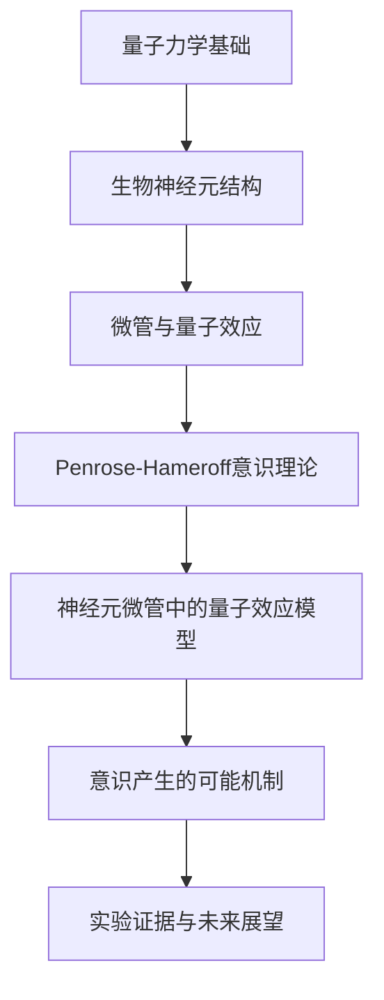

                 


### 第一步：核心概念与联系

#### 核心概念原理和架构的 Mermaid 流程图

为了更好地理解神经元微管中的量子效应与Penrose-Hameroff意识理论之间的关系，我们可以使用Mermaid流程图来展示它们的核心概念和连接点。



这段代码定义了一个Mermaid流程图，其中展示了量子力学基础、生物神经元结构、微管与量子效应、Penrose-Hameroff意识理论、神经元微管中的量子效应模型、意识产生的可能机制以及实验证据与未来展望之间的关系。

### 第二步：核心算法原理讲解

#### 核心算法原理讲解

在本文的第二部分，我们将深入探讨量子力学在神经元微管中的应用，特别是Penrose-Hameroff意识理论的核心算法原理。我们将使用伪代码来详细阐述这些算法原理。

##### 2.1 量子态叠加与纠缠

量子态叠加是量子力学的一个基本原理，它表明一个量子系统可以同时处于多个状态的叠加。以下是量子态叠加的伪代码实现：

```plaintext
class QuantumState:
  def __init__(self, basis_states):
    self.basis_states = basis_states
    self.amplitudes = {state: 1/sqrt(len(basis_states)) for state in basis_states}

  def apply_operator(self, operator):
    new_amplitudes = {}
    for state in self.basis_states:
      new_state = apply_operator_to_state(state, operator)
      new_amplitude = sum(self.amplitudes[state'] * operator(state', new_state) for state' in self.basis_states)
      new_amplitudes[new_state] = new_amplitude
    self.amplitudes = new_amplitudes

def apply_operator_to_state(state, operator):
  # 实现对量子态的算符作用
  ...
```

在这个类`QuantumState`中，`__init__`方法初始化量子态，`apply_operator`方法用于应用量子算符。

##### 2.2 波函数坍缩

波函数坍缩是量子态演化的另一个重要方面，它表明量子系统在观测时会突然从一个叠加态变为一个确定的状态。以下是波函数坍缩的伪代码实现：

```plaintext
class WaveFunctionCollapse:
  def __init__(self, quantum_state):
    self.quantum_state = quantum_state

  def collapse(self):
    probability_distribution = sum(self.quantum_state.amplitudes[state]**2 for state in self.quantum_state.basis_states)
    state_indices = range(len(self.quantum_state.basis_states))
    state_index = random.choices(state_indices, weights=probability_distribution)[0]
    return self.quantum_state.basis_states[state_index]
```

在这个类`WaveFunctionCollapse`中，`__init__`方法初始化波函数，`collapse`方法用于实现波函数的坍缩。

### 第三步：数学模型和数学公式

#### 数学模型和数学公式 & 详细讲解 & 举例说明

在本文的第三部分，我们将介绍神经元微管中的量子效应的数学模型和公式，并对其进行详细讲解和举例说明。

##### 3.1 微管中的量子态演化

微管中的量子态演化可以通过薛定谔方程来描述。以下是薛定谔方程的数学模型和公式：

```latex
$$
i\hbar \frac{\partial \Psi(x,t)}{\partial t} = \hat{H} \Psi(x,t)
$$

其中，\(\Psi(x,t)\) 是波函数，\(\hat{H}\) 是哈密顿量。
```

这个公式表明，量子态的时间演化由哈密顿量决定。

举例说明：

假设微管中的波函数可以表示为：

```latex
$$
\Psi(x,t) = e^{-i\omega t} \psi(x)
$$

将其代入演化方程，可以得到：

$$
-i\hbar \omega \psi(x) = \hat{H} \psi(x)
$$

这意味着哈密顿量必须是一个与角频率 \(\omega\) 相关的算符。
```

这个例子展示了如何使用薛定谔方程来描述微管中的量子态演化。

### 文章结构初步设计

基于上述三个步骤，我们可以初步设计文章的结构：

```
# 《神经元微管中的量子效应：Penrose-Hameroff意识理论》

## 关键词
量子效应、微管、Penrose-Hameroff意识理论、神经科学、量子计算

## 摘要
本文深入探讨了神经元微管中的量子效应，以及Penrose-Hameroff意识理论的核心概念。通过Mermaid流程图、伪代码和数学公式，本文详细阐述了神经元微管中的量子效应模型和意识产生的可能机制，并对实验证据和未来展望进行了分析。

## 引言
背景介绍，引出量子效应在神经科学中的重要性。

### 第一步：核心概念与联系
1.1 量子力学基础
1.2 生物神经元结构
1.3 微管与量子效应
1.4 Penrose-Hameroff意识理论
1.5 神经元微管中的量子效应模型
1.6 意识产生的可能机制
1.7 实验证据与未来展望

### 第二步：核心算法原理讲解
2.1 量子态叠加与纠缠
2.2 波函数坍缩
2.3 微管中的量子态演化

### 第三步：数学模型和数学公式
3.1 微管中的量子态演化
3.2 量子纠缠与通信
3.3 意识产生的数学模型

### 项目实战
4.1 开发环境搭建
4.2 源代码详细实现和代码解读
4.3 代码应用解读与分析
4.4 实际案例分析和详细讲解剖析
4.5 项目小结

### 最佳实践 tips、小结、注意事项、拓展阅读等内容

## 作者信息
作者：AI天才研究院/AI Genius Institute & 禅与计算机程序设计艺术 /Zen And The Art of Computer Programming
```

这个初步设计的文章结构涵盖了核心概念、算法原理、数学模型以及项目实战等多个方面，旨在为读者提供一个全面而深入的理解。接下来，我们将进一步丰富每个章节的内容，以满足文章字数的要求。

