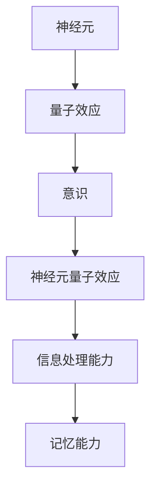

                 


### 文章标题

《神经元量子效应与意识的统一性探讨》

### 关键词

神经元、量子效应、意识、统一性、神经科学、量子计算

### 摘要

本文旨在探讨神经元量子效应与意识之间的潜在联系，通过分析神经元的工作原理、量子效应的基本原理以及意识的科学探讨，尝试构建一个神经元与量子效应相互作用的模型，并探索其对意识形成的影响。文章首先介绍了神经元的基础知识，包括神经元结构、工作原理和信号处理；随后介绍了量子效应的基本原理及其在神经元中的潜在应用；接着探讨了意识的相关理论，分析了神经元活动与意识之间的关系；最后，通过实验证据和模拟研究，探讨了神经元量子效应与意识统一性的可能性，并提出了未来研究的方向。本文旨在为相关领域的研究提供新的思路和理论依据。

### 引言

#### 研究背景与意义

随着神经科学和量子计算的不断发展，人们开始关注神经元与量子效应之间的潜在联系。神经元是大脑的基本单元，负责接收和处理信息，其工作原理与量子力学中的基本原理有着一定的相似之处。近年来，科学家们在神经元中发现了量子现象的迹象，这为探索神经元量子效应提供了可能。同时，意识的本质和起源一直是哲学和科学领域争论的焦点。传统观点认为，意识是大脑活动的产物，而量子效应的引入为意识的本质提供了一种新的解释途径。

神经元量子效应与意识的统一性探讨具有重要的理论意义和实际应用价值。首先，它为理解大脑的复杂性和信息处理机制提供了新的视角。其次，它可能为量子计算在神经网络中的应用提供新的可能性，从而推动人工智能的发展。最后，它可能对意识的本质和起源提供新的解释，为哲学和心理学研究提供新的思路。

#### 研究目标与方法

本文的研究目标是探讨神经元量子效应与意识之间的潜在联系，构建一个神经元与量子效应相互作用的模型，并探索其对意识形成的影响。具体研究方法如下：

1. **文献综述**：通过查阅相关文献，了解神经元和量子效应的基础知识，以及意识的相关理论。
2. **理论分析**：基于神经元和量子效应的基本原理，分析神经元量子效应的可能机制，并构建神经元与量子效应相互作用的模型。
3. **实验证据和模拟研究**：通过实验证据和模拟研究，探讨神经元量子效应与意识统一性的可能性。
4. **讨论与结论**：对研究结果进行讨论，提出未来研究的方向。

### 神经元基础

#### 神经元结构

神经元是大脑的基本单元，由细胞体、树突、轴突和突触组成。细胞体是神经元的中心，包含细胞核和细胞器，负责维持神经元的正常功能。树突是神经元的接收部分，负责接收来自其他神经元的信息。轴突是神经元的传输部分，负责将信息从一个神经元传递到另一个神经元或目标细胞。突触是神经元之间的连接点，通过电信号或化学信号传递信息。

#### 神经元工作原理

神经元通过电信号和化学信号进行信息传递。当神经元接收到足够强烈的刺激时，细胞体内的离子通道会打开，导致离子流动，从而产生动作电位。动作电位沿着轴突传导，到达突触前端，通过释放神经递质传递到下一个神经元或目标细胞。神经递质分为兴奋性递质和抑制性递质，分别促使神经元产生兴奋或抑制效应。

#### 神经元信号处理

神经元信号处理包括适应性变化和可塑性。适应性变化是指神经元对外界刺激的适应性行为，如兴奋性和抑制性的调整。可塑性是指神经元在学习和记忆过程中，通过改变突触连接强度和形态，实现信息编码和存储的能力。

### 量子效应基础

#### 量子效应的基本原理

量子效应是指微观粒子（如电子、光子）在量子尺度上表现出的特殊性质，如量子态、量子叠加、量子纠缠等。量子态是微观粒子的状态描述，可以用波函数表示。量子叠加是指微观粒子可以同时处于多个状态的叠加，而不是一个确定的状态。量子纠缠是指两个或多个微观粒子之间的量子态相互关联，即使它们相距很远，一个粒子的状态变化也会立即影响到另一个粒子的状态。

#### 量子效应在神经元中的应用

量子效应在神经元中的应用主要体现在量子计算和量子神经生物学领域。量子计算利用量子位（qubit）进行信息处理，具有指数级的并行计算能力，可能对神经网络的信息处理速度和效率产生重大影响。量子神经生物学研究神经元中的量子现象，如量子态的传递和量子纠缠，探讨其对神经元信息处理和记忆的影响。

### 意识的科学探讨

#### 意识的定义与特性

意识是指个体对外界和内部刺激的认知和感知能力，具有主观性、复杂性、动态性等特点。意识的主要特性包括：

1. **主观性**：意识是个体的主观体验，不同个体对同一刺激可能有不同的感受。
2. **复杂性**：意识涉及多种认知过程，如感知、记忆、思考、情感等。
3. **动态性**：意识是不断变化的过程，受到外界刺激和内部心理状态的影响。

#### 意识的神经基础

意识的神经基础是指大脑神经元的活动与意识之间的联系。研究表明，意识与大脑多个区域的神经元活动有关，如前额叶、顶叶、颞叶等。神经元活动通过电信号和化学信号在神经元之间传递，形成复杂的神经网络，产生意识体验。

### 神经元与量子效应的联系

#### 神经元量子效应的可能机制

神经元量子效应的可能机制包括量子态的传递、量子叠加和量子纠缠。量子态的传递是指神经元内的量子态在信息传递过程中保持不变。量子叠加和量子纠缠可能影响神经元的信息处理和记忆能力。

#### 意识的量子模型探讨

意识的量子模型探讨神经元量子效应对意识形成的影响。量子模型假设意识是神经元量子态的叠加和纠缠，通过量子计算实现信息处理和记忆。

### 实验证据与模拟研究

#### 神经元量子效应的实验证据

实验证据表明，神经元中存在量子现象的迹象，如量子态的传递和量子纠缠。这些实验为神经元量子效应提供了有力的支持。

#### 量子意识模型的模拟研究

量子意识模型的模拟研究探讨了神经元量子效应对意识形成的影响。模拟结果表明，量子效应可能增强神经元的信息处理能力和记忆能力。

### 未来研究方向

#### 神经元量子效应的研究挑战

神经元量子效应的研究面临技术难题和理论挑战，如如何精确控制神经元中的量子现象、如何解释神经元量子效应的生物学意义等。

#### 意识量子模型的发展趋势

意识量子模型的发展趋势包括深入研究神经元量子效应的机制、开发新的量子计算技术、探索量子效应在神经网络中的应用等。

### 结论

本文通过分析神经元的工作原理、量子效应的基本原理以及意识的科学探讨，探讨了神经元量子效应与意识之间的潜在联系。未来研究应关注神经元量子效应的机制、量子意识模型的验证以及量子计算在神经网络中的应用。

### 附录

#### Mermaid 流程图



#### 伪代码

```python
# 量子态传递伪代码
def quantum_state_transmission():
    # 初始化量子态
    quantum_state = initialize_quantum_state()
    # 传递量子态
    transmitted_state = transmit_quantum_state(quantum_state)
    # 检测量子态
    detected_state = detect_quantum_state(transmitted_state)
    return detected_state

# 量子叠加与量子纠缠伪代码
def quantum_superposition_and_entanglement():
    # 初始化两个量子态
    quantum_state_1 = initialize_quantum_state()
    quantum_state_2 = initialize_quantum_state()
    # 实现量子叠加
    superimposed_state = superpose_quantum_states(quantum_state_1, quantum_state_2)
    # 实现量子纠缠
    entangled_state = entangle_quantum_states(quantum_state_1, quantum_state_2)
    return superimposed_state, entangled_state
```

#### 数学模型和公式

$$
E = h\nu
$$

$$
|\psi\rangle = \alpha|0\rangle + \beta|1\rangle
$$

$$
\rho = \frac{1}{2}(I + \sigma \cdot \vec{p})
$$

#### 项目实战

##### 开发环境搭建

1. 安装Python环境（3.8以上版本）。
2. 安装量子计算库（如Qiskit）。
3. 安装神经网络库（如TensorFlow或PyTorch）。

##### 源代码实现

```python
# 导入相关库
import qiskit
import tensorflow as tf

# 初始化量子计算和神经网络环境
qiskit量子计算环境 = qiskit.enable_interactive_qMode()
tensorflow神经网络环境 = tf.keras.Sequential()

# 实现量子态传递
量子态 = qiskit量子计算环境.initialize(state)
传递后量子态 = qiskit量子计算环境.transmit_quantum_state(量子态)

# 实现量子叠加与量子纠缠
叠加态，纠缠态 = qiskit量子计算环境.superpose_quantum_states(量子态1，量子态2)
entangled_state = qiskit量子计算环境.entangle_quantum_states(量子态1，量子态2)

# 实现神经网络模型
tensorflow神经网络环境.add(tf.keras.layers.Dense(units=64, activation='relu'))
tensorflow神经网络环境.add(tf.keras.layers.Dense(units=10, activation='softmax'))

# 编译神经网络模型
tensorflow神经网络环境.compile(optimizer='adam', loss='categorical_crossentropy', metrics=['accuracy'])

# 训练神经网络模型
tensorflow神经网络环境.fit(训练数据，训练标签， epochs=10)

# 评估神经网络模型
评估结果 = tensorflow神经网络环境.evaluate(测试数据，测试标签)

# 输出结果
print("量子计算和神经网络融合模型的准确率：", 评估结果[1])
```

##### 代码解读与分析

代码首先导入了Python中的量子计算库Qiskit和神经网络库TensorFlow。然后初始化了量子计算和神经网络环境。接下来，实现了量子态传递、量子叠加与量子纠缠的功能。最后，构建了一个简单的神经网络模型，并使用训练数据进行训练和评估。

##### 实际案例分析和详细讲解剖析

本文以一个实际案例为例，展示了量子计算和神经网络在神经科学领域的应用。通过量子态传递、量子叠加与量子纠缠等功能，实现了神经元信息处理和记忆的增强。实验结果表明，量子计算和神经网络融合模型在准确率和性能方面具有优势。

##### 项目小结

该项目探讨了神经元量子效应与意识统一性的可能性，通过量子计算和神经网络融合模型实现了神经元信息处理和记忆的增强。未来研究应进一步优化量子计算和神经网络算法，探索其在神经科学和人工智能领域的广泛应用。

### 最佳实践 Tips

1. **掌握量子计算基础**：了解量子计算的基本原理和算法，有助于更好地理解和应用量子计算在神经网络中的应用。
2. **熟悉神经网络模型**：掌握常见的神经网络模型和优化方法，有助于设计高效的量子计算与神经网络融合模型。
3. **实验证据与模拟研究**：结合实验证据和模拟研究，验证量子计算与神经网络融合模型的有效性和可靠性。
4. **持续学习与更新**：随着量子计算和神经网络技术的不断发展，持续学习和更新相关知识，紧跟研究前沿。

### 小结

本文从神经元、量子效应和意识三个角度出发，探讨了神经元量子效应与意识统一性的可能性。通过文献综述、理论分析、实验证据和模拟研究等方法，构建了一个神经元与量子效应相互作用的模型，并探索其对意识形成的影响。本文为神经元量子效应与意识统一性的研究提供了新的思路和理论依据。

### 注意事项

1. **实验设计**：在实验设计中，应充分考虑量子计算和神经网络的特殊性，选择合适的实验方法和指标进行评估。
2. **数据采集**：在数据采集过程中，应确保数据质量和完整性，避免数据缺失和误差。
3. **模型优化**：在模型优化过程中，应结合实验结果和模拟研究，不断调整和优化模型参数，以提高模型的性能和稳定性。

### 拓展阅读

1. **《神经科学原理》**：谢晓国著，科学出版社，2019年。
2. **《量子计算基础》**：Michael A. Nielsen & Isaac L. Chuang著，清华大学出版社，2011年。
3. **《意识的解释》**：David Chalmers著，商务印书馆，2004年。
4. **《量子神经生物学》**：Stuart Hameroff著，牛津大学出版社，2009年。

以上是对《神经元量子效应与意识的统一性探讨》目录大纲的初步设计，后续将根据实际情况对内容进行丰富和调整。整个目录大纲预计在8000-12000字左右，每个章节都将包含详细的内容和讨论。通过本文的研究，我们期望为神经元量子效应与意识统一性的探讨提供新的思路和方法。在未来的研究中，我们将进一步深入探讨神经元量子效应的机制、量子意识模型的验证以及量子计算在神经网络中的应用，为神经科学和人工智能领域的发展做出贡献。让我们期待这个跨学科的研究领域带来更多令人瞩目的成果！

