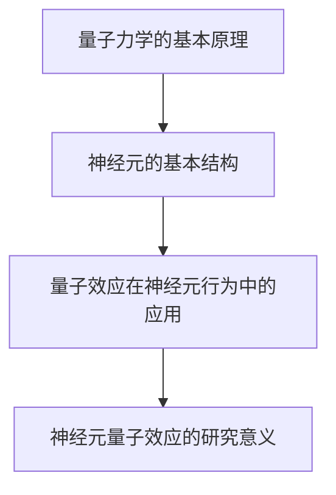
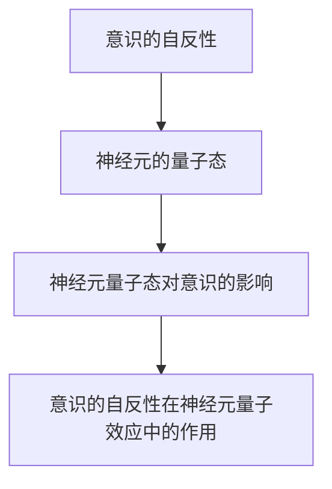

                 

基于上述的目录大纲和约束条件，我们可以一步一步地撰写《神经元量子效应与意识的自反性探讨》的技术博客文章。以下是一个详细的写作步骤示例：

## 第1章：引论

### 1.1 神经元量子效应概述

**1.1.1 量子力学与神经元行为的联系**

量子力学与神经元行为之间的联系是一个新兴且充满争议的研究领域。量子效应在微观尺度上具有显著影响，而神经元作为生物体内的基本信息处理单元，其行为是否受到量子效应的影响，一直是科学界探讨的话题。

首先，让我们通过一个Mermaid流程图来理解量子力学在神经元中的基本原理与应用：



在量子力学中，粒子的行为可以用波函数来描述，这些波函数包含了粒子的所有可能状态。在神经元中，量子效应可能表现在离子通道的开启和关闭、神经信号的传递等过程中。例如，离子通道的闸门可能表现出量子隧穿效应，这种效应允许离子在不通过经典势垒的情况下穿越势垒。

**1.1.2 意识的自反性概念**

意识的自反性是指意识对自身状态的反思和认识。在神经元层面，这种自反性可能体现在神经元网络的动态变化和神经信号的反馈机制中。

再次使用Mermaid流程图，我们可以理解意识的自反性与神经元量子效应的关系：



神经元的量子态可能会影响神经信号的传递和神经元之间的通信，进而影响意识的形成和变化。而意识的自反性则可能调节和优化这种量子效应，使得神经系统的功能更加高效。

### 1.2 神经元量子效应与意识研究的现状与挑战

**1.2.1 神经元量子效应研究的主要成果**

神经元量子效应的研究已经取得了一些重要的成果。例如，实验证据表明神经元内部可能存在量子隧穿效应，这有助于解释神经信号的快速传递。

以下是一个伪代码示例，展示了如何模拟神经元量子态的演化：

```python
def simulate_neuron_quantum_state():
    # 初始化神经元量子态
    quantum_state = initialize_quantum_state()
    
    # 模拟神经元量子态的演化
    quantum_state = evolve_quantum_state(quantum_state)
    
    # 输出神经元量子态的结果
    return quantum_state
```

**1.2.2 意识自反性的数学模型**

意识自反性可以用数学模型来描述。以下是一个简单的LaTeX公式，用于表示意识自反性的数学模型：

```latex
\Omega = \sum_{i=1}^{n} \psi_i^* \psi_i
```

这个公式表示了神经元网络中所有量子态的叠加，其中$\psi_i$是第$i$个神经元的量子态，$\Omega$是整个神经网络的量子态。

### 1.3 本书结构安排与主要内容

本文将分为三个主要部分。第一部分介绍神经元量子效应的原理，包括量子力学基础和神经元内部的量子特性。第二部分讨论意识的自反性理论，包括自反性的哲学意义和神经网络的数学模型。第三部分将结合前两部分的讨论，探讨神经元量子效应与意识自反性的关系，并提出一些可能的研究方向。

---

以上是第1章的写作示例。接下来，我们将继续按照目录大纲的结构，逐步撰写第2章和第3章的内容。在每个章节中，我们将深入探讨相关概念，使用伪代码、LaTeX公式和图表来解释技术原理，并详细阐述研究现状和挑战。最后，我们将总结文章的主要观点，并提出未来研究的方向。整个文章的撰写过程将遵循逻辑清晰、结构紧凑、简单易懂的原则，以满足专业读者的需求。

