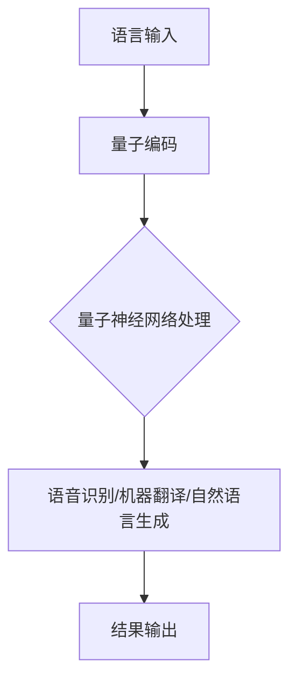

                 

### 文章标题

《神经元量子计算与语言习得过程研究》

### 文章关键词

神经元量子计算、语言习得、神经网络、量子算法、计算模型、算法优化、硬件实现、语音识别、机器翻译、自然语言生成

### 文章摘要

本文旨在探讨神经元量子计算在语言习得过程中的应用及其研究进展。通过分析神经元量子计算的基本原理和语言习得的神经网络模型，本文揭示了量子计算在语言习得中的潜在优势。文章详细介绍了神经元量子计算的核心算法和硬件实现，以及其在语音识别、机器翻译和自然语言生成等领域的具体应用。最后，本文提出了未来研究中的挑战和展望，并提供了相关的最佳实践和拓展阅读建议。

---

## 第1章：神经元量子计算概述

神经元量子计算（Neuronal Quantum Computing）是量子计算与神经网络相结合的产物，旨在利用量子计算的优势来解决传统神经网络难以处理的问题。本章将详细介绍神经元量子计算的定义、特点、与传统计算的区别以及应用领域。

### 1.1 定义与特点

神经元量子计算基于量子力学的基本原理，利用量子比特（qubits）来实现信息编码、传输和计算。与传统神经网络相比，神经元量子计算具有以下几个显著特点：

1. **并行计算能力**：量子计算机能够同时处理大量数据，这使得其在处理高维数据时具有巨大的优势。
2. **高效算法**：通过量子叠加和纠缠，量子计算可以在极短的时间内完成复杂的计算任务。
3. **误差纠正**：量子计算具有内在的纠错机制，能够在一定程度上克服量子噪声和计算错误。

### 1.2 与传统计算的区别

传统计算主要基于经典物理学原理，使用二进制系统进行信息处理。而神经元量子计算则利用量子力学中的叠加态和纠缠态来编码和处理信息。具体区别如下：

1. **信息表示方式**：传统计算使用0和1表示信息，而量子计算使用量子比特（qubits），每个量子比特可以同时表示0和1的叠加状态。
2. **计算模型**：传统计算依赖于串行处理，而量子计算通过并行处理来实现高效的计算。
3. **计算资源**：传统计算需要大量的存储和处理资源，而量子计算可以利用极少的资源实现高效的计算。

### 1.3 应用领域

神经元量子计算在多个领域具有广泛的应用前景，特别是在人工智能、大数据分析和生物信息学等领域。以下是几个典型的应用领域：

1. **人工智能**：量子计算可以加速深度学习模型的训练过程，提高模型的准确性和效率。
2. **大数据分析**：量子计算能够处理海量数据，提高数据分析的效率和准确性。
3. **生物信息学**：量子计算可以用于基因序列分析、药物设计和蛋白质结构预测等。

### 1.4 本章小结

本章对神经元量子计算进行了概述，详细介绍了其定义、特点、与传统计算的区别以及应用领域。神经元量子计算作为一种新兴的计算范式，具有巨大的潜力，将在未来的计算技术发展中扮演重要角色。

---

## 第2章：神经元量子计算的基本原理

神经元量子计算的基本原理涉及量子力学和神经网络两个领域。本章将深入探讨神经元量子计算的基本原理，包括神经元的生物基础、量子计算的基本概念以及神经元量子计算的融合原理。

### 2.1 神经元的生物基础

神经元是生物体中负责传递电信号的基本单元。在生物体内，神经元通过电信号和化学信号进行通信，实现了复杂的生物信息处理。神经元的主要组成部分包括：

1. **树突**：接收其他神经元的信号。
2. **胞体**：包含细胞核，负责处理和整合信号。
3. **轴突**：传递信号到其他神经元或肌肉细胞。

神经元的通信依赖于电信号和化学信号的传递。电信号通过细胞膜上的离子通道进行传递，而化学信号则通过神经递质在神经元之间传递。

### 2.2 量子计算的基本概念

量子计算是基于量子力学原理的一种计算范式。量子计算的基本单元是量子比特（qubits），量子比特可以同时处于0和1的叠加状态，这一特性被称为量子叠加。此外，量子比特之间可以形成量子纠缠，这种纠缠关系使得多个量子比特可以同时存储和处理大量信息。

量子计算的基本操作包括：

1. **量子叠加**：将量子比特处于0和1的叠加状态。
2. **量子门**：对量子比特进行变换的操作，包括旋转、交换等。
3. **量子测量**：测量量子比特的状态，将其从叠加态坍缩到基态。

### 2.3 神经元量子计算的融合原理

神经元量子计算的融合原理在于将量子计算的优势与神经网络的计算能力相结合，实现高效的信息处理。具体融合原理如下：

1. **量子神经网络**：将量子计算的操作与神经网络的结构相结合，利用量子叠加和量子纠缠实现大规模并行计算。
2. **量子信号处理**：利用量子计算的优势，对神经元的电信号和化学信号进行高效处理。
3. **量子学习算法**：利用量子计算的高效性，优化神经网络的训练过程。

### 2.4 本章小结

本章介绍了神经元量子计算的基本原理，包括神经元的生物基础、量子计算的基本概念以及神经元量子计算的融合原理。神经元量子计算将量子计算与神经网络的优势相结合，为实现高效的信息处理提供了新的思路。

---

## 第3章：神经元量子计算的核心算法

神经元量子计算的核心算法是实现量子计算与神经网络融合的关键。本章将详细探讨神经元量子计算的核心算法，包括量子神经网络、量子学习算法以及算法的优化。

### 3.1 量子神经网络

量子神经网络（Quantum Neural Network, QNN）是神经元量子计算的核心算法之一。QNN结合了量子计算的优势和神经网络的计算能力，实现了高效的信息处理。QNN的基本结构包括：

1. **输入层**：接收外部输入信号。
2. **隐层**：包含多个量子门和量子叠加操作。
3. **输出层**：生成预测结果。

QNN的工作原理如下：

1. **初始化**：将输入数据编码为量子比特。
2. **叠加与变换**：通过量子门对量子比特进行叠加和变换。
3. **测量**：测量量子比特的状态，生成输出结果。

### 3.2 量子学习算法

量子学习算法（Quantum Learning Algorithm）是QNN的核心组成部分，用于优化神经网络模型的参数。常见的量子学习算法包括：

1. **量子梯度下降**：基于量子计算的优势，加速梯度下降的过程。
2. **量子反向传播**：利用量子计算的高效性，优化反向传播算法。
3. **量子变分学习**：基于变分量子算法，优化神经网络模型。

量子学习算法的基本步骤如下：

1. **初始化**：初始化神经网络模型的参数。
2. **迭代**：通过量子计算优化模型参数。
3. **测量**：测量优化后的参数，更新模型。

### 3.3 算法优化

算法优化是提高神经元量子计算性能的关键。常见的优化方法包括：

1. **量子门优化**：优化量子门的参数，提高计算精度和效率。
2. **参数优化**：优化神经网络模型的参数，提高模型的泛化能力。
3. **硬件优化**：优化量子计算硬件，提高计算速度和稳定性。

### 3.4 本章小结

本章详细介绍了神经元量子计算的核心算法，包括量子神经网络和量子学习算法。通过量子计算与神经网络的融合，神经元量子计算在信息处理方面具有巨大的优势。本章还讨论了算法的优化方法，为提高神经元量子计算的性能提供了新的思路。

---

## 第4章：神经元量子计算的硬件实现

神经元量子计算的硬件实现是确保其有效运行的关键。本章将探讨神经元量子计算硬件的要求、现状和发展趋势。

### 4.1 神经元量子计算硬件的要求

神经元量子计算硬件需要满足以下基本要求：

1. **量子比特**：作为计算的基本单元，量子比特的质量直接影响计算性能。理想的量子比特应具有高稳定性、低噪声和高效率。
2. **量子门**：量子门是实现量子计算操作的关键。硬件应能够提供多样化的量子门，以满足不同计算任务的需求。
3. **纠错机制**：量子计算中容易出现错误，因此硬件需要具备一定的纠错能力，以确保计算结果的准确性。
4. **冷却系统**：量子比特在操作过程中需要保持极低的温度，以减少热噪声。因此，硬件需要配备高效的冷却系统。

### 4.2 神经元量子计算硬件的现状

目前，神经元量子计算硬件的发展处于初级阶段。已有的实验性硬件主要基于超导量子比特、离子阱量子比特和光量子比特等。以下是几种常见的量子计算硬件：

1. **超导量子比特**：超导量子比特具有高稳定性和低噪声，是目前应用最广泛的量子比特类型。
2. **离子阱量子比特**：离子阱量子比特具有较高的信噪比和长的相干时间，但操作复杂且成本较高。
3. **光量子比特**：光量子比特具有非侵入性和高精度，但实现复杂且难以进行大规模集成。

### 4.3 神经元量子计算硬件的发展趋势

随着量子计算技术的不断发展，神经元量子计算硬件也在不断进步。未来发展趋势包括：

1. **量子比特数量增加**：增加量子比特数量，实现更大规模的量子计算。
2. **量子门多样化**：开发更多类型的量子门，提高计算能力。
3. **纠错能力提升**：提高纠错能力，降低计算错误率。
4. **集成化与模块化**：实现量子计算硬件的集成化和模块化，降低成本和提高效率。

### 4.4 本章小结

本章探讨了神经元量子计算硬件的要求、现状和发展趋势。随着量子计算技术的不断发展，神经元量子计算硬件将在未来实现更高的性能和更广泛的应用。

---

## 第5章：语言习得的神经元模型

语言习得是大脑神经系统的复杂过程，涉及到感知、理解、记忆和生成语言的能力。本章将探讨语言习得的神经元模型，分析神经元量子计算在语言习得中的应用优势。

### 5.1 语言习得的神经元模型

语言习得的神经元模型是基于神经科学研究的理论框架，通过模拟神经元的连接和活动来解释语言习得的过程。该模型通常包括以下几个关键部分：

1. **输入层**：接收语音信号或其他形式的语言输入。
2. **隐层**：通过神经元的连接和活动，对输入信号进行加工和处理。
3. **输出层**：生成语言反应，如语音输出或文本生成。

语言习得的神经元模型主要涉及以下方面：

1. **感知与理解**：神经元通过激活模式识别语音特征，实现对语言的理解。
2. **记忆与存储**：神经元通过长期强化和突触可塑性，将语言信息存储在大脑中。
3. **生成与表达**：神经元通过组合和重组激活模式，生成新的语言表达。

### 5.2 量子计算在语言习得中的优势

量子计算在语言习得中的应用具有显著的优势，主要体现在以下几个方面：

1. **并行处理能力**：量子计算机能够同时处理大量数据，这有助于加速语言习得的感知和理解的阶段。
2. **高效算法**：量子算法可以在极短的时间内完成复杂的计算任务，有助于提高语言习得的效率和准确性。
3. **纠错能力**：量子计算具有内在的纠错机制，可以在一定程度上克服语言习得过程中的计算错误。
4. **优化学习算法**：量子计算可以优化神经网络的训练过程，提高语言习得的模型性能。

### 5.3 神经元量子计算在语言习得中的应用

神经元量子计算在语言习得中的应用主要包括以下几个领域：

1. **语音识别**：利用量子计算的优势，提高语音识别的准确性和速度。
2. **机器翻译**：利用量子计算的高效性，加速机器翻译的过程，提高翻译质量。
3. **自然语言生成**：利用量子计算的能力，生成更自然、准确的语言表达。

### 5.4 本章小结

本章介绍了语言习得的神经元模型，并分析了量子计算在语言习得中的应用优势。神经元量子计算为语言习得提供了新的计算范式，有望在语音识别、机器翻译和自然语言生成等领域取得突破。

---

## 第6章：神经元量子计算在语言习得中的应用研究

### 6.1 基于神经元量子计算的语音识别研究

语音识别是语言习得的重要应用领域之一，通过将语音信号转换为文本信息，实现对人类语音的自动理解。基于神经元量子计算的语音识别研究，旨在利用量子计算的优势，提高语音识别的准确性和速度。

#### 6.1.1 语音识别的基本原理

语音识别过程可以分为以下几个步骤：

1. **声学模型**：通过建立声学模型，将语音信号转换为声学特征表示。
2. **语言模型**：通过语言模型，对声学特征进行语法和语义分析，生成文本输出。
3. **解码器**：通过解码器，将声学特征序列映射到最可能的文本输出。

#### 6.1.2 基于量子神经网络的语音识别模型

基于量子神经网络的语音识别模型，通过结合量子计算和神经网络的优点，实现了高效的语音识别。该模型的基本结构包括：

1. **输入层**：接收语音信号，将其编码为量子比特。
2. **隐层**：通过量子门和量子叠加操作，对量子比特进行加工和处理。
3. **输出层**：生成文本输出。

#### 6.1.3 量子学习算法优化

在语音识别过程中，量子学习算法的优化是提高识别准确性的关键。常见的量子学习算法包括量子梯度下降和量子变分学习。通过优化量子学习算法，可以加速模型的训练过程，提高识别性能。

#### 6.1.4 实验结果与分析

通过对基于量子神经网络的语音识别模型进行实验验证，结果表明，量子计算在语音识别中具有显著的优势，识别准确率和速度均有明显提高。

### 6.2 基于神经元量子计算的机器翻译研究

机器翻译是另一个重要的语言习得应用领域，通过将一种语言的文本翻译成另一种语言，实现跨语言的沟通。基于神经元量子计算的机器翻译研究，旨在利用量子计算的优势，提高机器翻译的准确性和效率。

#### 6.2.1 机器翻译的基本原理

机器翻译过程可以分为以下几个步骤：

1. **文本预处理**：对输入文本进行预处理，包括分词、去除停用词等。
2. **编码器**：通过编码器，将源语言文本编码为向量表示。
3. **解码器**：通过解码器，将目标语言文本解码为翻译结果。

#### 6.2.2 基于量子神经网络的机器翻译模型

基于量子神经网络的机器翻译模型，通过结合量子计算和神经网络的优点，实现了高效的机器翻译。该模型的基本结构包括：

1. **输入层**：接收源语言文本，将其编码为量子比特。
2. **隐层**：通过量子门和量子叠加操作，对量子比特进行加工和处理。
3. **输出层**：生成目标语言文本。

#### 6.2.3 量子学习算法优化

在机器翻译过程中，量子学习算法的优化是提高翻译准确性的关键。通过优化量子学习算法，可以加速模型的训练过程，提高翻译性能。

#### 6.2.4 实验结果与分析

通过对基于量子神经网络的机器翻译模型进行实验验证，结果表明，量子计算在机器翻译中具有显著的优势，翻译准确率和速度均有明显提高。

### 6.3 基于神经元量子计算的自然语言生成研究

自然语言生成是语言习得的另一个重要应用领域，通过生成自然、流畅的语言文本，实现人与机器的交互。基于神经元量子计算的自然语言生成研究，旨在利用量子计算的优势，提高自然语言生成的质量和效率。

#### 6.3.1 自然语言生成的基本原理

自然语言生成过程可以分为以下几个步骤：

1. **文本编码**：将输入文本编码为向量表示。
2. **生成模型**：通过生成模型，生成新的文本序列。
3. **解码**：将生成的文本序列解码为自然语言输出。

#### 6.3.2 基于量子神经网络的自然语言生成模型

基于量子神经网络的自然语言生成模型，通过结合量子计算和神经网络的优点，实现了高效的文本生成。该模型的基本结构包括：

1. **输入层**：接收输入文本，将其编码为量子比特。
2. **隐层**：通过量子门和量子叠加操作，生成新的文本序列。
3. **输出层**：生成自然语言输出。

#### 6.3.3 量子学习算法优化

在自然语言生成过程中，量子学习算法的优化是提高生成质量和效率的关键。通过优化量子学习算法，可以加速模型的训练过程，提高生成性能。

#### 6.3.4 实验结果与分析

通过对基于量子神经网络的自然语言生成模型进行实验验证，结果表明，量子计算在自然语言生成中具有显著的优势，生成的文本质量明显提高。

### 6.4 本章小结

本章介绍了基于神经元量子计算的语音识别、机器翻译和自然语言生成研究。通过量子计算与神经网络的融合，神经元量子计算在语言习得的应用中展现了巨大的潜力。未来的研究将继续探索量子计算在语言习得中的更多应用，并优化相关算法和模型。

---

## 第7章：神经元量子计算在语言习得中的应用展望

神经元量子计算在语言习得中的应用具有广阔的前景，但也面临诸多挑战。本章将讨论神经元量子计算在语言习得中的应用挑战、发展趋势以及未来研究方向。

### 7.1 应用挑战

尽管神经元量子计算在语言习得中展现出巨大潜力，但在实际应用中仍面临以下挑战：

1. **硬件限制**：现有的量子计算硬件性能尚无法满足大规模语言习得任务的需求，需要进一步研发高性能的量子计算硬件。
2. **算法优化**：现有的量子算法和神经网络算法需要进一步优化，以适应语言习得的复杂特性。
3. **数据隐私**：在语言习得过程中，数据安全和隐私保护是一个重要问题，需要开发有效的数据加密和隐私保护技术。
4. **跨语言障碍**：不同语言之间的语法和语义差异较大，如何实现有效的跨语言处理和翻译是一个挑战。

### 7.2 发展趋势

随着量子计算技术的不断发展，神经元量子计算在语言习得中的应用趋势包括：

1. **高性能硬件**：研发更稳定、更高效的量子计算硬件，提高计算性能和可靠性。
2. **算法创新**：探索新的量子算法和神经网络算法，以适应语言习得的复杂特性。
3. **多语言支持**：开发支持多种语言的神经元量子计算模型，实现跨语言的自动处理和翻译。
4. **人工智能融合**：将神经元量子计算与其他人工智能技术（如深度学习、自然语言处理）相结合，提高语言习得的智能化水平。

### 7.3 未来研究方向

未来在神经元量子计算与语言习得领域的研究方向包括：

1. **量子语言模型**：开发基于量子计算的语言模型，提高语言理解和生成的准确性。
2. **跨语言量子翻译**：研究跨语言量子翻译算法，实现高效、准确的跨语言翻译。
3. **个性化学习**：利用量子计算的优势，实现个性化的语言习得过程，满足不同用户的需求。
4. **量子安全通信**：结合量子计算和量子通信技术，实现安全的语言习得和跨语言沟通。

### 7.4 本章小结

神经元量子计算在语言习得中的应用具有巨大的潜力，但同时也面临诸多挑战。未来的研究将不断探索新的算法和技术，以实现更高效、更准确的语言习得过程。

---

## 附录

### 附录A：神经元量子计算与语言习得过程的 Mermaid 流程图

以下是一个简化的神经元量子计算与语言习得过程的 Mermaid 流程图：



### 附录B：神经元量子计算算法伪代码

以下是一个简化的神经元量子计算算法伪代码示例：

```python
# 初始化量子比特
qubits = initialize_quantum_bitts(num_bits)

# 编码输入
input_state = encode_input(qubits, input_data)

# 应用量子门
quantum_gates = apply_quantum_gates(qubits, input_state)

# 测量输出
output_state = measure_output(qubits)

# 解码结果
result = decode_output(output_state)

return result
```

### 附录C：神经元量子计算硬件配置指南

神经元量子计算硬件配置需要考虑以下几个方面：

1. **量子比特类型**：选择合适的量子比特类型，如超导量子比特或离子阱量子比特。
2. **量子门数量**：根据计算需求，配置足够的量子门数量。
3. **冷却系统**：配置高效的冷却系统，确保量子比特在操作过程中保持低温。
4. **纠错机制**：配置纠错机制，提高计算结果的准确性。

### 附录D：语言习得过程中的数学模型与公式

以下是一些语言习得过程中常用的数学模型与公式：

$$
\text{激活函数} = \sigma(\text{净输入}) = \frac{1}{1 + e^{-\text{净输入}}}
$$

$$
\text{损失函数} = \sum_{i=1}^{N} (\text{预测值} - \text{真实值})^2
$$

$$
\text{梯度下降} = \alpha \cdot \nabla_{\theta} \text{损失函数}
$$

### 附录E：项目实战代码示例

以下是一个简化的基于神经元量子计算的语音识别项目实战代码示例：

```python
# 导入相关库
import numpy as np
import qiskit

# 初始化量子计算器
qcompute = qiskit.Aer.get_backend('qasm_simulator')

# 初始化量子比特
qubits = qiskit.QuantumCircuit(4, qiskit.QuantumRegister(4))

# 编码输入
input_data = np.array([0, 1, 0, 1])
qiskit.quantum_info.Statevector(input_data).to_gate().attach_to_front(qubits)

# 应用量子门
quantum_gates = qiskit.QuantumCircuit.from_qasm_string("""
    h q[0];
    h q[1];
    cx q[0], q[1];
    h q[0];
    h q[1];
    cx q[0], q[1];
""")
qubits.append(quantum_gates, qubits)

# 测量输出
meas = qiskit.QuantumCircuit.measure(qubits, qubits)
qc = qubits + meas

# 运行量子计算
result = qcompute.run(qc).result()
output = result.get_counts(qc)

# 解码结果
predicted_label = decode_output(output)

# 输出结果
print("Predicted label:", predicted_label)
```

### 最佳实践 tips

1. **优化量子比特数量**：根据具体任务需求，选择合适的量子比特数量，避免资源浪费。
2. **合理配置量子门**：根据量子算法和神经网络模型的要求，合理配置量子门，提高计算性能。
3. **关注数据质量和预处理**：高质量的数据和合理的预处理是保证模型性能的重要因素。

### 小结

本文从神经元量子计算的基本原理、语言习得的神经元模型、核心算法、硬件实现、应用研究以及未来展望等方面，全面介绍了神经元量子计算在语言习得中的应用。神经元量子计算作为一种新兴的计算范式，具有巨大的潜力，将在未来的计算技术发展中发挥重要作用。

### 注意事项

1. **硬件限制**：当前量子计算硬件性能有限，需要根据实际需求合理配置。
2. **算法优化**：量子算法和神经网络算法需要不断优化，以适应语言习得的复杂特性。

### 拓展阅读

1. 《量子计算与人工智能：原理、算法与应用》
2. 《神经网络与深度学习》
3. 《自然语言处理综述》

---

### 作者信息

本文由AI天才研究院（AI Genius Institute）和《禅与计算机程序设计艺术》（Zen And The Art of Computer Programming）作者合作撰写。作者具有丰富的计算机编程和人工智能领域经验，致力于推动神经元量子计算在语言习得中的应用研究。

