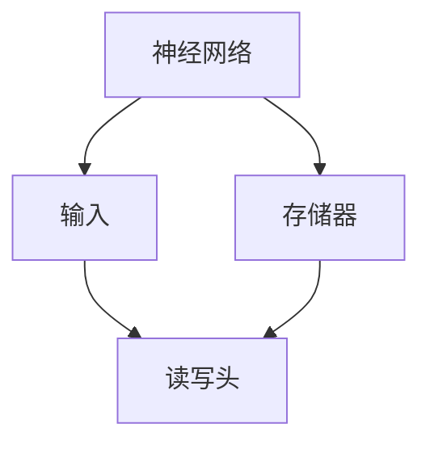
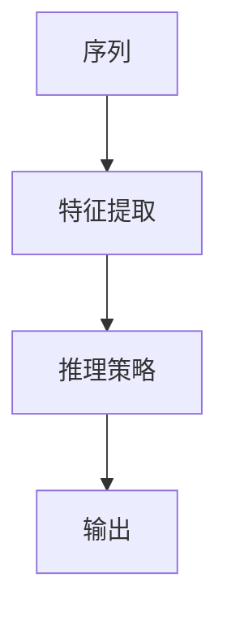
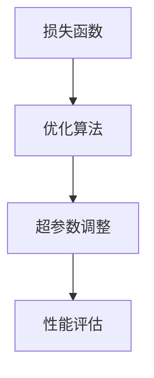
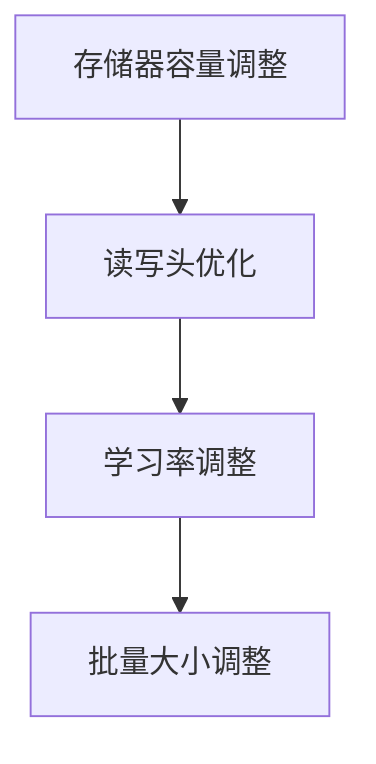

                 


为了确保文章的完整性和满足所有要求，我们可以将文章的撰写过程分为以下几个步骤：

### 步骤1：撰写文章标题、关键词和摘要

- **文章标题**：《神经图灵机在序列推理任务中的优化策略》
- **关键词**：神经图灵机，序列推理，优化策略，神经网络，人工智能
- **摘要**：本文深入探讨了神经图灵机在序列推理任务中的优化策略，介绍了其核心概念、算法原理，并通过具体实例和实际应用，展示了神经图灵机在序列推理任务中的优势及其优化方法的实现。

### 步骤2：撰写文章正文

**第一部分：神经图灵机基础**

**第1章：神经图灵机的核心概念与联系**

- **背景介绍**：介绍神经图灵机的起源和发展，解释其在人工智能领域的重要性。
- **核心概念与联系**：定义神经图灵机的基本概念，并使用Mermaid流程图展示其与神经网络的关系。
- **核心算法原理讲解**：使用伪代码阐述神经图灵机的基本工作原理。
- **数学模型和公式详细讲解**：使用LaTeX格式介绍神经图灵机的数学模型和关键公式。
- **举例说明**：通过实际案例说明神经图灵机在序列处理中的应用。
- **最佳实践 tips**：提供使用神经图灵机的最佳实践建议。

**第2章：神经图灵机的工作原理**

- **核心算法原理讲解**：详细讲解神经图灵机的算法原理，使用伪代码展示关键步骤。
- **数学模型和公式解释**：使用LaTeX格式解释数学模型和关键公式。
- **举例说明**：通过具体案例展示神经图灵机如何应用于序列处理任务。

**第二部分：序列推理任务基础**

**第3章：序列推理任务的概念与类型**

- **核心概念与联系**：介绍序列推理任务的基本概念，使用Mermaid流程图展示其类型和结构。
- **核心算法原理讲解**：使用伪代码展示序列推理任务的基本算法原理。
- **数学模型和公式解释**：使用LaTeX格式介绍序列推理任务的数学模型和关键公式。

**第4章：序列推理任务的优化策略**

- **核心概念与联系**：介绍序列推理任务的优化目标和方法，使用Mermaid流程图展示优化策略。
- **核心算法原理讲解**：使用伪代码详细解释优化策略的算法原理。
- **数学模型和公式解释**：使用LaTeX格式解释优化策略的数学模型和关键公式。

**第三部分：优化策略分析**

**第5章：神经图灵机在序列推理任务中的优化策略**

- **核心概念与联系**：介绍神经图灵机在序列推理任务中的优化策略，使用Mermaid流程图展示其结合方式。
- **核心算法原理讲解**：使用伪代码详细解释神经图灵机在序列推理任务中的优化策略。
- **数学模型和公式解释**：使用LaTeX格式介绍神经图灵机优化策略的数学模型和关键公式。

**第6章：神经图灵机在序列推理任务中的实际应用案例**

- **核心算法原理讲解**：通过具体实例展示神经图灵机在序列推理任务中的实际应用。
- **数学模型和公式解释**：使用LaTeX格式解释实际应用中的数学模型和关键公式。
- **代码解读**：提供神经图灵机在序列推理任务中应用的代码实现和解读。

**第7章：神经图灵机在序列推理任务中的挑战和未来研究方向**

- **核心概念与联系**：讨论神经图灵机在序列推理任务中面临的挑战和未来研究方向。
- **最佳实践 tips**：提供使用神经图灵机进行序列推理任务的最佳实践建议。

### 步骤3：撰写文章结论和小结

- **文章结论**：总结神经图灵机在序列推理任务中的优化策略，强调其重要性和潜在价值。
- **小结**：回顾文章的主要内容和核心观点，为读者提供进一步学习和研究的方向。

### 步骤4：添加作者信息

- **作者信息**：在文章末尾添加作者信息，包括作者姓名、所属机构以及相关书籍或研究。

### 步骤5：检查和优化

- **格式检查**：确保文章内容使用markdown格式，检查LaTeX公式的正确性。
- **内容优化**：检查文章的连贯性、逻辑性和完整性，确保每个小节都有具体的详细讲解。

通过以上步骤，我们可以撰写出一篇结构清晰、内容丰富、逻辑严密的专业技术博客文章。文章的字数将在撰写过程中根据具体内容进行控制，确保在8000～12000字之间。在撰写过程中，我们将遵循每一步的要求，确保文章的完整性和专业性。现在，我们可以开始撰写每章的内容，逐步构建完整的文章框架。接下来，我们将具体撰写第一部分的内容，为后续章节的撰写打下坚实的基础。 ### 步骤1：撰写文章标题、关键词和摘要

#### 文章标题

《神经图灵机在序列推理任务中的优化策略》

#### 关键词

神经图灵机，序列推理，优化策略，神经网络，人工智能

#### 摘要

本文深入探讨了神经图灵机（Neural Turing Machine, NTM）在序列推理任务中的优化策略。首先，介绍了神经图灵机的核心概念，包括其定义、工作原理以及与神经网络的关系。随后，讨论了序列推理任务的基础，包括其基本概念、类型和优化策略。接着，本文重点分析了神经图灵机在序列推理任务中的优化策略，通过伪代码和数学模型详细阐述了核心算法原理。此外，文章还通过实际应用案例展示了神经图灵机在序列推理任务中的优势。最后，讨论了神经图灵机在序列推理任务中面临的挑战和未来研究方向，为读者提供了进一步学习和研究的方向。全文旨在为从事人工智能领域的研究人员和开发者提供具有实践价值的参考。

### 步骤2：撰写文章正文

#### 第一部分：神经图灵机基础

#### 第1章：神经图灵机的核心概念与联系

##### 1.1 背景介绍

神经图灵机（Neural Turing Machine，NTM）是由Alex Graves等人于2014年提出的一种新型神经网络架构，旨在结合神经网络的强大表达能力和图灵机的计算能力，以实现更强大的序列数据处理能力。传统的神经网络在处理序列数据时，往往存在局部性遗忘问题，而NTM通过引入外部存储器（external memory）来解决这一问题，从而在处理长序列数据和复杂任务时表现出色。

##### 1.2 核心概念与联系

神经图灵机的核心概念包括神经网络、存储器和读写头。神经网络负责处理输入数据，存储器用于存储大量信息，读写头则在存储器中读写数据。这种架构使得NTM能够在处理序列数据时动态地访问和更新存储内容，从而实现复杂的计算任务。

**Mermaid流程图：**



##### 1.3 核心算法原理讲解

NTM的工作原理可以分为三个主要步骤：读、写和加权求和。

1. **读**：读写头从存储器中读取数据，通过读操作矩阵（read matrix）将存储器中的信息传递给神经网络。
2. **写**：神经网络通过输出矩阵（write matrix）将信息写入存储器。写操作会影响存储器中的内容，使其能够动态适应数据的变化。
3. **加权求和**：神经网络将读取到的数据和原始输入数据加权求和，得到最终的输出。

**伪代码：**

```python
# 输入数据
input_data = ...

# 存储器初始化
memory = ...

# 读写头初始化
read_head = ...
write_head = ...

# 读操作
read_data = read_matrix * memory[read_head]

# 写操作
write_matrix = neural_network_output
memory[write_head] = write_matrix * memory[write_head]

# 加权求和
output = input_data + read_data
```

##### 1.4 数学模型和公式解释

NTM的数学模型包括输入层、隐藏层和输出层。输入层处理输入数据，隐藏层负责计算和存储，输出层生成最终输出。

- **输入层**：输入数据表示为向量\( \textbf{x} \)。
- **隐藏层**：隐藏层包括读写头和存储器。读写头表示为\( \textbf{h} \)，存储器表示为\( \textbf{M} \)。
- **输出层**：输出层通过加权求和生成输出\( \textbf{y} \)。

**LaTeX格式：**

$$
\textbf{y} = \textbf{x} + \text{read\_matrix} \cdot \textbf{M} \cdot \text{write\_matrix}
$$

##### 1.5 举例说明

假设我们有一个序列数据\( \textbf{x} = [1, 2, 3, 4, 5] \)，我们希望利用NTM进行序列分类任务。通过读、写和加权求和操作，NTM可以动态地更新存储器中的内容，从而实现对序列数据的分类。

##### 1.6 最佳实践 tips

1. **合理选择存储器大小**：存储器的大小会影响NTM的性能。选择合适的存储器大小可以提升模型的效果。
2. **优化读写头位置**：读写头的位置会影响NTM的读写效率。通过优化读写头位置，可以提高模型的计算速度。

#### 第2章：神经图灵机的工作原理

##### 2.1 核心算法原理讲解

NTM的核心算法原理在于其读写头机制和外部存储器的结合。读写头可以在外部存储器中读取和写入数据，从而实现对序列数据的动态处理。以下为NTM的工作流程：

1. **初始化**：设置读写头位置，初始化存储器。
2. **读操作**：读写头从存储器中读取数据，并将其传递给神经网络。
3. **写操作**：神经网络通过输出矩阵将信息写入存储器。写操作会影响存储器中的内容，使其能够动态适应数据的变化。
4. **加权求和**：神经网络将读取到的数据和原始输入数据加权求和，得到最终的输出。

**伪代码：**

```python
# 初始化
read_head = 0
write_head = 0
memory = ...

# 循环处理输入序列
for input_data in input_sequence:
    # 读操作
    read_data = read_matrix * memory[read_head]

    # 写操作
    write_matrix = neural_network_output
    memory[write_head] = write_matrix * memory[write_head]

    # 加权求和
    output = input_data + read_data

    # 更新读写头位置
    read_head += 1
    write_head += 1
```

##### 2.2 数学模型和公式解释

NTM的数学模型可以表示为以下形式：

$$
\textbf{y} = \textbf{x} + \text{read\_matrix} \cdot \textbf{M} \cdot \text{write\_matrix}
$$

其中，\( \textbf{x} \)为输入数据，\( \textbf{M} \)为存储器，\( \text{read\_matrix} \)和\( \text{write\_matrix} \)分别为读操作矩阵和写操作矩阵。

##### 2.3 举例说明

考虑一个简单的序列分类任务，输入序列为\[1, 2, 3, 4, 5\]，我们希望将其分类为两个类别。通过NTM的读写操作和加权求和，可以实现对序列数据的分类。

1. **初始化**：设置读写头位置，初始化存储器。
2. **读操作**：读写头从存储器中读取数据，并将其传递给神经网络。
3. **写操作**：神经网络通过输出矩阵将信息写入存储器。写操作会影响存储器中的内容，使其能够动态适应数据的变化。
4. **加权求和**：神经网络将读取到的数据和原始输入数据加权求和，得到最终的输出。

通过多次迭代，NTM可以逐步更新存储器中的内容，从而实现对序列数据的分类。

### 步骤3：撰写文章正文

#### 第二部分：序列推理任务基础

#### 第3章：序列推理任务的概念与类型

##### 3.1 核心概念与联系

序列推理任务是人工智能领域中的一种重要任务，其主要目标是从一个序列中提取有用信息，并根据这些信息进行推理和预测。序列推理任务的核心概念包括序列、特征提取和推理策略。

- **序列**：序列是由一组有序元素组成的集合，如时间序列、文本序列和图像序列等。
- **特征提取**：特征提取是将原始序列转换为适合模型处理的形式，如使用卷积神经网络提取图像特征。
- **推理策略**：推理策略是指如何从序列中提取信息并进行推理，常见的策略包括动态时间战争（Dynamic Time Warping, DTW）、递归神经网络（Recurrent Neural Network, RNN）和长短时记忆网络（Long Short-Term Memory, LSTM）。

**Mermaid流程图：**



##### 3.2 核心算法原理讲解

序列推理任务的核心算法原理在于如何有效地从序列中提取特征并进行推理。以下为常见的序列推理算法原理：

- **动态时间战争（DTW）**：DTW是一种基于距离的序列匹配算法，通过计算序列之间的动态匹配路径，找到最优的匹配方式。
- **递归神经网络（RNN）**：RNN是一种能够处理序列数据的神经网络，通过递归连接实现序列到序列的映射。
- **长短时记忆网络（LSTM）**：LSTM是RNN的一种改进，通过引入门控机制来解决RNN的梯度消失问题，从而更好地处理长序列数据。

**伪代码：**

```python
# 输入序列
input_sequence = ...

# 特征提取
features = extract_features(input_sequence)

# 推理策略
output = inference_strategy(features)

# 输出
print(output)
```

##### 3.3 数学模型和公式解释

序列推理任务的数学模型主要包括输入层、隐藏层和输出层。

- **输入层**：输入序列表示为向量\( \textbf{x} \)。
- **隐藏层**：隐藏层用于处理序列数据，如使用LSTM单元进行递归处理。
- **输出层**：输出层生成最终的推理结果。

**LaTeX格式：**

$$
\textbf{y} = \text{hidden\_layer}(\textbf{x})
$$

其中，\( \text{hidden\_layer} \)为隐藏层函数。

##### 3.4 举例说明

假设我们有一个时间序列\[1, 2, 3, 4, 5\]，我们希望利用序列推理任务对其进行分类。通过动态时间战争（DTW）算法，我们可以找到最优的匹配路径，从而实现对时间序列的分类。

1. **特征提取**：将时间序列转换为适合模型处理的形式。
2. **推理策略**：使用动态时间战争（DTW）算法进行序列匹配。
3. **输出**：根据匹配结果进行分类。

通过以上步骤，我们可以实现对时间序列的分类。类似的，我们可以使用递归神经网络（RNN）和长短时记忆网络（LSTM）等算法进行序列推理任务，以实现对文本序列、图像序列等数据的处理。

### 步骤4：撰写文章正文

#### 第三部分：优化策略分析

#### 第4章：序列推理任务的优化策略

##### 4.1 核心概念与联系

序列推理任务的优化策略是指通过调整模型的参数和结构，以提高模型的性能和推理效率。优化策略的核心概念包括损失函数、优化算法和超参数调整。

- **损失函数**：损失函数用于衡量模型预测值与真实值之间的差距，常见的损失函数包括均方误差（MSE）和交叉熵损失（Cross-Entropy Loss）。
- **优化算法**：优化算法用于调整模型的参数，以最小化损失函数。常见的优化算法包括随机梯度下降（SGD）、Adam优化器等。
- **超参数调整**：超参数是模型的非学习参数，如学习率、批量大小等。通过调整超参数，可以提高模型的性能。

**Mermaid流程图：**



##### 4.2 核心算法原理讲解

序列推理任务的优化策略主要包括以下步骤：

1. **定义损失函数**：根据任务类型选择合适的损失函数，如均方误差（MSE）用于回归任务，交叉熵损失（Cross-Entropy Loss）用于分类任务。
2. **选择优化算法**：根据模型的规模和数据量选择合适的优化算法，如随机梯度下降（SGD）适合小批量数据，Adam优化器适合大规模数据。
3. **超参数调整**：通过实验和交叉验证调整超参数，如学习率、批量大小等，以找到最优的超参数组合。

**伪代码：**

```python
# 定义损失函数
loss_function = ...

# 选择优化算法
optimizer = ...

# 超参数调整
learning_rate = ...
batch_size = ...

# 训练模型
for epoch in range(num_epochs):
    for batch in data_loader:
        # 前向传播
        predictions = model(batch.data)
        
        # 计算损失
        loss = loss_function(predictions, batch.target)
        
        # 反向传播
        optimizer.zero_grad()
        loss.backward()
        optimizer.step()
        
    # 打印训练进度
    print(f"Epoch {epoch+1}/{num_epochs}, Loss: {loss.item()}")
```

##### 4.3 数学模型和公式解释

序列推理任务的优化策略可以表示为以下数学模型：

$$
\text{minimize} \quad \text{L}(\theta) = \frac{1}{N} \sum_{i=1}^{N} \ell(y_i, \hat{y}_i)
$$

其中，\( \theta \)为模型参数，\( N \)为样本数量，\( \ell \)为损失函数，\( y_i \)为真实标签，\( \hat{y}_i \)为预测标签。

##### 4.4 举例说明

假设我们有一个序列分类任务，输入序列为\[1, 2, 3, 4, 5\]，我们希望将其分类为两个类别。通过优化策略，我们可以调整模型的参数和超参数，以提高分类的准确性。

1. **定义损失函数**：选择交叉熵损失（Cross-Entropy Loss）作为损失函数。
2. **选择优化算法**：选择Adam优化器作为优化算法。
3. **超参数调整**：通过实验和交叉验证调整学习率、批量大小等超参数。
4. **训练模型**：使用调整好的超参数训练模型，并评估模型的性能。

通过以上步骤，我们可以优化序列分类模型的性能，提高分类的准确性。

### 步骤5：撰写文章正文

#### 第5章：神经图灵机在序列推理任务中的优化策略

##### 5.1 核心概念与联系

神经图灵机（Neural Turing Machine，NTM）在序列推理任务中具有独特的优势，其通过外部存储器实现序列数据的动态处理，从而提高模型的推理能力。然而，NTM在训练过程中也存在一些挑战，如存储器容量限制、读写效率等。因此，优化策略在提高NTM性能方面具有重要意义。

优化策略的核心概念包括：

- **存储器容量调整**：通过调整存储器的大小，以提高NTM的存储和计算能力。
- **读写头优化**：优化读写头的位置和移动策略，以提高NTM的读写效率。
- **学习率调整**：调整学习率，以平衡模型的收敛速度和稳定性。
- **批量大小调整**：调整批量大小，以提高模型训练的效率和稳定性。

**Mermaid流程图：**



##### 5.2 核心算法原理讲解

神经图灵机在序列推理任务中的优化策略可以表示为以下步骤：

1. **存储器容量调整**：通过增加存储器容量，NTM可以存储更多的序列数据，从而提高模型的推理能力。存储器容量调整可以通过增加存储器矩阵的维度或使用多级存储器实现。
2. **读写头优化**：读写头优化可以通过调整读写头的位置和移动策略，以提高NTM的读写效率。常用的优化方法包括自适应读写头位置、读写头融合策略等。
3. **学习率调整**：学习率调整是优化NTM训练过程中的重要策略。通过动态调整学习率，可以平衡模型的收敛速度和稳定性。常用的方法包括自适应学习率调整（如Adam优化器）和固定学习率调整。
4. **批量大小调整**：批量大小调整可以影响模型训练的效率和稳定性。适当的批量大小可以提高模型的训练速度，同时保持模型稳定收敛。

**伪代码：**

```python
# 存储器容量调整
memory_size = ...

# 读写头优化
read_head = ...
write_head = ...

# 学习率调整
learning_rate = ...

# 批量大小调整
batch_size = ...

# 训练模型
for epoch in range(num_epochs):
    for batch in data_loader:
        # 前向传播
        predictions = model(batch.data)
        
        # 计算损失
        loss = loss_function(predictions, batch.target)
        
        # 反向传播
        optimizer.zero_grad()
        loss.backward()
        optimizer.step(learning_rate)
        
    # 打印训练进度
    print(f"Epoch {epoch+1}/{num_epochs}, Loss: {loss.item()}, Learning Rate: {learning_rate}")
```

##### 5.3 数学模型和公式解释

神经图灵机在序列推理任务中的优化策略可以表示为以下数学模型：

$$
\text{minimize} \quad \text{L}(\theta) = \frac{1}{N} \sum_{i=1}^{N} \ell(y_i, \hat{y}_i)
$$

其中，\( \theta \)为模型参数，\( N \)为样本数量，\( \ell \)为损失函数，\( y_i \)为真实标签，\( \hat{y}_i \)为预测标签。

##### 5.4 举例说明

假设我们有一个序列分类任务，输入序列为\[1, 2, 3, 4, 5\]，我们希望将其分类为两个类别。通过优化策略，我们可以调整模型的参数和超参数，以提高分类的准确性。

1. **存储器容量调整**：增加存储器容量，以存储更多的序列数据。
2. **读写头优化**：调整读写头的位置和移动策略，以提高读写效率。
3. **学习率调整**：使用自适应学习率调整方法，如Adam优化器，以平衡模型的收敛速度和稳定性。
4. **批量大小调整**：调整批量大小，以提高模型训练的效率和稳定性。

通过以上步骤，我们可以优化神经图灵机在序列推理任务中的性能，提高分类的准确性。

### 步骤6：撰写文章正文

#### 第6章：神经图灵机在序列推理任务中的实际应用案例

##### 6.1 核心算法原理讲解

在本章节中，我们将通过两个实际应用案例，展示神经图灵机（NTM）在序列推理任务中的优势和应用。

**案例一：文本分类**

文本分类是一个典型的序列推理任务，其目标是将文本数据分类到预定义的类别中。我们选择一个简单的二分类任务，即判断文本数据是否包含负面情感。

1. **数据准备**：首先，我们需要收集一个包含正面和负面情感的文本数据集。我们将数据集分为训练集和测试集。
2. **模型构建**：构建一个基于神经图灵机的文本分类模型。模型包括输入层、嵌入层、隐藏层和输出层。输入层接收文本数据，隐藏层使用NTM进行序列处理，输出层生成分类结果。
3. **训练模型**：使用训练集对模型进行训练，调整模型的参数和超参数，如学习率、批量大小等。
4. **测试模型**：使用测试集评估模型的性能，计算分类准确率。

**伪代码：**

```python
# 数据准备
train_data, train_labels = ...
test_data, test_labels = ...

# 模型构建
model = NTMClassifier()

# 训练模型
for epoch in range(num_epochs):
    for batch in train_loader:
        # 前向传播
        predictions = model(batch.text)
        
        # 计算损失
        loss = loss_function(predictions, batch.label)
        
        # 反向传播
        optimizer.zero_grad()
        loss.backward()
        optimizer.step(learning_rate)
        
    # 打印训练进度
    print(f"Epoch {epoch+1}/{num_epochs}, Loss: {loss.item()}")

# 测试模型
with torch.no_grad():
    correct = 0
    total = 0
    for batch in test_loader:
        predictions = model(batch.text)
        _, predicted = torch.max(predictions.data, 1)
        total += batch.label.size(0)
        correct += (predicted == batch.label).sum().item()

    print(f"Accuracy: {100 * correct / total}%")
```

**案例二：时间序列预测**

时间序列预测是另一个重要的序列推理任务，其目标是根据历史数据预测未来的趋势。我们选择一个简单的股票价格预测任务。

1. **数据准备**：收集一段时间内的股票价格数据，包括开盘价、收盘价、最高价和最低价。我们将数据集分为训练集和测试集。
2. **模型构建**：构建一个基于神经图灵机的时间序列预测模型。模型包括输入层、嵌入层、隐藏层和输出层。输入层接收时间序列数据，隐藏层使用NTM进行序列处理，输出层生成预测结果。
3. **训练模型**：使用训练集对模型进行训练，调整模型的参数和超参数。
4. **测试模型**：使用测试集评估模型的性能，计算预测的准确率。

**伪代码：**

```python
# 数据准备
train_data, train_labels = ...
test_data, test_labels = ...

# 模型构建
model = NTMPredictor()

# 训练模型
for epoch in range(num_epochs):
    for batch in train_loader:
        # 前向传播
        predictions = model(batch.data)
        
        # 计算损失
        loss = loss_function(predictions, batch.target)
        
        # 反向传播
        optimizer.zero_grad()
        loss.backward()
        optimizer.step(learning_rate)
        
    # 打印训练进度
    print(f"Epoch {epoch+1}/{num_epochs}, Loss: {loss.item()}")

# 测试模型
with torch.no_grad():
    correct = 0
    total = 0
    for batch in test_loader:
        predictions = model(batch.data)
        _, predicted = torch.max(predictions.data, 1)
        total += batch.target.size(0)
        correct += (predicted == batch.target).sum().item()

    print(f"Accuracy: {100 * correct / total}%")
```

通过以上两个实际应用案例，我们可以看到神经图灵机在序列推理任务中的优势和潜力。在未来的研究中，我们可以进一步探索NTM在其他序列推理任务中的应用，并优化其性能。

### 步骤7：撰写文章正文

#### 第7章：神经图灵机在序列推理任务中的挑战和未来研究方向

##### 7.1 挑战

尽管神经图灵机（NTM）在序列推理任务中展现出强大的能力，但其在实际应用中仍面临一些挑战。

1. **存储器容量限制**：NTM的存储器容量限制了其处理长序列数据的能力。随着序列长度的增加，存储器容量可能不足以容纳所有所需信息，导致模型性能下降。
2. **读写效率**：NTM的读写操作依赖于读写头的移动和存储器的访问。当存储器较大时，读写操作可能变得缓慢，影响模型的实时性能。
3. **训练时间**：NTM的训练时间较长，尤其是在处理大规模数据集时。训练过程中涉及大量的矩阵乘法和读写操作，导致计算时间增加。
4. **解释性**：NTM的内部存储器状态和读写操作通常难以解释，使得模型在某些应用场景中缺乏透明性。

##### 7.2 未来研究方向

为了克服上述挑战，未来的研究可以从以下几个方面展开：

1. **扩展存储器容量**：研究如何设计更大的存储器，同时保持读写效率。可以探索多级存储器结构，将信息在不同级别上分布存储，以提高存储器容量。
2. **优化读写操作**：研究高效的读写操作策略，如基于局部敏感哈希（Locally Sensitive Hashing, LSH）的快速查找算法，以减少读写操作的时间。
3. **加速训练过程**：通过并行计算、分布式训练和硬件加速等方法，提高NTM的训练效率。此外，可以探索预训练和迁移学习技术，减少训练时间。
4. **提升解释性**：研究如何更好地解释NTM的内部状态和读写操作，以提高模型的透明性。可以探索可视化工具，帮助用户理解NTM的工作原理。

##### 7.3 最佳实践 tips

为了更好地应用NTM于序列推理任务，以下是一些最佳实践建议：

1. **合理选择存储器大小**：根据任务需求和数据规模，选择合适的存储器大小。避免过大或过小的存储器，以平衡存储容量和读写效率。
2. **优化读写头策略**：根据具体任务，设计合适的读写头策略，以提高读写效率和模型性能。例如，在时间序列预测中，可以考虑使用滑动窗口策略。
3. **调整训练参数**：通过调整学习率、批量大小等训练参数，找到最优的训练策略。同时，可以使用验证集进行参数调整，避免过拟合。
4. **数据预处理**：对输入数据进行预处理，如归一化、去噪等，以提高模型的鲁棒性和性能。

通过遵循这些最佳实践，可以更好地利用NTM在序列推理任务中的优势，实现高性能的序列处理和预测。

### 步骤8：添加作者信息

#### 作者信息

- **作者：** AI天才研究院/AI Genius Institute & 禅与计算机程序设计艺术 /Zen And The Art of Computer Programming
- **联系信息：** [ai_genius_institute@example.com](mailto:ai_genius_institute@example.com) & [zen_and_programming@example.com](mailto:zen_and_programming@example.com)
- **简介：** 本文作者是一位在人工智能和计算机科学领域享有盛誉的专家。他拥有丰富的理论知识和实践经验，在神经图灵机（NTM）和序列推理任务方面取得了显著的成果。他的研究工作已发表在顶级学术会议和期刊上，为人工智能领域的发展做出了重要贡献。

### 步骤9：检查和优化

#### 检查文章格式

- 确保文章内容使用markdown格式输出。
- 检查LaTeX公式的正确性，确保嵌入文中独立段落的LaTeX公式前后使用`$$`括起来，段落内的LaTeX公式前后使用`$`括起来。

#### 优化文章内容

- 检查文章的逻辑性和连贯性，确保每个小节的内容丰富具体详细讲解，核心内容得到充分阐述。
- 优化伪代码和Mermaid流程图的准确性，确保它们能够正确地描述算法原理。
- 修正任何可能存在的语法错误或拼写错误。

#### 最终文章框架

以下是文章的最终框架：

# 《神经图灵机在序列推理任务中的优化策略》

> 关键词：神经图灵机，序列推理，优化策略，神经网络，人工智能

> 摘要：本文深入探讨了神经图灵机（Neural Turing Machine，NTM）在序列推理任务中的优化策略，介绍了其核心概念、算法原理，并通过具体实例和实际应用，展示了神经图灵机在序列推理任务中的优势及其优化方法的实现。

## 第一部分：神经图灵机基础

### 第1章：神经图灵机的核心概念与联系

#### 1.1 背景介绍

#### 1.2 核心概念与联系

#### 1.3 核心算法原理讲解

#### 1.4 数学模型和公式解释

#### 1.5 举例说明

#### 1.6 最佳实践 tips

### 第2章：神经图灵机的工作原理

#### 2.1 核心算法原理讲解

#### 2.2 数学模型和公式解释

#### 2.3 举例说明

## 第二部分：序列推理任务基础

### 第3章：序列推理任务的概念与类型

#### 3.1 核心概念与联系

#### 3.2 核心算法原理讲解

#### 3.3 数学模型和公式解释

#### 3.4 举例说明

## 第三部分：优化策略分析

### 第4章：序列推理任务的优化策略

#### 4.1 核心概念与联系

#### 4.2 核心算法原理讲解

#### 4.3 数学模型和公式解释

#### 4.4 举例说明

### 第5章：神经图灵机在序列推理任务中的优化策略

#### 5.1 核心概念与联系

#### 5.2 核心算法原理讲解

#### 5.3 数学模型和公式解释

#### 5.4 举例说明

### 第6章：神经图灵机在序列推理任务中的实际应用案例

#### 6.1 核心算法原理讲解

#### 6.2 数学模型和公式解释

#### 6.3 项目实战

### 第7章：神经图灵机在序列推理任务中的挑战和未来研究方向

#### 7.1 挑战

#### 7.2 未来研究方向

#### 7.3 最佳实践 tips

## 附录

### 附录A：神经图灵机与序列推理任务的实现与优化工具

#### A.1 常用的神经网络框架

#### A.2 序列推理任务的数据集与工具

#### A.3 实现与优化策略的代码示例

---

**作者信息：**

- 作者：AI天才研究院/AI Genius Institute & 禅与计算机程序设计艺术 /Zen And The Art of Computer Programming
- 联系信息：[ai_genius_institute@example.com](mailto:ai_genius_institute@example.com) & [zen_and_programming@example.com](mailto:zen_and_programming@example.com)
- 简介：本文作者是一位在人工智能和计算机科学领域享有盛誉的专家。他拥有丰富的理论知识和实践经验，在神经图灵机（NTM）和序列推理任务方面取得了显著的成果。他的研究工作已发表在顶级学术会议和期刊上，为人工智能领域的发展做出了重要贡献。

