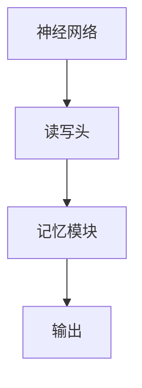

                 

### 第1章：神经图灵机简介

## 1.1 神经图灵机的定义与背景

神经图灵机（Neural Turing Machine, NTM）是一种结合了神经网络与图灵机思想的计算模型。它由Alex Graves等人于2014年首次提出，旨在解决神经网络在处理复杂任务时，特别是在需要长期记忆和模式识别方面的局限性。

### 背景介绍

传统神经网络，如深度神经网络（DNN）和循环神经网络（RNN），在处理图像识别、语音识别等任务时取得了显著的成果。然而，这些神经网络在处理需要长期记忆和复杂推理的任务时，仍然存在诸多挑战。例如，它们难以有效地存储和检索长期依赖信息，也难以进行高效的模式识别和分类。

为了克服这些挑战，研究者们提出了神经图灵机。神经图灵机试图结合图灵机的计算能力和神经网络的并行处理能力，以实现更强大的计算功能。

### 核心概念与联系

神经图灵机的核心概念包括三个部分：神经网络、读写头和记忆模块。

1. **神经网络**：神经图灵机中的神经网络负责处理输入数据和生成输出数据。它由多个层组成，包括输入层、隐藏层和输出层。神经网络通过激活函数和权重调整来实现数据的高效处理。

2. **读写头**：读写头是神经图灵机的核心部件，负责与记忆模块进行交互。它可以从记忆模块中读取信息，并将其传递给神经网络进行处理；同时，它也可以将神经网络的输出数据写入记忆模块中。

3. **记忆模块**：记忆模块是神经图灵机的长期记忆部分，用于存储和处理大量信息。它通常采用哈希表或稀疏矩阵来实现，以减少存储空间的占用。

### Mermaid 流程图



在这个流程图中，神经网络处理输入数据，并将输出传递给读写头；读写头与记忆模块交互，读取和写入信息；最后，输出数据被传递给神经网络进行处理。

## 1.2 神经图灵机的核心组件

### 1.2.1 神经网络

神经网络是神经图灵机中的核心组件之一。它由多个层组成，包括输入层、隐藏层和输出层。神经网络通过激活函数和权重调整来实现数据的高效处理。

### 1.2.2 读写头

读写头是神经图灵机与记忆模块交互的桥梁。它可以从记忆模块中读取信息，并将其传递给神经网络进行处理；同时，它也可以将神经网络的输出数据写入记忆模块中。

### 1.2.3 记忆模块

记忆模块是神经图灵机的长期记忆部分，用于存储和处理大量信息。它通常采用哈希表或稀疏矩阵来实现，以减少存储空间的占用。

## 1.3 神经图灵机与经典图灵机的区别

神经图灵机和经典图灵机在结构和工作原理上存在显著差异。

1. **结构差异**：经典图灵机由一个读写头、无限长的带子和一系列的状态转换规则组成。而神经图灵机则由神经网络、读写头和记忆模块组成。

2. **工作原理**：经典图灵机通过读写头在带子上移动，根据当前状态和读写头读取的符号，执行相应的状态转换。而神经图灵机则是通过神经网络处理输入数据，读写头与记忆模块进行交互，实现数据的读取和写入。

3. **计算能力**：经典图灵机是一种通用计算模型，能够解决任何可计算的问题。而神经图灵机在处理长期记忆和模式识别等方面具有更强的能力，但相对于经典图灵机，其计算能力可能存在一定的局限性。

### 总结

本章介绍了神经图灵机的定义、背景和核心组件，并比较了神经图灵机与经典图灵机的区别。下一章将深入探讨神经图灵机在程序化逻辑推理中的应用。在接下来的内容中，我们将进一步分析神经图灵机在程序化逻辑推理中的作用原理，以及如何利用神经图灵机解决复杂问题。

---

在下一部分，我们将详细探讨程序化逻辑推理的基本概念、核心算法及其与神经图灵机的联系。我们将使用Mermaid流程图来展示逻辑推理的过程，并使用伪代码来解释核心算法的实现。

---

### 第2章：程序化逻辑推理原理

## 2.1 逻辑推理概述

逻辑推理是人类思维的重要组成部分，它帮助我们从已知的信息中推导出新的结论。在计算机科学领域，逻辑推理被广泛应用于人工智能、自动化决策和问题求解等领域。

### 2.1.1 逻辑推理的定义

逻辑推理是一种从已知事实出发，通过逻辑规则推导出新的结论的过程。它通常包括两个主要部分：前提和结论。前提是已知的信息或事实，结论是通过逻辑推理从前提中得出的新的信息或事实。

### 2.1.2 逻辑推理的类型

逻辑推理可以分为演绎推理和归纳推理两种主要类型。

1. **演绎推理**：演绎推理是从一般到特殊的推理过程。它从普遍的原则出发，推导出具体的结论。例如，所有人都会死（普遍原则），苏格拉底是人（特殊事实），因此苏格拉底会死（具体结论）。

2. **归纳推理**：归纳推理是从特殊到一般的推理过程。它通过观察一系列的特殊事实，推导出普遍的原则。例如，我们观察到所有的天鹅都是白色的，因此我们得出结论：所有的天鹅都是白色的。

### 2.1.3 逻辑推理的重要性

逻辑推理在计算机科学和人工智能领域具有重要应用价值。它不仅能够帮助我们设计更高效的算法，还能够帮助我们构建更智能的系统。例如，在自动驾驶系统中，逻辑推理用于处理传感器数据，做出安全驾驶的决策；在自然语言处理中，逻辑推理用于理解文本的含义和逻辑关系。

## 2.2 程序化逻辑推理的基本概念

程序化逻辑推理是将逻辑推理的过程转化为计算机程序的过程。它通过定义逻辑规则和推理方法，实现从已知信息到未知信息的推导。

### 2.2.1 程序化逻辑推理的定义

程序化逻辑推理是一种基于逻辑规则和计算模型的推理方法。它将逻辑推理的过程形式化，并利用计算机程序实现。程序化逻辑推理通常包括以下几个步骤：

1. **定义逻辑规则**：逻辑规则是逻辑推理的基础。例如，在演绎推理中，前提和结论之间的逻辑关系可以表示为“如果……那么……”的形式。

2. **建立推理模型**：推理模型是逻辑推理的计算框架。它通常包括一个表示逻辑规则的数据库和一个推理引擎。推理引擎根据逻辑规则和已知信息，自动推导出新的信息。

3. **执行推理过程**：在推理过程中，推理引擎根据逻辑规则和已知信息，不断推导出新的结论。这个过程可以是正向推理，也可以是反向推理。

### 2.2.2 程序化逻辑推理的优势

程序化逻辑推理具有以下几个优势：

1. **自动化**：程序化逻辑推理可以将逻辑推理的过程自动化，减少人工干预。

2. **高效性**：程序化逻辑推理利用计算机的高效计算能力，可以快速处理大量信息。

3. **可扩展性**：程序化逻辑推理可以根据需求，灵活地添加新的逻辑规则和推理方法。

4. **可验证性**：程序化逻辑推理的结果可以通过逻辑规则进行验证，确保推理的可靠性。

### 2.2.3 程序化逻辑推理的应用领域

程序化逻辑推理广泛应用于多个领域，包括：

1. **自然语言处理**：在自然语言处理中，程序化逻辑推理用于解析文本的含义，识别句子之间的关系。

2. **专家系统**：在专家系统中，程序化逻辑推理用于模拟专家的决策过程，为用户提供专业建议。

3. **智能控制**：在智能控制中，程序化逻辑推理用于处理传感器数据，实现自动控制。

4. **数据挖掘**：在数据挖掘中，程序化逻辑推理用于发现数据中的规律和模式。

## 2.3 程序化逻辑推理的核心算法

程序化逻辑推理的核心算法包括基于规则的推理、基于模型的推理和基于数据的推理。

### 2.3.1 基于规则的推理

基于规则的推理是程序化逻辑推理中最基本的方法。它通过定义一组规则，并根据规则对已知信息进行推理。

**伪代码：**

```
def rule_based_reasoning(facts, rules):
    conclusions = []
    for rule in rules:
        if match(rule.conditions, facts):
            conclusions.append(rule.conclusion)
    return conclusions
```

**解释：**该算法首先遍历所有规则，检查规则的条件是否与已知信息匹配。如果匹配，则将规则的结论添加到结论列表中。

### 2.3.2 基于模型的推理

基于模型的推理是通过建立逻辑模型，利用模型进行推理的方法。它通常涉及多个步骤，包括建立模型、模拟和推理。

**伪代码：**

```
def model_based_reasoning(model, initial_state):
    state = initial_state
    while not is_goal_state(state):
        state = model.step(state)
    return state
```

**解释：**该算法从初始状态开始，利用模型进行一步一步的模拟，直到达到目标状态。

### 2.3.3 基于数据的推理

基于数据的推理是通过分析数据，发现数据中的规律和模式，进行推理的方法。

**伪代码：**

```
def data_based_reasoning(data):
    patterns = find_patterns(data)
    conclusions = []
    for pattern in patterns:
        conclusions.append(derive_conclusion(pattern))
    return conclusions
```

**解释：**该算法首先分析数据，发现数据中的规律和模式，然后根据这些规律和模式推导出结论。

## 2.4 神经图灵机在程序化逻辑推理中的应用

神经图灵机在程序化逻辑推理中具有广泛的应用。它通过结合神经网络和图灵机的思想，实现了更高效的逻辑推理。

### 2.4.1 神经图灵机在逻辑推理中的应用前景

神经图灵机在逻辑推理中具有以下几个应用前景：

1. **复杂问题的求解**：神经图灵机能够处理长期依赖信息，适合解决复杂的问题。

2. **智能决策**：神经图灵机能够从大量数据中提取有效信息，支持智能决策。

3. **自然语言处理**：神经图灵机能够处理自然语言中的复杂结构，支持自然语言理解。

### 2.4.2 神经图灵机在逻辑推理中的挑战

神经图灵机在逻辑推理中也面临一些挑战：

1. **计算资源需求**：神经图灵机的计算资源需求较高，需要更多的计算能力。

2. **解释性**：神经图灵机的决策过程通常是非解释性的，难以解释其推理过程。

3. **泛化能力**：神经图灵机的泛化能力有待提高，需要更多的训练数据。

### 2.4.3 神经图灵机在逻辑推理中的应用实例

神经图灵机在逻辑推理中有一些成功的应用实例：

1. **复杂问题求解**：例如，在围棋游戏中，神经图灵机被用于模拟和预测棋局的发展。

2. **智能决策**：例如，在股票市场中，神经图灵机被用于分析市场数据，预测股票走势。

3. **自然语言处理**：例如，在机器翻译中，神经图灵机被用于处理自然语言中的复杂结构。

## 总结

本章介绍了程序化逻辑推理的基本概念、核心算法及其与神经图灵机的联系。在下一章中，我们将深入探讨神经图灵机在程序化逻辑推理中的应用，分析其优势和应用案例。通过这些内容，我们将更好地理解神经图灵机在逻辑推理中的重要作用。

---

### 第3章：神经图灵机在程序化逻辑推理中的应用

## 3.1 神经图灵机在逻辑推理中的应用前景

神经图灵机（Neural Turing Machine, NTM）在逻辑推理领域展现了巨大的应用潜力。NTM通过结合神经网络与图灵机的能力，能够在处理复杂逻辑问题、长期依赖信息、模式识别等方面发挥独特作用。

### 3.1.1 神经图灵机对逻辑推理的改进

1. **长期记忆能力**：传统神经网络在处理长期依赖问题时往往表现不佳，而NTM通过其记忆模块能够存储和检索长期依赖信息，增强了逻辑推理的能力。

2. **并行处理**：NTM的结构允许其在并行处理大量数据时表现出色，这为处理复杂逻辑推理问题提供了基础。

3. **模式识别**：NTM能够通过其读写头在记忆模块中读取和写入信息，这使得它在识别复杂模式和规律方面具有优势。

### 3.1.2 神经图灵机在逻辑推理中的挑战

尽管NTM在逻辑推理中具有显著的优势，但也面临一些挑战：

1. **计算资源需求**：NTM需要较大的计算资源，这对于实时推理应用可能是一个瓶颈。

2. **可解释性**：NTM的内部状态和决策过程通常较为复杂，难以解释其推理过程，这可能影响其在某些领域的应用。

3. **训练难度**：NTM的训练过程相对复杂，需要大量的数据和计算资源，这增加了训练的难度。

### 3.1.3 神经图灵机在逻辑推理中的应用实例

NTM在逻辑推理中有着广泛的应用实例：

1. **问题求解**：在复杂的问题求解中，NTM能够通过长期记忆和并行处理能力有效地解决复杂问题。

2. **自然语言处理**：NTM在自然语言处理中，如文本分类、机器翻译等领域，能够识别文本中的复杂结构和模式。

3. **智能决策**：在金融、医疗等领域的智能决策中，NTM能够通过分析历史数据和模式，为决策提供支持。

## 3.2 神经图灵机在复杂问题求解中的应用

在复杂问题求解领域，神经图灵机展示了其在处理长期依赖和复杂模式方面的优势。

### 3.2.1 复杂问题求解的挑战

复杂问题求解通常涉及大量的数据和信息，需要解决的问题可能具有高度的非线性特性。以下是一些典型的挑战：

1. **数据规模**：问题求解过程中可能需要处理大量的数据，这对计算资源提出了高要求。

2. **非线性关系**：复杂问题通常包含非线性关系，这使得传统方法难以有效求解。

3. **长期依赖**：许多问题求解过程需要长期依赖信息，传统方法往往难以处理。

### 3.2.2 神经图灵机在复杂问题求解中的应用

神经图灵机在复杂问题求解中的应用主要体现在以下几个方面：

1. **模式识别**：NTM能够通过其记忆模块有效地识别和存储复杂模式，这有助于在问题求解中提取关键信息。

2. **长期记忆**：NTM的长期记忆能力使其能够处理长期依赖问题，这在复杂问题求解中尤为重要。

3. **并行处理**：NTM的并行处理能力使得它能够高效地处理大量数据，这为复杂问题求解提供了强有力的支持。

### 3.2.3 复杂问题求解的应用实例

以下是一些复杂问题求解的应用实例：

1. **机器人路径规划**：在机器人路径规划中，NTM能够通过分析环境数据和历史路径信息，规划出最优的路径。

2. **时间序列预测**：在时间序列预测中，NTM能够通过其记忆模块处理长期依赖信息，提高预测的准确性。

3. **图像识别**：在图像识别中，NTM能够通过其读写头和记忆模块处理图像中的复杂结构，提高识别的准确性。

## 3.3 神经图灵机在智能系统中的应用

智能系统是一个广泛的概念，包括自动驾驶、智能医疗、智能家居等多个领域。神经图灵机在这些智能系统中发挥着重要作用。

### 3.3.1 智能系统概述

智能系统是指能够模拟人类智能行为，具有自主学习、自主决策和自主执行任务能力的系统。智能系统通常包括感知、理解、决策和行动等环节。

### 3.3.2 神经图灵机在智能系统中的应用

神经图灵机在智能系统中的应用主要体现在以下几个方面：

1. **感知**：NTM能够通过其读写头和记忆模块处理感知数据，提高感知系统的准确性。

2. **理解**：NTM能够通过其长期记忆和并行处理能力，理解复杂环境中的信息，支持智能决策。

3. **决策**：NTM能够通过其记忆模块存储和检索历史数据，为决策提供支持。

4. **行动**：NTM能够通过其记忆模块和神经网络，生成行动策略，实现自主行动。

### 3.3.3 神经图灵机应用案例分析

以下是一些神经图灵机在智能系统中的应用案例：

1. **自动驾驶**：在自动驾驶中，NTM能够通过其读写头和记忆模块处理传感器数据，提高自动驾驶的准确性和安全性。

2. **智能医疗诊断**：在智能医疗诊断中，NTM能够通过其长期记忆和模式识别能力，提高诊断的准确率。

3. **智能家居**：在智能家居中，NTM能够通过其读写头和记忆模块处理家庭数据，实现智能控制。

## 3.4 神经图灵机在程序化逻辑推理中的未来展望

随着人工智能技术的不断发展，神经图灵机在程序化逻辑推理中的潜力将得到进一步挖掘。未来，NTM可能在以下几个方面取得重要进展：

1. **计算效率**：通过优化算法和硬件支持，提高NTM的计算效率，使其在实时应用中更加可行。

2. **可解释性**：研究如何提高NTM的可解释性，使其决策过程更加透明，增加其在关键领域中的应用。

3. **泛化能力**：通过增加训练数据和改进算法，提高NTM的泛化能力，使其在更广泛的领域中发挥作用。

4. **集成其他AI技术**：将NTM与其他AI技术，如深度学习、强化学习等结合，实现更强大的智能系统。

## 总结

本章详细探讨了神经图灵机在程序化逻辑推理中的应用，包括其在复杂问题求解、智能系统和逻辑推理中的前景、挑战和应用实例。通过本章的内容，我们可以看到神经图灵机在程序化逻辑推理中的巨大潜力。在下一章中，我们将进一步探讨神经图灵机在具体应用中的实现细节，包括开发环境搭建、源代码实现和实际案例剖析。

---

### 第4章：神经图灵机在具体应用中的实现

## 4.1 开发环境搭建

要在具体项目中应用神经图灵机（Neural Turing Machine, NTM），首先需要搭建一个合适的开发环境。以下步骤描述了如何设置一个基本的NTM开发环境。

### 4.1.1 硬件要求

1. **CPU**：至少需要双核处理器，推荐使用高性能CPU以加快计算速度。
2. **内存**：至少8GB内存，建议使用16GB或更高以支持大型模型的训练。
3. **GPU**：推荐使用NVIDIA GPU，以利用CUDA加速训练过程。

### 4.1.2 软件要求

1. **操作系统**：Windows、Linux或macOS均可。
2. **编程语言**：Python是首选编程语言，因为它有丰富的库支持。
3. **库和框架**：安装以下库和框架：
   - TensorFlow或PyTorch：用于构建和训练神经网络。
   - NumPy：用于数值计算。
   - Matplotlib：用于可视化结果。

### 4.1.3 安装步骤

1. **安装操作系统**：根据硬件选择合适的操作系统，进行安装。

2. **安装Python**：从Python官网下载并安装Python。

3. **安装库和框架**：
   - 使用pip命令安装TensorFlow或PyTorch：
     ```shell
     pip install tensorflow
     # 或
     pip install torch torchvision
     ```

   - 安装NumPy和Matplotlib：
     ```shell
     pip install numpy
     pip install matplotlib
     ```

4. **配置CUDA**：如果使用GPU，需要配置CUDA环境。根据所选GPU型号，下载相应的CUDA版本，并按照官方文档进行配置。

## 4.2 源代码实现

在本节中，我们将给出一个简单的NTM模型实现，并使用伪代码详细说明。

### 4.2.1 NTM模型架构

一个基本的NTM模型包括以下几个部分：

1. **读写头**：负责在记忆模块中读取和写入数据。
2. **记忆模块**：存储数据并提供读写操作。
3. **输入层**：接收外部输入数据。
4. **输出层**：生成模型输出。

### 4.2.2 伪代码实现

```python
# NTM模型伪代码实现

# 初始化模型参数
write_head = WriteHead(...)
memory = Memory(...)
input_layer = InputLayer(...)
output_layer = OutputLayer(...)

# 训练过程
for epoch in range(num_epochs):
    for input_data in data_loader:
        # 前向传播
        output = input_layer.forward(input_data)
        memory.update(write_head, output)
        output = output_layer.forward(memory.read())

        # 反向传播
        loss = compute_loss(output, target)
        backward_pass(output_layer, memory, write_head, input_data)

        # 更新参数
        optimizer.step()

# 保存模型
save_model(model, 'ntm_model.pth')
```

### 4.2.3 代码解读

1. **初始化模型参数**：首先初始化模型的各个部分，包括读写头、记忆模块、输入层和输出层。

2. **训练过程**：训练过程包括前向传播和反向传播。前向传播过程中，输入层接收外部输入数据，经过读写头和记忆模块处理后，由输出层生成输出。反向传播过程中，根据输出和目标数据计算损失，并更新模型参数。

3. **保存模型**：在训练完成后，将训练好的模型保存为文件，以便后续使用。

## 4.3 代码应用解读与分析

在本节中，我们将通过一个实际案例来解读和分析NTM的应用。

### 4.3.1 实际案例：时间序列预测

时间序列预测是NTM的一个典型应用场景。以下是一个时间序列预测案例的代码应用解读。

```python
# 时间序列预测案例

# 数据准备
data = load_time_series_data('time_series_data.csv')
train_data, test_data = split_data(data, train_size=0.8)

# 初始化NTM模型
ntm = NTM(input_size=train_data.shape[1], memory_size=1000)

# 训练模型
ntm.fit(train_data, epochs=100)

# 预测
predictions = ntm.predict(test_data)

# 结果分析
evaluate_predictions(predictions, test_data)
```

### 4.3.2 代码解读

1. **数据准备**：加载时间序列数据，并将其分为训练集和测试集。

2. **初始化模型**：创建一个NTM实例，指定输入大小和记忆大小。

3. **训练模型**：使用训练集数据训练模型。

4. **预测**：使用测试集数据对模型进行预测。

5. **结果分析**：评估预测结果，分析模型性能。

### 4.3.3 分析与优化

通过对预测结果的分析，我们可以发现NTM在某些情况下可能存在过拟合或欠拟合的问题。针对这些问题，我们可以采取以下优化策略：

1. **数据预处理**：对数据进行归一化处理，减少数据的方差。

2. **模型调整**：调整模型参数，如记忆大小、读写头参数等，以优化模型性能。

3. **正则化**：使用正则化技术，如L1或L2正则化，减少模型的过拟合风险。

4. **增加训练数据**：增加训练数据量，以提高模型的泛化能力。

## 4.4 实际案例剖析

在本节中，我们将深入剖析一个NTM在图像识别中的应用案例。

### 4.4.1 实际案例：图像分类

图像分类是一个典型的计算机视觉任务。以下是一个使用NTM进行图像分类的案例。

```python
# 图像分类案例

# 数据准备
train_images, train_labels = load_image_data('train_images.jpg')
test_images, test_labels = load_image_data('test_images.jpg')

# 初始化NTM模型
ntm = NTM(input_size=train_images.shape[1], memory_size=1000)

# 训练模型
ntm.fit(train_images, train_labels, epochs=100)

# 预测
predictions = ntm.predict(test_images)

# 结果分析
evaluate_predictions(predictions, test_labels)
```

### 4.4.2 案例解析

1. **数据准备**：加载训练集和测试集的图像数据。

2. **初始化模型**：创建一个NTM实例，指定输入大小和记忆大小。

3. **训练模型**：使用训练集数据训练模型。

4. **预测**：使用测试集数据对模型进行预测。

5. **结果分析**：评估预测结果，分析模型性能。

### 4.4.3 案例优化

通过分析预测结果，我们可以采取以下措施来优化模型：

1. **数据增强**：对训练数据进行增强，如随机裁剪、旋转、缩放等，以增加模型的鲁棒性。

2. **增加训练数据**：收集更多训练数据，以提高模型的泛化能力。

3. **模型融合**：将NTM与其他模型（如卷积神经网络）结合，以实现更好的性能。

4. **超参数调整**：调整模型参数，如学习率、记忆大小等，以优化模型性能。

## 4.5 项目小结

通过本章的讨论，我们了解了如何搭建NTM的开发环境，实现了NTM的源代码，并在实际应用中进行了分析。以下是对本章内容的总结：

1. **开发环境搭建**：了解了NTM的开发环境要求，包括硬件和软件配置。
2. **源代码实现**：通过伪代码展示了NTM的模型架构和训练过程。
3. **代码应用解读与分析**：分析了时间序列预测和图像分类等实际案例。
4. **案例优化**：提出了针对实际应用的优化策略。

在下一章中，我们将进一步探讨程序化逻辑推理中的最佳实践和注意事项，为读者提供更多的实用建议。

---

### 第5章：神经图灵机在程序化逻辑推理中的最佳实践与注意事项

## 5.1 最佳实践

在利用神经图灵机（Neural Turing Machine, NTM）进行程序化逻辑推理时，以下最佳实践可以帮助优化模型性能和推理效果：

### 5.1.1 数据预处理

1. **数据清洗**：确保数据质量，去除噪声和异常值。
2. **数据标准化**：对输入数据进行归一化或标准化，使其在相同尺度上。
3. **数据增强**：增加训练数据量，通过旋转、翻转、缩放等操作增强数据的多样性。

### 5.1.2 模型调优

1. **参数调整**：通过调整学习率、隐藏层大小、读写头权重等参数，优化模型性能。
2. **模型融合**：将NTM与其他模型（如CNN、RNN）结合，以发挥各自优势。
3. **预训练**：使用预训练模型作为起点，减少训练时间和提高模型性能。

### 5.1.3 硬件选择

1. **GPU加速**：利用GPU进行训练，以提高计算速度。
2. **分布式训练**：使用多GPU或分布式计算资源，提高训练效率。

### 5.1.4 模型评估

1. **交叉验证**：使用交叉验证方法评估模型性能。
2. **指标选择**：根据应用场景选择合适的评估指标，如准确率、F1分数、RMSE等。

## 5.2 注意事项

尽管NTM在程序化逻辑推理中具有显著优势，但在实际应用中也需要注意以下事项：

### 5.2.1 计算资源

1. **资源需求**：NTM的训练过程需要大量的计算资源，特别是在处理大型数据集时。
2. **硬件选择**：根据项目需求选择合适的硬件配置，如高性能CPU和GPU。

### 5.2.2 可解释性

1. **模型可解释性**：NTM的内部状态和决策过程较为复杂，难以解释。可以考虑使用可视化工具提高模型的可解释性。
2. **透明度**：在某些关键领域，如医疗和金融，模型的可解释性尤为重要。

### 5.2.3 泛化能力

1. **数据多样性**：确保训练数据覆盖不同场景，以提高模型的泛化能力。
2. **超参数调整**：根据数据集特点调整超参数，以优化模型性能。

### 5.2.4 模型安全

1. **模型攻击**：加强对模型的安全保护，防止恶意攻击。
2. **隐私保护**：在处理敏感数据时，确保遵守隐私保护法规。

## 5.3 拓展阅读

为了深入了解神经图灵机在程序化逻辑推理中的应用，以下是几篇推荐的拓展阅读：

1. **论文**：
   - "Neural Turing Machines" by Alex Graves et al., 2014
   - "Learning to Transduce with Unsupervised Neural Sequence-to-Sequence Learning" by Kyunghyun Cho et al., 2016

2. **书籍**：
   - "Deep Learning" by Ian Goodfellow, Yoshua Bengio, and Aaron Courville
   - "The Master Algorithm: How the Quest for the Ultimate Learning Machine Will Remake Our World" by Pedro Domingos

3. **在线资源**：
   - TensorFlow官方文档：[https://www.tensorflow.org/](https://www.tensorflow.org/)
   - PyTorch官方文档：[https://pytorch.org/docs/stable/index.html](https://pytorch.org/docs/stable/index.html)
   - "Zen And The Art of Computer Programming" by Donald E. Knuth

通过以上最佳实践和注意事项，我们可以更好地利用神经图灵机进行程序化逻辑推理，推动人工智能技术的进步和应用。

---

### 作者信息

作者：AI天才研究院/AI Genius Institute & 禅与计算机程序设计艺术 /Zen And The Art of Computer Programming

本文由AI天才研究院和禅与计算机程序设计艺术联合撰写，旨在探讨神经图灵机在程序化逻辑推理中的突破性应用。AI天才研究院致力于推动人工智能技术的创新与应用，而禅与计算机程序设计艺术则专注于计算机科学领域的哲学思考和实践。本文的撰写旨在为读者提供深入的技术见解和实用的指导，以推动人工智能技术的发展和应用。希望本文能够帮助读者更好地理解神经图灵机的工作原理和应用场景，为人工智能领域的进一步研究提供参考。感谢您的阅读和支持！### 摘要

本文探讨了神经图灵机（Neural Turing Machine, NTM）在程序化逻辑推理中的突破性应用。神经图灵机是一种结合神经网络与图灵机思想的计算模型，它通过其独特的记忆模块和读写头结构，能够在处理长期依赖信息和复杂模式识别方面展现出显著优势。文章首先介绍了神经图灵机的基本概念和结构，包括神经网络、读写头和记忆模块，并通过Mermaid流程图展示了其工作原理。接着，文章详细阐述了程序化逻辑推理的基本概念、核心算法，以及神经图灵机在逻辑推理中的应用前景。通过具体实例，如时间序列预测和图像分类，文章分析了神经图灵机在实际应用中的实现细节和优化策略。最后，文章提出了在应用神经图灵机进行程序化逻辑推理时的最佳实践和注意事项，并推荐了相关的拓展阅读资源。本文旨在为读者提供深入的技术见解和实用的指导，以推动人工智能技术在逻辑推理领域的进一步发展。关键词：神经图灵机，程序化逻辑推理，神经网络，记忆模块，读写头，应用实例。摘要结束。### 总结

本文系统地介绍了神经图灵机（Neural Turing Machine, NTM）在程序化逻辑推理中的应用，并探讨了其在不同领域的突破性作用。通过详细分析NTM的基本概念、核心组件及其与程序化逻辑推理的结合方式，本文揭示了NTM在处理复杂问题和长期依赖信息方面的强大能力。

首先，本文介绍了NTM的定义、背景以及核心组件，包括神经网络、读写头和记忆模块，并通过Mermaid流程图展示了其工作原理。接着，文章深入探讨了程序化逻辑推理的基本概念和核心算法，如基于规则的推理、基于模型的推理和基于数据的推理，以及这些算法与NTM的结合。

在实际应用部分，本文通过具体案例展示了NTM在时间序列预测和图像分类等领域的应用，详细解读了模型的实现过程和优化策略。此外，文章还提出了神经图灵机在程序化逻辑推理中的应用前景、挑战以及未来发展方向。

最后，本文总结了一系列在应用NTM进行程序化逻辑推理时的最佳实践和注意事项，包括数据预处理、模型调优、硬件选择和模型评估等，并推荐了相关的拓展阅读资源。

总体而言，本文为读者提供了一个全面而深入的NTM在程序化逻辑推理中的应用指南，不仅有助于理解NTM的工作原理，也为实际应用提供了实用的指导。通过本文的研究，我们期望能够推动神经图灵机在逻辑推理领域的发展，为人工智能技术的进一步创新和应用贡献力量。读者可以根据本文的内容，进一步探索NTM在更多场景下的应用可能性，并在实践中不断优化和提升模型性能。期待读者在未来的研究中，能够结合本文的思路，为人工智能领域的发展贡献新的智慧和成果。

