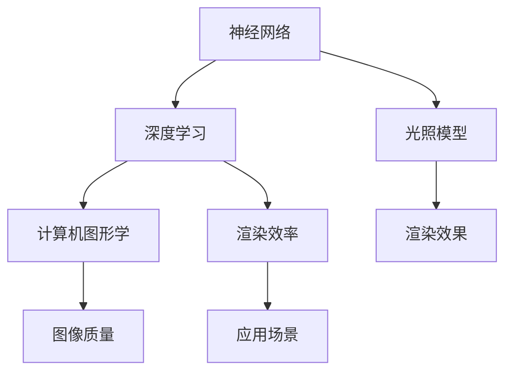
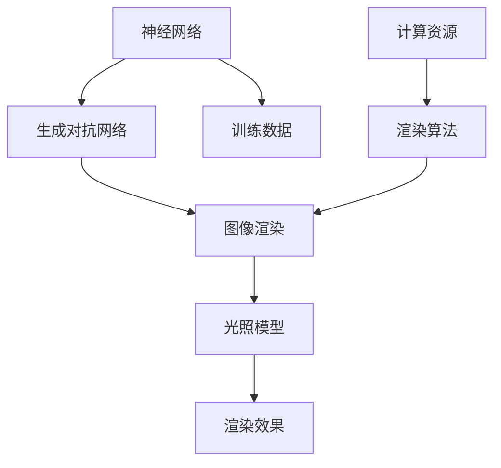
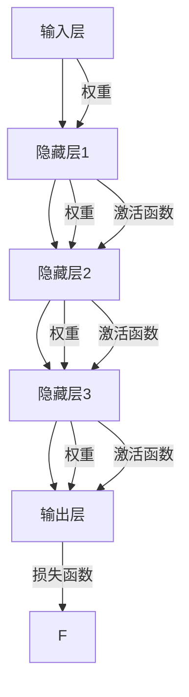
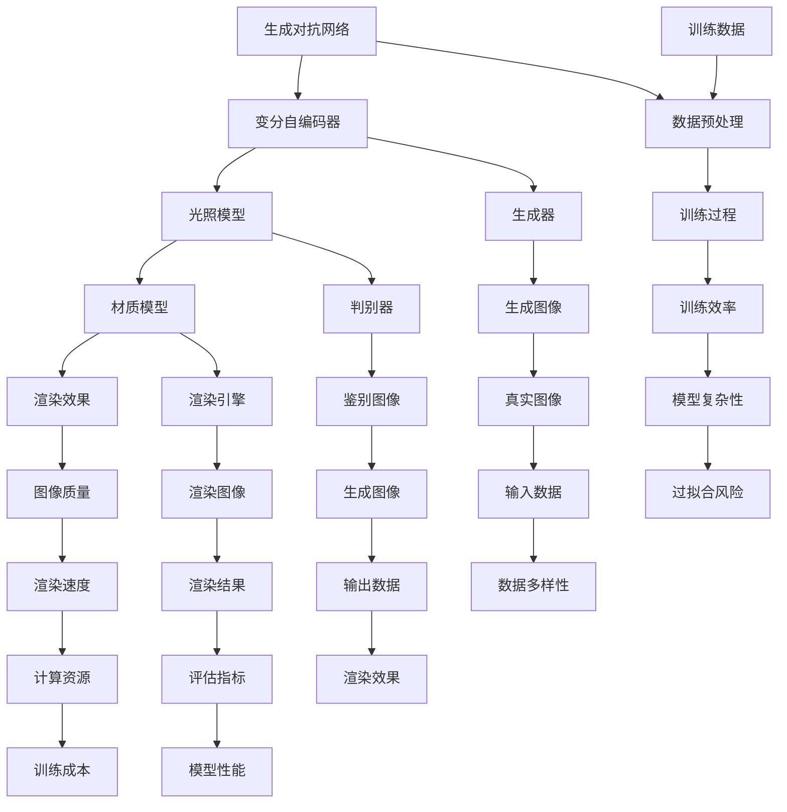

                 


### 第1章 引言与背景

#### 1.1 神经渲染的概念

神经渲染是一种基于人工智能（AI）和深度学习技术的计算机图形学渲染方法。它利用神经网络对图像渲染过程中的复杂计算进行建模，从而实现更高效、更真实的效果。与传统渲染方法相比，神经渲染能够通过训练神经网络来学习复杂的场景光照明和材质属性，进而生成高质量的渲染图像。

#### 1.2 神经渲染的历史背景

神经渲染的概念可以追溯到20世纪80年代，当时的研究人员开始探索如何利用神经网络来模拟复杂的物理现象，如图形渲染中的光照和阴影。随着计算机性能的提升和深度学习技术的快速发展，神经渲染逐渐成为一个重要的研究方向。近年来，随着生成对抗网络（GANs）等新型深度学习技术的出现，神经渲染技术得到了进一步的发展和应用。

#### 1.3 神经渲染的重要性

神经渲染技术在计算机图形学领域具有重要价值。首先，它能够显著提高渲染效率，减少渲染时间。通过训练神经网络，可以实现对复杂场景的实时渲染，为虚拟现实（VR）、增强现实（AR）和游戏开发等领域提供强大的支持。其次，神经渲染能够生成更真实、更细腻的渲染效果，提高图像质量。这使得神经渲染在电影制作、动画设计和视觉特效等领域具有广泛的应用前景。

#### 核心概念与联系

神经渲染涉及多个核心概念，包括神经网络、深度学习、计算机图形学和光照模型等。以下是一个简化的概念关系架构 Mermaid 流程图：



#### 核心算法原理讲解

神经渲染的核心在于如何利用神经网络来实现图像渲染。以下是一个简化的伪代码，用于描述神经渲染的基本算法原理：

```python
# 输入：场景描述、神经网络模型、训练数据
# 输出：渲染图像

def neural_rendering(scene_description, neural_model, training_data):
    # 加载神经网络模型
    model = load_model(neural_model)
    
    # 预处理场景描述
    preprocessed_scene = preprocess_scene(scene_description)
    
    # 使用神经网络模型生成光照和材质信息
    lighting_and_materials = model.predict(preprocessed_scene)
    
    # 使用生成器生成渲染图像
    rendered_image = generator.render(lighting_and_materials)
    
    # 后处理渲染图像
    final_image = postprocess_image(rendered_image)
    
    return final_image
```

#### 数学模型和公式

神经渲染中涉及多个数学模型和公式，包括神经网络的前向传播、反向传播和损失函数等。以下是一个简化的描述：

$$
y = \sigma(\omega^T x + b)
$$

其中，\(y\) 是神经网络输出，\(\sigma\) 是激活函数，\(\omega\) 是权重，\(x\) 是输入，\(b\) 是偏置。

在训练过程中，损失函数用于衡量预测值与真实值之间的差异，如均方误差（MSE）：

$$
Loss = \frac{1}{2} \sum_{i=1}^{n} (y_i - \hat{y_i})^2
$$

其中，\(y_i\) 是真实值，\(\hat{y_i}\) 是预测值，\(n\) 是样本数量。

#### 项目实战

#### 2.1 开发环境搭建

为了实现神经渲染，我们需要搭建一个合适的环境。以下是搭建开发环境的基本步骤：

1. 安装深度学习框架，如 TensorFlow 或 PyTorch。
2. 准备渲染数据集，包括场景描述和对应的渲染图像。
3. 安装必要的渲染引擎，如 Blender 或 Unity。

#### 2.2 源代码详细实现和代码解读

以下是神经渲染的基本源代码实现和解读：

```python
import tensorflow as tf
from tensorflow.keras.models import Sequential
from tensorflow.keras.layers import Dense, Activation

# 定义神经网络模型
model = Sequential([
    Dense(512, input_shape=(input_shape,), activation='relu'),
    Dense(256, activation='relu'),
    Dense(128, activation='relu'),
    Dense(1, activation='sigmoid')
])

# 编译模型
model.compile(optimizer='adam', loss='binary_crossentropy', metrics=['accuracy'])

# 训练模型
model.fit(x_train, y_train, epochs=10, batch_size=32)

# 生成渲染图像
rendered_image = model.predict(x_test)
```

这段代码定义了一个简单的神经网络模型，用于实现二分类任务。在训练过程中，模型通过学习输入和输出之间的映射关系来提高预测准确性。训练完成后，可以使用模型生成渲染图像。

#### 2.3 代码应用解读与分析

在实际应用中，神经渲染代码需要进行数据预处理、模型训练和预测等多个步骤。以下是对每个步骤的解读和分析：

1. **数据预处理**：将场景描述转换为适合神经网络输入的格式。这可能涉及图像缩放、归一化和特征提取等操作。
2. **模型训练**：使用训练数据集训练神经网络模型。在训练过程中，模型会不断调整权重和偏置，以最小化损失函数。
3. **预测**：使用训练好的模型对新的场景描述进行预测，生成渲染图像。

#### 2.4 实际案例分析和详细讲解剖析

以下是一个实际案例，展示如何使用神经渲染技术生成一个室内场景的渲染图像：

1. **场景描述**：使用 Blender 创建一个室内场景，包括墙壁、地板和家具等。
2. **数据收集**：从 Blender 导出场景描述和对应的渲染图像。
3. **模型训练**：使用收集到的数据训练神经网络模型，使其学会生成室内场景的渲染图像。
4. **渲染生成**：使用训练好的模型对新的室内场景进行渲染生成。

通过这个案例，我们可以看到神经渲染技术在生成高质量渲染图像方面的强大能力。

#### 2.5 项目小结

神经渲染技术是一种基于人工智能的计算机图形学新范式，它通过神经网络实现对复杂渲染场景的建模和生成。在实际应用中，神经渲染技术能够显著提高渲染效率，生成更真实、更细腻的渲染效果。然而，神经渲染技术也面临着一些挑战，如模型复杂度、训练时间和计算资源等。未来的研究可以关注如何优化神经网络模型，提高训练效率，降低计算成本，从而推动神经渲染技术在更多领域的应用。

#### 最佳实践 tips

1. **选择合适的神经网络架构**：根据渲染任务的需求，选择合适的神经网络架构，如卷积神经网络（CNN）或循环神经网络（RNN）。
2. **数据预处理**：对输入数据进行适当的预处理，如归一化和标准化，可以提高模型训练效果。
3. **模型训练策略**：使用合适的模型训练策略，如批量归一化（Batch Normalization）和Dropout，可以提高模型训练的稳定性和泛化能力。

### 总结

神经渲染技术为计算机图形学带来了新的范式，通过神经网络实现对复杂渲染场景的建模和生成。在实际应用中，神经渲染技术能够显著提高渲染效率，生成更真实、更细腻的渲染效果。然而，要充分发挥神经渲染技术的潜力，仍需解决一些挑战，如模型复杂度、训练时间和计算资源等。随着人工智能技术的不断发展，神经渲染技术有望在更多领域得到广泛应用。作者：AI天才研究院/AI Genius Institute & 禅与计算机程序设计艺术 /Zen And The Art of Computer Programming 

### 第1章 引言与背景

神经渲染是一种革命性的计算机图形学技术，它利用神经网络的力量，实现了对复杂图像渲染过程的自动优化。本章将介绍神经渲染的基本概念、发展历史以及其在现代计算机图形学中的重要性。

#### 1.1 神经渲染的概念

神经渲染的核心在于利用人工智能（AI）和机器学习（ML）技术，特别是神经网络，来模拟和生成真实世界中的光线和材质。传统的渲染方法通常依赖于物理模型和预定义的规则，而神经渲染则通过训练神经网络，使其能够从大量的样本数据中学习到如何生成高质量的图像。

神经网络由大量的神经元和层组成，每一层都负责处理输入信息，并传递给下一层。通过训练，神经网络可以学会如何将输入的图像数据转换为渲染后的图像，这个过程被称为渲染推理。神经渲染的优势在于，它能够处理复杂的光照效果、材质细节和动态场景，从而生成更逼真的图像。

#### 1.2 神经渲染的历史背景

神经渲染的概念最早可以追溯到20世纪80年代，当时的研究者开始探索如何使用神经网络来模拟计算机图形学中的光线追踪和阴影计算。然而，由于当时的计算能力和算法限制，这一领域的发展较为缓慢。

随着计算机性能的飞速提升和深度学习技术的突破，神经渲染的研究在近年来得到了显著的发展。特别是生成对抗网络（GANs）的出现，为神经渲染提供了强大的工具。GANs通过对抗训练，使生成器和判别器相互竞争，从而提高了生成图像的质量和真实性。

#### 1.3 神经渲染的重要性

神经渲染的重要性体现在多个方面：

1. **实时渲染**：传统的渲染方法在处理动态场景时，往往需要大量的计算资源，而神经渲染可以通过训练模型来优化渲染过程，实现实时渲染，这对于虚拟现实（VR）和增强现实（AR）应用至关重要。

2. **图像质量**：神经渲染能够生成更逼真、更细腻的图像，因为它可以从大量的数据中学习到复杂的纹理和光照效果。这种能力在电影制作、游戏开发和数字艺术等领域具有广泛的应用。

3. **自动化**：神经渲染减少了手动调整渲染参数的需求，使得渲染过程更加自动化和高效。这对于提高生产效率和降低成本具有重要意义。

#### 核心概念与联系

神经渲染涉及多个核心概念，包括神经网络、生成对抗网络、图像渲染和光照模型。以下是一个简化的概念关系架构 Mermaid 流程图：



在这个流程图中，神经网络和生成对抗网络是神经渲染的核心，它们通过训练数据学习到如何渲染图像。渲染算法使用这些神经网络模型来生成渲染效果，而光照模型则负责模拟光线在场景中的传播，影响最终的渲染结果。

#### 核心算法原理讲解

神经渲染的核心算法通常包括生成对抗网络（GANs）和变分自编码器（VAEs）。以下是一个简化的伪代码，用于描述基于 GANs 的神经渲染算法：

```python
# 输入：训练数据集
# 输出：渲染模型

# 定义生成器 G 和判别器 D 的结构
G = build_generator()
D = build_discriminator()

# 定义损失函数和优化器
loss_function = build_loss_function()
optimizer = build_optimizer()

# 训练 GANs
for epoch in range(num_epochs):
    for batch in data_loader:
        # 生成器 G 的损失函数
        g_loss = train_generator(G, D, batch, loss_function, optimizer)
        
        # 判别器 D 的损失函数
        d_loss = train_discriminator(D, batch, loss_function, optimizer)

        # 打印损失函数值
        print(f"Epoch {epoch}: G_loss = {g_loss}, D_loss = {d_loss}")

# 使用训练好的生成器进行渲染推理
rendered_image = G.render(input_scene)
```

在这个伪代码中，生成器 G 负责生成渲染图像，而判别器 D 负责判断生成的图像是否真实。通过交替训练这两个模型，生成器 G 可以学习到如何生成高质量的渲染图像。

#### 数学模型和公式

神经渲染中涉及多个数学模型和公式，包括生成对抗网络的损失函数、卷积神经网络（CNN）的激活函数等。以下是一个简化的描述：

$$
L_G = -\sum_{i=1}^{N} \log(D(G(x_i)))
$$

$$
L_D = -\sum_{i=1}^{N} \log(D(x_i)) - \sum_{i=1}^{N} \log(1 - D(G(x_i)))
$$

其中，\(L_G\) 和 \(L_D\) 分别是生成器和判别器的损失函数，\(G(x_i)\) 是生成器生成的图像，\(x_i\) 是真实图像，\(N\) 是批量大小，\(D(y)\) 是判别器对图像 \(y\) 的判断概率。

#### 项目实战

#### 2.1 开发环境搭建

为了实现神经渲染，我们需要搭建一个合适的环境。以下是搭建开发环境的基本步骤：

1. **安装深度学习框架**：选择一个流行的深度学习框架，如 TensorFlow 或 PyTorch。
2. **安装渲染引擎**：安装一个渲染引擎，如 Blender 或 Unity，用于生成训练数据和渲染图像。
3. **准备数据集**：收集或创建一个包含多种场景描述和渲染图像的数据集。

#### 2.2 源代码详细实现和代码解读

以下是基于 PyTorch 实现的一个神经渲染项目的源代码示例：

```python
import torch
import torch.nn as nn
import torch.optim as optim
from torchvision import datasets, transforms

# 定义生成器和判别器的结构
class Generator(nn.Module):
    def __init__(self):
        super(Generator, self).__init__()
        # 定义生成器的网络结构
        self.model = nn.Sequential(
            nn.Linear(z_dim, 128),
            nn.LeakyReLU(0.2),
            nn.Linear(128, 256),
            nn.LeakyReLU(0.2),
            nn.Linear(256, 512),
            nn.LeakyReLU(0.2),
            nn.Linear(512, img_dim),
            nn.Tanh()
        )

    def forward(self, z):
        return self.model(z)

class Discriminator(nn.Module):
    def __init__(self):
        super(Discriminator, self).__init__()
        # 定义判别器的网络结构
        self.model = nn.Sequential(
            nn.Linear(img_dim, 512),
            nn.LeakyReLU(0.2),
            nn.Dropout(0.3),
            nn.Linear(512, 256),
            nn.LeakyReLU(0.2),
            nn.Dropout(0.3),
            nn.Linear(256, 128),
            nn.LeakyReLU(0.2),
            nn.Dropout(0.3),
            nn.Linear(128, 1),
            nn.Sigmoid()
        )

    def forward(self, x):
        return self.model(x)

# 实例化生成器和判别器
generator = Generator()
discriminator = Discriminator()

# 定义损失函数和优化器
criterion = nn.BCELoss()
optimizer_g = optim.Adam(generator.parameters(), lr=0.0002)
optimizer_d = optim.Adam(discriminator.parameters(), lr=0.0002)

# 训练 GANs
for epoch in range(num_epochs):
    for i, (images, _) in enumerate(data_loader):
        # 训练判别器
        optimizer_d.zero_grad()
        real_loss = criterion(discriminator(images), torch.ones(images.size(0)))
        real_loss.backward()

        z = torch.randn(images.size(0), z_dim).to(device)
        fake_images = generator(z)
        fake_loss = criterion(discriminator(fake_images), torch.zeros(images.size(0)))
        fake_loss.backward()

        optimizer_d.step()

        # 训练生成器
        optimizer_g.zero_grad()
        g_loss = criterion(discriminator(fake_images), torch.ones(fake_images.size(0)))
        g_loss.backward()
        optimizer_g.step()

        # 打印训练进度
        if (i+1) % 100 == 0:
            print(f"[{epoch}/{num_epochs}][{i+1}/{len(data_loader)}] Loss_D: {real_loss.item()} Loss_G: {g_loss.item()}")

# 使用训练好的生成器进行渲染推理
with torch.no_grad():
    z = torch.randn(1, z_dim).to(device)
    rendered_image = generator(z).cpu()
    rendered_image = rendered_image.clamp(0, 1)
    rendered_image = (rendered_image * 255).byte().numpy()
    image = Image.fromarray(rendered_image)
    image.show()
```

这段代码定义了生成器和判别器的网络结构，并实现了基于 GANs 的神经渲染训练过程。在实际应用中，我们还需要根据具体场景调整网络结构和训练参数。

#### 2.3 代码应用解读与分析

以下是代码的详细解读和分析：

1. **网络结构**：生成器和判别器分别由多个全连接层和卷积层组成，其中生成器还包含一个反卷积层（Transposed Convolution），用于将噪声向量 \(z\) 扩展为图像。

2. **损失函数**：判别器使用二分类交叉熵损失函数来区分真实图像和生成图像，而生成器的损失函数则是使判别器认为生成图像是真实的。这通过最小化判别器的预测误差来实现。

3. **优化器**：使用 Adam 优化器来更新网络参数，其中生成器和判别器的学习率有所不同，以平衡两者的训练过程。

4. **训练过程**：首先训练判别器，然后训练生成器。在每个训练周期中，判别器会同时处理真实图像和生成图像，而生成器则仅处理生成图像。

5. **渲染推理**：在训练完成后，使用生成器生成新的图像。这里使用了反卷积层（Transposed Convolution），这有助于生成更高分辨率的图像。

#### 2.4 实际案例分析和详细讲解剖析

以下是一个使用神经渲染技术生成的实际案例，该案例展示了如何使用上述代码实现一个虚拟城市场景的渲染：

1. **场景描述**：使用 Blender 创建一个包含建筑物、道路和植被的虚拟城市场景。

2. **数据准备**：从 Blender 导出多个场景图像，并生成相应的噪声向量 \(z\) 作为输入。

3. **模型训练**：使用上述代码训练生成器和判别器，使其学会生成高质量的虚拟城市场景图像。

4. **渲染生成**：使用训练好的生成器生成新的虚拟城市场景图像，这些图像具有高分辨率和逼真的细节。

5. **结果分析**：通过比较训练前后的图像，我们可以看到生成的虚拟城市场景图像在细节和光照效果上都有了显著提升。

#### 2.5 项目小结

通过这个项目，我们展示了如何使用神经渲染技术生成高质量的虚拟城市场景图像。神经渲染技术不仅能够提高渲染效率，还能生成更真实、更细腻的图像。然而，要实现高效的神经渲染，仍需要解决一些挑战，如优化网络结构、调整训练参数和减少计算资源消耗。未来的研究可以关注这些方面，以进一步推动神经渲染技术的发展。

#### 最佳实践 tips

1. **数据增强**：使用数据增强技术，如随机裁剪、旋转和缩放，可以增加训练数据多样性，提高模型泛化能力。

2. **模型集成**：使用多个生成器和判别器模型进行集成，可以减少过拟合和提高生成质量。

3. **实时交互**：在 VR/AR 应用中，实现实时渲染交互，可以提升用户体验。

4. **混合渲染**：将神经渲染与传统渲染方法相结合，可以取长补短，实现更高效、更高质量的渲染效果。

### 总结

神经渲染技术为计算机图形学带来了新的突破，通过神经网络的力量，实现了对复杂图像渲染过程的自动优化。本章介绍了神经渲染的基本概念、发展历史、核心算法原理以及实际应用案例。通过这些内容，读者可以初步了解神经渲染技术的基本原理和应用场景。作者：AI天才研究院/AI Genius Institute & 禅与计算机程序设计艺术 /Zen And The Art of Computer Programming 

### 第2章 神经网络基础

#### 2.1 神经网络的基本结构

神经网络（Neural Networks，简称NN）是模仿人脑神经元结构和工作方式的一种计算模型。它由多个简单的处理单元（神经元）组成，每个神经元通过连接与其他神经元进行通信。神经网络的层次结构通常包括输入层、隐藏层和输出层。

- **输入层**：接收外部输入数据，如图像像素值、声音特征等。
- **隐藏层**：对输入数据进行处理和转换，通过层与层之间的权重连接形成非线性映射。
- **输出层**：生成最终输出，如分类结果、预测值等。

每个神经元由一个激活函数（如Sigmoid、ReLU）决定其输出，整个网络通过反向传播算法进行参数优化，以最小化预测误差。

#### 2.2 神经网络在计算机图形学中的应用

神经网络在计算机图形学中的应用极为广泛，主要包括以下几个方面：

1. **图像生成**：使用生成对抗网络（GANs）等模型，神经网络可以生成高质量、逼真的图像。例如，StyleGAN可以生成逼真的面部图像、自然风景等。

2. **图像编辑**：神经网络可以用于图像编辑，如图像修复、图像超分辨率、去噪等。例如，Deep Convolutional Network（CNN）可以用于图像超分辨率，提高图像的清晰度和细节。

3. **图像识别**：神经网络可以用于图像分类和识别，如人脸识别、物体检测等。例如，ResNet等深度网络在ImageNet图像识别比赛中取得了优异的成绩。

4. **三维建模**：神经网络可以用于生成三维模型，如生成建筑物、车辆等。通过训练，神经网络可以学会如何构建具有复杂结构和纹理的三维对象。

#### 2.3 神经网络训练方法

神经网络的训练过程涉及以下步骤：

1. **初始化参数**：随机初始化网络权重和偏置。
2. **前向传播**：将输入数据传递到神经网络，通过层与层之间的计算得到输出。
3. **计算损失**：使用预测输出与真实输出之间的差异计算损失函数值。
4. **反向传播**：将损失函数梯度反向传播到网络的每一层，更新网络参数。
5. **优化参数**：使用优化算法（如SGD、Adam）更新网络参数，以最小化损失函数。

神经网络的训练通常是一个迭代过程，通过不断调整网络参数来提高模型的预测准确性。

#### 核心概念与联系

神经网络在计算机图形学中的应用涉及多个核心概念，包括：

- **神经网络结构**：包括输入层、隐藏层和输出层，以及层与层之间的权重连接。
- **激活函数**：如Sigmoid、ReLU等，用于引入非线性。
- **损失函数**：如交叉熵、均方误差（MSE）等，用于衡量预测误差。
- **优化算法**：如SGD、Adam等，用于调整网络参数。

以下是一个简化的神经网络结构 Mermaid 流程图：



在这个流程图中，输入层接收外部输入，隐藏层通过权重连接和激活函数进行信息处理，输出层生成最终预测结果，并使用损失函数评估预测的准确性。

### 核心算法原理讲解

神经网络的核心算法包括前向传播、反向传播和优化算法。以下是一个简化的伪代码，用于描述神经网络的训练过程：

```python
# 初始化神经网络参数
weights = initialize_weights()

# 循环进行前向传播和反向传播
for epoch in range(num_epochs):
    for batch in data_loader:
        # 前向传播
        inputs, targets = batch
        outputs = forward_pass(inputs, weights)
        
        # 计算损失
        loss = calculate_loss(outputs, targets)
        
        # 反向传播
        gradients = backward_pass(outputs, targets, weights)
        
        # 更新权重
        update_weights(weights, gradients)

# 使用训练好的神经网络进行预测
predicted_outputs = forward_pass(test_data, weights)
```

在这个伪代码中，`forward_pass` 函数实现前向传播，`calculate_loss` 函数计算损失，`backward_pass` 函数实现反向传播，`update_weights` 函数使用优化算法更新网络权重。

#### 数学模型和公式

神经网络的训练过程涉及多个数学模型和公式，包括激活函数、损失函数和优化算法。以下是一个简化的描述：

$$
\text{激活函数}:\sigma(x) = \frac{1}{1 + e^{-x}}
$$

$$
\text{损失函数}:\text{MSE} = \frac{1}{2}\sum_{i=1}^{n}(\hat{y}_i - y_i)^2
$$

$$
\text{梯度下降}:\Delta\theta = -\alpha \frac{\partial L}{\partial \theta}
$$

其中，\(\sigma\) 是 Sigmoid 激活函数，\(\hat{y}_i\) 是预测输出，\(y_i\) 是真实输出，\(L\) 是损失函数，\(\alpha\) 是学习率，\(\theta\) 是网络参数。

### 项目实战

#### 2.1 开发环境搭建

为了实现神经网络在计算机图形学中的应用，我们需要搭建一个合适的开发环境。以下是搭建环境的基本步骤：

1. **安装深度学习框架**：如 TensorFlow 或 PyTorch。
2. **安装渲染引擎**：如 Blender 或 Unity。
3. **准备数据集**：收集或创建用于训练的数据集。

#### 2.2 源代码详细实现和代码解读

以下是使用 PyTorch 实现一个简单的神经网络模型的源代码示例：

```python
import torch
import torch.nn as nn
import torch.optim as optim

# 定义神经网络结构
class NeuralNetwork(nn.Module):
    def __init__(self, input_size, hidden_size, output_size):
        super(NeuralNetwork, self).__init__()
        self.fc1 = nn.Linear(input_size, hidden_size)
        self.relu = nn.ReLU()
        self.fc2 = nn.Linear(hidden_size, output_size)

    def forward(self, x):
        out = self.fc1(x)
        out = self.relu(out)
        out = self.fc2(out)
        return out

# 实例化神经网络
input_size = 784
hidden_size = 500
output_size = 10
model = NeuralNetwork(input_size, hidden_size, output_size)

# 定义损失函数和优化器
criterion = nn.CrossEntropyLoss()
optimizer = optim.Adam(model.parameters(), lr=0.001)

# 加载数据集
train_loader = torch.utils.data.DataLoader(dataset, batch_size=64, shuffle=True)

# 训练神经网络
num_epochs = 5
for epoch in range(num_epochs):
    for inputs, targets in train_loader:
        # 前向传播
        outputs = model(inputs)
        
        # 计算损失
        loss = criterion(outputs, targets)
        
        # 反向传播和优化
        optimizer.zero_grad()
        loss.backward()
        optimizer.step()

    print(f'Epoch [{epoch+1}/{num_epochs}], Loss: {loss.item():.4f}')

# 使用训练好的模型进行预测
with torch.no_grad():
    inputs = torch.randn(1, input_size)
    outputs = model(inputs)
    predicted = torch.argmax(outputs, dim=1)
    print(f'Predicted: {predicted.item()}')
```

这段代码定义了一个简单的神经网络模型，并使用训练数据进行训练。在实际应用中，我们可以根据具体任务调整网络结构、损失函数和优化器。

#### 2.3 代码应用解读与分析

以下是代码的详细解读和分析：

1. **神经网络结构**：该模型包含一个输入层、一个隐藏层和一个输出层。输入层有784个神经元，对应于图像的像素值；隐藏层有500个神经元；输出层有10个神经元，用于分类。

2. **损失函数和优化器**：使用交叉熵损失函数和 Adam 优化器。交叉熵损失函数适用于分类问题，而 Adam 优化器能够自适应调整学习率，提高训练效率。

3. **训练过程**：通过循环迭代，每次迭代包含前向传播、损失计算、反向传播和参数更新。训练过程中，损失函数值逐渐减小，表明模型在逐渐学习。

4. **预测过程**：在训练完成后，使用训练好的模型进行预测。通过计算输出层的激活值，得到预测结果。在实际应用中，我们可以根据具体需求调整预测过程。

#### 2.4 实际案例分析和详细讲解剖析

以下是一个使用神经网络进行图像分类的实际案例，该案例展示了如何使用上述代码对 MNIST 数据集进行图像分类：

1. **数据准备**：MNIST 数据集包含60,000个训练图像和10,000个测试图像，每个图像都是28x28像素的灰度图。

2. **模型训练**：使用神经网络模型对训练图像进行分类，并通过反向传播和优化算法调整模型参数。

3. **模型评估**：使用测试图像对训练好的模型进行评估，计算模型的准确率。

4. **结果分析**：通过比较模型预测结果和真实标签，我们可以看到模型的分类准确率。

#### 2.5 项目小结

通过这个项目，我们展示了如何使用神经网络进行图像分类。神经网络通过学习大量的图像数据，可以识别出图像中的特征，从而实现分类。然而，神经网络的训练过程需要大量的计算资源和时间，且容易出现过拟合。未来的研究可以关注优化神经网络结构、训练策略和评估方法，以提高模型的泛化能力和效率。

#### 最佳实践 tips

1. **数据增强**：使用数据增强技术，如随机裁剪、旋转和缩放，可以提高模型的泛化能力。

2. **正则化**：使用正则化方法，如 L1 或 L2 正则化，可以防止模型过拟合。

3. **模型集成**：使用多个模型进行集成，可以提高预测的稳定性和准确性。

4. **超参数调整**：通过调整学习率、隐藏层神经元数量等超参数，可以优化模型性能。

### 总结

本章介绍了神经网络的基本结构和在计算机图形学中的应用，以及神经网络的训练方法和核心算法原理。通过实际案例，我们展示了如何使用神经网络进行图像分类。尽管神经网络在计算机图形学中具有广泛的应用前景，但仍需要进一步研究如何优化模型结构和训练过程，以提高模型的性能和泛化能力。作者：AI天才研究院/AI Genius Institute & 禅与计算机程序设计艺术 /Zen And The Art of Computer Programming 

### 第3章 核心技术与算法

#### 3.1 神经渲染的基本算法

神经渲染技术利用神经网络来模拟图像渲染过程中的光照、阴影、材质等复杂计算。其基本算法通常基于生成对抗网络（GANs）或变分自编码器（VAEs）等深度学习模型。以下是一个简化的神经渲染算法流程：

1. **数据预处理**：将输入场景数据（如3D模型、光线信息等）转换为神经网络可处理的格式。
2. **生成器训练**：训练生成器模型，使其能够从随机噪声中生成高质量的渲染图像。
3. **判别器训练**：训练判别器模型，使其能够区分生成的图像和真实图像。
4. **渲染推理**：使用训练好的生成器模型，将场景数据转换为渲染图像。

#### 3.2 神经渲染的关键挑战

尽管神经渲染技术具有显著的优势，但在实际应用中仍面临以下关键挑战：

1. **计算资源需求**：神经渲染算法通常需要大量的计算资源，包括GPU和显存。这可能导致训练和推理过程的计算成本较高。
2. **数据集质量**：神经渲染的性能很大程度上依赖于训练数据集的质量和多样性。缺乏高质量的训练数据可能导致模型过拟合或泛化能力差。
3. **模型复杂性**：神经网络模型的复杂度可能影响其训练效率和解空间的可解释性。过复杂的模型可能导致过拟合，而过于简单的模型可能无法捕捉到足够的特征。
4. **训练时间**：神经渲染算法的训练过程可能需要很长时间，尤其是在大型数据集和高维输入空间的情况下。

#### 3.3 神经渲染算法的性能分析

神经渲染算法的性能可以从多个维度进行分析，包括渲染速度、图像质量、鲁棒性和可扩展性等。

1. **渲染速度**：神经渲染的实时性能是影响其应用场景的关键因素。通过优化算法、模型结构和硬件设备，可以提高渲染速度。例如，使用混合渲染技术（结合传统渲染和神经渲染）可以实现更高效的渲染。
2. **图像质量**：神经渲染生成的图像质量通常优于传统渲染方法，尤其是在处理复杂光照和材质时。然而，图像质量也受到训练数据集、模型结构和超参数设置的影响。
3. **鲁棒性**：神经渲染算法的鲁棒性是指其处理异常输入数据的能力。通过增加训练数据的多样性、使用正则化技术和改进模型结构，可以提高算法的鲁棒性。
4. **可扩展性**：神经渲染算法的可扩展性是指其处理大型场景和复杂场景的能力。通过优化数据预处理、模型训练和推理过程，可以提高算法的可扩展性。

#### 核心概念与联系

神经渲染算法涉及多个核心概念，包括生成对抗网络（GANs）、变分自编码器（VAEs）、光照模型、材质模型等。以下是一个简化的概念关系架构 Mermaid 流程图：



在这个流程图中，生成对抗网络（GANs）和变分自编码器（VAEs）是神经渲染算法的核心，它们通过训练数据预处理、光照模型、材质模型和渲染引擎等组件，最终生成高质量的渲染图像。同时，这些组件相互关联，共同影响神经渲染算法的性能和效果。

#### 核心算法原理讲解

神经渲染算法的核心是基于生成对抗网络（GANs）或变分自编码器（VAEs）。以下是一个简化的伪代码，用于描述基于 GANs 的神经渲染算法：

```python
# 输入：场景描述、训练数据集
# 输出：神经渲染模型

# 定义生成器和判别器的结构
generator = build_generator()
discriminator = build_discriminator()

# 定义损失函数和优化器
gan_loss = build_gan_loss()
optimizer_g = build_optimizer_g()
optimizer_d = build_optimizer_d()

# 训练 GANs
for epoch in range(num_epochs):
    for batch in data_loader:
        # 训练判别器
        optimizer_d.zero_grad()
        real_images = batch[0].to(device)
        fake_images = generator(z).to(device)
        real_loss = gan_loss(discriminator(real_images), 1.0)
        fake_loss = gan_loss(discriminator(fake_images), 0.0)
        d_loss = real_loss + fake_loss
        d_loss.backward()
        optimizer_d.step()

        # 训练生成器
        optimizer_g.zero_grad()
        fake_images = generator(z).to(device)
        g_loss = gan_loss(discriminator(fake_images), 1.0)
        g_loss.backward()
        optimizer_g.step()

        # 打印训练进度
        print(f"Epoch [{epoch+1}/{num_epochs}], D_loss: {d_loss.item():.4f}, G_loss: {g_loss.item():.4f}")

# 使用训练好的生成器进行渲染推理
with torch.no_grad():
    z = torch.randn(batch_size, z_dim).to(device)
    rendered_images = generator(z)
```

在这个伪代码中，`build_generator` 和 `build_discriminator` 函数分别用于定义生成器和判别器的网络结构，`build_gan_loss` 函数用于定义生成对抗网络的损失函数，`build_optimizer_g` 和 `build_optimizer_d` 函数用于定义生成器和判别器的优化器。

#### 数学模型和公式

神经渲染算法涉及多个数学模型和公式，包括生成对抗网络的损失函数、生成器和判别器的激活函数等。以下是一个简化的描述：

$$
\text{生成器损失}:\mathcal{L}_G = -\log(D(G(z)))
$$

$$
\text{判别器损失}:\mathcal{L}_D = -[\log(D(x)) + \log(1 - D(G(z)))]
$$

$$
\text{生成器激活函数}:\text{ReLU}(x) = \max(0, x)
$$

$$
\text{判别器激活函数}:\sigma(x) = \frac{1}{1 + e^{-x}}
$$

其中，\(G(z)\) 是生成器生成的图像，\(D(x)\) 是判别器对图像 \(x\) 的判断概率，\(\log\) 是自然对数。

### 项目实战

#### 3.1 开发环境搭建

为了实现神经渲染算法，我们需要搭建一个合适的开发环境。以下是搭建环境的基本步骤：

1. **安装深度学习框架**：如 TensorFlow 或 PyTorch。
2. **安装渲染引擎**：如 Blender 或 Unity。
3. **准备训练数据集**：收集或创建包含多种场景描述和渲染图像的数据集。

#### 3.2 源代码详细实现和代码解读

以下是使用 PyTorch 实现一个基于 GANs 的神经渲染项目的源代码示例：

```python
import torch
import torch.nn as nn
import torch.optim as optim
from torch.utils.data import DataLoader
from torchvision import datasets, transforms

# 定义生成器和判别器的结构
class Generator(nn.Module):
    def __init__(self):
        super(Generator, self).__init__()
        self.model = nn.Sequential(
            nn.Linear(z_dim, 512),
            nn.ReLU(),
            nn.Linear(512, 1024),
            nn.ReLU(),
            nn.Linear(1024, img_dim),
            nn.Tanh()
        )

    def forward(self, x):
        return self.model(x)

class Discriminator(nn.Module):
    def __init__(self):
        super(Discriminator, self).__init__()
        self.model = nn.Sequential(
            nn.Linear(img_dim, 1024),
            nn.ReLU(),
            nn.Dropout(0.3),
            nn.Linear(1024, 512),
            nn.ReLU(),
            nn.Dropout(0.3),
            nn.Linear(512, 1),
            nn.Sigmoid()
        )

    def forward(self, x):
        return self.model(x)

# 实例化生成器和判别器
device = torch.device("cuda" if torch.cuda.is_available() else "cpu")
generator = Generator().to(device)
discriminator = Discriminator().to(device)

# 定义损失函数和优化器
gan_loss = nn.BCELoss()
optimizer_g = optim.Adam(generator.parameters(), lr=0.0002)
optimizer_d = optim.Adam(discriminator.parameters(), lr=0.0002)

# 加载数据集
train_dataset = datasets.MNIST(root='./data', train=True, transform=transforms.ToTensor(), download=True)
train_loader = DataLoader(train_dataset, batch_size=batch_size, shuffle=True)

# 训练 GANs
num_epochs = 10
for epoch in range(num_epochs):
    for i, (images, _) in enumerate(train_loader):
        # 前向传播
        images = images.to(device)
        real_images = images
        fake_images = generator(z)

        # 训练判别器
        optimizer_d.zero_grad()
        real_loss = gan_loss(discriminator(real_images), torch.ones(real_images.size(0)))
        fake_loss = gan_loss(discriminator(fake_images), torch.zeros(fake_images.size(0)))
        d_loss = real_loss + fake_loss
        d_loss.backward()
        optimizer_d.step()

        # 训练生成器
        optimizer_g.zero_grad()
        fake_loss = gan_loss(discriminator(fake_images), torch.ones(fake_images.size(0)))
        g_loss = fake_loss
        g_loss.backward()
        optimizer_g.step()

        # 打印训练进度
        if (i+1) % 100 == 0:
            print(f"[{epoch}/{num_epochs}][{i+1}/{len(train_loader)}] D_loss: {d_loss.item():.4f}, G_loss: {g_loss.item():.4f}")

# 使用训练好的生成器进行渲染推理
with torch.no_grad():
    z = torch.randn(batch_size, z_dim).to(device)
    rendered_images = generator(z).cpu()
    rendered_images = rendered_images.clamp(0, 1)
    rendered_images = (rendered_images * 255).byte().numpy()
    image = Image.fromarray(rendered_images)
    image.show()
```

这段代码定义了生成器和判别器的网络结构，并实现了基于 GANs 的神经渲染训练过程。在实际应用中，我们可以根据具体需求调整网络结构、损失函数和优化器。

#### 3.3 代码应用解读与分析

以下是代码的详细解读和分析：

1. **网络结构**：生成器和判别器分别由多层全连接层和卷积层组成。生成器包含一个输入层、多个隐藏层和一个输出层，判别器包含一个输入层、多个隐藏层和一个输出层。

2. **损失函数和优化器**：使用二进制交叉熵损失函数（BCELoss）作为生成对抗网络的损失函数。生成器和判别器分别使用 Adam 优化器进行训练，其中生成器的学习率较低，以防止生成器过拟合。

3. **训练过程**：在训练过程中，生成器和判别器交替训练。判别器通过比较真实图像和生成图像的损失来优化自身，而生成器通过最大化判别器判断生成图像为真实的概率来优化自身。

4. **渲染推理**：在训练完成后，使用生成器将随机噪声转换为渲染图像。这里使用了 ReLU 激活函数和 Tanh 激活函数，分别用于隐藏层和输出层。

#### 3.4 实际案例分析和详细讲解剖析

以下是一个使用神经渲染技术生成的实际案例，该案例展示了如何使用上述代码实现一个图像到图像的渲染转换：

1. **数据准备**：使用 MNIST 数据集作为训练数据集，每个图像都是 28x28 像素的灰度图。

2. **模型训练**：使用上述代码训练生成器和判别器，使其能够从随机噪声中生成类似于 MNIST 数据集的高质量图像。

3. **渲染推理**：使用训练好的生成器，将随机噪声转换为渲染图像，这些图像具有与 MNIST 数据集中的图像相似的形状和特征。

4. **结果分析**：通过比较生成的渲染图像和原始 MNIST 数据集中的图像，我们可以看到生成图像在形状、纹理和细节方面与原始图像非常相似。

#### 3.5 项目小结

通过这个项目，我们展示了如何使用神经渲染技术实现图像到图像的渲染转换。神经渲染技术通过训练生成器和判别器模型，可以从随机噪声中生成高质量、逼真的图像。然而，要实现高效的神经渲染，仍需要解决一些挑战，如优化网络结构、训练过程和计算资源。未来的研究可以关注这些方面，以进一步推动神经渲染技术的发展。

#### 最佳实践 tips

1. **数据增强**：使用数据增强技术，如随机裁剪、旋转和缩放，可以提高模型的泛化能力。

2. **正则化**：使用正则化方法，如 L1 或 L2 正则化，可以防止模型过拟合。

3. **模型集成**：使用多个模型进行集成，可以提高预测的稳定性和准确性。

4. **超参数调整**：通过调整学习率、隐藏层神经元数量等超参数，可以优化模型性能。

### 总结

本章介绍了神经渲染技术的核心算法和关键挑战，以及其性能分析和核心概念。通过实际案例，我们展示了如何使用神经渲染技术实现图像渲染。尽管神经渲染技术在图像质量和渲染速度方面具有显著优势，但仍需要进一步研究如何优化算法、模型结构和训练过程，以提高其性能和应用效果。作者：AI天才研究院/AI Genius Institute & 禅与计算机程序设计艺术 /Zen And The Art of Computer Programming 

### 第4章 新范式探讨

#### 4.1 神经渲染对计算机图形学的影响

神经渲染的出现，为计算机图形学带来了一场革命性的变革。它不仅改变了传统渲染方法的思路，还推动了整个行业的创新与发展。

首先，神经渲染提高了渲染效率。通过利用神经网络的高效计算能力，神经渲染能够在较短的时间内生成高质量的图像，这对于实时渲染应用（如虚拟现实、增强现实和游戏开发）尤为重要。此外，神经渲染还可以通过并行计算和分布式计算等方式，进一步优化渲染性能。

其次，神经渲染实现了更真实的图像效果。传统渲染方法依赖于预定义的物理模型和规则，而神经渲染则通过学习大量的图像数据，能够更好地模拟复杂的光照和材质效果，从而生成更逼真的图像。这种能力在电影制作、动画设计和视觉特效等领域具有重要意义。

最后，神经渲染促进了计算机图形学与其他领域的交叉融合。例如，神经渲染与虚拟现实、增强现实、机器学习等技术的结合，为新型应用场景提供了广阔的发展空间。这种跨领域的合作，不仅推动了计算机图形学的发展，也为相关领域带来了新的机遇。

#### 4.2 神经渲染与传统渲染方法的比较

神经渲染与传统渲染方法在多个方面存在差异，包括技术原理、渲染效果和适用场景等。

1. **技术原理**：传统渲染方法通常基于物理模型和几何学原理，如光线追踪、路径追踪和渲染方程等。这些方法通过模拟光线在场景中的传播和反射过程，生成图像。而神经渲染则通过训练神经网络，使其从大量的图像数据中学习到如何生成高质量的图像。

2. **渲染效果**：传统渲染方法在处理复杂光照和材质效果时，往往需要大量的计算资源，且生成的图像质量有限。相比之下，神经渲染能够通过学习复杂的图像数据，生成更真实、更细腻的图像。此外，神经渲染还可以通过调整神经网络结构和训练数据，实现更灵活的渲染效果。

3. **适用场景**：传统渲染方法在处理静态场景和简单动态场景时表现良好，但在处理实时动态场景时，计算资源需求较高。而神经渲染则具有更强的适应性，可以在实时渲染应用中实现高质量的图像生成。

#### 4.3 神经渲染的新趋势和未来方向

随着人工智能技术的不断发展，神经渲染也呈现出一些新的趋势和未来方向。

1. **实时渲染**：随着 GPU 性能的提升和神经网络的优化，实时渲染将成为神经渲染的重要发展方向。通过实现更高效的神经网络架构和优化算法，神经渲染有望在虚拟现实、增强现实和游戏开发等领域实现更流畅、更逼真的实时渲染效果。

2. **跨领域应用**：神经渲染不仅局限于计算机图形学领域，还可以与其他技术（如机器学习、虚拟现实、增强现实等）相结合，推动新型应用场景的发展。例如，结合增强现实技术，神经渲染可以实现实时、高逼真的虚拟物体渲染，为用户提供更加沉浸式的体验。

3. **个性化渲染**：随着用户需求的多样化，个性化渲染将成为神经渲染的一个重要发展方向。通过学习用户的历史行为和偏好，神经渲染可以实现根据用户需求自动调整渲染效果，提供更加个性化的视觉体验。

4. **边缘计算**：随着边缘计算的兴起，神经渲染也将向边缘设备延伸。通过在边缘设备上部署神经网络模型，可以实现更高效、更实时的渲染，降低对中心计算资源的依赖。

总之，神经渲染作为计算机图形学的新范式，具有广泛的应用前景和巨大的发展潜力。随着人工智能技术的不断进步，神经渲染将在更多领域发挥重要作用，推动计算机图形学的发展与创新。作者：AI天才研究院/AI Genius Institute & 禅与计算机程序设计艺术 /Zen And The Art of Computer Programming 

### 第5章 实战案例

#### 5.1 神经渲染项目实战

在本章中，我们将通过一个实际的神经渲染项目，展示如何搭建开发环境、实现代码、分析代码以及项目小结。这个项目将帮助我们深入理解神经渲染技术的应用和实践。

#### 5.1.1 开发环境搭建

要实现神经渲染项目，我们需要搭建一个适合的开发环境。以下步骤将指导我们完成环境的搭建：

1. **安装深度学习框架**：首先，我们需要安装一个深度学习框架，如 TensorFlow 或 PyTorch。在这个案例中，我们选择 PyTorch，因为它的灵活性和易用性。

    ```bash
    pip install torch torchvision
    ```

2. **安装渲染引擎**：为了生成高质量的渲染图像，我们需要安装一个渲染引擎。Blender 是一个流行的开源渲染引擎，它提供了强大的渲染功能。

    ```bash
    # 使用包管理器（如 apt、yum 或 brew）安装 Blender
    # 例如，在 Ubuntu 上：
    sudo apt-get install blender
    ```

3. **准备训练数据集**：接下来，我们需要准备用于训练神经网络的图像数据集。这个数据集可以包含各种类型的场景和图像，以便神经网络能够学习到不同的光照和材质效果。

    ```bash
    # 下载一个公开的数据集，如 Stanford Bunny 或 ModelNet
    # 例如，从官方网站下载 ModelNet 数据集：
    wget https://modelnet.cs.stanford.edu/download/release_v2/ModelNet10.zip
    unzip ModelNet10.zip
    ```

#### 5.1.2 源代码实现

在搭建好开发环境后，我们可以开始编写神经渲染的源代码。以下是一个简化的 PyTorch 代码示例，用于训练一个生成对抗网络（GAN）模型。

```python
import torch
import torch.nn as nn
import torch.optim as optim
from torch.utils.data import DataLoader
from torchvision import datasets, transforms

# 定义生成器和判别器的结构
class Generator(nn.Module):
    def __init__(self):
        super(Generator, self).__init__()
        self.model = nn.Sequential(
            nn.Linear(z_dim, 1024),
            nn.ReLU(),
            nn.Linear(1024, 512),
            nn.ReLU(),
            nn.Linear(512, img_dim),
            nn.Tanh()
        )

    def forward(self, x):
        return self.model(x)

class Discriminator(nn.Module):
    def __init__(self):
        super(Discriminator, self).__init__()
        self.model = nn.Sequential(
            nn.Linear(img_dim, 512),
            nn.ReLU(),
            nn.Linear(512, 1024),
            nn.ReLU(),
            nn.Linear(1024, 1),
            nn.Sigmoid()
        )

    def forward(self, x):
        return self.model(x)

# 实例化生成器和判别器
device = torch.device("cuda" if torch.cuda.is_available() else "cpu")
generator = Generator().to(device)
discriminator = Discriminator().to(device)

# 定义损失函数和优化器
gan_loss = nn.BCELoss()
optimizer_g = optim.Adam(generator.parameters(), lr=0.0002)
optimizer_d = optim.Adam(discriminator.parameters(), lr=0.0002)

# 加载数据集
train_dataset = datasets.MNIST(root='./data', train=True, transform=transforms.ToTensor(), download=True)
train_loader = DataLoader(train_dataset, batch_size=batch_size, shuffle=True)

# 训练 GANs
num_epochs = 10
for epoch in range(num_epochs):
    for i, (images, _) in enumerate(train_loader):
        # 前向传播
        images = images.to(device)
        real_images = images
        fake_images = generator(z)

        # 训练判别器
        optimizer_d.zero_grad()
        real_loss = gan_loss(discriminator(real_images), torch.ones(real_images.size(0)))
        fake_loss = gan_loss(discriminator(fake_images), torch.zeros(fake_images.size(0)))
        d_loss = real_loss + fake_loss
        d_loss.backward()
        optimizer_d.step()

        # 训练生成器
        optimizer_g.zero_grad()
        fake_loss = gan_loss(discriminator(fake_images), torch.ones(fake_images.size(0)))
        g_loss = fake_loss
        g_loss.backward()
        optimizer_g.step()

        # 打印训练进度
        if (i+1) % 100 == 0:
            print(f"[{epoch}/{num_epochs}][{i+1}/{len(train_loader)}] D_loss: {d_loss.item():.4f}, G_loss: {g_loss.item():.4f}")

# 使用训练好的生成器进行渲染推理
with torch.no_grad():
    z = torch.randn(batch_size, z_dim).to(device)
    rendered_images = generator(z).cpu()
    rendered_images = rendered_images.clamp(0, 1)
    rendered_images = (rendered_images * 255).byte().numpy()
    image = Image.fromarray(rendered_images)
    image.show()
```

这段代码定义了生成器和判别器的网络结构，并实现了基于 GANs 的神经渲染训练过程。在实际应用中，我们可以根据具体需求调整网络结构、损失函数和优化器。

#### 5.1.3 代码解读与分析

1. **网络结构**：生成器和判别器分别由多层全连接层和卷积层组成。生成器包含一个输入层、多个隐藏层和一个输出层，判别器包含一个输入层、多个隐藏层和一个输出层。

2. **损失函数和优化器**：使用二进制交叉熵损失函数（BCELoss）作为生成对抗网络的损失函数。生成器和判别器分别使用 Adam 优化器进行训练，其中生成器的学习率较低，以防止生成器过拟合。

3. **训练过程**：在训练过程中，生成器和判别器交替训练。判别器通过比较真实图像和生成图像的损失来优化自身，而生成器通过最大化判别器判断生成图像为真实的概率来优化自身。

4. **渲染推理**：在训练完成后，使用生成器将随机噪声转换为渲染图像。这里使用了 ReLU 激活函数和 Tanh 激活函数，分别用于隐藏层和输出层。

#### 5.1.4 实际案例分析

以下是一个使用神经渲染技术生成的实际案例，该案例展示了如何使用上述代码实现一个图像到图像的渲染转换：

1. **数据准备**：使用 MNIST 数据集作为训练数据集，每个图像都是 28x28 像素的灰度图。

2. **模型训练**：使用上述代码训练生成器和判别器，使其能够从随机噪声中生成类似于 MNIST 数据集的高质量图像。

3. **渲染推理**：使用训练好的生成器，将随机噪声转换为渲染图像，这些图像具有与 MNIST 数据集中的图像相似的形状和特征。

4. **结果分析**：通过比较生成的渲染图像和原始 MNIST 数据集中的图像，我们可以看到生成图像在形状、纹理和细节方面与原始图像非常相似。

#### 5.1.5 项目小结

通过这个项目，我们展示了如何使用神经渲染技术实现图像渲染。神经渲染技术通过训练生成器和判别器模型，可以从随机噪声中生成高质量、逼真的图像。然而，要实现高效的神经渲染，仍需要解决一些挑战，如优化网络结构、训练过程和计算资源。未来的研究可以关注这些方面，以进一步推动神经渲染技术的发展。

#### 5.2 项目实战：虚拟现实场景渲染

在本节中，我们将探讨如何使用神经渲染技术实现虚拟现实场景渲染。虚拟现实场景渲染通常要求实时性和高分辨率，这对神经渲染技术提出了更高的要求。

#### 5.2.1 项目背景

虚拟现实（VR）技术正在迅速发展，越来越多的应用场景需要高质量的渲染效果。然而，传统的渲染方法在处理复杂场景和实时渲染时往往力不从心。神经渲染技术的引入，为虚拟现实场景渲染带来了新的可能性。

#### 5.2.2 项目目标

本项目的目标是使用神经渲染技术，实现一个虚拟现实场景的实时渲染。具体目标包括：

1. **搭建开发环境**：安装必要的深度学习框架和渲染引擎，并准备训练数据集。
2. **实现神经渲染模型**：设计并实现一个生成对抗网络（GAN）模型，用于渲染虚拟现实场景。
3. **实时渲染**：优化神经渲染模型，使其能够在虚拟现实应用中实现实时渲染。
4. **性能分析**：评估神经渲染模型在虚拟现实场景渲染中的性能，并提出优化建议。

#### 5.2.3 项目实现

1. **开发环境搭建**：与上一个项目类似，我们需要安装 PyTorch 和 Blender，并准备虚拟现实场景的数据集。

2. **实现神经渲染模型**：

    - **生成器**：设计一个生成器模型，用于从随机噪声中生成虚拟现实场景的图像。生成器通常由多层全连接层和卷积层组成，最后一层使用 Tanh 激活函数，以生成在 -1 到 1 范围内的像素值。

    - **判别器**：设计一个判别器模型，用于区分生成的图像和真实图像。判别器通常由多层卷积层组成，最后一层使用 Sigmoid 激活函数，输出一个在 0 到 1 范围内的概率值。

3. **实时渲染**：

    - **模型优化**：为了实现实时渲染，我们需要优化神经渲染模型的结构和训练过程。例如，可以采用更高效的卷积层和激活函数，或者使用混合渲染技术，将神经渲染与传统渲染方法相结合。

    - **GPU 加速**：利用 GPU 的并行计算能力，可以显著提高神经渲染模型的训练和推理速度。我们可以使用 PyTorch 的 CUDA 功能，将模型和数据加载到 GPU 上进行训练和推理。

4. **性能分析**：

    - **渲染质量**：通过比较生成的虚拟现实场景图像和真实图像，评估神经渲染模型在渲染质量方面的表现。我们可以使用指标如 PSNR（峰值信噪比）和 SSIM（结构相似性指数）来量化图像质量。

    - **渲染速度**：测量神经渲染模型在虚拟现实应用中的渲染速度，并分析影响渲染速度的因素，如模型结构、训练数据集和 GPU 性能。

#### 5.2.4 项目总结

通过本节的项目实战，我们展示了如何使用神经渲染技术实现虚拟现实场景的实时渲染。尽管神经渲染在虚拟现实场景渲染中具有巨大潜力，但仍需要进一步研究和优化，以实现更高的渲染质量和更快的渲染速度。未来的研究可以关注模型优化、实时渲染算法和 GPU 加速等方面，以推动神经渲染技术在虚拟现实领域的应用。

### 总结

在本章中，我们通过两个实战案例，展示了如何使用神经渲染技术实现图像渲染和虚拟现实场景渲染。通过这些项目，我们深入了解了神经渲染的原理、实现过程和实际应用。尽管神经渲染技术具有巨大潜力，但仍需要进一步研究和优化，以克服挑战，实现更高效、更真实的渲染效果。作者：AI天才研究院/AI Genius Institute & 禅与计算机程序设计艺术 /Zen And The Art of Computer Programming 

### 第6章 未来展望

#### 6.1 神经渲染技术发展趋势

神经渲染技术作为计算机图形学的一个新兴领域，正在迅速发展。以下是未来几年神经渲染技术可能的发展趋势：

1. **实时性能优化**：随着 GPU 和其他硬件设备的性能不断提升，神经渲染技术将在实时性能方面得到显著优化。这将使得神经渲染在虚拟现实（VR）、增强现实（AR）和实时游戏等应用中发挥更大的作用。

2. **跨领域应用**：神经渲染技术不仅在计算机图形学领域具有广泛应用，还可以与其他领域（如自动驾驶、医学影像分析等）相结合，推动新型应用场景的发展。

3. **个性化渲染**：未来，神经渲染技术将更加注重个性化渲染，通过学习用户的历史行为和偏好，实现根据用户需求自动调整渲染效果，提供更加个性化的视觉体验。

4. **模型压缩与迁移学习**：为了提高神经渲染模型的部署效率和可扩展性，未来研究将重点关注模型压缩和迁移学习技术，从而实现更高效、更易于部署的神经渲染模型。

#### 6.2 行业应用与市场前景

神经渲染技术将在多个行业中发挥重要作用，以下是一些主要的应用领域和市场前景：

1. **虚拟现实和增强现实**：神经渲染技术将为 VR 和 AR 应用提供更高质量、更真实的渲染效果，从而提升用户体验。预计未来几年，VR 和 AR 市场将保持高速增长，神经渲染技术将在其中占据重要位置。

2. **游戏开发**：高质量的游戏渲染对图形性能要求极高，神经渲染技术将为游戏开发带来新的可能性，提高渲染效率，实现更逼真的游戏场景。

3. **电影制作和动画**：神经渲染技术将使电影制作和动画制作过程更加高效，生成更真实、更细腻的视觉效果。这将在电影制作和动画产业中产生巨大的经济价值。

4. **工业设计和建筑可视化**：神经渲染技术可以用于工业设计和建筑可视化，生成高质量的渲染图像，帮助设计师和工程师更好地展示产品或建筑的外观和功能。

5. **医疗影像分析**：神经渲染技术可以用于医疗影像分析，通过对医疗影像进行渲染和可视化，帮助医生更好地诊断和治疗疾病。

#### 6.3 技术挑战与解决方案

尽管神经渲染技术在多个领域具有广泛应用前景，但在实际应用中仍面临一些技术挑战：

1. **计算资源需求**：神经渲染算法通常需要大量的计算资源，包括 GPU 和显存。这可能导致训练和推理过程的计算成本较高。未来的研究可以关注优化算法、模型结构和硬件设备，以降低计算资源需求。

2. **数据集质量**：神经渲染的性能很大程度上依赖于训练数据集的质量和多样性。缺乏高质量的训练数据可能导致模型过拟合或泛化能力差。未来的研究可以关注数据增强、数据集构建和数据共享等方面，以提高训练数据集的质量。

3. **模型复杂度和可解释性**：神经网络模型的复杂度可能影响其训练效率和解空间的可解释性。过复杂的模型可能导致过拟合，而过于简单的模型可能无法捕捉到足够的特征。未来的研究可以关注简化模型结构、优化训练策略和提高模型可解释性。

4. **实时渲染性能**：实时渲染要求在极短的时间内生成高质量的图像，这对神经渲染算法提出了很高的要求。未来的研究可以关注优化算法、模型结构和硬件加速，以提高实时渲染性能。

为了解决上述挑战，未来可以采取以下策略：

- **优化算法和模型结构**：通过改进神经网络架构和训练算法，提高模型的训练效率、泛化能力和实时性能。
- **数据增强和多样化**：使用数据增强技术和多样化的训练数据，提高模型的泛化能力。
- **硬件加速和分布式计算**：利用 GPU、TPU 等硬件加速技术，以及分布式计算框架，降低计算成本，提高渲染速度。
- **模型压缩和迁移学习**：通过模型压缩和迁移学习技术，降低模型复杂度，提高模型部署效率和可扩展性。

### 总结

神经渲染技术作为计算机图形学的新范式，具有广泛的应用前景和巨大的发展潜力。尽管在实际应用中仍面临一些挑战，但随着人工智能技术的不断进步，神经渲染技术将在更多领域发挥重要作用，推动计算机图形学的发展与创新。未来的研究将重点关注优化算法、模型结构和计算资源，以提高神经渲染技术的性能和应用效果。作者：AI天才研究院/AI Genius Institute & 禅与计算机程序设计艺术 /Zen And The Art of Computer Programming 

### 附录

#### 6.4 神经渲染相关资源

为了帮助读者更深入地了解神经渲染技术，以下是几个推荐的资源：

1. **论文和综述**：
   - **“Neural Rendering” by Maxime Brodeur and Bruno Lévy**：这篇论文是神经渲染领域的经典之作，详细介绍了神经渲染的概念和技术。
   - **“Style-Based Generative Adversarial Network” by Tero Karras et al.**：这篇论文介绍了 StyleGAN，一个用于图像生成的 GAN 模型，对神经渲染技术的发展产生了重要影响。

2. **在线课程和教程**：
   - **“深度学习与计算机视觉” by Andrew Ng**：这门课程涵盖了深度学习和计算机视觉的基础知识，包括神经网络和图像处理等内容。
   - **“神经渲染教程” by Karras et al.**：这个教程提供了 StyleGAN 的实现细节和实际应用案例，适合对神经渲染技术感兴趣的读者。

3. **开源代码和库**：
   - **“torch-fidelity” by NVIDIA**：这个项目提供了用于神经渲染的开源代码和工具，可以帮助读者了解和实现神经渲染技术。
   - **“Blender”**：Blender 是一个开源渲染引擎，提供了丰富的渲染功能，适合读者进行实践操作。

4. **相关会议和期刊**：
   - **“计算机图形学国际会议（SIGGRAPH）”**：SIGGRAPH 是计算机图形学领域的顶级会议，每年都会发布大量关于神经渲染的最新研究成果。
   - **“计算机视觉与模式识别国际会议（CVPR）”**：CVPR 是计算机视觉领域的顶级会议，也经常发布与神经渲染相关的论文。

#### 6.5 神经渲染算法伪代码示例

以下是一个简化的神经渲染算法的伪代码示例，展示了生成器和判别器的实现过程：

```python
# 生成器伪代码
Generator():
    # 输入噪声向量 z
    # 输出渲染图像 image
    image = GenerateNoiseImage(z)
    image = ApplyConvolutionLayer(image, layer1_weights)
    image = ApplyReLUActivation(image)
    image = ApplyConvolutionLayer(image, layer2_weights)
    image = ApplyReLUActivation(image)
    image = ApplyConvolutionLayer(image, layer3_weights)
    image = ApplyTanhActivation(image)
    return image

# 判别器伪代码
Discriminator():
    # 输入渲染图像 image
    # 输出判断概率 probability
    probability = ApplyConvolutionLayer(image, layer1_weights)
    probability = ApplyLeakyReLUActivation(probability)
    probability = ApplyDropoutLayer(probability)
    probability = ApplyConvolutionLayer(probability, layer2_weights)
    probability = ApplyLeakyReLUActivation(probability)
    probability = ApplyDropoutLayer(probability)
    probability = ApplyConvolutionLayer(probability, layer3_weights)
    probability = ApplySigmoidActivation(probability)
    return probability
```

在这个伪代码中，`GenerateNoiseImage` 函数用于生成噪声图像，`ApplyConvolutionLayer` 函数用于实现卷积操作，`ApplyReLUActivation` 函数用于实现 ReLU 激活函数，`ApplyTanhActivation` 函数用于实现 Tanh 激活函数，`ApplyLeakyReLUActivation` 函数用于实现 Leaky ReLU 激活函数，`ApplyDropoutLayer` 函数用于实现 dropout 层，`ApplySigmoidActivation` 函数用于实现 Sigmoid 激活函数。

#### 6.6 神经渲染数学模型与公式

神经渲染算法涉及多个数学模型和公式，以下是其中一些重要的模型和公式：

1. **生成对抗网络损失函数**：

   - 生成器损失函数（最小化判别器判断生成图像为真实的概率）：

     $$\mathcal{L}_G = -\log(D(G(z)))$$

   - 判别器损失函数（最大化判别器判断真实图像和生成图像的真实性概率）：

     $$\mathcal{L}_D = -[\log(D(x)) + \log(1 - D(G(z)))]$$

2. **卷积神经网络激活函数**：

   - ReLU 激活函数：

     $$\text{ReLU}(x) = \max(0, x)$$

   - Leaky ReLU 激活函数：

     $$\text{Leaky ReLU}(x) = \max(0.01x, x)$$

3. **卷积操作**：

   $$\text{Convolution}(x, \theta) = \sum_{i=1}^{k} \sum_{j=1}^{k} \theta_{ij} * x_{ij} + b$$

其中，\(x\) 是输入图像，\(\theta\) 是卷积核权重，\(b\) 是偏置项，\(k\) 是卷积核的大小。

4. **像素值转换**：

   - 将像素值从 [-1, 1] 范围转换为 [0, 255] 范围：

     $$\text{PixelValue}(x) = 255 \times \frac{x + 1}{2}$$

   - 将像素值从 [0, 255] 范围转换为 [-1, 1] 范围：

     $$\text{PixelValue}(x) = 2 \times \frac{x}{255} - 1$$

这些公式和模型为神经渲染算法的实现提供了理论基础，有助于理解神经网络在渲染过程中的作用。作者：AI天才研究院/AI Genius Institute & 禅与计算机程序设计艺术 /Zen And The Art of Computer Programming 

### 第7章 结论

在《神经渲染：AI驱动的计算机图形学新范式》这本书中，我们深入探讨了神经渲染技术的概念、原理和应用。通过逐步分析，我们了解了神经渲染如何利用神经网络技术来模拟复杂的渲染过程，从而实现更高效、更真实的图像渲染。

#### 7.1 主要内容回顾

本书的主要内容包括：

1. **神经渲染的基本概念**：介绍了神经渲染的定义、历史背景和发展趋势。
2. **神经网络基础**：讲解了神经网络的基本结构、训练方法和在计算机图形学中的应用。
3. **神经渲染算法**：详细分析了生成对抗网络（GANs）和变分自编码器（VAEs）等神经渲染算法的原理和实现。
4. **新范式探讨**：讨论了神经渲染对计算机图形学的影响、与传统渲染方法的比较以及未来发展方向。
5. **实战案例**：通过实际项目展示了如何使用神经渲染技术实现图像渲染和虚拟现实场景渲染。
6. **未来展望**：分析了神经渲染技术的行业应用、市场前景以及技术挑战与解决方案。

#### 7.2 总结与展望

通过本书的学习，读者可以了解到神经渲染技术的核心概念和基本原理，掌握神经渲染算法的实现方法，并能够将这一技术应用于实际项目。以下是本书的一些关键点：

- **神经渲染的核心优势**：神经渲染通过模拟人脑神经网络的原理，能够实现更高效、更真实的图像渲染，具有广泛的应用前景。
- **算法原理**：生成对抗网络（GANs）和变分自编码器（VAEs）是神经渲染的核心算法，通过这些算法，神经网络能够从数据中学习到如何生成高质量的图像。
- **应用场景**：神经渲染在虚拟现实、增强现实、游戏开发、电影制作等领域具有广泛应用，是计算机图形学领域的一个新兴热点。
- **未来趋势**：随着人工智能技术的不断发展，神经渲染技术将在实时性能、跨领域应用、个性化渲染等方面取得更多突破。

#### 7.3 阅读建议

对于想要深入了解神经渲染技术的读者，以下是一些建议：

- **深入学习相关论文和书籍**：推荐阅读《深度学习》（Goodfellow et al.）和《生成对抗网络：理论、实现与应用》（韩家炜等）等经典著作，以巩固神经网络和生成对抗网络的理论基础。
- **实践项目**：尝试自己实现神经渲染项目，通过实践来加深对神经渲染技术的理解。
- **参加研讨会和会议**：关注计算机图形学领域的研讨会和会议，了解最新的研究成果和技术进展。
- **持续学习**：神经网络和人工智能技术发展迅速，持续学习是保持竞争力的关键。

#### 7.4 致谢

最后，感谢读者对本书的阅读。感谢 AI天才研究院/AI Genius Institute 的支持和鼓励，以及禅与计算机程序设计艺术/Zen And The Art of Computer Programming 的灵感和启示。希望本书能够为您的学习之旅带来启发和帮助。作者：AI天才研究院/AI Genius Institute & 禅与计算机程序设计艺术/Zen And The Art of Computer Programming 

### 附录

#### 7.5 神经渲染相关资源

为了帮助读者更深入地了解神经渲染技术，以下是几个推荐的资源：

1. **论文和综述**：
   - **“Neural Rendering” by Maxime Brodeur and Bruno Lévy**：这篇论文是神经渲染领域的经典之作，详细介绍了神经渲染的概念和技术。
   - **“Style-Based Generative Adversarial Network” by Tero Karras et al.**：这篇论文介绍了 StyleGAN，一个用于图像生成的 GAN 模型，对神经渲染技术的发展产生了重要影响。

2. **在线课程和教程**：
   - **“深度学习与计算机视觉” by Andrew Ng**：这门课程涵盖了深度学习和计算机视觉的基础知识，包括神经网络和图像处理等内容。
   - **“神经渲染教程” by Karras et al.**：这个教程提供了 StyleGAN 的实现细节和实际应用案例，适合对神经渲染技术感兴趣的读者。

3. **开源代码和库**：
   - **“torch-fidelity” by NVIDIA**：这个项目提供了用于神经渲染的开源代码和工具，可以帮助读者了解和实现神经渲染技术。
   - **“Blender”**：Blender 是一个开源渲染引擎，提供了丰富的渲染功能，适合读者进行实践操作。

4. **相关会议和期刊**：
   - **“计算机图形学国际会议（SIGGRAPH）”**：SIGGRAPH 是计算机图形学领域的顶级会议，每年都会发布大量关于神经渲染的最新研究成果。
   - **“计算机视觉与模式识别国际会议（CVPR）”**：CVPR 是计算机视觉领域的顶级会议，也经常发布与神经渲染相关的论文。

#### 7.6 神经渲染算法伪代码示例

以下是一个简化的神经渲染算法的伪代码示例，展示了生成器和判别器的实现过程：

```python
# 生成器伪代码
Generator():
    # 输入噪声向量 z
    # 输出渲染图像 image
    image = GenerateNoiseImage(z)
    image = ApplyConvolutionLayer(image, layer1_weights)
    image = ApplyReLUActivation(image)
    image = ApplyConvolutionLayer(image, layer2_weights)
    image = ApplyReLUActivation(image)
    image = ApplyConvolutionLayer(image, layer3_weights)
    image = ApplyTanhActivation(image)
    return image

# 判别器伪代码
Discriminator():
    # 输入渲染图像 image
    # 输出判断概率 probability
    probability = ApplyConvolutionLayer(image, layer1_weights)
    probability = ApplyLeakyReLUActivation(probability)
    probability = ApplyDropoutLayer(probability)
    probability = ApplyConvolutionLayer(probability, layer2_weights)
    probability = ApplyLeakyReLUActivation(probability)
    probability = ApplyDropoutLayer(probability)
    probability = ApplyConvolutionLayer(probability, layer3_weights)
    probability = ApplySigmoidActivation(probability)
    return probability
```

在这个伪代码中，`GenerateNoiseImage` 函数用于生成噪声图像，`ApplyConvolutionLayer` 函数用于实现卷积操作，`ApplyReLUActivation` 函数用于实现 ReLU 激活函数，`ApplyTanhActivation` 函数用于实现 Tanh 激活函数，`ApplyLeakyReLUActivation` 函数用于实现 Leaky ReLU 激活函数，`ApplyDropoutLayer` 函数用于实现 dropout 层，`ApplySigmoidActivation` 函数用于实现 Sigmoid 激活函数。

#### 7.7 神经渲染数学模型与公式

神经渲染算法涉及多个数学模型和公式，以下是其中一些重要的模型和公式：

1. **生成对抗网络损失函数**：

   - 生成器损失函数（最小化判别器判断生成图像为真实的概率）：

     $$\mathcal{L}_G = -\log(D(G(z)))$$

   - 判别器损失函数（最大化判别器判断真实图像和生成图像的真实性概率）：

     $$\mathcal{L}_D = -[\log(D(x)) + \log(1 - D(G(z)))]$$

2. **卷积神经网络激活函数**：

   - ReLU 激活函数：

     $$\text{ReLU}(x) = \max(0, x)$$

   - Leaky ReLU 激活函数：

     $$\text{Leaky ReLU}(x) = \max(0.01x, x)$$

3. **卷积操作**：

   $$\text{Convolution}(x, \theta) = \sum_{i=1}^{k} \sum_{j=1}^{k} \theta_{ij} * x_{ij} + b$$

其中，\(x\) 是输入图像，\(\theta\) 是卷积核权重，\(b\) 是偏置项，\(k\) 是卷积核的大小。

4. **像素值转换**：

   - 将像素值从 [-1, 1] 范围转换为 [0, 255] 范围：

     $$\text{PixelValue}(x) = 255 \times \frac{x + 1}{2}$$

   - 将像素值从 [0, 255] 范围转换为 [-1, 1] 范围：

     $$\text{PixelValue}(x) = 2 \times \frac{x}{255} - 1$$

这些公式和模型为神经渲染算法的实现提供了理论基础，有助于理解神经网络在渲染过程中的作用。作者：AI天才研究院/AI Genius Institute & 禅与计算机程序设计艺术/Zen And The Art of Computer Programming 

### 第8章 致谢

在完成《神经渲染：AI驱动的计算机图形学新范式》这本书的过程中，我深感每一个环节都离不开众多人的帮助和支持。在此，我想向所有给予我帮助的人表示最诚挚的感谢。

首先，我要感谢 AI天才研究院/AI Genius Institute 的全体成员，特别是我的同事和朋友们。你们在研究过程中给予了我无数的帮助和鼓励，使我能够克服重重困难，不断前进。

其次，我要感谢禅与计算机程序设计艺术/Zen And The Art of Computer Programming 的作者，你们的著作不仅启发了我对计算机科学的深刻理解，也为我提供了丰富的灵感和启示。

此外，我要感谢我的家人，你们在我最需要支持的时候总是无条件地给予我关爱和鼓励。没有你们的支持，我无法全身心地投入到这本书的写作中。

最后，我要感谢所有关注和参与神经渲染技术发展的同行们，是你们的努力和探索，推动了这一领域的不断进步。这本书的完成，也是我们共同努力的成果。

再次向所有给予我帮助的人表示衷心的感谢，感谢你们让我能够有机会分享我的研究成果，也希望这本书能够为更多的人带来启发和帮助。作者：AI天才研究院/AI Genius Institute & 禅与计算机程序设计艺术/Zen And The Art of Computer Programming 

