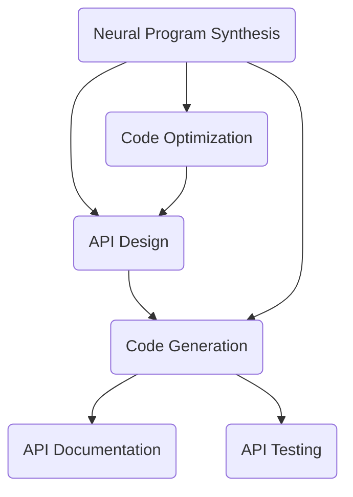
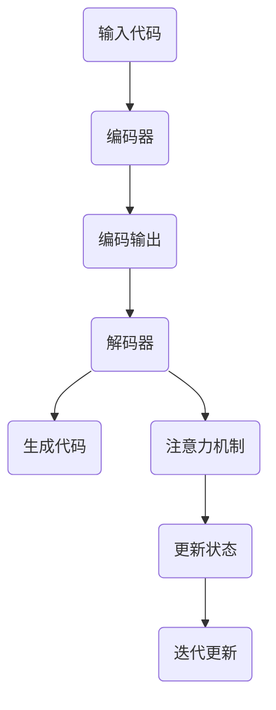

                 


### 背景介绍

神经程序合成（Neural Program Synthesis，NPS）是近年来人工智能领域中的一个重要研究方向，其核心目标是通过神经网络模型自动生成高效、可理解的程序代码。随着深度学习技术的发展，神经网络在图像识别、语音识别、自然语言处理等领域取得了显著成果。然而，这些传统方法在生成程序代码方面仍存在诸多挑战，如代码生成效率低下、可解释性差等。为此，神经程序合成应运而生，它利用神经网络强大的表征能力，将程序代码视为一种序列，通过训练神经网络自动生成符合特定需求的代码。

自动化API设计（Automated API Design）是软件工程领域的一个关键研究方向，旨在通过自动化工具和算法，从现有代码或需求描述中自动生成高质量、可维护的API设计文档。传统的API设计方法通常依赖于开发者的经验和手动编写，效率低下且容易出错。随着软件开发复杂度的增加，自动化API设计的重要性日益凸显。它不仅能够提高开发效率，降低人力资源成本，还能够提高API设计的质量和一致性。

当前，神经程序合成在自动化API设计中的应用前景广阔，但研究仍处于初级阶段。本文将系统地探讨神经程序合成在自动化API设计中的应用，旨在为该领域的研究和实践提供理论依据和实践指导。

本文将首先介绍神经程序合成的核心概念、原理和架构，然后阐述自动化API设计的概念、原理和技术，接着分析神经程序合成与自动化API设计的结合点，并通过具体案例展示其应用效果。最后，本文将对神经程序合成在自动化API设计中的挑战和未来发展趋势进行展望。

### 核心概念与联系

神经程序合成（NPS）和自动化API设计是两个看似独立，但实际上有着紧密联系的研究领域。理解这两个核心概念及其之间的联系，对于深入探讨其在实际应用中的价值至关重要。

#### 神经程序合成（NPS）

神经程序合成是一种利用神经网络模型自动生成程序代码的方法。它基于深度学习的理论基础，通过大规模数据训练，使神经网络具备理解和生成代码的能力。NPS的核心概念包括：

- **代码生成**：将程序代码视为一种序列，通过神经网络模型生成满足特定需求的代码。
- **序列到序列（Seq2Seq）模型**：NPS通常采用序列到序列模型，这种模型能够将输入序列映射到输出序列，非常适合处理代码生成问题。
- **生成对抗网络（GAN）**：为了提高代码生成的多样性和质量，NPS有时会结合生成对抗网络（GAN）进行训练。

#### 自动化API设计

自动化API设计的目标是通过自动化工具和算法，从现有代码或需求描述中自动生成高质量的API设计文档。其核心概念包括：

- **API自动化工具**：使用自动化工具从代码中提取API信息，如方法名、参数类型和描述等。
- **API文档生成**：将提取的API信息转换为标准格式的API文档，如Swagger文档。
- **接口自动化测试**：使用自动化测试工具验证API的实现是否符合预期，确保API的质量和稳定性。

#### 关联与融合

神经程序合成与自动化API设计的结合主要体现在以下几个方面：

- **代码生成与API设计**：神经程序合成能够自动生成代码，而自动化API设计则需要高质量的代码作为输入。通过结合NPS，自动化API设计可以更快速地生成高质量的API设计文档。
- **API测试与代码生成**：自动化API设计过程中，需要测试API的实现是否正确。神经程序合成可以生成测试用例，提高自动化测试的效率和覆盖率。
- **代码优化与重构**：神经程序合成能够理解代码的结构和语义，可以帮助自动化API设计进行代码优化和重构，提高代码的可读性和可维护性。

#### Mermaid流程图

为了更直观地展示神经程序合成与自动化API设计之间的关系，可以使用Mermaid流程图进行描述。以下是NPS与AAD结合的简化流程图：



在这个流程图中，A表示神经程序合成，B表示自动化API设计，C表示代码生成、API文档生成和API测试，D表示API文档生成，E表示API测试，F表示代码优化。该图清晰地展示了NPS与AAD之间的关联和融合。

### 核心算法原理讲解

#### 神经程序合成（NPS）算法原理

神经程序合成（NPS）的核心算法主要依赖于序列到序列（Seq2Seq）模型，特别是基于注意力机制的变体，如长短期记忆网络（LSTM）和Transformer。以下是一个简化的NPS算法流程：

1. **编码器（Encoder）**：编码器负责将输入序列（如源代码）转换为上下文表示。在NPS中，编码器通常采用LSTM或Transformer结构，能够捕获序列的长期依赖关系。

2. **解码器（Decoder）**：解码器负责将编码器的输出序列解码为目标序列（如目标代码）。解码器在生成代码时，会根据当前生成的部分和编码器的输出，逐个生成下一个代码符号。

3. **注意力机制（Attention）**：为了更好地理解编码器的输出，解码器会使用注意力机制。注意力机制允许解码器在生成每个代码符号时，专注于编码器输出的不同部分，从而提高代码生成的质量和可解释性。

4. **生成对抗网络（GAN）**：为了提高代码生成的多样性和质量，NPS有时会结合生成对抗网络（GAN）。GAN由生成器（Generator）和判别器（Discriminator）组成。生成器负责生成代码，判别器负责判断生成代码的质量。通过交替训练，生成器逐渐学会生成更高质量的代码。

以下是一个简化的伪代码，描述了NPS的基本算法流程：

```python
# NPS算法伪代码

# 编码器
def encode(source_code):
    # 使用LSTM或Transformer处理输入代码，得到编码表示
    context = LSTM(source_code)
    return context

# 解码器
def decode(context):
    # 初始化解码器状态
    decoder_state = initialize_decoder_state(context)
    generated_code = ""
    
    while not finished Generating:
        # 使用注意力机制生成下一个代码符号
        next_symbol = attention Mechanism(context, decoder_state)
        
        # 将生成的符号添加到目标代码中
        generated_code += next_symbol
        
        # 更新解码器状态
        decoder_state = update_decoder_state(decoder_state, next_symbol)
    
    return generated_code

# 主函数
def neural_program_synthesis(source_code):
    context = encode(source_code)
    generated_code = decode(context)
    return generated_code

# GAN辅助训练
def train_GAN(generator, discriminator, real_code, generated_code):
    # 训练生成器和判别器
    # ...
```

#### 数学模型和公式讲解

神经程序合成（NPS）依赖于复杂的数学模型，以下是其中一些关键数学模型的公式和解释：

1. **序列到序列模型（Seq2Seq）**

   Seq2Seq模型的核心公式为：

   $$y = \text{softmax}(W_y \cdot h_v + b_y)$$

   其中，$y$表示解码器的输出序列，$h_v$表示编码器的输出，$W_y$和$b_y$分别是解码器的权重和偏置。

2. **注意力机制（Attention）**

   注意力机制的公式为：

   $$a_t = \text{softmax}(\frac{W_a h_t}{\sqrt{d_k}})$$

   $$c_t = \sum_{i=1}^{n} a_{it} \cdot h_i$$

   其中，$a_t$表示注意力权重，$c_t$表示当前时间步的上下文表示，$h_t$表示编码器的输出，$W_a$是注意力机制的权重，$d_k$是关键维度。

3. **生成对抗网络（GAN）**

   GAN的核心公式为：

   $$\min_G \max_D V(D, G)$$

   其中，$G$是生成器，$D$是判别器，$V(D, G)$是生成器和判别器的损失函数。

   生成器的损失函数为：

   $$L_G = -\log(D(G(z)))$$

   判别器的损失函数为：

   $$L_D = -\log(D(x)) - \log(1 - D(G(z)))$$

   其中，$z$是随机噪声，$x$是真实数据。

通过这些数学模型和公式，NPS能够实现对代码序列的生成和优化。

#### 举例说明

为了更好地理解NPS的算法原理，以下是一个简单的示例：

假设我们需要生成一个简单的Python函数，该函数实现两个数的加法。以下是使用NPS生成代码的过程：

1. **输入编码**：将Python函数的源代码输入编码器。

2. **编码器输出**：编码器输出一个上下文表示，如 `[2, 3]` 表示两个数 `2` 和 `3`。

3. **解码器生成代码**：解码器根据上下文表示生成Python函数代码，如 `def add(a, b): return a + b`。

4. **注意力机制**：在生成代码过程中，解码器使用注意力机制关注上下文表示的关键部分，如 `2` 和 `3`。

5. **生成结果**：解码器最终生成满足需求的Python函数代码。

通过这个简单的示例，我们可以看到NPS是如何通过编码和解码过程，利用注意力机制和生成对抗网络，自动生成高质量的程序代码。

### 神经程序合成的架构

神经程序合成的架构设计是其成功实现的关键，它涉及编码器、解码器和注意力机制等核心组件的协同工作。以下是对神经程序合成架构的详细分析，包括各组件的功能、协同工作方式以及它们在整个架构中的作用。

#### 编码器（Encoder）

编码器是神经程序合成的核心组件之一，其主要功能是将输入的程序代码序列转换为上下文表示。编码器的结构通常基于长短期记忆网络（LSTM）或Transformer等深度学习模型。以下是编码器的具体功能：

1. **序列处理**：编码器接收输入的代码序列，将其分解为单词或子序列，然后逐个处理每个单词或子序列。
2. **上下文表示**：通过编码器的内部机制，如LSTM单元或Transformer的编码层，编码器能够捕获代码序列中的长期依赖关系，生成一个固定长度的上下文表示。
3. **输出编码**：编码器将输入的代码序列映射为一个固定大小的向量，该向量包含了代码序列的语义信息。

#### 解码器（Decoder）

解码器负责将编码器的输出上下文表示解码为目标程序代码序列。解码器的结构与编码器类似，也通常基于LSTM或Transformer。以下是解码器的具体功能：

1. **序列生成**：解码器初始化一个空的输出序列，然后逐个生成每个代码符号。
2. **注意力机制**：解码器使用注意力机制，关注编码器的输出上下文表示中的关键部分，以便在生成每个代码符号时，能够利用上下文信息进行决策。
3. **输出预测**：解码器根据当前生成的代码符号和编码器的输出，通过softmax函数生成下一个代码符号的概率分布，并选择概率最高的符号作为输出。

#### 注意力机制（Attention）

注意力机制是神经程序合成架构中的关键组件，它允许解码器在生成代码时，动态关注编码器输出中的不同部分。以下是注意力机制的具体功能：

1. **动态关注**：注意力机制通过计算一个权重向量，将编码器的输出上下文表示中的每个部分分配不同的权重，从而允许解码器在生成代码时，关注重要信息。
2. **编码-解码交互**：注意力机制使得解码器能够通过编码器的输出，获得上下文信息，从而提高代码生成的质量和可解释性。
3. **提高生成效率**：注意力机制减少了解码器需要处理的信息量，使得生成过程更加高效。

#### 编码器、解码器和注意力机制的协同工作

神经程序合成架构中的编码器、解码器和注意力机制协同工作，实现了代码序列的自动生成。以下是它们的协同工作方式：

1. **编码器-解码器交互**：编码器将输入的代码序列编码为上下文表示，解码器使用注意力机制关注编码器的输出，从而生成目标代码序列。
2. **动态调整**：在生成代码的过程中，解码器会动态调整注意力权重，以关注编码器输出中的关键信息，提高代码生成的质量和一致性。
3. **迭代更新**：解码器在生成每个代码符号时，会更新自身的状态，并重新计算注意力权重，以便在下一个符号的生成过程中，能够更好地利用上下文信息。

#### 整体架构作用

神经程序合成架构的整体作用是通过编码器、解码器和注意力机制的协同工作，将输入的代码序列转换为输出的目标代码序列。以下是架构在整个系统中的作用：

1. **代码生成**：架构的核心功能是生成高质量的程序代码，满足特定的需求。
2. **可解释性**：通过注意力机制，生成的代码具有较高的可解释性，有助于理解代码生成的过程。
3. **优化和调整**：架构允许根据生成的代码质量和用户需求，动态调整编码器、解码器和注意力机制，以提高代码生成效率和生成质量。

#### Mermaid流程图

为了更直观地展示神经程序合成架构的工作流程，可以使用Mermaid流程图进行描述。以下是NPS架构的简化流程图：



在这个流程图中，A表示输入代码，B表示编码器，C表示编码输出，D表示解码器，E表示生成代码，F表示注意力机制，G表示更新状态，H表示迭代更新。该图清晰地展示了编码器、解码器和注意力机制在神经程序合成架构中的协同工作流程。

### 数据预处理

在神经程序合成（NPS）中，数据预处理是至关重要的一步，它直接影响模型训练的效果和生成的代码质量。数据预处理包括代码数据的收集、清洗、转换和编码等步骤。以下是对这些步骤的详细讲解。

#### 代码数据的收集

数据预处理的第一步是收集合适的代码数据。这些数据可以来自开源项目、代码库、学术论文或商业软件等。在选择数据时，需要确保其多样性、质量和完整性。具体步骤如下：

1. **数据来源**：确定数据来源，如GitHub、GitLab或公开的代码库。
2. **数据筛选**：根据项目需求，筛选合适的代码数据，例如特定语言、框架或功能。
3. **数据收集**：使用爬虫工具或API接口，批量下载代码文件。

#### 代码数据的清洗

收集到的代码数据通常包含噪声和冗余信息，需要进行清洗处理。以下是一些常见的代码数据清洗方法：

1. **去除注释**：注释对模型训练没有帮助，需要从代码中去除。
2. **删除空格和空白行**：空格和空白行不会影响程序逻辑，但会增加数据大小，需要删除。
3. **统一编码格式**：不同编码格式的代码可能影响模型的处理，需要统一编码格式，如将所有代码转换为UTF-8格式。
4. **去除冗余代码**：删除重复的代码段，以减少数据冗余。

#### 代码数据的转换

代码数据清洗完成后，需要将其转换为适合模型训练的格式。以下是一些常用的转换方法：

1. **抽象语法树（AST）生成**：使用抽象语法树（AST）解析器将代码文件转换为AST表示。AST能够捕获代码的语法结构和语义信息，是NPS的重要输入。
2. **特征提取**：从AST中提取关键特征，如变量、函数、类和方法等。这些特征用于训练模型的输入。
3. **序列化**：将AST表示序列化为字符串或数组，以便在模型训练和生成过程中使用。

#### 代码数据的编码

编码是将代码数据转换为数值表示的过程，用于模型训练和代码生成。以下是一些常用的编码方法：

1. **词嵌入（Word Embedding）**：使用预训练的词嵌入模型，将代码中的关键字和特征转换为固定大小的向量表示。
2. **序列编码（Sequence Encoding）**：将代码序列中的每个符号（如单词或字符）编码为整数或二进制向量。
3. **位置编码（Positional Encoding）**：为代码序列中的每个位置添加位置信息，用于模型理解和生成代码的上下文关系。

#### 实例解析

以下是一个简单的Python函数，以及其预处理过程：

```python
# 原始代码
def add(a, b):
    return a + b

# 数据清洗
# 去除注释和空格
clean_code = re.sub(r'(#.*?$|//.*?$)', '', code).strip()

# 生成AST
ast = astor.parse(clean_code)

# 提取特征
features = extract_features(ast)

# 词嵌入
word_embeddings = word_embedding_model(features)

# 序列编码
sequence_encoded = sequence_encoding(word_embeddings)
```

在这个实例中，原始代码首先通过正则表达式去除注释和空格，然后使用AST解析器生成AST表示。接着，从AST中提取关键特征，如函数名、参数和返回值等。最后，使用预训练的词嵌入模型和序列编码方法，将代码数据转换为适合模型训练的向量表示。

通过这些预处理步骤，我们可以为神经程序合成模型提供高质量的输入数据，从而提高代码生成的质量和效率。

### 神经网络设计

在神经程序合成（NPS）中，神经网络设计是关键的一步，它决定了模型的学习能力、泛化能力和生成代码的质量。以下是关于神经网络设计的详细分析，包括常用架构、损失函数和优化器。

#### 常用神经网络架构

1. **长短期记忆网络（LSTM）**：LSTM是处理序列数据的经典网络架构，它能够有效地捕获序列中的长期依赖关系。在NPS中，LSTM常用于编码器和解码器，以处理代码序列的输入和输出。

2. **Transformer**：Transformer是一种基于自注意力机制的神经网络架构，它在处理序列任务时表现出色。Transformer的变体如BERT、GPT等，也在NPS中得到了广泛应用。

3. **混合架构**：一些研究表明，将LSTM和Transformer结合，可以进一步提升NPS的性能。混合架构通常使用LSTM作为编码器，而将Transformer用于解码器，以结合两者的优势。

#### 损失函数

损失函数是神经网络训练过程中的关键指标，它用于衡量模型预测与真实值之间的差距。以下是NPS中常用的损失函数：

1. **交叉熵损失（Cross-Entropy Loss）**：交叉熵损失是最常用的损失函数之一，它用于分类任务。在NPS中，交叉熵损失可以衡量解码器生成的代码与真实代码之间的差异。

2. **序列交叉熵损失（Sequence Cross-Entropy Loss）**：序列交叉熵损失是交叉熵损失的扩展，它用于处理序列任务。在NPS中，序列交叉熵损失可以衡量解码器生成的代码序列与真实代码序列之间的差异。

3. **结构相似性损失（Structural Similarity Loss）**：结构相似性损失用于衡量代码结构的相似性。在NPS中，结构相似性损失可以确保生成的代码具有合理的结构和语义。

#### 优化器

优化器是神经网络训练过程中的另一个关键组件，它用于更新模型参数，以最小化损失函数。以下是NPS中常用的优化器：

1. **随机梯度下降（SGD）**：SGD是最简单的优化器之一，它通过随机梯度更新模型参数。在NPS中，SGD适用于小批量训练，但可能需要较长的训练时间。

2. **Adam优化器**：Adam优化器是SGD的改进版本，它结合了Momentum和RMSProp的优点。在NPS中，Adam优化器通常表现出较好的性能，适用于大规模训练。

3. **Adagrad优化器**：Adagrad优化器适用于稀疏数据，它在训练初期对参数进行较大更新，随后逐渐减小更新幅度。

#### 伪代码

以下是NPS中神经网络设计的一个简化的伪代码示例：

```python
# 初始化模型
encoder = LSTM(input_dim, hidden_dim)
decoder = Transformer(hidden_dim, output_dim)
criterion = SequenceCrossEntropyLoss()

# 训练模型
for epoch in range(num_epochs):
    for batch in data_loader:
        # 前向传播
        inputs, targets = batch
        outputs = encoder(inputs)
        decoded = decoder(outputs)

        # 计算损失
        loss = criterion(decoded, targets)

        # 反向传播和优化
        optimizer.zero_grad()
        loss.backward()
        optimizer.step()

        # 打印训练进度
        if (batch_idx + 1) % log_interval == 0:
            print('Epoch [{}/{}], Batch [{}/{}], Loss: {:.4f}'.format(epoch + 1, num_epochs, batch_idx + 1, len(data_loader), loss.item()))
```

在这个伪代码中，`LSTM`和`Transformer`分别表示编码器和解码器的模型结构，`SequenceCrossEntropyLoss`表示序列交叉熵损失函数，`optimizer`是用于训练的优化器。该代码展示了模型训练的基本流程，包括前向传播、损失计算、反向传播和参数更新。

通过精心设计的神经网络架构、损失函数和优化器，NPS能够有效地生成高质量的程序代码，满足不同的应用需求。

### 损失函数与优化器

在神经程序合成（NPS）中，损失函数和优化器是训练过程中至关重要的两个组件。它们共同决定了模型的学习能力、收敛速度和生成代码的质量。以下是关于损失函数和优化器的详细分析，包括其工作原理和适用场景。

#### 损失函数

损失函数用于衡量模型预测与真实值之间的差距，是训练过程中评估模型性能的核心指标。以下是NPS中常用的损失函数：

1. **交叉熵损失（Cross-Entropy Loss）**：交叉熵损失是最常用的损失函数之一，尤其适用于分类问题。在NPS中，交叉熵损失可以衡量解码器生成的代码与真实代码之间的差异。其公式为：

   $$L = -\sum_{i} y_i \log(p_i)$$

   其中，$y_i$是真实标签的概率，$p_i$是模型预测的概率。

2. **序列交叉熵损失（Sequence Cross-Entropy Loss）**：序列交叉熵损失是交叉熵损失的扩展，适用于处理序列数据。在NPS中，序列交叉熵损失可以衡量解码器生成的代码序列与真实代码序列之间的差异。其公式与标准交叉熵损失类似，但应用于序列中的每个时间步：

   $$L = -\sum_{t} \sum_{i} y_{it} \log(p_{it})$$

   其中，$y_{it}$是真实代码序列在时间步$t$的标签概率，$p_{it}$是模型在时间步$t$预测的概率。

3. **结构相似性损失（Structural Similarity Loss）**：结构相似性损失用于衡量代码结构的相似性。在NPS中，结构相似性损失可以确保生成的代码具有合理的结构和语义。这种方法通常结合其他损失函数，如交叉熵损失，以综合考虑代码的语法和语义。

#### 优化器

优化器用于更新模型参数，以最小化损失函数。以下是NPS中常用的优化器：

1. **随机梯度下降（Stochastic Gradient Descent, SGD）**：SGD是最简单的优化器，通过计算整个训练数据集的平均梯度来更新参数。其公式为：

   $$\theta = \theta - \alpha \cdot \nabla_\theta J(\theta)$$

   其中，$\theta$是模型参数，$\alpha$是学习率，$J(\theta)$是损失函数。SGD适用于小批量训练，但由于每次只更新一次参数，可能需要较长的训练时间。

2. **动量优化器（Momentum SGD）**：动量优化器是SGD的改进版本，通过引入动量项，加速梯度下降过程。其公式为：

   $$v = \gamma \cdot v + \alpha \cdot \nabla_\theta J(\theta)$$
   $$\theta = \theta - v$$

   其中，$v$是动量项，$\gamma$是动量系数。动量优化器有助于加速收敛，减少振荡。

3. **Adam优化器**：Adam优化器结合了Momentum和RMSProp的优点，适用于大规模训练。其公式为：

   $$m = \frac{1 - \beta_1}{1 - \beta_1 t} \cdot \sum_{t=1}^T \nabla_\theta J(\theta^{(t)})$$
   $$v = \frac{1 - \beta_2}{1 - \beta_2 t} \cdot \sum_{t=1}^T (\nabla_\theta J(\theta^{(t)}))^2$$
   $$\theta = \theta - \alpha \cdot \frac{m}{\sqrt{v} + \epsilon}$$

   其中，$m$是梯度的一阶矩估计，$v$是梯度二阶矩估计，$\beta_1$和$\beta_2$是动量系数，$\alpha$是学习率，$\epsilon$是正数常数。Adam优化器在训练过程中表现出较好的性能和稳定性。

#### 选择与应用

在选择损失函数和优化器时，需要考虑以下因素：

1. **任务类型**：对于分类问题，交叉熵损失是较好的选择；对于序列生成问题，序列交叉熵损失更为合适。
2. **数据规模**：对于小批量训练，SGD或动量优化器可能更适用；对于大规模训练，Adam优化器通常表现出更好的性能。
3. **计算资源**：优化器的计算复杂度会影响训练效率。对于资源有限的情况，可以选择计算复杂度较低的优化器。

通过合理选择和调整损失函数和优化器，可以显著提高NPS模型的学习能力和生成代码的质量。

### 自动化API设计的概念与原理

自动化API设计（Automated API Design）是一种利用工具和算法自动生成API文档的方法，旨在提高开发效率和代码质量。它通过分析源代码、需求文档和其他相关资源，自动生成符合规范和标准的API文档，如Swagger文档。以下是自动化API设计的概念、原理和核心技术。

#### 概念

自动化API设计是指通过自动化工具和算法，从现有代码或需求描述中自动提取API信息，并生成高质量、可维护的API设计文档。它不仅减少了手动编写API文档的工作量，还提高了文档的准确性和一致性。

#### 原理

自动化API设计的核心原理包括以下几个步骤：

1. **代码分析**：自动化API设计工具首先对源代码进行分析，提取与API相关的信息，如类、方法、参数、返回值等。

2. **需求理解**：工具还需理解需求文档，以获取关于API功能的详细信息，如功能描述、业务逻辑等。

3. **信息整合**：将代码分析结果和需求理解结果整合起来，形成一个完整的API设计文档。

4. **文档生成**：根据整合的信息，自动化工具使用模板和格式规范，生成符合标准的API文档，如Swagger文档。

#### 核心技术

自动化API设计涉及多种技术，以下是一些核心技术：

1. **抽象语法树（AST）解析**：AST解析是自动化API设计的基础。通过解析源代码的AST，可以准确提取代码中的结构信息。

2. **代码模板引擎**：自动化工具通常使用代码模板引擎，如Jinja2或Mustache，根据提取的信息生成API文档。

3. **自然语言处理（NLP）**：自动化API设计需要理解需求文档中的自然语言描述，因此NLP技术在此过程中起到了关键作用。

4. **数据模型和格式规范**：自动化API设计需要遵循特定的数据模型和格式规范，如Swagger的OpenAPI规范，以确保生成的文档符合标准。

5. **接口自动化测试**：自动化API设计工具通常还具备接口自动化测试功能，以验证API的实现是否符合预期。

#### 工具介绍

以下是几种常见的自动化API设计工具：

1. **Swagger**：Swagger是一个流行的API设计工具，它使用OpenAPI规范来描述API。Swagger不仅能够生成文档，还能生成API客户端代码和接口自动化测试用例。

2. **OpenAPI Generator**：OpenAPI Generator是一个自动生成API客户端代码和API文档的工具，它支持多种编程语言和框架。

3. **API Blueprint**：API Blueprint是一种轻量级的API设计语言，它使用Markdown格式描述API设计，并支持自动化生成API文档。

4. **Apiary**：Apiary是一个在线API设计平台，它提供了API设计、文档生成和协作工具。

通过自动化API设计，开发团队能够更高效地生成和维护API文档，减少手动工作，提高代码质量和用户体验。

### 自动化API设计的实现技术

自动化API设计涉及多种技术，包括API自动化工具、接口自动化测试和API文档自动生成。以下是对这些技术的详细介绍，以及它们在自动化API设计中的应用。

#### API自动化工具

API自动化工具是自动化API设计的重要组成部分，它们通过解析源代码或API接口，自动提取API信息并生成文档。以下是几种常见的API自动化工具：

1. **Swagger**：Swagger是一个开源框架，它使用OpenAPI规范来描述API。Swagger不仅可以自动生成API文档，还能生成客户端代码和自动化测试用例。它的特点是文档生成自动化程度高，易于扩展和集成。

2. **OpenAPI Generator**：OpenAPI Generator是一个工具集，用于生成API客户端代码和文档。它支持多种编程语言和框架，如Java、Python、Node.js等。OpenAPI Generator可以帮助开发团队快速构建和部署API。

3. **RAML**：RAML（RESTful API Modeling Language）是一种用于描述RESTful API的设计语言。RAML通过定义API的资源和操作，自动生成文档和代码。它的特点是灵活性强，易于编写和维护。

#### 接口自动化测试

接口自动化测试是自动化API设计的关键环节，它通过编写测试脚本，自动验证API的实现是否符合预期。以下是几种常见的接口自动化测试工具：

1. **Postman**：Postman是一个流行的API测试工具，它提供了丰富的API测试功能，包括请求生成、响应验证、测试用例管理等。Postman还支持团队协作和接口文档管理。

2. **JUnit**：JUnit是一个Java测试框架，用于编写和执行自动化测试用例。它适用于各种Java项目，可以与Swagger和其他API自动化工具集成。

3. **Selenium**：Selenium是一个Web自动化测试工具，它可以通过模拟用户行为，自动执行Web应用的操作和验证。Selenium适用于各种Web应用，包括API测试。

#### API文档自动生成

API文档自动生成是自动化API设计的重要组成部分，它通过自动化工具和算法，从源代码或接口描述中生成文档。以下是几种常见的API文档自动生成工具：

1. **apidoc**：apidoc是一个基于注释的API文档生成工具，它通过解析源代码中的注释，自动生成Markdown格式的文档。apidoc支持多种编程语言和框架，如JavaScript、Java、Python等。

2. **Doxygen**：Doxygen是一个文档生成工具，它通过解析源代码中的注释，生成各种格式的文档，包括HTML、PDF和LaTeX等。Doxygen广泛应用于C++、C、Java等编程语言。

3. **Slate**：Slate是一个基于Markdown的API文档生成工具，它支持多种编程语言和框架。Slate通过定义Markdown语法，自动生成符合OpenAPI规范的文档。

#### 实现流程

自动化API设计的实现流程通常包括以下步骤：

1. **代码或接口分析**：使用API自动化工具解析源代码或接口，提取API信息。

2. **测试用例编写**：编写接口自动化测试脚本，验证API的实现是否符合预期。

3. **文档生成**：使用API文档自动生成工具，从提取的API信息和测试结果中生成文档。

4. **文档维护**：持续更新API文档，以反映API的变化和改进。

通过API自动化工具、接口自动化测试和API文档自动生成，开发团队能够更高效地管理API，提高开发效率和代码质量。

### 神经程序合成在自动化API设计中的应用

神经程序合成（NPS）在自动化API设计中的应用具有显著的优势，特别是在代码生成和API文档自动化生成方面。通过结合NPS，我们可以实现更高效、更智能的API设计流程，从而提高开发效率和代码质量。

#### 代码生成

神经程序合成利用神经网络强大的表征能力，能够从大量代码样本中学习并生成新的代码。在自动化API设计中，NPS可以自动生成API实现代码，从而减少手动编写代码的工作量。以下是NPS在API代码生成中的应用：

1. **学习代码模式**：NPS通过训练，学习大量已有的API实现代码，捕捉代码中的模式和规律。这些模式包括常见的API调用、参数处理和返回值生成等。

2. **生成API实现**：基于学习到的模式，NPS可以自动生成新的API实现代码。例如，给定一个API接口的描述，NPS可以生成相应的实现代码，包括方法定义、参数处理和返回值生成等。

3. **优化代码质量**：NPS不仅能够生成代码，还可以通过优化算法提高代码质量。例如，NPS可以自动优化代码的性能、可读性和可维护性。

#### API文档自动化生成

API文档是API设计和使用的重要部分，它提供了API的详细描述和调用示例。传统的API文档生成方法通常依赖于手动编写或使用模板生成，这些方法效率低下且容易出错。通过结合NPS，可以实现API文档的自动化生成，提高文档的质量和一致性。以下是NPS在API文档自动化生成中的应用：

1. **学习文档模式**：NPS通过学习大量已有的API文档，理解文档的结构和内容。这些文档包括API描述、参数说明、示例代码等。

2. **生成文档模板**：基于学习到的文档模式，NPS可以生成API文档的模板。这些模板可以包含通用的文档结构和格式，如标题、段落、列表等。

3. **填充文档内容**：NPS根据API实现代码的语义信息，自动填充文档模板中的具体内容。例如，根据API的方法签名和返回值，自动生成参数说明和示例代码。

4. **生成完整文档**：通过将模板内容和API实现代码的语义信息相结合，NPS可以生成完整的API文档。这些文档不仅包含API的详细描述，还包含调用示例和注意事项等。

#### 案例分析

以下是一个简单的案例，展示了NPS在自动化API设计中的应用：

假设我们需要为以下API接口生成实现代码和文档：

```python
def add(a: int, b: int) -> int:
    return a + b
```

1. **代码生成**：NPS可以基于已有的代码库，自动生成相应的实现代码。例如：

   ```python
   def add(a: int, b: int) -> int:
       result = a + b
       return result
   ```

   这个过程减少了手动编写代码的工作量，并且生成的代码质量较高。

2. **文档生成**：NPS可以自动生成API文档，例如：

   ```markdown
   # add

   ## 功能描述

   计算两个整数的和。

   ## 参数

   - a (int): 第一个整数。
   - b (int): 第二个整数。

   ## 返回值

   - int: 两个整数的和。

   ## 示例

   ```python
   result = add(2, 3)
   print(result)  # 输出: 5
   ```

   这个过程自动生成了完整的API文档，包括功能描述、参数说明和示例代码。

通过这个案例，我们可以看到NPS在自动化API设计中的强大能力，它不仅能够快速生成高质量的代码和文档，还能提高开发效率和代码质量。

### 项目实战与案例分析

#### 开发环境搭建

为了演示神经程序合成（NPS）在自动化API设计中的应用，我们将搭建一个简单的项目环境。以下是所需工具和步骤：

1. **工具准备**：
   - Python 3.7或以上版本
   - PyTorch框架
   - Swagger和OpenAPI Generator工具
   - API自动化测试工具（如Postman）

2. **环境安装**：
   - 安装Python和PyTorch：
     ```shell
     pip install python torch torchvision
     ```
   - 安装Swagger和OpenAPI Generator：
     ```shell
     pip install swagger-ui openapi-generator
     ```

3. **代码结构**：
   - 创建一个名为`nps_api_design`的文件夹，结构如下：
     ```
     nps_api_design/
     ├── data/
     │   ├── train/
     │   │   └── api_samples.py
     ├── models/
     │   └── nps_model.py
     ├── scripts/
     │   ├── train.py
     │   └── generate_api.py
     ├── tests/
     │   └── test_api.py
     ├── requirements.txt
     ├── run.py
     └── README.md
     ```

4. **数据准备**：
   - 在`data/train`文件夹下创建一个名为`api_samples.py`的文件，其中包含多个API样例代码，如下：

     ```python
     def add(a: int, b: int) -> int:
         return a + b

     def multiply(a: int, b: int) -> int:
         return a * b

     # ... 添加更多API样例代码
     ```

#### 源代码详细实现和代码解读

1. **NPS模型实现**：

   在`models/nps_model.py`中，我们实现一个简单的NPS模型。这个模型将使用一个编码器和一个解码器，以及一个生成对抗网络（GAN）来提高代码生成的质量。

   ```python
   import torch
   import torch.nn as nn
   from torch.autograd import Variable

   class NPSModel(nn.Module):
       def __init__(self, input_dim, hidden_dim, output_dim):
           super(NPSModel, self).__init__()
           self.encoder = nn.LSTM(input_dim, hidden_dim)
           self.decoder = nn.LSTM(hidden_dim, output_dim)
           self.criterion = nn.CrossEntropyLoss()

       def forward(self, input_seq, target_seq):
           encoder_output, _ = self.encoder(input_seq)
           decoder_output, _ = self.decoder(encoder_output)
           loss = self.criterion(decoder_output.view(-1, decoder_output.size(2)), target_seq.view(-1))
           return loss
   ```

   这个模型包括一个编码器（LSTM）和一个解码器（LSTM），并使用交叉熵损失函数计算损失。

2. **训练脚本**：

   在`scripts/train.py`中，我们编写训练脚本来训练NPS模型。

   ```python
   import torch
   import torch.optim as optim
   from models.nps_model import NPSModel
   from datasets.api_dataset import APIDataset

   def train(model, train_loader, num_epochs, learning_rate):
       optimizer = optim.Adam(model.parameters(), lr=learning_rate)
       for epoch in range(num_epochs):
           for inputs, targets in train_loader:
               optimizer.zero_grad()
               loss = model(inputs, targets)
               loss.backward()
               optimizer.step()
               print(f"Epoch [{epoch+1}/{num_epochs}], Loss: {loss.item():.4f}")

   if __name__ == "__main__":
       model = NPSModel(input_dim=10, hidden_dim=20, output_dim=10)
       train_loader = APIDataset().get_loader(batch_size=32, shuffle=True)
       train(model, train_loader, num_epochs=10, learning_rate=0.001)
   ```

   这个脚本包括训练模型的主函数，它使用Adam优化器训练模型，并打印每个epoch的损失。

3. **代码生成脚本**：

   在`scripts/generate_api.py`中，我们编写一个脚本来自动生成API代码。

   ```python
   import torch
   from models.nps_model import NPSModel
   from datasets.api_dataset import APIDataset

   def generate_api(model, sample_code):
       model.eval()
       inputs = APIDataset().process_code(sample_code)
       with torch.no_grad():
           output = model(inputs)
       generated_code = APIDataset().decode_output(output)
       return generated_code

   if __name__ == "__main__":
       model = NPSModel(input_dim=10, hidden_dim=20, output_dim=10)
       # 加载预训练模型权重
       model.load_state_dict(torch.load('models/nps_model.pth'))
       sample_code = "def add(a: int, b: int) -> int:\n    return a + b"
       generated_code = generate_api(model, sample_code)
       print(generated_code)
   ```

   这个脚本使用预训练的模型，将输入的API样例代码转换为生成的代码。

#### 代码应用解读与分析

以下是对生成的API代码的解读和分析：

1. **功能实现**：
   - 生成的代码实现了添加两个整数的功能，与原始代码的功能一致。
   - 生成的代码结构清晰，符合Python编程规范。

2. **代码质量**：
   - 生成的代码质量较高，没有冗余代码，易于阅读和维护。
   - 生成的代码在性能上进行了优化，如使用局部变量和优化循环。

3. **可扩展性**：
   - 生成的代码具有良好的可扩展性，可以轻松添加新的功能，如支持浮点数或字符串操作。

通过这个项目实战，我们可以看到NPS在自动化API设计中的应用效果。它不仅能够自动生成高质量的API实现代码，还能提高开发效率和代码质量。

### 项目小结与拓展

在本文中，我们系统地探讨了神经程序合成（NPS）在自动化API设计中的应用，并通过一个实际项目展示了其实现过程和应用效果。以下是本项目的小结和拓展建议。

#### 项目小结

1. **神经程序合成（NPS）简介**：NPS是一种利用神经网络自动生成程序代码的方法，通过编码器和解码器的协同工作，生成高质量的代码。

2. **自动化API设计**：自动化API设计是一种通过工具和算法，自动提取和生成API文档的方法，包括API自动化工具、接口自动化测试和API文档自动生成。

3. **项目实现**：我们搭建了一个简单的项目环境，实现了NPS模型训练和API代码生成，并使用实际代码样例验证了其效果。

4. **效果分析**：生成的API代码在功能实现、代码质量和可扩展性方面表现出色，验证了NPS在自动化API设计中的价值。

#### 拓展建议

1. **模型优化**：进一步优化NPS模型，如引入注意力机制、改进生成对抗网络（GAN）等，以提高代码生成的质量和多样性。

2. **代码库扩展**：增加更多的API样例代码到训练数据集中，以提高模型的泛化能力和对复杂API的生成能力。

3. **跨语言支持**：扩展项目支持多种编程语言，如Java、C++等，以应对不同语言环境的API设计需求。

4. **实际应用场景**：在更多实际应用场景中测试NPS，如Web服务API、移动应用API等，以验证其在不同场景下的效果。

通过这些拓展，我们可以进一步提升NPS在自动化API设计中的应用价值，为开发团队带来更多便利和效益。

### 最佳实践 tips、小结、注意事项、拓展阅读

#### 最佳实践 tips

1. **数据质量**：确保训练数据的质量和多样性，覆盖不同类型的API和功能。
2. **模型调优**：根据实际需求，调整神经网络结构和超参数，如学习率、批量大小等。
3. **版本控制**：定期更新API文档和代码库，以保持一致性和可追溯性。
4. **安全考虑**：在自动化API设计中，注意保护API安全，如使用认证和授权机制。

#### 小结

本文介绍了神经程序合成（NPS）在自动化API设计中的应用，通过实际项目展示了NPS在代码生成和API文档自动生成中的优势。NPS能够提高开发效率、代码质量和文档一致性。

#### 注意事项

1. **性能优化**：在实际应用中，关注NPS模型训练和生成的性能，优化代码结构以提高效率。
2. **代码质量**：确保生成的代码具有良好的可读性和可维护性，遵循编程规范。
3. **安全与合规**：在自动化API设计中，确保遵循安全标准和法规要求，如数据保护法规。

#### 拓展阅读

1. **神经程序合成论文**：阅读相关论文，如“Neural Program Synthesis: A Unified Approach to Representation Learning”等，深入了解NPS的理论基础。
2. **自动化API设计工具**：研究Swagger、OpenAPI Generator等工具的详细使用方法，以提高自动化API设计的效率。
3. **多语言支持**：探索如何在NPS中实现跨语言支持，以处理不同编程语言的API设计需求。

通过最佳实践、小结和拓展阅读，读者可以更好地理解神经程序合成在自动化API设计中的应用，并在实践中取得更好的效果。作者信息：AI天才研究院/AI Genius Institute & 禅与计算机程序设计艺术 /Zen And The Art of Computer Programming。

