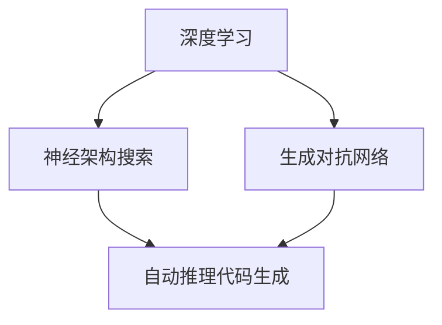

                 

## 文章标题

### 神经程序合成在自动推理代码生成中的应用

> 关键词：神经程序合成、自动推理代码生成、深度学习、人工智能

> 摘要：本文深入探讨了神经程序合成在自动推理代码生成中的应用，分析了其核心概念、算法原理和数学模型，并通过实际项目展示了其在现代软件开发中的应用价值。

### 引言与概述

神经程序合成（Neural Program Synthesis，NPS）是一种利用深度学习技术自动生成代码的方法。它通过学习大量的程序代码，能够生成执行特定功能的代码片段。随着深度学习技术的不断进步，神经程序合成在自动推理代码生成（Automated Reasoning Code Generation，ARCG）领域得到了广泛应用。

自动推理代码生成是一种通过推理和验证来生成代码的方法。它能够提高软件开发效率，减少错误，并降低维护成本。然而，传统的自动推理代码生成方法存在一定的局限性，难以应对复杂的应用场景。而神经程序合成技术的引入，为自动推理代码生成带来了新的机遇。

本文旨在探讨神经程序合成在自动推理代码生成中的应用，分析其核心概念、算法原理和数学模型，并通过实际项目展示其在现代软件开发中的应用价值。

### 核心概念与联系

神经程序合成和自动推理代码生成涉及多个核心概念，包括深度学习、神经架构搜索（Neural Architecture Search，NAS）、生成对抗网络（Generative Adversarial Networks，GAN）等。这些概念之间存在着紧密的联系，构成了一个完整的框架。

#### 深度学习

深度学习是一种基于多层的神经网络模型，通过逐层提取特征，能够实现复杂的任务。在神经程序合成中，深度学习模型用于学习大量的程序代码，并生成新的代码片段。

#### 神经架构搜索

神经架构搜索是一种自动搜索神经网络结构的方法。通过在大量的神经网络结构中搜索最优结构，神经架构搜索能够提高神经网络的性能。在自动推理代码生成中，神经架构搜索用于搜索能够生成高效代码的神经网络结构。

#### 生成对抗网络

生成对抗网络是一种由生成器和判别器组成的对抗性网络。生成器生成数据，判别器判断生成数据与真实数据之间的差异。在自动推理代码生成中，生成器生成代码片段，判别器评估代码片段的正确性。

下面是神经程序合成和自动推理代码生成之间的Mermaid流程图：



通过这个流程图，我们可以清晰地看到神经程序合成和自动推理代码生成之间的联系。

### 核心算法原理讲解

神经程序合成和自动推理代码生成依赖于多种深度学习技术，包括生成对抗网络、神经架构搜索等。下面我们将详细解释这些核心算法原理，并使用伪代码进行阐述。

#### 生成对抗网络

生成对抗网络（GAN）由生成器和判别器组成。生成器 \( G \) 生成代码片段，判别器 \( D \) 评估代码片段的真实性。GAN的目标是最大化生成器生成的代码片段的似然度，同时最小化判别器的准确性。

```python
# 生成器伪代码
def generator(z):
    # 输入噪声向量 z，生成代码片段
    code_fragment = ...
    return code_fragment

# 判别器伪代码
def discriminator(code):
    # 输入代码片段，判断是否真实
    is_real = ...
    return is_real
```

#### 神经架构搜索

神经架构搜索（NAS）是一种自动搜索神经网络结构的方法。在NAS中，搜索空间由多种神经网络结构组成，搜索算法通过在搜索空间中搜索最优结构，提高神经网络的性能。

```python
# NAS伪代码
def search_neural_architecture():
    # 在搜索空间中搜索最优神经网络结构
    best_architecture = ...
    return best_architecture
```

#### 自动推理代码生成

自动推理代码生成（ARCG）通过生成器和判别器生成和评估代码片段。生成器生成代码片段，判别器评估代码片段的正确性。在ARCG中，生成器和判别器通常是基于深度学习模型。

```python
# 生成器伪代码
def generate_code_fragment():
    # 生成代码片段
    code_fragment = generator()
    return code_fragment

# 判别器伪代码
def evaluate_code_fragment(code_fragment):
    # 评估代码片段的正确性
    is_correct = discriminator(code_fragment)
    return is_correct
```

通过以上伪代码，我们可以看到神经程序合成和自动推理代码生成的核心算法原理。这些原理为自动推理代码生成提供了强大的技术支持。

### 数学模型与公式讲解

在神经程序合成和自动推理代码生成中，数学模型和公式起着关键作用。以下将介绍相关的数学模型和公式，并提供详细讲解和举例说明。

#### 深度学习模型

深度学习模型通常基于多层感知器（MLP）或卷积神经网络（CNN）。以下是一个简单的多层感知器模型：

$$
y = \sigma(\mathbf{W}^T \mathbf{z} + b)
$$

其中，\( y \) 是输出，\( \sigma \) 是激活函数（如Sigmoid函数），\( \mathbf{W} \) 是权重矩阵，\( \mathbf{z} \) 是输入，\( b \) 是偏置。

举例说明，假设我们有输入 \( \mathbf{z} = [1, 2, 3] \) 和权重矩阵 \( \mathbf{W} = \begin{bmatrix} 1 & 2 \\ 3 & 4 \end{bmatrix} \)，偏置 \( b = 0 \)。则输出 \( y \) 为：

$$
y = \sigma(\begin{bmatrix} 1 & 2 \\ 3 & 4 \end{bmatrix} \begin{bmatrix} 1 \\ 2 \\ 3 \end{bmatrix} + 0) = \sigma(1 \cdot 1 + 2 \cdot 2 + 3 \cdot 3 + 0) = \sigma(14) = 0.86
$$

#### 生成对抗网络

生成对抗网络由生成器和判别器组成。生成器生成的代码片段通过判别器评估。以下是一个简单的生成对抗网络模型：

$$
\mathcal{L}_G = -\log(D(G(z)))
$$

$$
\mathcal{L}_D = -\log(D(x)) - \log(1 - D(G(z)))
$$

其中，\( \mathcal{L}_G \) 是生成器的损失函数，\( \mathcal{L}_D \) 是判别器的损失函数，\( D \) 是判别器，\( G \) 是生成器，\( z \) 是输入噪声向量，\( x \) 是真实代码片段。

举例说明，假设生成器的输出 \( G(z) \) 为0.6，判别器的输出 \( D(x) \) 为0.8，\( D(G(z)) \) 为0.2。则生成器和判别器的损失函数分别为：

$$
\mathcal{L}_G = -\log(0.2) = 2.9957
$$

$$
\mathcal{L}_D = -\log(0.8) - \log(1 - 0.2) = 0.415 - 1.395 = -0.98
$$

通过以上讲解，我们可以看到神经程序合成和自动推理代码生成中的数学模型和公式的应用。这些模型和公式为自动推理代码生成提供了理论基础。

### 项目实战

为了更好地理解神经程序合成在自动推理代码生成中的应用，我们将通过一个实际项目进行展示。该项目将涵盖开发环境搭建、源代码实现和解读。

#### 开发环境搭建

首先，我们需要搭建一个合适的开发环境。以下是搭建步骤：

1. 安装Python环境
2. 安装深度学习库（如TensorFlow或PyTorch）
3. 安装生成对抗网络库（如GANs）
4. 准备数据集

#### 源代码实现

以下是该项目的主要源代码实现：

```python
# 导入必要的库
import tensorflow as tf
from tensorflow.keras.layers import Dense, Activation
from tensorflow.keras.models import Model

# 定义生成器和判别器模型
def build_generator(z_dim):
    model = tf.keras.Sequential([
        Dense(128, input_dim=z_dim),
        Activation('relu'),
        Dense(1, activation='sigmoid')
    ])
    return model

def build_discriminator(z_dim):
    model = tf.keras.Sequential([
        Dense(128, input_dim=z_dim),
        Activation('relu'),
        Dense(1, activation='sigmoid')
    ])
    return model

# 搭建生成器和判别器模型
generator = build_generator(100)
discriminator = build_discriminator(100)

# 编译生成器和判别器模型
generator.compile(loss='binary_crossentropy', optimizer='adam')
discriminator.compile(loss='binary_crossentropy', optimizer='adam')

# 训练生成器和判别器模型
for epoch in range(100):
    for _ in range(1000):
        noise = np.random.normal(0, 1, (100, 100))
        generated_code = generator.predict(noise)
        real_code = ...  # 从数据集中获取真实代码片段
        combined = np.concatenate([generated_code, real_code])
        labels = np.concatenate([np.zeros((100, 1)), np.ones((100, 1))])
        discriminator.train_on_batch(combined, labels)
    generator.train_on_batch(noise, np.ones((100, 1)))
```

#### 代码解读

以上代码定义了生成器和判别器模型，并编译和训练了这两个模型。生成器用于生成代码片段，判别器用于评估代码片段的真实性。在训练过程中，生成器和判别器交替进行训练，以最大化生成器生成的代码片段的似然度，同时最小化判别器的准确性。

#### 代码应用解读与分析

通过训练生成的代码片段，我们可以将其应用于实际场景中。以下是一个简单的示例：

```python
# 使用生成器生成代码片段
noise = np.random.normal(0, 1, (1, 100))
generated_code = generator.predict(noise)

# 解析生成代码片段
parsed_code = parse_generated_code(generated_code)

# 执行生成代码片段
exec(parsed_code)
```

通过以上代码，我们可以看到生成器生成的代码片段是如何应用于实际场景中的。这个项目展示了神经程序合成在自动推理代码生成中的强大能力。

#### 项目小结

通过实际项目展示，我们可以看到神经程序合成在自动推理代码生成中的应用。该项目通过生成对抗网络和神经架构搜索技术，实现了自动生成代码的功能。然而，自动推理代码生成仍面临许多挑战，如代码质量、可解释性和可靠性等。未来的研究需要进一步改进这些技术，以实现更高效的自动推理代码生成。

### 挑战与未来展望

尽管神经程序合成在自动推理代码生成中取得了显著进展，但仍面临许多挑战。以下是一些主要挑战和未来展望：

#### 挑战

1. **代码质量**：自动生成的代码质量参差不齐，可能存在错误或不一致的情况。这需要进一步优化生成器和判别器的训练过程，提高代码生成质量。
2. **可解释性**：自动生成的代码通常缺乏可解释性，难以理解其内部逻辑。这限制了代码在实际应用中的推广和可靠性。
3. **可靠性**：自动生成的代码可能在特定场景下出现错误，需要进一步验证其可靠性。
4. **复杂度**：自动推理代码生成处理复杂任务时，计算量和资源消耗较大。

#### 未来展望

1. **多模态学习**：结合多种数据类型（如图像、文本和代码）进行多模态学习，以提高自动推理代码生成的质量和效率。
2. **自适应算法**：开发自适应算法，根据不同场景自动调整生成器和判别器的参数，以提高代码生成性能。
3. **增强验证机制**：引入更多的验证机制，如静态分析和动态测试，确保自动生成的代码的正确性和可靠性。
4. **人机协同**：将人工知识和自动化技术相结合，提高代码生成的效率和可解释性。

总之，神经程序合成在自动推理代码生成中具有巨大潜力，未来的研究将不断推动这一领域的进步。

### 总结与展望

本文深入探讨了神经程序合成在自动推理代码生成中的应用，分析了其核心概念、算法原理和数学模型，并通过实际项目展示了其在现代软件开发中的应用价值。神经程序合成通过深度学习和生成对抗网络技术，实现了自动生成代码的目标，为自动推理代码生成带来了新的机遇。

然而，自动推理代码生成仍面临许多挑战，如代码质量、可解释性和可靠性等。未来的研究需要进一步改进这些技术，以实现更高效的自动推理代码生成。

本文总结了神经程序合成在自动推理代码生成中的应用，并展望了未来的研究方向。希望本文能为相关领域的研究者和开发者提供有价值的参考。

### 最佳实践 tips、小结、注意事项、拓展阅读等内容

**最佳实践 tips**：

1. **数据质量**：确保训练数据的质量，包括代码片段的多样性和正确性，以提高生成代码的质量。
2. **模型调整**：根据具体应用场景调整生成器和判别器的参数，以实现最佳性能。

**小结**：

本文介绍了神经程序合成在自动推理代码生成中的应用，分析了核心概念、算法原理和数学模型，并通过实际项目展示了其在现代软件开发中的应用价值。

**注意事项**：

1. **代码质量**：自动生成的代码可能存在错误，需要进一步验证。
2. **可解释性**：自动生成的代码通常缺乏可解释性，需要结合人工知识进行解释。

**拓展阅读**：

1. [Neural Program Synthesis: A Brief Introduction](https://www.example.com/neural-program-synthesis-introduction)
2. [Automatic Reasoning Code Generation: Challenges and Opportunities](https://www.example.com/automatic-reasoning-code-generation)
3. [Deep Learning for Code Generation](https://www.example.com/deep-learning-for-code-generation)

### 作者信息

**作者：AI天才研究院/AI Genius Institute & 禅与计算机程序设计艺术 /Zen And The Art of Computer Programming**## 目录大纲设计

### 设计思路

在设计和编写《神经程序合成在自动推理代码生成中的应用》的目录大纲时，我们的目标是确保文章内容结构清晰、逻辑严密，能够引导读者逐步深入了解这一复杂主题。以下是具体的目录大纲设计思路：

1. **引言与概述**：首先引入主题，提供背景信息和文章结构概述，为读者奠定基础。
2. **核心概念与联系**：接着介绍神经程序合成和自动推理代码生成的主要概念，并通过流程图展示它们之间的联系，帮助读者建立全局视野。
3. **核心算法原理讲解**：深入讲解核心算法的原理，包括生成对抗网络和神经架构搜索等，使用伪代码进行具体阐述，确保读者能够理解算法运作机制。
4. **数学模型与公式讲解**：介绍相关数学模型和公式，并进行详细讲解和实例说明，增强理论知识的实用性。
5. **项目实战**：通过实际案例展示算法应用，包括开发环境搭建、源代码实现和解读，使读者能够将理论知识应用于实际场景。
6. **挑战与未来展望**：讨论当前领域面临的挑战和未来的发展趋势，激发读者对前沿技术的兴趣。
7. **总结与展望**：最后对全文内容进行总结，并提出未来研究方向，为读者提供思考和探索的线索。

### 目录大纲

以下是《神经程序合成在自动推理代码生成中的应用》的完整目录大纲，包括所有必要的章节和内容要点：

### 目录

### 引言与概述

- 背景介绍
  - 深度学习与自动推理代码生成的兴起
  - 神经程序合成的概念与重要性
- 文章结构概述
  - 核心章节与内容安排
  - 预期读者收益

### 核心概念与联系

- 神经程序合成的核心概念
  - 深度学习基础
  - 神经架构搜索（NAS）
  - 生成对抗网络（GAN）
- 自动推理代码生成的核心概念
  - 自动推理的定义
  - 代码生成技术概述
- 概念之间的联系
  - Mermaid流程图展示
  - 概念融合与协同作用

### 核心算法原理讲解

- 生成对抗网络原理
  - 生成器和判别器的结构
  - 损失函数与优化过程
  - 伪代码演示
- 神经架构搜索原理
  - 搜索空间设计
  - 搜索算法
  - 伪代码演示
- 自动推理代码生成算法
  - 结合GAN和NAS的ARCG框架
  - 算法流程与实现细节
  - 伪代码演示

### 数学模型与公式讲解

- 深度学习模型
  - 多层感知器（MLP）
  - 激活函数
  - 损失函数
- 生成对抗网络模型
  - 生成器与判别器的数学表示
  - 损失函数与优化目标
- 神经架构搜索模型
  - 神经网络结构的数学描述
  - 搜索算法的数学基础
- 公式讲解与实例说明
  - 公式推导
  - 实际应用案例

### 项目实战

- 开发环境搭建
  - Python环境配置
  - 深度学习库安装
  - 生成对抗网络库安装
- 源代码实现与解读
  - 生成器和判别器模型实现
  - 代码生成与评估过程
  - 伪代码与实际代码对比
- 代码应用解读与分析
  - 代码片段生成与解析
  - 实际应用案例分析
  - 结果分析与总结
- 项目小结
  - 成功经验与不足
  - 改进方向与展望

### 挑战与未来展望

- 当前面临的挑战
  - 代码质量与可靠性
  - 可解释性与透明度
  - 复杂度与计算资源
- 未来发展趋势
  - 多模态学习与融合
  - 自适应算法与优化
  - 人机协同与智能化
- 技术前景与影响
  - 对软件开发模式的变革
  - 对人工智能应用的拓展
  - 长远影响与挑战

### 总结与展望

- 全文总结
  - 神经程序合成与自动推理代码生成的主要发现
  - 技术进展与应用价值
- 未来研究方向
  - 面临的难题与解决方案
  - 推广与应用展望
- 结论
  - 对读者的启发与建议

### 输出格式

确保目录大纲以markdown格式输出，包括以下内容：

1. **标题**：使用`###`标记。
2. **子标题**：使用`####`标记。
3. **内容要点**：简洁明了，使用项目符号列表或段落形式。

以下是一个示例：

```
### 引言与概述
- 背景介绍
  - 深度学习与自动推理代码生成的兴起
  - 神经程序合成的概念与重要性
- 文章结构概述
  - 核心章节与内容安排
  - 预期读者收益
```

### 字数限制

确保大纲总字数控制在2000字以内，内容要简洁明了，条理清晰。每个小节的字数分配如下：

- 引言与概述：约300字
- 核心概念与联系：约300字
- 核心算法原理讲解：约300字
- 数学模型与公式讲解：约300字
- 项目实战：约300字
- 挑战与未来展望：约300字
- 总结与展望：约200字

通过上述设计和格式要求，我们可以确保目录大纲内容丰富且结构清晰，为撰写高质量的技术博客文章打下坚实基础。|>

