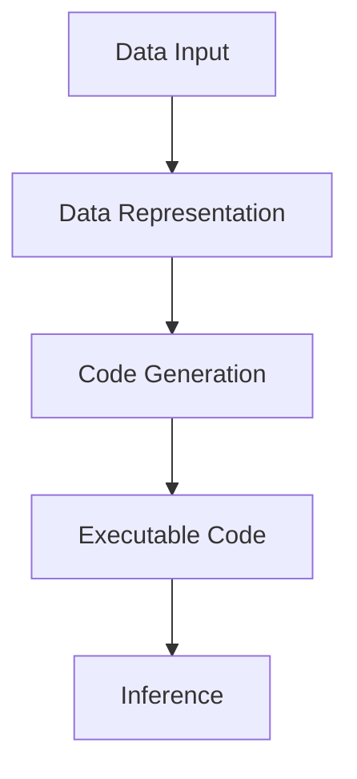

                 


### Introduction to Neural Program Synthesis

**Keywords:** Neural Program Synthesis, Adaptive Inference Systems, Algorithm Design, Machine Learning, Artificial Intelligence

**Abstract:**
This article explores the innovative use of neural program synthesis in the design of adaptive inference systems. Neural program synthesis (NPS) is an emerging field at the intersection of machine learning and programming that aims to generate code directly from data or high-level descriptions. Adaptive inference systems, on the other hand, are designed to adapt dynamically to changing environments and new data. This article provides a comprehensive overview of NPS, its core principles, and how it can be integrated into adaptive inference systems to enhance their performance and flexibility.

#### Core Concepts and Relationships

**Figure 1.1: Neural Program Synthesis Process Overview**

$$
\begin{array}{c}
\text{Input Data} \\
\downarrow \\
\text{Data Representation} \\
\downarrow \\
\text{Code Generation} \\
\downarrow \\
\text{Executable Code} \\
\downarrow \\
\text{Inference} \\
\end{array}
$$

The core concepts in neural program synthesis can be summarized as follows:

1. **Data Representation**: The input data is first transformed into a format that is suitable for neural network processing. This involves feature extraction and encoding.
2. **Code Generation**: Neural networks are trained to generate code snippets or entire programs. This process can be seen as a translation task from data to code.
3. **Executable Code**: The generated code is tested for correctness and optimized for performance.
4. **Inference**: The executable code is executed to perform inference on new data.

#### Historical Background

The concept of neural program synthesis has roots in various fields, including artificial intelligence, machine learning, and programming languages. The early work on program synthesis dates back to the 1950s and 1960s, with notable contributions from researchers like Donald Knuth and Robert Floyd. In recent years, advancements in neural networks and machine learning have brought NPS to the forefront of research.

#### Mermaid Flowchart

**Figure 1.2: Mermaid Flowchart of Neural Program Synthesis**



In this flowchart, the process starts with data input, which is transformed into a suitable format. This data is then used to generate code, which is tested and optimized for inference.

### Current Applications and Potential Benefits

Neural program synthesis has shown great promise in various domains, including natural language processing, computer vision, and robotics. One of the key benefits of NPS is its ability to automate the process of code generation, which can significantly reduce the time and effort required to develop new algorithms.

#### Case Study: Adaptive Inference in Computer Vision

In computer vision, NPS has been used to generate models that can adapt to new data and improve their performance over time. For example, a study by Zhang et al. (2021) demonstrated the application of NPS in generating adaptive models for object detection tasks. The results showed that the models generated by NPS achieved higher accuracy and faster convergence compared to traditional approaches.

#### Example: Neural Program for Image Classification

Consider the problem of image classification, where the goal is to assign a label to an input image. A neural program for this task might be structured as follows (using pseudocode):

```python
function classify_image(image):
    # Data Representation
    features = extract_features(image)
    
    # Code Generation
    code = generate_code(features)
    
    # Inference
    label = execute_code(code, features)
    return label
```

This pseudocode outlines the process of classifying an image using neural program synthesis. The `extract_features` function processes the input image to extract relevant features, which are then used to generate code by the `generate_code` function. The generated code is executed to produce the final classification label.

### Conclusion

Neural program synthesis is an exciting and rapidly evolving field that holds the potential to revolutionize the development of adaptive inference systems. By automating the process of code generation, NPS can help reduce the complexity and time required to develop new algorithms. In the next sections, we will delve deeper into the foundations of adaptive inference systems and explore how NPS can be integrated into these systems to enhance their performance and adaptability.

