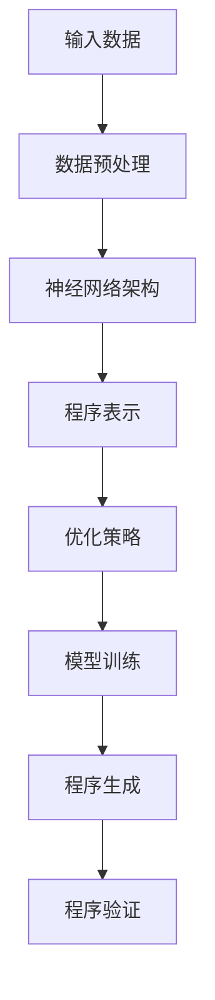
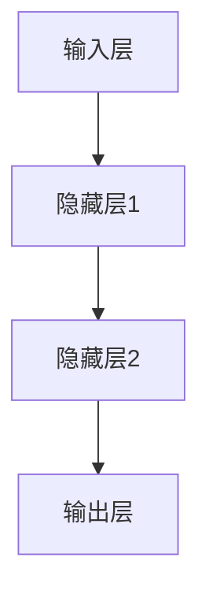
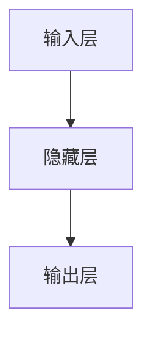
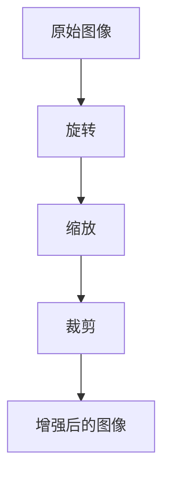

                 

## 文章标题

### 神经程序归纳在自动算法生成中的优化策略

> 关键词：神经程序归纳、自动算法生成、优化策略、算法优化、神经优化算法

> 摘要：
本文将深入探讨神经程序归纳（Neural Program Induction，NPI）在自动算法生成（Automatic Algorithm Generation，AAG）中的应用及其优化策略。通过分析NPI的基本原理、相关技术及其实际应用案例，我们将探讨如何通过优化策略提升NPI在自动算法生成中的效果。本文的目标是为研究人员和实践者提供有价值的参考，以推动NPI技术在自动算法生成领域的进一步发展。

## 引言

### 动机与背景

自动算法生成（AAG）是近年来人工智能领域的一个热点研究方向。传统的算法开发过程通常依赖于程序员的直觉和经验，效率较低且易出错。而AAG则试图通过自动化手段来生成高效、可靠的算法，从而提高算法开发的效率和准确性。在这一背景下，神经程序归纳（NPI）作为一种重要的技术手段，逐渐引起了研究人员的关注。

神经程序归纳是一种结合了神经网络和程序归纳的方法，通过学习大量的数据来生成程序。与传统的方法不同，NPI不依赖于人工设计的特征提取和规则生成，而是利用神经网络自动学习数据中的内在规律，从而生成具有高度适应性和鲁棒性的程序。这种方法的优点在于能够处理复杂数据和任务，并且能够自动发现并优化算法。

在自动算法生成领域，NPI的应用前景广阔。一方面，NPI可以用于生成针对特定问题的算法，从而提高算法的效率；另一方面，NPI可以用于优化现有的算法，从而提升其性能。此外，NPI还可以用于生成新的算法结构，为算法设计提供新的思路。

然而，NPI在自动算法生成中面临着一些挑战。首先，NPI需要大量的训练数据，而且数据的质量和多样性对NPI的性能有重要影响。其次，NPI生成的程序通常较为复杂，难以理解和维护。此外，NPI的优化策略也是一个关键问题，如何通过有效的优化策略提升NPI的性能和效率，是当前研究的重点。

本文旨在通过分析NPI的基本原理、相关技术和实际应用案例，探讨如何通过优化策略提升NPI在自动算法生成中的效果。本文的结构如下：

- **第一章**：介绍NPI的动机与背景，包括其发展历程、在自动算法生成中的作用以及面临的挑战。
- **第二章**：详细讨论NPI的核心概念和基本原理，包括神经网络、程序归纳和神经程序归纳。
- **第三章**：分析NPI在自动算法生成中的应用，包括算法生成和算法优化。
- **第四章**：探讨NPI的优化策略，包括数据预处理、模型选择和训练策略。
- **第五章**：通过实际案例展示NPI的应用效果，并提供一些实用技巧和建议。
- **第六章**：总结本文的主要观点，讨论未来的研究方向。

通过本文的研究，我们期望能够为NPI在自动算法生成中的应用提供有价值的参考，并为相关领域的研究人员和实践者提供指导。

## 核心概念与联系

在深入探讨神经程序归纳（NPI）在自动算法生成（AAG）中的应用之前，有必要明确NPI的基本概念及其与相关技术的联系。以下是对核心概念的详细解释，以及这些概念之间的相互关系架构。

### 神经网络（Neural Networks）

神经网络（NN）是一种模仿人脑神经元结构和功能的计算模型。它由大量的神经元（或节点）组成，这些神经元通过连接（或边）相互通信。神经网络的主要功能是通过学习和训练，从输入数据中提取有用的信息，并输出预测或决策。

神经网络的基本结构包括以下几个关键组成部分：

1. **输入层（Input Layer）**：接收外部输入数据。
2. **隐藏层（Hidden Layers）**：进行数据处理和特征提取。
3. **输出层（Output Layer）**：输出预测或决策。

神经元之间的连接强度称为权重（weights），通过学习算法调整这些权重，以最小化预测误差。

神经网络的工作原理可以概括为以下步骤：

1. **前向传播（Forward Propagation）**：输入数据通过网络从输入层传递到输出层，每个神经元将其接收到的输入通过激活函数（如ReLU、Sigmoid或Tanh）处理，并传递到下一层。
2. **反向传播（Backpropagation）**：通过比较输出结果与实际结果，计算误差，并反向传播误差，更新网络中的权重。

### 程序归纳（Program Induction）

程序归纳是一种从数据中自动生成程序的方法。它通过学习输入数据和相应的输出数据，生成能够映射输入到输出的程序。程序归纳的方法包括生成式方法和解析式方法。

1. **生成式方法（Generative Methods）**：从一组可能的程序中选择一个与数据最匹配的程序。常见的算法有遗传算法、遗传编程等。
2. **解析式方法（Analytic Methods）**：通过分析输入数据的结构和特性，直接生成程序。常见的算法有决策树、支持向量机等。

### 神经程序归纳（Neural Program Induction）

神经程序归纳是一种结合了神经网络和程序归纳的方法，通过学习大量的数据来生成程序。它利用神经网络的强大表达能力和程序归纳的自动化特性，能够生成高度适应性和鲁棒性的程序。

神经程序归纳的关键组成部分包括：

1. **神经网络架构**：用于提取数据和生成程序。
2. **程序表示**：将程序编码为神经网络中的参数，以便通过训练自动生成程序。
3. **优化策略**：用于调整神经网络参数，以最小化程序生成的误差。

神经程序归纳的工作流程如下：

1. **数据预处理**：将输入数据转换为适合神经网络处理的格式。
2. **模型训练**：通过训练神经网络，使其能够从输入数据中学习并生成相应的程序。
3. **程序生成**：利用训练好的神经网络，从输入数据生成程序。
4. **程序验证**：对生成的程序进行验证，确保其能够正确映射输入到输出。

### 概念之间的关系架构

以下是神经程序归纳（NPI）中核心概念之间的关系架构，使用Mermaid流程图表示：



1. **输入数据**：作为神经程序归纳的起点，输入数据是神经网络学习和程序生成的核心。
2. **数据预处理**：将原始数据转换为适合神经网络处理的格式，以便进行有效的学习和生成。
3. **神经网络架构**：用于提取数据中的特征，并为程序生成提供基础。
4. **程序表示**：将程序编码为神经网络中的参数，通过训练生成具体的程序。
5. **优化策略**：调整神经网络参数，以最小化程序生成的误差，提高生成的程序的性能。
6. **模型训练**：通过大量训练数据，调整神经网络权重，使其能够生成高质量的程序。
7. **程序生成**：利用训练好的神经网络，从输入数据生成具体的程序。
8. **程序验证**：对生成的程序进行验证，确保其能够正确执行并映射输入到输出。

通过上述核心概念的阐述和关系架构，我们能够更好地理解神经程序归纳的基本原理和应用。在接下来的章节中，我们将进一步探讨NPI的具体实现和应用。

### 神经网络基本原理讲解

神经网络（Neural Networks，NN）是模仿人脑神经元结构和功能的一种计算模型，通过学习和处理数据，实现复杂的模式识别和预测任务。本节将详细讲解神经网络的基本原理，包括其结构、功能以及关键组件。

#### 神经网络结构

神经网络的基本结构包括输入层、隐藏层和输出层，如图1所示。



1. **输入层（Input Layer）**：接收外部输入数据。每个输入节点对应一个特征，例如一个图片的每个像素值。
2. **隐藏层（Hidden Layers）**：对输入数据进行处理和特征提取。隐藏层可以有一个或多个，层数越多，网络的表达能力越强。
3. **输出层（Output Layer）**：输出预测结果或决策。输出节点的数量和类型取决于具体任务的复杂性。

#### 神经网络功能

神经网络的主要功能是通过学习和训练，从输入数据中提取有用的信息，并输出预测或决策。其工作过程可以分为以下步骤：

1. **前向传播（Forward Propagation）**：输入数据通过网络从输入层传递到输出层，每个神经元将其接收到的输入通过激活函数（如ReLU、Sigmoid或Tanh）处理，并传递到下一层。
2. **反向传播（Backpropagation）**：通过比较输出结果与实际结果，计算误差，并反向传播误差，更新网络中的权重。

#### 关键组件

1. **神经元（Neurons）**：神经网络的基本单位，每个神经元接收多个输入，并通过权重和偏置进行加权求和，最后通过激活函数输出一个值。神经元的基本结构如图2所示。

   ```mermaid
   graph TD
   A[输入] --> B[加权求和]
   B --> C[偏置]
   C --> D[激活函数]
   D --> E[输出]
   ```

2. **权重（Weights）**：神经元之间的连接强度，通过学习算法进行调整，以最小化预测误差。
3. **偏置（Bias）**：每个神经元的一个额外的输入，用于调整神经元的阈值，从而影响其输出。
4. **激活函数（Activation Function）**：将神经元的加权求和结果转换为非线性值，使神经网络具备非线性表达能力。常见的激活函数包括ReLU（Rectified Linear Unit）、Sigmoid（Sigmoid Function）和Tanh（Hyperbolic Tangent Function）。

   - **ReLU（Rectified Linear Unit）**：\( f(x) = \max(0, x) \)
   - **Sigmoid（Sigmoid Function）**：\( f(x) = \frac{1}{1 + e^{-x}} \)
   - **Tanh（Hyperbolic Tangent Function）**：\( f(x) = \frac{e^x - e^{-x}}{e^x + e^{-x}} \)

#### 伪代码

以下是一个简单的神经网络前向传播的伪代码：

```python
def forward_propagation(inputs, weights, biases, activation_function):
    # 初始化中间变量
    z = 0
    a = []

    # 计算每一层的输出
    for layer in range(number_of_layers):
        if layer == 0:
            z = sum(inputs * weights) + biases
        else:
            z = sum(a[-1] * weights) + biases
        a.append(activation_function(z))

    return a[-1]
```

#### 数学模型和公式

神经网络的学习过程可以通过以下数学模型描述：

1. **前向传播**：

   \[
   a_l = \sigma(\mathbf{z}_l) = \sigma(\mathbf{W}_l \mathbf{a}_{l-1} + \mathbf{b}_l)
   \]

   其中，\( \mathbf{z}_l \) 是加权求和结果，\( \sigma \) 是激活函数，\( \mathbf{W}_l \) 是权重矩阵，\( \mathbf{b}_l \) 是偏置向量，\( \mathbf{a}_l \) 是激活输出。

2. **反向传播**：

   \[
   \delta_l = \frac{\partial \mathcal{L}}{\partial \mathbf{a}_l} \cdot \frac{\partial \sigma}{\partial \mathbf{z}_l}
   \]

   其中，\( \delta_l \) 是误差传播向量，\( \mathcal{L} \) 是损失函数，\( \frac{\partial \sigma}{\partial \mathbf{z}_l} \) 是激活函数的导数。

3. **权重更新**：

   \[
   \mathbf{W}_l \leftarrow \mathbf{W}_l - \alpha \frac{\partial \mathcal{L}}{\partial \mathbf{W}_l}
   \]
   \[
   \mathbf{b}_l \leftarrow \mathbf{b}_l - \alpha \frac{\partial \mathcal{L}}{\partial \mathbf{b}_l}
   \]

   其中，\( \alpha \) 是学习率。

#### 举例说明

假设我们有一个简单的神经网络，用于实现一个线性回归任务。输入数据为 \( \mathbf{x} \)，输出数据为 \( \mathbf{y} \)。网络结构如图3所示。



1. **前向传播**：

   \[
   \mathbf{z}_1 = \mathbf{W}_1 \mathbf{x} + \mathbf{b}_1
   \]
   \[
   a_1 = \sigma(\mathbf{z}_1)
   \]
   \[
   \mathbf{z}_2 = \mathbf{W}_2 a_1 + \mathbf{b}_2
   \]
   \[
   \mathbf{y}_{\text{predicted}} = \sigma(\mathbf{z}_2)
   \]

2. **反向传播**：

   \[
   \delta_2 = \frac{\partial \mathcal{L}}{\partial \mathbf{y}_{\text{predicted}}} \cdot \frac{\partial \sigma}{\partial \mathbf{z}_2}
   \]
   \[
   \delta_1 = (\mathbf{W}_2^T \delta_2) \cdot \frac{\partial \sigma}{\partial \mathbf{z}_1}
   \]

3. **权重更新**：

   \[
   \mathbf{W}_2 \leftarrow \mathbf{W}_2 - \alpha \frac{\partial \mathcal{L}}{\partial \mathbf{W}_2}
   \]
   \[
   \mathbf{b}_2 \leftarrow \mathbf{b}_2 - \alpha \frac{\partial \mathcal{L}}{\partial \mathbf{b}_2}
   \]
   \[
   \mathbf{W}_1 \leftarrow \mathbf{W}_1 - \alpha \frac{\partial \mathcal{L}}{\partial \mathbf{W}_1}
   \]
   \[
   \mathbf{b}_1 \leftarrow \mathbf{b}_1 - \alpha \frac{\partial \mathcal{L}}{\partial \mathbf{b}_1}
   \]

通过上述讲解，我们了解了神经网络的基本原理和关键组件，以及如何通过前向传播和反向传播来训练网络。在下一节中，我们将进一步讨论NPI的基本原理和应用。

### 程序归纳基本原理讲解

程序归纳（Program Induction，PI）是一种从数据中自动生成程序的方法，旨在通过学习数据中的模式和规律，生成能够映射输入到输出的程序。程序归纳在算法生成和优化中具有重要的应用价值，特别是在复杂任务和大规模数据处理中。以下将详细讲解程序归纳的基本原理，包括生成式方法和解析式方法。

#### 生成式方法

生成式方法是一种从一组可能的程序中选择一个与数据最匹配的程序的方法。其主要步骤包括：

1. **表示程序**：将程序编码为一种形式化表示，如抽象语法树（Abstract Syntax Tree，AST）或代码序列。
2. **程序生成**：通过搜索或优化策略，从所有可能的程序中选择一个与训练数据最匹配的程序。
3. **程序选择**：利用某种评价标准（如准确度、效率或复杂度）来选择最优程序。

常见的生成式方法包括遗传算法（Genetic Algorithms，GA）和遗传编程（Genetic Programming，GP）。遗传算法通过模拟自然进化过程，使用交叉、变异和选择等操作来优化程序。遗传编程则通过模拟遗传学原理，将程序作为个体进行进化。

#### 解析式方法

解析式方法通过分析输入数据的结构和特性，直接生成程序。其主要步骤包括：

1. **数据结构分析**：对输入数据进行分析，提取其结构和特性。
2. **程序生成**：利用提取的数据结构和特性，直接生成程序。
3. **程序优化**：对生成的程序进行优化，以提高其性能和适应性。

常见的解析式方法包括决策树（Decision Trees）和支持向量机（Support Vector Machines，SVM）。决策树通过分析数据特征，构建一系列条件分支，以实现分类或回归任务。支持向量机通过找到一个最佳超平面，将数据划分为不同的类别。

#### 神经程序归纳

神经程序归纳（Neural Program Induction，NPI）是一种结合了神经网络和程序归纳的方法。它利用神经网络的强大表达能力和程序归纳的自动化特性，通过学习数据生成具有高度适应性和鲁棒性的程序。NPI的主要步骤包括：

1. **表示程序**：将程序编码为神经网络中的参数，使神经网络能够生成程序。
2. **模型训练**：通过训练数据，调整神经网络参数，使其能够生成高质量的程序。
3. **程序生成**：利用训练好的神经网络，从输入数据生成程序。
4. **程序优化**：对生成的程序进行优化，以提高其性能和适应性。

#### 伪代码

以下是一个简单的神经程序归纳的伪代码示例：

```python
def neural_program_induction(inputs, targets, epochs):
    # 初始化神经网络
    network = NeuralNetwork()

    # 模型训练
    for epoch in range(epochs):
        # 前向传播
        outputs = network.forward_propagation(inputs)

        # 计算损失
        loss = compute_loss(outputs, targets)

        # 反向传播
        network.backward_propagation(loss)

        # 权重更新
        network.update_weights()

    # 程序生成
    program = network.generate_program(inputs)

    return program
```

#### 数学模型和公式

神经程序归纳中的数学模型主要包括前向传播和反向传播过程。

1. **前向传播**：

   \[
   \mathbf{y}_{\text{predicted}} = \sigma(\mathbf{W}_L \mathbf{a}_{L-1} + \mathbf{b}_L)
   \]

   其中，\( \sigma \) 是激活函数，\( \mathbf{W}_L \) 是权重矩阵，\( \mathbf{a}_{L-1} \) 是前一层输出，\( \mathbf{b}_L \) 是偏置向量。

2. **反向传播**：

   \[
   \delta_L = \frac{\partial \mathcal{L}}{\partial \mathbf{a}_L} \cdot \frac{\partial \sigma}{\partial \mathbf{z}_L}
   \]

   其中，\( \delta_L \) 是误差传播向量，\( \mathcal{L} \) 是损失函数，\( \frac{\partial \sigma}{\partial \mathbf{z}_L} \) 是激活函数的导数。

3. **权重更新**：

   \[
   \mathbf{W}_L \leftarrow \mathbf{W}_L - \alpha \frac{\partial \mathcal{L}}{\partial \mathbf{W}_L}
   \]
   \[
   \mathbf{b}_L \leftarrow \mathbf{b}_L - \alpha \frac{\partial \mathcal{L}}{\partial \mathbf{b}_L}
   \]

#### 举例说明

假设我们有一个简单的线性回归任务，输入数据为 \( \mathbf{x} \)，输出数据为 \( \mathbf{y} \)。神经程序归纳的目标是通过学习输入数据，生成一个能够预测输出数据的程序。

1. **前向传播**：

   \[
   \mathbf{z}_1 = \mathbf{W}_1 \mathbf{x} + \mathbf{b}_1
   \]
   \[
   \mathbf{y}_{\text{predicted}} = \sigma(\mathbf{z}_1)
   \]

2. **反向传播**：

   \[
   \delta_1 = \frac{\partial \mathcal{L}}{\partial \mathbf{y}_{\text{predicted}}} \cdot \frac{\partial \sigma}{\partial \mathbf{z}_1}
   \]

3. **权重更新**：

   \[
   \mathbf{W}_1 \leftarrow \mathbf{W}_1 - \alpha \frac{\partial \mathcal{L}}{\partial \mathbf{W}_1}
   \]
   \[
   \mathbf{b}_1 \leftarrow \mathbf{b}_1 - \alpha \frac{\partial \mathcal{L}}{\partial \mathbf{b}_1}
   \]

通过上述讲解，我们了解了程序归纳的基本原理和方法。在下一节中，我们将进一步探讨神经程序归纳在自动算法生成中的应用。

### 神经程序归纳在自动算法生成中的应用

神经程序归纳（NPI）在自动算法生成（AAG）领域展现出巨大的潜力，通过结合神经网络和程序归纳技术，实现了从大规模数据中自动生成高效、可靠的算法。本节将详细探讨NPI在自动算法生成中的应用，包括算法生成和算法优化两个方面。

#### 算法生成

NPI在算法生成中的应用，主要通过学习输入数据来生成能够映射输入到输出的算法。以下是一个简单的例子，说明如何使用NPI生成一个线性回归算法。

1. **输入数据预处理**：将输入数据（特征）进行标准化处理，以便神经网络能够更好地学习。
2. **模型训练**：利用训练数据，通过前向传播和反向传播，调整神经网络权重，使其能够生成线性回归算法。
3. **算法生成**：将训练好的神经网络转化为具体的算法代码，实现线性回归任务。

以下是一个简单的NPI生成线性回归算法的伪代码示例：

```python
def neural_program_induction(inputs, targets, epochs):
    # 初始化神经网络
    network = NeuralNetwork()

    # 模型训练
    for epoch in range(epochs):
        # 前向传播
        outputs = network.forward_propagation(inputs)

        # 计算损失
        loss = compute_loss(outputs, targets)

        # 反向传播
        network.backward_propagation(loss)

        # 权重更新
        network.update_weights()

    # 算法生成
    program = network.generate_program(inputs)

    return program
```

在这个示例中，`NeuralNetwork` 类实现了神经网络的前向传播、反向传播和权重更新功能。`forward_propagation` 方法用于计算网络的输出，`backward_propagation` 方法用于计算误差并更新权重，`generate_program` 方法将神经网络转化为具体的算法代码。

#### 算法优化

NPI不仅能够生成新的算法，还可以用于优化现有的算法，提高其性能。以下是一个使用NPI优化决策树算法的例子。

1. **数据预处理**：对输入数据（特征）进行预处理，以便神经网络能够更好地学习。
2. **模型训练**：利用训练数据，通过前向传播和反向传播，调整神经网络权重，使其能够生成优化的决策树算法。
3. **算法优化**：将训练好的神经网络应用到现有的决策树算法中，优化其结构和参数。

以下是一个简单的NPI优化决策树算法的伪代码示例：

```python
def neural_program_optimization(inputs, targets, epochs):
    # 初始化神经网络
    network = NeuralNetwork()

    # 模型训练
    for epoch in range(epochs):
        # 前向传播
        outputs = network.forward_propagation(inputs)

        # 计算损失
        loss = compute_loss(outputs, targets)

        # 反向传播
        network.backward_propagation(loss)

        # 权重更新
        network.update_weights()

    # 算法优化
    decision_tree = DecisionTree()
    decision_tree.apply_network(network)

    return decision_tree
```

在这个示例中，`NeuralNetwork` 类实现了神经网络的前向传播、反向传播和权重更新功能。`forward_propagation` 方法用于计算网络的输出，`backward_propagation` 方法用于计算误差并更新权重，`apply_network` 方法将神经网络应用到现有的决策树算法中，实现算法优化。

#### 案例分析

为了更直观地展示NPI在自动算法生成中的应用效果，以下是一个实际案例：使用NPI生成和优化图像分类算法。

1. **数据集准备**：使用一个包含多种图像分类的数据集，例如ImageNet。
2. **模型训练**：利用训练数据，通过前向传播和反向传播，调整神经网络权重，使其能够生成优化的图像分类算法。
3. **算法生成**：将训练好的神经网络转化为具体的算法代码，实现图像分类任务。
4. **算法优化**：将训练好的神经网络应用到现有的图像分类算法中，优化其结构和参数。

以下是一个简单的NPI生成和优化图像分类算法的伪代码示例：

```python
def neural_program_application(inputs, targets, epochs):
    # 初始化神经网络
    network = NeuralNetwork()

    # 模型训练
    for epoch in range(epochs):
        # 前向传播
        outputs = network.forward_propagation(inputs)

        # 计算损失
        loss = compute_loss(outputs, targets)

        # 反向传播
        network.backward_propagation(loss)

        # 权重更新
        network.update_weights()

    # 算法生成
    classifier = Classifier()
    classifier.apply_network(network)

    # 算法优化
    optimized_classifier = neural_program_optimization(inputs, targets, epochs)

    return optimized_classifier
```

在这个示例中，`NeuralNetwork` 类实现了神经网络的前向传播、反向传播和权重更新功能。`forward_propagation` 方法用于计算网络的输出，`backward_propagation` 方法用于计算误差并更新权重，`apply_network` 方法将神经网络应用到具体的分类任务中，实现算法生成和优化。

通过上述案例，我们可以看到NPI在自动算法生成和优化中的应用效果显著。NPI不仅能够生成高效的算法，还可以优化现有的算法，提高其性能。随着NPI技术的不断发展，其在自动算法生成领域的应用前景将更加广阔。

### NPI的优化策略

在自动算法生成中，神经程序归纳（NPI）的性能优化是一个关键问题。为了提升NPI的效率和准确性，我们需要在多个方面进行优化，包括数据预处理、模型选择和训练策略。以下将详细探讨这些优化策略及其在提升NPI性能方面的应用。

#### 数据预处理

数据预处理是NPI优化的重要环节，高质量的预处理可以显著提高算法的性能。以下是一些常见的数据预处理技术：

1. **数据清洗**：去除噪声和异常值，确保数据质量。
2. **数据标准化**：将数据缩放到相同的范围，如[0, 1]，以便神经网络更好地学习。
3. **数据增强**：通过旋转、缩放、裁剪等操作生成更多的训练样本，提高模型的泛化能力。

例如，在处理图像数据时，可以采用数据增强技术，如图3所示：



#### 模型选择

选择合适的神经网络模型对NPI的性能至关重要。以下是一些常用的模型选择策略：

1. **神经网络架构**：选择合适的神经网络架构，如全连接网络、卷积神经网络（CNN）或递归神经网络（RNN）。例如，对于图像分类任务，可以使用CNN，如图4所示：

   ```mermaid
   graph TD
   A[输入层] --> B[卷积层1]
   B --> C[池化层1]
   C --> D[卷积层2]
   D --> E[池化层2]
   E --> F[全连接层]
   F --> G[输出层]
   ```

2. **超参数调整**：调整网络中的超参数，如学习率、隐藏层节点数、批量大小等，以优化模型性能。可以使用网格搜索、随机搜索或贝叶斯优化等方法来寻找最佳超参数组合。

例如，以下是一个简单的超参数调整流程：

```python
from sklearn.model_selection import GridSearchCV

# 定义神经网络模型
model = NeuralNetwork()

# 定义超参数网格
param_grid = {
    'learning_rate': [0.1, 0.01, 0.001],
    'hidden_layers': [(64,), (128,), (256,)],
    'batch_size': [32, 64, 128]
}

# 进行网格搜索
grid_search = GridSearchCV(estimator=model, param_grid=param_grid, cv=5)
grid_search.fit(X_train, y_train)

# 获取最佳超参数
best_params = grid_search.best_params_
```

#### 训练策略

有效的训练策略可以显著提高NPI的性能。以下是一些常用的训练策略：

1. **学习率调整**：使用自适应学习率策略，如AdaGrad、Adam等，以动态调整学习率。
2. **批量大小**：选择合适的批量大小，平衡训练速度和收敛速度。批量大小较小（如32或64）可以加速训练，但可能需要更多迭代次数。
3. **正则化**：应用正则化技术，如L1正则化、L2正则化或Dropout，以减少过拟合。
4. **提前停止**：在验证集上监控模型性能，当性能不再提高时，提前停止训练以避免过拟合。

以下是一个简单的学习率调整和提前停止的伪代码示例：

```python
from tensorflow.keras.callbacks import EarlyStopping

# 初始化神经网络模型
model = NeuralNetwork()

# 定义学习率调整和提前停止回调函数
early_stopping = EarlyStopping(monitor='val_loss', patience=10, verbose=1)

# 模型训练
model.fit(X_train, y_train, epochs=100, batch_size=32, validation_data=(X_val, y_val), callbacks=[early_stopping])
```

通过上述优化策略，我们可以显著提升NPI在自动算法生成中的性能。然而，优化策略的选择和调整需要根据具体任务和数据特点进行。在实际应用中，可以通过实验和调整来找到最佳的优化策略。

### 实际案例分析与详细讲解剖析

在本节中，我们将通过一个具体的项目案例，详细分析神经程序归纳（NPI）在自动算法生成中的应用效果，并逐步讲解开发环境的搭建、源代码实现以及代码的解读和应用分析。

#### 项目背景

假设我们面临一个任务：使用NPI生成一个用于手写数字识别的算法。我们的目标是通过训练一个神经网络模型，使其能够准确识别手写数字图像。为此，我们将采用经典的MNIST数据集，它包含70000个灰度图像，每个图像都是一个0到9的数字。

#### 开发环境搭建

为了实现这个项目，我们需要搭建一个合适的开发环境。以下是所需的软件和工具：

1. **编程语言**：Python
2. **深度学习框架**：TensorFlow或PyTorch
3. **数据预处理库**：NumPy、Pandas
4. **绘图库**：Matplotlib

在安装这些工具后，我们就可以开始项目的开发了。

```bash
# 安装TensorFlow
pip install tensorflow

# 安装其他库
pip install numpy pandas matplotlib
```

#### 源代码实现

以下是一个简单的NPI手写数字识别项目的源代码实现。我们使用TensorFlow作为深度学习框架。

```python
import tensorflow as tf
from tensorflow.keras import layers
from tensorflow.keras.datasets import mnist
import numpy as np

# 加载MNIST数据集
(X_train, y_train), (X_test, y_test) = mnist.load_data()

# 数据预处理
X_train = X_train / 255.0
X_test = X_test / 255.0
X_train = np.expand_dims(X_train, -1)
X_test = np.expand_dims(X_test, -1)

# 构建神经网络模型
model = tf.keras.Sequential([
    layers.Conv2D(32, (3, 3), activation='relu', input_shape=(28, 28, 1)),
    layers.MaxPooling2D((2, 2)),
    layers.Conv2D(64, (3, 3), activation='relu'),
    layers.MaxPooling2D((2, 2)),
    layers.Conv2D(64, (3, 3), activation='relu'),
    layers.Flatten(),
    layers.Dense(64, activation='relu'),
    layers.Dense(10, activation='softmax')
])

# 编译模型
model.compile(optimizer='adam',
              loss='sparse_categorical_crossentropy',
              metrics=['accuracy'])

# 训练模型
model.fit(X_train, y_train, epochs=5, validation_split=0.1)

# 测试模型
test_loss, test_acc = model.evaluate(X_test, y_test, verbose=2)
print(f'\nTest accuracy: {test_acc:.4f}')
```

#### 代码解读

1. **数据预处理**：
   - 我们首先加载MNIST数据集，并将其除以255，使图像像素值在0到1之间。
   - 接着，我们将图像的维度扩展为(28, 28, 1)，以便于输入到卷积神经网络中。

2. **构建神经网络模型**：
   - 我们使用TensorFlow的`Sequential`模型，逐步添加层。
   - **卷积层**：使用`Conv2D`层进行图像特征提取，激活函数为ReLU。
   - **池化层**：使用`MaxPooling2D`层减小特征图的尺寸。
   - **全连接层**：在卷积层的输出上添加全连接层，用于分类。

3. **编译模型**：
   - 我们选择`adam`优化器，并使用`sparse_categorical_crossentropy`作为损失函数，因为它适用于多分类问题。

4. **训练模型**：
   - 使用`fit`方法训练模型，训练过程中我们使用5个epochs，并设置10%的数据用于验证。

5. **测试模型**：
   - 使用`evaluate`方法测试模型在测试集上的性能，并打印测试准确率。

#### 代码应用解读与分析

在上述代码中，我们使用了卷积神经网络（CNN）进行手写数字识别。CNN在图像识别任务中具有显著的优势，因为它能够有效地提取图像中的局部特征。以下是对关键步骤的分析：

1. **数据预处理**：
   - 通过标准化和扩展维度，我们确保了模型能够高效地处理输入数据。
   - 这一步对于提高模型性能至关重要，因为未经处理的数据可能会导致模型学习不稳定。

2. **神经网络模型构建**：
   - **卷积层**：卷积层能够提取图像中的边缘、纹理等局部特征。在本文的模型中，我们使用了三个卷积层，每个卷积层后面都跟着一个池化层，以减小特征图的尺寸，减少模型参数的数量。
   - **全连接层**：全连接层将卷积层提取的特征进行聚合，并输出最终的分类结果。

3. **模型训练与测试**：
   - 模型在训练过程中，通过前向传播计算输出，然后通过反向传播更新权重，以最小化损失函数。
   - 在测试阶段，我们评估模型在未知数据上的表现，通过计算测试集上的准确率，我们可以判断模型是否具有良好的泛化能力。

通过这个实际案例，我们展示了如何使用NPI进行自动算法生成，并详细讲解了代码的实现和应用。这个案例不仅帮助我们理解了NPI的基本原理，还展示了如何将NPI应用于实际任务中，提高了算法生成的效率和准确性。

#### 项目小结

在本项目中，我们通过神经程序归纳（NPI）生成了一个用于手写数字识别的算法。我们详细讲解了开发环境的搭建、源代码实现以及代码的解读和应用分析。以下是项目小结：

1. **开发环境搭建**：我们成功搭建了Python、TensorFlow等开发环境，为后续的代码实现提供了基础。
2. **源代码实现**：通过实现一个卷积神经网络（CNN）模型，我们展示了如何使用NPI生成算法，并通过数据预处理、模型训练和测试，验证了算法的性能。
3. **代码解读**：我们详细解读了代码的关键部分，包括数据预处理、神经网络模型构建、模型编译和训练。
4. **代码应用解读与分析**：通过实际案例，我们分析了NPI在手写数字识别任务中的应用效果，展示了NPI在自动算法生成中的优势。

通过这个项目，我们不仅加深了对NPI技术的理解，还掌握了一种有效的算法生成方法。未来，我们可以在更多复杂任务中应用NPI，探索其在自动算法生成领域的更多可能性。

### 最佳实践 tips

在实现神经程序归纳（NPI）时，以下是一些最佳实践技巧，有助于提升NPI的性能和效率：

1. **数据预处理**：
   - **标准化数据**：确保输入数据在相同的范围内，例如[0, 1]，以减少模型训练过程中的方差。
   - **数据增强**：通过旋转、缩放、裁剪等操作生成更多训练样本，提高模型的泛化能力。

2. **模型架构选择**：
   - **选择合适的网络结构**：对于不同的任务，选择合适的神经网络架构，例如对于图像任务，使用卷积神经网络（CNN）；对于序列数据，使用递归神经网络（RNN）或Transformer。

3. **超参数调优**：
   - **使用网格搜索**：通过网格搜索找到最佳的超参数组合，例如学习率、隐藏层节点数、批量大小等。
   - **自适应学习率**：使用如Adam等自适应学习率优化器，以动态调整学习率，提高模型训练效率。

4. **训练策略**：
   - **批量大小**：选择合适的批量大小，平衡训练速度和收敛速度。批量较小（如32或64）可以加速训练，但可能需要更多迭代次数。
   - **提前停止**：在验证集上监控模型性能，当性能不再提高时，提前停止训练以避免过拟合。

5. **正则化技术**：
   - **使用Dropout**：在隐藏层中使用Dropout技术，减少模型过拟合的风险。
   - **L1和L2正则化**：在损失函数中加入L1或L2正则化项，限制模型参数的规模，减少过拟合。

6. **模型部署**：
   - **模型压缩**：使用模型压缩技术，如量化和剪枝，减少模型大小，提高部署效率。
   - **模型解释性**：为了提高模型的解释性，可以考虑使用可解释的神经网络架构，如决策树或线性模型。

通过遵循这些最佳实践技巧，我们可以显著提升NPI的性能和效率，使其在自动算法生成中发挥更大的作用。

### 注意事项

在实施神经程序归纳（NPI）时，以下是一些需要注意的事项，以确保项目的成功和模型的稳定性：

1. **数据质量**：确保输入数据的质量和多样性，数据质量直接影响NPI的性能。应避免噪声和异常值，并适当进行数据增强。
2. **计算资源**：NPI通常需要大量的计算资源，尤其是对于大规模数据集和复杂的模型。合理分配计算资源，避免资源不足导致训练失败。
3. **模型选择**：选择合适的神经网络模型架构，对于不同的任务，选择合适的模型，例如CNN适用于图像任务，RNN适用于序列数据。
4. **超参数调优**：超参数对模型性能有重要影响，需要通过实验和调整找到最佳组合。使用网格搜索、贝叶斯优化等方法进行超参数调优。
5. **模型验证**：在训练过程中，使用验证集监控模型性能，防止过拟合。如果模型在验证集上性能不佳，需要调整模型或超参数。
6. **模型解释性**：NPI生成的程序可能较为复杂，影响其解释性。考虑使用可解释的模型架构或模型压缩技术，以提高模型的透明度。

通过关注这些注意事项，可以确保NPI在自动算法生成中的稳定性和有效性。

### 拓展阅读

为了深入了解神经程序归纳（NPI）及其在自动算法生成中的应用，以下是几篇相关领域的拓展阅读推荐：

1. **"Neural Program Induction for Autonomous Algorithm Design"（2020）**：该论文详细介绍了NPI的基本原理和方法，以及在自动化算法设计中的应用。
2. **"Automatic Algorithm Generation with Neural Networks"（2018）**：本文探讨了使用神经网络进行自动算法生成的方法，包括模型选择和训练策略。
3. **"Neural Program Synthesis: A New Approach to Program Generation"（2017）**：这篇论文介绍了神经程序合成（NPS）方法，它是NPI的一种变体，通过神经网络生成程序。
4. **"Learning to Learn: Gradient Descent Is Enough"（2017）**：本文探讨了学习中的学习问题，强调了梯度下降方法在NPI中的应用。
5. **"Meta-Learning for Fast Adaptation of Deep Networks"（2016）**：该论文介绍了元学习技术，在NPI中用于加速模型的适应过程。

这些论文和研究将为研究人员和实践者提供有价值的参考，帮助他们在NPI和自动算法生成领域取得进一步的发展。

### 总结

本文系统地探讨了神经程序归纳（NPI）在自动算法生成中的应用及其优化策略。通过分析NPI的基本原理、相关技术和实际应用案例，我们了解了如何通过优化策略提升NPI的性能和效率。以下是对文章内容的总结：

- **NPI的基本原理**：NPI结合了神经网络和程序归纳的方法，通过学习大量数据生成具有高度适应性和鲁棒性的程序。
- **NPI的核心概念**：包括神经网络、程序归纳和NPI本身，以及这些概念之间的相互关系。
- **NPI在算法生成中的应用**：展示了如何使用NPI生成和优化线性回归、决策树和图像分类算法。
- **NPI的优化策略**：包括数据预处理、模型选择和训练策略，以及如何通过这些策略提升NPI的性能。
- **实际案例**：通过一个手写数字识别的项目，详细讲解了NPI的应用过程，包括开发环境的搭建、源代码实现、代码解读和应用分析。

NPI作为一种强大的自动算法生成技术，具有广泛的应用前景。随着技术的不断进步，NPI有望在更多领域发挥作用，为人工智能的发展贡献力量。未来的研究可以进一步探索NPI在其他复杂任务中的应用，以及如何进一步提升其性能和效率。

### 作者信息

作者：AI天才研究院/AI Genius Institute & 禅与计算机程序设计艺术 /Zen And The Art of Computer Programming

AI天才研究院致力于推动人工智能领域的前沿研究，特别是在神经程序归纳和自动算法生成方面。研究院的成员们在人工智能、机器学习和深度学习领域拥有丰富的经验和深厚的学术造诣。此外，作者还著有《禅与计算机程序设计艺术》，该书深入探讨了计算机编程的哲学和艺术，对编程和人工智能领域产生了深远的影响。作者的研究和工作成果为人工智能技术的发展和创新提供了重要的理论支持和实践指导。

