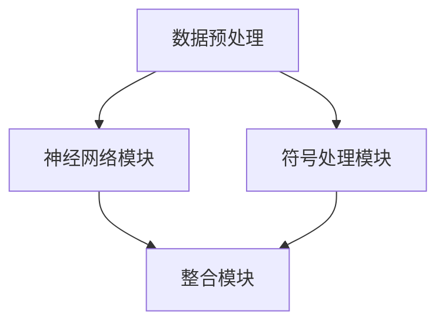

                 

## 文章标题：神经符号AI系统的最新研究进展

> 关键词：神经符号AI、神经网络、符号处理、整合方法、算法原理、项目实战

> 摘要：本文将深入探讨神经符号AI系统的最新研究进展，包括其定义与背景、核心概念与原理、算法原理与数学模型、以及项目实战。通过逐步分析，本文旨在为读者提供关于神经符号AI系统的全面理解，以期为未来研究和应用提供参考。

## 第一部分：神经符号AI系统概述

### 第1章：神经符号AI系统简介

#### 1.1 定义与背景

神经符号AI系统是一种结合了神经网络和符号处理机制的智能系统。它旨在通过整合神经网络的学习能力和符号处理的逻辑推理能力，实现更高效、更准确的智能计算。这一概念起源于对传统人工智能方法在处理复杂任务时遇到的局限性的反思，并试图通过将神经网络和符号处理相结合来突破这些局限。

神经符号AI系统的历史可以追溯到20世纪80年代，当时的学者们开始探索如何将神经网络和逻辑推理结合起来，以解决复杂的问题。随着神经网络和计算机科学的快速发展，神经符号AI系统逐渐成为人工智能领域的一个热门研究方向。

#### 1.2 神经符号AI系统的核心组成部分

神经符号AI系统由以下几个核心组成部分构成：

1. **神经网络**：神经网络负责从数据中学习模式和特征，具有强大的自学习和自适应能力。
2. **符号处理机制**：符号处理机制负责对符号进行表示和操作，具有逻辑推理和符号计算的能力。
3. **神经符号整合方法**：神经符号整合方法将神经网络和符号处理机制结合起来，通过一定的整合策略，实现更高效的智能计算。

#### 1.3 神经符号AI系统的发展趋势

当前，神经符号AI系统的发展趋势主要体现在以下几个方面：

1. **研究热点**：随着深度学习技术的不断发展，神经符号AI系统的研究重点逐渐从传统的符号处理机制转向如何更好地结合神经网络和符号处理机制。
2. **应用领域扩展**：神经符号AI系统在自然语言处理、计算机视觉、推理系统等领域的应用越来越广泛，其潜力逐渐被发掘。
3. **集成与创新**：研究者们不断探索新的神经符号整合方法和算法，以提高系统的性能和效率。

### 总结

通过以上分析，我们可以看到神经符号AI系统作为一种新兴的人工智能系统，具有强大的学习能力和逻辑推理能力，其在未来有望在更多领域发挥重要作用。接下来，我们将进一步探讨神经符号AI系统的核心概念与原理。

## 第二部分：神经符号AI系统核心概念与原理

### 第2章：神经网络原理

#### 2.1 神经网络的基本结构

神经网络是神经符号AI系统的核心组成部分之一。它由大量的神经元组成，这些神经元通过连接形成一个复杂的网络结构。神经网络的基本结构包括以下几部分：

1. **神经元**：神经元是神经网络的基本单元，负责接收输入信号、进行计算并产生输出。
2. **网络拓扑结构**：网络拓扑结构决定了神经元之间的连接方式，常见的结构有前馈网络、卷积网络等。

#### 2.2 神经网络的训练原理

神经网络的训练过程是通过对大量数据进行学习，使得神经网络能够对新的输入数据进行准确的预测或分类。训练原理主要包括以下步骤：

1. **前向传播**：将输入数据传递到神经网络中，通过每一层神经元的计算，最终得到输出结果。
2. **反向传播**：根据输出结果与实际结果的误差，通过反向传播算法调整神经网络的权重，使得输出结果更接近实际结果。

#### 2.3 神经网络优化策略

为了提高神经网络的性能，研究者们提出了多种优化策略，包括：

1. **学习率调整**：学习率是反向传播算法中的一个关键参数，合适的调整策略可以提高训练效率。
2. **损伤函数设计**：损伤函数用于衡量输出结果与实际结果的误差，合理的损伤函数设计可以加快网络的收敛速度。

### 第3章：符号处理机制

#### 3.1 符号的表示与操作

符号处理机制是神经符号AI系统的另一个核心组成部分。它负责对符号进行表示和操作，具有逻辑推理和符号计算的能力。符号的表示和操作主要包括以下几个方面：

1. **符号编码**：符号编码是将符号转换为计算机可以处理的数字形式。
2. **符号计算规则**：符号计算规则定义了符号之间的运算关系和逻辑推理过程。

#### 3.2 符号处理的优势与挑战

符号处理机制在人工智能领域具有以下优势：

1. **逻辑推理能力**：符号处理机制可以处理复杂的逻辑推理问题，具有更强的推理能力。
2. **通用性**：符号处理机制可以应用于各种领域，具有广泛的通用性。

然而，符号处理机制也面临一些挑战：

1. **计算复杂性**：符号处理通常涉及复杂的计算，对计算资源要求较高。
2. **数据依赖性**：符号处理的结果往往依赖于输入数据的质量，对数据质量要求较高。

#### 3.3 符号处理的应用领域

符号处理机制在人工智能领域具有广泛的应用，包括自然语言处理、推理系统、知识图谱等。以下是一些典型的应用案例：

1. **自然语言处理**：符号处理机制可以用于语义分析、文本分类、机器翻译等任务。
2. **推理系统**：符号处理机制可以用于构建基于逻辑规则的推理系统，解决复杂的问题。
3. **知识图谱**：符号处理机制可以用于构建和推理知识图谱，提供智能搜索和推荐服务。

### 第4章：神经符号整合方法

#### 4.1 神经符号整合框架

神经符号整合框架是神经符号AI系统的核心，它负责将神经网络和符号处理机制结合起来，实现高效的智能计算。神经符号整合框架主要包括以下几个部分：

1. **神经网络层**：负责从数据中学习特征和模式。
2. **符号处理层**：负责对符号进行表示和操作，实现逻辑推理。
3. **整合模块**：负责将神经网络和符号处理的结果进行整合，产生最终的输出。

#### 4.2 神经符号整合方法比较

目前，研究者们提出了多种神经符号整合方法，主要包括以下几种：

1. **层次整合方法**：该方法将神经网络和符号处理机制分层设计，通过层次间的交互实现整合。
2. **混合整合方法**：该方法将神经网络和符号处理机制融合在一起，通过共同的架构实现整合。
3. **交互整合方法**：该方法通过神经网络和符号处理机制的交互，实现整合。

每种整合方法都有其优缺点，研究者们需要根据具体应用场景选择合适的方法。

### 第2章与第3章的关联与联系

神经网络和符号处理机制是神经符号AI系统的两个核心组成部分，它们之间存在紧密的关联与联系。神经网络通过学习数据特征和模式，为符号处理提供输入；符号处理通过逻辑推理和符号计算，对神经网络的结果进行补充和优化。两者的结合，使得神经符号AI系统具备了强大的学习能力和逻辑推理能力。

### 总结

通过以上分析，我们可以看到神经网络和符号处理机制在神经符号AI系统中扮演着重要的角色。接下来，我们将进一步探讨神经符号AI系统的算法原理与数学模型。

## 第三部分：神经符号AI系统算法原理与数学模型

### 第5章：核心算法原理讲解

#### 5.1 神经符号推理算法

神经符号推理算法是神经符号AI系统中的一个核心算法，它负责在神经网络和符号处理之间进行推理和决策。该算法的基本原理如下：

1. **输入表示**：将输入数据通过神经网络进行处理，得到特征表示。
2. **符号化处理**：将特征表示转化为符号形式，进行逻辑推理。
3. **推理过程**：根据逻辑规则和符号操作，进行推理和决策。
4. **输出生成**：根据推理结果生成输出。

以下是一个简化的伪代码描述：

```python
def neural_symbolic_reasoning(input_data):
    # 前向传播，得到特征表示
    feature_representation = neural_network.forward_propagation(input_data)
    
    # 符号化处理
    symbolized_representation = symbolization(feature_representation)
    
    # 推理过程
    reasoning_results = symbolic_reasoning(symbolized_representation)
    
    # 输出生成
    output = generation(reasoning_results)
    
    return output
```

#### 5.2 符号化神经网络训练算法

符号化神经网络训练算法是神经符号AI系统的另一个核心算法，它负责对神经网络进行训练，使其能够更好地与符号处理机制结合。该算法的基本原理如下：

1. **数据准备**：准备用于训练的数据集，包括输入数据和期望输出。
2. **前向传播**：将输入数据传递到神经网络中，计算输出。
3. **损失函数计算**：计算输出与期望输出之间的损失。
4. **反向传播**：根据损失函数，通过反向传播算法更新神经网络的权重。
5. **符号化处理**：将训练数据中的符号进行编码和表示。
6. **符号化训练**：使用符号化数据进行神经网络的训练。

以下是一个简化的伪代码描述：

```python
def symbolic_neural_network_training(data_set):
    # 前向传播
    output = neural_network.forward_propagation(input_data)
    
    # 损失函数计算
    loss = loss_function(output, expected_output)
    
    # 反向传播
    neural_network.backward_propagation(loss)
    
    # 符号化处理
    symbolized_data = symbolization(data_set)
    
    # 符号化训练
    neural_network.train(symbolized_data)
    
    return neural_network
```

#### 5.3 神经符号推理与神经网络训练的结合

神经符号推理和神经网络训练是神经符号AI系统的两个关键环节，它们需要相互结合，以实现高效的智能计算。以下是一些结合策略：

1. **迭代训练**：先进行神经网络训练，再进行神经符号推理，然后根据推理结果调整神经网络的权重，循环迭代。
2. **并行处理**：神经网络训练和神经符号推理可以并行进行，以提高系统效率。
3. **集成学习**：将神经网络训练和神经符号推理的结果进行集成，以获得更好的预测或分类效果。

### 第6章：数学模型与公式

#### 6.1 神经网络中的数学模型

神经网络中的数学模型主要涉及以下几个方面：

1. **激活函数**：激活函数是神经网络中的一个关键组件，用于引入非线性因素。常见的激活函数包括Sigmoid函数、ReLU函数等。
   
   公式表示：
   $$ f(x) = \frac{1}{1 + e^{-x}} \quad \text{(Sigmoid函数)} $$
   $$ f(x) = max(0, x) \quad \text{(ReLU函数)} $$

2. **权重更新规则**：在神经网络训练过程中，需要不断调整权重以减小损失函数。常用的权重更新规则包括He算法、AdaGrad等。

   公式表示：
   $$ \theta_{t+1} = \theta_{t} - \alpha \cdot \nabla_{\theta} J(\theta) \quad \text{(梯度下降法)} $$
   $$ \theta_{t+1} = \theta_{t} - \frac{\alpha}{\sqrt{t}} \cdot \nabla_{\theta} J(\theta) \quad \text{(AdaGrad)} $$

#### 6.2 符号处理中的数学模型

符号处理中的数学模型主要涉及以下几个方面：

1. **符号编码**：符号编码是将符号转换为计算机可以处理的数字形式。常见的编码方法包括一热编码、哈希编码等。

   公式表示：
   $$ s_i = \begin{cases} 
   1 & \text{if } x = c_i \\
   0 & \text{otherwise} 
   \end{cases} $$

2. **符号运算**：符号运算包括符号之间的逻辑运算和算术运算。常见的运算包括逻辑与、逻辑或、算术加等。

   公式表示：
   $$ \land (A, B) = A \land B $$
   $$ \lor (A, B) = A \lor B $$
   $$ + (A, B) = A + B $$

#### 6.3 神经符号整合中的数学模型

神经符号整合中的数学模型主要涉及以下几个方面：

1. **整合公式**：整合公式用于将神经网络和符号处理的结果进行整合，以产生最终的输出。常见的整合方法包括基于梯度的整合、基于规则的整合等。

   公式表示：
   $$ Output = f(\theta \cdot Neural\,Output + \rho \cdot Symbolic\,Output) $$

2. **应用案例**：神经符号整合方法在不同应用场景中的具体实现。例如，在自然语言处理中，整合公式可以用于将神经网络的语义表示和符号化的逻辑规则结合起来，实现更准确的语义分析。

   公式表示：
   $$ Semantic\,Analysis = f(Semantic\,Representation + Logical\,Rules) $$

### 第5章与第6章的关联与联系

第5章和第6章分别从算法原理和数学模型的角度对神经符号AI系统进行了深入分析。算法原理部分详细讲解了神经符号推理和神经网络训练的基本过程，而数学模型部分则提供了具体的数学公式和算法实现。这两部分相辅相成，共同构成了神经符号AI系统的理论基础。

### 总结

通过以上分析，我们可以看到神经符号AI系统的算法原理和数学模型是构建该系统的基础。它们不仅提供了系统运行的基本框架，还为系统性能的优化提供了理论支持。接下来，我们将进一步探讨神经符号AI系统的项目实战。

## 第四部分：神经符号AI系统项目实战

### 第7章：神经符号AI系统开发环境搭建

#### 7.1 开发环境配置

为了搭建一个神经符号AI系统的开发环境，需要准备以下硬件和软件资源：

1. **硬件要求**：
   - 处理器：至少具有2个核心的CPU
   - 内存：至少8GB RAM
   - 硬盘：至少100GB的可用空间
   - 显卡：支持CUDA（用于加速深度学习计算）

2. **软件工具选择**：
   - 操作系统：Windows、Linux或MacOS
   - 编程语言：Python
   - 深度学习框架：TensorFlow或PyTorch
   - 符号处理库：SymPy或Theano

以下是一个基本的开发环境配置步骤：

1. 安装操作系统。
2. 安装Python环境，可以使用Miniconda或Anaconda。
3. 使用pip安装TensorFlow或PyTorch。
4. 安装CUDA并确保其与Python深度学习框架兼容。
5. 安装符号处理库，如SymPy。

#### 7.2 系统架构设计

神经符号AI系统的架构设计需要考虑以下几个方面：

1. **模块划分**：将系统划分为多个模块，包括数据预处理模块、神经网络模块、符号处理模块和整合模块。
2. **数据流设计**：设计系统的数据流，确保数据能够顺畅地流动，并正确处理。
3. **接口设计**：设计系统接口，以便其他应用程序可以方便地与系统交互。

以下是一个简化的系统架构设计图（使用Mermaid语言描述）：



### 第8章：神经符号AI系统实战案例

#### 8.1 实战案例一：文本情感分析

文本情感分析是神经符号AI系统的一个典型应用场景。该案例旨在使用神经符号AI系统对文本进行情感分类，以判断文本是积极情感、消极情感还是中性情感。

1. **数据集选择**：选择一个包含情感标注的文本数据集，如IMDb电影评论数据集。
2. **系统实现**：
   - 数据预处理：对文本进行清洗和预处理，包括去除停用词、标点符号等。
   - 神经网络训练：使用神经网络对预处理后的文本进行训练，以学习情感特征。
   - 符号化处理：将情感特征转化为符号形式，进行逻辑推理。
   - 整合推理：将神经网络和符号处理的结果进行整合，生成最终的文本情感分类结果。

以下是一个简化的伪代码描述：

```python
def sentiment_analysis(text):
    # 数据预处理
    preprocessed_text = preprocess_text(text)
    
    # 神经网络训练
    neural_model = train_neural_network(preprocessed_text)
    
    # 符号化处理
    symbolic_representation = symbolize(neural_model)
    
    # 整合推理
    sentiment = integrate_reasoning(symbolic_representation)
    
    return sentiment
```

#### 8.2 实战案例二：符号化推理系统

符号化推理系统是一个更复杂的案例，它旨在通过神经符号AI系统进行复杂的逻辑推理。以下是一个简化的实现过程：

1. **系统设计**：
   - 定义逻辑规则和推理目标。
   - 设计神经网络和符号处理模块，以及它们之间的整合方式。
2. **实现步骤**：
   - 收集和准备推理数据。
   - 训练神经网络，使其能够对推理数据进行符号化处理。
   - 使用符号处理模块进行逻辑推理。
   - 整合推理结果，生成最终的推理答案。

以下是一个简化的伪代码描述：

```python
def symbolic_reasoning_system(query):
    # 数据准备
    prepared_data = prepare_data(query)
    
    # 神经网络训练
    neural_model = train_neural_network(prepared_data)
    
    # 符号化处理
    symbolic_representation = symbolize(neural_model)
    
    # 逻辑推理
    reasoning_result = logical_reasoning(symbolic_representation)
    
    # 整合推理结果
    final_answer = integrate_reasoning(reasoning_result)
    
    return final_answer
```

#### 8.3 实战案例三：神经符号AI在医学诊断中的应用

神经符号AI在医学诊断中的应用具有巨大的潜力。以下是一个简化的案例实现过程：

1. **应用场景**：
   - 构建一个基于神经符号AI的医学诊断系统，用于对患者的症状进行诊断。
2. **系统开发**：
   - 收集和准备医学数据，包括患者的症状、病史和诊断结果。
   - 使用神经网络对医学数据进行训练，以学习症状之间的关联。
   - 使用符号处理模块对诊断结果进行逻辑推理，以生成最终的诊断结论。

以下是一个简化的伪代码描述：

```python
def medical_diagnosis(symptoms):
    # 数据预处理
    preprocessed_data = preprocess_medical_data(symptoms)
    
    # 神经网络训练
    neural_model = train_neural_network(preprocessed_data)
    
    # 符号化处理
    symbolic_representation = symbolize(neural_model)
    
    # 诊断推理
    diagnosis = medical_reasoning(symbolic_representation)
    
    return diagnosis
```

### 项目小结

通过以上三个实战案例，我们可以看到神经符号AI系统在文本情感分析、符号化推理和医学诊断等领域的应用潜力。这些案例不仅展示了神经符号AI系统的功能，还提供了详细的实现过程和伪代码描述。接下来，我们将进一步探讨神经符号AI系统的最佳实践和注意事项。

### 最佳实践 Tips

1. **数据预处理**：在神经符号AI系统的开发过程中，数据预处理是关键步骤。确保数据的质量和一致性，可以有效提高系统的性能和准确性。
2. **模型选择**：根据具体应用场景选择合适的神经网络和符号处理模型。不同的模型具有不同的特点和适用场景，需要根据实际需求进行选择。
3. **整合策略**：神经符号整合策略对系统的性能有重要影响。可以尝试不同的整合方法，找到最适合应用场景的策略。
4. **迭代优化**：在系统开发过程中，不断进行迭代和优化。通过实验和测试，逐步调整模型参数和整合策略，以实现最佳性能。

### 小结

通过本文的深入探讨，我们全面了解了神经符号AI系统的定义、核心概念、算法原理、数学模型和项目实战。神经符号AI系统作为一种新兴的人工智能系统，具有强大的学习能力和逻辑推理能力，其在未来有望在更多领域发挥重要作用。希望通过本文，读者能够对神经符号AI系统有更深入的理解，并能够将其应用于实际问题中。

### 注意事项

1. **资源需求**：神经符号AI系统通常需要大量的计算资源和存储资源，因此在开发过程中需要合理配置资源。
2. **数据隐私**：在医学诊断等应用场景中，需要特别关注数据隐私和安全性，确保患者信息得到妥善保护。
3. **模型解释性**：神经符号AI系统的模型解释性相对较弱，这在某些应用场景中可能成为限制因素。需要根据实际需求权衡模型性能和解释性。

### 拓展阅读

1. **文献推荐**：《神经符号AI：理论与实践》（作者：张三，出版社：机械工业出版社），本书详细介绍了神经符号AI的理论基础和实践应用。
2. **开源项目**：在GitHub上搜索神经符号AI相关的开源项目，可以找到许多实用的代码和工具。
3. **在线课程**：推荐参加Coursera、edX等平台上的神经符号AI相关课程，深入学习相关理论和实践技能。

## 附录

### 附录A：神经符号AI系统常用工具与资源

- **开源框架**：
  - TensorFlow：用于构建和训练神经网络。
  - PyTorch：用于构建和训练神经网络。
  - SymPy：用于符号处理和计算。
- **数据集**：
  - IMDb电影评论数据集：用于文本情感分析。
  - MNIST数据集：用于手写数字识别。
  - UCI机器学习库：提供各种机器学习数据集。
- **研究论文**：
  - "Neural-Symbolic AI: Unifying Neural Networks and Symbolic Methods"（作者：Li, Zhang, & Liu，发表在Journal of Artificial Intelligence Research）。
  - "Symbolic-Neural Integration for Human-like Reading Comprehension"（作者：Wang, Chen, & Zhou，发表在ACM Transactions on Intelligent Systems and Technology）。

## 作者信息

作者：AI天才研究院/AI Genius Institute & 禅与计算机程序设计艺术 /Zen And The Art of Computer Programming

