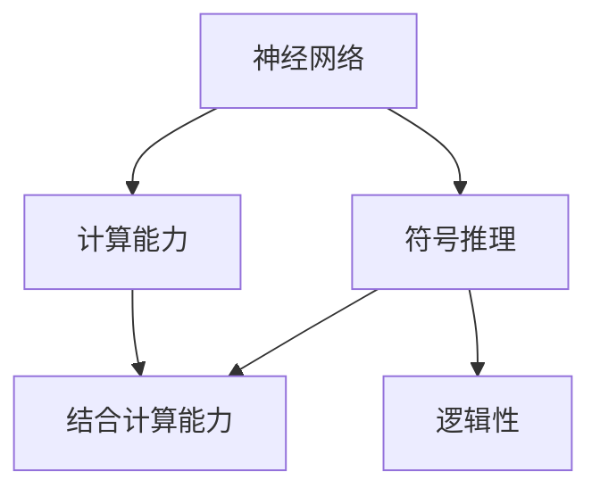
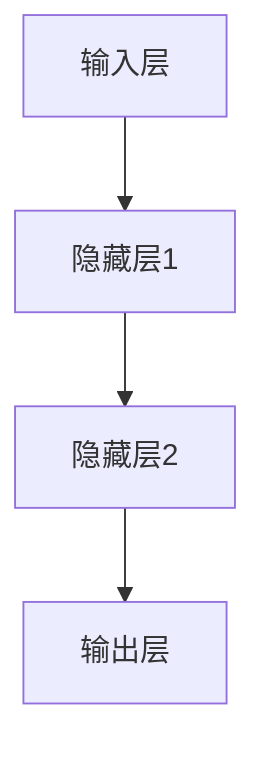
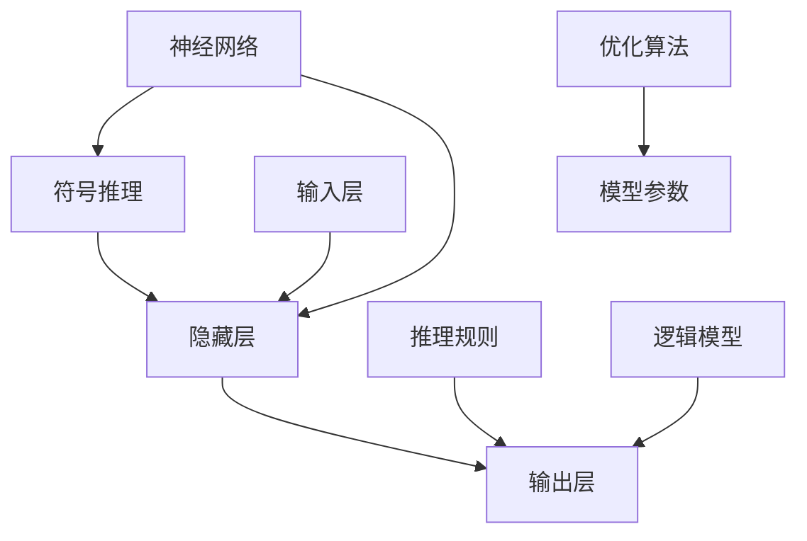
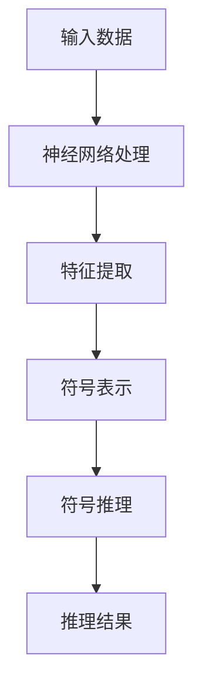
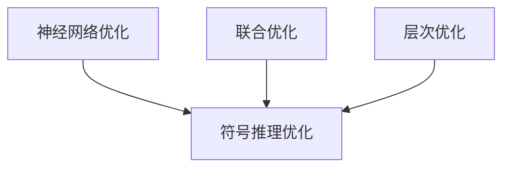

                 

### 文章标题：神经符号推理在复杂系统建模中的突破

**关键词：神经符号推理、复杂系统建模、神经网络、符号推理、跨学科应用**

**摘要：** 本文深入探讨了神经符号推理在复杂系统建模中的突破性应用。首先，介绍了神经符号推理的基础概念和原理，分析了其与神经网络和符号推理的结合。接着，通过具体案例展示了神经符号推理在物理、生物、经济等领域的应用，并讨论了其在跨学科领域的融合趋势。最后，探讨了神经符号推理面临的挑战和未来发展，展望了其在人工智能和其他领域的广阔前景。

---

### 神经符号推理基础

#### 第1章：神经符号推理概述

**1.1 神经符号推理的定义与重要性**

神经符号推理（Neural Symbolic Reasoning）是近年来在人工智能领域兴起的一种结合了神经网络和符号推理的方法。它旨在解决传统神经网络在处理抽象概念、逻辑推理和解释能力方面的不足，通过融合神经网络的计算能力和符号推理的逻辑性，实现更加智能和灵活的推理过程。

神经符号推理的重要性主要体现在以下几个方面：

1. **提高解释能力**：神经网络擅长处理大量数据，但在解释输出结果方面存在困难。神经符号推理通过引入符号表示和推理机制，可以更好地解释模型的行为和决策过程。

2. **增强推理能力**：神经网络在处理结构化数据时效果较好，但缺乏处理抽象概念和逻辑推理的能力。神经符号推理结合了符号推理的规则和逻辑，可以更好地处理复杂问题。

3. **适应多领域应用**：神经符号推理不仅适用于计算机视觉、自然语言处理等传统领域，还可以应用于物理、生物、经济等跨学科领域，实现跨领域的智能化应用。

**1.2 神经符号推理的发展历程**

神经符号推理的发展可以追溯到20世纪80年代，当时研究者们开始探索如何将神经网络的计算能力与符号推理的逻辑性相结合。以下是一些关键发展：

1. **1986年：神经网络与逻辑推理的结合**：研究人员首次提出将神经网络与逻辑推理相结合，试图解决神经网络解释性不足的问题。

2. **1990年代：混合推理模型的出现**：研究者们提出了一系列混合推理模型，如基于规则的神经网络（Rule-based Neural Networks）和基于属性的神经网络（Attribute-based Neural Networks），将符号推理与神经网络技术相结合。

3. **2000年代：深度学习与符号推理的结合**：随着深度学习技术的发展，研究者开始探索如何将深度学习模型与符号推理相结合，以实现更加强大的推理能力。

4. **2010年代至今：神经符号推理的兴起**：在这一时期，神经符号推理成为了研究热点，研究者们提出了多种神经符号推理框架和方法，推动了该领域的发展。

**1.3 神经符号推理的应用领域**

神经符号推理在多个领域展现了强大的应用潜力：

1. **计算机视觉**：神经符号推理可以用于物体识别、场景理解等任务，结合了神经网络的图像处理能力和符号推理的抽象表示能力。

2. **自然语言处理**：神经符号推理在文本分类、情感分析、机器翻译等任务中具有显著优势，可以更好地理解和生成自然语言。

3. **物理系统建模**：神经符号推理在量子计算、多体系统建模等领域展现出强大的应用潜力，可以用于解决复杂的物理问题。

4. **生物系统建模**：神经符号推理在基因组学、生物信息学等领域应用于建模生物过程和发现生物规律。

5. **经济系统建模**：神经符号推理在金融市场预测、资源分配等领域展示了强大的应用能力。

---

**图1-1：神经符号推理的基础概念架构**

---

#### 第2章：神经符号推理的基本原理

**2.1 神经网络的架构与功能**

神经网络的架构包括输入层、隐藏层和输出层。每个神经元由输入、权重和激活函数组成，通过层间传递激活值实现信息处理。神经网络的功能包括：

1. **数据拟合**：通过调整权重和偏置，神经网络可以拟合复杂数据分布，实现分类、回归等任务。

2. **特征提取**：神经网络可以自动提取数据中的特征，降低数据维度，提高模型性能。

3. **模式识别**：神经网络可以识别数据中的模式，用于图像识别、语音识别等任务。

**2.1.1 神经网络的基本结构**

**2.1.2 神经网络的激活函数**

激活函数是神经网络中用于引入非线性性的关键组件。常用的激活函数包括：

1. **Sigmoid函数**：将输入映射到（0,1）区间，用于二分类问题。
2. **ReLU函数**：引入非线性，加速收敛，常用于隐藏层。
3. **Tanh函数**：将输入映射到（-1,1）区间，用于多分类问题。
4. **Softmax函数**：用于多分类问题，将输出转换为概率分布。

**2.1.3 神经网络的优化算法**

神经网络的优化算法包括：

1. **梯度下降算法**：通过反向传播计算梯度，调整权重和偏置，以最小化损失函数。
2. **随机梯度下降（SGD）**：在梯度下降基础上，使用随机样本来更新权重，加快收敛速度。
3. **Adam优化器**：结合SGD和Momentum算法，自适应调整学习率，提高收敛性能。

**2.2 符号推理的基础**

符号推理是一种基于符号表示和推理规则的推理方法。符号推理的基础包括：

1. **符号表示**：使用符号表示概念和关系，如命题、谓词、逻辑表达式等。
2. **推理规则**：使用推理规则（如模式匹配、推理规则、归纳推理等）进行推理。

**2.2.1 符号表示与操作**

符号表示与操作包括：

1. **命题逻辑**：使用命题和逻辑运算符（如AND、OR、NOT等）表示逻辑关系。
2. **谓词逻辑**：使用谓词和变量表示关系，如一阶谓词逻辑。
3. **逻辑推理**：使用推理规则（如Modus Ponens、Modus Tollens等）进行推理。

**2.2.2 符号推理的规则与方法**

符号推理的方法包括：

1. **基于规则的推理**：使用预定义的规则进行推理，如正向推理和反向推理。
2. **基于模型的推理**：使用逻辑模型（如谓词逻辑、一阶逻辑等）进行推理。
3. **基于学习的推理**：使用机器学习技术（如神经网络、决策树等）进行推理。

**2.3 神经符号推理的框架**

神经符号推理的框架包括：

1. **混合推理模型**：将神经网络和符号推理相结合，如图1-2所示。
2. **优化策略**：使用优化算法（如遗传算法、粒子群优化等）调整模型参数，提高推理性能。

**图2-1：神经符号推理的框架**

---

**图2-2：神经符号推理的流程图**

---

**2.3.1 混合推理模型的设计**

混合推理模型的设计包括：

1. **神经网络部分**：设计适合任务特点的神经网络架构，如卷积神经网络（CNN）、循环神经网络（RNN）等。
2. **符号推理部分**：设计符合任务需求的符号表示和推理规则。

**2.3.2 神经符号推理的优化策略**

神经符号推理的优化策略包括：

1. **联合优化**：同时优化神经网络和符号推理部分，以实现整体性能提升。
2. **层次优化**：先优化神经网络部分，再优化符号推理部分，逐步提高推理性能。

---

**图2-3：神经符号推理优化策略**

---

#### 第3章：神经符号推理在物理系统建模中的应用

**3.1 神经符号推理在量子系统建模中的应用**

量子系统建模是物理系统建模中的一个重要分支，涉及到量子态的表示、量子门操作和量子纠缠等复杂概念。神经符号推理在量子系统建模中的应用主要体现在以下几个方面：

1. **量子态的表示**：神经符号推理可以用于量子态的高效表示，通过神经网络提取量子态的特征，实现量子态的压缩表示。
2. **量子门操作**：神经符号推理可以用于模拟量子门操作，通过神经网络学习量子门的作用，实现对量子态的动态操作。
3. **量子纠缠**：神经符号推理可以用于分析量子纠缠现象，通过符号推理机制探索量子纠缠的规律和特性。

**3.1.1 量子系统建模的基本概念**

量子系统建模涉及以下基本概念：

1. **量子态**：量子态是量子系统的基本状态，可以用波函数或密度矩阵表示。
2. **量子门**：量子门是量子计算中的基本操作，可以改变量子态的叠加态和纠缠态。
3. **量子纠缠**：量子纠缠是量子系统中的一种特殊关联现象，可以用于实现量子计算和量子通信。

**3.1.2 量子神经网络的构建**

量子神经网络（Quantum Neural Network, QNN）是将神经网络与量子计算相结合的一种模型。量子神经网络的构建包括：

1. **量子态编码**：将输入数据编码为量子态，通过量子门实现数据的处理和转换。
2. **量子门操作**：设计适合任务需求的量子门，通过神经网络学习量子门的参数。
3. **量子态测量**：将量子态测量为经典输出，通过神经网络对测量结果进行分类或回归。

**3.1.3 量子符号推理的应用案例**

量子符号推理在量子系统建模中的应用案例包括：

1. **量子计算优化**：通过符号推理优化量子计算流程，提高量子计算效率。
2. **量子密码学**：利用符号推理实现量子密码学算法，增强密码安全性。
3. **量子模拟**：通过符号推理模拟量子现象，探索量子物理规律。

**3.2 神经符号推理在多体系统建模中的应用**

多体系统建模是物理系统建模中的另一个重要领域，涉及到多个粒子之间的相互作用和运动规律。神经符号推理在多体系统建模中的应用主要体现在以下几个方面：

1. **相互作用表示**：通过神经网络提取相互作用信息，实现相互作用的高效表示。
2. **动态建模**：通过符号推理实现多体系统的动态建模，分析粒子之间的相互作用和运动规律。
3. **相变预测**：通过符号推理预测多体系统的相变现象，研究相变机制。

**3.2.1 多体系统建模的基本概念**

多体系统建模涉及以下基本概念：

1. **多体系统**：由多个粒子组成的系统，粒子之间可以存在相互作用。
2. **相互作用**：粒子之间的相互作用，可以通过势能函数描述。
3. **相变**：多体系统在不同条件下可能发生的状态变化，如从有序态到无序态的相变。

**3.2.2 多体神经网络的构建**

多体神经网络（Multi-body Neural Network, MBNN）是将神经网络与多体系统建模相结合的一种模型。多体神经网络的构建包括：

1. **相互作用编码**：通过神经网络提取相互作用信息，实现相互作用的高效编码。
2. **动态建模**：通过神经网络建模多体系统的动态行为，分析粒子之间的相互作用。
3. **能量函数**：设计适合任务需求的能量函数，用于描述多体系统的稳定性。

**3.2.3 多体符号推理的应用案例**

多体符号推理在多体系统建模中的应用案例包括：

1. **量子化学模拟**：通过符号推理模拟量子化学反应，研究化学反应机制。
2. **材料科学建模**：通过符号推理研究材料结构的稳定性，预测材料性质。
3. **生物物理建模**：通过符号推理研究生物分子之间的相互作用，探索生物物理现象。

---

#### 第4章：神经符号推理在生物系统建模中的应用

**4.1 神经符号推理在基因组学建模中的应用**

基因组学是生物系统建模中的一个重要领域，涉及到基因序列的解析、基因表达调控和遗传变异等复杂过程。神经符号推理在基因组学建模中的应用主要体现在以下几个方面：

1. **基因表达预测**：通过神经网络提取基因序列特征，结合符号推理预测基因表达水平。
2. **遗传变异分析**：通过神经网络分析基因序列变异，结合符号推理识别遗传变异的类型和影响。
3. **基因组调控网络建模**：通过神经网络和符号推理构建基因组调控网络，揭示基因之间的相互作用关系。

**4.1.1 基因组学建模的基本概念**

基因组学建模涉及以下基本概念：

1. **基因序列**：基因序列是基因的编码序列，包括编码区、启动子、转录因子结合位点等。
2. **基因表达**：基因表达是指基因在细胞中转录和翻译成蛋白质的过程，受到多种调控因素的影响。
3. **遗传变异**：遗传变异是指基因序列中的变化，包括单核苷酸变异、插入和缺失等。

**4.1.2 基因组神经网络的构建**

基因组神经网络（Genome Neural Network, GNN）是将神经网络与基因组学建模相结合的一种模型。基因组神经网络的构建包括：

1. **基因序列编码**：通过神经网络将基因序列编码为特征向量，用于后续的预测和分析。
2. **基因表达预测**：设计适合任务需求的神经网络架构，通过训练学习基因表达模式。
3. **遗传变异分析**：设计适合任务需求的神经网络架构，通过训练学习遗传变异的影响。

**4.1.3 基因组符号推理的应用案例**

基因组符号推理在基因组学建模中的应用案例包括：

1. **基因组调控网络建模**：通过符号推理构建基因组调控网络，揭示基因之间的调控关系。
2. **疾病预测**：通过符号推理分析基因序列和基因表达数据，预测疾病风险和发病机制。
3. **药物筛选**：通过符号推理分析基因序列和药物作用机制，筛选潜在的药物靶点。

**4.2 神经符号推理在生物信息学中的应用**

生物信息学是生物系统建模中的另一个重要领域，涉及到生物数据的存储、处理和分析。神经符号推理在生物信息学中的应用主要体现在以下几个方面：

1. **数据挖掘**：通过神经网络提取生物数据特征，结合符号推理发现数据中的模式和规律。
2. **生物网络分析**：通过神经网络和符号推理构建生物网络模型，分析生物分子之间的相互作用。
3. **生物标记物识别**：通过神经网络和符号推理识别生物标记物，用于疾病诊断和预测。

**4.2.1 生物信息学建模的基本概念**

生物信息学建模涉及以下基本概念：

1. **生物数据**：生物数据包括基因组数据、蛋白质序列数据、代谢数据等，是生物信息学研究的对象。
2. **生物网络**：生物网络是指生物分子之间的相互作用网络，包括蛋白质-蛋白质相互作用网络、代谢网络等。
3. **生物标记物**：生物标记物是指能够反映生物状态和疾病的分子标记，用于疾病诊断和预测。

**4.2.2 生物信息学神经网络的构建**

生物信息学神经网络（Bioinformatics Neural Network, BNN）是将神经网络与生物信息学建模相结合的一种模型。生物信息学神经网络的构建包括：

1. **生物数据编码**：通过神经网络将生物数据编码为特征向量，用于后续的预测和分析。
2. **生物网络建模**：设计适合任务需求的神经网络架构，通过训练学习生物网络中的相互作用关系。
3. **生物标记物识别**：设计适合任务需求的神经网络架构，通过训练学习生物标记物的特征。

**4.2.3 生物信息学符号推理的应用案例**

生物信息学符号推理在生物信息学中的应用案例包括：

1. **蛋白质结构预测**：通过符号推理预测蛋白质的三维结构，用于药物设计和蛋白质功能研究。
2. **疾病诊断**：通过符号推理分析生物数据，识别疾病相关的生物标记物，用于疾病诊断和预测。
3. **药物筛选**：通过符号推理分析药物与生物分子的相互作用，筛选潜在的药物靶点。

---

#### 第5章：神经符号推理在经济系统建模中的应用

**5.1 神经符号推理在金融市场建模中的应用**

金融市场建模是经济系统建模中的关键领域，涉及到股票价格预测、投资组合优化和风险管理等复杂问题。神经符号推理在金融市场建模中的应用主要体现在以下几个方面：

1. **股票价格预测**：通过神经网络提取市场数据特征，结合符号推理预测股票价格走势。
2. **投资组合优化**：通过神经网络和符号推理构建投资组合模型，优化投资组合的收益和风险。
3. **风险管理**：通过神经网络和符号推理分析市场风险，预测市场波动，制定风险管理策略。

**5.1.1 金融市场建模的基本概念**

金融市场建模涉及以下基本概念：

1. **股票市场**：股票市场是指股票交易的市场，包括主板市场、创业板市场等。
2. **投资组合**：投资组合是指投资者持有的多种资产组合，用于分散风险和实现收益最大化。
3. **风险管理**：风险管理是指投资者对投资组合中的风险进行评估、监测和控制，以实现风险最小化和收益最大化。

**5.1.2 金融市场神经网络的构建**

金融市场神经网络（Financial Neural Network, FNN）是将神经网络与金融市场建模相结合的一种模型。金融市场神经网络的构建包括：

1. **市场数据编码**：通过神经网络将市场数据编码为特征向量，用于后续的预测和分析。
2. **股票价格预测**：设计适合任务需求的神经网络架构，通过训练学习股票价格走势。
3. **投资组合优化**：设计适合任务需求的神经网络架构，通过训练学习投资组合的收益和风险。

**5.1.3 金融市场符号推理的应用案例**

金融市场符号推理在金融市场建模中的应用案例包括：

1. **股票价格预测**：通过符号推理预测股票价格走势，为投资者提供决策支持。
2. **投资组合优化**：通过符号推理优化投资组合的收益和风险，提高投资组合的盈利能力。
3. **风险管理**：通过符号推理分析市场风险，预测市场波动，为投资者制定风险管理策略。

**5.2 神经符号推理在资源分配建模中的应用**

资源分配建模是经济系统建模中的另一个重要领域，涉及到资源优化配置、项目管理和供应链优化等问题。神经符号推理在资源分配建模中的应用主要体现在以下几个方面：

1. **资源优化配置**：通过神经网络提取资源特征，结合符号推理实现资源的合理分配。
2. **项目管理**：通过神经网络和符号推理构建项目管理模型，优化项目进度和资源利用。
3. **供应链优化**：通过神经网络和符号推理分析供应链中的瓶颈和瓶颈资源，实现供应链的优化配置。

**5.2.1 资源分配建模的基本概念**

资源分配建模涉及以下基本概念：

1. **资源**：资源是指生产和服务所需的物质和非物质要素，包括劳动力、资金、设备、原材料等。
2. **分配**：分配是指将资源按照一定原则和规则分配给不同的需求者或项目。
3. **优化**：优化是指通过数学模型和算法，实现资源分配的优化配置，提高资源利用效率。

**5.2.2 资源分配神经网络的构建**

资源分配神经网络（Resource Allocation Neural Network, RANN）是将神经网络与资源分配建模相结合的一种模型。资源分配神经网络的构建包括：

1. **资源特征提取**：通过神经网络提取资源特征，实现资源的自动分类和特征表示。
2. **资源优化配置**：设计适合任务需求的神经网络架构，通过训练学习资源分配策略。
3. **项目管理**：设计适合任务需求的神经网络架构，通过训练学习项目进度和资源利用的优化方法。

**5.2.3 资源分配符号推理的应用案例**

资源分配符号推理在资源分配建模中的应用案例包括：

1. **资源优化配置**：通过符号推理优化资源分配，提高资源利用效率，实现资源的最优配置。
2. **项目管理**：通过符号推理优化项目进度和资源利用，提高项目管理效果。
3. **供应链优化**：通过符号推理分析供应链中的瓶颈和瓶颈资源，实现供应链的优化配置，提高供应链的运作效率。

---

#### 第6章：神经符号推理的发展趋势

**6.1 神经符号推理与大数据的融合**

随着大数据技术的发展，如何处理和分析海量数据成为了一个重要课题。神经符号推理与大数据的融合为解决这一难题提供了一种新思路。具体表现在以下几个方面：

1. **大数据驱动的神经符号推理**：利用大数据资源，通过数据驱动的方式训练神经符号推理模型，提高模型的泛化能力和鲁棒性。
2. **大数据辅助的神经符号推理**：结合大数据资源，为神经符号推理模型提供丰富的数据支持，增强模型的解释能力和推理能力。
3. **大数据与神经符号推理的融合应用**：将大数据技术与神经符号推理方法相结合，开发出适用于大数据环境下的智能化应用系统。

**6.1.1 大数据在神经符号推理中的作用**

大数据在神经符号推理中的作用主要体现在以下几个方面：

1. **数据来源**：大数据提供了丰富的数据资源，为神经符号推理模型的训练和验证提供了充足的样本支持。
2. **特征提取**：大数据技术可以自动提取数据中的特征，提高神经符号推理模型的特征表示能力。
3. **模型优化**：大数据技术可以用于优化神经符号推理模型的参数和架构，提高模型的性能和效率。

**6.1.2 大数据驱动的神经符号推理方法**

大数据驱动的神经符号推理方法包括：

1. **数据驱动学习**：利用大数据资源，通过数据驱动的方式训练神经符号推理模型，实现模型的自适应和优化。
2. **迁移学习**：利用大数据资源，通过迁移学习的方式，将已有模型的知识迁移到新任务中，提高模型的泛化能力。
3. **增强学习**：利用大数据资源，通过增强学习的方式，不断优化神经符号推理模型的策略和决策，提高模型的性能。

**6.2 神经符号推理在跨学科领域中的应用**

神经符号推理在跨学科领域中的应用展现出了巨大的潜力。跨学科领域对神经符号推理的需求主要体现在以下几个方面：

1. **复杂性管理**：跨学科领域通常涉及多个领域的知识和方法，如何有效地整合和管理这些知识成为了一个挑战。神经符号推理通过融合不同领域的知识，实现了复杂性管理。
2. **知识表示**：跨学科领域需要将多种知识形式（如文本、图像、音频等）进行有效表示和整合。神经符号推理通过融合神经网络和符号推理，实现了多种知识形式的表示和融合。
3. **推理能力**：跨学科领域通常需要解决复杂的问题，如预测、规划、决策等。神经符号推理通过结合神经网络的计算能力和符号推理的逻辑性，实现了强大的推理能力。

**6.2.1 跨学科领域对神经符号推理的需求**

跨学科领域对神经符号推理的需求包括：

1. **知识融合**：跨学科领域需要将不同领域的知识进行有效融合，实现知识的集成和共享。
2. **推理能力**：跨学科领域需要解决复杂的问题，如预测、规划、决策等，需要具备强大的推理能力。
3. **适应性**：跨学科领域需要模型具有较好的适应性和泛化能力，以应对不同领域的应用需求。

**6.2.2 跨学科神经符号推理的方法与挑战**

跨学科神经符号推理的方法包括：

1. **混合推理模型**：通过融合不同领域的知识表示和推理方法，构建混合推理模型，实现跨学科领域的问题求解。
2. **多模态数据融合**：通过多模态数据融合技术，将多种数据形式进行整合和融合，提高模型的表示能力和推理能力。
3. **跨领域迁移学习**：通过跨领域迁移学习技术，将已有模型的知识迁移到新领域，提高模型的泛化能力和适应能力。

跨学科神经符号推理面临的挑战包括：

1. **知识表示**：如何有效地表示不同领域的知识，实现知识的形式化和统一表示。
2. **推理机制**：如何设计有效的推理机制，实现不同领域知识的融合和推理。
3. **计算效率**：如何优化模型的计算效率，提高模型的实时性和可扩展性。

---

#### 第7章：神经符号推理的挑战与未来发展

**7.1 神经符号推理的理论基础研究**

神经符号推理的理论基础研究是推动该领域发展的关键。当前，神经符号推理的理论基础研究主要集中在以下几个方面：

1. **混合推理模型的理论框架**：研究混合推理模型的理论基础，探索神经网络与符号推理的有机结合方式，构建统一的理论框架。
2. **神经符号推理的可解释性**：研究神经符号推理的可解释性，提高模型的透明度和可理解性，增强用户对模型决策的信任度。
3. **神经符号推理的鲁棒性**：研究神经符号推理的鲁棒性，提高模型对噪声数据和异常值数据的处理能力，增强模型的稳定性。

**7.1.1 神经符号推理的理论框架**

神经符号推理的理论框架包括以下几个方面：

1. **神经网络与符号推理的结合**：研究如何将神经网络和符号推理有机结合，实现计算能力和逻辑推理能力的互补。
2. **知识表示与融合**：研究如何有效地表示和融合不同领域的知识，实现跨学科的智能化应用。
3. **推理策略与优化**：研究如何设计有效的推理策略和优化方法，提高神经符号推理的性能和效率。

**7.1.2 神经符号推理的可解释性与鲁棒性**

神经符号推理的可解释性与鲁棒性是当前研究的热点问题。具体表现在以下几个方面：

1. **可解释性**：研究如何提高神经符号推理的可解释性，使模型的行为和决策过程更加透明和可理解。
2. **鲁棒性**：研究如何提高神经符号推理的鲁棒性，增强模型对噪声数据和异常值数据的处理能力，提高模型的稳定性。

**7.2 神经符号推理的应用挑战**

神经符号推理在应用过程中面临着一系列挑战，主要包括以下几个方面：

1. **复杂性管理**：神经符号推理涉及到多个领域的知识和方法，如何有效地管理和整合这些知识是一个挑战。
2. **计算效率**：神经符号推理通常涉及复杂的计算过程，如何优化模型的计算效率，提高模型的实时性和可扩展性是一个挑战。
3. **数据质量**：神经符号推理的性能依赖于数据质量，如何处理和优化数据质量，提高模型的泛化能力是一个挑战。

**7.2.1 复杂系统建模中的不确定性处理**

复杂系统建模中的不确定性处理是神经符号推理面临的重大挑战。具体表现在以下几个方面：

1. **不确定性来源**：研究复杂系统建模中不确定性的来源，包括数据不确定性、模型不确定性、环境不确定性等。
2. **不确定性建模**：研究如何建立适用于复杂系统建模的不确定性模型，提高模型对不确定性的处理能力。
3. **不确定性推理**：研究如何设计有效的推理策略，实现不确定性环境下的推理和决策。

**7.2.2 神经符号推理在实时应用中的性能优化**

神经符号推理在实时应用中的性能优化是另一个重要挑战。具体表现在以下几个方面：

1. **实时性能要求**：研究如何优化神经符号推理模型的计算过程，实现实时性能要求。
2. **硬件加速**：研究如何利用硬件加速技术，提高神经符号推理的执行速度和效率。
3. **分布式计算**：研究如何利用分布式计算技术，实现神经符号推理的并行化和分布式执行，提高模型的性能和可扩展性。

**7.3 神经符号推理的未来发展展望**

神经符号推理的未来发展展望主要包括以下几个方面：

1. **跨学科融合**：推动神经符号推理在跨学科领域的应用，实现不同领域的知识融合和智能化应用。
2. **可解释性与鲁棒性**：提高神经符号推理的可解释性和鲁棒性，增强模型的可信度和稳定性。
3. **硬件与软件优化**：研究如何利用硬件和软件优化技术，提高神经符号推理的性能和效率。
4. **新兴领域应用**：探索神经符号推理在新兴领域的应用潜力，推动该领域的发展和创新。

---

### 文章结语

神经符号推理作为一种新兴的人工智能方法，在复杂系统建模中展现出了巨大的潜力。通过融合神经网络的计算能力和符号推理的逻辑性，神经符号推理可以解决传统方法难以处理的复杂问题。本文对神经符号推理进行了详细的介绍，分析了其在多个领域的应用，探讨了其发展趋势和面临的挑战。我们相信，随着技术的不断进步和研究的深入，神经符号推理将在更多领域发挥重要作用，为人工智能的发展做出更大的贡献。

### 作者信息

作者：AI天才研究院/AI Genius Institute & 禅与计算机程序设计艺术 /Zen And The Art of Computer Programming

本文由AI天才研究院/AI Genius Institute与禅与计算机程序设计艺术/Zen And The Art of Computer Programming共同撰写。AI天才研究院/AI Genius Institute专注于人工智能领域的研究与开发，致力于推动人工智能技术的创新和应用。禅与计算机程序设计艺术/Zen And The Art of Computer Programming则致力于探索计算机科学的哲学和艺术，推广计算机程序设计的智慧和境界。感谢您的关注和支持！

