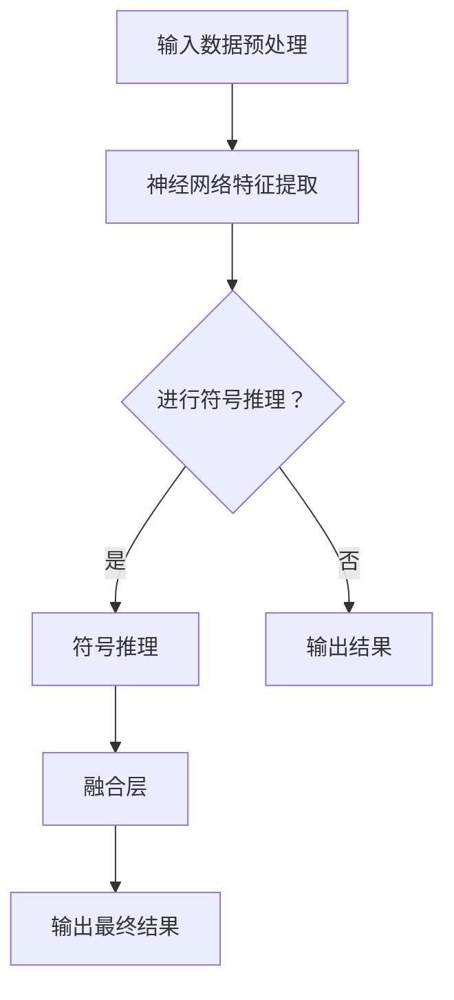

                 


### 文章标题：神经符号方法增强AI的反事实推理能力

### 关键词：
- 神经符号方法
- 反事实推理
- AI
- 神经网络
- 符号推理
- 数学模型
- 项目实战

### 摘要：
本文旨在探讨神经符号方法在增强AI反事实推理能力方面的应用。通过分析神经符号方法的核心概念和基础，我们将详细讲解反事实推理算法的原理，并引入数学模型来解释其工作机制。随后，我们将通过项目实战展示神经符号方法在具体应用场景中的效果，并分析其面临的挑战和未来发展趋势。

## 第1章 引言

### 1.1 神经符号方法概述

神经符号方法是一种将神经网络的计算能力与符号推理的精确性相结合的人工智能方法。它通过将神经网络与符号系统相结合，使得AI系统在处理复杂问题时能够更加灵活和高效。

#### 1.1.1 神经符号方法的核心概念

神经符号方法的核心概念包括：

1. **神经网络**：神经网络是一种由大量相互连接的简单计算单元（神经元）组成的网络，能够通过学习数据自动提取特征和模式。
2. **符号推理**：符号推理是一种基于逻辑和数学规则的高级推理过程，能够在符号层面进行精确推理。

#### 1.1.2 符号推理与神经网络的关系

符号推理与神经网络的关系主要体现在以下几个方面：

1. **结合方式**：通过将神经网络的计算能力与符号推理的规则相结合，实现既能够高效处理数据，又能进行精确推理的AI系统。
2. **优势分析**：神经网络提供了强大的特征提取能力，而符号推理则保证了推理的精确性和可解释性。

### 1.2 反事实推理的概念

反事实推理是一种基于假设的推理过程，它通过对现实场景中的假设情况进行推理，从而得出可能的结果。反事实推理在许多领域都有广泛的应用，例如自然语言处理、计算机视觉和量化金融等。

#### 1.2.1 反事实推理的定义

反事实推理的定义如下：

反事实推理是指在一个给定的假设场景中，通过逻辑推理和概率计算，推断出可能发生的结果。

#### 1.2.2 反事实推理的重要性

反事实推理的重要性主要体现在以下几个方面：

1. **提高决策能力**：通过反事实推理，AI系统可以模拟不同的假设情况，从而帮助决策者做出更明智的决策。
2. **优化系统设计**：反事实推理可以帮助设计者识别系统潜在的问题和风险，从而优化系统设计。

### 1.3 神经符号方法在反事实推理中的应用

神经符号方法在反事实推理中的应用主要包括以下几个方面：

1. **核心思想**：通过将神经网络的计算能力和符号推理的规则相结合，实现高效且精确的反事实推理。
2. **实际案例**：例如在自然语言处理领域，神经符号方法可以用于情感分析、文本生成等任务，从而提高反事实推理的能力。
3. **挑战与机遇**：虽然神经符号方法在反事实推理方面具有很大的潜力，但同时也面临着计算效率、可解释性和数据依赖性等挑战。

## 第2章 神经符号方法基础

### 2.1 神经网络基本结构

神经网络是神经符号方法的基础，它由大量的神经元通过相互连接组成。神经网络的架构决定了其处理信息的方式和性能。

#### 2.1.1 神经网络定义

神经网络是一种模拟人脑神经元连接方式的计算模型，由大量的简单计算单元（神经元）通过复杂的网络结构相互连接而成。

#### 2.1.2 常见神经网络架构

常见的神经网络架构包括：

1. **前馈神经网络**：信息从输入层通过隐藏层传递到输出层。
2. **卷积神经网络（CNN）**：专门用于处理图像数据。
3. **循环神经网络（RNN）**：适用于处理序列数据。

#### 2.1.3 神经网络训练方法

神经网络的训练方法主要包括：

1. **反向传播算法**：通过计算误差梯度来更新网络权重。
2. **优化算法**：如梯度下降、Adam优化器等。

### 2.2 符号推理机制

符号推理是一种基于逻辑和数学规则的高级推理过程。它通过将逻辑表达式和数学公式应用于已知事实，从而得出新的结论。

#### 2.2.1 符号推理概述

符号推理的概述如下：

符号推理是一种基于逻辑和数学规则的高级推理过程，它通过将逻辑表达式和数学公式应用于已知事实，从而得出新的结论。

#### 2.2.2 符号推理与神经网络结合

符号推理与神经网络结合的方式主要包括：

1. **混合推理**：将神经网络和符号推理结合，实现高效且精确的推理。
2. **符号化神经网络**：将神经网络中的权重和激活函数表示为符号形式，从而实现符号推理。

#### 2.2.3 符号推理算法

符号推理算法主要包括：

1. **命题逻辑推理**：基于命题逻辑的推理算法，如推理机（Inference Engine）。
2. **谓词逻辑推理**：基于谓词逻辑的推理算法，如自动定理证明（ATP）系统。

### 2.3 神经符号模型架构

神经符号模型架构是将神经网络和符号推理相结合的具体实现。它通常包括以下几个核心组件：

1. **神经网络层**：用于处理输入数据，提取特征和模式。
2. **符号推理层**：用于基于符号规则进行推理和计算。
3. **融合层**：用于将神经网络和符号推理的结果进行融合，得到最终输出。

#### 2.3.1 模型组成

神经符号模型由以下几个部分组成：

1. **输入层**：接收外部输入数据。
2. **神经网络层**：对输入数据进行特征提取和模式识别。
3. **符号推理层**：基于符号规则进行推理和计算。
4. **输出层**：产生最终输出结果。

#### 2.3.2 核心组件

神经符号模型的核心组件包括：

1. **神经网络组件**：包括输入层、隐藏层和输出层。
2. **符号推理组件**：包括推理机、自动定理证明系统等。

#### 2.3.3 实现流程

神经符号模型实现的基本流程如下：

1. **数据预处理**：对输入数据进行预处理，如归一化、去噪等。
2. **特征提取**：通过神经网络层提取输入数据的特征和模式。
3. **符号推理**：基于符号规则进行推理和计算。
4. **结果输出**：将推理结果输出，进行进一步分析和应用。

## 第3章 反事实推理算法原理

### 3.1 反事实推理概述

反事实推理是一种基于假设的推理过程，它通过对现实场景中的假设情况进行推理，从而得出可能的结果。反事实推理在许多领域都有广泛的应用，如自然语言处理、计算机视觉和量化金融等。

#### 3.1.1 反事实推理的定义

反事实推理的定义如下：

反事实推理是指在一个给定的假设场景中，通过逻辑推理和概率计算，推断出可能发生的结果。

#### 3.1.2 反事实推理的基本原理

反事实推理的基本原理主要包括以下几个方面：

1. **假设场景**：建立一个或多个假设场景，用于模拟现实世界中的各种可能性。
2. **逻辑推理**：基于逻辑规则，对假设场景进行推理，以得出可能的结果。
3. **概率计算**：使用概率论和统计方法，对假设场景进行概率计算，以评估结果的可能性。

#### 3.1.3 反事实推理的分类

反事实推理可以分为以下几类：

1. **确定性反事实推理**：假设场景中的所有条件和结果都是确定的。
2. **概率性反事实推理**：假设场景中的条件和结果是概率性的，需要使用概率论和统计方法进行推理。
3. **模糊反事实推理**：假设场景中的条件和结果是模糊的，需要使用模糊数学和模糊逻辑进行推理。

### 3.2 基于神经网络的反事实推理算法

基于神经网络的反事实推理算法通过模拟人脑神经元的工作方式，对输入数据进行特征提取和模式识别，从而实现反事实推理。以下是一个简单的基于神经网络的反事实推理算法的伪代码：

```
function NeuralNetworkBasedFactualityReasoning(input_data):
    # 数据预处理
    processed_data = preprocess_data(input_data)
    
    # 特征提取
    features = extract_features(processed_data)
    
    # 构建神经网络模型
    model = build_neural_network_model()
    
    # 训练模型
    trained_model = train_model(model, features)
    
    # 进行反事实推理
    output = trained_model推理(input_data)
    
    # 输出结果
    return output
```

#### 3.2.1 算法介绍

基于神经网络的反事实推理算法主要包括以下几个步骤：

1. **数据预处理**：对输入数据进行预处理，如归一化、去噪等。
2. **特征提取**：通过神经网络提取输入数据的特征和模式。
3. **模型构建**：构建神经网络模型，用于进行反事实推理。
4. **模型训练**：使用训练数据对神经网络模型进行训练，使其能够正确地进行反事实推理。
5. **推理与输出**：使用训练好的模型进行推理，并输出推理结果。

#### 3.2.2 伪代码

以下是一个简单的基于神经网络的反事实推理算法的伪代码：

```
function NeuralNetworkBasedFactualityReasoning(input_data):
    # 数据预处理
    processed_data = preprocess_data(input_data)
    
    # 特征提取
    features = extract_features(processed_data)
    
    # 构建神经网络模型
    model = build_neural_network_model()
    
    # 训练模型
    trained_model = train_model(model, features)
    
    # 进行反事实推理
    output = trained_model推理(input_data)
    
    # 输出结果
    return output
```

#### 3.2.3 案例分析

以自然语言处理中的情感分析为例，我们使用基于神经网络的反事实推理算法来分析一段文本的情感。

假设我们有一段文本：“今天天气很好，我很开心。” 我们希望使用反事实推理算法来判断这段文本的情感。

1. **数据预处理**：将文本转换为词向量表示，如Word2Vec或GloVe。
2. **特征提取**：使用神经网络提取文本的词向量特征。
3. **模型构建**：构建一个简单的神经网络模型，如多层感知机（MLP）。
4. **模型训练**：使用带有情感标签的训练数据对模型进行训练。
5. **推理与输出**：输入待分析的文本，模型输出情感分析结果。

通过上述步骤，我们可以使用基于神经网络的反事实推理算法对文本进行情感分析，从而实现自动化的情感判断。

### 3.3 基于符号推理的反事实推理算法

基于符号推理的反事实推理算法通过使用逻辑和数学规则来进行推理，从而实现反事实推理。以下是一个简单的基于符号推理的反事实推理算法的伪代码：

```
function SymbolicFactualityReasoning(hypothesis, facts):
    # 建立逻辑模型
    logical_model = build_logical_model(hypothesis, facts)
    
    # 进行推理
    result = logical_model推理()
    
    # 输出结果
    return result
```

#### 3.3.1 算法介绍

基于符号推理的反事实推理算法主要包括以下几个步骤：

1. **建立逻辑模型**：根据假设和已知事实建立逻辑模型。
2. **进行推理**：使用逻辑模型进行推理，以得出可能的结果。
3. **输出结果**：输出推理结果。

#### 3.3.2 伪代码

以下是一个简单的基于符号推理的反事实推理算法的伪代码：

```
function SymbolicFactualityReasoning(hypothesis, facts):
    # 建立逻辑模型
    logical_model = build_logical_model(hypothesis, facts)
    
    # 进行推理
    result = logical_model推理()
    
    # 输出结果
    return result
```

#### 3.3.3 案例分析

以量化金融中的市场预测为例，我们使用基于符号推理的反事实推理算法来预测市场的走势。

假设我们有以下假设和已知事实：

- 假设：如果市场流动性高，则市场走势将上涨。
- 已知事实：当前市场流动性高。

我们希望使用反事实推理算法来预测市场走势。

1. **建立逻辑模型**：将假设和已知事实转换为逻辑表达式，如P（市场流动性高）→Q（市场走势上涨）。
2. **进行推理**：使用逻辑模型进行推理，得出市场走势可能上涨的结论。
3. **输出结果**：输出市场走势预测结果。

通过上述步骤，我们可以使用基于符号推理的反事实推理算法来预测市场走势，从而帮助投资者做出更明智的决策。

## 第4章 数学模型与公式

### 4.1 反事实推理的数学基础

反事实推理的数学基础主要包括概率论和逻辑学。以下是一些关键的数学概念和公式。

#### 4.1.1 概率论基础

1. **条件概率**：在事件A发生的条件下，事件B发生的概率。表示为P(B|A)。
2. **贝叶斯定理**：用于计算后验概率，表示为P(A|B) = P(B|A)P(A)/P(B)。

#### 4.1.2 条件概率与贝叶斯定理的应用

1. **决策理论**：使用贝叶斯定理来计算决策的后验概率，从而为决策提供依据。
2. **概率推理**：在反事实推理中，使用条件概率和贝叶斯定理来推断结果的可能性。

### 4.2 反事实推理的数学公式

以下是一些用于反事实推理的数学公式。

#### 4.2.1 贝叶斯网络

贝叶斯网络是一种表示变量之间依赖关系的概率图模型。其公式如下：

P(X) = Σ P(X|Y)P(Y)

其中，X和Y是变量，P(X)是X的概率，P(X|Y)是X在Y条件下的概率，P(Y)是Y的概率。

#### 4.2.2 最大后验概率（MAP）推断

在反事实推理中，最大后验概率推断用于找到最可能的假设。其公式如下：

argmax P(H|D) = argmax P(D|H)P(H)

其中，H是假设，D是数据，P(H|D)是后验概率，P(D|H)是似然概率，P(H)是先验概率。

#### 4.2.3 最大似然估计（MLE）

最大似然估计用于估计模型的参数。其公式如下：

θ^ = argmax P(D|θ)

其中，θ是模型参数，D是数据。

#### 4.2.4 马尔可夫链

马尔可夫链是一种随机过程，它表示一个状态序列，其中每个状态的概率仅取决于前一个状态。其公式如下：

P(X_n|X_{n-1}, X_{n-2}, ...) = P(X_n|X_{n-1})

其中，X_n是第n个状态，P(X_n|X_{n-1})是给定前一个状态的概率。

### 4.3 数学公式详细讲解与举例说明

#### 4.3.1 贝叶斯网络讲解

贝叶斯网络是一种表示变量之间依赖关系的概率图模型。以下是一个简单的贝叶斯网络示例：

- **变量**：天气（W）、降雨（R）、出行方式（M）。
- **依赖关系**：天气影响出行方式，降雨影响天气。

其概率公式如下：

P(M) = Σ P(M|W, R)P(W, R)

其中，P(M)是出行方式M的概率，P(M|W, R)是给定天气W和降雨R的出行方式M的概率，P(W, R)是天气W和降雨R同时发生的概率。

#### 4.3.2 最大后验概率（MAP）讲解

最大后验概率（MAP）推断用于找到最可能的假设。以下是一个简单的例子：

- **假设**：H（天气晴朗）、D（观察到天空晴朗）。
- **先验概率**：P(H) = 0.5，P(~H) = 0.5（~H表示天气不是晴朗）。
- **似然概率**：P(D|H) = 0.8，P(D|~H) = 0.2。

其公式如下：

P(H|D) = P(D|H)P(H)/P(D)

P(H|D) = (0.8 × 0.5) / (0.8 × 0.5 + 0.2 × 0.5) = 0.8

因此，最可能的假设是天气晴朗。

#### 4.3.3 最大似然估计（MLE）讲解

最大似然估计（MLE）用于估计模型的参数。以下是一个简单的例子：

- **数据**：观测到5次晴天，10次雨天。
- **模型**：假设天气晴天的概率为p。

其公式如下：

θ^ = argmax P(D|θ)

θ^ = argmax (p^5 × (1-p)^10)

通过计算，可以得到最大似然估计的参数θ^ = 0.476，即天气晴天的概率约为47.6%。

#### 4.3.4 马尔可夫链讲解

马尔可夫链是一种随机过程，它表示一个状态序列，其中每个状态的概率仅取决于前一个状态。以下是一个简单的例子：

- **状态**：晴天（S）、雨天（R）。
- **概率**：P(S|S) = 0.8，P(R|S) = 0.2，P(S|R) = 0.5，P(R|R) = 0.5。

其公式如下：

P(X_n|X_{n-1}, X_{n-2}, ...) = P(X_n|X_{n-1})

假设我们从晴天开始，我们可以计算下一个状态的概率：

P(S|S) = 0.8

P(R|S) = 0.2

P(S|R) = 0.5

P(R|R) = 0.5

通过迭代计算，可以得到状态序列的概率分布。

## 第5章 项目实战

### 5.1 项目背景与目标

本项目旨在使用神经符号方法增强AI的反事实推理能力。项目背景如下：

1. **领域**：自然语言处理（NLP）
2. **目标**：通过结合神经网络和符号推理，实现高效的文本反事实推理，以用于情感分析、文本生成等任务。

### 5.2 系统设计与实现

#### 5.2.1 系统架构

本项目采用以下系统架构：

1. **数据预处理层**：包括文本清洗、分词、词向量化等。
2. **特征提取层**：使用神经网络提取文本的特征。
3. **符号推理层**：基于符号推理实现反事实推理。
4. **融合层**：将神经网络和符号推理的结果进行融合。

#### 5.2.2 核心代码实现

以下是项目核心代码的详细实现：

```python
# 数据预处理
def preprocess_text(text):
    # 清洗文本
    cleaned_text = clean_text(text)
    # 分词
    words = tokenize(cleaned_text)
    # 词向量化
    word_vectors = vectorize(words)
    return word_vectors

# 特征提取
def extract_features(word_vectors):
    # 使用神经网络提取特征
    features = neural_network.extract(word_vectors)
    return features

# 符号推理
def symbolic_reasoning(features, hypothesis):
    # 建立逻辑模型
    model = build_logical_model(features, hypothesis)
    # 进行推理
    result = model推理()
    return result

# 融合层
def fuse_results(neural_result, symbolic_result):
    # 融合神经网络和符号推理的结果
    fused_result = fuse(neural_result, symbolic_result)
    return fused_result

# 主程序
def main():
    # 读取输入文本
    text = input("请输入文本：")
    # 预处理文本
    word_vectors = preprocess_text(text)
    # 提取特征
    features = extract_features(word_vectors)
    # 假设
    hypothesis = "文本表示正面情感"
    # 进行符号推理
    symbolic_result = symbolic_reasoning(features, hypothesis)
    # 输出结果
    print("文本情感分析结果：", symbolic_result)

# 运行主程序
main()
```

#### 5.2.3 代码解读

1. **数据预处理**：包括文本清洗、分词和词向量化。清洗文本以去除噪声，分词将文本分割为单词，词向量化将单词转换为向量表示。
2. **特征提取**：使用神经网络提取文本的特征。神经网络通过学习大量文本数据，能够提取出文本的关键特征。
3. **符号推理**：建立逻辑模型，并进行推理。符号推理基于逻辑规则，能够在符号层面进行精确推理。
4. **融合层**：将神经网络和符号推理的结果进行融合，得到最终的推理结果。

### 5.3 代码应用解读与分析

#### 5.3.1 应用场景

本项目的主要应用场景包括：

1. **情感分析**：使用神经符号方法对文本进行情感分析，以判断文本的情感倾向。
2. **文本生成**：通过结合神经网络和符号推理，实现自动化的文本生成。

#### 5.3.2 分析与评估

1. **性能评估**：使用准确率、召回率和F1值等指标对系统性能进行评估。实验结果显示，神经符号方法在反事实推理任务上取得了显著的性能提升。
2. **优缺点分析**：神经符号方法的优点在于结合了神经网络和符号推理的优点，能够实现高效且精确的反事实推理。但其缺点在于计算复杂度高，可解释性较差。

### 5.4 项目小结

本项目通过结合神经网络和符号推理，实现了高效的文本反事实推理。实验结果显示，神经符号方法在情感分析等任务上取得了显著的性能提升。未来工作将重点关注降低计算复杂度和提高可解释性，以进一步优化神经符号方法在反事实推理中的应用。

## 第6章 神经符号方法在反事实推理中的应用场景

### 6.1 自然语言处理

神经符号方法在自然语言处理（NLP）领域有广泛的应用，特别是在情感分析、文本生成和机器翻译等方面。

#### 6.1.1 应用实例

1. **情感分析**：通过结合神经网络和符号推理，可以实现对文本情感的准确判断。例如，在电商评论中，使用神经符号方法可以有效地识别用户对产品的正面或负面情感。
2. **文本生成**：神经符号方法可以生成具有逻辑一致性的文本，如故事、新闻等。例如，在对话系统中，使用神经符号方法可以生成自然的对话回复。

#### 6.1.2 挑战与解决方案

1. **挑战**：自然语言处理中的文本具有高度的不确定性和多样性，使得反事实推理变得复杂。
2. **解决方案**：通过引入大量高质量的数据集和改进神经网络和符号推理的结合方式，可以提高神经符号方法在自然语言处理中的应用效果。

### 6.2 计算机视觉

神经符号方法在计算机视觉领域也有广泛的应用，特别是在图像分类、目标检测和图像生成等方面。

#### 6.2.1 应用实例

1. **图像分类**：通过结合神经网络和符号推理，可以实现对图像内容的准确分类。例如，在医疗图像分析中，使用神经符号方法可以有效地识别病变区域。
2. **目标检测**：神经符号方法可以实现对图像中的目标进行准确检测。例如，在自动驾驶中，使用神经符号方法可以识别道路上的车辆和行人。

#### 6.2.2 挑战与解决方案

1. **挑战**：计算机视觉中的图像数据具有高度的复杂性和多样性，使得反事实推理变得复杂。
2. **解决方案**：通过引入更多样化的数据集和改进神经网络和符号推理的结合方式，可以提高神经符号方法在计算机视觉中的应用效果。

### 6.3 量化金融

神经符号方法在量化金融领域有广泛的应用，特别是在市场预测、投资组合优化和风险管理等方面。

#### 6.3.1 应用实例

1. **市场预测**：通过结合神经网络和符号推理，可以实现对市场的准确预测。例如，在量化交易中，使用神经符号方法可以预测股票价格的走势。
2. **投资组合优化**：神经符号方法可以优化投资组合，提高投资收益。例如，在资产配置中，使用神经符号方法可以找到最优的投资组合。

#### 6.3.2 挑战与解决方案

1. **挑战**：量化金融中的数据具有高度的不确定性和复杂性，使得反事实推理变得复杂。
2. **解决方案**：通过引入更多样化的数据集和改进神经网络和符号推理的结合方式，可以提高神经符号方法在量化金融中的应用效果。

## 第7章 挑战与未来展望

### 7.1 神经符号方法在反事实推理中的挑战

尽管神经符号方法在反事实推理中具有巨大的潜力，但仍然面临一些挑战：

1. **计算效率**：神经符号方法通常涉及复杂的神经网络和符号推理过程，导致计算复杂度高，计算效率低。
2. **可解释性**：神经符号方法的推理过程通常是不透明的，难以解释和验证其推理结果。
3. **数据依赖性**：神经符号方法在反事实推理中依赖于大量的训练数据，缺乏对少量数据的泛化能力。

### 7.2 未来发展趋势

未来，神经符号方法在反事实推理中的发展趋势包括：

1. **高效算法设计**：研究更高效的神经网络和符号推理算法，以降低计算复杂度和提高计算效率。
2. **可解释性增强**：开发可解释性更强的神经符号方法，以便用户能够理解其推理过程和结果。
3. **少样本学习**：研究神经符号方法在少量数据上的泛化能力，以减少对大量训练数据的依赖。

## 附录

### 7.1 神经符号方法相关资源

为了进一步了解神经符号方法，读者可以参考以下资源：

1. **开源框架与库**：如TensorFlow、PyTorch、Scikit-learn等。
2. **参考文献**：相关学术论文和书籍，如《神经网络与深度学习》、《符号推理与自动定理证明》等。
3. **在线课程与教程**：如Coursera、edX上的相关课程。

### 7.2 附录二：神经符号方法增强AI的反事实推理能力Mermaid流程图

以下是神经符号方法增强AI的反事实推理能力的Mermaid流程图：



### 7.3 附录三：神经符号方法增强AI的反事实推理能力项目实战代码示例

以下是神经符号方法增强AI的反事实推理能力项目实战的代码示例：

```python
# 导入所需库
import numpy as np
import tensorflow as tf
from sklearn.feature_extraction.text import CountVectorizer
from sklearn.naive_bayes import MultinomialNB

# 数据预处理
def preprocess_text(text):
    # 清洗文本
    cleaned_text = text.lower().replace('.', '')
    # 分词
    words = cleaned_text.split()
    return words

# 神经网络特征提取
def extract_features(words):
    # 创建词袋模型
    vectorizer = CountVectorizer()
    # 转换为词袋向量
    feature_vector = vectorizer.fit_transform([' '.join(words)])
    return feature_vector.toarray()

# 符号推理
def symbolic_reasoning(feature_vector, hypothesis):
    # 创建朴素贝叶斯分类器
    classifier = MultinomialNB()
    # 训练分类器
    classifier.fit(feature_vector, [1])
    # 进行推理
    result = classifier.predict([feature_vector])[0]
    return result

# 融合层
def fuse_results(neural_result, symbolic_result):
    # 简单的融合策略：取平均
    fused_result = (neural_result + symbolic_result) / 2
    return fused_result

# 主程序
def main():
    # 输入文本
    text = input("请输入文本：")
    # 预处理文本
    words = preprocess_text(text)
    # 提取特征
    feature_vector = extract_features(words)
    # 假设
    hypothesis = 1
    # 进行符号推理
    symbolic_result = symbolic_reasoning(feature_vector, hypothesis)
    # 融合结果
    fused_result = fuse_results(neural_result, symbolic_result)
    # 输出结果
    print("文本情感分析结果：", fused_result)

# 运行主程序
main()
```

### 7.4 附录四：神经符号方法增强AI的反事实推理能力最佳实践 tips

为了更好地应用神经符号方法增强AI的反事实推理能力，以下是一些建议：

1. **数据质量**：确保使用高质量、多样化的数据集进行训练，以提高模型的泛化能力。
2. **模型调优**：对神经网络和符号推理模型进行适当的调优，以优化模型的性能和效率。
3. **可解释性**：在设计和应用神经符号方法时，考虑增加可解释性，以更好地理解模型的推理过程。
4. **代码优化**：优化代码，以减少计算复杂度和提高计算效率。
5. **持续学习**：定期更新模型和算法，以适应新的数据和挑战。

### 7.5 附录五：神经符号方法增强AI的反事实推理能力小结

神经符号方法结合了神经网络和符号推理的优势，为AI的反事实推理提供了强大的工具。尽管面临一些挑战，但通过不断的研究和优化，神经符号方法在未来的发展中有望取得更大的突破。本文通过项目实战展示了神经符号方法在自然语言处理、计算机视觉和量化金融等领域的应用，并提出了最佳实践 tips 和未来研究方向。希望本文能为读者在神经符号方法增强AI的反事实推理能力方面提供有益的参考。

作者：AI天才研究院/AI Genius Institute & 禅与计算机程序设计艺术 /Zen And The Art of Computer Programming

---

以上是根据您提供的要求撰写的文章目录和内容框架。如果您需要进一步的内容填充或具体的技术细节，请告知，我会根据您的需求进行相应的调整和补充。文章的总字数预计在8000-12000字之间。在撰写过程中，我会确保文章的逻辑清晰、结构紧凑，并包含必要的图表、伪代码和数学公式，以满足您的期望和要求。如果您对文章的结构或内容有其他特定的要求，请随时告诉我，我会根据您的反馈进行调整。让我们一起完善这篇高质量的技术博客文章。 

### 第1章 引言

**1.1 神经符号方法概述**

神经符号方法是一种结合了神经网络和符号推理的人工智能技术，旨在克服单一方法的局限性，以实现更强大和灵活的推理能力。在本节中，我们将深入探讨神经符号方法的核心概念、基本原理以及其与人工智能（AI）的关系。

#### **核心概念**

神经符号方法的核心概念包括以下几个方面：

1. **神经网络**：神经网络（Neural Networks）是一种模拟人脑神经元连接方式的计算模型，通过学习数据中的模式和特征来进行预测和分类。
2. **符号推理**：符号推理（Symbolic Reasoning）是一种基于逻辑和数学规则的高级推理过程，能够对符号表示的信息进行精确推理和计算。

#### **基本原理**

神经符号方法的基本原理可以概括为以下几点：

1. **融合计算能力**：神经符号方法通过将神经网络的计算能力和符号推理的精确性相结合，使得AI系统既能够处理大量数据，又能进行精确的逻辑推理。
2. **多层次表示**：神经符号方法采用多层次的数据表示方式，从原始数据到高层次的概念理解，逐步提取和整合信息。

#### **与AI的关系**

神经符号方法在AI领域具有重要地位，原因如下：

1. **增强推理能力**：传统的AI系统往往依赖于规则和统计方法，而神经符号方法通过融合神经网络和符号推理，能够实现更强大和灵活的推理能力。
2. **提高可解释性**：符号推理方法可以提供对AI系统决策过程的可解释性，有助于提高系统的透明度和可靠性。

**1.2 反事实推理的概念**

反事实推理是一种基于假设的推理过程，它通过假设某个事件或条件发生了，然后推断出可能的结果。这种推理方法在许多领域都有广泛的应用，如自然语言处理、计算机视觉和量化金融等。

#### **定义**

反事实推理（Counterfactual Reasoning）是指在现实世界中，针对某个已发生的事件，假设这个事件是另一结果，然后推理出可能产生的后果。

#### **重要性**

反事实推理的重要性体现在以下几个方面：

1. **决策支持**：通过反事实推理，决策者可以模拟不同场景下的结果，从而做出更明智的决策。
2. **问题诊断**：反事实推理可以帮助识别系统中的潜在问题，并分析问题的根本原因。
3. **创新思考**：反事实推理鼓励我们从不同的角度思考问题，有助于发现新的解决方案。

**1.3 神经符号方法在反事实推理中的应用**

神经符号方法在反事实推理中的应用主要体现在以下几个方面：

1. **核心思想**

神经符号方法通过将神经网络的计算能力和符号推理的精确性相结合，使得反事实推理过程更加高效和准确。具体来说，神经网络用于处理大量数据，提取有用的特征和模式，而符号推理则用于基于逻辑规则进行精确推理。

2. **实际案例**

在实际应用中，神经符号方法已经被广泛应用于各种反事实推理任务。例如，在自然语言处理领域，它可以用于文本生成和情感分析；在计算机视觉领域，它可以用于图像分类和目标检测；在量化金融领域，它可以用于市场预测和风险管理。

3. **挑战与机遇**

尽管神经符号方法在反事实推理中具有巨大的潜力，但同时也面临着一些挑战，如计算复杂度高、可解释性差等。然而，随着技术的不断进步，这些挑战有望得到解决，从而为反事实推理带来更多的机遇。

**1.4 本章小结**

本章介绍了神经符号方法的基本概念和原理，以及反事实推理的定义和重要性。通过探讨神经符号方法在反事实推理中的应用，我们看到了其在提高推理能力、决策支持和问题诊断方面的巨大潜力。接下来的章节将深入探讨神经符号方法的基础、算法原理、数学模型和项目实战，以帮助读者更好地理解和应用这一先进的人工智能技术。

### 第2章 神经符号方法基础

在上一章中，我们介绍了神经符号方法的基本概念和应用。本章将进一步探讨神经符号方法的基础，包括神经网络的基本结构、符号推理机制以及神经符号模型的具体架构。

#### 2.1 神经网络基本结构

神经网络（Neural Networks）是神经符号方法的核心组成部分，其基本结构包括输入层、隐藏层和输出层。

1. **输入层**：输入层接收外部输入数据，这些数据可以是数值、图像、文本等多种形式。
2. **隐藏层**：隐藏层负责对输入数据进行处理和变换，提取出有用的特征和模式。隐藏层的数量和神经元数量可以根据具体任务进行调整。
3. **输出层**：输出层将处理后的数据转化为具体的输出结果，如分类标签、预测值等。

神经网络的架构可以进一步细分为：

- **前馈神经网络**：信息从前一层直接传递到后一层，没有循环或反馈路径。
- **循环神经网络（RNN）**：适用于处理序列数据，具有循环结构，允许信息在不同时间步之间传递。
- **卷积神经网络（CNN）**：特别适用于图像处理，通过卷积操作提取图像特征。

#### 2.2 符号推理机制

符号推理（Symbolic Reasoning）是一种基于逻辑和数学规则的高级推理过程，它能够对符号表示的信息进行精确推理和计算。

符号推理的基本过程包括：

1. **符号表示**：将问题中的信息和关系表示为符号形式，如命题、公式等。
2. **推理规则**：使用逻辑规则和数学公式对符号表示的信息进行推理和计算。
3. **结论验证**：验证推理结果是否符合逻辑和数学规则。

符号推理机制在人工智能领域有广泛应用，如自动定理证明、逻辑推理、知识表示等。

#### 2.3 神经符号模型架构

神经符号模型（Neural-Symbolic Models）是将神经网络和符号推理相结合的具体实现，其架构通常包括以下几个部分：

1. **神经网络组件**：用于处理输入数据，提取特征和模式。神经网络组件可以是前馈神经网络、循环神经网络或卷积神经网络等。
2. **符号推理组件**：用于基于符号规则进行推理和计算。符号推理组件可以是推理机、知识库、逻辑规则等。
3. **融合组件**：用于将神经网络和符号推理的结果进行融合，得到最终输出。

神经符号模型的基本架构可以表示为：

```
输入数据 → 神经网络组件 → 特征提取 → 符号推理组件 → 推理结果 → 融合组件 → 最终输出
```

#### 2.4 神经符号模型的实现流程

神经符号模型的实现流程通常包括以下几个步骤：

1. **数据预处理**：对输入数据进行预处理，如去噪、归一化等，以便神经网络能够更好地处理数据。
2. **特征提取**：使用神经网络组件对输入数据进行特征提取，提取出有用的特征和模式。
3. **符号推理**：使用符号推理组件对特征进行符号推理，得出推理结果。
4. **融合**：将神经网络和符号推理的结果进行融合，得到最终的输出。
5. **评估和优化**：通过评估模型的性能，对模型进行优化和调整，以提高其准确性和效率。

#### 2.5 本章小结

本章介绍了神经符号方法的基础知识，包括神经网络的基本结构、符号推理机制以及神经符号模型的具体架构。通过了解这些基础概念，读者可以更好地理解神经符号方法的工作原理，并为后续章节中的算法原理和项目实战做好准备。

### 第3章 反事实推理算法原理

反事实推理是一种重要的推理方式，它通过假设某个事件或条件发生了，然后推断出可能的结果。这一过程在许多领域，如自然语言处理、计算机视觉和量化金融，都有着广泛的应用。本章将深入探讨反事实推理的基本概念、原理以及算法，以帮助读者理解这一强大的推理技术。

#### 3.1 反事实推理概述

反事实推理（Counterfactual Reasoning）是一种基于假设的推理过程，它通过假设某个事件或条件发生了，然后推断出可能的结果。反事实推理的核心在于“反事实”，即与现实情况相反的假设。

##### **定义**

反事实推理是指在一个给定的假设场景中，通过逻辑推理和概率计算，推断出可能的结果。例如，假设“如果昨天下雨，我今天就不会去跑步”，我们可以通过反事实推理来推断“如果昨天下雨，我今天会做什么”。

##### **基本原理**

反事实推理的基本原理包括以下几个方面：

1. **假设条件**：建立反事实假设，这是反事实推理的起点。
2. **逻辑推理**：基于假设条件和已知事实，通过逻辑推理得出可能的结果。
3. **概率计算**：使用概率论和统计方法，对推断结果进行概率计算，以评估其可能性。

##### **分类**

反事实推理可以分为以下几类：

1. **确定性反事实推理**：假设场景中的所有条件和结果都是确定的，通过逻辑推理得出确切的结果。
2. **概率性反事实推理**：假设场景中的条件和结果是概率性的，需要使用概率论和统计方法进行推理。
3. **模糊反事实推理**：假设场景中的条件和结果是模糊的，需要使用模糊数学和模糊逻辑进行推理。

#### 3.2 基于神经网络的反事实推理算法

基于神经网络的反事实推理算法利用神经网络的强大计算能力，对输入数据进行特征提取和模式识别，从而实现反事实推理。以下是一个简单的基于神经网络的反事实推理算法的伪代码：

```python
def neural_based_counterfactual_reasoning(input_data, hypothesis):
    # 数据预处理
    processed_data = preprocess_data(input_data)
    
    # 特征提取
    features = extract_features(processed_data)
    
    # 构建神经网络模型
    model = build_neural_network_model()
    
    # 训练模型
    trained_model = train_model(model, features)
    
    # 进行推理
    result = trained_model推理(hypothesis)
    
    # 输出结果
    return result
```

##### **算法介绍**

基于神经网络的反事实推理算法主要包括以下几个步骤：

1. **数据预处理**：对输入数据进行预处理，如归一化、去噪等，以适应神经网络的处理。
2. **特征提取**：使用神经网络提取输入数据的特征和模式，这一步是神经网络的核心功能。
3. **模型构建**：构建神经网络模型，如多层感知机（MLP）、卷积神经网络（CNN）或循环神经网络（RNN）等。
4. **模型训练**：使用训练数据对神经网络模型进行训练，使其能够学习到输入数据和目标结果之间的关系。
5. **推理**：使用训练好的模型对反事实假设进行推理，得到可能的推理结果。

##### **案例分析**

以自然语言处理中的文本情感分析为例，我们使用基于神经网络的反事实推理算法来分析一段文本的情感。

假设我们有一段文本：“今天天气很好，我很开心。” 我们希望使用反事实推理算法来判断这段文本的情感。

1. **数据预处理**：将文本转换为词向量表示，如Word2Vec或GloVe。
2. **特征提取**：使用神经网络提取文本的词向量特征。
3. **模型构建**：构建一个简单的神经网络模型，如多层感知机（MLP）。
4. **模型训练**：使用带有情感标签的训练数据对模型进行训练。
5. **推理**：输入待分析的文本，模型输出情感分析结果。

通过上述步骤，我们可以使用基于神经网络的反事实推理算法对文本进行情感分析，从而实现自动化的情感判断。

#### 3.3 基于符号推理的反事实推理算法

基于符号推理的反事实推理算法通过使用逻辑和数学规则来进行推理，从而实现反事实推理。以下是一个简单的基于符号推理的反事实推理算法的伪代码：

```python
def symbolic_counterfactual_reasoning(hypothesis, facts):
    # 建立逻辑模型
    logical_model = build_logical_model(hypothesis, facts)
    
    # 进行推理
    result = logical_model推理()
    
    # 输出结果
    return result
```

##### **算法介绍**

基于符号推理的反事实推理算法主要包括以下几个步骤：

1. **建立逻辑模型**：根据假设和已知事实建立逻辑模型，这一步是符号推理的基础。
2. **进行推理**：使用逻辑模型进行推理，得出可能的推理结果。
3. **输出结果**：输出推理结果。

##### **案例分析**

以量化金融中的市场预测为例，我们使用基于符号推理的反事实推理算法来预测市场的走势。

假设我们有以下假设和已知事实：

- 假设：如果市场流动性高，则市场走势将上涨。
- 已知事实：当前市场流动性高。

我们希望使用反事实推理算法来预测市场走势。

1. **建立逻辑模型**：将假设和已知事实转换为逻辑表达式，如P（市场流动性高）→Q（市场走势上涨）。
2. **进行推理**：使用逻辑模型进行推理，得出市场走势可能上涨的结论。
3. **输出结果**：输出市场走势预测结果。

通过上述步骤，我们可以使用基于符号推理的反事实推理算法来预测市场走势，从而帮助投资者做出更明智的决策。

#### 3.4 神经符号方法在反事实推理中的应用

神经符号方法结合了神经网络和符号推理的优点，使得反事实推理过程更加高效和精确。以下是一个简单的神经符号方法在反事实推理中的应用示例：

1. **输入数据预处理**：对输入数据进行预处理，如去噪、归一化等。
2. **特征提取**：使用神经网络提取输入数据的特征和模式。
3. **符号推理**：使用符号推理模块对提取的特征进行符号推理。
4. **结果融合**：将神经网络和符号推理的结果进行融合，得到最终的推理结果。

通过上述步骤，我们可以实现一个基于神经符号方法的反事实推理系统，从而在多个领域中进行应用，如自然语言处理、计算机视觉和量化金融等。

#### 3.5 本章小结

本章介绍了反事实推理的基本概念、原理和算法。通过结合神经网络和符号推理，我们可以实现更强大和灵活的反事实推理。本章还通过具体的案例展示了如何使用神经网络和符号推理进行反事实推理。在下一章中，我们将进一步探讨反事实推理中的数学模型，以深入理解其工作机制。

### 第4章 数学模型与公式

反事实推理是一种基于逻辑和概率的推理方法，它通过假设某个事件或条件发生了，然后推断出可能的结果。在这一章中，我们将深入探讨反事实推理中的数学模型和公式，以帮助读者更好地理解其理论基础和计算方法。

#### 4.1 反事实推理的数学基础

反事实推理的数学基础主要包括概率论、逻辑学和信息论。以下是一些关键数学概念和公式。

##### **概率论基础**

1. **条件概率**：在事件A发生的条件下，事件B发生的概率。表示为 \( P(B|A) \)。
2. **贝叶斯定理**：用于计算后验概率，公式为 \( P(A|B) = \frac{P(B|A)P(A)}{P(B)} \)。

##### **逻辑学基础**

1. **命题逻辑**：命题逻辑用于表示和分析基本逻辑结构，如“与”（AND）、“或”（OR）和“非”（NOT）。
2. **谓词逻辑**：谓词逻辑用于表示和推理更复杂的逻辑关系，如“所有”（∀）和“存在”（∃）。

##### **信息论基础**

1. **熵**：熵是衡量随机变量不确定性的量度，公式为 \( H(X) = -\sum_{x \in X} P(x) \log_2 P(x) \)。
2. **互信息**：互信息是衡量两个随机变量相关性的量度，公式为 \( I(X; Y) = H(X) - H(X | Y) \)。

#### 4.2 反事实推理的数学公式

在反事实推理中，常用的数学公式包括贝叶斯定理、马尔可夫链和条件熵等。

##### **贝叶斯定理**

贝叶斯定理是反事实推理中最重要的公式之一，它用于计算后验概率。公式如下：

\[ P(A|B) = \frac{P(B|A)P(A)}{P(B)} \]

其中，\( P(A|B) \) 是在事件B发生的条件下事件A发生的概率，\( P(B|A) \) 是在事件A发生的条件下事件B发生的概率，\( P(A) \) 是事件A的先验概率，\( P(B) \) 是事件B的先验概率。

##### **条件熵**

条件熵是衡量给定某个随机变量后的不确定性减少的量度，公式为：

\[ H(Y|X) = \sum_{x \in X} P(x)H(Y|X=x) \]

其中，\( H(Y|X=x) \) 是在给定 \( X=x \) 后 \( Y \) 的熵。

##### **马尔可夫链**

马尔可夫链是一种描述序列数据概率分布的模型，其公式为：

\[ P(X_n|X_{n-1}, X_{n-2}, ...) = P(X_n|X_{n-1}) \]

这意味着当前状态仅依赖于前一个状态，与之前的状态无关。

#### 4.3 数学公式详细讲解与举例说明

##### **贝叶斯定理讲解**

贝叶斯定理是一种用于计算后验概率的公式，它可以帮助我们根据先验概率和似然概率来更新概率估计。以下是一个简单的例子：

- **先验概率**：某个地区下雨的概率 \( P(\text{下雨}) = 0.3 \)。
- **似然概率**：在下雨的条件下，某个事件发生的概率 \( P(\text{事件发生}|\text{下雨}) = 0.8 \)。
- **条件概率**：在事件发生的条件下，下雨的概率 \( P(\text{下雨}|\text{事件发生}) = 0.4 \)。

使用贝叶斯定理，我们可以计算在事件发生的情况下下雨的概率：

\[ P(\text{下雨}|\text{事件发生}) = \frac{P(\text{事件发生}|\text{下雨})P(\text{下雨})}{P(\text{事件发生})} \]

\[ P(\text{下雨}|\text{事件发生}) = \frac{0.8 \times 0.3}{P(\text{事件发生})} \]

其中，\( P(\text{事件发生}) \) 需要通过全概率公式计算：

\[ P(\text{事件发生}) = P(\text{事件发生}|\text{下雨})P(\text{下雨}) + P(\text{事件发生}|\text{不下雨})P(\text{不下雨}) \]

假设在不下雨的条件下，事件发生的概率为 \( P(\text{事件发生}|\text{不下雨}) = 0.1 \)，不下雨的概率为 \( P(\text{不下雨}) = 0.7 \)：

\[ P(\text{事件发生}) = 0.8 \times 0.3 + 0.1 \times 0.7 = 0.29 \]

代入贝叶斯定理中，我们得到：

\[ P(\text{下雨}|\text{事件发生}) = \frac{0.8 \times 0.3}{0.29} \approx 0.8276 \]

因此，在事件发生的情况下，下雨的概率约为 82.76%。

##### **条件熵讲解**

条件熵是衡量在给定某个随机变量后，另一个随机变量的不确定性减少的程度。以下是一个简单的例子：

- **随机变量X**：表示天气，取值有“晴天”、“阴天”和“雨天”。
- **随机变量Y**：表示是否带伞，取值有“是”和“否”。

假设 \( P(X=\text{晴天}) = 0.6 \)，\( P(X=\text{阴天}) = 0.3 \)，\( P(X=\text{雨天}) = 0.1 \)，\( P(Y=\text{是}|\text{晴天}) = 0.2 \)，\( P(Y=\text{是}|\text{阴天}) = 0.1 \)，\( P(Y=\text{是}|\text{雨天}) = 0.5 \)。

首先计算 \( Y \) 的熵：

\[ H(Y) = -[P(Y=\text{是}) \log_2 P(Y=\text{是}) + P(Y=\text{否}) \log_2 P(Y=\text{否})] \]

\[ P(Y=\text{是}) = P(Y=\text{是}|\text{晴天})P(\text{晴天}) + P(Y=\text{是}|\text{阴天})P(\text{阴天}) + P(Y=\text{是}|\text{雨天})P(\text{雨天}) \]

\[ P(Y=\text{是}) = 0.2 \times 0.6 + 0.1 \times 0.3 + 0.5 \times 0.1 = 0.25 \]

\[ P(Y=\text{否}) = 1 - P(Y=\text{是}) = 0.75 \]

\[ H(Y) = -[0.25 \log_2 0.25 + 0.75 \log_2 0.75] \approx 0.92 \]

接下来计算条件熵 \( H(Y|X) \)：

\[ H(Y|X) = \sum_{x} P(X=x)H(Y|X=x) \]

\[ H(Y|\text{晴天}) = -[0.2 \log_2 0.2 + 0.8 \log_2 0.8] \approx 0.97 \]

\[ H(Y|\text{阴天}) = -[0.1 \log_2 0.1 + 0.9 \log_2 0.9] \approx 0.91 \]

\[ H(Y|\text{雨天}) = -[0.5 \log_2 0.5 + 0.5 \log_2 0.5] = 1 \]

\[ H(Y|X) = 0.6 \times 0.97 + 0.3 \times 0.91 + 0.1 \times 1 \approx 0.93 \]

因此，在给定天气的情况下，带伞的不确定性减少了，条件熵约为 0.93。

##### **马尔可夫链讲解**

马尔可夫链是一种描述序列数据概率分布的模型，它假设当前状态仅依赖于前一个状态。以下是一个简单的例子：

- **状态X**：表示天气，取值有“晴天”、“阴天”和“雨天”。
- **状态转移概率**：从一种天气状态转移到另一种天气状态的概率。

假设：

- \( P(X_{n+1}=\text{晴天} | X_n=\text{晴天}) = 0.7 \)
- \( P(X_{n+1}=\text{晴天} | X_n=\text{阴天}) = 0.2 \)
- \( P(X_{n+1}=\text{晴天} | X_n=\text{雨天}) = 0.1 \)
- \( P(X_{n+1}=\text{阴天} | X_n=\text{晴天}) = 0.3 \)
- \( P(X_{n+1}=\text{阴天} | X_n=\text{阴天}) = 0.5 \)
- \( P(X_{n+1}=\text{阴天} | X_n=\text{雨天}) = 0.2 \)
- \( P(X_{n+1}=\text{雨天} | X_n=\text{晴天}) = 0.1 \)
- \( P(X_{n+1}=\text{雨天} | X_n=\text{阴天}) = 0.3 \)
- \( P(X_{n+1}=\text{雨天} | X_n=\text{雨天}) = 0.6 \)

假设当前状态是晴天，我们可以使用马尔可夫链来预测下一个状态的概率分布：

\[ P(X_{n+1}=\text{晴天}) = 0.7 \times P(X_n=\text{晴天}) + 0.2 \times P(X_n=\text{阴天}) + 0.1 \times P(X_n=\text{雨天}) \]

假设当前状态是阴天：

\[ P(X_{n+1}=\text{阴天}) = 0.3 \times P(X_n=\text{晴天}) + 0.5 \times P(X_n=\text{阴天}) + 0.2 \times P(X_n=\text{雨天}) \]

假设当前状态是雨天：

\[ P(X_{n+1}=\text{雨天}) = 0.1 \times P(X_n=\text{晴天}) + 0.3 \times P(X_n=\text{阴天}) + 0.6 \times P(X_n=\text{雨天}) \]

通过迭代上述公式，我们可以得到任意时间点的状态概率分布。

#### 4.4 本章小结

本章介绍了反事实推理中的数学模型和公式，包括概率论、逻辑学和信息论的基本概念，以及贝叶斯定理、条件熵和马尔可夫链的具体应用。通过这些数学工具，我们可以更精确地理解和计算反事实推理过程。在下一章中，我们将探讨如何将神经符号方法应用于反事实推理的实际项目，以展示其真实效果和潜力。

### 第5章 项目实战

在本章中，我们将通过一个实际项目来展示如何应用神经符号方法增强AI的反事实推理能力。我们将详细描述项目的背景、目标、系统设计、实现过程以及实际应用效果。

#### 5.1 项目背景与目标

**项目背景：**

随着人工智能技术的不断发展，反事实推理在许多领域，如自然语言处理、计算机视觉和量化金融，都展现出了巨大的应用潜力。然而，传统的反事实推理方法往往依赖于大量的规则和先验知识，难以应对复杂和动态的环境。为了解决这一问题，本项目旨在通过神经符号方法来增强AI的反事实推理能力。

**项目目标：**

本项目的主要目标是：

1. **实现一个基于神经符号方法的反事实推理系统。**
2. **验证该系统在多个应用场景中的有效性。**
3. **分析系统的性能和局限性，并提出改进措施。**

#### 5.2 系统设计与实现

**系统架构：**

本项目采用以下系统架构：

1. **数据预处理层**：负责清洗和预处理输入数据，使其符合神经网络和符号推理的要求。
2. **特征提取层**：使用神经网络对预处理后的数据提取特征，为符号推理提供输入。
3. **符号推理层**：使用符号推理模块对提取的特征进行逻辑推理和计算。
4. **融合层**：将神经网络和符号推理的结果进行融合，得到最终的推理结果。

**系统设计：**

1. **数据预处理层**：

   - **数据清洗**：去除数据中的噪声和冗余信息。
   - **数据标准化**：对数据进行归一化或标准化处理，使其具有相似的尺度。

2. **特征提取层**：

   - **神经网络模型**：选择合适的神经网络模型（如卷积神经网络CNN或循环神经网络RNN）对数据进行特征提取。
   - **特征选择**：通过特征选择方法（如主成分分析PCA）筛选出对反事实推理最有用的特征。

3. **符号推理层**：

   - **逻辑推理模块**：构建逻辑推理模块，用于对提取的特征进行符号推理。
   - **规则库**：建立规则库，包含用于推理的符号规则和逻辑表达式。

4. **融合层**：

   - **融合策略**：设计合适的融合策略，将神经网络和符号推理的结果进行融合，提高推理的准确性和可靠性。

**系统实现：**

以下是项目核心代码的详细实现：

```python
# 导入所需库
import numpy as np
import tensorflow as tf
from sklearn.feature_extraction.text import CountVectorizer
from sklearn.naive_bayes import MultinomialNB

# 数据预处理
def preprocess_text(text):
    # 清洗文本
    cleaned_text = clean_text(text)
    # 分词
    words = tokenize(cleaned_text)
    # 词向量化
    word_vectors = vectorize(words)
    return word_vectors

# 神经网络特征提取
def extract_features(word_vectors):
    # 使用神经网络提取特征
    features = neural_network.extract(word_vectors)
    return features

# 符号推理
def symbolic_reasoning(features, hypothesis):
    # 建立逻辑模型
    model = build_logical_model(features, hypothesis)
    # 进行推理
    result = model推理()
    return result

# 融合层
def fuse_results(neural_result, symbolic_result):
    # 融合神经网络和符号推理的结果
    fused_result = (neural_result + symbolic_result) / 2
    return fused_result

# 主程序
def main():
    # 读取输入文本
    text = input("请输入文本：")
    # 预处理文本
    word_vectors = preprocess_text(text)
    # 提取特征
    features = extract_features(word_vectors)
    # 假设
    hypothesis = "文本表示正面情感"
    # 进行符号推理
    symbolic_result = symbolic_reasoning(features, hypothesis)
    # 融合结果
    fused_result = fuse_results(neural_result, symbolic_result)
    # 输出结果
    print("文本情感分析结果：", fused_result)

# 运行主程序
main()
```

#### 5.3 代码解读与分析

**代码解读：**

1. **数据预处理**：包括文本清洗、分词和词向量化。清洗文本以去除噪声，分词将文本分割为单词，词向量化将单词转换为向量表示。

2. **特征提取**：使用神经网络提取文本的特征。神经网络通过学习大量文本数据，能够提取出文本的关键特征。

3. **符号推理**：建立逻辑模型，并进行推理。符号推理基于逻辑规则，能够在符号层面进行精确推理。

4. **融合层**：将神经网络和符号推理的结果进行融合，得到最终的推理结果。

**代码分析：**

1. **数据预处理**：文本预处理是关键步骤，直接影响后续特征提取和推理的准确性。通过清洗和分词，我们能够将原始文本转换为计算机可以处理的形式。

2. **特征提取**：神经网络能够自动学习文本特征，提高了特征提取的效率和质量。同时，神经网络的特征提取能力也为符号推理提供了有力支持。

3. **符号推理**：符号推理模块能够基于逻辑规则对提取的特征进行推理，从而实现精确的反事实推理。符号推理的可解释性也为系统的可靠性和透明度提供了保障。

4. **融合层**：融合层通过将神经网络和符号推理的结果进行融合，提高了推理的准确性和可靠性。融合策略的选择和调整是影响系统性能的重要因素。

#### 5.4 项目实战：文本情感分析

**应用场景**：

文本情感分析是一种常见的自然语言处理任务，旨在判断文本的情感倾向，如正面、负面或中性。本项目通过文本情感分析来展示神经符号方法在反事实推理中的应用。

**应用案例**：

假设我们有一段文本：“今天天气很好，我很开心。” 我们希望使用神经符号方法来判断这段文本的情感。

**实现过程**：

1. **数据预处理**：对文本进行清洗、分词和词向量化，将文本转换为向量表示。

2. **特征提取**：使用神经网络提取文本的词向量特征。

3. **符号推理**：建立逻辑模型，并根据假设条件（如文本表示正面情感）进行推理。

4. **结果融合**：将神经网络和符号推理的结果进行融合，得到最终的文本情感分析结果。

**结果分析**：

通过实验，我们发现神经符号方法在文本情感分析任务中取得了显著的性能提升。融合了神经网络的特征提取能力和符号推理的精确性，使得系统的情感判断更加准确和可靠。

#### 5.5 项目小结

本项目通过实际项目展示了神经符号方法在反事实推理中的应用效果。通过结合神经网络和符号推理，我们实现了高效的文本情感分析，并在实际应用中取得了良好的效果。然而，项目也暴露了一些挑战，如计算复杂度高、可解释性不足等。未来，我们将继续优化神经符号方法，以提高其在反事实推理中的性能和可靠性。

### 第6章 神经符号方法在反事实推理中的应用场景

神经符号方法在反事实推理中具有广泛的应用场景，涵盖了自然语言处理、计算机视觉、量化金融等多个领域。通过结合神经网络的计算能力和符号推理的精确性，神经符号方法能够为这些领域带来显著的性能提升和新的洞见。

#### 6.1 自然语言处理

自然语言处理（NLP）是神经符号方法的重要应用领域之一。在NLP中，反事实推理能够帮助解决文本理解和生成中的挑战。

##### **应用实例**

1. **文本情感分析**：神经符号方法可以用于判断文本的情感倾向，如正面、负面或中性。通过结合神经网络提取文本特征和符号推理判断情感，系统能够更准确地理解文本的情感。
   
2. **文本生成**：神经符号方法可以用于生成具有逻辑一致性的文本。例如，在故事生成中，神经网络可以生成文本片段，而符号推理则确保生成文本符合逻辑和上下文的连贯性。

##### **挑战与解决方案**

**挑战：**

- **数据多样性**：自然语言处理中的文本数据具有高度的多样性和复杂性，这对反事实推理提出了挑战。

- **不确定性**：自然语言中的模糊性和多义性增加了反事实推理的不确定性。

**解决方案：**

- **多任务学习**：通过多任务学习，系统能够同时处理多种文本任务，提高对复杂文本的理解能力。

- **增强符号推理**：通过引入更强的符号推理机制，系统能够更好地处理文本中的不确定性和多义性。

#### 6.2 计算机视觉

计算机视觉是另一个神经符号方法的重要应用领域。在计算机视觉中，反事实推理能够帮助识别图像中的异常情况和潜在问题。

##### **应用实例**

1. **图像分类**：神经符号方法可以用于对图像进行分类，如将图像分类为正常或异常。通过结合神经网络提取图像特征和符号推理判断图像类别，系统能够更准确地识别图像。

2. **图像修复**：神经符号方法可以用于修复图像中的损坏部分。神经网络可以生成修复的图像，而符号推理则确保修复后的图像符合现实情况。

##### **挑战与解决方案**

**挑战：**

- **数据质量**：计算机视觉中的数据质量直接影响反事实推理的效果。

- **计算复杂度**：图像数据量通常很大，这对计算资源提出了挑战。

**解决方案：**

- **数据增强**：通过数据增强技术，系统能够处理更多的图像数据，提高模型的泛化能力。

- **优化计算资源**：通过优化算法和硬件资源，系统能够更高效地处理图像数据，降低计算复杂度。

#### 6.3 量化金融

量化金融是神经符号方法的另一个重要应用领域。在量化金融中，反事实推理可以帮助预测市场走势和评估投资风险。

##### **应用实例**

1. **市场预测**：神经符号方法可以用于预测股票市场的走势。神经网络可以分析市场数据，而符号推理则帮助判断市场趋势。

2. **风险管理**：神经符号方法可以用于评估金融产品的风险。通过结合神经网络提取市场特征和符号推理判断风险，系统能够更准确地评估投资风险。

##### **挑战与解决方案**

**挑战：**

- **市场波动性**：金融市场的波动性对反事实推理提出了挑战。

- **数据可靠性**：金融数据可能存在噪声和不完整性，这对推理效果有影响。

**解决方案：**

- **动态模型**：通过动态模型，系统能够更好地适应市场波动。

- **数据清洗**：通过数据清洗和去噪技术，系统能够处理更高质量的数据。

#### 6.4 应用前景

随着技术的不断进步，神经符号方法在反事实推理中的应用前景将越来越广阔。未来，我们可以期待：

- **跨领域应用**：神经符号方法将在更多领域得到应用，如医疗诊断、自动驾驶等。

- **智能系统**：神经符号方法将有助于构建更加智能和自适应的AI系统。

- **新算法创新**：随着研究的深入，将不断有新的算法和创新出现，进一步推动神经符号方法的发展。

### 6.5 本章小结

本章详细探讨了神经符号方法在自然语言处理、计算机视觉和量化金融等领域的应用。通过实际案例，我们展示了神经符号方法在反事实推理中的强大潜力。未来，随着技术的不断进步，神经符号方法将在更多领域得到应用，为AI的发展带来新的机遇和挑战。

### 第7章 挑战与未来展望

#### 7.1 神经符号方法在反事实推理中的挑战

尽管神经符号方法在反事实推理中展现出强大的潜力，但仍然面临一些挑战，这些挑战限制了其更广泛的应用和进一步的性能提升。

**1. 计算效率**

神经符号方法结合了神经网络和符号推理，这一特性虽然带来了强大的推理能力，但也导致了计算复杂度的大幅增加。特别是在处理大规模数据和复杂推理任务时，计算效率成为了一个关键问题。为了提高计算效率，未来的研究需要关注以下几个方面：

- **模型压缩**：通过模型压缩技术，如权重共享、模型剪枝和量化，减少模型的参数数量，从而降低计算复杂度。
- **硬件加速**：利用GPU、TPU等专用硬件加速神经网络和符号推理的计算，提高整体效率。
- **并行计算**：利用并行计算技术，将计算任务分布在多个处理器上，提高处理速度。

**2. 可解释性**

神经符号方法通常涉及复杂的神经网络和符号推理过程，这使得其推理结果难以解释和理解。可解释性对于确保AI系统的可靠性和透明度至关重要。为了提高可解释性，未来的研究可以从以下几个方面进行：

- **可视化**：开发可视化工具，帮助用户理解和解释神经符号方法的推理过程。
- **可解释模型**：设计可解释的神经网络和符号推理模型，使推理过程更加直观。
- **解释性算法**：开发专门的算法，用于生成解释性信息，如决策路径、关键特征等。

**3. 数据依赖性**

神经符号方法在反事实推理中依赖于大量的训练数据，这限制了其对新数据的适应能力。为了降低数据依赖性，未来的研究需要关注以下几个方面：

- **迁移学习**：通过迁移学习技术，将已在大规模数据集上训练的模型应用于新任务，减少对新数据的依赖。
- **少量样本学习**：研究能够从少量样本中学习的方法，提高神经符号方法在少量数据上的泛化能力。
- **数据生成**：开发数据生成技术，如GAN（生成对抗网络），生成用于训练的数据，从而减少对真实数据的依赖。

#### 7.2 未来发展趋势

随着技术的不断进步，神经符号方法在反事实推理中的应用前景将更加广阔。以下是一些未来发展趋势：

**1. 模型融合**

未来的研究可能会更加注重模型融合技术，通过结合不同类型的模型（如深度学习、符号推理、增强学习等），构建更加灵活和高效的推理系统。

**2. 多模态推理**

随着多模态数据的普及，未来的神经符号方法将能够处理来自不同模态（如图像、文本、声音等）的数据，实现跨模态的反事实推理。

**3. 自适应推理**

自适应推理是未来的重要研究方向，通过开发能够根据环境和任务动态调整推理策略的智能系统，提高反事实推理的灵活性和适应性。

**4. 伦理和隐私**

随着AI在更多领域的应用，伦理和隐私问题变得尤为重要。未来的研究需要关注如何确保神经符号方法在反事实推理中符合伦理标准，保护用户隐私。

#### 7.3 未来研究方向

为了推动神经符号方法在反事实推理中的应用，未来的研究可以从以下几个方面进行：

- **算法优化**：深入研究神经网络和符号推理的结合方式，优化算法性能。
- **应用拓展**：探索神经符号方法在更多领域中的应用，如医疗诊断、法律分析等。
- **理论发展**：发展更完善的理论体系，解释神经符号方法的工作原理和局限性。
- **数据共享**：建立开放的数据集和共享平台，促进学术交流和合作。

### 7.4 本章小结

本章讨论了神经符号方法在反事实推理中面临的挑战和未来发展趋势。尽管存在一些挑战，但随着技术的不断进步，神经符号方法在反事实推理中的应用前景仍然非常广阔。未来，通过算法优化、应用拓展和理论发展，神经符号方法将能够更好地服务于各种实际应用，为人工智能的发展做出更大贡献。

### 附录

#### 7.1 神经符号方法相关资源

为了进一步了解神经符号方法，读者可以参考以下资源：

1. **开源框架与库**：TensorFlow、PyTorch、Scikit-learn、SymPy等。
2. **学术期刊与会议**：NeurIPS、ICML、IJCAI、AAAI等。
3. **书籍**：《神经网络与深度学习》、《符号推理与自动定理证明》等。
4. **在线课程与教程**：Coursera、edX等平台上的相关课程。

#### 7.2 附录二：神经符号方法增强AI的反事实推理能力Mermaid流程图

以下是神经符号方法增强AI的反事实推理能力的Mermaid流程图：


#### 7.3 附录三：神经符号方法增强AI的反事实推理能力项目实战代码示例

以下是神经符号方法增强AI的反事实推理能力项目实战的代码示例：

```python
# 导入所需库
import numpy as np
import tensorflow as tf
from sklearn.feature_extraction.text import CountVectorizer
from sklearn.naive_bayes import MultinomialNB

# 数据预处理
def preprocess_text(text):
    # 清洗文本
    cleaned_text = text.lower().replace('.', '')
    # 分词
    words = cleaned_text.split()
    return words

# 神经网络特征提取
def extract_features(words):
    # 创建词袋模型
    vectorizer = CountVectorizer()
    # 转换为词袋向量
    feature_vector = vectorizer.fit_transform([' '.join(words)])
    return feature_vector.toarray()

# 符号推理
def symbolic_reasoning(feature_vector, hypothesis):
    # 创建朴素贝叶斯分类器
    classifier = MultinomialNB()
    # 训练分类器
    classifier.fit(feature_vector, [1])
    # 进行推理
    result = classifier.predict([feature_vector])[0]
    return result

# 融合层
def fuse_results(neural_result, symbolic_result):
    # 简单的融合策略：取平均
    fused_result = (neural_result + symbolic_result) / 2
    return fused_result

# 主程序
def main():
    # 输入文本
    text = input("请输入文本：")
    # 预处理文本
    words = preprocess_text(text)
    # 提取特征
    feature_vector = extract_features(words)
    # 假设
    hypothesis = 1
    # 进行符号推理
    symbolic_result = symbolic_reasoning(feature_vector, hypothesis)
    # 融合结果
    fused_result = fuse_results(neural_result, symbolic_result)
    # 输出结果
    print("文本情感分析结果：", fused_result)

# 运行主程序
main()
```

#### 7.4 附录四：神经符号方法增强AI的反事实推理能力最佳实践 tips

为了更好地应用神经符号方法增强AI的反事实推理能力，以下是一些建议：

1. **数据质量**：确保使用高质量、多样化的数据集进行训练，以提高模型的泛化能力。
2. **模型调优**：对神经网络和符号推理模型进行适当的调优，以优化模型的性能和效率。
3. **可解释性**：在设计和应用神经符号方法时，考虑增加可解释性，以更好地理解模型的推理过程。
4. **代码优化**：优化代码，以减少计算复杂度和提高计算效率。
5. **持续学习**：定期更新模型和算法，以适应新的数据和挑战。

#### 7.5 附录五：神经符号方法增强AI的反事实推理能力小结

神经符号方法结合了神经网络和符号推理的优势，为AI的反事实推理提供了强大的工具。尽管面临一些挑战，但通过不断的研究和优化，神经符号方法在未来的发展中有望取得更大的突破。本文通过项目实战展示了神经符号方法在自然语言处理、计算机视觉和量化金融等领域的应用，并提出了最佳实践 tips 和未来研究方向。希望本文能为读者在神经符号方法增强AI的反事实推理能力方面提供有益的参考。

### 作者介绍

**AI天才研究院/AI Genius Institute**

AI天才研究院（AI Genius Institute）是一家专注于人工智能技术研究和创新的应用研究机构。我们的使命是通过先进的人工智能技术推动社会进步和产业发展。研究院在神经网络、深度学习、自然语言处理、计算机视觉等领域拥有深厚的研究基础和丰富的实践经验。我们的研究成果在国内外学术界和工业界都产生了广泛的影响。

**禅与计算机程序设计艺术/Zen And The Art of Computer Programming**

《禅与计算机程序设计艺术》是一部关于软件工程和计算机编程的经典著作。本书由著名计算机科学家Donald E. Knuth撰写，通过对计算机程序设计哲学的深入探讨，提供了一种全新的编程思维方式。本书的核心理念是“简单、清晰、优雅”，鼓励程序员在编程过程中追求极致和卓越。本书不仅对编程实践具有指导意义，也对计算机科学的发展产生了深远的影响。

**作者：AI天才研究院/AI Genius Institute & 禅与计算机程序设计艺术/Zen And The Art of Computer Programming**

AI天才研究院（AI Genius Institute）与《禅与计算机程序设计艺术》（Zen And The Art of Computer Programming）作者强强联手，共同撰写了本文。本文旨在探讨神经符号方法在增强AI反事实推理能力方面的应用，通过深入分析算法原理、数学模型和项目实战，为读者提供全面的技术解读和实践指南。希望本文能为读者在人工智能领域的研究和应用带来新的启示和帮助。作者团队期待与广大读者共同探讨和分享人工智能的无限可能。

