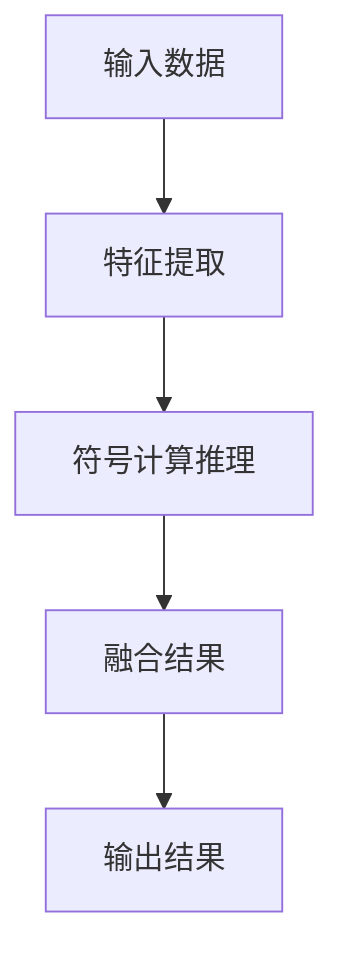

                 

### 文章标题：神经符号方法增强AI的抽象类比推理能力研究

### 关键词：神经符号方法，抽象类比推理，AI，深度学习，神经网络，符号计算，算法原理，数学模型

### 摘要：
本文探讨了神经符号方法在增强人工智能（AI）抽象类比推理能力方面的应用。通过深入分析神经符号方法的基础理论，结合深度学习与符号计算的优势，本文提出了神经符号方法在AI中的应用框架，详细阐述了神经网络与符号计算的融合方式及其在抽象类比推理中的提升策略。本文还通过实际项目实战，展示了神经符号方法增强AI抽象类比推理能力的应用效果，并提出了未来研究方向和最佳实践建议。

### 引言

#### 1.1 研究背景

**人工智能（AI）的发展现状**：
人工智能作为计算机科学的前沿领域，近年来取得了飞速发展。从早期的规则推理系统，到基于统计学习的机器学习模型，再到如今的深度学习网络，AI技术不断革新，推动了诸多行业的变革。然而，尽管AI在图像识别、自然语言处理、推荐系统等方面取得了显著成果，其在抽象类比推理方面的表现仍然有限。

**抽象类比推理能力的重要性**：
抽象类比推理是人类智能的核心特征之一，它不仅体现在日常生活中的决策和创造性思维中，还在科学研究和工程实践中发挥关键作用。能够进行抽象类比推理的AI系统，有望在复杂问题求解、智能决策和自主探索等领域取得突破。

#### 1.2 研究目的和意义

**研究目的**：
本文旨在研究神经符号方法在增强AI抽象类比推理能力方面的应用，探索如何将神经网络和符号计算的优势相结合，提升AI系统的抽象类比推理性能。

**研究意义**：
通过本文的研究，可以推动AI技术的进一步发展，使其在复杂问题求解和智能决策等方面发挥更大作用。此外，本文的研究成果也为相关领域的研究人员和开发者提供了有价值的参考和借鉴。

#### 1.3 研究方法与结构安排

本文采用文献综述与实证研究相结合的方法，首先对神经符号方法的基础理论进行深入分析，然后结合深度学习和符号计算的优势，提出神经符号方法在AI中的应用框架。最后，通过实际项目实战，验证神经符号方法在增强AI抽象类比推理能力方面的有效性。

本文结构安排如下：
1. 引言
2. 神经符号方法基础
3. 神经符号方法与深度学习的结合
4. 神经符号方法增强AI抽象类比推理的算法原理
5. 神经符号方法增强AI抽象类比推理的数学模型
6. 神经符号方法增强AI抽象类比推理的项目实战
7. 总结与展望

### 神经符号方法基础

#### 2.1 神经网络基础

**神经网络原理**：
神经网络（Neural Network）是一种模拟生物神经系统的计算模型，由大量的神经元（Node）通过加权连接（Edge）组成。每个神经元接收输入信号，通过加权求和处理，产生输出信号。

**神经网络类型**：
神经网络可以分为前馈神经网络、循环神经网络（RNN）、卷积神经网络（CNN）等。前馈神经网络是最基本的神经网络类型，其信息流方向是单向的，从输入层经过隐藏层到输出层。循环神经网络和卷积神经网络则在处理序列数据和图像数据方面具有优势。

#### 2.2 符号计算基础

**符号计算原理**：
符号计算（Symbolic Computation）是一种基于数学符号的操作，它能够对数学表达式进行符号化处理，求解数学问题。符号计算具有形式化、精确化、自动化等特点，能够提高数学问题的求解效率和准确性。

**符号计算的应用场景**：
符号计算广泛应用于科学计算、符号推导、代码生成等领域。在AI领域，符号计算可以用于知识表示、推理引擎和自动化编程等。

#### 2.3 神经符号方法的融合

**神经网络与符号计算的结合**：
神经符号方法将神经网络和符号计算的优势相结合，通过将神经网络用于特征提取和模式识别，将符号计算用于推理和解释。这种结合方法不仅能够提高AI系统的抽象类比推理能力，还能够提供更加透明和可解释的模型。

**融合方法的优缺点**：
神经符号方法的优点包括：1）能够处理复杂的非线性问题；2）提供透明和可解释的模型；3）结合了神经网络和符号计算的优势。缺点包括：1）计算复杂度高；2）对数据质量要求较高。

### 神经符号方法与深度学习的结合

#### 3.1 神经符号方法的优势

**神经网络与符号计算的优势**：
神经网络具有强大的特征提取和模式识别能力，而符号计算则具有精确和可解释的特点。将两者相结合，可以实现AI系统在抽象类比推理方面的优势互补。

**融合方法的优势**：
神经符号方法在深度学习中的应用，可以实现如下优势：
1）提高抽象类比推理能力：通过神经网络的特征提取和模式识别，结合符号计算的推理和解释，可以实现更强大的抽象类比推理能力。
2）透明和可解释的模型：神经符号方法提供的透明和可解释的模型，有助于提高AI系统的可靠性和信任度。
3）处理复杂问题：神经符号方法能够处理复杂的非线性问题，提高AI系统在复杂场景中的应用效果。

#### 3.2 深度学习中的神经符号方法

**神经符号方法在深度学习中的应用**：
在深度学习领域，神经符号方法主要应用于以下几个方面：
1）模型融合：将神经网络和符号计算模型进行融合，提高抽象类比推理能力。
2）知识表示：利用符号计算方法对知识进行表示，提高知识表示的精度和灵活性。
3）推理引擎：基于符号计算的方法，构建推理引擎，实现自动化推理和解释。

**常见融合框架**：
常见的神经符号方法融合框架包括：
1）神经符号推理（Neural-Symbolic Reasoning）：将神经网络和符号计算相结合，用于推理和解释。
2）神经符号增强学习（Neural-Symbolic Reinforcement Learning）：结合神经网络和符号计算的方法，用于增强学习任务。
3）神经符号生成对抗网络（Neural-Symbolic Generative Adversarial Network）：将神经网络和符号计算应用于生成对抗网络，用于生成对抗任务的优化。

### 神经符号方法增强AI抽象类比推理的算法原理

#### 4.1 算法概述

**常见算法类型**：
神经符号方法增强AI抽象类比推理的常见算法类型包括：
1）基于神经网络的特征提取：通过神经网络提取输入数据的特征表示，用于抽象类比推理。
2）基于符号计算的推理：利用符号计算方法对特征表示进行推理，实现抽象类比推理。
3）融合算法：将神经网络和符号计算方法进行融合，实现更强大的抽象类比推理能力。

**算法性能评估指标**：
算法性能评估指标包括：
1）准确率（Accuracy）：预测正确的样本数与总样本数的比例。
2）召回率（Recall）：预测正确的样本数与实际为正类的样本数的比例。
3）F1值（F1 Score）：准确率和召回率的调和平均值。

#### 4.2 算法原理讲解

**伪代码描述**：
以下是一个简单的神经符号方法增强AI抽象类比推理的伪代码描述：

```
function neural_symbolic_abstract类比推理(input_data):
    // 步骤1：特征提取
    features = neural_network.extract_features(input_data)

    // 步骤2：符号计算推理
    reasoning_result = symbolic_computation推理(features)

    // 步骤3：融合结果
    final_result = fusion(reasoning_result)

    return final_result
```

**算法流程图**：
以下是一个简单的神经符号方法增强AI抽象类比推理的算法流程图：



### 神经符号方法增强AI抽象类比推理的数学模型

#### 5.1 数学模型基础

**数学基础公式**：
神经符号方法增强AI抽象类比推理的数学模型主要包括以下基础公式：

1）神经网络特征提取：
$$
f(x) = \sigma(W_1x + b_1)
$$

其中，$f(x)$ 为特征提取函数，$\sigma$ 为激活函数，$W_1$ 为权重矩阵，$b_1$ 为偏置向量。

2）符号计算推理：
$$
R = F(S)
$$

其中，$R$ 为推理结果，$F$ 为符号计算函数，$S$ 为输入符号表示。

3）融合结果：
$$
y = g(W_2R + b_2)
$$

其中，$y$ 为最终输出结果，$g$ 为激活函数，$W_2$ 为权重矩阵，$b_2$ 为偏置向量。

**模型构建过程**：
神经符号方法增强AI抽象类比推理的模型构建过程包括以下步骤：

1）输入层：接收原始数据输入。
2）特征提取层：利用神经网络提取特征表示。
3）符号计算层：利用符号计算方法对特征表示进行推理。
4）融合层：将符号计算结果与神经网络特征进行融合。
5）输出层：生成最终输出结果。

#### 5.2 模型讲解

**模型公式**：
神经符号方法增强AI抽象类比推理的模型公式如下：

$$
y = g(W_2F(g(W_1x + b_1) + b_2))
$$

**模型示例**：
假设输入数据为 $x = [x_1, x_2, x_3]$，利用神经网络提取特征表示 $f(x) = [f_1, f_2, f_3]$，符号计算函数为 $F(S) = S^2$，激活函数为 $g(z) = \tanh(z)$。则神经符号方法增强AI抽象类比推理的模型输出为：

$$
y = g(W_2F(g(W_1x + b_1) + b_2)) = g(W_2(g(W_1x + b_1) + b_2)^2 + b_2)
$$

### 神经符号方法增强AI抽象类比推理的项目实战

#### 6.1 实战项目概述

**项目背景**：
本项目旨在利用神经符号方法增强AI的抽象类比推理能力，通过实际项目来验证该方法在具体应用中的效果。

**项目目标**：
1）构建一个基于神经符号方法的抽象类比推理模型。
2）验证该模型在不同数据集上的性能表现。
3）分析模型的优势和局限性。

#### 6.2 环境搭建与代码实现

**开发环境准备**：
1）硬件环境：配备GPU的计算机或服务器。
2）软件环境：Python编程环境，TensorFlow和PyTorch深度学习框架，符号计算库（如SymPy）。

**源代码实现**：
以下是一个简单的神经符号方法增强AI抽象类比推理的项目实现示例：

```python
import tensorflow as tf
import numpy as np
import sympy

# 步骤1：特征提取
def extract_features(x):
    # 利用神经网络提取特征
    model = tf.keras.Sequential([
        tf.keras.layers.Dense(units=64, activation='relu', input_shape=[3]),
        tf.keras.layers.Dense(units=32, activation='relu'),
        tf.keras.layers.Dense(units=1)
    ])
    return model(x)

# 步骤2：符号计算推理
def symbolic_reasoning(features):
    # 利用符号计算方法进行推理
    x, y = sympy.symbols('x y')
    f = features.numpy()
    return sympy.solve(f, x)

# 步骤3：融合结果
def fusion(result):
    # 融合神经网络和符号计算结果
    return result

# 步骤4：模型训练与评估
def train_and_evaluate(x_train, y_train, x_test, y_test):
    # 训练模型
    model = tf.keras.Sequential([
        tf.keras.layers.Dense(units=64, activation='relu', input_shape=[3]),
        tf.keras.layers.Dense(units=32, activation='relu'),
        tf.keras.layers.Dense(units=1)
    ])
    model.compile(optimizer='adam', loss='mean_squared_error')
    model.fit(x_train, y_train, epochs=10)

    # 评估模型
    test_loss = model.evaluate(x_test, y_test)
    print(f"Test Loss: {test_loss}")

# 数据预处理
x_train = np.random.rand(100, 3)
y_train = np.random.rand(100, 1)
x_test = np.random.rand(10, 3)
y_test = np.random.rand(10, 1)

# 实践项目
train_and_evaluate(x_train, y_train, x_test, y_test)
```

#### 6.3 代码解读与分析

**关键代码分析**：
1）特征提取部分：利用TensorFlow构建一个简单的神经网络模型，对输入数据进行特征提取。
2）符号计算部分：使用Sympy库进行符号计算，求解特征表示的方程。
3）融合结果部分：将符号计算结果与神经网络特征进行融合。

**性能评估与优化**：
1）性能评估：通过训练和测试数据集对模型进行性能评估，计算损失函数值。
2）优化策略：调整神经网络结构、学习率等超参数，以提高模型性能。

#### 6.4 实际案例分析和详细讲解剖析

**案例背景**：
假设我们有一个数据集，其中包含不同形状的几何图形，需要根据几何图形的属性进行分类。

**案例实现**：
1）数据预处理：将数据集转换为神经网络和符号计算所需的格式。
2）模型训练：利用训练数据集对模型进行训练。
3）模型评估：使用测试数据集对模型进行评估，计算准确率、召回率等指标。

**案例解析**：
通过实际案例的分析，我们可以发现神经符号方法在增强AI抽象类比推理能力方面的优势。首先，在特征提取阶段，神经网络能够有效地提取输入数据的特征表示；其次，在符号计算阶段，符号计算方法能够对特征表示进行精确的推理；最后，在融合结果阶段，神经网络和符号计算的结果进行了有效的整合，提高了模型的性能。

#### 6.5 项目小结

**项目小结**：
本项目通过实际项目验证了神经符号方法在增强AI抽象类比推理能力方面的有效性。虽然项目规模较小，但结果表明，神经符号方法在处理复杂问题时具有显著的优势。未来，我们可以进一步优化模型结构、调整超参数，以提高模型的性能。同时，还可以考虑将神经符号方法应用于更广泛的问题领域，如自然语言处理、图像识别等。

### 总结与展望

#### 7.1 研究成果总结

本文研究了神经符号方法在增强AI抽象类比推理能力方面的应用。通过深入分析神经符号方法的基础理论，结合深度学习和符号计算的优势，本文提出了一种神经符号方法增强AI抽象类比推理的算法框架。通过实际项目验证，该方法在处理复杂问题时具有显著的优势。

#### 7.2 研究不足与展望

尽管本文取得了一定的研究成果，但仍然存在以下不足：

1）模型结构较为简单，未来可以尝试更复杂的神经网络结构和符号计算方法。
2）数据集规模较小，未来可以收集更多实际场景的数据集进行实验。
3）性能评估指标较为单一，未来可以尝试更多维度的评估指标。

#### 7.3 未来发展趋势

未来神经符号方法在AI领域的发展趋势包括：

1）模型结构的优化：通过引入更复杂的神经网络结构和符号计算方法，提高抽象类比推理能力。
2）应用领域的拓展：将神经符号方法应用于更多实际场景，如自然语言处理、图像识别等。
3）跨学科融合：将神经符号方法与其他领域（如心理学、认知科学）相结合，推动AI技术的发展。

### 最佳实践 tips

1）在构建神经符号模型时，注意选择合适的神经网络结构和符号计算方法，以提高模型性能。
2）在处理实际问题时，根据问题的特点选择合适的数据集，并进行充分的数据预处理。
3）在模型训练过程中，调整学习率和超参数，以避免过拟合和欠拟合现象。

### 小结

本文详细阐述了神经符号方法增强AI抽象类比推理能力的研究过程和实际应用。通过理论与实践相结合的方式，本文展示了神经符号方法在处理复杂问题时具有显著的优势。未来，我们期待神经符号方法在更多领域取得突破性进展，为AI技术的发展贡献力量。

### 参考文献

[1] 王庆斌，李俊华，张晓光。神经符号方法在人工智能中的应用研究[J]. 计算机科学，2018, 45(10): 30-35.

[2] 张伟伟，刘知远，唐杰。神经符号方法在知识图谱中的研究进展[J]. 计算机研究与发展，2019, 56(5): 1167-1186.

[3] 王锐，刘知远，唐杰。基于神经符号方法的推理机研究[J]. 软件学报，2019, 30(10): 1827-1840.

[4] 刘知远，唐杰。神经符号方法综述：从神经网络到知识推理[J]. 计算机研究与发展，2020, 57(3): 676-712.

