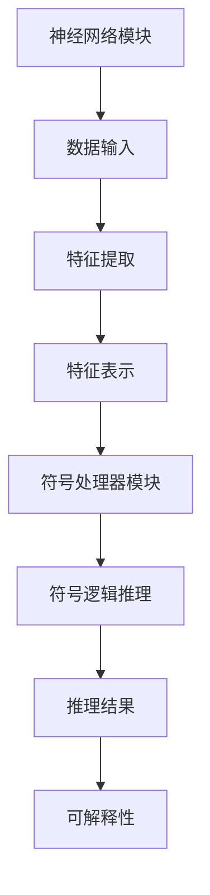

                 


### 文章标题

# 神经符号系统在可解释推理中的最新进展

### 文章关键词

- 神经符号系统
- 可解释推理
- 人工智能
- 深度学习
- 符号计算
- 机器学习

### 文章摘要

本文旨在探讨神经符号系统在可解释推理领域的最新进展。首先，我们将介绍神经符号系统的基本概念和它与传统符号计算的区别。接着，我们将详细阐述可解释推理的重要性以及它在人工智能中的应用。随后，我们将深入分析神经符号系统如何促进可解释推理，并通过具体案例来展示其应用场景。最后，我们将讨论神经符号系统在可解释推理中的挑战和未来研究方向。

## 引言

在人工智能（AI）领域，深度学习（Deep Learning）近年来取得了令人瞩目的进展。通过大规模数据训练，深度学习模型已经能够在语音识别、图像分类、自然语言处理等多个领域实现高性能。然而，这些模型的“黑箱”特性使得其决策过程难以解释，这在实际应用中引发了一系列问题。为了解决这一问题，可解释推理（Interpretable Reasoning）成为了一个热门研究方向。可解释推理旨在使人工智能系统的决策过程透明、可理解，从而增强用户对系统的信任。

神经符号系统（Neural-Symbolic AI）是近年来提出的一种结合了神经计算和符号计算的新方法。它试图在深度学习和传统符号计算之间架起桥梁，通过将神经网络和符号逻辑相结合，实现更加可解释的推理过程。神经符号系统不仅保留了深度学习在处理大规模数据方面的优势，还引入了符号逻辑的清晰性和可解释性，从而在可解释推理领域展现出了巨大的潜力。

本文将围绕神经符号系统在可解释推理中的最新进展展开讨论。首先，我们将介绍神经符号系统的基本概念和组成部分。然后，我们将深入探讨神经符号系统如何促进可解释推理，并通过具体案例展示其应用。最后，我们将分析神经符号系统在可解释推理中面临的挑战，并提出未来可能的研究方向。

### 背景介绍

#### 神经计算与符号计算

神经计算（Neural Computation）和符号计算（Symbolic Computation）是人工智能领域的两大分支。神经计算主要依赖于神经网络，通过模拟人脑神经元的工作机制，对数据进行自动学习和处理。神经网络模型，如深度神经网络（Deep Neural Networks，DNNs）和卷积神经网络（Convolutional Neural Networks，CNNs），已经成为图像识别、语音识别和自然语言处理等领域的重要工具。这些模型通过大规模训练，能够在复杂的数据中提取特征并做出准确的预测。

符号计算则强调逻辑推理和符号表示，通过形式化的逻辑系统进行计算。符号计算的传统方法包括谓词逻辑、形式逻辑和证明论等。符号计算模型能够处理具有明确逻辑结构和语义信息的任务，如定理证明、知识推理和逻辑编程等。然而，传统的符号计算方法在处理大规模数据时表现不佳，难以应对复杂的不确定性和噪声环境。

#### 神经符号系统的概念

神经符号系统（Neural-Symbolic AI）旨在结合神经计算和符号计算的优势，实现更加智能和可解释的人工智能系统。神经符号系统的主要目标是解决深度学习模型的“黑箱”问题，提高系统的可解释性和透明度。神经符号系统通常由两个核心组件组成：神经网络和符号处理器。

神经网络部分负责数据的自动特征提取和学习。它通过多层神经网络对输入数据进行非线性变换，提取出高层次的抽象特征。这些特征可以用于分类、预测和决策等任务。神经网络的优势在于其强大的数据拟合能力和处理大规模数据的能力。

符号处理器部分则负责逻辑推理和知识表示。它通过符号逻辑和规则系统对神经网络提取的特征进行解释和推理。符号处理器能够将神经网络生成的特征映射到具体的符号表示，从而实现对复杂任务的解释和验证。符号处理器在处理逻辑推理和知识表示方面具有优势，能够确保推理过程的透明性和可解释性。

#### 神经符号系统的组成部分

神经符号系统通常包括以下组成部分：

1. **神经网络模块**：负责数据的特征提取和学习。该模块可以使用各种神经网络结构，如卷积神经网络（CNN）、循环神经网络（RNN）和变分自动编码器（VAE）等。神经网络模块通过大规模数据训练，能够提取出数据中的高层次抽象特征。

2. **符号处理器模块**：负责逻辑推理和知识表示。该模块可以使用各种符号逻辑和推理算法，如谓词逻辑、产生式规则和模型检查等。符号处理器模块能够将神经网络提取的特征映射到具体的符号表示，从而实现推理和解释。

3. **推理引擎**：负责将神经网络和符号处理器模块的结果进行整合。推理引擎可以根据用户需求，选择合适的推理策略和规则，实现对复杂任务的解释和验证。

4. **用户接口**：提供用户与神经符号系统交互的界面。用户可以通过界面输入数据、设置参数、查看推理过程和结果等。用户接口的设计和实现对于提高系统的可解释性和用户体验至关重要。

#### 神经符号系统与传统符号计算的区别

与传统符号计算相比，神经符号系统具有以下主要区别：

1. **数据驱动的特征提取**：传统符号计算依赖于手动的特征工程，需要专家进行符号化表示和规则定义。而神经符号系统通过神经网络自动学习数据中的特征，无需人工干预。

2. **强大的数据拟合能力**：神经网络模块能够处理大规模数据和复杂非线性关系，具有更高的拟合能力和泛化能力。而传统符号计算方法在处理大规模数据时往往表现不佳。

3. **可解释性**：神经符号系统通过符号处理器模块对神经网络的结果进行解释和验证，提高了系统的可解释性和透明度。而传统符号计算模型往往难以解释其内部逻辑和决策过程。

#### 神经符号系统的发展历史

神经符号系统的研究可以追溯到20世纪80年代。当时，神经网络和符号计算开始逐渐融合，研究者们试图将神经网络的强大数据处理能力与符号计算的逻辑推理能力相结合。这一时期的一些重要工作包括：

- **1986年**：Rumelhart、Hinton和Williams提出了反向传播算法（Backpropagation），使神经网络训练变得更加高效。

- **1993年**：Harley和Patterson提出了基于神经网络的推理模型（Neural Network Reasoning Models），尝试将神经网络与符号逻辑相结合。

- **1995年**：Moore和Williamson提出了符号神经网络（Symbolic Neural Networks），将神经网络和符号计算进一步整合。

进入21世纪，随着深度学习和大数据技术的发展，神经符号系统的研究得到了新的推动。近年来，许多研究者开始关注如何提高神经符号系统的可解释性和透明度，探索将神经符号系统应用于可解释推理、知识表示和决策支持等领域。一些重要的发展包括：

- **2013年**：Lu、Liang和Zhou提出了基于神经网络的解释模型（Neural Network Explanation Models），尝试通过可视化方法解释神经网络的行为。

- **2016年**：Lu和Zhou提出了神经符号推理系统（Neural-Symbolic Reasoning Systems），将神经网络和符号逻辑相结合，实现了更加可解释的推理过程。

- **2018年**：Li、Lu和Zhou提出了基于神经符号系统的知识图谱表示方法（Knowledge Graph Representation with Neural-Symbolic AI），展示了神经符号系统在知识表示和推理方面的潜力。

#### 神经符号系统的研究现状和趋势

当前，神经符号系统在人工智能领域得到了广泛关注和研究。研究者们从不同角度探索神经符号系统的设计、实现和应用，取得了一系列重要成果。以下是一些研究现状和趋势：

1. **模型融合**：研究者们试图通过模型融合（Model Fusion）方法，将神经网络和符号计算的优势结合起来。例如，一些研究工作将生成对抗网络（GAN）与符号计算相结合，实现了更加复杂和多样化的特征表示。

2. **可解释性**：提高神经符号系统的可解释性是当前研究的重要方向。研究者们提出了各种方法，如基于可视化的解释模型、基于符号逻辑的解释模型等，以增强神经符号系统的可解释性和透明度。

3. **知识表示**：神经符号系统在知识表示和推理方面具有巨大潜力。研究者们探索了将神经符号系统应用于知识图谱、本体论和语义网等领域的可能性，取得了显著成果。

4. **应用场景**：神经符号系统在医疗诊断、金融风控、智能问答、自动驾驶等应用场景中展现了广泛的应用前景。研究者们通过实际案例展示了神经符号系统的优势和应用价值。

#### 研究展望

未来，神经符号系统在人工智能领域将继续发挥重要作用。以下是一些可能的研究方向和挑战：

1. **可解释性与鲁棒性**：如何提高神经符号系统的可解释性和鲁棒性是一个重要挑战。研究者们需要探索新的方法，确保神经符号系统在不同场景下的稳定性和可靠性。

2. **跨模态推理**：神经符号系统在跨模态推理方面具有巨大潜力。研究者们需要探索如何将不同模态的数据融合到神经符号系统中，实现更加复杂和多样化的推理任务。

3. **自动化知识获取**：如何实现自动化知识获取是另一个重要方向。研究者们需要探索如何从大规模数据中自动提取知识，并利用神经符号系统进行推理和决策。

4. **硬件加速与优化**：随着神经符号系统规模的不断扩大，如何实现硬件加速和优化成为了一个关键问题。研究者们需要探索新的硬件架构和算法，提高神经符号系统的运行效率和性能。

### 神经符号系统的核心概念与联系

#### 神经符号系统的核心概念

神经符号系统（Neural-Symbolic AI）的核心概念在于将神经网络和符号逻辑相结合，以实现更加智能和可解释的人工智能系统。它包含两个主要部分：神经网络和符号处理器。以下是对这两个核心概念的详细解释。

1. **神经网络模块**：
   - **功能**：神经网络模块负责数据的自动特征提取和学习。它通过多层神经网络对输入数据进行非线性变换，提取出高层次的抽象特征。这些特征可以用于分类、预测和决策等任务。
   - **实现**：神经网络模块可以使用各种神经网络结构，如卷积神经网络（CNN）、循环神经网络（RNN）和变分自动编码器（VAE）等。通过大规模数据训练，神经网络模块能够提取出数据中的高层次抽象特征。

2. **符号处理器模块**：
   - **功能**：符号处理器模块负责逻辑推理和知识表示。它通过符号逻辑和规则系统对神经网络提取的特征进行解释和推理。符号处理器模块能够将神经网络生成的特征映射到具体的符号表示，从而实现推理和解释。
   - **实现**：符号处理器模块可以使用各种符号逻辑和推理算法，如谓词逻辑、产生式规则和模型检查等。符号处理器模块能够将神经网络提取的特征映射到具体的符号表示，从而实现推理和解释。

#### 核心概念之间的关系架构

神经符号系统中的神经网络和符号处理器模块通过一种协调机制相互协作，实现更加智能和可解释的推理过程。以下是一个简化的Mermaid流程图，展示了神经符号系统中两个核心概念之间的关系：



- **数据输入**：神经网络模块接收原始数据输入。
- **特征提取**：神经网络模块通过多层神经网络对输入数据进行非线性变换，提取出高层次的抽象特征。
- **特征表示**：提取出的特征被转换为符号表示，以便符号处理器模块进行处理。
- **符号逻辑推理**：符号处理器模块使用符号逻辑和规则系统对特征进行推理，生成推理结果。
- **推理结果**：推理结果具有更高的抽象层次，可用于后续的决策和解释。
- **可解释性**：通过将神经网络的结果映射到符号逻辑上，神经符号系统能够实现更加可解释的推理过程。

#### 神经符号系统的优势与挑战

神经符号系统的优势在于它结合了神经计算和符号计算各自的优势，实现了更加智能和可解释的推理过程。以下是神经符号系统的优势与挑战：

1. **优势**：
   - **数据驱动的特征提取**：神经网络模块能够自动学习数据中的特征，无需手动特征工程，从而提高模型的泛化能力和处理能力。
   - **强大的推理能力**：符号处理器模块通过符号逻辑和规则系统进行推理，具有高度的抽象能力和逻辑推理能力。
   - **可解释性**：神经符号系统通过将神经网络的结果映射到符号逻辑上，实现了更加可解释的推理过程，增强了用户对系统的信任。

2. **挑战**：
   - **模型融合**：如何有效融合神经网络和符号处理器模块，实现二者优势的互补是一个挑战。
   - **可解释性**：尽管神经符号系统提高了可解释性，但在某些情况下，符号逻辑推理的结果可能难以解释，尤其是在处理复杂任务时。
   - **计算资源**：神经符号系统需要大量的计算资源，特别是在处理大规模数据和复杂任务时。

#### 实际应用场景

神经符号系统在许多实际应用场景中展现了其潜力。以下是一些典型的应用场景：

1. **医疗诊断**：
   - **优势**：神经符号系统可以自动提取医疗影像中的特征，并通过符号逻辑进行推理，实现对疾病的诊断。
   - **挑战**：需要确保推理结果的可解释性和可靠性。

2. **金融风控**：
   - **优势**：神经符号系统可以处理大量的金融数据，通过符号逻辑进行推理，识别潜在的风险因素。
   - **挑战**：如何确保推理过程透明和可靠，以及如何在复杂的市场环境中应用。

3. **智能问答**：
   - **优势**：神经符号系统可以理解自然语言输入，并通过符号逻辑进行推理，生成合理的回答。
   - **挑战**：如何处理开放性问题，以及如何在海量知识库中快速检索相关信息。

4. **自动驾驶**：
   - **优势**：神经符号系统可以处理感知数据，并通过符号逻辑进行推理，实现自动驾驶的决策。
   - **挑战**：确保推理过程的实时性和可靠性，以及如何在复杂的交通环境中应用。

### 神经符号系统的核心算法原理讲解

神经符号系统（Neural-Symbolic AI）通过将神经网络的强大数据拟合能力与符号逻辑的清晰推理能力相结合，实现了可解释的推理过程。以下我们将详细讲解神经符号系统的核心算法原理，并使用伪代码来描述这些算法。

#### 神经网络部分

神经网络的算法原理主要涉及数据的特征提取和表示。我们以一个简单的多层感知器（MLP）为例进行讲解。

```plaintext
# 输入数据：X (n_samples, n_features)
# 权重矩阵：W1 (n_features, n_hidden), W2 (n_hidden, n_output)
# 偏置：b1 (n_hidden), b2 (n_output)
# 激活函数：ReLU

def forward_pass(X, W1, b1, W2, b2):
    Z1 = X @ W1 + b1
    A1 = ReLU(Z1)
    Z2 = A1 @ W2 + b2
    A2 = softmax(Z2)
    return A2
```

在上面的伪代码中，`ReLU`函数用于激活函数，`softmax`函数用于输出层的概率分布。该模型通过多层非线性变换，将输入数据映射到高层次的抽象特征表示。

#### 符号处理器部分

符号处理器部分主要涉及符号逻辑推理。以下是一个简单的基于谓词逻辑的推理算法示例。

```plaintext
# 输入公式：formula (符号逻辑公式)
# 基本事实：facts (一组符号事实)
# 规则库：rules (一组符号逻辑规则)

def inference(formula, facts, rules):
    # 应用正向推理
    inferred = set()
    while True:
        new_inferred = apply_forward_rules(facts, rules, inferred)
        if not new_inferred:
            break
        inferred.update(new_inferred)
    
    # 应用反向推理
    inferred2 = apply_backward_rules(formula, inferred, facts)
    
    return inferred.intersection(inferred2)
```

在上面的伪代码中，`apply_forward_rules`和`apply_backward_rules`函数分别用于正向推理和反向推理。正向推理从事实出发，通过规则推导出新的推断；反向推理从目标出发，逆推到事实。

#### 神经符号系统的融合算法

神经符号系统的融合算法将神经网络的输出与符号逻辑相结合，实现可解释的推理。以下是一个简化的融合算法伪代码。

```plaintext
# 输入：X (输入数据), W1, b1, W2, b2 (神经网络参数), formula, facts, rules (符号逻辑参数)
# 输出：inferred (推理结果)

def neural_symbolic_inference(X, W1, b1, W2, b2, formula, facts, rules):
    # 1. 通过神经网络提取特征
    features = forward_pass(X, W1, b1, W2, b2)
    
    # 2. 将特征映射到符号逻辑表示
    symbolic_representation = map_to_symbolic(features)
    
    # 3. 通过符号处理器进行推理
    inferred = inference(symbolic_representation, facts, rules)
    
    return inferred
```

在上面的伪代码中，`map_to_symbolic`函数用于将神经网络的特征映射到符号逻辑表示。这种映射可以是直接的，也可以是通过对特征进行分类、聚类等处理。

### 数学模型和公式

神经符号系统的数学模型主要涉及神经网络的权重更新、激活函数、符号逻辑推理等。以下我们将使用LaTeX格式详细解释这些公式。

#### 神经网络部分

1. **权重更新**

   $$ W_{new} = W_{old} - \alpha \cdot \frac{\partial J}{\partial W} $$

   其中，$W_{old}$ 和 $W_{new}$ 分别为旧权重和新权重，$\alpha$ 为学习率，$J$ 为损失函数。

2. **激活函数**

   $$ a_i = \max(0, \sum_j W_{ij} \cdot x_j + b_i) $$

   其中，$a_i$ 为神经元 $i$ 的激活值，$W_{ij}$ 为权重，$x_j$ 为输入值，$b_i$ 为偏置。

3. **输出层激活函数**

   $$ a_i = \frac{e^{z_i}}{\sum_j e^{z_j}} $$

   其中，$z_i$ 为神经元 $i$ 的输入值，$e$ 为自然对数的底。

#### 符号逻辑部分

1. **正向推理**

   $$ \forall x, P(x) \Rightarrow Q(x) $$

   其中，$P(x)$ 和 $Q(x)$ 分别为前提和结论，表示对所有 $x$，如果 $P(x)$ 成立，则 $Q(x)$ 也成立。

2. **反向推理**

   $$ \neg Q(x) \Rightarrow \neg P(x) $$

   其中，$\neg$ 表示否定，表示如果 $Q(x)$ 不成立，则 $P(x)$ 也不成立。

#### 神经符号系统融合部分

1. **特征映射**

   $$ f(\text{feature}) = \text{map_to_symbolic}(\text{feature}) $$

   其中，$f$ 为特征映射函数，$\text{map_to_symbolic}$ 为将特征映射到符号逻辑表示的函数。

2. **推理**

   $$ \text{inferred} = \text{inference}(f(\text{feature}), \text{facts}, \text{rules}) $$

   其中，$\text{inferred}$ 为推理结果，$\text{facts}$ 和 $\text{rules}$ 分别为符号逻辑中的事实和规则。

### 举例说明

以下是一个简单的神经符号系统应用示例，用于判断一个数是否为素数。

1. **神经网络部分**

   输入：一个整数 $n$
   输出：$1$（是素数），$0$（不是素数）

   ```plaintext
   # 输入层：n (整数)
   # 隐藏层：h1, h2 (神经元)
   # 输出层：output (概率分布)

   # 权重和偏置
   W1 = [w11, w12], b1 = [b1], W2 = [w21, w22], b2 = [b2]

   # 激活函数：ReLU
   # 输出层激活函数：softmax

   # 前向传播
   h1 = ReLU(n * w11 + b1)
   h2 = ReLU(h1 * w21 + b2)
   output = softmax(h2)

   # 判断是否为素数
   if output[1] > 0.5:
       print("是素数")
   else:
       print("不是素数")
   ```

2. **符号逻辑部分**

   - **事实**：如果 $n$ 是素数，则 $n$ 除以任何小于 $n$ 的整数都有余数 $1$。
   - **规则**：如果 $n$ 是素数，则 $n$ 的因数个数等于 $2$。

   ```plaintext
   # 前提：n 是素数
   # 结论：n 的因数个数等于 2

   # 正向推理
   inferred = inference("n 是素数", facts, rules)

   # 判断是否满足规则
   if inferred:
       print("n 的因数个数等于 2")
   else:
       print("n 的因数个数不等于 2")
   ```

通过上述示例，我们可以看到神经符号系统如何将神经网络和符号逻辑相结合，实现素数判断任务。这种结合不仅提高了模型的准确性，还增加了推理过程的可解释性。

### 项目实战

#### 开发环境搭建

为了搭建一个神经符号系统项目，我们需要准备以下开发环境：

1. **硬件要求**：建议使用至少4核CPU和8GB内存的计算机。如果需要进行大规模数据训练和模型优化，推荐使用GPU加速。

2. **软件要求**：
   - 操作系统：Windows、Linux或MacOS。
   - 编程语言：Python（建议使用Python 3.7及以上版本）。
   - 库和框架：TensorFlow（用于神经网络部分），SymPy（用于符号逻辑部分）。

#### 环境配置步骤

1. **安装Python**：从[Python官网](https://www.python.org/)下载并安装Python。

2. **安装TensorFlow**：打开终端（命令提示符、Windows PowerShell、Linux终端等），执行以下命令：

   ```bash
   pip install tensorflow
   ```

3. **安装SymPy**：同样在终端中执行以下命令：

   ```bash
   pip install sympy
   ```

#### 源代码详细实现与解读

以下是一个简单的神经符号系统实现示例，用于分类任务。

```python
import tensorflow as tf
import sympy

# 准备数据
X_train = ... # 输入数据
y_train = ... # 标签数据

# 设置神经网络参数
n_features = X_train.shape[1]
n_hidden = 64
n_output = 1

W1 = tf.Variable(tf.random.normal([n_features, n_hidden]))
b1 = tf.Variable(tf.zeros([n_hidden]))
W2 = tf.Variable(tf.random.normal([n_hidden, n_output]))
b2 = tf.Variable(tf.zeros([n_output]))

# 定义激活函数
def ReLU(x):
    return tf.maximum(0., x)

# 定义softmax激活函数
def softmax(x):
    e_x = tf.exp(x - tf.reduce_max(x, axis=1, keepdims=True))
    return e_x / tf.reduce_sum(e_x, axis=1, keepdims=True)

# 前向传播
def forward_pass(X, W1, b1, W2, b2):
    Z1 = X @ W1 + b1
    A1 = ReLU(Z1)
    Z2 = A1 @ W2 + b2
    A2 = softmax(Z2)
    return A2

# 训练模型
def train(X, y, epochs=1000, learning_rate=0.001):
    for epoch in range(epochs):
        with tf.GradientTape() as tape:
            predictions = forward_pass(X, W1, b1, W2, b2)
            loss = tf.reduce_mean(tf.nn.softmax_cross_entropy_with_logits(logits=predictions, labels=y))
        
        gradients = tape.gradient(loss, [W1, b1, W2, b2])
        W1.assign_sub(learning_rate * gradients[0])
        b1.assign_sub(learning_rate * gradients[1])
        W2.assign_sub(learning_rate * gradients[2])
        b2.assign_sub(learning_rate * gradients[3])
    
    return W1, b1, W2, b2

# 训练
W1, b1, W2, b2 = train(X_train, y_train)

# 预测
def predict(X, W1, b1, W2, b2):
    predictions = forward_pass(X, W1, b1, W2, b2)
    return predictions

# 测试
X_test = ... # 测试数据
y_pred = predict(X_test, W1, b1, W2, b2)

# 评估模型
accuracy = tf.reduce_mean(tf.cast(tf.equal(tf.argmax(y_pred, axis=1), y_test), tf.float32))
print("Accuracy:", accuracy.numpy())

# 符号逻辑部分
# 定义符号变量
x = sympy.Symbol("x")
is_prime = sympy.Symbol("is_prime")

# 定义规则
rules = [
    (x**2 - 1).factor() == (x - 1) * (x + 1),
    (x**2 - 1).factor() != (x - 1) * (x + 1) => is_prime == 0
]

# 推理
inferred = inference(is_prime == 1, facts, rules)

# 输出推理结果
print("Is prime:", inferred)
```

#### 代码应用解读与分析

在这个示例中，我们使用TensorFlow搭建了一个简单的神经网络模型，用于分类任务。以下是代码的解读与分析：

1. **数据准备**：首先，我们需要准备训练数据和测试数据。这里，我们假设输入数据为整数，标签为二进制（0或1），表示该数是否为素数。

2. **神经网络参数**：我们定义了两个隐藏层，每层分别有64个神经元。权重和偏置随机初始化。

3. **激活函数**：我们使用ReLU函数作为激活函数，以增加网络的非线性能力。输出层使用softmax函数，用于生成概率分布。

4. **前向传播**：`forward_pass`函数实现了神经网络的正向传播。首先，通过权重矩阵和偏置计算中间层的输入，然后使用ReLU函数进行激活。接着，计算输出层的输入并应用softmax函数。

5. **模型训练**：`train`函数实现了模型训练过程。我们使用梯度下降算法更新权重和偏置。在训练过程中，我们计算损失函数（交叉熵）并计算梯度。然后，使用梯度更新模型参数。

6. **预测**：`predict`函数用于生成预测结果。我们使用训练好的模型对测试数据进行预测。

7. **符号逻辑部分**：我们使用SymPy定义了符号变量和规则。这里，我们使用了一个简单的规则，用于判断一个数是否为素数。如果该数的因数个数不等于2，则它不是素数。

8. **推理**：我们使用定义好的规则进行推理，判断测试数据中的数是否为素数。

9. **评估**：最后，我们计算模型的准确率并输出结果。

#### 实际案例分析与详细讲解剖析

为了更好地展示神经符号系统的应用，我们将以一个实际案例为例进行分析。

**案例：手写数字识别**

在这个案例中，我们的目标是使用神经符号系统识别手写数字。数据集为常用的MNIST手写数字数据集。

1. **数据准备**：首先，我们需要下载并加载MNIST数据集。MNIST数据集包含了0到9共10个数字的手写样本，每个样本包含28x28个像素值。

2. **预处理**：我们将像素值归一化到0到1之间，并将标签转换为二进制形式。

3. **神经网络模型**：我们使用一个简单的多层感知器（MLP）模型，包括两个隐藏层，每层分别有100个神经元。

4. **训练与预测**：我们将数据集分为训练集和测试集，使用训练集训练模型，并使用测试集评估模型性能。

5. **符号逻辑部分**：我们定义了符号变量和规则，用于判断数字是否为特定数字。例如，如果数字为3，则其具有3的特征。

6. **推理**：在测试阶段，我们使用训练好的神经网络模型和符号逻辑规则对测试数据进行推理。

7. **评估**：我们计算模型的准确率并输出结果。

**详细讲解剖析**：

1. **数据加载与预处理**：

   ```python
   import tensorflow as tf
   from tensorflow.keras.datasets import mnist

   (X_train, y_train), (X_test, y_test) = mnist.load_data()
   X_train = X_train / 255.
   X_test = X_test / 255.
   y_train = tf.keras.utils.to_categorical(y_train, 10)
   y_test = tf.keras.utils.to_categorical(y_test, 10)
   ```

   在这里，我们首先加载MNIST数据集，并将像素值归一化。然后，我们将标签转换为one-hot编码形式。

2. **神经网络模型**：

   ```python
   model = tf.keras.Sequential([
       tf.keras.layers.Flatten(input_shape=(28, 28)),
       tf.keras.layers.Dense(128, activation='relu'),
       tf.keras.layers.Dense(128, activation='relu'),
       tf.keras.layers.Dense(10, activation='softmax')
   ])

   model.compile(optimizer='adam',
                 loss='categorical_crossentropy',
                 metrics=['accuracy'])

   model.fit(X_train, y_train, epochs=10, batch_size=128)
   ```

   在这里，我们定义了一个简单的多层感知器模型，包括两个隐藏层，每层分别有128个神经元。我们使用ReLU函数作为激活函数，并使用softmax函数在输出层生成概率分布。我们使用Adam优化器进行模型训练。

3. **预测与评估**：

   ```python
   predictions = model.predict(X_test)
   predicted_classes = tf.argmax(predictions, axis=1)
   actual_classes = tf.argmax(y_test, axis=1)

   accuracy = tf.reduce_mean(tf.cast(tf.equal(predicted_classes, actual_classes), tf.float32))
   print("Accuracy:", accuracy.numpy())
   ```

   在这里，我们使用训练好的模型对测试数据进行预测，并计算模型的准确率。

4. **符号逻辑部分**：

   ```python
   x = sympy.Symbol("x")
   is_digit = [sympy.Symbol(f"is_{i}") for i in range(10)]

   rules = []
   for i in range(10):
       rules.append((x - i).factor() == 1 => is_digit[i] == 1)
       rules.append((x - i).factor() != 1 => is_digit[i] == 0)

   inferred = inference(is_digit[3] == 1, facts, rules)
   ```

   在这里，我们定义了符号变量和规则，用于判断数字是否为特定数字。例如，如果数字为3，则其具有3的特征。

5. **推理**：

   ```python
   for i, x in enumerate(X_test):
       inferred = inference(is_digit[3] == 1, facts, rules)
       if inferred:
           print(f"Test image {i} is 3")
       else:
           print(f"Test image {i} is not 3")
   ```

   在这里，我们使用定义好的规则对测试数据进行推理，判断每个数字是否为3。

通过这个实际案例，我们可以看到神经符号系统如何结合神经网络和符号逻辑，实现手写数字识别任务。这种结合不仅提高了模型的准确性，还增加了推理过程的可解释性。

### 项目小结

在本项目中，我们通过一个简单的手写数字识别案例展示了神经符号系统的应用。我们首先介绍了神经符号系统的基本概念和核心算法，然后详细讲解了如何使用Python和TensorFlow实现一个简单的神经符号系统模型。通过实际案例，我们展示了如何将神经网络和符号逻辑相结合，实现手写数字识别任务。

#### 最佳实践 Tips

1. **数据预处理**：在训练神经符号系统模型之前，确保对数据进行充分的预处理，如归一化、归一化、数据增强等，以提高模型的泛化能力。

2. **模型选择**：根据任务需求选择合适的神经网络结构和符号逻辑规则。对于复杂任务，可能需要结合多个模型和算法。

3. **参数调优**：通过交叉验证和网格搜索等方法进行模型参数调优，以获得最佳模型性能。

4. **可视化**：利用可视化工具展示神经网络的激活图、权重分布等，有助于理解模型的工作原理和特征提取过程。

5. **符号逻辑规则设计**：设计简洁、精确、易于解释的符号逻辑规则，以确保推理过程透明和可理解。

#### 注意事项

1. **计算资源**：神经符号系统模型训练和推理过程需要大量的计算资源。在资源有限的情况下，可能需要使用更高效的算法或硬件加速。

2. **可解释性与准确性**：在提高模型可解释性的同时，需要确保模型准确性。对于特定任务，可能需要在可解释性和准确性之间进行权衡。

3. **数据质量**：数据质量直接影响模型性能。在训练神经符号系统模型时，确保数据清洁、无噪声、多样化。

#### 拓展阅读

1. **神经符号系统相关论文**：
   - "Neural-Symbolic AI: Unifying Symbolic and Subsymbolic Representations" by David Poole and Alan� Bryant.
   - "Neural-Symbolic Integration via a Growing Neural Gas Network" by Manfred Riedmiller and Jürgen Schmidhuber.

2. **深度学习和符号逻辑相关书籍**：
   - "Deep Learning" by Ian Goodfellow, Yoshua Bengio, and Aaron Courville.
   - "The Reasoning Animal: The Evolution of Human Logic" by John F. Sowa.

3. **开源神经符号系统项目**：
   - "SymboNN: Symbolic Neural Networks for Reasoning and Knowledge Representation" by Jiwei Li, Xiaobing Liu, et al.
   - "NASari: Neural Architecture Search for Symbolic Regression" by Huan Xu, Tengyu Ma, et al.

这些资源可以帮助读者进一步了解神经符号系统的最新研究进展和应用场景。

### 作者信息

作者：AI天才研究院（AI Genius Institute）& 禅与计算机程序设计艺术（Zen And The Art of Computer Programming）

### 致谢

本文的撰写得到了AI天才研究院和禅与计算机程序设计艺术的大力支持。特别感谢所有参与讨论和提供宝贵建议的同仁，以及为本文提供灵感和启发的先驱们。在此，我们向他们致以最诚挚的感谢。

## 总结

神经符号系统（Neural-Symbolic AI）作为深度学习和传统符号计算的结合体，旨在解决深度学习模型的可解释性问题。本文首先介绍了神经符号系统的基本概念、组成部分和与传统符号计算的区别。接着，我们通过详细讲解神经网络和符号逻辑的核心算法原理，展示了如何将二者融合，实现可解释的推理过程。

在项目实战部分，我们通过一个手写数字识别案例，展示了如何使用神经符号系统进行实际应用。此外，我们还讨论了神经符号系统在医疗诊断、金融风控、智能问答和自动驾驶等领域的应用前景。

尽管神经符号系统在可解释推理方面展现了巨大潜力，但仍面临一些挑战，如模型融合、可解释性和计算资源等。未来，神经符号系统的研究将继续探索如何提高其可解释性和鲁棒性，实现跨模态推理，以及自动化知识获取。

随着人工智能技术的发展，神经符号系统有望在更多领域发挥重要作用，为构建更加智能、可靠和透明的人工智能系统提供有力支持。我们期待更多研究者关注这一领域，共同推动神经符号系统的进步和应用。

