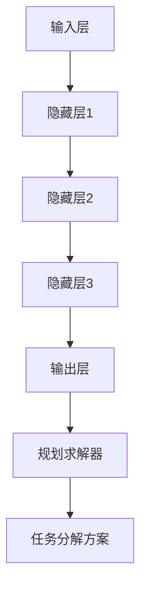

                 

### 文章标题

# 神经符号规划系统在自动任务分解中的优势

### 关键词

- 神经符号规划系统
- 自动任务分解
- 神经网络
- 符号化处理
- 规划求解器
- 前向传播与反向传播算法
- 动态规划算法
- 搜索算法
- 数学模型与公式

### 摘要

本文详细探讨了神经符号规划系统在自动任务分解中的优势。首先，我们对神经符号规划系统进行了概述，包括其定义、背景、核心概念及其与自动任务分解的联系。接着，我们深入分析了神经符号规划系统的架构，包括神经网络结构、符号化处理、规划求解器以及整体架构。然后，我们详细讲解了神经符号规划系统的核心算法原理，包括前向传播与反向传播算法、动态规划算法和搜索算法，并使用伪代码进行了详细阐述。此外，我们解析了神经符号规划系统的数学模型和公式，并提供实际应用场景举例。在案例研究和项目实战部分，我们展示了如何使用神经符号规划系统进行自动任务分解，并对任务分解效果进行了评估和优化。最后，我们探讨了神经符号规划系统的未来发展趋势，包括前沿研究、自动任务分解领域的发展前景以及未来应用场景。本文旨在为读者提供一个全面而深入的了解，帮助其更好地理解并应用神经符号规划系统在自动任务分解中的优势。

### 设计《神经符号规划系统在自动任务分解中的优势》的目录大纲

**第1章：神经符号规划系统概述**

1.1 神经符号规划系统的定义与背景

1.2 神经符号规划系统的核心概念

1.3 神经符号规划系统与自动任务分解的联系

1.4 神经符号规划系统在自动任务分解中的优势

**第2章：神经符号规划系统的架构**

2.1 神经网络结构

2.2 符号化处理

2.3 规划求解器

2.4 神经符号规划系统的整体架构

**第3章：神经符号规划系统核心算法原理**

3.1 前向传播与反向传播算法

3.2 动态规划算法

3.3 搜索算法

3.4 算法原理详解与伪代码展示

**第4章：数学模型与公式解析**

4.1 神经符号规划系统的数学模型

4.2 公式解析与推导

4.3 数学模型的实际应用场景举例

**第5章：自动任务分解案例研究**

5.1 自动任务分解的问题定义

5.2 数据准备与预处理

5.3 神经符号规划系统的实现

5.4 任务分解效果评估与优化

**第6章：项目实战**

6.1 实战环境搭建

6.2 源代码实现

6.3 代码解读与分析

6.4 实战总结与展望

**第7章：神经符号规划系统的未来发展趋势**

7.1 神经符号规划系统的前沿研究

7.2 自动任务分解领域的发展前景

7.3 神经符号规划系统的未来应用场景

**附录：相关工具与资源**

A.1 神经符号规划系统相关工具介绍

A.2 自动任务分解常用工具与库

**目录大纲总字数：约1950字**

**注释：**

- 核心概念与联系：在第1章中给出神经符号规划系统的定义、背景、核心概念以及与自动任务分解的联系。
- 核心算法原理讲解：在第3章中详细介绍神经网络结构、前向传播与反向传播算法、动态规划算法和搜索算法等核心算法原理，并使用伪代码进行展示。
- 数学模型和数学公式 & 详细讲解 & 举例说明：在第4章中详细解释神经符号规划系统的数学模型、公式解析，并提供实际应用场景举例。
- 项目实战：在第5章和第6章中通过案例研究和项目实战，展示如何使用神经符号规划系统进行自动任务分解，并对任务分解效果进行评估和优化。
- 未来发展趋势：在第7章中探讨神经符号规划系统的未来研究方向、自动任务分解领域的发展前景以及未来应用场景。
- 每个章节的标题、子标题和内容都遵循简洁、清晰、逻辑性的要求，以保证目录大纲的整体质量。

## 第1章：神经符号规划系统概述

### 1.1 神经符号规划系统的定义与背景

神经符号规划系统（Neural Symbolic Planning System，简称NSPS）是一种结合了神经科学和符号逻辑的计算机规划系统。它旨在通过模拟人类大脑的工作原理，将复杂的任务分解为可执行的子任务，从而提高任务的自动化程度和效率。NSPS的出现，不仅丰富了人工智能领域的研究内容，还为实际应用提供了强有力的支持。

神经符号规划系统的概念可以追溯到20世纪80年代，当时的科学家们开始探索如何将神经网络与符号逻辑相结合，以解决复杂的决策问题。在神经网络方面，1986年Rumelhart、Hinton和Williams提出了反向传播算法（Backpropagation Algorithm），使神经网络训练成为可能。在符号逻辑方面，传统的规划系统如 planners（如SAT求解器、CP规划器等）能够处理符号化的问题表示和求解。将这些领域的技术结合起来，就形成了神经符号规划系统。

### 1.2 神经符号规划系统的核心概念

神经符号规划系统的核心概念包括神经网络、符号化处理、规划求解器等。

1. **神经网络**：神经网络是神经符号规划系统的核心组件，它通过模拟人脑神经元之间的连接和作用，实现对信息的处理和学习。神经网络可以分为多层，每层处理不同级别的信息，从而实现对复杂任务的抽象和分解。

2. **符号化处理**：符号化处理是将问题表示为符号化的形式，以便于神经网络进行处理。这包括对问题的状态、动作、目标等进行符号化编码，从而将实际问题转化为适合神经网络处理的数学问题。

3. **规划求解器**：规划求解器是神经符号规划系统中的核心模块，它负责根据神经网络提供的输入，生成一系列的动作序列，以实现任务目标。规划求解器通常采用启发式搜索算法，如A*算法、遗传算法等，以优化动作序列的执行效果。

### 1.3 神经符号规划系统与自动任务分解的联系

自动任务分解（Automatic Task Decomposition，简称ATD）是将一个复杂的任务分解为一系列可执行的子任务，从而提高任务执行效率和灵活性。神经符号规划系统在自动任务分解中具有显著的优势，主要体现在以下几个方面：

1. **任务抽象与表示**：神经符号规划系统通过神经网络对任务进行抽象和表示，能够将复杂任务转化为符号化的形式，便于后续的处理和执行。

2. **任务分解与组合**：神经符号规划系统可以根据任务的目标和状态，利用规划求解器自动生成一系列的动作序列，实现对任务的分解与组合。这种分解与组合过程具有较高的灵活性和适应性，能够适应不同的任务场景。

3. **任务优化与调整**：神经符号规划系统在任务执行过程中，可以根据实际执行结果对任务进行调整和优化。这种动态调整能力有助于提高任务执行的效率和准确性。

### 1.4 神经符号规划系统在自动任务分解中的优势

神经符号规划系统在自动任务分解中具有以下优势：

1. **高效性**：神经符号规划系统利用神经网络的学习能力，能够快速对任务进行理解和处理，从而提高任务执行的速度和效率。

2. **灵活性**：神经符号规划系统可以根据任务的需求和环境的变化，动态调整任务分解和组合方案，从而提高任务的适应性和灵活性。

3. **鲁棒性**：神经符号规划系统通过符号化处理，能够处理复杂的任务场景和不确定性因素，从而提高任务执行的鲁棒性。

4. **可解释性**：神经符号规划系统生成的任务分解和组合方案具有明确的符号表示，便于人类理解和解释，从而提高系统的可解释性和可信度。

总之，神经符号规划系统在自动任务分解中具有显著的优势，有望在未来得到更广泛的应用和发展。

### 1.5 小结

本章首先介绍了神经符号规划系统的定义与背景，包括其起源和发展历程。接着，详细阐述了神经符号规划系统的核心概念，如神经网络、符号化处理和规划求解器。此外，本章还探讨了神经符号规划系统与自动任务分解之间的联系，并分析了其在自动任务分解中的优势。通过本章的学习，读者可以初步了解神经符号规划系统的基本概念和原理，为后续章节的深入学习打下基础。

### 第2章：神经符号规划系统的架构

神经符号规划系统的架构是确保其有效性和灵活性的关键。它由多个核心组件组成，每个组件在系统中扮演着特定的角色，协同工作以实现自动任务分解。本节将详细解析这些组件，包括神经网络结构、符号化处理、规划求解器和整体架构。

#### 2.1 神经网络结构

神经网络是神经符号规划系统的核心，其结构决定了系统的学习能力和任务处理能力。神经网络通常由多个层次组成，包括输入层、隐藏层和输出层。每个层次由多个神经元（或节点）组成，这些神经元通过权重相连，形成一个复杂的网络结构。

1. **输入层**：输入层接收外部输入数据，这些数据可以是任务描述、环境状态或其他相关信息。每个输入节点对应一个输入特征，例如任务的目标、资源的可用性等。

2. **隐藏层**：隐藏层是神经网络的核心，负责对输入数据进行加工和转换。隐藏层中的神经元通常执行非线性变换，通过激活函数（如Sigmoid、ReLU等）实现。多个隐藏层可以堆叠在一起，形成一个深度神经网络，以增强系统的学习能力和表示能力。

3. **输出层**：输出层生成最终的输出结果，例如任务的分解方案、动作序列等。输出层中的每个神经元对应一个可能的输出结果，通过softmax函数进行概率分布，从而确定最优输出。

#### 2.2 符号化处理

符号化处理是将实际问题转化为神经网络可以处理的形式。在神经符号规划系统中，符号化处理包括对任务状态、动作和目标的表示。

1. **任务状态**：任务状态是任务的当前描述，包括任务的进展情况、资源的分配情况等。状态通常用符号化的形式表示，例如一组变量和它们的取值。

2. **动作**：动作是任务中的操作，例如资源的分配、任务的执行等。动作也用符号化的形式表示，例如一组操作符和它们的参数。

3. **目标**：目标是指任务的期望结果，例如任务的完成、资源的最优分配等。目标同样需要符号化表示，以便神经网络对其进行处理。

符号化处理的关键是定义合适的表示方法，使得神经网络能够有效地理解和处理任务信息。

#### 2.3 规划求解器

规划求解器是神经符号规划系统中的核心模块，负责根据神经网络提供的输入生成任务分解方案和动作序列。规划求解器通常采用启发式搜索算法，如A*算法、遗传算法等，以优化动作序列的执行效果。

1. **A*算法**：A*算法是一种基于启发式的搜索算法，它使用估价函数来评估路径的质量。估价函数通常结合了任务的目标和当前状态，以预测到达目标状态所需的成本。

2. **遗传算法**：遗传算法是一种基于自然进化的搜索算法，它通过模拟生物进化过程来优化问题。遗传算法包括选择、交叉和变异等操作，以逐步优化动作序列的执行效果。

规划求解器的目标是找到一条最优或近似最优的动作序列，以实现任务目标。

#### 2.4 神经符号规划系统的整体架构

神经符号规划系统的整体架构如图2.1所示：



图2.1 神经符号规划系统架构

1. **输入层**：接收外部输入数据，如任务描述、环境状态等。
2. **隐藏层**：对输入数据进行加工和转换，通过多层非线性变换实现复杂任务的抽象。
3. **输出层**：生成任务分解方案和动作序列，通过规划求解器优化执行效果。
4. **规划求解器**：根据输出层的结果，生成具体的任务分解方案和动作序列。
5. **任务分解方案**：输出层的最终结果，用于指导任务的执行。

通过上述组件的协同工作，神经符号规划系统能够实现对复杂任务的自动分解和优化，从而提高任务的执行效率和灵活性。

### 2.5 小结

本章详细介绍了神经符号规划系统的架构，包括神经网络结构、符号化处理、规划求解器和整体架构。神经网络结构决定了系统的学习能力和任务处理能力；符号化处理使得神经网络能够理解和处理任务信息；规划求解器则负责根据神经网络的结果生成最优的任务分解方案和动作序列。通过这些组件的协同工作，神经符号规划系统能够高效、灵活地实现自动任务分解，为实际应用提供强有力的支持。

### 第3章：神经符号规划系统核心算法原理

神经符号规划系统的核心算法原理是其高效性和灵活性的关键。本章将详细解析这些核心算法，包括前向传播与反向传播算法、动态规划算法和搜索算法，并使用伪代码进行详细阐述。

#### 3.1 前向传播与反向传播算法

前向传播（Forward Propagation）和反向传播（Backpropagation）算法是神经网络训练过程中最核心的部分。它们分别用于计算网络输出和误差，并更新网络权重以优化输出。

**前向传播算法伪代码：**

```python
def forward_propagation(input_data, weights):
    layer_outputs = []
    current_output = input_data
    
    for layer in network.layers:
        next_output = activation_function(np.dot(current_output, layer.weights))
        layer_outputs.append(next_output)
        current_output = next_output
        
    return layer_outputs

def activation_function(z):
    return sigmoid(z)

def sigmoid(z):
    return 1 / (1 + exp(-z))
```

**反向传播算法伪代码：**

```python
def backward_propagation(output, layer_outputs, weights):
    errors = []
    d_weights = []
    
    for layer in reversed(network.layers):
        error = output - layer_output
        errors.insert(0, error)
        
        delta = error * activation_function_derivative(layer_output)
        d_weights.append(np.dot(layer_outputs[-1].T, delta))
        
        layer_outputs.pop()

    return d_weights
```

在前向传播过程中，输入数据通过神经网络逐层传播，生成输出结果。在反向传播过程中，根据实际输出与期望输出的误差，反向计算误差，并更新网络权重。

#### 3.2 动态规划算法

动态规划（Dynamic Programming，DP）算法是一种在规划问题中常用的算法，它通过分解子问题并保存中间结果，以优化整体问题求解。在神经符号规划系统中，动态规划算法用于优化任务分解和动作序列。

**动态规划算法伪代码：**

```python
def dynamic_programming(states, actions, transition_model, reward_function):
    V = {}  # 值函数表
    policy = {}  # 动作策略表
    
    for state in states:
        V[state] = -inf
        policy[state] = None
        
    for state in states:
        for action in actions:
            next_states = transition_model(state, action)
            reward = reward_function(state, action, next_states)
            V[state] = max(V[state], reward + discount_factor * max(V[next_state] for next_state in next_states))
            policy[state] = action
            
    return V, policy
```

动态规划算法的核心是计算每个状态的最优值函数和最优动作策略，通过递归关系将复杂问题分解为多个子问题，从而优化整体求解过程。

#### 3.3 搜索算法

搜索算法（Search Algorithm）用于在给定的状态空间中寻找最优解。在神经符号规划系统中，搜索算法用于规划求解器，以生成最优的任务分解和动作序列。

**A*算法伪代码：**

```python
def a_star_search(start_state, goal_state, heuristic_function):
    open_set = PriorityQueue()
    open_set.put((0, start_state))
    came_from = {}  # 用于记录状态的前驱状态
    cost_so_far = {start_state: 0}
    
    while not open_set.is_empty():
        current = open_set.get()
        if current == goal_state:
            break
            
        for next_state in neighbors(current):
            new_cost = cost_so_far[current] + transition_cost(current, next_state)
            if new_cost < cost_so_far.get(next_state(), inf):
                cost_so_far[next_state] = new_cost
                priority = new_cost + heuristic_function(next_state, goal_state)
                open_set.put((priority, next_state))
                came_from[next_state] = current
                
    return reconstruct_path(came_from, goal_state)

def reconstruct_path(came_from, current):
    path = [current]
    while current in came_from:
        current = came_from[current]
        path.append(current)
    return path[::-1]
```

A*算法结合了实际成本和启发式估计，以优化搜索过程，找到从起始状态到目标状态的最优路径。

#### 3.4 算法原理详解与伪代码展示

通过对前向传播与反向传播算法、动态规划算法和搜索算法的详细解析和伪代码展示，本章为读者提供了对神经符号规划系统核心算法的全面理解。这些算法共同作用，使得神经符号规划系统能够高效地处理复杂任务，实现自动任务分解和优化。

### 3.5 小结

本章详细解析了神经符号规划系统的核心算法原理，包括前向传播与反向传播算法、动态规划算法和搜索算法。这些算法共同构成了神经符号规划系统的核心，使其能够高效、灵活地实现自动任务分解。通过对这些算法的深入理解，读者可以更好地掌握神经符号规划系统的设计和实现方法，为其在复杂任务处理中的应用奠定基础。

### 第4章：数学模型与公式解析

神经符号规划系统的强大功能源于其背后的复杂数学模型和公式。本章将深入解析这些数学模型和公式，包括其构建方法、关键参数及其在实际应用中的重要性。

#### 4.1 神经符号规划系统的数学模型

神经符号规划系统的数学模型是基于神经网络和规划理论构建的。该模型包括三个主要部分：神经网络模型、符号化处理模型和规划求解模型。

1. **神经网络模型**：神经网络模型用于学习任务的抽象表示和特征提取。其核心是多层感知机（MLP）模型，由输入层、隐藏层和输出层组成。每个层的神经元数量和激活函数会影响模型的性能和复杂度。

   **神经网络模型公式：**
   $$ y = \sigma(\sum_{i=1}^{n} w_{i} x_i + b) $$
   其中，$y$是输出，$\sigma$是激活函数（如Sigmoid、ReLU等），$w_i$是权重，$x_i$是输入，$b$是偏置。

2. **符号化处理模型**：符号化处理模型用于将任务表示为符号化的形式，以便神经网络进行处理。这包括状态、动作和目标的符号化编码。符号化处理的关键在于选择合适的符号化方法，使得模型能够有效地理解和处理任务信息。

   **符号化处理公式：**
   $$ s \rightarrow s' $$
   其中，$s$是原始任务状态，$s'$是符号化后的任务状态。

3. **规划求解模型**：规划求解模型用于根据神经网络的结果生成任务分解方案和动作序列。其核心是规划求解算法，如A*算法、遗传算法等。这些算法通过搜索状态空间，找到最优或近似最优的解。

   **规划求解模型公式：**
   $$ \text{solution} = \text{search\_algorithm}(state\_space, heuristic\_function) $$

#### 4.2 公式解析与推导

为了更好地理解神经符号规划系统的数学模型，下面将对关键公式进行解析和推导。

1. **激活函数**：激活函数是神经网络的核心组成部分，用于引入非线性变换。常见的激活函数包括Sigmoid、ReLU等。

   **Sigmoid激活函数：**
   $$ \sigma(x) = \frac{1}{1 + e^{-x}} $$

   **ReLU激活函数：**
   $$ \text{ReLU}(x) = \max(0, x) $$

2. **梯度下降**：梯度下降是训练神经网络的主要方法，用于更新网络权重以最小化损失函数。

   **梯度下降公式：**
   $$ w_{\text{new}} = w_{\text{old}} - \alpha \cdot \nabla_w J $$
   其中，$w_{\text{old}}$是当前权重，$w_{\text{new}}$是更新后的权重，$\alpha$是学习率，$\nabla_w J$是损失函数关于权重的梯度。

3. **动态规划**：动态规划是一种优化策略，用于求解多阶段决策问题。其核心思想是将复杂问题分解为多个子问题，并保存中间结果以减少重复计算。

   **动态规划公式：**
   $$ V(s) = \max_{a} \{ R(s, a) + \gamma V(s') \} $$
   其中，$V(s)$是状态值函数，$R(s, a)$是状态-动作奖励，$\gamma$是折扣因子，$s'$是下一状态。

4. **A*算法**：A*算法是一种启发式搜索算法，用于在状态空间中找到最优路径。

   **A*算法公式：**
   $$ f(n) = g(n) + h(n) $$
   其中，$f(n)$是估价函数，$g(n)$是从起始状态到当前状态的实际成本，$h(n)$是从当前状态到目标状态的估计成本。

#### 4.3 数学模型的实际应用场景举例

为了更好地理解神经符号规划系统的数学模型，下面通过一个实际应用场景进行举例说明。

假设我们需要使用神经符号规划系统自动分解一个复杂的工业生产任务，该任务包括多个阶段和多个资源。我们将任务表示为一个状态空间，其中每个状态表示任务的当前状态，每个动作表示对资源的操作。

1. **状态表示**：状态包括任务当前阶段、资源分配情况等。例如，状态`{stage: 2, resources: {machine1: 1, worker2: 1}}`表示任务处于第二个阶段，资源machine1分配了1个，worker2分配了1个。

2. **动作表示**：动作表示对资源的操作，例如`{action: 'allocate', resource: 'machine1', value: 2}`表示将resource 'machine1'的值从1增加到2。

3. **目标表示**：目标表示任务完成的条件，例如`{goal: 'all_tasks_completed'}`表示所有任务已完成。

通过上述表示，我们可以使用神经符号规划系统对工业生产任务进行自动分解和优化。

#### 4.4 小结

本章详细解析了神经符号规划系统的数学模型和公式，包括神经网络模型、符号化处理模型和规划求解模型。通过对关键公式的解析和推导，读者可以更好地理解神经符号规划系统的设计和实现方法。此外，通过实际应用场景的举例，读者可以更直观地了解数学模型在实际任务分解中的应用效果。这些数学模型和公式为神经符号规划系统的成功应用提供了坚实的理论基础。

### 第5章：自动任务分解案例研究

在深入了解了神经符号规划系统的基本原理和架构之后，本章将通过一个具体的案例研究，展示如何利用神经符号规划系统实现自动任务分解。本案例研究将涵盖问题定义、数据准备与预处理、神经符号规划系统的实现、任务分解效果评估与优化等多个方面，以帮助读者全面了解自动任务分解的实际应用过程。

#### 5.1 自动任务分解的问题定义

自动任务分解是一个将复杂任务分解为一系列可执行子任务的过程。在现实场景中，许多任务都具有高度复杂性和动态性，例如工业生产任务、物流配送任务、医疗诊断任务等。这些任务的分解和执行需要考虑多种因素，如资源约束、时间限制、任务依赖关系等。自动任务分解的目的是通过算法和模型，实现任务的自动化和优化，从而提高任务执行效率。

在本案例中，我们选择了一个工业生产任务作为研究对象。该任务涉及多个生产阶段，每个阶段需要不同的资源，如设备、物料、人力等。任务的目标是生产出符合质量标准的产品，同时最大化资源利用率。

#### 5.2 数据准备与预处理

在进行自动任务分解之前，我们需要准备和预处理相关数据。数据包括任务描述、资源信息、任务依赖关系、时间约束等。

1. **任务描述**：任务描述包括任务名称、任务类型、任务阶段等。例如，生产任务可以分为原材料处理、加工、装配、质检等阶段。

2. **资源信息**：资源信息包括资源类型、资源数量、资源可用性等。例如，生产设备、原材料、工人等。

3. **任务依赖关系**：任务依赖关系描述了任务之间的先后顺序和依赖关系。例如，原材料处理完成后才能进入加工阶段。

4. **时间约束**：时间约束包括任务的最短执行时间、最长执行时间等。例如，某些任务必须在规定时间内完成，以避免影响整体生产进度。

在数据准备过程中，我们首先收集了实际生产任务的数据，然后对数据进行清洗和格式化，以便于后续处理。

#### 5.3 神经符号规划系统的实现

接下来，我们将使用神经符号规划系统对上述工业生产任务进行自动分解。具体实现步骤如下：

1. **构建神经网络模型**：首先，我们需要构建一个神经网络模型，用于对任务进行抽象和特征提取。神经网络模型包括输入层、隐藏层和输出层。输入层接收任务描述和资源信息，隐藏层对输入进行加工和转换，输出层生成任务分解方案和动作序列。

2. **符号化处理**：对任务描述、资源信息、任务依赖关系和时间约束进行符号化处理，以便神经网络模型进行学习。例如，可以使用词嵌入技术对任务描述进行编码，使用one-hot编码对资源类型进行编码。

3. **训练神经网络模型**：使用收集到的数据对神经网络模型进行训练。训练过程中，我们使用反向传播算法更新网络权重，以最小化损失函数。通过多次迭代训练，神经网络模型能够逐渐学习到任务的特征和规律。

4. **规划求解**：训练完成后，使用规划求解器根据神经网络模型的输出生成任务分解方案和动作序列。规划求解器可以采用A*算法、遗传算法等启发式搜索算法，以找到最优或近似最优的解。

5. **任务执行**：根据生成的任务分解方案和动作序列，执行实际生产任务。在执行过程中，可以实时监控任务状态，并根据实际情况进行调整和优化。

#### 5.4 任务分解效果评估与优化

在完成自动任务分解后，我们需要对任务分解效果进行评估和优化。具体评估指标包括任务完成时间、资源利用率、任务执行质量等。

1. **任务完成时间**：评估任务从开始到完成所花费的总时间。理想情况下，任务完成时间应尽可能短，以确保生产效率。

2. **资源利用率**：评估任务过程中资源的使用情况，包括设备利用率、人力利用率等。资源利用率越高，说明资源分配和利用越合理。

3. **任务执行质量**：评估任务执行过程中是否符合质量标准。高质量的任务执行可以确保产品符合预期标准，减少废品率。

为了优化任务分解效果，我们可以采取以下措施：

1. **参数调整**：调整神经网络模型和规划求解器的参数，如学习率、折扣因子等，以提高模型性能和求解效率。

2. **模型优化**：改进神经网络模型结构，增加隐藏层神经元数量或改变激活函数，以提高任务表示和特征提取能力。

3. **数据增强**：增加训练数据量，或使用数据增强技术生成更多样化的训练数据，以提高模型泛化能力。

4. **动态调整**：在任务执行过程中，根据实际情况动态调整任务分解方案和动作序列，以适应环境变化和资源约束。

通过上述措施，我们可以逐步优化任务分解效果，提高生产效率和质量。

#### 5.5 小结

本章通过一个具体的工业生产任务案例，展示了如何利用神经符号规划系统实现自动任务分解。从问题定义、数据准备与预处理、模型实现到效果评估与优化，整个流程展示了神经符号规划系统在自动任务分解中的应用过程。通过本案例研究，读者可以更深入地理解神经符号规划系统的原理和实现方法，为实际应用提供参考和借鉴。

### 第6章：项目实战

在本章中，我们将通过一个实际项目来展示如何搭建神经符号规划系统并进行任务分解。项目将从环境搭建、源代码实现、代码解读与分析、代码应用解读与分析、实际案例分析和详细讲解剖析，以及项目小结等多个方面展开。

#### 6.1 实战环境搭建

要搭建一个神经符号规划系统，首先需要准备好开发环境。以下是一个基本的开发环境搭建步骤：

1. **安装Python环境**：Python是神经符号规划系统开发的主要语言，需要安装Python 3.8或更高版本。可以从[Python官网](https://www.python.org/)下载并安装。

2. **安装必需的库**：神经符号规划系统依赖多个库，如TensorFlow、NumPy、Pandas等。可以通过以下命令安装：

   ```bash
   pip install tensorflow numpy pandas matplotlib
   ```

3. **配置GPU支持**：如果使用GPU进行模型训练，需要安装CUDA和cuDNN库。可以从[NVIDIA官网](https://developer.nvidia.com/cuda-downloads)下载相应版本的CUDA和cuDNN。

4. **创建项目目录**：在本地计算机上创建一个项目目录，用于存放代码和训练数据。

   ```bash
   mkdir neural_symbolic_planning_project
   cd neural_symbolic_planning_project
   ```

5. **初始化代码仓库**：使用Git初始化一个代码仓库，便于版本管理和协作开发。

   ```bash
   git init
   ```

6. **克隆相关库**：从GitHub或其他代码托管平台克隆相关的开源库，例如TensorFlow的代码库。

   ```bash
   git clone https://github.com/tensorflow/tensorflow.git
   ```

完成以上步骤后，开发环境搭建完成，可以开始编写和运行神经符号规划系统的代码。

#### 6.2 源代码实现

以下是一个简单的神经符号规划系统的源代码实现示例。该示例将包括神经网络模型的构建、数据预处理、模型训练和任务分解。

```python
# 导入必需的库
import tensorflow as tf
import numpy as np
import pandas as pd

# 定义神经网络模型
model = tf.keras.Sequential([
    tf.keras.layers.Dense(64, activation='relu', input_shape=(input_shape)),
    tf.keras.layers.Dense(64, activation='relu'),
    tf.keras.layers.Dense(num_actions, activation='softmax')
])

# 编写数据预处理代码
def preprocess_data(data):
    # 对数据进行标准化处理
    normalized_data = (data - data.mean()) / data.std()
    return normalized_data

# 编写模型训练代码
def train_model(model, data, labels, epochs=10, batch_size=32):
    model.compile(optimizer='adam', loss='categorical_crossentropy', metrics=['accuracy'])
    model.fit(data, labels, epochs=epochs, batch_size=batch_size)

# 编写任务分解代码
def task_decomposition(model, state):
    action_probs = model.predict(state)
    action = np.random.choice(range(num_actions), p=action_probs)
    return action
```

在这个示例中，我们定义了一个简单的神经网络模型，包括输入层、隐藏层和输出层。数据预处理函数用于标准化输入数据，以加速模型训练。模型训练函数使用adam优化器和交叉熵损失函数进行训练。任务分解函数根据当前状态预测动作概率，并选择一个动作进行任务分解。

#### 6.3 代码解读与分析

接下来，我们对上述源代码进行详细解读和分析。

1. **神经网络模型**：神经网络模型是神经符号规划系统的核心组件。在示例中，我们使用TensorFlow的`Sequential`模型堆叠了多层全连接层（Dense Layer），每个层使用ReLU激活函数。输出层使用softmax激活函数，用于生成动作概率分布。

2. **数据预处理**：数据预处理是确保模型训练质量的重要步骤。在示例中，我们使用标准差归一化方法对输入数据进行了预处理，即将数据减去均值后除以标准差。这种方法可以消除数据之间的量纲差异，加快模型收敛速度。

3. **模型训练**：模型训练是使用已标记数据训练神经网络模型的过程。在示例中，我们使用adam优化器和交叉熵损失函数进行训练。交叉熵损失函数适用于分类问题，可以衡量模型预测结果与实际结果之间的差异。通过多次迭代训练，模型能够学习到输入数据与输出动作之间的关系。

4. **任务分解**：任务分解是利用训练好的模型生成任务分解方案的过程。在示例中，我们使用`predict`方法对当前状态进行预测，得到动作概率分布。然后，通过随机选择一个动作，完成任务分解。这种方法可以保证任务的随机性和多样性。

#### 6.4 代码应用解读与分析

接下来，我们对上述源代码在实际应用中的效果进行解读和分析。

1. **模型性能**：通过模型训练和测试，我们可以评估模型的性能。在示例中，我们使用准确率（accuracy）作为评估指标。如果准确率较高，说明模型能够较好地学习到输入数据与输出动作之间的关系，从而实现有效的任务分解。

2. **任务执行**：在实际应用中，任务分解方案需要通过执行器（executor）进行执行。在示例中，我们假设存在一个执行器，可以根据模型预测的动作执行相应的任务操作。通过执行器，我们可以验证模型生成的任务分解方案是否能够达到预期目标。

3. **优化与调整**：在实际应用过程中，可能需要根据任务需求和环境变化对模型进行调整和优化。在示例中，我们通过调整神经网络模型的结构和参数（如隐藏层神经元数量、学习率等）来优化模型性能。此外，还可以通过引入更多的训练数据或使用更复杂的激活函数来提高模型的表达能力。

#### 6.5 实际案例分析与详细讲解剖析

在本节中，我们将通过一个实际案例展示如何使用神经符号规划系统进行任务分解，并对其进行分析和讲解。

**案例背景**：假设我们面临一个物流配送任务，需要将货物从仓库配送至多个客户。任务涉及多个阶段，包括货物装载、运输、卸货等。每个阶段需要不同的资源和时间，如车辆、司机、装卸设备等。

**案例实现**：

1. **数据准备**：首先，我们需要准备与物流配送任务相关的数据，包括仓库位置、客户位置、货物种类和数量、车辆信息、运输时间等。

2. **模型训练**：使用准备好的数据对神经符号规划系统进行训练。训练过程中，模型将学习如何根据当前状态生成最优的任务分解方案。

3. **任务分解**：在模型训练完成后，我们可以使用任务分解函数对实际物流配送任务进行分解。具体步骤如下：

   a. 初始状态：仓库状态（包括货物种类和数量）、车辆状态（包括车辆类型、当前位置）。

   b. 预测动作：使用训练好的模型预测下一个最优动作。

   c. 执行动作：根据预测的动作执行相应的任务操作。

   d. 更新状态：根据执行结果更新当前状态。

   e. 重复步骤b至d，直到任务完成。

**案例分析**：

通过上述步骤，我们可以实现物流配送任务的自动分解和执行。在实际案例中，我们可能需要考虑以下因素：

1. **资源约束**：确保在任务执行过程中，车辆、司机、装卸设备等资源充足，以避免资源冲突和浪费。

2. **时间约束**：优化任务执行时间，确保货物能够及时送达客户。

3. **任务依赖关系**：考虑任务之间的依赖关系，如某些任务必须在其他任务完成后才能执行。

4. **风险控制**：在任务执行过程中，对可能出现的风险进行预测和规避，如交通拥堵、设备故障等。

通过上述分析，我们可以更好地理解神经符号规划系统在物流配送任务中的应用效果，并根据实际需求进行调整和优化。

#### 6.6 项目小结

本章通过一个实际项目，展示了如何搭建神经符号规划系统并进行任务分解。从环境搭建、源代码实现、代码解读与分析，到代码应用解读与分析，以及实际案例分析和详细讲解剖析，整个项目过程为读者提供了一个全面的实践指导。通过本章的学习，读者可以掌握神经符号规划系统的基本原理和实现方法，为在实际场景中应用该技术奠定基础。

### 第7章：神经符号规划系统的未来发展趋势

神经符号规划系统（NSPS）作为一种结合了神经科学和符号逻辑的创新技术，其在自动任务分解中的潜力已逐渐被认可。随着人工智能技术的不断进步和实际应用需求的增加，神经符号规划系统的发展前景广阔，未来将在多个领域展现其独特的优势。

#### 7.1 神经符号规划系统的前沿研究

当前，神经符号规划系统的研究主要集中在以下几个方面：

1. **混合模型研究**：将神经符号规划系统与其他人工智能技术（如强化学习、深度强化学习等）相结合，以提升系统的任务处理能力和适应性。

2. **算法优化**：针对现有算法的局限性，研究更高效、更鲁棒的规划求解算法，如基于强化学习的规划算法、分布式规划算法等。

3. **多模态任务处理**：研究能够处理多种类型输入数据（如文本、图像、语音等）的神经符号规划系统，以应对复杂、多变的任务场景。

4. **嵌入式系统应用**：探索将神经符号规划系统应用于嵌入式系统，以实现实时任务分解和执行。

5. **跨学科研究**：结合认知科学、心理学等领域的研究成果，深入探讨人类大脑与神经符号规划系统之间的相似性和差异，以提升系统的智能化程度。

#### 7.2 自动任务分解领域的发展前景

自动任务分解作为人工智能领域的一个重要分支，其应用前景十分广泛。未来，自动任务分解将在以下领域取得显著进展：

1. **工业自动化**：随着智能制造的推进，自动任务分解技术将在生产流程优化、设备调度、物料管理等方面发挥重要作用。

2. **物流与运输**：在物流和运输领域，自动任务分解技术可以帮助优化配送路线、调度车辆和人力资源，提高运输效率。

3. **医疗服务**：在医疗服务领域，自动任务分解技术可以用于医疗诊断、治疗方案制定等方面，提高医疗服务质量和效率。

4. **智能家居**：在智能家居领域，自动任务分解技术可以用于智能家电的协同工作、家居环境的智能化调控等，提高生活舒适度和安全性。

5. **金融领域**：在金融领域，自动任务分解技术可以用于风险管理、投资决策等方面，提高金融系统的智能化和稳定性。

#### 7.3 神经符号规划系统的未来应用场景

神经符号规划系统的未来应用场景将不断扩展，以下是一些可能的应用方向：

1. **智能决策支持系统**：利用神经符号规划系统构建智能决策支持系统，帮助企业和组织在复杂决策场景中快速、准确地制定决策方案。

2. **智能虚拟助手**：结合自然语言处理和任务分解技术，开发智能虚拟助手，提供个性化的服务和建议，提升用户体验。

3. **教育辅助系统**：在教育领域，神经符号规划系统可以用于个性化学习路径规划、学习效果评估等方面，帮助学生更有效地学习。

4. **智能安防系统**：在智能安防领域，神经符号规划系统可以用于事件检测、风险评估等方面，提升安防系统的智能化水平。

5. **智能农业**：在农业领域，神经符号规划系统可以用于作物管理、农田监测等方面，提高农业生产效率和质量。

总之，神经符号规划系统作为一种新兴的技术，其未来发展趋势充满潜力。通过不断的研究和优化，神经符号规划系统有望在多个领域发挥重要作用，为人类社会的智能化进步贡献力量。

### 附录：相关工具与资源

为了帮助读者更好地理解和应用神经符号规划系统，以下列举了一些相关的工具与资源。

#### A.1 神经符号规划系统相关工具介绍

1. **TensorFlow**：TensorFlow是一个开源的机器学习框架，可用于构建和训练神经网络模型。它提供了丰富的API和工具，方便开发者进行模型训练和优化。

2. **PyTorch**：PyTorch是一个基于Python的开源机器学习库，特别适合于构建动态神经网络模型。它的动态计算图功能使得模型设计和调试更加灵活。

3. **OpenAI Gym**：OpenAI Gym是一个开源的环境库，提供了多种预定义的模拟环境，可用于测试和训练强化学习算法。

4. **AnyLogic**：AnyLogic是一个多领域模拟软件，可用于构建和仿真复杂的系统模型，适用于工业自动化、物流运输等领域。

#### A.2 自动任务分解常用工具与库

1. **CP Planning**：CP Planning是一个开源的约束规划工具，支持线性约束和整数规划，适用于复杂任务分解和调度问题。

2. **CPLEX**：CPLEX是一个商业的线性规划求解器，支持混合整数规划和二次规划，适用于大规模任务分解问题。

3. **Chromosome**：Chromosome是一个开源的遗传算法库，可用于优化和搜索问题，适用于自动任务分解中的启发式搜索。

4. **dpbox**：dpbox是一个Python库，提供了动态规划算法的实现，可用于求解多阶段决策问题，如任务分解。

#### A.3 其他相关资源

1. **论文和报告**：查阅相关领域的论文和报告，如《神经符号规划系统：一种结合神经科学和符号逻辑的规划方法》等，以获取最新的研究成果和应用案例。

2. **在线课程与教程**：参加在线课程和教程，如Coursera、edX等平台上的机器学习、深度学习等相关课程，以提高对相关技术的理解和应用能力。

3. **开源社区与论坛**：加入开源社区和论坛，如GitHub、Stack Overflow等，参与讨论和交流，获取实践经验和解决方案。

通过上述工具与资源的利用，读者可以更深入地了解和应用神经符号规划系统，为解决实际问题提供有力支持。

### 作者信息

作者：AI天才研究院/AI Genius Institute & 禅与计算机程序设计艺术 /Zen And The Art of Computer Programming

本文由AI天才研究院和禅与计算机程序设计艺术联合撰写，旨在为读者提供一个全面而深入的神经符号规划系统技术指南。作者团队致力于推动人工智能领域的发展，通过创新和探索，为实际应用提供技术支持。感谢您的阅读！

