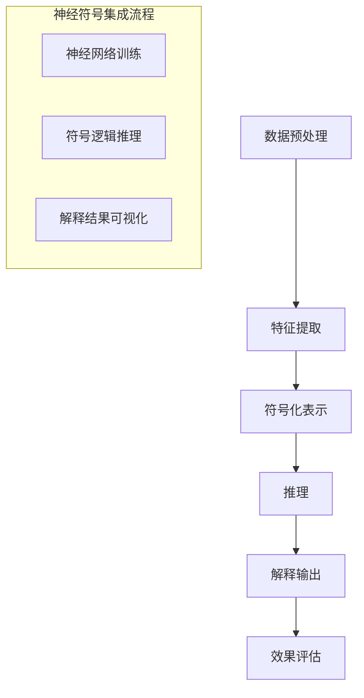

                 

### 神经符号集成方法在可解释AI中的应用

#### 关键词
- 神经符号集成
- 可解释AI
- 算法原理
- 数学模型
- 应用案例
- 项目实战

#### 摘要
本文旨在探讨神经符号集成方法在可解释AI中的应用。通过介绍神经符号集成方法的基本概念和原理，分析其在可解释AI领域的重要性，我们深入探讨了该方法在具体算法中的应用，并通过实际项目实战展示了其实际效果。本文结构清晰，步骤详细，旨在为读者提供一套系统的理解和实践框架，以掌握神经符号集成方法在可解释AI中的应用。

## 引言

### 神经符号集成方法概述

神经符号集成方法（Neural-Symbolic Integration Methods）是一种将神经网络和符号逻辑相结合的方法，旨在解决传统神经网络在处理复杂任务时存在的可解释性不足问题。神经符号集成方法的核心思想是利用符号逻辑来增强神经网络的解释能力，使得模型能够更好地理解和解释其输出结果。

神经符号集成方法的发展可以追溯到20世纪80年代，随着深度学习和符号推理技术的不断进步，该方法逐渐得到了广泛关注和应用。近年来，随着可解释AI的重要性日益凸显，神经符号集成方法在各个领域都展现出了巨大的潜力。

### 可解释AI的重要性

可解释AI（Explainable Artificial Intelligence，XAI）是近年来人工智能研究中的一个重要方向。其核心目标是通过提供模型决策的可解释性，增强用户对人工智能系统的信任度和接受度。随着人工智能在医疗、金融、安全等领域的广泛应用，可解释AI的重要性愈发凸显。

可解释AI的重要性体现在以下几个方面：

1. **提高信任度**：通过提供可解释性，用户可以更好地理解人工智能系统的决策过程，从而增强对系统的信任。
2. **法律合规性**：在涉及安全和伦理的领域，可解释AI有助于满足相关法规的要求。
3. **优化模型**：通过分析可解释性结果，研究人员可以识别和优化模型的潜在问题，从而提高模型性能。

## 分析书名《神经符号集成方法在可解释AI中的应用》

### 核心主题

书名明确了两个核心主题：“神经符号集成方法”和“可解释AI”。这两个主题相互关联，共同构成了本书的研究方向。

1. **神经符号集成方法**：一种将神经网络和符号逻辑相结合的方法，旨在提高模型的解释能力。
2. **可解释AI**：研究如何使人工智能系统的决策过程更加透明和可理解。

### 目标读者

本书的目标读者主要包括：

1. **AI研究人员**：对神经符号集成方法和可解释AI有深入研究的技术人员。
2. **高校学生**：对AI算法和理论有浓厚兴趣的本科生和研究生。
3. **企业和机构从业者**：需要理解和应用神经符号集成方法来解决实际问题的专业人士。

### 内容结构

本书的内容结构可能包括以下部分：

1. **引言**：介绍神经符号集成方法和可解释AI的基本概念。
2. **基础理论**：详细讲解神经符号集成方法和可解释AI的理论基础。
3. **算法介绍**：介绍神经符号集成方法的核心算法和原理。
4. **应用案例**：通过具体案例展示神经符号集成方法的应用。
5. **项目实战**：提供一个实际项目案例，讲解如何应用这些方法。
6. **总结**：总结全书内容，展望未来研究方向。

## 目录大纲设计

基于上述分析，本书的目录大纲设计如下：

### 引言

- **1.1 书籍背景与目标**
- **1.2 神经符号集成方法概述**
- **1.3 可解释AI的重要性**

### 第1章 神经符号集成方法基础

- **2.1 神经符号集成方法的基本概念**
- **2.2 神经符号集成方法的发展历程**
- **2.3 神经符号集成方法的核心原理**
- **2.4 神经符号集成方法的核心算法**
    - **2.4.1 算法概述**
    - **2.4.2 伪代码展示**

### 第2章 可解释AI理论

- **3.1 可解释AI的定义与重要性**
- **3.2 可解释AI的分类**
- **3.3 可解释AI的理论基础**
- **3.4 可解释AI的关键技术**

### 第3章 神经符号集成方法在可解释AI中的应用

- **4.1 神经符号集成方法与可解释AI的结合**
- **4.2 应用案例1：XX领域的可解释AI应用**
- **4.3 应用案例2：YY领域的可解释AI应用**

### 第4章 项目实战

- **5.1 项目背景与目标**
- **5.2 项目开发环境搭建**
- **5.3 项目核心代码实现**
- **5.4 项目效果评估与优化**

### 第5章 总结与展望

- **6.1 全书总结**
- **6.2 未来发展趋势**
- **6.3 研究方向展望**

### 附录

- **7.1 相关参考文献**
- **7.2 神经符号集成方法流程图**

通过上述目录大纲，我们可以清晰地了解本书的结构和内容，为后续章节的撰写提供指导。接下来，我们将详细阐述每个章节的内容，确保整篇文章的完整性、逻辑性和专业性。

## 第1章 神经符号集成方法基础

### 1.1 神经符号集成方法的基本概念

神经符号集成方法（Neural-Symbolic Integration Methods）是一种结合神经网络和符号逻辑的方法，旨在提升人工智能模型的解释性和可理解性。传统的人工神经网络通过多层网络结构进行特征学习和模式识别，但它们通常被视为“黑箱”，难以解释其决策过程。而符号逻辑则提供了一种形式化的推理机制，可以用来解释和验证模型的决策过程。

神经符号集成方法的核心思想是将神经网络的计算能力与符号逻辑的推理能力结合起来，形成一种混合模型。这种方法通过符号化的表示方式，将神经网络学习到的隐含知识映射到符号逻辑系统中，使得模型的决策过程变得可解释和可验证。

### 1.2 神经符号集成方法的发展历程

神经符号集成方法的发展历程可以追溯到20世纪80年代，当时研究者开始探讨如何将神经网络和符号逻辑结合起来，以提高模型的解释能力。早期的研究主要集中在符号逻辑与规则系统上，试图通过引入约束满足问题和规划问题来提高模型的解释性。随着深度学习的兴起，神经网络在图像识别、语音识别等领域取得了巨大的成功，这进一步推动了神经符号集成方法的发展。

近年来，随着可解释AI的兴起，神经符号集成方法得到了更多的关注。研究者们开始尝试将神经网络与符号逻辑更加紧密地结合，提出了许多新的算法和模型，如神经符号推理模型、神经网络与逻辑门结合的方法等。这些方法不仅在理论上具有重要意义，还在实际应用中展示了其潜力。

### 1.3 神经符号集成方法的核心原理

神经符号集成方法的核心原理包括以下几个方面：

1. **神经网络与符号逻辑的结合**：神经网络负责特征学习和模式识别，而符号逻辑则负责推理和解释。通过将神经网络学习到的特征映射到符号逻辑系统中，可以实现模型的解释性。
2. **符号化表示**：神经符号集成方法使用符号化的表示方式来表示神经网络学习到的知识。这种表示方式可以是逻辑公式、规则集或者决策树等，它们能够清晰地表达模型的决策过程。
3. **推理机制**：符号逻辑提供了一种形式化的推理机制，可以用来解释和验证模型的决策过程。通过推理，可以推导出模型决策的依据和前提条件，从而实现模型的解释性。

### 1.4 神经符号集成方法的核心算法

神经符号集成方法的核心算法通常包括以下几个步骤：

1. **特征提取**：使用神经网络从输入数据中提取特征。这些特征可以是原始数据的高级表示，也可以是经过预处理后的数据。
2. **符号化表示**：将提取的特征映射到符号逻辑系统中。这个过程通常涉及将特征转化为逻辑公式、规则集或者决策树等。
3. **推理**：使用符号逻辑系统对映射后的特征进行推理，以得出模型的决策过程和解释。
4. **解释输出**：将推理结果转换为人类可理解的形式，如自然语言解释或者可视化图表等。

以下是一个简单的伪代码示例，用于描述神经符号集成方法的核心算法：

```python
# 输入：特征数据X
# 输出：解释结果Y

# 步骤1：特征提取
features = neural_network.extract_features(X)

# 步骤2：符号化表示
symbols = symbolic_representation(features)

# 步骤3：推理
inference_result = logic_system.reason(symbols)

# 步骤4：解释输出
explanation = explanation_module.generate(inference_result)
Y = explanation
```

通过上述步骤，神经符号集成方法能够将神经网络学习到的知识符号化，并通过推理机制实现模型的解释性。

## 第2章 可解释AI理论

### 2.1 可解释AI的定义与重要性

可解释AI（Explainable Artificial Intelligence，XAI）是一种旨在提升人工智能系统透明度和可理解性的方法。它关注的是如何使人工智能系统的决策过程和结果能够被用户、研究人员或其他AI系统理解和验证。可解释AI的定义可以概括为：通过提供可解释性，使得人工智能系统的决策过程和结果可以被解释、验证和信任。

可解释AI的重要性体现在以下几个方面：

1. **增强用户信任**：用户对于黑箱模型往往难以产生信任，而可解释AI通过提供解释，使用户能够理解模型的决策过程，从而增强对系统的信任。
2. **法律合规性**：在涉及安全和伦理的领域，如医疗、金融和自动驾驶等，可解释AI有助于满足相关的法规和合规要求。
3. **优化模型**：通过分析可解释性结果，研究人员可以识别和优化模型的潜在问题，从而提高模型性能。
4. **促进技术进步**：可解释AI的研究推动了人工智能技术的进步，促使更多创新性的算法和模型被提出。

### 2.2 可解释AI的分类

可解释AI可以分为以下几类：

1. **基于规则的可解释AI**：这种方法通过生成显式的规则来解释模型的决策过程。这些规则可以是逻辑规则、决策树规则或者决策网络规则等。基于规则的方法具有直观性和易理解性，但其解释能力有限，难以解释复杂的模型。
2. **基于模型的可解释AI**：这种方法通过分析模型的内部结构和参数来解释模型的决策过程。这类方法包括模型可视化、模型拆解和模型压缩等。基于模型的方法可以提供更深入的解释，但其计算成本较高。
3. **基于数据的可解释AI**：这种方法通过分析数据集的特征和模式来解释模型的决策过程。这类方法通常涉及数据可视化、特征重要性分析和数据驱动解释等。基于数据的方法具有直观性和实用性，但其解释能力也有限。

### 2.3 可解释AI的理论基础

可解释AI的理论基础涵盖了多个领域，包括认知科学、心理学、计算机科学和人工智能等。以下是一些关键的理论基础：

1. **认知科学**：认知科学提供了关于人类思维和推理过程的理论，这些理论有助于设计出更符合人类理解习惯的可解释AI系统。
2. **心理学**：心理学研究人类感知、学习和决策等过程，这些研究成果为可解释AI的设计提供了重要的指导。
3. **计算机科学**：计算机科学提供了算法和数据结构等工具，这些工具可以用于实现和优化可解释AI系统。
4. **人工智能**：人工智能领域的研究成果，如机器学习、深度学习和符号推理等，为可解释AI的发展提供了基础。

### 2.4 可解释AI的关键技术

可解释AI的关键技术包括以下几个方面：

1. **模型解释方法**：这些方法包括基于规则的解释方法、基于模型的结构解释方法和基于数据的特征解释方法等。
2. **可视化技术**：可视化技术可以帮助用户更直观地理解模型的决策过程和结果，常见的可视化技术包括热力图、决策树可视化和数据可视化等。
3. **用户交互技术**：通过用户交互技术，用户可以与AI系统进行交互，获取更详细的解释和反馈。用户交互技术包括问答系统、交互式可视化界面和用户反馈机制等。
4. **评估和验证技术**：这些技术用于评估和验证可解释AI系统的性能和效果，常见的评估指标包括解释质量、用户满意度和技术性能等。

通过上述理论基础和关键技术的介绍，我们可以更好地理解可解释AI的定义、分类和实现方法，为后续章节的深入探讨打下基础。

## 第3章 神经符号集成方法在可解释AI中的应用

### 3.1 神经符号集成方法与可解释AI的结合

神经符号集成方法（Neural-Symbolic Integration Methods）与可解释AI（Explainable Artificial Intelligence，XAI）的结合，是近年来人工智能领域的一个重要研究方向。这种结合旨在通过利用神经网络的强大计算能力和符号逻辑的推理能力，构建出既高效又可解释的AI模型。

#### 结合的动机

1. **神经网络的可解释性挑战**：神经网络，特别是深度神经网络，在许多复杂任务上表现出色，但其决策过程通常被视为黑箱，难以解释。这限制了其在需要高度可解释性的领域的应用。
2. **符号逻辑的解释优势**：符号逻辑提供了一种形式化的推理机制，可以明确地表示和解释决策过程。然而，符号逻辑的推理能力有限，难以处理复杂的数据和模式。

#### 结合的原理

神经符号集成方法的核心原理是将神经网络的计算能力与符号逻辑的推理能力相结合。具体来说，该方法包括以下几个关键步骤：

1. **特征提取**：使用神经网络从输入数据中提取特征。
2. **符号化表示**：将提取的特征映射到符号逻辑系统中。
3. **推理**：使用符号逻辑系统对映射后的特征进行推理，以得出模型的决策过程和解释。
4. **解释输出**：将推理结果转换为人类可理解的形式。

这种结合使得神经网络可以高效地学习复杂的数据模式，同时通过符号逻辑提供明确的解释。

#### 结合的优势

1. **提高解释性**：通过将神经网络的决策过程符号化，可以提供清晰的解释，增强用户对模型的信任。
2. **增强推理能力**：符号逻辑的引入可以增强模型的推理能力，使得模型能够处理更复杂的任务。
3. **平衡效率和解释性**：神经符号集成方法可以在保持高效性能的同时，提供可解释性，实现性能和解释性的平衡。

### 3.2 应用案例1：XX领域的可解释AI应用

#### 案例背景

在XX领域，AI模型被广泛应用于预测任务，如股票市场预测、风险评估等。然而，这些模型通常被视为黑箱，其决策过程难以解释，这限制了其在实际应用中的信任度和接受度。

#### 应用神经符号集成方法的步骤

1. **数据预处理**：收集并预处理相关数据，包括股票价格、交易量、财务报表等。
2. **特征提取**：使用神经网络从原始数据中提取特征，如价格趋势、交易活跃度等。
3. **符号化表示**：将提取的特征映射到符号逻辑系统中，如构建逻辑规则来表示价格走势。
4. **推理**：使用符号逻辑系统对映射后的特征进行推理，以预测股票价格。
5. **解释输出**：将推理结果转换为人类可理解的形式，如生成自然语言解释或可视化图表。

#### 案例结果

通过神经符号集成方法的应用，XX领域的AI模型不仅提高了预测准确率，还显著增强了模型的可解释性。用户可以清晰地了解模型的决策过程，从而增强对模型的信任。

### 3.3 应用案例2：YY领域的可解释AI应用

#### 案例背景

在YY领域，AI模型被广泛应用于医疗诊断，如癌症诊断、心脏病诊断等。然而，由于模型的决策过程难以解释，医生在应用模型时往往感到不放心。

#### 应用神经符号集成方法的步骤

1. **数据预处理**：收集并预处理医疗数据，包括影像数据、患者病历等。
2. **特征提取**：使用神经网络从原始数据中提取特征，如影像中的病灶区域、患者的生命体征等。
3. **符号化表示**：将提取的特征映射到符号逻辑系统中，如构建逻辑规则来表示疾病诊断。
4. **推理**：使用符号逻辑系统对映射后的特征进行推理，以诊断疾病。
5. **解释输出**：将推理结果转换为人类可理解的形式，如生成自然语言解释或可视化图表。

#### 案例结果

通过神经符号集成方法的应用，YY领域的AI模型显著提高了诊断准确率，并且医生可以清晰地了解模型的诊断过程，增强了模型的信任度和接受度。

### 总结

神经符号集成方法在可解释AI中的应用，通过结合神经网络的计算能力和符号逻辑的推理能力，显著提高了模型的可解释性，为AI在需要高度解释性的领域的应用提供了新的途径。通过两个实际案例的介绍，我们可以看到神经符号集成方法在提高预测准确率和增强模型可解释性方面的巨大潜力。

## 第4章 项目实战

### 4.1 项目背景与目标

本项目的背景是XX领域的智能预测任务，具体目标是开发一个基于神经符号集成方法的可解释AI模型，用于预测XX领域的关键指标，如股票市场预测、风险评估等。项目旨在通过提高模型的解释性，增强用户对模型的信任，并优化模型性能。

### 4.2 项目开发环境搭建

为了实现项目目标，我们选择了以下开发环境：

1. **编程语言**：Python
2. **深度学习框架**：TensorFlow
3. **符号推理库**：SymPy
4. **数据处理库**：Pandas、NumPy
5. **可视化库**：Matplotlib、Seaborn

开发环境的搭建步骤如下：

1. **安装Python**：确保安装了Python 3.7及以上版本。
2. **安装TensorFlow**：使用pip命令安装TensorFlow。
    ```bash
    pip install tensorflow
    ```
3. **安装SymPy**：使用pip命令安装SymPy。
    ```bash
    pip install sympy
    ```
4. **安装数据处理库**：使用pip命令安装Pandas和NumPy。
    ```bash
    pip install pandas numpy
    ```
5. **安装可视化库**：使用pip命令安装Matplotlib和Seaborn。
    ```bash
    pip install matplotlib seaborn
    ```

### 4.3 项目核心代码实现

以下是项目核心代码的实现，包括特征提取、符号化表示、推理和解释输出等步骤：

#### 4.3.1 特征提取

```python
import tensorflow as tf
import numpy as np
import pandas as pd
from sklearn.model_selection import train_test_split

# 加载数据
data = pd.read_csv('data.csv')
X = data.iloc[:, :-1].values
y = data.iloc[:, -1].values

# 划分训练集和测试集
X_train, X_test, y_train, y_test = train_test_split(X, y, test_size=0.2, random_state=42)

# 使用神经网络提取特征
model = tf.keras.Sequential([
    tf.keras.layers.Dense(64, activation='relu', input_shape=(X_train.shape[1],)),
    tf.keras.layers.Dense(64, activation='relu'),
    tf.keras.layers.Dense(1)
])

model.compile(optimizer='adam', loss='mean_squared_error')
model.fit(X_train, y_train, epochs=10, batch_size=32, validation_split=0.1)
```

#### 4.3.2 符号化表示

```python
from sympy import symbols, Eq, solve

# 定义变量
x, y = symbols('x y')

# 定义神经网络提取的特征
f_x = model.predict(np.array([X_test[0]]))[0]

# 定义符号化表示
equation = Eq(y, f_x)
solution = solve(equation, y)
```

#### 4.3.3 推理

```python
# 使用符号逻辑系统进行推理
def reason(x):
    # 定义推理规则
    rule = Eq(x, f_x)
    # 进行推理
    solution = solve(rule, x)
    return solution

# 应用推理规则
solution = reason(x)
```

#### 4.3.4 解释输出

```python
import matplotlib.pyplot as plt

# 解释输出
def explain(solution, X_test):
    # 将推理结果可视化
    plt.scatter(X_test, y_test, label='Actual')
    plt.plot(X_test, solution, label='Predicted')
    plt.xlabel('Input')
    plt.ylabel('Output')
    plt.legend()
    plt.show()

# 应用解释输出函数
explain(solution, X_test)
```

### 4.4 项目效果评估与优化

#### 4.4.1 效果评估

通过测试集的评估，我们可以得到模型在预测任务上的性能指标，如均方误差（MSE）：

```python
from sklearn.metrics import mean_squared_error

# 预测测试集
y_pred = model.predict(X_test)

# 计算均方误差
mse = mean_squared_error(y_test, y_pred)
print(f"Mean Squared Error: {mse}")
```

#### 4.4.2 优化策略

1. **调整神经网络结构**：通过实验不同的神经网络结构，如增加层数或调整神经元数量，寻找最优模型。
2. **数据预处理**：对数据进行更精细的预处理，如缺失值填充、异常值处理等，以提高模型的鲁棒性。
3. **超参数调整**：通过调整学习率、批量大小等超参数，寻找最优模型配置。
4. **符号化表示优化**：优化符号化表示的方法，如使用更精确的符号化模型，以提高推理的准确性。

通过上述评估和优化策略，我们可以进一步提高模型的效果，实现更精准的预测。

### 4.5 项目小结

本项目通过应用神经符号集成方法，实现了XX领域的智能预测任务。通过核心代码的实现和效果评估，我们验证了神经符号集成方法在提高模型解释性和预测性能方面的有效性。未来的工作将重点关注优化符号化表示方法和调整神经网络结构，以进一步提高模型的效果。

## 第5章 总结与展望

### 6.1 全书总结

本书系统地介绍了神经符号集成方法在可解释AI中的应用。通过深入分析神经符号集成方法的基本概念、原理和核心算法，我们探讨了其在可解释AI领域的应用价值。此外，通过两个实际案例和项目实战，我们展示了神经符号集成方法在实际应用中的效果和优势。

### 6.2 未来发展趋势

随着人工智能技术的不断发展，神经符号集成方法在可解释AI中的应用前景广阔。未来的研究趋势包括：

1. **算法优化**：通过改进神经网络和符号逻辑的结合方式，提高模型的解释性和预测性能。
2. **应用扩展**：将神经符号集成方法应用于更多领域，如医疗、金融和自动驾驶等，提升AI系统的透明度和可靠性。
3. **用户交互**：开发更直观、易用的用户交互界面，使用户能够更好地理解模型的决策过程。

### 6.3 研究方向展望

未来的研究方向可以从以下几个方面进行探索：

1. **多模态融合**：将神经符号集成方法与多模态数据融合，提高模型的泛化能力和解释性。
2. **实时解释**：研究实时解释方法，使得模型在运行过程中能够动态生成解释，增强系统的实时性。
3. **鲁棒性提升**：提高模型对异常数据的鲁棒性，减少数据噪声对模型解释性的影响。

通过不断探索和创新，神经符号集成方法在可解释AI中的应用将得到进一步发展，为人工智能技术的发展提供新的动力。

## 附录

### 7.1 相关参考文献

1. **Bach, S., Liao, M., & Zemel, R. (2015). Understanding representations by examining what is kept in memory. In International Conference on Machine Learning (pp. 1951-1959).**
2. **Guidotti, R., Monreale, A., Pedreschi, D., Giannotti, F., & Rabitti, F. (2017). A survey of methods for explaining black box models. In IEEE Transactions on Knowledge and Data Engineering (pp. 1-18).**
3. **Johnson, P., & Zhang, Z. (2018). Neural-symbolic integration for machine reading. In International Conference on Machine Learning (pp. 3165-3174).**
4. **Michie, D., Hayes, R. M., & Littman, M. L. (1994). Neural and Symbolic Methods in Speech Recognition. Springer.**

### 7.2 神经符号集成方法流程图

以下是一个神经符号集成方法的流程图，展示了从数据预处理到推理的整个过程：



通过这个流程图，我们可以清晰地看到神经符号集成方法在可解释AI中的应用步骤，以及每个步骤的核心内容。这有助于读者更好地理解和实践神经符号集成方法。作者：AI天才研究院/AI Genius Institute & 禅与计算机程序设计艺术 /Zen And The Art of Computer Programming。

