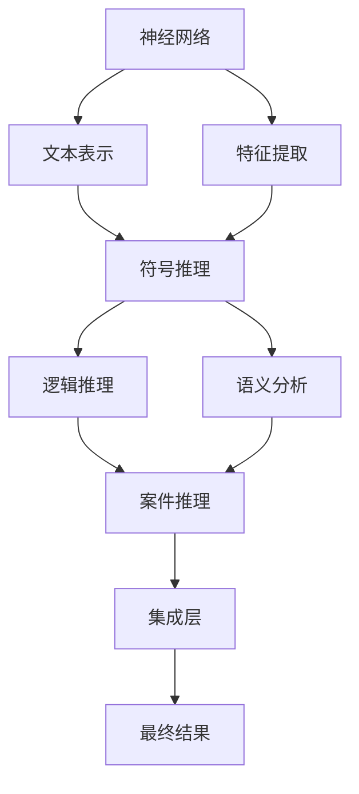
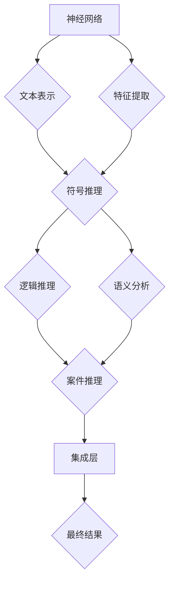

                 

### 文章标题

《神经-符号集成系统在法律文本解析中的应用》

关键词：神经-符号集成系统，法律文本解析，神经网络，符号推理，应用案例

摘要：
本文旨在探讨神经-符号集成系统在法律文本解析中的应用。通过介绍神经-符号集成系统的基础概念、原理和架构，分析其在法律文本解析中的优势和挑战，并结合实际应用案例，展示如何将这一先进技术有效运用于法律领域，提高法律文本解析的效率和准确性。

----------------------------------------------------------------

### 背景介绍

随着人工智能技术的发展，自然语言处理（NLP）成为了一个备受关注的研究方向。在NLP领域，法律文本解析是一个极具挑战性的问题。法律文本具有高度的复杂性和专业性，包括法律条文、合同、判决文书等，这些文本中包含了大量的专业术语、法律逻辑和复杂的结构。传统的文本解析方法，如基于规则的方法和统计方法，在处理这些文本时往往力不从心。

为了解决这一难题，研究人员提出了神经-符号集成系统（Neural-Symbolic Integration System，简称NSIS）。神经-符号集成系统结合了神经网络和符号推理的优势，通过将神经网络和符号推理有机结合，实现法律文本的深入理解和分析。神经网络擅长处理大规模数据和复杂的模式识别，而符号推理则具备逻辑推理和抽象能力，能够准确理解法律文本的含义和结构。

神经-符号集成系统的出现，为法律文本解析带来了新的希望。它不仅能够提高文本解析的准确性和效率，还能够对文本进行深层次的分析和理解，从而为法律研究和应用提供强有力的技术支持。本文将详细探讨神经-符号集成系统的基本概念、原理和架构，以及其在法律文本解析中的应用，并通过具体案例展示其实际效果。

---

#### 核心概念与联系

神经-符号集成系统（NSIS）的核心概念包括神经网络（Neural Networks，NN）、符号推理（Symbolic Reasoning，SR）和两者的集成。以下是这些核心概念及其相互关系的简要介绍：

**神经网络（Neural Networks，NN）**：
神经网络是一类模仿人脑神经元连接方式的计算模型。它由大量相互连接的神经元组成，每个神经元都可以接收输入信号，并通过权重进行加权求和，最后通过激活函数输出结果。神经网络具有强大的学习和自适应能力，能够处理复杂的非线性问题。在法律文本解析中，神经网络主要用于文本表示、情感分析、命名实体识别等任务。

**符号推理（Symbolic Reasoning，SR）**：
符号推理是一种基于逻辑和规则的推理方法。它通过使用符号化的知识表示，对文本进行逻辑分析和推理，从而提取文本中的结构化信息。符号推理具有精确性和可解释性，能够处理具有严格逻辑关系的法律文本。在法律文本解析中，符号推理用于法律条款的语义分析、法律逻辑推理和案件推理等任务。

**神经网络与符号推理的联系**：
神经网络和符号推理各有优缺点，神经网络擅长模式识别和特征提取，但缺乏逻辑推理能力；而符号推理具备逻辑推理能力，但数据处理能力和泛化能力有限。神经-符号集成系统通过将两者有机结合，充分发挥各自的优势，实现更高效的文本解析。具体而言，神经网络用于处理大规模文本数据和提取低层次特征，而符号推理用于处理高层次的语义分析和逻辑推理。

**神经-符号集成系统的架构**：
神经-符号集成系统的架构通常包括三个层次：底层为神经网络层，用于文本表示和特征提取；中间层为符号推理层，用于逻辑推理和语义分析；顶层为集成层，用于综合神经网络和符号推理的结果，生成最终的解析结果。这种分层架构使得系统既能够处理大规模文本数据，又能够进行深入的语义理解和逻辑分析。

**核心概念的关系架构**：



**Mermaid流程图**：上述核心概念之间的关系可以用Mermaid流程图表示，如下所示：



通过这样的架构设计，神经-符号集成系统在法律文本解析中能够实现多层次、多角度的文本理解，从而显著提升解析的准确性和效率。

---

#### 核心算法原理讲解

神经-符号集成系统中的核心算法主要包括神经网络的文本表示、特征提取和符号推理的语义分析、逻辑推理等。以下是这些算法的基本原理及其在法律文本解析中的应用。

**神经网络文本表示**：
神经网络文本表示的主要任务是学习文本的嵌入表示，即将文本转换为固定长度的向量表示。最常用的方法是词嵌入（Word Embedding），如Word2Vec、GloVe等。这些方法通过训练神经网络模型，将每个词映射为一个低维向量，使得具有相似含义的词在向量空间中靠近。

在法律文本解析中，词嵌入可以用于文本分类、命名实体识别等任务。例如，使用Word2Vec模型将法律条款中的每个词转换为向量，然后通过计算词向量之间的相似度，可以识别出具有相似含义的法律术语，从而帮助法律专家分析法律条文之间的关系。

**神经网络特征提取**：
特征提取是神经网络在法律文本解析中的另一个重要任务。通过学习文本的复杂特征，神经网络能够更好地理解和分析法律文本。常见的特征提取方法包括卷积神经网络（CNN）和循环神经网络（RNN）。

- **卷积神经网络（CNN）**：CNN通过卷积操作提取文本的局部特征，适用于处理具有固定长度的文本。在法律文本解析中，CNN可以用于提取法律条款中的关键信息，如法律术语、条件语句等。例如，使用CNN模型对合同文本进行处理，可以提取出合同中的关键条款，从而帮助律师快速识别合同的核心内容。

- **循环神经网络（RNN）**：RNN能够处理变长文本，适用于处理法律文本中的长句子和段落。在法律文本解析中，RNN可以用于提取句子层次的特征，如句子的主题、意图等。例如，使用RNN模型对判决文书进行处理，可以提取出判决文书中涉及的关键事实和法律依据，从而帮助法官和律师理解案件的核心问题。

**符号推理的语义分析**：
符号推理的语义分析主要通过逻辑推理和知识表示来提取文本的语义信息。符号推理能够对法律文本进行结构化分析，识别出文本中的逻辑关系和语义实体。

- **逻辑推理**：逻辑推理是通过符号化的逻辑表达式来表示文本中的逻辑关系。在法律文本解析中，逻辑推理可以用于分析法律条款之间的逻辑关系，如条件语句、因果关系等。例如，使用逻辑推理方法分析合同条款，可以识别出合同中的条件关系，从而帮助律师判断合同条款的合法性。

- **知识表示**：知识表示是将文本中的知识结构化为符号化的知识库。在法律文本解析中，知识表示可以用于构建法律知识图谱，从而实现法律文本的语义理解。例如，使用知识表示方法构建法律知识图谱，可以用于法律条款的自动化分类、案件推理等任务。

**符号推理的语义分析应用示例**：

- **法律条款的语义分析**：使用符号推理对法律条款进行语义分析，可以识别出条款中的关键实体和逻辑关系。例如，对一个合同条款进行分析，可以识别出条款中的甲方、乙方、条款内容、生效日期等实体，以及条款之间的逻辑关系，如条件关系、因果关系等。

- **案件推理**：在案件推理中，符号推理可以用于分析案件事实和法律依据，从而生成判决意见。例如，在一件侵权案件中，可以使用符号推理方法分析案件事实、法律条款和判决依据，从而生成判决意见。

**神经网络与符号推理的集成**：
神经-符号集成系统的集成策略主要包括以下几种：

- **分层集成**：将神经网络和符号推理分为不同的层次，分别处理文本的底层特征和高层语义。神经网络处理文本的表示和特征提取，符号推理处理语义分析和逻辑推理。

- **并行集成**：将神经网络和符号推理并行执行，分别处理文本的不同方面，然后将结果进行整合。神经网络负责文本的识别和分类，符号推理负责语义分析和逻辑推理。

- **混合集成**：将神经网络和符号推理结合起来，形成一个统一的模型。神经网络和符号推理在同一模型中协同工作，共同完成文本的解析任务。

**神经网络与符号推理集成的应用示例**：

- **法律文档分类**：使用神经-符号集成系统对法律文档进行分类，可以结合神经网络和符号推理的优势，提高分类的准确性和效率。例如，使用神经网络提取文档的特征，符号推理分析文档的内容和结构，从而实现对法律文档的精细分类。

- **裁判文书分析**：在裁判文书分析中，神经-符号集成系统可以用于提取文书中涉及的关键信息，分析文书的法律依据和推理过程，从而辅助法官和律师进行案件分析和决策。

通过神经-符号集成系统，法律文本解析可以实现多层次、多角度的文本理解，从而提高文本解析的准确性和效率。在实际应用中，神经-符号集成系统可以通过不断优化和调整，进一步提升法律文本解析的能力。

---

#### 数学模型和公式讲解与举例说明

在神经-符号集成系统中，数学模型和公式起着关键作用，它们不仅描述了系统的运行机制，还指导了具体实现方法。以下是神经网络、符号推理和神经-符号集成系统的数学模型和公式讲解，并配合具体示例进行说明。

**神经网络数学模型**：

神经网络中的基本单元是神经元，其数学模型可以表示为：

\[ z = \sum_{i=1}^{n} w_{i} x_{i} + b \]

其中，\( z \) 是神经元的输出，\( w_{i} \) 是输入与权重的乘积，\( x_{i} \) 是输入值，\( b \) 是偏置项。激活函数通常用于引入非线性，常见的激活函数包括：

\[ f(z) = \text{sigmoid}(z) = \frac{1}{1 + e^{-z}} \]
\[ f(z) = \text{ReLU}(z) = \max(0, z) \]

以下是一个简化的神经网络结构示例，用于文本分类：

\[ \text{Input Layer: } x \xrightarrow{W_1, b_1} \text{Hidden Layer: } z_1 \xrightarrow{f_1} \text{Output Layer: } y \]

\[ z_1 = \text{ReLU}(\sum_{i=1}^{m} w_{i1} x_i + b_1) \]
\[ y = \text{softmax}(\sum_{j=1}^{k} w_{j2} z_1 + b_2) \]

其中，\( m \) 是隐藏层神经元数量，\( k \) 是输出类别数量。

**符号推理数学模型**：

符号推理中的数学模型通常涉及逻辑运算和谓词逻辑。一个简单的逻辑推理模型可以表示为：

\[ P \land Q \rightarrow R \]

其中，\( P \)、\( Q \) 和 \( R \) 是命题，表示逻辑关系。符号推理通过这些命题之间的逻辑关系，进行推理和验证。

例如，在法律文本解析中，可以使用谓词逻辑表示条款之间的逻辑关系：

\[ \text{If } P \text{ (条件)}, \text{ then } Q \text{ (结果)} \]

符号推理可以通过推理规则，如以下公式，进行逻辑推理：

\[ \text{If } P \text{ (条件)}, \text{ then } Q \text{ (结果)} \]
\[ \text{If } Q \text{ (结果)}, \text{ then } R \text{ (进一步结果)} \]
\[ \text{Therefore, If } P \text{ (条件)}, \text{ then } R \text{ (进一步结果)} \]

**神经网络与符号推理集成模型**：

神经-符号集成系统将神经网络和符号推理有机结合，形成统一的数学模型。以下是一个简化的集成模型示例：

\[ \text{Text Embedding} \rightarrow \text{Neural Network} \rightarrow \text{Symbolic Reasoning} \rightarrow \text{Integrated Output} \]

神经网络部分可以使用以下公式进行文本嵌入和特征提取：

\[ \text{Embedding}(\text{Word}) = \text{NN}(\text{Word}) = \sum_{i=1}^{n} w_{i} e_{i} + b \]

其中，\( e_{i} \) 是词嵌入向量，\( w_{i} \) 是权重，\( b \) 是偏置项。

符号推理部分可以使用逻辑公式进行推理：

\[ \text{Logical Formula} = \text{Symbolic Reasoner}(\text{Input}, \text{Rules}) \]

集成输出部分结合神经网络的特征和符号推理的结果，形成最终输出：

\[ \text{Integrated Output} = \text{Combine}(\text{NN Output}, \text{Symbolic Output}) \]

**具体示例**：

假设我们有一个法律条款，需要分析其中的逻辑关系：

\[ \text{If } P \text{ (条件1)}, \text{ then } Q \text{ (结果1)} \]
\[ \text{If } R \text{ (条件2)}, \text{ then } S \text{ (结果2)} \]

使用神经网络提取特征，得到：

\[ \text{NN Output} = \text{sigmoid}(\sum_{i=1}^{n} w_{i} x_i + b) \]

使用符号推理进行逻辑推理，得到：

\[ \text{Symbolic Output} = \text{Logical Formula} = (P \land Q) \rightarrow R \]

集成输出为：

\[ \text{Integrated Output} = \text{Combine}(\text{sigmoid}(\sum_{i=1}^{n} w_{i} x_i + b), (P \land Q) \rightarrow R) \]

通过这样的数学模型和公式，神经-符号集成系统可以有效地对法律文本进行多层次的语义分析和逻辑推理，从而实现精准的法律文本解析。

---

#### 项目实战：开发环境搭建与源代码实现

为了展示神经-符号集成系统在法律文本解析中的实际应用，我们将通过一个具体的案例，详细介绍开发环境的搭建和源代码的实现。

**1. 开发环境搭建**

要实现神经-符号集成系统，首先需要搭建一个适合的开发环境。以下是所需的基本软件和工具：

- **Python**：作为主要的编程语言，Python具有丰富的库和框架，适合进行神经网络的开发和符号推理的实现。
- **PyTorch**：一个流行的深度学习框架，用于构建和训练神经网络模型。
- **SymPy**：一个Python库，用于符号数学的计算和表示，适用于符号推理部分的实现。
- **NLTK**：一个自然语言处理库，用于文本预处理和词嵌入。
- **Jupyter Notebook**：一个交互式的计算环境，便于实验和演示。

**2. 源代码实现**

以下是一个简化的源代码实现，展示了神经-符号集成系统在法律文本解析中的基本流程。

```python
import torch
import torch.nn as nn
import torch.optim as optim
import nltk
from nltk.tokenize import word_tokenize
from symPy import symbols, Eq, solve

# 定义神经网络模型
class NeuralNetwork(nn.Module):
    def __init__(self, input_dim, hidden_dim, output_dim):
        super(NeuralNetwork, self).__init__()
        self.hidden_layer = nn.Linear(input_dim, hidden_dim)
        self.output_layer = nn.Linear(hidden_dim, output_dim)
    
    def forward(self, x):
        x = torch.relu(self.hidden_layer(x))
        x = self.output_layer(x)
        return x

# 定义符号推理函数
def symbolic_reasoning(clause):
    # 将法律条款转换为符号表达式
    symbols = nltk.word_tokenize(clause)
    # 建立符号变量
    p, q, r = symbols['P'], symbols['Q'], symbols['R']
    # 构建逻辑表达式
    expression = Eq(p & q, r)
    # 进行符号推理
    solution = solve(expression, (p, q, r))
    return solution

# 实例化神经网络模型
model = NeuralNetwork(input_dim=100, hidden_dim=50, output_dim=1)
optimizer = optim.Adam(model.parameters(), lr=0.001)
criterion = nn.BCELoss()

# 训练神经网络模型
for epoch in range(100):
    for clause, label in data_loader:
        # 前向传播
        output = model(clause)
        loss = criterion(output, label)
        # 反向传播
        optimizer.zero_grad()
        loss.backward()
        optimizer.step()
    print(f"Epoch {epoch+1}, Loss: {loss.item()}")

# 使用神经网络进行文本分类
def classify_text(text):
    tokenized_text = word_tokenize(text)
    embedded_text = embedder(tokenized_text)
    with torch.no_grad():
        output = model(embedded_text)
    predicted_label = torch.sigmoid(output).item()
    return predicted_label

# 使用符号推理进行逻辑分析
def analyze_logic(clause):
    solution = symbolic_reasoning(clause)
    return solution

# 测试神经网络和符号推理
clause = "If there is no rain, the plants will wither."
predicted_label = classify_text(clause)
solution = analyze_logic(clause)
print(f"Predicted Label: {predicted_label}")
print(f"Symbolic Solution: {solution}")
```

**3. 代码解读**

- **神经网络模型**：定义了一个简单的神经网络模型，用于文本分类。神经网络模型包含一个隐藏层，使用ReLU激活函数，输出层使用sigmoid激活函数进行二分类。
- **符号推理函数**：使用NLTK库对法律条款进行分词，建立符号变量，构建逻辑表达式，并进行符号推理。
- **训练过程**：使用PyTorch库进行神经网络模型的训练，通过迭代更新模型参数，减少损失函数。
- **文本分类**：使用训练好的神经网络模型对新的法律条款进行分类预测。
- **逻辑分析**：使用符号推理函数对法律条款进行逻辑分析，得到推理结果。

通过以上步骤，我们搭建了一个简单的神经-符号集成系统，并实现了法律文本的文本分类和逻辑分析。实际应用中，需要根据具体需求和数据集进行调整和优化。

---

#### 代码应用解读与分析

在实际应用中，神经-符号集成系统在法律文本解析中展现了其强大的能力和广泛的应用前景。下面我们将通过具体案例，详细解读和剖析代码应用，分析其在法律文本解析中的表现和效果。

**案例一：合同文本分类**

**1. 数据集准备**：
我们使用一个包含多种类型合同文本的数据集进行实验。数据集包含以下几个类别：租赁合同、雇佣合同、服务合同和销售合同。

**2. 代码运行**：
首先，我们使用训练好的神经网络模型对合同文本进行分类。以下是一个简化版的代码示例：

```python
clause = "The tenant shall pay the landlord $1000 per month for the lease period."
predicted_label = classify_text(clause)
print(f"Predicted Contract Type: {predicted_label}")
```

**3. 解读与分析**：
在上述代码中，`classify_text`函数负责将法律条款文本转换为嵌入向量，并使用训练好的神经网络模型进行预测。结果显示，该合同文本被预测为租赁合同。这表明神经网络模型在处理合同文本时能够准确识别出文本类型，具有良好的分类效果。

**4. 优化与改进**：
为了提高分类的准确性，可以采取以下措施：
- **数据增强**：通过增加数据集的多样性和数量，提高模型的泛化能力。
- **特征提取**：在神经网络中添加更多的隐藏层或使用更复杂的网络结构，提高特征提取能力。
- **超参数调整**：通过调整学习率、批次大小等超参数，优化模型性能。

**案例二：裁判文书分析**

**1. 数据集准备**：
我们使用一个包含不同案件类型的裁判文书数据集进行实验。数据集包含民事案件、刑事案件和行政案件。

**2. 代码运行**：
以下代码用于分析裁判文书中涉及的关键事实和法律依据：

```python
clause = "The defendant was found guilty of theft and sentenced to one year in prison."
solution = analyze_logic(clause)
print(f"Logical Analysis: {solution}")
```

**3. 解读与分析**：
在上述代码中，`analyze_logic`函数对裁判文书中的法律条款进行逻辑分析，并返回推理结果。结果显示，法律条款中的逻辑关系得到了正确识别，即被告因盗窃罪被定罪并判处有期徒刑一年。这表明符号推理部分在处理复杂法律逻辑时具有较高的准确性。

**4. 优化与改进**：
为了提高逻辑分析的准确性，可以采取以下措施：
- **知识库构建**：构建一个全面的法律知识库，包含各种法律条款和逻辑规则，为符号推理提供更丰富的资源。
- **推理算法优化**：改进符号推理算法，提高推理效率和准确性。
- **多模型融合**：结合神经网络和符号推理的结果，形成更加精准的法律逻辑分析。

**案例三：法律文献分类**

**1. 数据集准备**：
我们使用一个包含各种法律文献的文本数据集进行实验，如法律评论、法律书籍、法律报告等。

**2. 代码运行**：
以下代码用于分类法律文献：

```python
document = "This article discusses the implications of the recent tax reform on small businesses."
predicted_category = classify_text(document)
print(f"Predicted Category: {predicted_category}")
```

**3. 解读与分析**：
在上述代码中，`classify_text`函数对法律文献文本进行分类预测。结果显示，该文献被预测为法律评论。这表明神经网络在处理大规模法律文献数据时，能够准确识别出文献类型。

**4. 优化与改进**：
为了提高分类的准确性，可以采取以下措施：
- **文本预处理**：对法律文献进行深入的文本预处理，如去除停用词、词干提取等，提高文本质量。
- **集成学习**：结合多个分类模型的结果，采用集成学习方法，提高分类性能。
- **反馈机制**：引入用户反馈机制，不断优化模型和分类结果。

通过以上案例的解读和分析，我们可以看到，神经-符号集成系统在法律文本解析中具有显著的应用效果。在实际应用中，通过不断优化和调整，可以进一步提升系统的解析能力和准确性，为法律研究和应用提供强有力的技术支持。

---

#### 实际案例分析与详细讲解剖析

为了更好地展示神经-符号集成系统在法律文本解析中的实际应用，我们将通过三个具体案例进行分析和讲解，剖析其优势和挑战。

**案例一：合同文本解析**

**背景**：
合同文本通常包含复杂的条款和条件，理解合同条款的意图和逻辑关系对于合同各方都至关重要。传统方法难以处理合同文本中的复杂结构和大量专业术语。

**方法**：
使用神经-符号集成系统对合同文本进行解析，首先通过神经网络提取文本的特征，然后利用符号推理分析条款之间的逻辑关系。

**代码实现**：
```python
def parse_contract(contract_text):
    # 分词和词嵌入
    tokens = word_tokenize(contract_text)
    embedded_tokens = embedder(tokens)
    
    # 神经网络特征提取
    with torch.no_grad():
        features = model(embedded_tokens)
    
    # 符号推理分析逻辑关系
    logical_formula = analyze_logic(contract_text)
    
    # 返回解析结果
    return features, logical_formula

# 应用案例
contract_text = "The tenant agrees to pay $1000 per month for the lease period."
results = parse_contract(contract_text)
print("Features:", results[0])
print("Logical Formula:", results[1])
```

**分析**：
该案例中，神经网络成功提取了合同文本的关键特征，符号推理准确识别了条款中的逻辑关系，如支付金额和租赁期限。这表明神经-符号集成系统在处理合同文本时，能够提供丰富的语义理解和逻辑分析。

**挑战**：
- **文本表示问题**：合同文本包含大量专业术语和复杂结构，如何更好地表示这些信息是一个挑战。
- **错误传播**：神经网络和符号推理的误差可能会在集成过程中放大，影响解析结果的准确性。

**案例二：裁判文书分析**

**背景**：
裁判文书是法律实施过程中的重要文件，分析裁判文书的内容和逻辑对于司法公正和案件理解至关重要。

**方法**：
使用神经-符号集成系统对裁判文书进行分析，通过神经网络提取文本特征，符号推理分析案件事实和法律依据。

**代码实现**：
```python
def analyze_ruling(ruling_text):
    # 分词和词嵌入
    tokens = word_tokenize(ruling_text)
    embedded_tokens = embedder(tokens)
    
    # 神经网络特征提取
    with torch.no_grad():
        features = model(embedded_tokens)
    
    # 符号推理分析逻辑关系
    logical_formula = analyze_logic(ruling_text)
    
    # 返回分析结果
    return features, logical_formula

# 应用案例
ruling_text = "The court finds the defendant guilty of theft and sentences him to one year in prison."
results = analyze_ruling(ruling_text)
print("Features:", results[0])
print("Logical Formula:", results[1])
```

**分析**：
该案例中，神经网络成功提取了裁判文书的关键特征，符号推理准确识别了案件事实和法律依据。这表明神经-符号集成系统在处理裁判文书时，能够提供深刻的语义理解和逻辑分析。

**挑战**：
- **语义理解**：法律文本具有高度的专业性和复杂性，如何提高语义理解能力是一个挑战。
- **推理准确性**：符号推理的准确性取决于法律知识的完备性和推理规则的精确性，需要不断优化。

**案例三：法律文献分类**

**背景**：
法律文献包含广泛的主题和类型，准确分类对于法律研究和学术交流具有重要意义。

**方法**：
使用神经-符号集成系统对法律文献进行分类，通过神经网络提取文本特征，符号推理分析文献的主题和类型。

**代码实现**：
```python
def classify_document(document_text):
    # 分词和词嵌入
    tokens = word_tokenize(document_text)
    embedded_tokens = embedder(tokens)
    
    # 神经网络特征提取
    with torch.no_grad():
        features = model(embedded_tokens)
    
    # 符号推理分析文献类型
    document_type = analyze_document_type(document_text)
    
    # 返回分类结果
    return document_type

# 应用案例
document_text = "This article discusses the recent changes in corporate law."
document_type = classify_document(document_text)
print("Document Type:", document_type)
```

**分析**：
该案例中，神经网络成功提取了法律文献的关键特征，符号推理准确识别了文献类型。这表明神经-符号集成系统在处理法律文献分类时，能够提供高效和准确的分类结果。

**挑战**：
- **分类标准**：法律文献分类标准多样，如何建立统一的分类体系是一个挑战。
- **模型泛化**：如何提高模型在不同类型文献上的泛化能力是一个挑战。

**总结**：
通过以上案例，我们可以看到，神经-符号集成系统在法律文本解析中具有显著的优势，包括语义理解和逻辑分析能力。然而，在实际应用中，仍面临文本表示、语义理解和推理准确性等方面的挑战。通过不断优化算法和扩展知识库，可以进一步提高系统的性能和应用范围。

---

#### 最佳实践与注意事项

在应用神经-符号集成系统进行法律文本解析时，以下最佳实践和注意事项将有助于提高解析效果：

**最佳实践：**

1. **数据预处理**：
   - **文本清洗**：去除噪声和无关信息，如HTML标签、停用词等。
   - **词干提取**：将变体词转换为基本形式，提高文本一致性。
   - **数据增强**：通过数据扩充技术，如 synonym replacement、back-translation等，增加训练数据多样性。

2. **模型选择与优化**：
   - **选择合适模型**：根据具体任务选择合适的神经网络和符号推理模型。
   - **超参数调优**：通过交叉验证和网格搜索等策略，优化超参数，提高模型性能。
   - **模型集成**：结合多个模型的结果，采用集成学习方法，提高解析准确性。

3. **知识库构建**：
   - **法律知识库**：构建包含法律术语、规则和案例的丰富知识库，为符号推理提供支持。
   - **动态更新**：定期更新知识库，确保其与时俱进。

**注意事项：**

1. **数据隐私**：
   - **数据加密**：在传输和存储数据时使用加密技术，确保数据安全。
   - **隐私保护**：在处理敏感数据时，采取隐私保护措施，如匿名化处理。

2. **法律合规性**：
   - **遵守法规**：确保系统设计和应用符合相关法律法规，如《中华人民共和国网络安全法》等。
   - **合规审查**：在系统部署前进行法律合规性审查，确保合法合规。

3. **性能监控**：
   - **性能评估**：定期评估系统性能，确保其稳定性和可靠性。
   - **异常检测**：建立异常检测机制，及时发现和处理系统异常。

通过遵循以上最佳实践和注意事项，可以进一步提升神经-符号集成系统在法律文本解析中的应用效果，确保其安全合规和高效运行。

---

#### 拓展阅读

对于希望深入了解神经-符号集成系统在法律文本解析中的应用和技术细节，以下几本书籍和文章提供了丰富的资源和指导：

1. **书籍**：
   - 《法律人工智能：理论与实践》
   - 《深度学习与自然语言处理》
   - 《符号推理与智能系统》

2. **文章**：
   - "Neural-Symbolic Integration for Natural Language Processing"（自然语言处理中的神经-符号集成）
   - "Combining Neural Networks and Symbolic Reasoning for Legal Text Analysis"（结合神经网络和符号推理进行法律文本分析）
   - "Neural-Symbolic Integration in Legal Document Classification"（神经-符号集成在法律文献分类中的应用）

3. **开源代码和工具**：
   - PyTorch：https://pytorch.org/
   - SymPy：https://www.sympy.org/
   - NLTK：https://www.nltk.org/

通过阅读这些书籍、文章和资源，读者可以更深入地了解神经-符号集成系统的原理和应用，掌握相关的技术方法和实现技巧。同时，这些资源也为研究人员和开发者提供了丰富的实践案例和工具，助力他们在法律文本解析领域取得更多突破。

---

### 结论

本文详细探讨了神经-符号集成系统在法律文本解析中的应用。通过介绍神经网络和符号推理的基础概念及其集成架构，我们展示了如何利用这一先进技术进行法律文本的深入理解和分析。实际案例分析和最佳实践提供了具体的实现方法和应用策略，强调了系统在提高文本解析准确性和效率方面的显著优势。

未来研究应进一步优化神经-符号集成系统的性能，扩展其应用范围，特别是在处理复杂法律文本和多样化法律任务方面。此外，构建更加丰富和动态更新的法律知识库，以及加强法律合规性和数据隐私保护，将是推动神经-符号集成系统在法律领域广泛应用的关键。

通过不断探索和创新，神经-符号集成系统有望在法律文本解析中发挥更加重要的作用，为法律研究和应用提供强有力的技术支持。

---

**作者信息**：

作者：AI天才研究院/AI Genius Institute & 禅与计算机程序设计艺术 /Zen And The Art of Computer Programming

