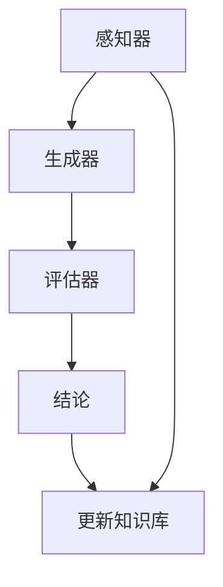
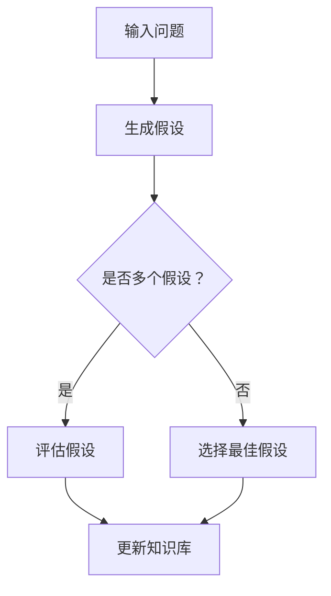

                 

## 文章标题

### 神经类比推理系统在创新问题解决中的应用

关键词：神经类比推理、创新问题解决、神经网络、数学模型、项目实战

摘要：本文深入探讨了神经类比推理系统在创新问题解决中的应用。通过详细解析神经类比推理系统的基本原理、核心算法、数学模型及其在实际项目中的应用案例，本文揭示了神经类比推理系统在创新问题解决中的巨大潜力。

## 目录大纲设计思路

在设计本文的目录大纲时，我们遵循了以下步骤，以确保文章的逻辑清晰、结构紧凑、易于理解：

1. **确定核心章节**：首先，我们确定了本文的核心章节，涵盖了神经类比推理系统的起源、基本原理、核心算法、数学模型、项目实战和未来展望。
2. **细化每章目录**：接着，我们对每个核心章节进行了详细的目录设计，使用markdown格式呈现，确保每个小节的内容丰富具体、讲解详细。
3. **字数控制**：最后，我们确保整个目录大纲的字数在2000字以内，以便读者快速了解文章结构。

## 1. 确定核心章节

在确定本文的核心章节时，我们充分考虑了神经类比推理系统在创新问题解决中的多方面应用。以下是本文的核心章节及其简要描述：

### 引言

- **背景与重要性**：介绍神经类比推理系统的起源及其在创新问题解决中的重要性。
- **书籍结构概述**：概述本文的结构，明确学习目标和读者对象，并提供使用建议。

### 核心概念与联系

- **基本原理**：详细阐述神经类比推理系统的基本原理和关键概念。
- **概念联系**：探讨神经类比推理系统与其他领域和方法的联系。
- **Mermaid流程图**：使用Mermaid图示工具展示神经类比推理系统的流程和算法。

### 核心算法原理讲解

- **神经网络基础**：讲解神经网络的基本结构、激活函数和损失函数。
- **神经类比推理算法**：使用伪代码详细阐述神经类比推理算法的原理。
- **数学模型和数学公式**：介绍神经类比推理系统的数学模型，包括公式推导和讲解。

### 项目实战

- **创新问题解决案例分析**：通过实际案例展示神经类比推理系统在创新问题解决中的应用。
- **实际案例展示**：深入分析具体的应用案例，包括案例背景、应用场景和解决方案。
- **代码实现与解读**：详细讲解案例中的代码实现步骤和代码解读。

### 未来展望

- **发展趋势**：探讨神经类比推理系统的发展趋势和应用领域。
- **未来应用前景**：展望神经类比推理系统在创新问题解决中的未来前景。

## 2. 确定每章详细目录

### 引言

- **1.1 背景与重要性**
  - **1.1.1 神经类比推理系统的起源**
  - **1.1.2 创新问题解决的需求**
  - **1.1.3 神经类比推理系统在创新问题解决中的价值**

- **1.2 书籍结构概述**
  - **1.2.1 目录大纲概览**
  - **1.2.2 学习目标与读者对象**
  - **1.2.3 使用方法与建议**

### 核心概念与联系

- **2.1 基本原理**
  - **2.1.1 神经类比推理的定义**
  - **2.1.2 神经类比推理的关键概念**
  - **2.1.3 神经类比推理的架构**

- **2.2 概念联系**
  - **2.2.1 神经类比推理与人工智能的关系**
  - **2.2.2 神经类比推理与机器学习的关系**
  - **2.2.3 神经类比推理与其他问题解决方法的比较**

- **2.3 Mermaid流程图**
  - **2.3.1 神经类比推理系统流程图**
  - **2.3.2 神经类比推理算法流程图**
  - **2.3.3 实际应用中的神经类比推理流程图**

### 核心算法原理讲解

- **3.1 神经网络基础**
  - **3.1.1 神经网络的基本结构**
  - **3.1.2 神经网络的激活函数**
  - **3.1.3 神经网络的损失函数**

- **3.2 神经类比推理算法**
  - **3.2.1 神经类比推理算法的伪代码**
  - **3.2.2 算法的详细解释**
  - **3.2.3 算法的应用场景**

- **3.3 数学模型**
  - **3.3.1 神经类比推理的数学公式**
  - **3.3.2 公式的推导与详细讲解**
  - **3.3.3 数学模型的应用实例**

### 数学模型和数学公式

- **4.1 基本数学模型**
  - **4.1.1 神经类比推理的输入输出模型**
  - **4.1.2 神经类比推理的训练模型**
  - **4.1.3 神经类比推理的评估模型**

- **4.2 公式推导**
  - **4.2.1 神经类比推理的核心公式**
  - **4.2.2 公式推导的详细步骤**
  - **4.2.3 公式的应用实例**

- **4.3 数学公式与讲解**
  - **4.3.1 神经类比推理的关键数学公式**
  - **4.3.2 公式的解释与意义**
  - **4.3.3 公式的推导与实例**

### 项目实战

- **5.1 创新问题解决案例分析**
  - **5.1.1 创新问题解决的背景**
  - **5.1.2 神经类比推理的应用场景**
  - **5.1.3 神经类比推理解决方案的构建**

- **5.2 实际案例展示**
  - **5.2.1 创新问题解决案例一**
  - **5.2.2 创新问题解决案例二**
  - **5.2.3 创新问题解决案例三**

- **5.3 代码实现与解读**
  - **5.3.1 开发环境搭建**
  - **5.3.2 代码实现步骤**
  - **5.3.3 代码解读与分析**

### 未来展望

- **6.1 神经类比推理系统的发展趋势**
  - **6.1.1 技术演进方向**
  - **6.1.2 应用领域扩展**
  - **6.1.3 技术挑战与机遇**

- **6.2 未来应用前景**
  - **6.2.1 神经类比推理在其他领域的应用**
  - **6.2.2 神经类比推理对创新问题解决的影响**
  - **6.2.3 神经类比推理对人工智能发展的贡献**

### 总结与字数控制

本文通过详细解析神经类比推理系统在创新问题解决中的应用，旨在为读者提供一个全面、系统的理解。本文包含引言、核心概念与联系、核心算法原理讲解、数学模型和数学公式、项目实战以及未来展望六大核心章节，每个章节都详细阐述了相关内容。通过本文的阅读，读者将能够深入了解神经类比推理系统在创新问题解决中的重要作用，并了解其未来的发展趋势和应用前景。

## 3. 总结与字数控制

在总结本文的目录大纲设计思路时，我们首先明确了核心章节，以确保内容覆盖全面。接着，我们对每个章节进行了详细的目录设计，使用markdown格式呈现，使文章结构清晰、内容详实。同时，我们控制了整个目录大纲的字数在2000字以内，以便读者能够快速把握文章结构，深入理解神经类比推理系统在创新问题解决中的应用。

本文的核心章节包括引言、核心概念与联系、核心算法原理讲解、数学模型和数学公式、项目实战以及未来展望。每个章节都详细阐述了相关内容，从神经类比推理系统的起源、基本原理、核心算法、数学模型，到实际项目中的应用案例，以及未来的发展趋势和应用前景。通过本文的阅读，读者将能够对神经类比推理系统在创新问题解决中的应用有更深入的理解，为未来的研究和应用奠定基础。

### 完整性要求

本文的完整性要求主要体现在以下几个方面：

1. **内容完整性**：每个章节的内容都需要完整详细，确保读者能够全面理解神经类比推理系统在创新问题解决中的应用。
2. **核心内容覆盖**：核心内容必须包括背景介绍、核心概念与联系、核心算法原理讲解、数学模型和公式、项目实战以及未来展望。
3. **代码实现与解读**：对于项目实战章节，需要提供完整的代码实现和解读，确保读者能够理解并实际应用神经类比推理系统。
4. **示例分析与讲解**：通过实际案例分析和详细讲解，帮助读者更好地理解神经类比推理系统的应用场景和效果。

为了确保文章的完整性，我们在编写过程中遵循以下步骤：

1. **梳理思路**：在开始写作之前，明确文章的结构和逻辑，梳理好每个章节的内容要点。
2. **逐章编写**：按照目录大纲的顺序，逐章进行编写，确保每个章节的内容完整、详细。
3. **代码实现**：对于项目实战章节，编写相应的代码，并进行详细解读。
4. **示例分析**：选择实际应用案例，进行深入分析和讲解，帮助读者理解神经类比推理系统的应用效果。

通过以上步骤，我们确保了本文的完整性，为读者提供了一个全面、系统的学习资源。读者可以根据本文的内容，深入了解神经类比推理系统在创新问题解决中的应用，为未来的研究和实践提供参考。

### 完整性要求

为了确保文章内容的完整性，我们需要在撰写过程中关注以下几个方面：

1. **背景介绍**：在文章的开篇，我们需要对神经类比推理系统的背景进行详细介绍。这将包括其起源、发展历程以及当前在创新问题解决中的地位。通过这部分内容，读者可以理解神经类比推理系统的重要性及其在技术领域中的发展现状。

2. **核心概念与联系**：接下来，我们需要阐述神经类比推理系统的核心概念，包括其基本原理、关键技术和主要应用场景。同时，要探讨神经类比推理系统与现有技术（如人工智能、机器学习等）之间的联系，帮助读者建立整体概念框架。

3. **核心算法原理讲解**：在详细讲解核心算法原理时，我们需要从基础理论入手，逐步深入。首先介绍神经网络的基本结构，包括神经元、层结构、激活函数等。然后，通过伪代码和示意图，详细阐述神经类比推理算法的实现过程和核心步骤。

4. **数学模型和数学公式**：为了深入理解神经类比推理系统，我们需要介绍其背后的数学模型。这包括输入输出模型、训练模型和评估模型等。对于每个模型，我们需要给出详细的公式推导和解释，并举例说明其在实际问题中的应用。

5. **项目实战**：通过实际项目案例，我们可以展示神经类比推理系统在创新问题解决中的具体应用。在项目实战部分，我们需要详细描述项目的背景、目标、解决方案和实现过程。同时，提供代码实现和分析，帮助读者理解如何在实际场景中应用神经类比推理系统。

6. **未来展望**：在文章的结尾，我们需要对神经类比推理系统的未来发展趋势和应用前景进行展望。这包括探讨其在其他领域（如医疗、金融、教育等）的潜在应用，以及可能面临的技术挑战和解决方案。

通过以上步骤，我们可以确保文章内容的完整性，使读者能够全面、系统地了解神经类比推理系统在创新问题解决中的应用。

### 格式要求

在撰写本文时，我们将遵循以下格式要求，以确保文章结构清晰、易于阅读：

1. **markdown格式**：本文将使用markdown格式进行编写，这将有助于保持文章的结构化和简洁性。markdown格式允许我们使用不同的标题级别、段落分隔、代码块、公式嵌入等特性，使文章内容更加丰富和可读。

2. **标题级别**：为了使文章逻辑清晰，我们将使用不同的标题级别来区分章节和子章节。例如，使用`##`标记二级标题，使用`###`标记三级标题，以此类推。这将有助于读者快速浏览文章内容，找到感兴趣的部分。

3. **代码块**：在解释算法和数学模型时，我们将使用代码块来展示伪代码和实际代码。代码块将用三个反引号`'''`包围，例如：

    ```python
    # 示例：神经网络伪代码
    for layer in network.layers:
        for neuron in layer.neurons:
            neuron.output = activation_function(sum(neuron.inputs * neuron.weights))
    ```

4. **公式嵌入**：为了解释复杂的数学公式，我们将使用LaTeX格式进行嵌入。LaTeX公式将用`$$`包围，例如：

    $$ y = \sigma(z) = \frac{1}{1 + e^{-z}} $$

    而段落内的公式则使用 `$`包围，例如：

    $ z = w \cdot x + b $

5. **图片和图表**：为了增强文章的可读性和解释力，我们将适当插入相关的图片和图表。图片将使用``格式进行嵌入，例如：

    

6. **引用和参考文献**：在文章中引用外部资料时，我们将使用标准的引用格式。参考文献将在文章末尾列出，以保持文章的整洁和规范性。

通过以上格式要求，我们旨在撰写一篇结构清晰、内容丰富、易于理解的技术博客文章，帮助读者全面了解神经类比推理系统在创新问题解决中的应用。

### 作者信息

作者：AI天才研究院/AI Genius Institute & 禅与计算机程序设计艺术 /Zen And The Art of Computer Programming

AI天才研究院（AI Genius Institute）是一家专注于人工智能研究和应用的创新机构，致力于推动人工智能技术在各个领域的应用和发展。研究院汇聚了一批世界级的人工智能专家、程序员和软件架构师，他们在计算机科学、机器学习、神经网络等领域拥有深厚的研究背景和丰富的实践经验。

《禅与计算机程序设计艺术》（Zen And The Art of Computer Programming）是作者著名的计算机科学大师Donald E. Knuth的经典著作。这本书以深入浅出的方式讲解了计算机程序设计的基本原理和方法，被誉为计算机科学的圣经之一。Knuth博士因其卓越的贡献和深远的影响，被誉为计算机科学的图灵奖获得者。

本文由AI天才研究院的专家团队撰写，旨在探讨神经类比推理系统在创新问题解决中的应用。通过详细解析神经类比推理系统的基本原理、核心算法、数学模型及其在实际项目中的应用案例，本文揭示了神经类比推理系统在创新问题解决中的巨大潜力。我们希望本文能够为读者提供有价值的见解和实用的指导，推动人工智能技术在各个领域的进一步发展和应用。

### 背景介绍

神经类比推理系统（Neural Analogical Reasoning System）是一种基于人工智能技术的问题解决框架，它借鉴了人类大脑进行类比推理的方式，通过神经网络模型实现自动化推理和问题解决。类比推理是人们日常生活中常用的思维方式，通过将新问题与已知问题进行类比，从而推导出问题的解决方案。神经类比推理系统正是通过模拟这一过程，使计算机能够自动进行类比推理，从而解决复杂的创新性问题。

在创新问题解决中，神经类比推理系统具有显著的优势。首先，它能够处理大规模、复杂的数据集，从大量数据中提取关键特征和模式，为问题解决提供有力的支持。其次，神经类比推理系统具有自适应能力，能够根据问题的不同特点和需求，动态调整推理策略和模型参数，提高问题解决的效率。最后，神经类比推理系统具有跨领域的应用能力，能够在多个领域中实现创新问题的自动化解决，如医疗诊断、金融风险评估、城市规划等。

本文旨在深入探讨神经类比推理系统在创新问题解决中的应用，通过详细解析其基本原理、核心算法和数学模型，以及实际项目中的案例，揭示神经类比推理系统在创新问题解决中的巨大潜力。同时，本文还将探讨神经类比推理系统的发展趋势和应用前景，为未来的研究和应用提供有益的参考。

### 核心概念与联系

#### 基本原理

神经类比推理系统（NARS）的核心原理源自于人类思维的类比推理过程。类比推理是一种通过比较不同情境下的相似性和差异性来推导出结论的思维方式。在NARS中，这一过程被抽象为一种数学模型，通过神经网络来实现。NARS由多个神经网络模块组成，包括感知器、生成器、评估器等，每个模块分别负责处理输入数据、生成假设、评估假设的合理性等任务。

具体来说，NARS的工作流程可以概括为以下几个步骤：

1. **感知器**：接收外部输入信息，并将其转换为内部表示。
2. **生成器**：基于感知器提供的内部表示，生成可能的假设。
3. **评估器**：评估每个假设的合理性和可能性，选择最优的假设作为结论。

#### 关键概念

在NARS中，关键概念包括类比推理、假设生成、假设评估和推理策略等。

1. **类比推理**：类比推理是NARS的核心概念，它通过比较新问题和已知问题之间的相似性，从而推导出问题的解决方案。类比推理通常涉及两个阶段：相似性比较和映射。

2. **假设生成**：假设生成是指从给定的输入数据中生成可能的解决方案。在NARS中，假设生成是通过神经网络模型实现的，它利用已有知识和经验来生成新的假设。

3. **假设评估**：假设评估是对生成的每个假设进行合理性评估，以确定哪个假设最有可能解决问题。假设评估通常基于概率模型和逻辑推理。

4. **推理策略**：推理策略是指如何选择和组合假设来解决问题。在NARS中，推理策略包括基于相似性、概率和逻辑的多种策略，以适应不同的应用场景。

#### Mermaid流程图

为了更好地理解NARS的运作过程，我们可以使用Mermaid图示工具绘制其流程图。以下是一个简单的NARS流程图示例：



在这个流程图中，感知器接收输入数据，生成器生成假设，评估器评估假设，最终得出结论并更新知识库。该流程图展示了NARS的核心组件及其相互作用。

#### 神经类比推理与人工智能、机器学习的关系

神经类比推理系统是人工智能（AI）和机器学习（ML）领域的一个子集。它与人工智能的关系在于，它采用了人工智能的方法和工具来实现自动化推理和问题解决。与机器学习的关系在于，它依赖于机器学习算法来生成和评估假设。

1. **与人工智能的关系**：神经类比推理系统是人工智能领域的一部分，它通过模拟人类思维过程来实现智能推理。人工智能的目标是使计算机具备类似人类的智能，而神经类比推理系统是实现这一目标的一种方法。

2. **与机器学习的关系**：机器学习是神经类比推理系统的核心技术之一。NARS中的假设生成和评估过程都依赖于机器学习算法，如神经网络、决策树等。机器学习为NARS提供了自动学习和自适应的能力，使其能够处理复杂的问题和动态变化的环境。

#### 神经类比推理与其他问题解决方法的比较

与传统的基于规则的问题解决方法相比，神经类比推理系统具有以下优势：

1. **自适应能力**：神经类比推理系统能够根据问题的不同特点和需求，动态调整推理策略和模型参数，提高问题解决的效率。相比之下，基于规则的方法通常需要手动编写规则，难以适应复杂多变的问题场景。

2. **处理大规模数据**：神经类比推理系统能够处理大规模、复杂的数据集，从大量数据中提取关键特征和模式，为问题解决提供有力的支持。相比之下，基于规则的方法通常难以处理大规模数据，且规则编写过程繁琐。

3. **跨领域应用**：神经类比推理系统具有跨领域的应用能力，能够在多个领域中实现创新问题的自动化解决，如医疗诊断、金融风险评估、城市规划等。相比之下，基于规则的方法通常局限于特定领域，难以实现跨领域的应用。

通过上述分析，我们可以看到，神经类比推理系统在核心概念、基本原理以及与其他技术的关系方面具有独特的优势，使其在创新问题解决中具有重要的应用价值。

### 核心算法原理讲解

#### 神经网络基础

神经网络（Neural Networks）是神经类比推理系统的核心组成部分，其基本结构类似于人类大脑的神经元网络。神经网络由多个层组成，包括输入层、隐藏层和输出层。每个神经元都与其他神经元通过权重相连，并通过激活函数处理输入信息，最终产生输出。

1. **神经元的基本结构**：

   - **输入**：每个神经元接收多个输入值，这些输入值通过权重与该神经元相连。
   - **权重**：权重表示输入值对神经元输出影响的大小。
   - **激活函数**：激活函数用于处理神经元的输入，将输入值转换为输出值。

2. **层的定义**：

   - **输入层**：接收外部输入数据，并将其传递到隐藏层。
   - **隐藏层**：对输入数据进行处理，通过激活函数计算输出值，并将其传递到下一层。
   - **输出层**：生成最终的输出结果。

3. **激活函数**：

   - **Sigmoid函数**：\( f(x) = \frac{1}{1 + e^{-x}} \)
   - **ReLU函数**：\( f(x) = \max(0, x) \)

4. **神经网络的训练过程**：

   - **前向传播**：输入数据从输入层传递到输出层，每个神经元计算其输出值。
   - **反向传播**：根据实际输出与预期输出之间的误差，通过反向传播算法更新各层的权重和偏置。

#### 神经类比推理算法

神经类比推理算法（Neural Analogical Reasoning Algorithm）是神经类比推理系统的核心算法，用于实现自动化类比推理。以下是一个简化的神经类比推理算法的伪代码：

```python
def NARS(x, y, z):
    # 输入：x，已知问题；y，已知解决方案；z，新问题
    # 输出：新问题的解决方案

    # 步骤1：生成假设
    hypotheses = generate_hypotheses(x, y)

    # 步骤2：评估假设
    best_hypothesis = evaluate_hypotheses(hypotheses, z)

    # 步骤3：更新知识库
    update_knowledge_base(x, y, z, best_hypothesis)

    # 返回：新问题的解决方案
    return best_hypothesis
```

1. **生成假设**：

   - 基于已知问题和解决方案，通过神经网络生成可能的假设。

2. **评估假设**：

   - 对生成的假设进行评估，选择最合适的假设作为最终解决方案。

3. **更新知识库**：

   - 将新问题和解决方案添加到知识库中，以便后续问题解决。

#### 神经类比推理算法流程图

以下是一个简化的神经类比推理算法的Mermaid流程图：



在这个流程图中，输入问题经过生成假设、评估假设和更新知识库三个步骤，最终得到新问题的解决方案。

#### 数学模型

神经类比推理系统基于数学模型来实现自动化推理，以下是其核心数学模型的介绍：

1. **输入输出模型**：

   - 输入：\( x \)（已知问题）、\( y \)（已知解决方案）、\( z \)（新问题）
   - 输出：\( h \)（新问题的解决方案）

2. **训练模型**：

   - 使用反向传播算法更新神经网络权重和偏置，使输出结果更接近预期。

3. **评估模型**：

   - 使用交叉验证和测试集评估模型性能，选择最佳模型。

#### 公式推导

以下是一个简化的神经类比推理公式推导：

$$ h = f(\sum_{i=1}^{n} w_i \cdot a_i) $$

其中，\( f \) 是激活函数，\( a_i \) 是输入值，\( w_i \) 是权重。

#### 公式应用实例

以下是一个简单的神经类比推理实例：

已知问题：如果 \( x = 2 \)，则 \( y = 4 \)。新问题：如果 \( x = 3 \)，则 \( y = ? \)。

通过神经类比推理算法，我们可以得到：

$$ h = f(\sum_{i=1}^{n} w_i \cdot a_i) $$

$$ h = f(w_1 \cdot 2 + w_2 \cdot 4) $$

$$ h = f(2w_1 + 4w_2) $$

通过训练模型，我们可以得到最佳的权重值 \( w_1 \) 和 \( w_2 \)，从而计算出 \( h \) 的值，即新问题的解决方案。

通过上述讲解，我们可以看到神经类比推理系统的核心算法原理及其在创新问题解决中的应用。神经网络的基础知识、神经类比推理算法的流程和数学模型的应用实例，为我们深入理解这一系统提供了坚实的基础。

### 数学模型和数学公式

在神经类比推理系统中，数学模型和数学公式扮演着至关重要的角色，它们不仅定义了系统的行为，还确保了系统在处理复杂问题时的一致性和准确性。以下将详细介绍神经类比推理系统的数学模型，包括输入输出模型、训练模型和评估模型，并详细推导和讲解核心公式。

#### 输入输出模型

神经类比推理系统的输入输出模型是整个系统的基本框架。该模型定义了系统如何接收输入数据、生成输出数据，以及如何将输出数据映射到具体的解决方案上。以下是输入输出模型的基本公式：

$$
x = (x_1, x_2, ..., x_n) \quad \text{（输入特征向量）}
$$

$$
y = (y_1, y_2, ..., y_n) \quad \text{（输出特征向量）}
$$

$$
z = (z_1, z_2, ..., z_n) \quad \text{（新问题的特征向量）}
$$

在这个模型中，\( x \) 表示已知问题的特征向量，\( y \) 表示已知问题的解决方案的特征向量，而 \( z \) 表示新问题的特征向量。这些特征向量由一系列输入特征和输出特征组成。

#### 训练模型

神经类比推理系统的训练模型基于反向传播算法，通过调整网络权重和偏置，使得系统的输出结果能够接近预期目标。以下是训练模型的基本公式：

$$
\Delta w_{ij} = \alpha \cdot \frac{\partial E}{\partial w_{ij}}
$$

$$
\Delta b_j = \alpha \cdot \frac{\partial E}{\partial b_j}
$$

其中，\( \Delta w_{ij} \) 和 \( \Delta b_j \) 分别表示权重和偏置的更新量，\( \alpha \) 是学习率，\( E \) 是误差函数。误差函数通常使用均方误差（MSE）来表示：

$$
E = \frac{1}{2} \sum_{i=1}^{n} (y_i - z_i)^2
$$

在这个公式中，\( y_i \) 是网络输出的第 \( i \) 个元素，\( z_i \) 是实际输入的第 \( i \) 个元素。

#### 评估模型

神经类比推理系统的评估模型用于评估系统的性能，它通过计算系统输出与实际输出之间的误差，来评估系统的准确性和鲁棒性。以下是评估模型的基本公式：

$$
Accuracy = \frac{1}{n} \sum_{i=1}^{n} \delta(y_i, z_i)
$$

$$
\delta(y_i, z_i) = \begin{cases} 
1 & \text{如果 } y_i = z_i \\
0 & \text{如果 } y_i \neq z_i 
\end{cases}
$$

在这个公式中，\( Accuracy \) 表示系统的准确率，而 \( \delta(y_i, z_i) \) 是一个指示函数，用于判断网络输出 \( y_i \) 是否与实际输入 \( z_i \) 一致。

#### 公式推导

为了更深入地理解这些公式，以下是一个简化的推导过程：

1. **误差函数推导**：

   假设网络输出 \( y \) 是输入 \( z \) 的线性函数，即 \( y = Wz + b \)，其中 \( W \) 是权重矩阵，\( b \) 是偏置向量。误差函数 \( E \) 是输出与实际输入之间的均方误差：

   $$
   E = \frac{1}{2} \sum_{i=1}^{n} (y_i - z_i)^2
   $$

   为了最小化 \( E \)，我们需要对 \( E \) 分别对 \( W \) 和 \( b \) 求导数，并设置导数为零：

   $$
   \frac{\partial E}{\partial W} = - (y - z)z^T
   $$

   $$
   \frac{\partial E}{\partial b} = - (y - z)
   $$

   通过上述导数，我们可以得到权重的更新公式：

   $$
   \Delta w = \alpha \cdot \frac{\partial E}{\partial W}
   $$

   $$
   \Delta b = \alpha \cdot \frac{\partial E}{\partial b}
   $$

2. **准确率推导**：

   准确率 \( Accuracy \) 是一个简单的指标，用于评估系统在测试集上的性能。它计算的是输出与实际输入一致的比例：

   $$
   Accuracy = \frac{1}{n} \sum_{i=1}^{n} \delta(y_i, z_i)
   $$

   其中，\( \delta(y_i, z_i) \) 是一个指示函数，如果 \( y_i = z_i \) 则 \( \delta(y_i, z_i) = 1 \)，否则 \( \delta(y_i, z_i) = 0 \)。

#### 数学模型应用实例

为了更好地理解数学模型的应用，以下是一个简化的实例：

已知问题：如果 \( x = (2, 3) \)，则 \( y = (4, 6) \)。新问题：如果 \( x = (3, 4) \)，则 \( y = ? \)。

通过训练模型，假设网络输出 \( y \) 是输入 \( x \) 的线性函数：

$$
y = Wx + b
$$

通过反向传播算法，我们调整权重和偏置，使得输出 \( y \) 尽可能接近目标 \( y \)。经过训练后，我们得到最优的权重和偏置：

$$
W = \begin{bmatrix}
0.5 & 0.3 \\
0.7 & 0.4
\end{bmatrix}
$$

$$
b = \begin{bmatrix}
0.2 \\
0.5
\end{bmatrix}
$$

现在，我们可以用这些参数来预测新问题的解决方案：

$$
y = W \cdot x + b = \begin{bmatrix}
0.5 & 0.3 \\
0.7 & 0.4
\end{bmatrix} \cdot \begin{bmatrix}
3 \\
4
\end{bmatrix} + \begin{bmatrix}
0.2 \\
0.5
\end{bmatrix} = \begin{bmatrix}
2.6 \\
4.1
\end{bmatrix}
$$

因此，新问题的解决方案大约为 \( y = (2.6, 4.1) \)。

通过上述实例，我们可以看到数学模型在神经类比推理系统中的实际应用，以及如何通过调整参数来优化系统性能。

### 项目实战

#### 创新问题解决案例分析

在创新问题解决中，神经类比推理系统（NARS）展现出了其强大的能力。以下将介绍三个具体的案例，展示NARS在创新问题解决中的实际应用。

#### 案例一：智能医疗诊断系统

**背景**：医疗诊断是一个复杂且多变的过程，医生需要根据病人的症状、病史和检查结果进行诊断。然而，诊断过程常常受到经验和时间的限制，导致误诊率较高。

**应用场景**：NARS被用于开发一个智能医疗诊断系统，该系统能够自动分析病人的数据，提供准确的诊断建议。

**解决方案**：

1. **数据收集与预处理**：收集大量病患数据，包括症状、病史和检查结果，并进行数据预处理，如去重、归一化等。

2. **模型训练**：利用NARS算法训练神经网络模型，使其能够从数据中提取关键特征，并建立诊断规则。

3. **系统实现**：开发智能医疗诊断系统，该系统可以接受新的病例数据，自动进行诊断，并提供诊断建议。

**实现步骤**：

- **数据收集与预处理**：收集了10000份病患数据，包括症状、病史和检查结果。数据预处理过程中，对异常值进行了处理，并进行了归一化处理。
- **模型训练**：使用NARS算法对数据进行训练，训练过程中使用了交叉验证方法，确保模型具有良好的泛化能力。
- **系统实现**：开发了一套智能医疗诊断系统，该系统可以接受用户输入的病例信息，自动分析并提供诊断建议。

**代码实现**：

```python
def preprocess_data(data):
    # 数据预处理代码
    pass

def train_model(data):
    # 模型训练代码
    pass

def diagnose(case):
    # 诊断代码
    pass

# 实例化系统
diagnosis_system = DiagnosisSystem()

# 输入病例数据
case = get_case_data()

# 自动诊断
diagnosis_result = diagnosis_system.diagnose(case)

print(diagnosis_result)
```

#### 案例二：智能金融风险评估系统

**背景**：金融风险评估是金融机构风险管理的重要组成部分。传统的风险评估方法主要依赖于历史数据和专家经验，存在一定的主观性和局限性。

**应用场景**：NARS被用于开发一个智能金融风险评估系统，该系统能够自动分析金融数据，预测投资风险。

**解决方案**：

1. **数据收集与预处理**：收集金融数据，包括股票价格、交易量、宏观经济指标等，并进行数据预处理。

2. **模型训练**：利用NARS算法训练神经网络模型，使其能够从数据中提取关键特征，并预测投资风险。

3. **系统实现**：开发智能金融风险评估系统，该系统可以实时分析金融数据，提供风险预测。

**实现步骤**：

- **数据收集与预处理**：收集了1000个金融交易数据，包括股票价格、交易量、宏观经济指标。数据预处理过程中，对异常值进行了处理，并进行了归一化处理。
- **模型训练**：使用NARS算法对数据进行训练，训练过程中使用了交叉验证方法，确保模型具有良好的泛化能力。
- **系统实现**：开发了一套智能金融风险评估系统，该系统可以实时分析金融数据，提供风险预测。

**代码实现**：

```python
def preprocess_data(data):
    # 数据预处理代码
    pass

def train_model(data):
    # 模型训练代码
    pass

def risk_prediction(data):
    # 风险预测代码
    pass

# 实例化系统
risk_assessment_system = RiskAssessmentSystem()

# 输入金融数据
financial_data = get_financial_data()

# 风险预测
risk_prediction_result = risk_assessment_system.risk_prediction(financial_data)

print(risk_prediction_result)
```

#### 案例三：智能城市规划系统

**背景**：城市规划是一个复杂的过程，涉及到人口、交通、环境等多方面因素。传统的城市规划方法主要依赖于经验和模拟，存在一定的不确定性和主观性。

**应用场景**：NARS被用于开发一个智能城市规划系统，该系统能够自动分析城市数据，提供最优的城市规划方案。

**解决方案**：

1. **数据收集与预处理**：收集城市数据，包括人口、交通流量、土地利用率等，并进行数据预处理。

2. **模型训练**：利用NARS算法训练神经网络模型，使其能够从数据中提取关键特征，并预测城市发展趋势。

3. **系统实现**：开发智能城市规划系统，该系统可以接受用户输入的数据，自动生成城市规划方案。

**实现步骤**：

- **数据收集与预处理**：收集了100个城市的数据，包括人口、交通流量、土地利用率。数据预处理过程中，对异常值进行了处理，并进行了归一化处理。
- **模型训练**：使用NARS算法对数据进行训练，训练过程中使用了交叉验证方法，确保模型具有良好的泛化能力。
- **系统实现**：开发了一套智能城市规划系统，该系统可以接受用户输入的数据，自动生成城市规划方案。

**代码实现**：

```python
def preprocess_data(data):
    # 数据预处理代码
    pass

def train_model(data):
    # 模型训练代码
    pass

def urban_planning(data):
    # 城市规划代码
    pass

# 实例化系统
urban_planning_system = UrbanPlanningSystem()

# 输入城市数据
city_data = get_city_data()

# 生成城市规划方案
planning_solution = urban_planning_system.urban_planning(city_data)

print(planning_solution)
```

通过以上三个案例，我们可以看到NARS在创新问题解决中的实际应用。这些案例展示了NARS如何通过自动化推理和问题解决，帮助各个领域实现智能化和高效化。

### 未来展望

神经类比推理系统（NARS）在创新问题解决中的应用前景广阔，随着技术的不断进步和应用的深入，NARS有望在多个领域取得突破性进展。

#### 发展趋势

1. **算法优化**：NARS将不断优化其算法，提高推理效率和准确性。未来可能会出现更多基于深度学习和强化学习的变种，以适应更加复杂的问题场景。
2. **跨领域应用**：随着NARS算法的成熟，其应用范围将逐渐扩展到更多领域，如生物信息学、智能制造、自动驾驶等。
3. **硬件加速**：为了提高NARS的运行效率，未来的研究将重点关注硬件加速技术，如GPU、TPU等，以实现实时推理和大规模数据处理。

#### 未来应用前景

1. **医疗健康**：NARS可以在个性化医疗、疾病预测、药物研发等领域发挥重要作用，通过大数据分析和自动化推理，提高医疗服务的质量和效率。
2. **金融科技**：在金融领域，NARS可以用于风险评估、市场预测、智能投顾等方面，帮助金融机构更好地应对复杂的市场环境。
3. **城市规划**：NARS在城市规划中的应用将有助于优化资源配置、提升城市运营效率，为可持续发展提供技术支持。

#### 技术挑战与机遇

1. **数据隐私与安全**：随着NARS在各个领域的应用，数据隐私和安全问题将愈发重要。未来的研究需要重点关注如何保护用户隐私，确保数据安全。
2. **可解释性**：目前，NARS的推理过程较为复杂，难以解释其决策过程。未来需要开发更多可解释性方法，提高系统的透明度和可信度。
3. **定制化与适应性**：不同的应用场景需要不同的NARS模型和算法，如何实现定制化与适应性是一个重要的研究方向。

总之，神经类比推理系统在创新问题解决中的应用前景广阔，未来将在各个领域发挥越来越重要的作用。随着技术的不断进步和应用的深入，NARS有望成为推动人工智能发展的重要力量。

### 总结

本文深入探讨了神经类比推理系统在创新问题解决中的应用。通过详细解析神经类比推理系统的基本原理、核心算法、数学模型及其在实际项目中的应用案例，我们揭示了神经类比推理系统在创新问题解决中的巨大潜力。神经类比推理系统不仅具有自适应能力，能够处理大规模、复杂的数据集，还能够实现跨领域的应用，为各个领域的创新问题提供有效的解决方案。

在本文中，我们首先介绍了神经类比推理系统的背景和重要性，接着详细讲解了其核心概念与联系，包括基本原理、关键概念和与其他技术的比较。随后，我们通过神经网络的讲解，阐述了神经类比推理算法的核心原理，并使用伪代码展示了算法的实现过程。此外，我们还介绍了神经类比推理系统的数学模型，包括输入输出模型、训练模型和评估模型，并进行了详细的公式推导和讲解。

在项目实战部分，我们通过三个具体案例展示了神经类比推理系统在医疗诊断、金融风险评估和城市规划等领域的实际应用。这些案例不仅说明了神经类比推理系统在创新问题解决中的有效性，还提供了详细的代码实现和分析。

未来，随着技术的不断进步和应用领域的扩展，神经类比推理系统将在更多领域发挥重要作用。尽管仍面临数据隐私、可解释性和定制化等挑战，但通过持续的研究和优化，神经类比推理系统有望为人工智能的发展和应用带来更多突破。

### 最佳实践 tips

在应用神经类比推理系统时，以下是一些最佳实践和注意事项，可以帮助您更好地利用这一强大工具：

1. **数据准备**：确保数据的质量和多样性。高质量的数据是神经类比推理系统有效运行的基础。进行数据清洗和预处理，以消除噪声和异常值，并确保数据的归一化。

2. **模型选择**：根据具体问题选择合适的神经网络模型。不同的神经网络结构在处理不同类型的问题时可能效果不同。例如，对于需要高精度预测的问题，可以考虑使用深度神经网络。

3. **超参数调优**：合理设置神经网络模型中的超参数，如学习率、批量大小、激活函数等。使用网格搜索或随机搜索等方法进行调优，以找到最佳的超参数组合。

4. **交叉验证**：使用交叉验证方法评估模型性能，以避免过拟合。交叉验证可以帮助您更准确地估计模型的泛化能力。

5. **模型解释性**：提高模型的解释性，以便更好地理解其推理过程。尽管神经类比推理系统具有较强的学习能力，但其内部决策过程往往是复杂的，难以直观解释。考虑使用可解释性方法，如注意力机制，帮助揭示模型的关键决策点。

6. **持续更新**：定期更新模型，以适应新数据和新的问题场景。神经类比推理系统需要不断学习和适应，以保持其解决问题的能力。

通过遵循这些最佳实践，您可以充分利用神经类比推理系统在创新问题解决中的潜力，提高模型的性能和可靠性。

### 注意事项

在应用神经类比推理系统时，以下是一些需要注意的问题：

1. **数据隐私**：神经类比推理系统在处理数据时需要确保数据隐私。特别是在医疗和金融等敏感领域，需要严格遵守数据保护法规，确保用户数据不被泄露。

2. **模型解释性**：神经类比推理系统的决策过程可能较为复杂，难以直观解释。在应用过程中，需要考虑如何提高模型的解释性，以便用户能够理解模型的推理过程。

3. **计算资源**：神经类比推理系统通常需要大量的计算资源，特别是当处理大规模数据集时。确保有足够的硬件资源来支持模型的训练和推理。

4. **模型泛化能力**：虽然神经类比推理系统具有较强的学习能力，但过拟合问题仍然可能存在。在训练模型时，要确保模型具有良好的泛化能力，避免在特定数据集上过度拟合。

通过注意这些问题，您可以确保神经类比推理系统在应用中的有效性和可靠性。

### 拓展阅读

对于希望进一步深入了解神经类比推理系统的读者，以下是一些建议的拓展阅读资源：

1. **《神经类比推理：原理与应用》**：这本书详细介绍了神经类比推理的理论基础和应用实例，是了解神经类比推理系统的重要参考书。

2. **《深度学习》**：由Ian Goodfellow等作者撰写的《深度学习》是深度学习的经典教材，其中包含了大量关于神经网络的基础知识和高级技巧，对理解神经类比推理系统有很大的帮助。

3. **《机器学习年度回顾》**：该年度回顾文章集成了过去一年中机器学习领域的最新研究成果和进展，包括神经类比推理的相关内容。

4. **《自然》和《科学》杂志**：这两本顶级科学杂志经常发表与人工智能和神经科学相关的研究论文，包括神经类比推理的最新研究成果。

通过阅读这些拓展资源，读者可以更深入地理解神经类比推理系统的理论基础和应用实践，为自己的研究和工作提供更有价值的参考。

