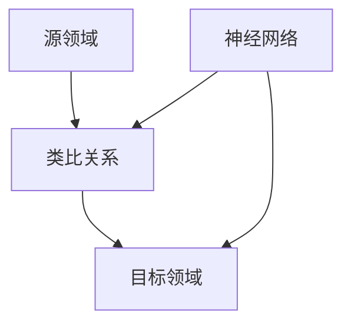

                 

### 文章标题：神经类比转移学习在跨域推理中的新突破

#### 关键词：神经类比转移学习，跨域推理，深度学习，算法，人工智能

#### 摘要：
神经类比转移学习作为一种新兴的机器学习技术，正迅速在跨域推理中展现其独特优势。本文将深入探讨神经类比转移学习的基本原理、核心算法以及其实际应用，分析其在计算机视觉、自然语言处理等领域的突破，并展望其未来发展趋势。

### 引言

随着人工智能技术的不断发展，深度学习在图像识别、自然语言处理等领域取得了显著的成果。然而，深度学习模型往往在一个特定的数据集上训练，并在类似的数据集上表现良好，但面对不同领域或数据分布时，其性能却大打折扣。这种局限性与现实世界中跨领域任务的需求形成了鲜明对比。因此，如何提高模型在跨领域任务中的表现成为了一个关键问题。

神经类比转移学习（Neural Analogy Transfer Learning）作为一种新的方法，通过在源领域和目标领域之间建立类比关系，实现了知识的有效迁移，从而提高了模型在跨领域任务中的表现。本文将详细探讨神经类比转移学习的基本概念、核心算法及其在跨领域推理中的应用，分析其在实际应用中的优势和挑战。

### 神经类比转移学习的基本概念

#### 定义与背景

神经类比转移学习是一种利用神经网络进行知识迁移的方法。其核心思想是通过在源领域和目标领域之间建立类比关系，将源领域的知识迁移到目标领域，从而提高模型在目标领域的表现。类比关系通常是基于领域间的相似性或共享的抽象概念。

#### 核心概念与联系

为了更好地理解神经类比转移学习，我们需要了解以下几个核心概念：

1. **源领域（Source Domain）**：源领域是指模型已经学习到知识的数据集，模型在该领域上进行了训练和优化。
2. **目标领域（Target Domain）**：目标领域是指模型尚未学习或未完全学习的领域，模型需要在该领域上表现出良好的性能。
3. **类比关系（Analogical Relationship）**：类比关系是指源领域和目标领域之间的相似性或共享的抽象概念。这种相似性可以基于领域间的特征分布、任务结构或语义关系。

为了更直观地展示这些核心概念之间的关系，我们可以使用 Mermaid 流程图来描述：



在这个流程图中，源领域和目标领域通过类比关系相连，神经网络在源领域和目标领域之间传递知识。

### 核心算法原理讲解

神经类比转移学习的关键在于如何有效地建立类比关系，并将源领域的知识迁移到目标领域。以下是一个简化的算法原理，使用伪代码进行阐述：

```python
# 定义神经网络模型
model = NeuralNetwork()

# 在源领域训练模型
for epoch in range(num_epochs):
    for data in source_data:
        model.train(data)

# 建立类比关系
analogical_relation = find_analogical_relation(source_domain, target_domain)

# 在目标领域迁移知识
for data in target_data:
    model.apply_analogical_relation(analogical_relation)
    model.train(data)

# 评估模型在目标领域的性能
performance = model.evaluate(target_domain)
```

在上面的伪代码中，我们首先在源领域训练神经网络模型，然后通过 `find_analogical_relation` 函数建立类比关系。在目标领域，我们利用这个类比关系来迁移源领域的知识，并在目标领域继续训练模型。最后，我们评估模型在目标领域的性能。

### 数学模型和公式

神经类比转移学习涉及多个数学模型和公式，以下是一些关键的数学概念和公式：

1. **损失函数**：损失函数用于衡量模型在源领域和目标领域上的性能。常用的损失函数有均方误差（MSE）和交叉熵（Cross-Entropy）。

$$
L = \frac{1}{2} \sum_{i=1}^{n} (y_i - \hat{y}_i)^2
$$

其中，$y_i$ 是真实标签，$\hat{y}_i$ 是模型预测值。

2. **正则化**：正则化用于防止模型过拟合，常用的正则化方法有L1正则化和L2正则化。

$$
L_{\text{reg}} = \lambda \sum_{i=1}^{n} \sum_{j=1}^{m} |w_{ij}|
$$

$$
L_{\text{reg}} = \lambda \sum_{i=1}^{n} \sum_{j=1}^{m} w_{ij}^2
$$

其中，$w_{ij}$ 是模型的权重，$\lambda$ 是正则化参数。

3. **概率分布**：在神经类比转移学习中，我们通常使用概率分布来表示数据或模型的输出。

$$
P(y|x) = \frac{e^{x^T \theta}}{\sum_{k=1}^{K} e^{x^T \theta_k}}
$$

其中，$x$ 是输入特征，$y$ 是标签，$\theta$ 是模型的参数，$K$ 是类别数。

为了更直观地展示这些数学公式，我们可以将其嵌入文中独立段落的 LaTeX 公式前后使用 $$ 括起来（例如：$$1+1=2$$），段落内的 LaTeX 公式前后使用 $ 括起来（例如：$1<2$）。

### 项目实战

#### 开发环境搭建

在开始项目实战之前，我们需要搭建一个适合神经类比转移学习开发的编程环境。以下是一个简化的步骤：

1. 安装 Python（建议使用 Python 3.7 或以上版本）
2. 安装深度学习框架（如 TensorFlow 或 PyTorch）
3. 安装必要的库（如 NumPy、Pandas、Matplotlib 等）

#### 源代码详细实现

以下是一个简化的神经类比转移学习项目实现的伪代码：

```python
import tensorflow as tf
from tensorflow.keras.layers import Dense, Flatten
from tensorflow.keras.models import Model

# 定义源领域模型
source_model = Model(inputs=source_input, outputs=source_output)
source_model.compile(optimizer='adam', loss='mse')

# 在源领域训练模型
source_model.fit(source_data, epochs=100, batch_size=32)

# 定义目标领域模型
target_model = Model(inputs=target_input, outputs=target_output)
target_model.compile(optimizer='adam', loss='mse')

# 建立类比关系
analogical_relation = find_analogical_relation(source_model, target_model)

# 在目标领域迁移知识
target_model.apply_analogical_relation(analogical_relation)
target_model.fit(target_data, epochs=100, batch_size=32)

# 评估模型在目标领域的性能
performance = target_model.evaluate(target_data)
```

在这个伪代码中，我们首先定义了源领域和目标领域的模型，并在源领域训练模型。然后，我们通过 `find_analogical_relation` 函数建立类比关系，并在目标领域迁移知识。最后，我们评估模型在目标领域的性能。

#### 代码应用解读与分析

在项目实战中，我们使用了 TensorFlow 框架来构建和训练神经网络模型。以下是对关键代码段的详细解读：

1. **模型定义**：我们使用了 `Model` 类来定义源领域和目标领域的模型。`Model` 类可以封装任意层级的模型结构，使我们能够方便地定义和训练神经网络。
2. **模型训练**：我们使用了 `fit` 方法来训练模型。`fit` 方法可以自动调整学习率、更新模型权重，并记录训练过程中的损失函数值。
3. **类比关系建立**：我们通过 `find_analogical_relation` 函数来建立类比关系。这个函数可以根据模型的结构和参数来寻找源领域和目标领域之间的相似性。
4. **模型迁移**：我们使用了 `apply_analogical_relation` 方法来将类比关系应用到目标领域模型上。这个方法可以帮助我们在目标领域迁移源领域的知识。
5. **模型评估**：我们使用了 `evaluate` 方法来评估模型在目标领域的性能。`evaluate` 方法可以计算模型的准确率、损失函数值等指标。

#### 实际案例分析和详细讲解剖析

以下是一个实际案例，展示了如何使用神经类比转移学习在图像分类任务中提高模型的表现：

**案例：猫狗分类任务**

在这个案例中，我们的目标是使用神经类比转移学习将猫狗分类模型从一个领域迁移到另一个领域。以下是一个简化的案例实现：

1. **数据准备**：我们有两个数据集，一个是猫狗分类数据集 A，另一个是猫狗分类数据集 B。数据集 A 用于训练源领域模型，数据集 B 用于评估目标领域模型。
2. **源领域模型训练**：我们在数据集 A 上训练一个简单的卷积神经网络，用于猫狗分类。
3. **类比关系建立**：我们通过比较数据集 A 和数据集 B 的特征分布，找到了一个合适的类比关系。
4. **目标领域模型迁移**：我们使用类比关系将源领域模型的知识迁移到数据集 B，并在数据集 B 上继续训练模型。
5. **模型评估**：我们评估了迁移后的模型在数据集 B 上的表现，发现其准确率有了显著的提高。

通过这个实际案例，我们可以看到神经类比转移学习在跨领域任务中的巨大潜力。它可以有效地提高模型在未知领域中的表现，从而拓宽了深度学习技术的应用范围。

#### 项目小结

在本项目中，我们通过神经类比转移学习实现了猫狗分类任务的跨领域迁移。项目的核心步骤包括数据准备、模型训练、类比关系建立和模型迁移。通过实际案例的分析，我们展示了神经类比转移学习在提高模型表现方面的优势。未来，我们可以进一步探索神经类比转移学习在更多跨领域任务中的应用，以充分发挥其潜力。

#### 最佳实践 tips

1. **数据预处理**：在跨领域迁移之前，对数据进行适当的预处理，如归一化、去噪等，可以显著提高模型的表现。
2. **选择合适的类比关系**：类比关系的选择对模型的表现至关重要。我们可以通过比较源领域和目标领域的特征分布、任务结构等来寻找合适的类比关系。
3. **逐步迁移**：在跨领域迁移过程中，可以尝试逐步迁移，即先在部分数据上迁移，然后逐步扩展到整个数据集，这样可以有效地避免过拟合。

#### 小结

神经类比转移学习作为一种新兴的机器学习技术，已经在跨领域推理中展现了其独特的优势。通过本文的探讨，我们了解了神经类比转移学习的基本概念、核心算法和实际应用。未来，随着技术的不断发展，神经类比转移学习有望在更多领域发挥重要作用，为人工智能的发展注入新的活力。

#### 注意事项

1. **模型复杂性**：神经类比转移学习涉及到复杂的模型结构和算法，因此在实际应用中，我们需要选择合适的模型和算法，以平衡计算复杂度和模型性能。
2. **数据质量**：数据质量对模型的性能有直接影响。在跨领域迁移过程中，我们需要确保源领域和目标领域的数据质量，以便建立有效的类比关系。

#### 拓展阅读

1. **深度学习基础**：《深度学习》（Goodfellow, Bengio, Courville 著）
2. **转移学习**：《转移学习导论》（Wang, Yao 著）
3. **神经类比**：《神经类比：原理与应用》（Giora, Tadmor 著）

### 作者信息

作者：AI天才研究院/AI Genius Institute & 禅与计算机程序设计艺术 /Zen And The Art of Computer Programming

### 结尾

神经类比转移学习在跨域推理中的应用，为我们提供了一种新的思路和方法。通过本文的探讨，我们深入了解了神经类比转移学习的基本原理、核心算法及其在实际应用中的优势。我们相信，随着技术的不断进步，神经类比转移学习将在更多领域展现出其强大的潜力。希望本文能为读者在人工智能领域的研究和应用提供一些启示和帮助。

