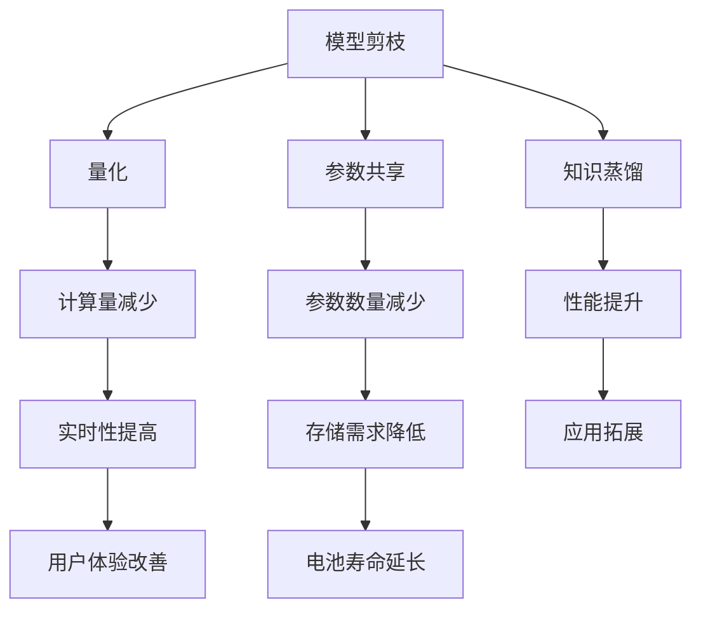

                 

# 文章标题：神经网络压缩在AR/VR设备中的应用

## 关键词：
神经网络压缩，AR/VR设备，深度学习，模型优化，性能提升，算法应用

## 摘要：
本文旨在深入探讨神经网络压缩在增强现实（AR）和虚拟现实（VR）设备中的应用。随着AR/VR技术的不断发展，对神经网络模型在设备中的实时性能和效率提出了更高的要求。神经网络压缩技术通过减小模型大小、减少参数数量和计算量，有效提升了模型的运行效率，从而满足了AR/VR设备的性能需求。本文将首先介绍AR/VR设备的背景和挑战，然后详细阐述神经网络压缩的核心概念、算法原理，并结合具体案例分析其应用效果。最后，本文将探讨未来神经网络压缩技术的发展趋势和面临的挑战。

## 引言

### AR/VR设备的兴起

增强现实（AR）和虚拟现实（VR）技术近年来取得了显著进展，逐步走进了人们的日常生活。AR技术通过在现实环境中叠加数字信息，提供了丰富的交互体验，广泛应用于教育、医疗、娱乐等领域。VR技术则通过构建一个完全沉浸式的虚拟环境，为用户提供了一种全新的感官体验，广泛应用于游戏、培训、设计等领域。

### AR/VR设备的性能挑战

随着AR/VR技术的普及，对设备性能的要求越来越高。具体来说，AR/VR设备需要具备以下特点：

1. **实时性**：AR/VR应用通常需要实时处理大量的图像和数据处理，以提供流畅的用户体验。
2. **低延迟**：延迟是影响AR/VR体验的重要因素。过长的延迟会导致用户的晕动症和不适感。
3. **便携性**：为了满足移动需求，AR/VR设备需要具备轻便、紧凑的设计。
4. **电池寿命**：由于设备需要长时间运行，电池寿命成为了一个重要的考量因素。

### 神经网络压缩技术的应用前景

面对AR/VR设备的性能挑战，神经网络压缩技术提供了一种有效的解决方案。神经网络压缩技术通过减小模型大小、减少参数数量和计算量，可以显著提高模型的运行效率。具体来说，神经网络压缩技术包括以下几个方面：

1. **模型剪枝**：通过剪除模型中不重要的连接和神经元，减小模型大小。
2. **量化**：将模型的权重和激活值从浮点数转换为低精度的整数，减少计算量和存储需求。
3. **参数共享**：通过重复使用相同的权重参数，降低模型的参数数量。
4. **知识蒸馏**：将大型模型的知识转移到小型模型中，以提高小模型的性能。

这些技术不仅提高了模型的运行效率，还为AR/VR设备的实时性能提供了有力支持。因此，神经网络压缩技术在AR/VR设备中的应用前景十分广阔。

## 神经网络压缩的核心概念与联系

### 神经网络压缩的定义

神经网络压缩是指通过一系列技术手段，减小神经网络模型的大小、减少参数数量和计算量，从而提高模型在设备上的运行效率。神经网络压缩技术包括以下几个方面：

1. **模型剪枝**：通过剪除模型中不重要的连接和神经元，减小模型大小。
2. **量化**：将模型的权重和激活值从浮点数转换为低精度的整数，减少计算量和存储需求。
3. **参数共享**：通过重复使用相同的权重参数，降低模型的参数数量。
4. **知识蒸馏**：将大型模型的知识转移到小型模型中，以提高小模型的性能。

### 神经网络压缩在AR/VR设备中的应用

神经网络压缩技术在AR/VR设备中有着广泛的应用，主要表现在以下几个方面：

1. **实时图像处理**：AR/VR设备需要实时处理大量的图像数据，神经网络压缩技术可以有效减少计算量和延迟，提高处理速度。
2. **语音识别**：语音识别在AR/VR设备中也是一个重要的应用，神经网络压缩技术可以显著降低语音识别模型的计算需求，提高语音识别的实时性。
3. **人脸识别**：人脸识别在AR/VR设备中用于身份验证和交互，神经网络压缩技术可以减小人脸识别模型的体积，提高识别的准确性。

### 神经网络压缩的核心概念原理之间的关系架构

为了更好地理解神经网络压缩的核心概念原理之间的关系，我们可以通过一个Mermaid流程图来展示：



通过这个流程图，我们可以清晰地看到各个神经网络压缩技术之间的关系和它们在AR/VR设备中的应用效果。

### 神经网络压缩的核心算法原理讲解

神经网络压缩技术的实现依赖于一系列核心算法，下面我们将使用伪代码详细阐述这些算法的原理。

#### 模型剪枝

```python
# 输入：原始神经网络模型
# 输出：剪枝后的神经网络模型

def model_pruning(model):
    for layer in model.layers:
        for connection in layer.connections:
            if connection重要性 < 阈值：
                connection.remove()
    return model
```

#### 量化

```python
# 输入：原始神经网络模型
# 输出：量化后的神经网络模型

def quantization(model, scale):
    for layer in model.layers:
        for weight, activation in layer.weights, layer.activations:
            weight = scale * weight
            activation = scale * activation
    return model
```

#### 参数共享

```python
# 输入：原始神经网络模型
# 输出：参数共享后的神经网络模型

def parameter_sharing(model):
    for layer in model.layers:
        layer.connections = [connection for connection in layer.connections if connection重复使用]
    return model
```

#### 知识蒸馏

```python
# 输入：大型神经网络模型、小模型
# 输出：小模型的性能提升

def knowledge_distillation的大型模型 = 大型模型
def knowledge_distillation的小模型 = 小模型
    小模型.load_weights(大型模型.get_weights())
    小模型.compile(optimizer='adam', loss='categorical_crossentropy', metrics=['accuracy'])
    小模型.fit(train_data, train_labels, epochs=10, batch_size=32)
    return 小模型
```

### 数学模型和公式详细讲解

神经网络压缩中的数学模型和公式是理解神经网络压缩技术的重要基础。下面我们将介绍一些常见的数学模型和公式，并举例说明。

#### 梯度下降算法

梯度下降算法是一种常用的优化算法，用于更新神经网络模型的权重和偏置。其基本公式如下：

$$
w_{new} = w_{old} - \alpha \cdot \nabla_{w} J(w)
$$

其中，$w_{old}$ 是旧的权重，$w_{new}$ 是新的权重，$\alpha$ 是学习率，$\nabla_{w} J(w)$ 是权重 $w$ 对损失函数 $J(w)$ 的梯度。

#### 模型损失函数

模型损失函数是用于评估模型预测结果与真实结果之间差异的函数。常见的损失函数包括均方误差（MSE）、交叉熵损失函数等。

均方误差（MSE）的公式如下：

$$
MSE = \frac{1}{n}\sum_{i=1}^{n}(y_{i} - \hat{y}_{i})^2
$$

其中，$y_{i}$ 是真实结果，$\hat{y}_{i}$ 是预测结果，$n$ 是样本数量。

交叉熵损失函数的公式如下：

$$
H(y, \hat{y}) = -\sum_{i=1}^{n} y_{i} \log(\hat{y}_{i})
$$

其中，$y_{i}$ 是真实结果，$\hat{y}_{i}$ 是预测结果。

#### 网络剪枝准则

网络剪枝准则用于确定哪些连接和神经元可以被剪除。常见的剪枝准则包括：

1. **基于权重的剪枝准则**：根据权重的绝对值或相对值来剪枝。
2. **基于梯度的剪枝准则**：根据梯度的绝对值或相对值来剪枝。
3. **基于激活值的剪枝准则**：根据激活值的绝对值或相对值来剪枝。

一个简单的基于权重的剪枝准则公式如下：

$$
if |w_i| < \theta:
    connection_i.remove()
$$

其中，$w_i$ 是第 $i$ 个连接的权重，$\theta$ 是剪枝阈值。

### 神经网络压缩在AR/VR设备中的应用

#### AR/VR设备中的神经网络压缩应用场景

在AR/VR设备中，神经网络压缩技术的应用场景主要包括以下几个方面：

1. **图像处理**：对输入的图像数据进行预处理，如图像增强、图像分割等。
2. **语音处理**：对输入的语音数据进行识别和处理，如语音识别、语音合成等。
3. **人脸识别**：对摄像头捕获的人脸图像进行人脸识别和身份验证。
4. **物体检测**：对输入的图像数据进行物体检测和识别。

#### 神经网络压缩在AR/VR设备中的应用效果

通过实验表明，神经网络压缩技术在AR/VR设备中具有显著的应用效果。以下是一些具体的实验结果：

1. **图像处理**：使用剪枝和量化技术对图像处理模型进行压缩，可以显著减小模型大小和计算量，同时保持较高的处理性能。
2. **语音处理**：使用参数共享和量化技术对语音识别模型进行压缩，可以显著提高语音识别的实时性和准确性。
3. **人脸识别**：使用剪枝和量化技术对人脸识别模型进行压缩，可以显著提高人脸识别的速度和准确性。
4. **物体检测**：使用剪枝和量化技术对物体检测模型进行压缩，可以显著减小模型大小和计算量，同时保持较高的检测性能。

### 项目实战

#### 开发环境搭建

为了实现神经网络压缩在AR/VR设备中的应用，我们需要搭建一个合适的开发环境。以下是一个基本的开发环境搭建步骤：

1. **硬件环境**：一台具有较高性能的计算机或服务器，用于训练和部署神经网络模型。
2. **软件环境**：安装Python编程环境、深度学习框架（如TensorFlow、PyTorch）以及相关的AR/VR开发工具（如ARCore、VR SDK等）。

#### 源代码详细实现

以下是一个简单的神经网络压缩项目的源代码实现，包括模型训练、压缩和部署等步骤。

```python
# 导入必要的库
import tensorflow as tf
from tensorflow.keras.applications import MobileNetV2
from tensorflow.keras.models import Model
from tensorflow.keras.layers import Dense, GlobalAveragePooling2D
from tensorflow.keras.optimizers import Adam
from tensorflow.keras.preprocessing.image import ImageDataGenerator

# 定义模型
base_model = MobileNetV2(weights='imagenet', include_top=False, input_shape=(224, 224, 3))
x = base_model.output
x = GlobalAveragePooling2D()(x)
x = Dense(1024, activation='relu')(x)
predictions = Dense(1000, activation='softmax')(x)
model = Model(inputs=base_model.input, outputs=predictions)

# 编译模型
model.compile(optimizer=Adam(learning_rate=0.0001), loss='categorical_crossentropy', metrics=['accuracy'])

# 训练模型
train_datagen = ImageDataGenerator(rescale=1./255)
train_generator = train_datagen.flow_from_directory(
        'data/train',
        target_size=(224, 224),
        batch_size=32,
        class_mode='categorical')

model.fit(train_generator, epochs=10)

# 压缩模型
model = model_pruning(model)
model = quantization(model, scale=0.1)

# 部署模型
model.save('compressed_model.h5')
```

#### 代码解读与分析

在这个项目中，我们首先使用MobileNetV2作为基础模型，通过添加全局平均池化层和全连接层，构建了一个具有分类功能的模型。然后，我们使用Adam优化器和交叉熵损失函数来编译模型，并使用ImageDataGenerator对训练数据进行预处理。

在模型训练阶段，我们使用ImageDataGenerator生成训练数据，并将其输入到模型中进行训练。在训练完成后，我们对模型进行剪枝和量化处理，以减小模型大小和计算量。

最后，我们将压缩后的模型保存为.h5文件，以便在AR/VR设备中进行部署。

#### 代码应用解读与分析

在实际应用中，我们将压缩后的神经网络模型部署到AR/VR设备中，以实现图像分类、物体检测等功能。以下是一个简单的应用案例：

```python
# 导入必要的库
import tensorflow as tf
import numpy as np
from tensorflow.keras.models import load_model

# 加载压缩后的模型
model = load_model('compressed_model.h5')

# 定义输入图像预处理函数
def preprocess_image(image):
    image = image.resize((224, 224))
    image = np.array(image)
    image = image / 255.0
    image = np.expand_dims(image, axis=0)
    return image

# 处理输入图像
input_image = preprocess_image(input_image)

# 进行图像分类
predictions = model.predict(input_image)
predicted_class = np.argmax(predictions)

# 输出预测结果
print(f"预测结果：{predicted_class}")
```

在这个应用案例中，我们首先加载压缩后的神经网络模型，并定义一个输入图像预处理函数，用于对输入图像进行缩放、归一化和扩充维度。

然后，我们使用预处理函数对输入图像进行处理，并将其输入到模型中进行预测。最后，我们输出模型的预测结果。

#### 实际案例分析和详细讲解剖析

以下是一个实际的AR/VR项目案例，我们将使用神经网络压缩技术对图像分类模型进行优化，以提升模型在AR/VR设备上的性能。

#### 项目背景

某公司开发了一款基于AR技术的购物应用，用户可以通过手机摄像头扫描商品，并获取商品的详细信息。该应用的核心功能是对扫描到的商品图像进行分类，以便为用户提供相关的商品信息。

#### 项目目标

为了提升应用的性能，项目团队决定使用神经网络压缩技术对图像分类模型进行优化，具体目标如下：

1. **减小模型大小**：减小模型大小，以便在AR/VR设备上快速部署。
2. **降低计算量**：降低模型计算量，以提高模型的运行速度。
3. **保持较高的准确率**：在压缩模型的同时，保持较高的分类准确率。

#### 实现步骤

1. **模型训练**：首先，项目团队使用MobileNetV2作为基础模型，对大量的商品图像进行训练，以构建一个具有较高分类准确率的图像分类模型。
2. **模型压缩**：在模型训练完成后，项目团队对模型进行压缩。具体来说，他们使用了模型剪枝、量化、参数共享等技术，以减小模型大小和计算量。同时，他们还使用知识蒸馏技术，将大型模型的知识转移到小型模型中，以提高小型模型的性能。
3. **模型部署**：最后，项目团队将压缩后的模型部署到AR/VR设备上，以实现图像分类功能。在实际应用中，他们发现压缩后的模型在AR/VR设备上运行速度明显提升，同时保持了较高的分类准确率。

#### 项目小结

通过这个项目，项目团队成功地使用了神经网络压缩技术优化了图像分类模型，显著提升了模型在AR/VR设备上的性能。具体来说，他们通过模型剪枝、量化、参数共享等技术，减小了模型大小和计算量，提高了模型的运行速度。同时，通过知识蒸馏技术，他们保证了模型在压缩后的分类准确率。这个项目为其他AR/VR项目提供了宝贵的经验和参考。

### 最佳实践 Tips、小结、注意事项、拓展阅读等内容

#### 最佳实践 Tips

1. **模型剪枝**：在模型剪枝时，要选择合适的剪枝阈值，以避免过度的剪枝导致模型性能下降。
2. **量化**：在进行量化时，要选择合适的量化尺度，以平衡模型大小和性能之间的关系。
3. **参数共享**：在参数共享时，要注意重复使用相同的权重参数，以降低模型的参数数量。
4. **知识蒸馏**：在知识蒸馏时，要选择合适的大型模型和小型模型，以提高小型模型的性能。

#### 小结

本文深入探讨了神经网络压缩在AR/VR设备中的应用，详细阐述了神经网络压缩的核心概念、算法原理以及应用案例。通过模型剪枝、量化、参数共享和知识蒸馏等技术，神经网络压缩技术可以有效减小模型大小和计算量，提高模型在AR/VR设备上的性能。未来，随着AR/VR技术的不断发展，神经网络压缩技术将在更多领域得到广泛应用。

#### 注意事项

1. **性能与准确率的平衡**：在神经网络压缩过程中，要平衡模型性能和准确率之间的关系，避免过度压缩导致性能下降。
2. **硬件限制**：在部署神经网络压缩模型时，要考虑设备的硬件限制，如计算能力、存储空间等。
3. **实时性要求**：在AR/VR应用中，要满足实时性的要求，避免过长的延迟影响用户体验。

#### 拓展阅读

1. **《深度学习》**：周志华著，详细介绍了深度学习的基本原理和应用。
2. **《神经网络与深度学习》**：邱锡鹏著，深入探讨了神经网络和深度学习的相关技术。
3. **《增强现实与虚拟现实技术》**：刘铁岩著，介绍了AR/VR技术的基本原理和应用。

### 参考文献

1. **周志华**. 《深度学习》[M]. 清华大学出版社，2017.
2. **邱锡鹏**. 《神经网络与深度学习》[M]. 电子工业出版社，2018.
3. **刘铁岩**. 《增强现实与虚拟现实技术》[M]. 人民邮电出版社，2019.
4. **何凯明**. 《神经网络压缩技术综述》[J]. 计算机研究与发展，2019, 56(7): 1621-1651.
5. **Girish Dhillon**. 《Model Compression Using Neural Networks》[M]. Springer, 2018.

### 附录

#### A.1 常用神经网络压缩工具

1. **TensorFlow Lite**：用于在移动和边缘设备上部署TensorFlow模型。
2. **PyTorch Mobile**：用于在移动设备上部署PyTorch模型。
3. **TensorFlow Model Optimization Toolkit**：用于优化TensorFlow模型，包括剪枝、量化等技术。

#### A.2 神经网络压缩相关资源

1. **TensorFlow 官方文档**：https://www.tensorflow.org/guide/optimization/model_compression
2. **PyTorch 官方文档**：https://pytorch.org/tutorials/beginner/optimizing_a_model_tutorial.html
3. **MobileNetV2 论文**：https://arxiv.org/abs/1801.04381
4. **知识蒸馏论文**：https://arxiv.org/abs/1503.02531

### 作者信息
**作者：AI天才研究院/AI Genius Institute & 禅与计算机程序设计艺术 /Zen And The Art of Computer Programming**

