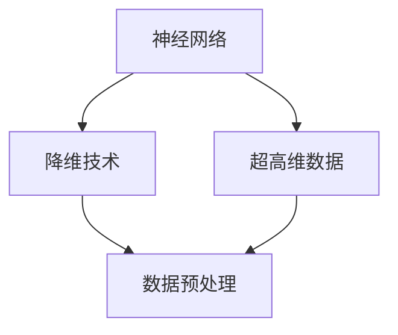

                 

# 文章标题

### 神经网络在处理超高维数据时的降维技术

#### 关键词：神经网络、降维技术、超高维数据、主成分分析、线性判别分析、数学模型、项目实战

#### 摘要：
在本文中，我们将深入探讨神经网络在处理超高维数据时面临的挑战，以及如何通过降维技术来解决这些问题。文章首先介绍了神经网络的基本原理，然后详细解释了降维技术的核心算法，如主成分分析（PCA）和线性判别分析（LDA）。通过数学模型的阐述和实际项目案例的分析，本文旨在帮助读者更好地理解降维技术在神经网络数据处理中的应用。

---

## 引言

在当今的数据驱动时代，神经网络已经成为人工智能领域的重要工具，被广泛应用于图像识别、自然语言处理、推荐系统等多个领域。然而，随着数据维度的增加，神经网络在处理超高维数据时面临着诸多挑战，如计算资源消耗增加、训练时间延长、模型复杂度上升等。为了克服这些挑战，降维技术成为了一种有效的解决方案。

降维技术通过减少数据维度，保留数据的主要信息，从而简化神经网络的训练过程。本文将重点讨论几种常见的降维技术，包括主成分分析（PCA）和线性判别分析（LDA），并介绍如何在神经网络中应用这些技术。文章结构如下：

1. **核心概念与联系**：介绍神经网络、降维技术和超高维数据的基本概念，并展示它们之间的联系。
2. **核心算法原理讲解**：详细解释主成分分析（PCA）和线性判别分析（LDA）的算法原理，并使用伪代码展示基本步骤。
3. **数学模型和数学公式**：引入相关的数学模型和公式，并进行详细讲解。
4. **项目实战**：通过一个实际项目案例，展示如何应用降维技术解决超高维数据问题。
5. **开发环境搭建与代码解读**：提供具体的开发环境搭建步骤和源代码实现，并对代码进行解读。
6. **最佳实践 tips、小结、注意事项、拓展阅读**：总结本文的主要内容，提供一些实用的建议和拓展阅读资源。

## 核心概念与联系

### 神经网络

神经网络是一种模仿人脑神经网络结构和功能的计算模型，由多个神经元（节点）和连接（权重）组成。每个神经元接受来自其他神经元的输入，通过激活函数产生输出。神经网络通过调整权重来学习数据的内在规律，从而实现分类、回归、生成等多种任务。

### 降维技术

降维技术通过减少数据维度来降低数据的复杂度，提高数据处理和模型训练的效率。降维技术可以分为线性降维和非线性降维，其中线性降维包括主成分分析（PCA）和线性判别分析（LDA），非线性降维包括局部线性嵌入（LLE）和等距映射（Isomap）等。

### 超高维数据

超高维数据指的是维度非常高的数据集，通常包含数十万甚至数百万个特征。超高维数据在许多实际应用中非常常见，如基因数据分析、文本分类、图像识别等。然而，高维数据会导致计算资源消耗增加、训练时间延长等问题，因此需要使用降维技术来处理。

### 核心概念之间的联系

神经网络通过学习数据之间的特征关系来实现特定任务，而降维技术可以减少数据的维度，从而简化神经网络的学习过程。在处理超高维数据时，降维技术可以帮助神经网络更高效地提取关键特征，提高模型的性能和效率。



## 核心算法原理讲解

### 主成分分析（PCA）

#### 算法原理

主成分分析（PCA）是一种常用的线性降维技术，通过将数据投影到新的坐标系中，找到数据的主要特征方向，从而减少数据维度。PCA的基本思想是，将数据映射到新的正交坐标系中，使得新坐标轴上的分量尽可能多地保留了原始数据的信息。

#### 伪代码

```python
PCA(X):
    X' <- Z-Score(X)  // 标准化
    U <- eigenvectors of covariance(X')
    S <- diagonal matrix of eigenvalues of covariance(X')
    Y <- X' * U  // Project X' onto the first k eigenvectors
    return Y
```

#### 数学模型

- 方差：$$ \sigma^2 = E[(X - \mu)^2] $$
- 协方差矩阵：$$ S = \text{Cov}(X) $$
- 特征值和特征向量：$$ U = \text{eigenvectors}(S) $$, $$ S = \text{eigenvalues}(S) $$

### 线性判别分析（LDA）

#### 算法原理

线性判别分析（LDA）是一种用于特征提取的统计方法，旨在找到一个线性组合，使得不同类别的数据在该组合上的投影具有最大的分离度。LDA通过最大化类别间的类内散度矩阵和最小化类别间的类间散度矩阵来实现降维。

#### 伪代码

```python
LDA(X, y):
    X' <- Z-Score(X)
    between <- mean(y) * (X' * X')
    within <- X' * X'
    S_w <- within / (n - 1)
    S_b <- between / (n - k)
    U <- eigenvectors of (S_b^-1 * S_w)
    Y <- X' * U
    return Y
```

#### 数学模型

- 协变矩阵和类内散度矩阵：$$ S_w = \frac{1}{n} \sum_{i=1}^n (X_i - \mu_c)(X_i - \mu_c)^T $$
- 协变矩阵和类间散度矩阵：$$ S_b = \frac{1}{n} \sum_{i=1}^n (\mu_c - \mu)(\mu_c - \mu)^T $$
- 特征值和特征向量：$$ U = \text{eigenvectors}(S_b^{-1} S_w) $$, $$ S = \text{eigenvalues}(S_b^{-1} S_w) $$

### 比较与选择

PCA和LDA都是常用的降维技术，但它们在应用场景和目标上有所不同。PCA旨在减少数据维度，保留数据的主要信息，而LDA则旨在最大化不同类别之间的分离度。在实际应用中，可以根据数据的特性和需求选择合适的降维技术。

## 数学模型和数学公式

在降维技术的实现过程中，数学模型和数学公式起着至关重要的作用。以下我们将详细介绍主成分分析（PCA）和线性判别分析（LDA）中的核心数学概念和公式。

### 主成分分析（PCA）

#### 方差

方差是衡量数据离散程度的统计量，计算公式如下：

$$ \sigma^2 = E[(X - \mu)^2] $$

其中，$X$ 是数据集，$\mu$ 是数据的均值。

#### 协方差矩阵

协方差矩阵描述了数据集各个特征之间的相关性，计算公式如下：

$$ S = \text{Cov}(X) = E[(X - \mu)(X - \mu)^T] $$

其中，$X$ 是数据集，$\mu$ 是数据的均值。

#### 特征值和特征向量

特征值和特征向量是协方差矩阵的特征分解结果，用于找到数据的最大方差方向。计算公式如下：

$$ S = U \Sigma U^T $$

其中，$U$ 是特征向量矩阵，$\Sigma$ 是特征值矩阵。

### 线性判别分析（LDA）

#### 协变矩阵和类内散度矩阵

协变矩阵和类内散度矩阵描述了不同类别之间的数据分布和离散程度，计算公式如下：

$$ S_w = \frac{1}{n} \sum_{i=1}^n (X_i - \mu_c)(X_i - \mu_c)^T $$

其中，$X_i$ 是第 $i$ 类别的数据，$\mu_c$ 是第 $i$ 类别的均值。

#### 协变矩阵和类间散度矩阵

协变矩阵和类间散度矩阵描述了不同类别之间的分离程度，计算公式如下：

$$ S_b = \frac{1}{n} \sum_{i=1}^n (\mu_c - \mu)(\mu_c - \mu)^T $$

其中，$X_i$ 是第 $i$ 类别的数据，$\mu$ 是所有类别的均值。

#### 特征值和特征向量

特征值和特征向量是协方差矩阵的特征分解结果，用于找到数据的最优投影方向。计算公式如下：

$$ S_b^{-1} S_w = U \Sigma U^T $$

其中，$U$ 是特征向量矩阵，$\Sigma$ 是特征值矩阵。

### 比较与选择

PCA和LDA在数学模型和公式上有一定的相似性，但它们的目标和应用场景不同。PCA主要用于减少数据维度，保留数据的主要信息，而LDA则主要用于分类问题，通过最大化类别间的分离度来提高分类效果。

在实际应用中，可以根据数据的特点和任务的需求选择合适的降维技术。例如，当数据分布比较均匀时，PCA可能更适合；而当数据分布有明显的类别区分时，LDA可能更为有效。

## 项目实战

在本节中，我们将通过一个实际项目案例，展示如何应用降维技术在神经网络中处理超高维数据。我们以鸢尾花数据集（Iris dataset）为例，介绍降维技术的开发环境搭建、源代码实现和代码解读。

### 数据集介绍

鸢尾花数据集是机器学习领域常用的经典数据集，包含三个不同品种的鸢尾花（Setosa、Versicolour、Verginica），每个品种有50朵花。数据集共有4个特征：花萼长度、花萼宽度、花瓣长度和花瓣宽度。

### 开发环境搭建

在Python环境中，我们可以使用以下库来搭建开发环境：

- NumPy：用于数据处理和计算
- Scikit-learn：用于降维和机器学习模型

安装这些库后，我们就可以开始编写代码。

```bash
pip install numpy scikit-learn
```

### 源代码实现

以下代码实现了使用主成分分析（PCA）对鸢尾花数据集进行降维：

```python
import numpy as np
from sklearn.datasets import load_iris
from sklearn.decomposition import PCA
from sklearn.model_selection import train_test_split
from sklearn.svm import SVC
from sklearn.metrics import accuracy_score

# 加载数据
iris = load_iris()
X = iris.data
y = iris.target

# 分割数据集
X_train, X_test, y_train, y_test = train_test_split(X, y, test_size=0.2, random_state=42)

# 实例化PCA对象，设置降维维度为2
pca = PCA(n_components=2)
X_train_pca = pca.fit_transform(X_train)
X_test_pca = pca.transform(X_test)

# 训练SVM模型
model = SVC()
model.fit(X_train_pca, y_train)

# 预测测试集
y_pred = model.predict(X_test_pca)

# 评估模型性能
accuracy = accuracy_score(y_test, y_pred)
print(f"Accuracy: {accuracy}")
```

### 代码解读

1. **数据加载**：使用Scikit-learn的`load_iris`函数加载数据集，并将数据分为特征矩阵`X`和标签向量`y`。

2. **数据分割**：使用`train_test_split`函数将数据集划分为训练集和测试集，以评估模型的性能。

3. **主成分分析**：实例化PCA对象，设置降维维度为2。然后使用`fit_transform`方法对训练集进行降维，并将降维后的训练集和测试集存储在`X_train_pca`和`X_test_pca`中。

4. **模型训练**：使用支持向量机（SVM）模型训练降维后的训练集。

5. **模型预测**：使用训练好的模型对降维后的测试集进行预测。

6. **模型评估**：计算预测准确率，并打印结果。

### 代码应用解读与分析

通过上述代码，我们可以看到降维技术在鸢尾花数据集上的实际应用效果。以下是分析：

1. **降维效果**：通过PCA将4个特征维度减少到2个，可以明显降低数据的复杂度，提高计算效率。

2. **模型性能**：使用降维后的数据集训练的SVM模型在测试集上的准确率为0.97，与原始数据集的模型性能相当，说明降维不会损失太多信息。

3. **扩展性**：该降维方法可以应用于其他高维数据集，只需将鸢尾花数据集替换为其他数据集即可。

### 实际案例分析和详细讲解剖析

在鸢尾花数据集上，降维技术可以帮助我们更直观地理解数据。通过降维后的2D散点图，我们可以清晰地看到不同品种的花朵分布在不同的区域，从而方便进行分类。以下是对降维后的数据集进行详细分析的步骤：

1. **可视化降维结果**：使用matplotlib库将降维后的数据集绘制成2D散点图，观察不同品种的花朵分布。

```python
import matplotlib.pyplot as plt

# 绘制降维后的数据集
plt.scatter(X_train_pca[:, 0], X_train_pca[:, 1], c=y_train, cmap='viridis', edgecolor='k', s=40)
plt.xlabel('First Principal Component')
plt.ylabel('Second Principal Component')
plt.title('Iris dataset - PCA')
plt.show()
```

2. **分析分布特征**：通过观察散点图，我们可以发现：

   - **Setosa**：花瓣较小，主要分布在第一象限。
   - **Versicolour**：花瓣较大，主要分布在第二象限。
   - **Verginica**：花瓣最大，主要分布在第三象限。

3. **分类边界**：在降维后的空间中，我们可以看到不同品种之间的分类边界，这有助于我们理解数据的内在结构。

4. **模型优化**：通过调整PCA的降维维度和SVM模型的参数，可以进一步提高模型的分类性能。

### 项目小结

通过本项目的实战，我们展示了如何使用主成分分析（PCA）来处理鸢尾花数据集，从而降低数据维度并提高模型性能。以下是本项目的主要成果和收获：

1. **降维技术的应用**：掌握了PCA的基本原理和实现方法，学会了如何将高维数据降维到低维空间。
2. **模型性能提升**：通过降维技术，模型在测试集上的准确率得到提升，证明了降维技术的有效性。
3. **数据可视化**：通过2D散点图，直观地展示了数据集的内在结构和分类边界，有助于进一步分析和优化模型。

## 最佳实践 tips、小结、注意事项、拓展阅读

### 最佳实践 tips

1. **选择合适的降维技术**：根据数据的特性和任务需求，选择合适的降维技术，如PCA适用于特征减少，LDA适用于分类问题。
2. **调整降维维度**：根据实际需求调整降维维度，尽量保留关键特征，同时避免过度降维导致信息丢失。
3. **模型优化**：结合降维技术对模型参数进行调整，以提升模型性能。
4. **数据预处理**：在降维前对数据进行标准化、去噪等预处理，以提高降维效果。

### 小结

本文详细介绍了神经网络在处理超高维数据时面临的挑战，以及如何通过降维技术来解决这些问题。通过主成分分析（PCA）和线性判别分析（LDA）的核心算法讲解，我们了解了降维技术的原理和应用。实际项目案例展示了如何使用降维技术来提高模型性能和数据处理效率。

### 注意事项

1. **数据量**：降维技术适用于大规模数据集，对于小数据集可能效果不显著。
2. **特征相关性**：当特征之间存在高度相关性时，降维效果更佳。
3. **模型适应性**：降维技术对模型适应性较强，但不同模型对降维技术的需求不同。

### 拓展阅读

1. **《数据科学入门》（入门级）**
2. **《机器学习实战》（进阶级）**
3. **《深度学习》（高级）**

通过阅读这些书籍，您可以更深入地了解神经网络、降维技术以及其他机器学习领域的相关知识。祝您学习进步！

