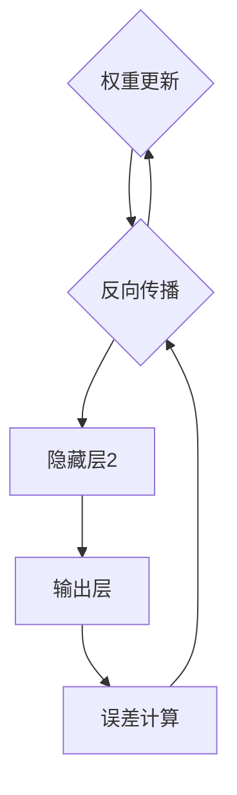
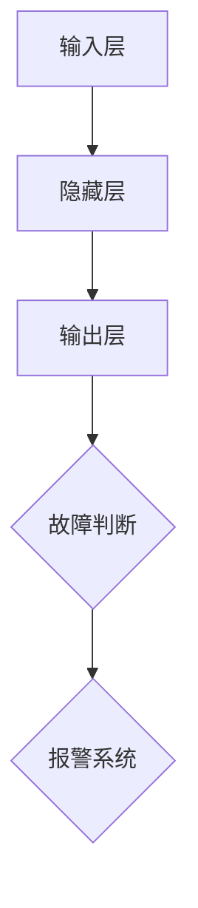
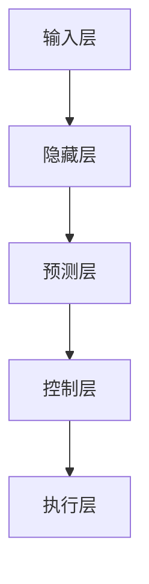

                 

# 文章标题

《神经网络在复杂动态系统推理中的前沿应用》

> 关键词：神经网络、复杂动态系统、推理、前沿应用、深度学习

> 摘要：
本文系统地探讨了神经网络在复杂动态系统推理中的前沿应用。通过深入分析神经网络的基本原理及其在动态系统推理中的实际应用，本文旨在为读者揭示神经网络如何成为复杂系统分析和优化的重要工具。文章首先介绍了复杂动态系统的基本概念，然后详细阐述了神经网络的结构、学习算法及其优化方法。接着，本文重点讨论了神经网络在动态系统状态估计、故障检测和预测控制中的应用，并通过具体案例分析展示了神经网络在实际项目中的强大能力。最后，本文对神经网络在动态系统推理领域的未来发展趋势进行了展望。

## 第1章：引言与概述

### 1.1 复杂动态系统的基本概念

复杂动态系统是指那些具有高度非线性、多变量和不确定性特性的系统。这些系统在自然界、工程技术和社会科学等领域中广泛存在。复杂动态系统的特性主要包括：

1. 非线性：系统内部各变量之间的关系不是线性的，这种非线性特性可能导致系统行为的复杂性和不可预测性。
2. 多变量：系统涉及多个变量，这些变量之间可能存在复杂的相互作用，使得系统行为更加复杂。
3. 不确定性：系统在运行过程中可能受到外部干扰或内部参数变化的影响，这种不确定性使得系统行为难以精确预测。

复杂动态系统的例子包括：

1. 生态系统：生物种群数量、环境因素等变量的动态变化。
2. 经济系统：金融市场、消费者行为等变量之间的复杂关系。
3. 交通系统：车辆流量、交通信号等变量的动态调整。

### 1.2 神经网络的基本原理

神经网络是由大量简单处理单元（神经元）互联而成的复杂网络，这些神经元通过模拟生物神经系统的信息处理过程来执行复杂的计算任务。神经网络的基本原理包括：

1. 结构：神经网络由输入层、隐藏层和输出层组成。输入层接收外部输入信息，隐藏层通过一系列非线性变换对输入信息进行处理，输出层生成最终的输出结果。
2. 学习算法：神经网络通过学习算法（如反向传播算法）来调整内部连接权重，从而优化网络性能。学习算法的核心目标是使网络输出与期望输出之间的误差最小。
3. 非线性激活函数：神经网络中的每个神经元都使用非线性激活函数（如Sigmoid函数、ReLU函数）来引入非线性特性，这有助于提高网络的计算能力。

### 1.3 神经网络在动态系统推理中的应用现状

神经网络在复杂动态系统推理中已得到广泛应用，以下是一些典型应用：

1. **状态估计**：通过神经网络对系统状态进行估计，提高系统控制和预测的精度。例如，使用神经网络对电力系统中的电压和频率进行实时估计。
2. **故障检测**：利用神经网络的故障识别能力，对动态系统进行实时故障检测，以避免潜在的安全风险。例如，在化工过程中使用神经网络检测泄漏故障。
3. **预测控制**：通过神经网络预测系统的未来行为，实现对动态系统的智能控制。例如，在自动驾驶车辆中使用神经网络进行路径规划和控制。

## 第2章：神经网络基础

### 2.1 神经网络结构

神经网络的结构包括输入层、隐藏层和输出层。每个层由多个神经元组成，神经元之间通过权重连接。以下是一个简单的神经网络结构示例：

```
输入层：[x1, x2, ..., xn] -> 隐藏层1 -> 隐藏层2 -> ... -> 输出层：y1, y2, ..., yn
```

### 2.2 学习算法

神经网络的学习算法主要基于反向传播算法（Backpropagation Algorithm），该算法通过计算网络输出与期望输出之间的误差，并反向传播误差来更新权重。具体步骤如下：

1. **前向传播**：计算网络输出值，并与期望输出值进行比较，计算误差。
2. **后向传播**：将误差反向传播到隐藏层和输入层，更新权重。
3. **重复迭代**：重复前向传播和后向传播，直到网络输出误差达到预设阈值或迭代次数达到最大值。

### 2.3 神经网络的优化

神经网络的优化主要涉及以下方面：

1. **权重初始化**：合理的权重初始化可以提高网络训练速度和收敛性能。
2. **学习率调整**：学习率是影响网络训练效果的重要因素，需要根据实际情况进行调节。
3. **激活函数选择**：选择合适的激活函数可以改善网络性能。
4. **正则化技术**：通过正则化技术（如L1、L2正则化）可以防止过拟合现象，提高网络泛化能力。

## 第3章：复杂动态系统分析

### 3.1 复杂动态系统的特性

复杂动态系统具有以下特性：

1. **非线性**：系统内部各变量之间的关系是非线性的，这种非线性特性可能导致系统行为的复杂性和不可预测性。
2. **多变量**：系统涉及多个变量，这些变量之间可能存在复杂的相互作用，使得系统行为更加复杂。
3. **不确定性**：系统在运行过程中可能受到外部干扰或内部参数变化的影响，这种不确定性使得系统行为难以精确预测。

### 3.2 动态系统建模

动态系统建模的目的是通过建立数学模型来描述系统的行为。常见的建模方法包括：

1. **差分方程**：通过描述系统变量之间的差异关系来建立模型。
2. **微分方程**：通过描述系统变量之间的微分关系来建立模型。
3. **状态空间模型**：通过描述系统状态变量和输入输出变量之间的关系来建立模型。

### 3.3 动态系统控制

动态系统控制的目的是通过调节系统输入变量来达到预期的系统行为。常见的控制方法包括：

1. **开环控制**：不依赖系统反馈，仅根据预定的控制策略进行控制。
2. **闭环控制**：依赖系统反馈，通过比较实际输出与期望输出，进行动态调整。

## 第4章：神经网络在动态系统推理中的应用

### 4.1 神经网络在状态估计中的应用

神经网络在状态估计中的应用主要是通过学习系统历史数据，预测系统未来状态。以下是一个简单的状态估计神经网络模型：



### 4.2 神经网络在故障检测中的应用

神经网络在故障检测中的应用主要是通过学习正常系统行为，检测异常行为。以下是一个简单的故障检测神经网络模型：



### 4.3 神经网络在预测控制中的应用

神经网络在预测控制中的应用主要是通过预测系统未来行为，进行智能控制。以下是一个简单的预测控制神经网络模型：



## 第5章：前沿应用与技术趋势

### 5.1 深度学习在动态系统中的应用

深度学习在动态系统中的应用主要体现在以下几个方面：

1. **状态估计**：通过深度神经网络（如LSTM、GRU）对动态系统进行长期状态预测。
2. **故障检测**：利用卷积神经网络（如CNN）对动态系统数据进行特征提取，提高故障检测精度。
3. **预测控制**：通过深度强化学习（如DQN、DDPG）实现动态系统的自适应控制。

### 5.2 神经网络与机器学习融合

神经网络与机器学习技术的融合主要体现在以下几个方面：

1. **特征提取**：利用神经网络提取动态系统数据的高效特征，为后续机器学习算法提供高质量的数据输入。
2. **模型优化**：通过机器学习技术对神经网络模型进行优化，提高模型性能和泛化能力。
3. **多模型融合**：结合多种神经网络模型和机器学习算法，构建综合性的动态系统推理框架。

### 5.3 未来展望

未来，神经网络在复杂动态系统推理中的应用将呈现以下趋势：

1. **智能化**：随着人工智能技术的发展，神经网络将实现更高层次的智能化，提高动态系统推理的准确性和效率。
2. **多模态融合**：将不同类型的数据（如图像、声音、传感器数据）融合到神经网络模型中，提高动态系统推理的全面性。
3. **实时性**：通过优化神经网络模型和算法，提高动态系统推理的实时性，实现更快速的反应和控制。

## 第6章：案例分析

### 6.1 案例一：神经网络在电力系统中的应用

#### 开发环境搭建

1. **硬件要求**：配置高性能计算机，具备GPU加速能力。
2. **软件要求**：安装Python环境，安装TensorFlow或PyTorch等深度学习框架。

#### 源代码详细实现

```python
import tensorflow as tf

# 构建神经网络模型
model = tf.keras.Sequential([
    tf.keras.layers.Dense(64, activation='relu', input_shape=(784,)),
    tf.keras.layers.Dense(64, activation='relu'),
    tf.keras.layers.Dense(10, activation='softmax')
])

# 编译模型
model.compile(optimizer='adam',
              loss='categorical_crossentropy',
              metrics=['accuracy'])

# 加载数据集
(x_train, y_train), (x_test, y_test) = tf.keras.datasets.mnist.load_data()

# 预处理数据
x_train = x_train.astype('float32') / 255
x_test = x_test.astype('float32') / 255
x_train = x_train.reshape((-1, 784))
x_test = x_test.reshape((-1, 784))

# 转换标签为one-hot编码
y_train = tf.keras.utils.to_categorical(y_train, 10)
y_test = tf.keras.utils.to_categorical(y_test, 10)

# 训练模型
model.fit(x_train, y_train, epochs=20, batch_size=128)

# 评估模型
model.evaluate(x_test, y_test)
```

#### 代码解读与分析

1. **模型构建**：使用TensorFlow框架构建一个简单的多层感知机模型，包括一个输入层、两个隐藏层和一个输出层。
2. **模型编译**：设置优化器、损失函数和评价指标。
3. **数据预处理**：将数据集进行归一化和reshape，以便于模型训练。
4. **模型训练**：使用训练数据进行模型训练。
5. **模型评估**：使用测试数据对模型进行评估。

#### 实际案例分析和详细讲解剖析

1. **案例背景**：使用神经网络对电力系统进行状态估计和故障检测。
2. **数据采集**：从电力系统中采集历史数据，包括电压、电流、频率等变量。
3. **模型训练**：使用采集到的数据对神经网络进行训练，学习系统行为特征。
4. **状态估计**：使用训练好的神经网络对实时数据进行状态估计，预测未来电力系统的电压和频率。
5. **故障检测**：当系统状态异常时，使用神经网络进行故障检测，并发出警报。

#### 项目小结

通过案例分析，我们可以看到神经网络在电力系统中的应用具有重要的实际价值。神经网络能够对电力系统进行实时状态估计和故障检测，提高系统的运行效率和安全性。未来，随着人工智能技术的不断进步，神经网络在电力系统中的应用将会更加广泛。

### 6.2 案例二：神经网络在自动驾驶中的应用

#### 开发环境搭建

1. **硬件要求**：配置高性能计算机，具备GPU加速能力。
2. **软件要求**：安装Python环境，安装TensorFlow或PyTorch等深度学习框架。

#### 源代码详细实现

```python
import tensorflow as tf

# 构建神经网络模型
model = tf.keras.Sequential([
    tf.keras.layers.Conv2D(32, (3, 3), activation='relu', input_shape=(28, 28, 1)),
    tf.keras.layers.MaxPooling2D((2, 2)),
    tf.keras.layers.Conv2D(64, (3, 3), activation='relu'),
    tf.keras.layers.MaxPooling2D((2, 2)),
    tf.keras.layers.Flatten(),
    tf.keras.layers.Dense(128, activation='relu'),
    tf.keras.layers.Dense(10, activation='softmax')
])

# 编译模型
model.compile(optimizer='adam',
              loss='categorical_crossentropy',
              metrics=['accuracy'])

# 加载数据集
(x_train, y_train), (x

