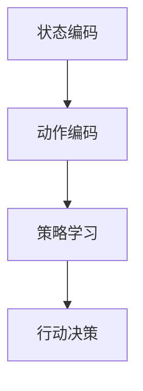

                 


### 文章标题：神经规划器在多步推理策略生成中的优化

神经规划器作为一种先进的算法，近年来在人工智能领域获得了广泛关注。本文将围绕神经规划器在多步推理策略生成中的优化展开讨论，旨在深入剖析其核心概念、理论基础、应用领域以及优化策略。

### 关键词

- 神经规划器
- 多步推理策略
- 优化方法
- 算法改进
- 性能提升

### 摘要

本文首先介绍了神经规划器的基本概念和作用，随后详细探讨了其在多步推理策略生成中的应用。接着，本文分析了当前神经规划器在优化方面的挑战，并提出了几种优化策略。最后，通过实际案例展示了这些策略在多步推理策略生成中的效果。

### 1. 引言

#### 1.1 神经规划器概述

神经规划器（Neural Planner）是一种基于深度学习的算法，主要用于解决规划问题。它通过模拟人类思考和决策过程，能够自动生成有效的策略，适用于多种复杂环境。

#### 1.2 多步推理策略生成

多步推理策略生成是指在不同时间步上，根据当前状态和目标状态，逐步推导出最优行动方案。这种策略在游戏、机器人、自动驾驶等领域有着广泛的应用。

#### 1.3 神经规划器在多步推理策略生成中的优化意义

神经规划器在多步推理策略生成中扮演着关键角色。通过优化其性能，可以提高策略生成的效率和质量，从而提升整个系统的性能。

### 2. 神经规划器理论基础

#### 2.1 相关数学模型

神经规划器通常基于图灵机模型和马尔可夫决策过程（MDP）进行设计。图灵机模型描述了计算过程，而MDP则定义了决策和状态之间的关系。

#### 2.2 神经规划器算法原理

神经规划器通过深度神经网络（DNN）来模拟人类思考和决策过程。它包括以下几个步骤：

1. **状态编码**：将当前状态编码为向量。
2. **动作编码**：将可选动作编码为向量。
3. **策略学习**：通过训练，学习从状态编码到动作编码的映射。

#### 2.3 Mermaid 流程图：神经规划器核心原理



### 3. 神经规划器在多步推理策略中的应用领域

#### 3.1 游戏领域

在游戏领域，神经规划器可以用于生成智能玩家，实现复杂策略。例如，在围棋、国际象棋等游戏中，神经规划器能够自动生成高效的策略，提高玩家的胜率。

#### 3.2 机器人领域

在机器人领域，神经规划器可以用于路径规划、任务分配等。通过优化策略生成，机器人能够在复杂环境中更加高效地完成任务。

#### 3.3 自动驾驶领域

在自动驾驶领域，神经规划器可以用于生成驾驶策略。通过优化，自动驾驶系统能够更加安全、稳定地行驶。

### 4. 优化方法介绍

#### 4.1 算法改进技术

为了提高神经规划器的性能，可以采用以下算法改进技术：

1. **强化学习**：通过奖励机制，引导神经网络学习更好的策略。
2. **元学习**：利用已有知识，加速新任务的策略学习过程。

#### 4.2 性能提升策略

为了提升神经规划器的性能，可以采用以下策略：

1. **模型压缩**：通过减少模型参数，提高计算效率。
2. **分布式训练**：利用多台设备进行并行训练，加速模型训练过程。

### 5. 优化方法详细讲解

#### 5.1 核心算法原理讲解（伪代码）

```python
# 神经规划器伪代码
function NeuralPlanner(state):
    state_vector = encode_state(state)
    action_vector = encode_actions()
    policy = learn_policy(state_vector, action_vector)
    action = select_action(policy)
    return action
```

#### 5.2 数学模型与公式（使用 LaTeX 格式）

$$
\text{策略学习目标函数} = \sum_{t=0}^{T} \gamma^t Q(s_t, a_t)
$$

其中，\(Q(s_t, a_t)\) 是状态-动作值函数，\(\gamma\) 是折扣因子。

#### 5.3 举例说明：神经规划器优化方法的应用

假设在自动驾驶中，我们需要优化车辆行驶策略。通过强化学习和模型压缩，我们可以使神经规划器更快地学习并适应不同驾驶环境，从而提高行驶安全性。

### 6. 实战案例研究

#### 6.1 游戏中的策略优化案例

在围棋游戏中，通过神经规划器的优化，可以使计算机对手的棋力得到显著提升。通过大量训练，神经规划器能够生成更加复杂的策略，提高比赛胜率。

#### 6.2 机器人路径规划案例

在机器人路径规划中，神经规划器可以自动生成最优路径。通过优化，机器人能够在复杂环境中更加高效地完成任务。

#### 6.3 自动驾驶中的策略优化案例

在自动驾驶中，神经规划器可以生成高效的驾驶策略。通过优化，自动驾驶车辆能够在不同交通场景下保持稳定行驶。

#### 6.4 代码实际案例和详细解释说明

在本节中，我们将提供一个神经规划器的实际代码案例，并对其进行详细解释。这部分内容将涉及开发环境搭建、源代码实现和代码解读，以便读者更好地理解神经规划器的应用。

### 7. 总结

本文介绍了神经规划器在多步推理策略生成中的优化方法，包括算法改进技术和性能提升策略。通过实际案例，我们展示了这些优化方法在游戏、机器人、自动驾驶等领域的应用效果。未来，随着深度学习技术的发展，神经规划器将在更多领域发挥重要作用。

### 8. 展望

未来，神经规划器在多步推理策略生成中的优化研究将更加深入。一方面，我们将探索更有效的算法改进技术，另一方面，我们也将关注性能提升策略在不同场景中的应用。此外，神经规划器在新兴领域的潜在应用，如智能医疗、金融等，也将成为未来研究的重点。

### 作者

作者：AI天才研究院/AI Genius Institute & 禅与计算机程序设计艺术 /Zen And The Art of Computer Programming

### 结语

神经规划器作为一种先进的算法，在多步推理策略生成中具有巨大的潜力。通过不断优化，我们可以将其应用领域扩展到更多领域，为人工智能的发展做出贡献。希望本文能为读者提供有价值的参考和启示。

