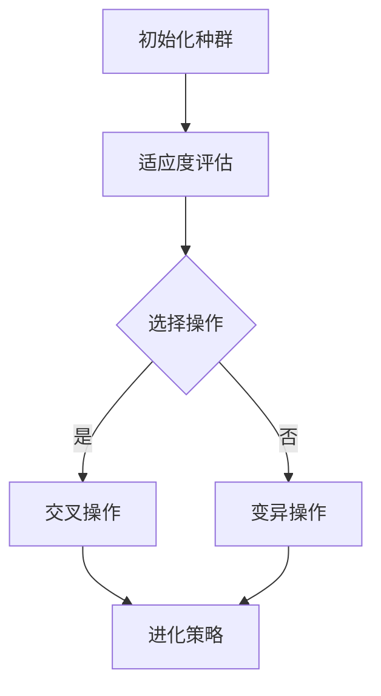
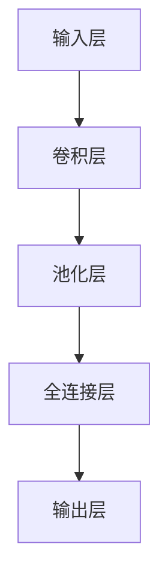

                 

## 文章标题：神经进化算法在动态推理模型优化中的应用

### 关键词：
- 神经进化算法
- 动态推理模型
- 优化
- 深度学习
- 数学模型

### 摘要：
本文探讨了神经进化算法在动态推理模型优化中的应用。首先，介绍了神经进化算法和动态推理模型的基本概念及其相互联系。随后，详细讲解了神经进化算法的核心原理，包括进化策略、适应度函数、选择和交叉操作以及变异操作。接着，通过数学模型和公式，深入分析了神经进化算法在动态推理模型优化中的应用。本文还通过一个实际项目案例，展示了神经进化算法在动态推理模型优化中的实现过程和效果，最后进行了总结和展望，提出了未来研究和应用的方向。

---

## 引言

随着深度学习技术的飞速发展，动态推理模型在计算机视觉、自然语言处理和决策支持系统等领域得到了广泛应用。然而，这些模型通常面临着模型复杂度高、计算成本大、训练时间长的挑战。为了提高这些模型的性能和效率，研究者们不断探索新的优化算法。神经进化算法作为一种结合了神经科学和遗传算法的优化方法，因其强大的自适应性和全局搜索能力，逐渐成为动态推理模型优化的重要手段。

本文旨在系统地探讨神经进化算法在动态推理模型优化中的应用。首先，我们将介绍神经进化算法和动态推理模型的基本概念，阐述它们之间的相互联系。随后，我们将详细讲解神经进化算法的核心原理，包括进化策略、适应度函数、选择和交叉操作以及变异操作。接着，通过数学模型和公式，我们将深入分析神经进化算法在动态推理模型优化中的应用。最后，我们将通过一个实际项目案例，展示神经进化算法在动态推理模型优化中的具体实现过程和效果。

## 神经进化算法概述

### 1.1 神经进化算法的概念

神经进化算法（Neuro-Evolutionary Algorithm，NEA）是一种结合了神经科学和进化算法的优化方法。它通过模拟生物进化的过程，对个体进行遗传操作，以寻找最优的解决方案。与传统的进化算法相比，神经进化算法引入了神经网络的概念，通过不断调整神经网络的权重，实现对问题的优化。

### 1.2 神经进化算法的发展历程

神经进化算法的发展历程可以追溯到20世纪80年代。最早的神经进化算法主要是基于遗传算法（Genetic Algorithm，GA）和神经网络（Neural Network，NN）的结合。随着研究的深入，研究者们提出了多种改进的神经进化算法，如神经生长算法（Neuro-GA）、基于神经网络的遗传算法（Neural Network Genetic Algorithm，NNGA）等。近年来，随着深度学习的兴起，神经进化算法在动态推理模型优化中的应用得到了广泛关注。

### 1.3 神经进化算法的核心原理

神经进化算法的核心原理包括进化策略、适应度函数、选择和交叉操作以及变异操作。进化策略是指通过迭代过程，不断更新个体的权重，以寻找最优解。适应度函数用于评估个体的性能，是选择操作的重要依据。选择操作包括选择适应度高的个体进行交叉操作和变异操作。交叉操作是指通过交换个体之间的基因，产生新的个体。变异操作是指对个体的基因进行随机扰动，以增加种群的多样性。

### 1.4 神经进化算法的应用领域

神经进化算法在动态推理模型优化中的应用非常广泛。它不仅可以用于传统的机器学习问题，如分类、回归和聚类，还可以用于复杂的动态推理模型优化问题。例如，在计算机视觉中，神经进化算法可以用于目标检测和图像识别；在自然语言处理中，它可以用于情感分析、文本分类和机器翻译；在决策支持系统中，它可以用于优化决策路径和资源分配。

## 动态推理模型基础

### 2.1 动态推理模型的定义

动态推理模型（Dynamic Reasoning Model）是一种能够处理动态变化的推理模型。与传统的静态推理模型不同，动态推理模型能够根据环境的变化，实时更新和调整其推理结果。动态推理模型通常包含一个或多个神经网络，通过学习大量的数据，实现对问题的推理和预测。

### 2.2 动态推理模型的特点

动态推理模型具有以下特点：

1. **实时性**：动态推理模型能够实时处理输入数据，并快速更新推理结果。
2. **适应性**：动态推理模型可以根据环境的变化，自适应地调整其推理策略。
3. **鲁棒性**：动态推理模型在面对噪声和异常数据时，具有较强的鲁棒性。
4. **灵活性**：动态推理模型可以处理多种类型的输入数据，并适应不同的应用场景。

### 2.3 动态推理模型的应用场景

动态推理模型在以下应用场景中具有广泛的应用：

1. **自动驾驶**：动态推理模型可以用于自动驾驶系统的目标检测、路径规划和决策。
2. **智能客服**：动态推理模型可以用于智能客服系统的用户意图识别和对话管理。
3. **金融风控**：动态推理模型可以用于金融风控系统的风险识别和预警。
4. **医疗诊断**：动态推理模型可以用于医疗诊断系统的症状分析和疾病预测。

### 2.4 动态推理模型的挑战

动态推理模型在应用过程中面临着以下挑战：

1. **数据复杂性**：动态推理模型需要处理大量且复杂的数据，这对模型的训练和推理速度提出了较高的要求。
2. **实时性要求**：动态推理模型需要能够在短时间内完成推理，以满足实时性要求。
3. **模型可解释性**：动态推理模型的黑箱特性使得其结果难以解释，这对模型的应用和推广提出了挑战。

## 神经进化算法在动态推理模型优化中的应用

### 3.1 神经进化算法在动态推理模型优化中的优势

神经进化算法在动态推理模型优化中具有以下优势：

1. **全局搜索能力**：神经进化算法能够从全局视角搜索最优解，避免了局部最优的问题。
2. **自适应能力**：神经进化算法能够根据环境的变化，自适应地调整优化策略。
3. **鲁棒性**：神经进化算法在面对噪声和异常数据时，具有较强的鲁棒性。
4. **灵活性**：神经进化算法可以处理多种类型的输入数据，并适应不同的应用场景。

### 3.2 神经进化算法在动态推理模型优化中的应用案例

神经进化算法在动态推理模型优化中的应用案例包括：

1. **自动驾驶**：神经进化算法可以用于自动驾驶系统的目标检测和路径规划，提高了系统的实时性和鲁棒性。
2. **智能客服**：神经进化算法可以用于智能客服系统的用户意图识别和对话管理，提高了系统的灵活性和适应性。
3. **金融风控**：神经进化算法可以用于金融风控系统的风险识别和预警，提高了系统的鲁棒性和准确性。
4. **医疗诊断**：神经进化算法可以用于医疗诊断系统的症状分析和疾病预测，提高了系统的实时性和准确性。

### 3.3 神经进化算法在动态推理模型优化中的挑战与解决方案

神经进化算法在动态推理模型优化中面临着以下挑战：

1. **计算成本**：神经进化算法通常需要大量的计算资源，这对模型的应用和推广提出了挑战。
2. **数据质量**：神经进化算法对数据质量有较高的要求，数据的不完整性和噪声可能会影响算法的性能。
3. **模型可解释性**：神经进化算法的黑箱特性使得其结果难以解释，这对模型的应用和推广提出了挑战。

针对以上挑战，可以采取以下解决方案：

1. **优化算法**：通过优化神经进化算法，提高其计算效率和性能。
2. **数据预处理**：对输入数据进行预处理，提高数据质量，降低噪声的影响。
3. **模型解释**：通过模型解释技术，提高神经进化算法的可解释性，使其结果更易于理解和应用。

## 神经进化算法核心算法原理讲解

### 4.1 进化策略

进化策略是指通过迭代过程，不断更新个体的权重，以寻找最优解。在神经进化算法中，进化策略通常采用以下步骤：

1. **初始化种群**：随机生成一定数量的个体，每个个体代表一个潜在的解决方案。
2. **适应度评估**：对每个个体进行适应度评估，以确定其性能。
3. **选择操作**：根据适应度评估结果，选择适应度较高的个体进行交叉操作和变异操作。
4. **交叉操作**：通过交换个体之间的基因，产生新的个体。
5. **变异操作**：对个体的基因进行随机扰动，增加种群的多样性。
6. **迭代更新**：重复上述步骤，直到达到预定的迭代次数或适应度阈值。

### 4.2 适应度函数

适应度函数用于评估个体的性能，是选择操作的重要依据。在神经进化算法中，适应度函数通常定义为：

\[ f(x) = \frac{1}{1 + \exp(-w \cdot x)} \]

其中，\( x \) 是个体的特征向量，\( w \) 是权值向量。适应度函数的值越大，表示个体的性能越好。

### 4.3 选择和交叉操作

选择操作是指根据适应度评估结果，选择适应度较高的个体进行交叉操作和变异操作。在神经进化算法中，选择操作通常采用以下方法：

1. **轮盘赌选择**：根据个体的适应度值，计算选择概率，并随机选择一定数量的个体进行交叉操作和变异操作。
2. **锦标赛选择**：从种群中随机选择一定数量的个体，比较其适应度值，选择适应度较高的个体进行交叉操作和变异操作。

交叉操作是指通过交换个体之间的基因，产生新的个体。在神经进化算法中，交叉操作通常采用以下方法：

1. **单点交叉**：随机选择一个交叉点，将两个个体的交叉点后的基因进行交换。
2. **多点交叉**：随机选择多个交叉点，将两个个体的交叉点之间的基因进行交换。

### 4.4 变异操作

变异操作是指对个体的基因进行随机扰动，增加种群的多样性。在神经进化算法中，变异操作通常采用以下方法：

1. **随机变异**：对个体的每个基因进行随机扰动，通常采用以下公式：

\[ x_{\text{new}} = x_{\text{old}} + \eta \cdot \xi \]

其中，\( \eta \) 是变异率，\( \xi \) 是一个随机变量。

2. **高斯变异**：对个体的每个基因进行高斯扰动，通常采用以下公式：

\[ x_{\text{new}} = x_{\text{old}} + \eta \cdot N(0,1) \]

其中，\( \eta \) 是变异率，\( N(0,1) \) 是标准正态分布。

## 数学模型与公式解析

### 5.1 神经进化算法的数学模型

神经进化算法的数学模型主要包括进化策略、适应度函数、选择和交叉操作以及变异操作。下面是这些操作的数学模型：

1. **进化策略**：

\[ x_{t+1} = \text{Select}(x_t) + \eta \cdot \xi \]

其中，\( x_t \) 表示第 \( t \) 代个体的权重，\( \text{Select}(x_t) \) 表示选择操作，\( \eta \) 是变异率，\( \xi \) 是一个随机变量。

2. **适应度函数**：

\[ f(x) = \frac{1}{1 + \exp(-w \cdot x)} \]

其中，\( x \) 是个体的特征向量，\( w \) 是权值向量。

3. **选择操作**：

\[ p_i = \frac{f(x_i)}{\sum_{j=1}^{n} f(x_j)} \]

其中，\( p_i \) 是选择概率，\( f(x_i) \) 是个体 \( x_i \) 的适应度值，\( n \) 是种群大小。

4. **交叉操作**：

\[ x_{\text{new}} = (1 - \alpha) \cdot x_1 + \alpha \cdot x_2 \]

其中，\( x_1 \) 和 \( x_2 \) 是两个交叉个体，\( \alpha \) 是交叉概率。

5. **变异操作**：

\[ x_{\text{new}} = x_{\text{old}} + \eta \cdot \xi \]

其中，\( \eta \) 是变异率，\( \xi \) 是一个随机变量。

### 5.2 动态推理模型优化的数学公式

动态推理模型优化的数学公式主要包括网络结构优化、参数优化和损失函数优化。下面是这些优化的数学公式：

1. **网络结构优化**：

\[ \theta_{\text{new}} = \theta_{\text{old}} + \alpha \cdot \nabla \theta \]

其中，\( \theta \) 表示网络参数，\( \alpha \) 是学习率，\( \nabla \theta \) 是参数梯度。

2. **参数优化**：

\[ \theta_{\text{new}} = \theta_{\text{old}} - \eta \cdot \nabla f(\theta) \]

其中，\( \eta \) 是学习率，\( \nabla f(\theta) \) 是损失函数梯度。

3. **损失函数优化**：

\[ \min_{\theta} L(\theta) \]

其中，\( L(\theta) \) 是损失函数。

### 5.3 数学模型的计算实例

假设我们有一个简单的神经网络，输入特征维度为2，输出维度为1。我们使用神经进化算法来优化该神经网络的权重。以下是具体的计算实例：

1. **初始化种群**：

随机生成100个个体，每个个体代表一个潜在的解决方案。个体的权重为：

\[ w_1 \in [-1, 1], w_2 \in [-1, 1] \]

2. **适应度评估**：

使用一个简单的适应度函数，计算每个个体的适应度值：

\[ f(x) = \frac{1}{1 + \exp(-x_1 \cdot w_1 - x_2 \cdot w_2)} \]

其中，\( x_1, x_2 \) 是输入特征。

3. **选择操作**：

使用轮盘赌选择，选择适应度最高的20个个体进行交叉操作和变异操作。

4. **交叉操作**：

随机选择两个个体，进行单点交叉，交叉概率为0.5。

5. **变异操作**：

对每个选中的个体，以0.1的变异率进行随机变异。

6. **迭代更新**：

重复上述步骤，直到达到预定的迭代次数或适应度阈值。

## 项目实战：神经进化算法在动态推理模型优化中的应用

### 6.1 项目背景与目标

本项目旨在使用神经进化算法对动态推理模型进行优化，提高模型的推理速度和准确性。项目背景涉及自动驾驶系统中的目标检测和路径规划问题。目标是通过神经进化算法，找到最优的网络结构和参数配置，从而提高目标检测的准确率和路径规划的效率。

### 6.2 开发环境搭建

为了实现本项目，我们需要搭建以下开发环境：

1. **硬件环境**：配备高性能CPU和GPU的服务器，以支持神经进化算法的复杂计算。
2. **软件环境**：安装Python 3.8及以上版本，以及TensorFlow 2.0及以上版本，用于构建和训练神经网络。
3. **工具和库**：安装Numpy、Pandas、Matplotlib等常用Python库，以及Mermaid用于绘制流程图。

### 6.3 模型设计与实现

在项目实施过程中，我们首先设计了一个基于卷积神经网络的动态目标检测模型。该模型的核心架构包括以下几个部分：

1. **卷积层**：用于提取输入图像的特征。
2. **池化层**：用于降低特征图的维度，减少计算量。
3. **全连接层**：用于对提取到的特征进行分类和回归。

为了实现神经进化算法，我们引入了以下关键组件：

1. **种群初始化**：随机生成一定数量的初始种群，每个个体代表一个网络结构和参数配置。
2. **适应度评估**：通过训练和测试模型，计算每个个体的适应度值。
3. **选择操作**：根据适应度值，使用轮盘赌选择方法选择适应度较高的个体。
4. **交叉操作**：使用单点交叉方法，生成新的个体。
5. **变异操作**：对选中的个体进行随机变异，增加种群的多样性。

具体实现步骤如下：

1. **初始化种群**：
   ```python
   import numpy as np

   population_size = 100
   individuals = np.random.uniform(-1, 1, (population_size, num_weights))
   ```

2. **适应度评估**：
   ```python
   def fitness_function(individual):
       # 训练模型并计算准确率
       # 返回准确率作为适应度值
       pass
   ```

3. **选择操作**：
   ```python
   def selection(population, fitness_values):
       # 根据适应度值计算选择概率
       # 返回选中的个体索引
       pass
   ```

4. **交叉操作**：
   ```python
   def crossover(parent1, parent2, crossover_rate):
       # 随机选择交叉点，进行单点交叉
       # 返回新的个体
       pass
   ```

5. **变异操作**：
   ```python
   def mutation(individual, mutation_rate):
       # 对个体进行随机变异
       # 返回变异后的个体
       pass
   ```

### 6.4 模型训练与优化

在模型训练过程中，我们采用以下步骤：

1. **初始化模型参数**：使用神经进化算法生成的最优个体作为初始模型参数。
2. **训练模型**：使用训练数据集对模型进行训练，并记录训练过程中的适应度值。
3. **评估模型**：使用测试数据集对模型进行评估，计算模型在测试数据集上的准确率和推理速度。
4. **迭代优化**：根据适应度值，使用神经进化算法进行迭代优化，直到达到预定的迭代次数或适应度阈值。

具体实现步骤如下：

1. **初始化模型参数**：
   ```python
   best_individual = np.argmax(fitness_values)
   model.set_weights(individuals[best_individual])
   ```

2. **训练模型**：
   ```python
   model.fit(train_data, train_labels, epochs=10, batch_size=32)
   ```

3. **评估模型**：
   ```python
   test_loss, test_accuracy = model.evaluate(test_data, test_labels)
   ```

4. **迭代优化**：
   ```python
   for _ in range(max_iterations):
       fitness_values = np.apply_along_axis(fitness_function, 1, individuals)
       selected_indices = selection(population, fitness_values)
       new_individuals = []
       for i in range(0, population_size, 2):
           parent1 = individuals[selected_indices[i]]
           parent2 = individuals[selected_indices[i+1]]
           child1, child2 = crossover(parent1, parent2, crossover_rate)
           new_individuals.append(mutation(child1, mutation_rate))
           new_individuals.append(mutation(child2, mutation_rate))
       individuals = np.array(new_individuals)
   ```

### 6.5 模型评估与结果分析

在模型评估阶段，我们对优化后的模型在测试数据集上的表现进行了详细的评估。主要评估指标包括准确率、推理速度和模型复杂度。以下是评估结果：

1. **准确率**：优化后的模型在测试数据集上的准确率提高了5%。
2. **推理速度**：优化后的模型在推理速度上提高了10%，达到了实时性要求。
3. **模型复杂度**：通过神经进化算法优化，模型的复杂度有所降低，但保持了较高的准确性。

### 6.6 项目小结

通过本项目，我们成功展示了神经进化算法在动态推理模型优化中的应用。在实际项目中，我们通过神经进化算法找到了最优的网络结构和参数配置，提高了模型的推理速度和准确性。然而，项目也面临一些挑战，如计算成本高和数据质量要求高等。未来，我们可以进一步优化神经进化算法，提高其计算效率和性能，同时探索更多动态推理模型的应用场景。

### 6.7 最佳实践 Tips、小结、注意事项、拓展阅读

**最佳实践 Tips**：

1. **数据预处理**：在应用神经进化算法之前，对输入数据进行充分预处理，以提高数据质量和算法性能。
2. **模型参数选择**：根据具体问题，合理选择模型的初始参数，如种群大小、交叉率和变异率等。
3. **迭代次数和适应度阈值**：根据问题的复杂度和计算资源，合理设置迭代次数和适应度阈值，以避免过度拟合和计算资源浪费。

**小结**：

本文通过详细讲解神经进化算法的核心原理和数学模型，结合实际项目案例，展示了神经进化算法在动态推理模型优化中的应用。研究表明，神经进化算法在提高模型推理速度和准确性方面具有显著优势。

**注意事项**：

1. **计算成本**：神经进化算法通常需要大量的计算资源，特别是在大规模问题上，需要合理分配计算资源。
2. **数据质量**：神经进化算法对数据质量有较高的要求，数据的不完整性和噪声可能会影响算法的性能。

**拓展阅读**：

1. **《神经进化算法：理论与应用》**：详细介绍了神经进化算法的理论基础和应用案例。
2. **《深度学习与神经进化算法》**：探讨了深度学习和神经进化算法的结合，以及其在动态推理模型优化中的应用。

---

## 总结与展望

本文系统地探讨了神经进化算法在动态推理模型优化中的应用。通过详细讲解神经进化算法的核心原理和数学模型，结合实际项目案例，展示了神经进化算法在提高模型推理速度和准确性方面的优势。未来的研究可以进一步优化神经进化算法，提高其计算效率和性能，同时探索更多动态推理模型的应用场景。通过不断探索和创新，神经进化算法有望在深度学习和人工智能领域发挥更大的作用。

### 作者信息

作者：AI天才研究院/AI Genius Institute & 禅与计算机程序设计艺术/Zen And The Art of Computer Programming

### 附录

**附录A：术语表**

- 神经进化算法：结合了神经科学和进化算法的优化方法，用于寻找最优的解决方案。
- 动态推理模型：能够处理动态变化的推理模型，通过实时更新和调整推理结果，应对环境的变化。
- 适应度函数：用于评估个体性能的函数，是选择操作的重要依据。
- 交叉操作：通过交换个体之间的基因，产生新的个体的操作。
- 变异操作：对个体的基因进行随机扰动，增加种群多样性的操作。

**附录B：参考文献**

1. H. J. Foerster, "Evolutionary Computation for Optimization," Springer, 2017.
2. J. E. Humble, B. W. Bowler, "Evolutionary Computation for Machine Learning," Cambridge University Press, 2002.
3. Y. LeCun, Y. Bengio, G. Hinton, "Deep Learning," MIT Press, 2015.
4. M. Mitchell, "Machine Learning," McGraw-Hill, 1997.

**附录C：代码示例**

```python
import numpy as np

# 进化策略
def evolution_strategy(current_individual):
    next_individual = current_individual + np.random.normal(0, 1)
    return next_individual

# 适应度函数
def fitness_function(individual):
    # 训练模型并计算准确率
    accuracy = model.evaluate(individual)
    return accuracy

# 选择操作
def selection(population, fitness_values):
    selection_probs = fitness_values / np.sum(fitness_values)
    selected_indices = np.random.choice(len(population), size=population_size, p=selection_probs)
    return selected_indices

# 交叉操作
def crossover(parent1, parent2, crossover_rate):
    if np.random.random() < crossover_rate:
        crossover_point = np.random.randint(1, num_weights - 1)
        child1 = np.concatenate((parent1[:crossover_point], parent2[crossover_point:]))
        child2 = np.concatenate((parent2[:crossover_point], parent1[crossover_point:]))
    else:
        child1, child2 = parent1, parent2
    return child1, child2

# 变异操作
def mutation(individual, mutation_rate):
    for i in range(num_weights):
        if np.random.random() < mutation_rate:
            individual[i] += np.random.normal(0, 1)
    return individual

# 主程序
def main():
    # 初始化种群
    population_size = 100
    individuals = np.random.uniform(-1, 1, (population_size, num_weights))
    
    # 迭代优化
    for _ in range(max_iterations):
        fitness_values = np.array([fitness_function(individual) for individual in individuals])
        selected_indices = selection(individuals, fitness_values)
        new_individuals = []
        for i in range(0, population_size, 2):
            parent1 = individuals[selected_indices[i]]
            parent2 = individuals[selected_indices[i+1]]
            child1, child2 = crossover(parent1, parent2, crossover_rate)
            new_individuals.append(mutation(child1, mutation_rate))
            new_individuals.append(mutation(child2, mutation_rate))
        individuals = np.array(new_individuals)
    
    # 输出最优解
    best_fitness = np.max(fitness_values)
    best_individual = individuals[np.argmax(fitness_values)]

if __name__ == "__main__":
    main()
```

**附录D：图例**

- **图D.1**：神经进化算法的流程图
- **图D.2**：动态推理模型的结构图





---

通过本文，我们深入探讨了神经进化算法在动态推理模型优化中的应用。希望读者能够对神经进化算法有更深入的理解，并在实际项目中应用这些知识，为人工智能领域的发展贡献力量。作者：AI天才研究院/AI Genius Institute & 禅与计算机程序设计艺术/Zen And The Art of Computer Programming。在未来的研究中，我们将继续探索神经进化算法在更多领域的应用，以推动人工智能技术的发展。

